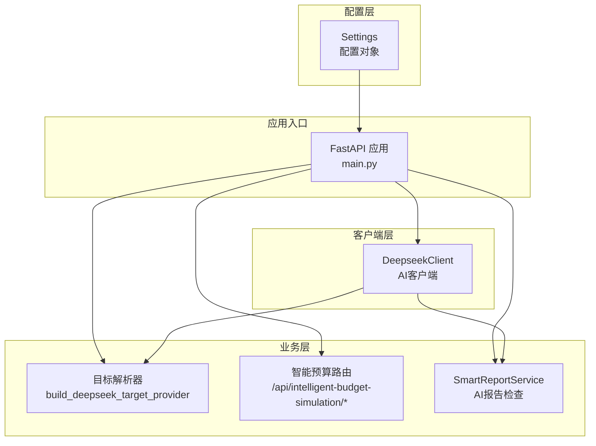
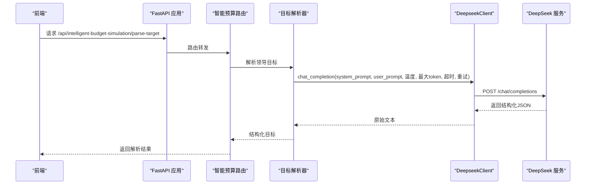
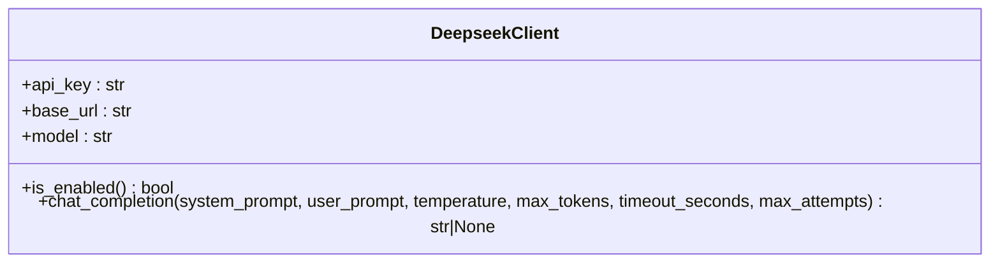
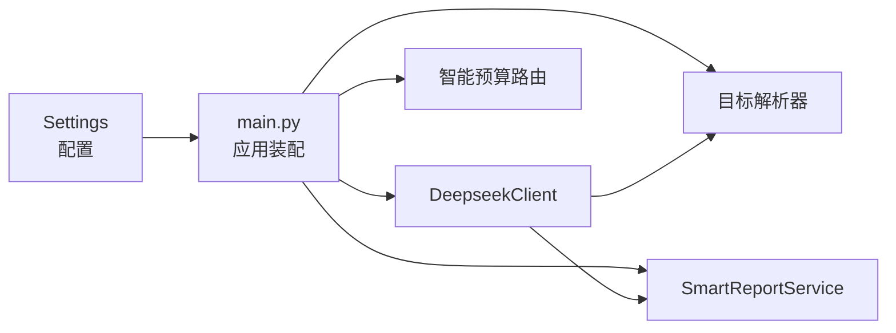

# AI服务配置

<cite>
**本文引用的文件**
- [deepseek_client.py](file://apps/api/app/deepseek_client.py)
- [config.py](file://apps/api/app/config.py)
- [main.py](file://apps/api/app/main.py)
- [intelligent_budget_target_parser.py](file://apps/api/app/services/intelligent_budget_target_parser.py)
- [intelligent_budget_simulation.py](file://apps/api/app/routers/intelligent_budget_simulation.py)
- [smart_report_service.py](file://apps/api/app/services/smart_report_service.py)
</cite>

## 目录
1. [简介](#简介)
2. [项目结构](#项目结构)
3. [核心组件](#核心组件)
4. [架构总览](#架构总览)
5. [组件详解](#组件详解)
6. [依赖关系分析](#依赖关系分析)
7. [性能与稳定性](#性能与稳定性)
8. [故障排查指南](#故障排查指南)
9. [结论](#结论)
10. [附录：配置示例与最佳实践](#附录配置示例与最佳实践)

## 简介
本文件面向“智能预算预测系统”的AI服务配置，聚焦于DeepSeek大模型API的接入与使用，覆盖以下主题：
- DeepSeek API的配置项：API密钥、基础URL、模型名称
- AI客户端类的实现原理与关键参数：温度、最大token、超时、重试次数
- AI服务启用条件与禁用机制
- 错误处理与重试策略
- 在预算目标解析与智能预算模拟中的应用
- 不同场景下的配置建议与最佳实践
- 常见问题与解决思路

## 项目结构
围绕AI服务的关键文件与职责如下：
- 配置层：通过设置对象集中管理AI相关参数（API密钥、基础URL、模型名）
- 客户端层：封装HTTP调用、参数组装、错误处理与重试
- 业务层：在预算目标解析与智能预算模拟中按需启用AI能力
- 应用入口：在启动阶段装配客户端并注入到相关服务

图表来源
- [config.py:9-41](file://apps/api/app/config.py#L9-L41)
- [main.py:132-147](file://apps/api/app/main.py#L132-L147)
- [deepseek_client.py:9-70](file://apps/api/app/deepseek_client.py#L9-L70)
- [intelligent_budget_target_parser.py:97-114](file://apps/api/app/services/intelligent_budget_target_parser.py#L97-L114)
- [intelligent_budget_simulation.py:116-178](file://apps/api/app/routers/intelligent_budget_simulation.py#L116-L178)
- [smart_report_service.py:121-200](file://apps/api/app/services/smart_report_service.py#L121-L200)

章节来源
- [config.py:9-41](file://apps/api/app/config.py#L9-L41)
- [main.py:132-147](file://apps/api/app/main.py#L132-L147)

## 核心组件
- 设置对象（Settings）：集中定义AI相关配置项，包括API密钥、基础URL、模型名，并通过环境变量文件加载
- DeepseekClient：封装DeepSeek聊天接口调用，负责请求构造、鉴权头、超时、重试与响应解析
- 目标解析器：基于DeepseekClient构建JSON提供器，用于将领导的自然语言目标解析为结构化约束
- 智能预算路由：在任务创建前要求用户确认AI解析结果，保障可控性
- SmartReportService：在报告AI检查流程中调用DeepSeek进行内容解析与问题识别

章节来源
- [config.py:27-29](file://apps/api/app/config.py#L27-L29)
- [deepseek_client.py:9-70](file://apps/api/app/deepseek_client.py#L9-L70)
- [intelligent_budget_target_parser.py:97-114](file://apps/api/app/services/intelligent_budget_target_parser.py#L97-L114)
- [intelligent_budget_simulation.py:133-137](file://apps/api/app/routers/intelligent_budget_simulation.py#L133-L137)
- [smart_report_service.py:121-200](file://apps/api/app/services/smart_report_service.py#L121-L200)

## 架构总览
AI服务在系统中的位置与交互如下：

图表来源
- [intelligent_budget_simulation.py:129-131](file://apps/api/app/routers/intelligent_budget_simulation.py#L129-L131)
- [intelligent_budget_target_parser.py:97-114](file://apps/api/app/services/intelligent_budget_target_parser.py#L97-L114)
- [deepseek_client.py:18-69](file://apps/api/app/deepseek_client.py#L18-L69)

## 组件详解

### DeepseekClient 类
- 职责
  - 将系统提示词与用户提示词组合为消息数组
  - 设置Authorization与Content-Type头部
  - 使用httpx客户端发起POST请求至 /chat/completions
  - 处理5xx与429状态码并进行指数退避重试
  - 解析响应，提取第一条候选消息的内容
- 关键参数
  - 温度（temperature）：控制生成随机性，默认值在各调用点体现
  - 最大token（max_tokens）：限制输出长度
  - 超时（timeout_seconds）：单次请求超时时间
  - 重试次数（max_attempts）：失败或限流时的重试轮数
- 启用条件
  - 当API密钥非空时启用；否则直接返回None
- 错误处理
  - 对异常进行捕获与重试
  - 对空choices或空content返回None
  - 对5xx与429进行短暂等待后重试

图表来源
- [deepseek_client.py:9-70](file://apps/api/app/deepseek_client.py#L9-L70)

章节来源
- [deepseek_client.py:9-70](file://apps/api/app/deepseek_client.py#L9-L70)

### 设置对象（Settings）
- 配置项
  - deepseek_api_key：API密钥
  - deepseek_base_url：DeepSeek基础URL
  - deepseek_model：模型名称
- 加载方式
  - 通过环境变量文件加载，路径在配置对象中指定

章节来源
- [config.py:9-41](file://apps/api/app/config.py#L9-L41)

### 应用入口装配（main.py）
- 在应用启动时创建DeepseekClient实例，并注入到智能预算服务与Agent服务
- 将客户端传递给智能预算路由，以启用AI目标解析

章节来源
- [main.py:132-147](file://apps/api/app/main.py#L132-L147)

### 目标解析器（build_deepseek_target_provider）
- 构造DeepSeek JSON提供器，内部调用DeepseekClient.chat_completion
- 默认参数：温度较低、适中最大token、较短超时、单次重试
- 若客户端未启用或返回空，则抛出异常并回退到确定性解析

章节来源
- [intelligent_budget_target_parser.py:97-114](file://apps/api/app/services/intelligent_budget_target_parser.py#L97-L114)

### 智能预算路由（/api/intelligent-budget-simulation/*）
- parse-target：返回AI解析的目标结构
- tasks：创建任务前强制要求confirmed=true，避免未经确认的任务进入求解流程
- 任务持久化：使用SQLite存储任务状态与结果

章节来源
- [intelligent_budget_simulation.py:129-160](file://apps/api/app/routers/intelligent_budget_simulation.py#L129-L160)

### SmartReportService（AI报告检查）
- 在报告解析中调用DeepSeek，提取摘要、块级内容、问题与假设
- 若AI不可用或返回空，使用规则兜底解析并返回警告

章节来源
- [smart_report_service.py:161-200](file://apps/api/app/services/smart_report_service.py#L161-L200)

## 依赖关系分析
- 配置依赖：Settings为所有AI相关组件提供统一配置源
- 运行时依赖：main.py在启动时创建DeepseekClient并注入到多个服务
- 功能依赖：目标解析器依赖DeepseekClient；智能预算路由依赖目标解析器；报告检查依赖DeepseekClient

图表来源
- [config.py:9-41](file://apps/api/app/config.py#L9-L41)
- [main.py:132-147](file://apps/api/app/main.py#L132-L147)
- [intelligent_budget_target_parser.py:97-114](file://apps/api/app/services/intelligent_budget_target_parser.py#L97-L114)
- [intelligent_budget_simulation.py:116-178](file://apps/api/app/routers/intelligent_budget_simulation.py#L116-L178)
- [smart_report_service.py:121-200](file://apps/api/app/services/smart_report_service.py#L121-L200)

章节来源
- [config.py:9-41](file://apps/api/app/config.py#L9-L41)
- [main.py:132-147](file://apps/api/app/main.py#L132-L147)

## 性能与稳定性
- 超时与重试
  - 单次请求超时由客户端参数控制
  - 对5xx与429进行短暂等待后重试，降低瞬时故障影响
- 参数调优建议
  - 低温度（如0.1~0.2）适合结构化JSON解析，提升一致性
  - 适度增大max_tokens以容纳更复杂的JSON结构
  - 控制超时与重试次数平衡吞吐与稳定性
- 并发与资源
  - httpx.Client在每次调用内创建，避免跨请求共享状态
  - 建议在高并发场景评估连接池与全局超时策略

章节来源
- [deepseek_client.py:48-69](file://apps/api/app/deepseek_client.py#L48-L69)

## 故障排查指南
- AI服务未生效
  - 检查API密钥是否正确设置且非空
  - 确认基础URL与模型名配置正确
- 解析失败或返回空
  - 查看是否触发了5xx或429并被重试
  - 检查系统提示词与用户提示词是否清晰
  - 适当提高max_tokens与超时时间
- 目标解析回退
  - 当AI返回空或异常时会回退到确定性解析，注意检查警告信息
- 报告AI检查异常
  - 若AI不可用，将使用规则兜底解析并返回警告

章节来源
- [deepseek_client.py:27-28](file://apps/api/app/deepseek_client.py#L27-L28)
- [intelligent_budget_target_parser.py:110-112](file://apps/api/app/services/intelligent_budget_target_parser.py#L110-L112)
- [smart_report_service.py:181-181](file://apps/api/app/services/smart_report_service.py#L181-L181)

## 结论
本系统通过集中配置与轻量客户端实现了对DeepSeek的大模型能力接入。AI服务在预算目标解析与报告检查等场景中按需启用，具备明确的启用条件、错误处理与回退机制。通过合理设置温度、最大token、超时与重试参数，可在稳定性与准确性之间取得良好平衡。

## 附录：配置示例与最佳实践

- 配置项清单
  - deepseek_api_key：API密钥（必填）
  - deepseek_base_url：基础URL（默认值已内置）
  - deepseek_model：模型名称（默认值已内置）

- 典型调用参数建议
  - 目标解析（JSON结构化）：低温度、中等max_tokens、较短超时、单次重试
  - 报告检查（较长文本）：适度提高max_tokens与超时，保留有限重试
  - 通用对话：根据需求调整温度与max_tokens，关注超时与重试策略

- 启用条件与禁用机制
  - 当API密钥为空时，客户端返回None，相关功能自动降级
  - 智能预算任务创建前需要confirmed=true，避免未经确认的任务执行

- 错误处理与重试
  - 对5xx与429进行短暂等待后重试
  - 异常捕获与回退：返回None或触发确定性解析/规则兜底

- 常见问题
  - API密钥无效：检查密钥来源与权限
  - 响应为空：检查提示词质量与max_tokens设置
  - 超时频繁：适当增加超时与重试次数，或优化提示词长度

章节来源
- [config.py:27-29](file://apps/api/app/config.py#L27-L29)
- [intelligent_budget_target_parser.py:102-109](file://apps/api/app/services/intelligent_budget_target_parser.py#L102-L109)
- [smart_report_service.py:181-181](file://apps/api/app/services/smart_report_service.py#L181-L181)
- [intelligent_budget_simulation.py:135-137](file://apps/api/app/routers/intelligent_budget_simulation.py#L135-L137)