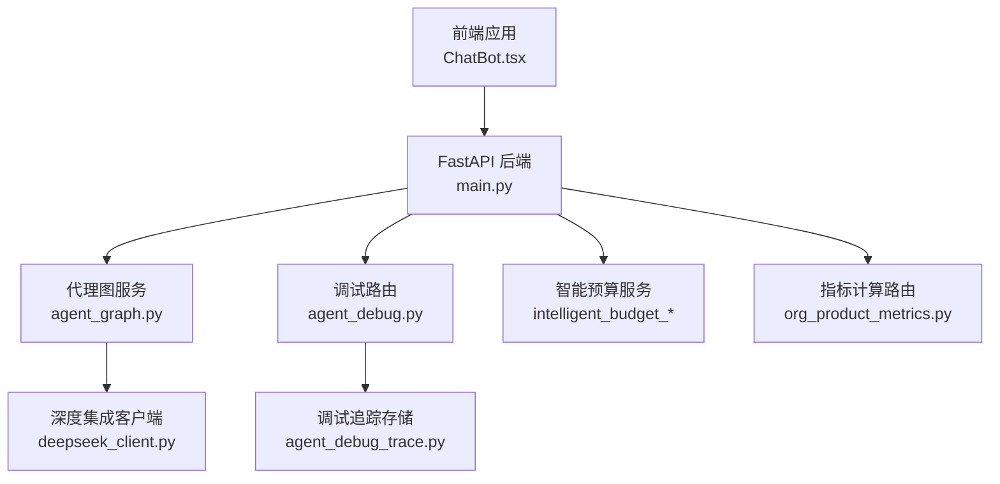
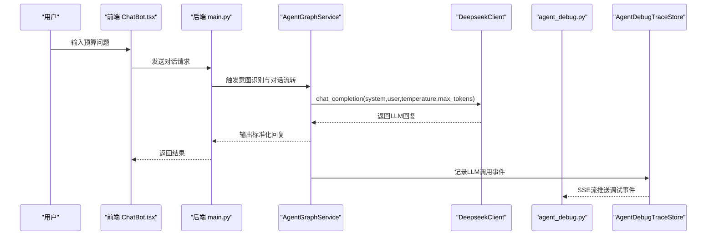
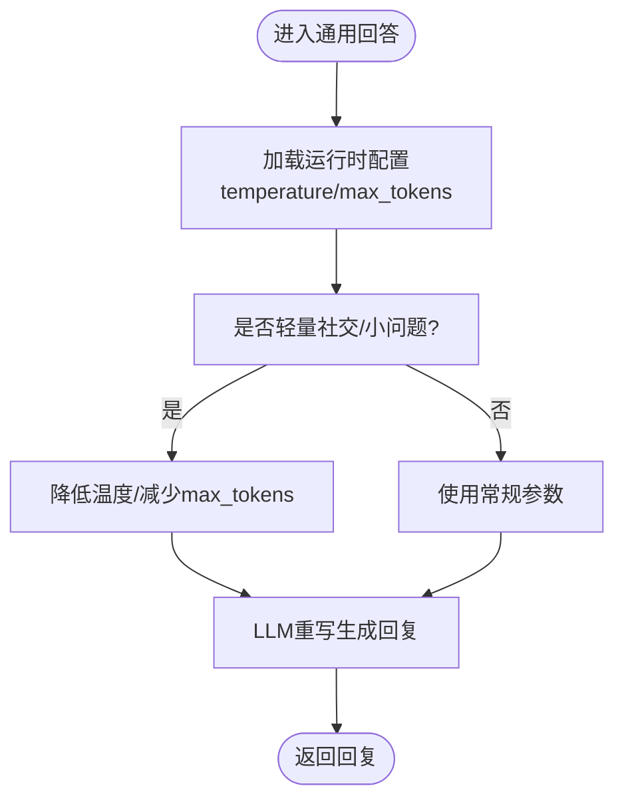
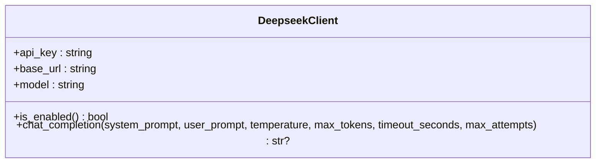
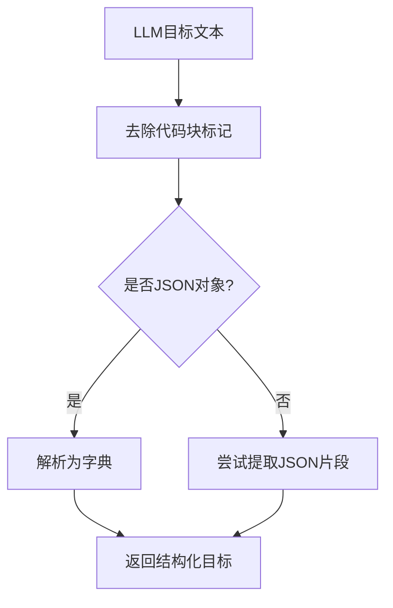
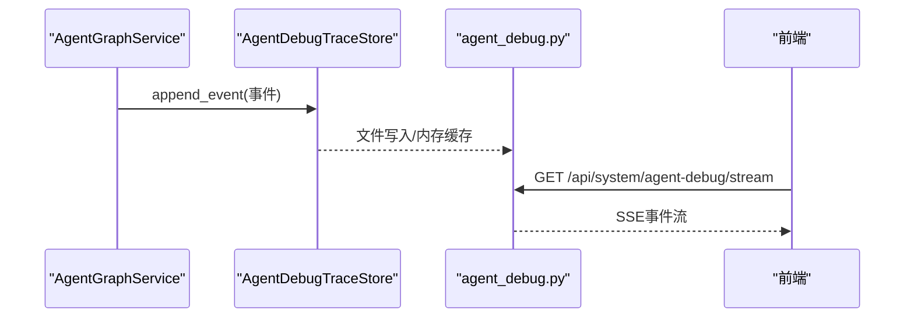
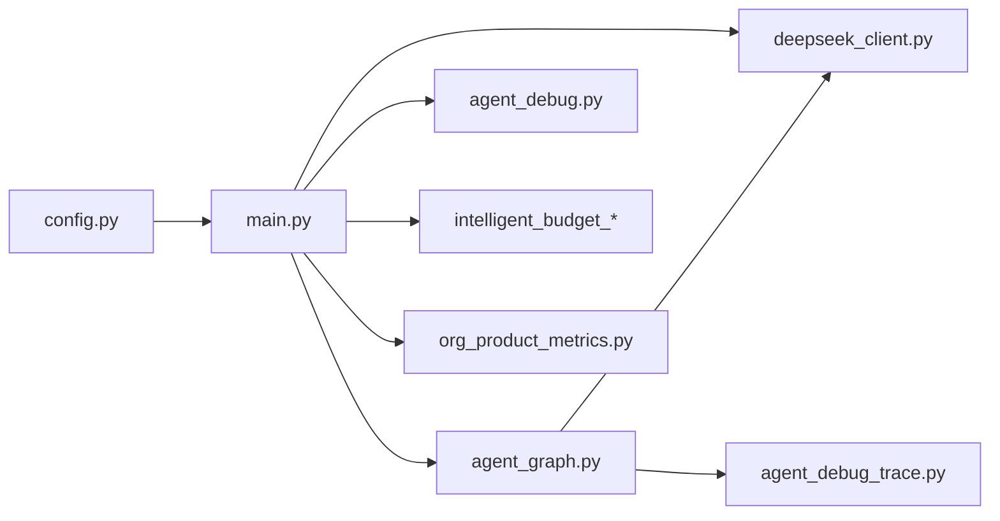

# AI模型调优

<cite>
**本文引用的文件**   
- [agent_graph.py](file://apps/api/app/agent_graph.py)
- [deepseek_client.py](file://apps/api/app/deepseek_client.py)
- [config.py](file://apps/api/app/config.py)
- [main.py](file://apps/api/app/main.py)
- [agent_debug_trace.py](file://apps/api/app/agent_debug_trace.py)
- [agent_debug.py](file://apps/api/app/routers/agent_debug.py)
- [intelligent_budget_target_parser.py](file://apps/api/app/services/intelligent_budget_target_parser.py)
- [intelligent_budget_scoring.py](file://apps/api/app/services/intelligent_budget_scoring.py)
- [intelligent_budget_solver.py](file://apps/api/app/services/intelligent_budget_solver.py)
- [org_product_metrics.py](file://apps/api/app/routers/org_product_metrics.py)
- [ChatBot.tsx](file://apps/web/src/app/components/ChatBot.tsx)
</cite>

## 目录
1. [简介](#简介)
2. [项目结构](#项目结构)
3. [核心组件](#核心组件)
4. [架构总览](#架构总览)
5. [详细组件分析](#详细组件分析)
6. [依赖分析](#依赖分析)
7. [性能考量](#性能考量)
8. [故障排除指南](#故障排除指南)
9. [结论](#结论)
10. [附录](#附录)

## 简介
本技术文档围绕智能预算预测系统的AI模型调优展开，重点覆盖以下方面：
- 模型参数调优策略：温度系数、最大token数、采样策略等关键参数的设置原则与适用场景
- 不同预算场景下的模型行为调整：在预测精度、响应速度与稳定性之间进行权衡
- 性能监控与评估指标：响应时间、准确率与用户满意度等
- 异常检测与故障排除机制：通过调试跟踪与日志实现可观测性
- 最佳实践与经验总结：参数配置、A/B测试与版本管理
- 成本控制与资源优化：API调用频率、超时与重试策略

## 项目结构
系统采用前后端分离架构，AI推理主要通过深度集成的LLM客户端发起请求，前端通过聊天组件与后端交互，后端路由负责参数注入与结果回传。

图表来源
- [main.py:132-147](file://apps/api/app/main.py#L132-L147)
- [agent_graph.py:148-177](file://apps/api/app/agent_graph.py#L148-L177)
- [deepseek_client.py:9-39](file://apps/api/app/deepseek_client.py#L9-L39)
- [agent_debug.py:13-45](file://apps/api/app/routers/agent_debug.py#L13-L45)
- [agent_debug_trace.py:16-101](file://apps/api/app/agent_debug_trace.py#L16-L101)
- [intelligent_budget_target_parser.py:97-114](file://apps/api/app/services/intelligent_budget_target_parser.py#L97-L114)
- [org_product_metrics.py:1289-5048](file://apps/api/app/routers/org_product_metrics.py#L1289-L5048)

章节来源
- [main.py:132-147](file://apps/api/app/main.py#L132-L147)
- [agent_graph.py:148-177](file://apps/api/app/agent_graph.py#L148-L177)

## 核心组件
- 代理图服务（AgentGraphService）：负责意图识别、对话流转、LLM重写与参数注入，提供运行时配置与调试追踪能力
- 深度集成客户端（DeepseekClient）：封装LLM调用，支持温度、最大token、超时与重试等参数
- 配置与启动（config.py、main.py）：集中管理模型接入参数与全局设置
- 调试与可观测性（agent_debug_trace.py、agent_debug.py）：提供事件持久化、SSE流与清理接口
- 智能预算服务（intelligent_budget_*）：目标解析、评分与求解流程，支撑预算场景的AI决策
- 指标计算路由（org_product_metrics.py）：预算口径与数据聚合，为AI提供结构化输入

章节来源
- [agent_graph.py:209-266](file://apps/api/app/agent_graph.py#L209-L266)
- [deepseek_client.py:18-39](file://apps/api/app/deepseek_client.py#L18-L39)
- [config.py:9-41](file://apps/api/app/config.py#L9-L41)
- [main.py:132-147](file://apps/api/app/main.py#L132-L147)
- [agent_debug_trace.py:16-101](file://apps/api/app/agent_debug_trace.py#L16-L101)
- [agent_debug.py:13-45](file://apps/api/app/routers/agent_debug.py#L13-L45)
- [intelligent_budget_target_parser.py:97-114](file://apps/api/app/services/intelligent_budget_target_parser.py#L97-L114)
- [intelligent_budget_scoring.py:45-60](file://apps/api/app/services/intelligent_budget_scoring.py#L45-L60)
- [intelligent_budget_solver.py:54-97](file://apps/api/app/services/intelligent_budget_solver.py#L54-L97)
- [org_product_metrics.py:1289-5048](file://apps/api/app/routers/org_product_metrics.py#L1289-L5048)

## 架构总览
下图展示了从用户输入到LLM推理再到结果返回的关键路径，以及调试追踪贯穿其中的观测链路。

图表来源
- [ChatBot.tsx:100-131](file://apps/web/src/app/components/ChatBot.tsx#L100-L131)
- [main.py:132-147](file://apps/api/app/main.py#L132-L147)
- [agent_graph.py:305-347](file://apps/api/app/agent_graph.py#L305-L347)
- [deepseek_client.py:18-39](file://apps/api/app/deepseek_client.py#L18-L39)
- [agent_debug.py:20-38](file://apps/api/app/routers/agent_debug.py#L20-L38)
- [agent_debug_trace.py:56-69](file://apps/api/app/agent_debug_trace.py#L56-L69)

## 详细组件分析

### 1) 运行时配置与参数注入
- 运行时配置（runtime_config）集中定义了意图路由阈值、通用回答温度与最大token、透视推荐信心阈值等
- 通用回答模块从配置读取温度与最大token，并在轻量社交与一般问答场景分别进行约束
- 意图仲裁模块在中等置信度区间调用LLM进行仲裁，确保预算领域问题的高召回与稳定

图表来源
- [agent_graph.py:209-266](file://apps/api/app/agent_graph.py#L209-L266)
- [agent_graph.py:638-731](file://apps/api/app/agent_graph.py#L638-L731)

章节来源
- [agent_graph.py:209-266](file://apps/api/app/agent_graph.py#L209-L266)
- [agent_graph.py:638-731](file://apps/api/app/agent_graph.py#L638-L731)

### 2) 深度集成客户端与参数策略
- 客户端封装chat_completion，支持温度、最大token、超时与重试次数
- 在意图仲裁与通用回答等关键路径上，温度被严格约束以提升确定性
- 超时与重试参数用于保障前端体验与系统稳定性

图表来源
- [deepseek_client.py:9-39](file://apps/api/app/deepseek_client.py#L9-L39)

章节来源
- [deepseek_client.py:18-39](file://apps/api/app/deepseek_client.py#L18-L39)

### 3) 智能预算目标解析与评分
- 目标解析服务将LLM输出解析为JSON，严格限定温度与最大token，保证结构化输入质量
- 评分函数综合利润增长偏差、拨备覆盖率、差异得分与风险动作难度等指标，形成可排序的综合分数

图表来源
- [intelligent_budget_target_parser.py:80-114](file://apps/api/app/services/intelligent_budget_target_parser.py#L80-L114)

章节来源
- [intelligent_budget_target_parser.py:80-114](file://apps/api/app/services/intelligent_budget_target_parser.py#L80-L114)
- [intelligent_budget_scoring.py:45-60](file://apps/api/app/services/intelligent_budget_scoring.py#L45-L60)

### 4) 调试追踪与可观测性
- 调试追踪存储支持内存队列与文件持久化，提供最近事件查询、增量流式获取与清空能力
- 调试路由提供SSE流接口，前端通过EventSource订阅实时事件，便于联调与问题定位

图表来源
- [agent_debug_trace.py:56-101](file://apps/api/app/agent_debug_trace.py#L56-L101)
- [agent_debug.py:20-38](file://apps/api/app/routers/agent_debug.py#L20-L38)

章节来源
- [agent_debug_trace.py:16-101](file://apps/api/app/agent_debug_trace.py#L16-L101)
- [agent_debug.py:13-45](file://apps/api/app/routers/agent_debug.py#L13-L45)

### 5) 指标计算与预算口径
- 指标计算路由负责组织指标树、按月聚合与年度汇总，为AI提供稳定的结构化数据输入
- 支持缓存与访问控制，兼顾准确性与性能

章节来源
- [org_product_metrics.py:1289-5048](file://apps/api/app/routers/org_product_metrics.py#L1289-L5048)

## 依赖分析
- AgentGraphService依赖DeepseekClient进行LLM调用，并通过运行时配置控制参数
- main.py负责装配DeepseekClient与AgentGraphService，统一注入到路由
- 调试链路贯穿AgentGraphService与AgentDebugTraceStore，形成闭环可观测性
- 智能预算服务与指标路由为AI提供结构化输入与计算支撑

图表来源
- [config.py:9-41](file://apps/api/app/config.py#L9-L41)
- [main.py:132-147](file://apps/api/app/main.py#L132-L147)
- [agent_graph.py:148-177](file://apps/api/app/agent_graph.py#L148-L177)
- [deepseek_client.py:9-39](file://apps/api/app/deepseek_client.py#L9-L39)
- [agent_debug_trace.py:16-101](file://apps/api/app/agent_debug_trace.py#L16-L101)
- [agent_debug.py:13-45](file://apps/api/app/routers/agent_debug.py#L13-L45)
- [intelligent_budget_target_parser.py:97-114](file://apps/api/app/services/intelligent_budget_target_parser.py#L97-L114)
- [org_product_metrics.py:1289-5048](file://apps/api/app/routers/org_product_metrics.py#L1289-L5048)

章节来源
- [config.py:9-41](file://apps/api/app/config.py#L9-L41)
- [main.py:132-147](file://apps/api/app/main.py#L132-L147)

## 性能考量
- 温度与最大token的权衡
  - 高温度适合创意与开放式问答，低温度提升确定性，适合预算口径与结构化输出
  - 最大token影响响应长度与成本，需结合业务目标与SLA设定上限
- 超时与重试
  - 合理的超时与重试次数可提升稳定性，避免阻塞前端交互
- 缓存与预热
  - 指标计算与历史对话可引入缓存，降低重复计算与LLM调用频次
- 并发与限流
  - 对LLM调用进行并发限制与排队，防止突发流量导致延迟飙升

## 故障排除指南
- 启用调试追踪
  - 通过调试路由订阅SSE事件，观察LLM调用输入、输出与错误信息
- 关键检查点
  - API密钥与模型配置是否正确
  - 温度与最大token是否符合当前场景
  - 超时与重试参数是否合理
- 常见问题
  - LLM返回为空：检查模型可用性与网络连通性
  - 回复不稳定：降低温度、缩短最大token或增加重试
  - 前端卡顿：检查后端限流与缓存策略

章节来源
- [agent_debug.py:20-38](file://apps/api/app/routers/agent_debug.py#L20-L38)
- [agent_debug_trace.py:56-101](file://apps/api/app/agent_debug_trace.py#L56-L101)
- [deepseek_client.py:18-39](file://apps/api/app/deepseek_client.py#L18-L39)

## 结论
通过对运行时配置、LLM参数策略、可观测性与预算服务的协同设计，系统在不同预算场景下实现了对精度、速度与稳定性的平衡。建议持续以调试追踪与指标计算为基础，迭代优化参数与流程，逐步建立A/B测试与版本管理机制，以实现模型调优的闭环。

## 附录

### A. 参数调优策略与场景建议
- 预算口径问答（高确定性）
  - 温度：较低；最大token：适中；采样：禁用
- 开放式讨论（创意性）
  - 温度：中高；最大token：较高；采样：启用
- 快速回复（轻量社交）
  - 温度：很低；最大token：很小；采样：禁用

章节来源
- [agent_graph.py:209-266](file://apps/api/app/agent_graph.py#L209-L266)
- [agent_graph.py:638-731](file://apps/api/app/agent_graph.py#L638-L731)

### B. 版本管理与A/B测试
- 版本管理
  - 将运行时配置文件化，支持热更新与回滚
- A/B测试
  - 通过参数分桶与指标对比，评估不同参数组合的效果
- 成本控制
  - 限制最大token、设置超时与重试上限、引入缓存与预热

章节来源
- [agent_graph.py:249-266](file://apps/api/app/agent_graph.py#L249-L266)
- [deepseek_client.py:18-39](file://apps/api/app/deepseek_client.py#L18-L39)