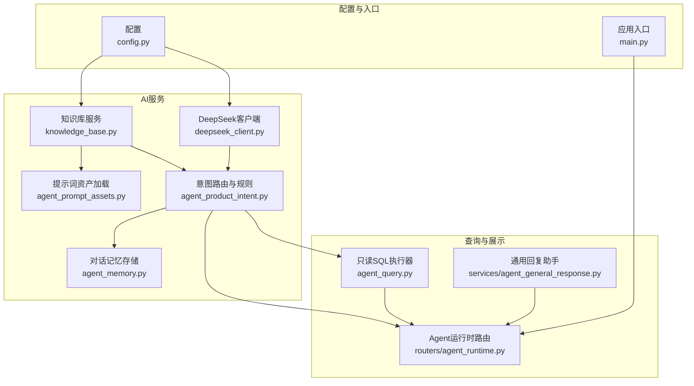
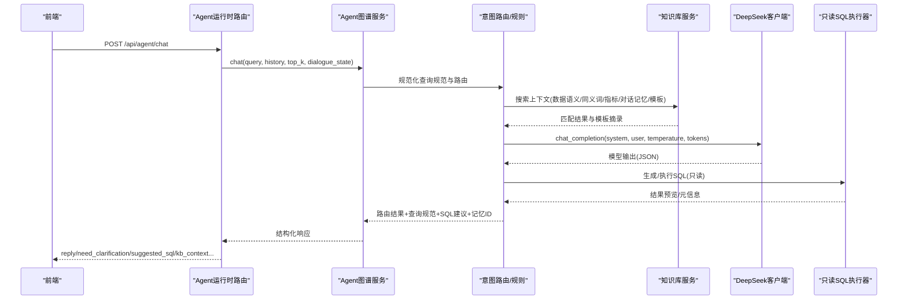
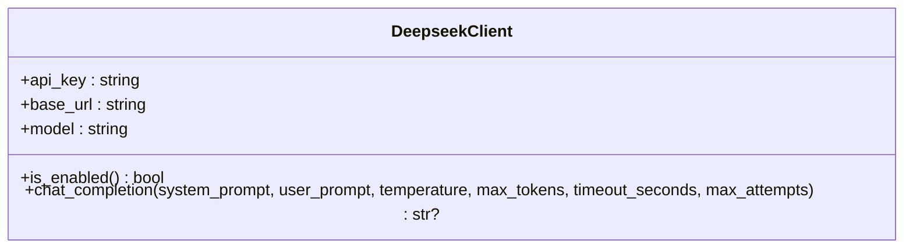
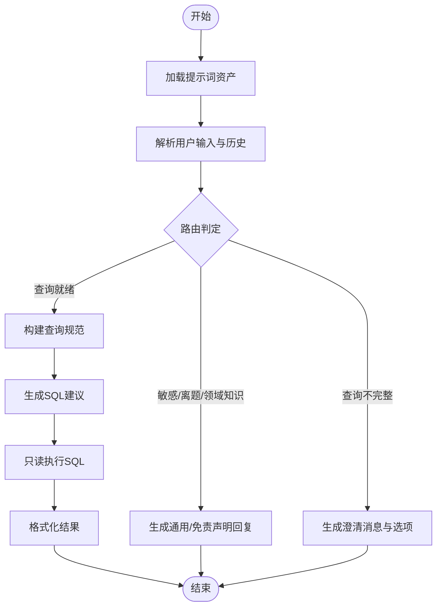
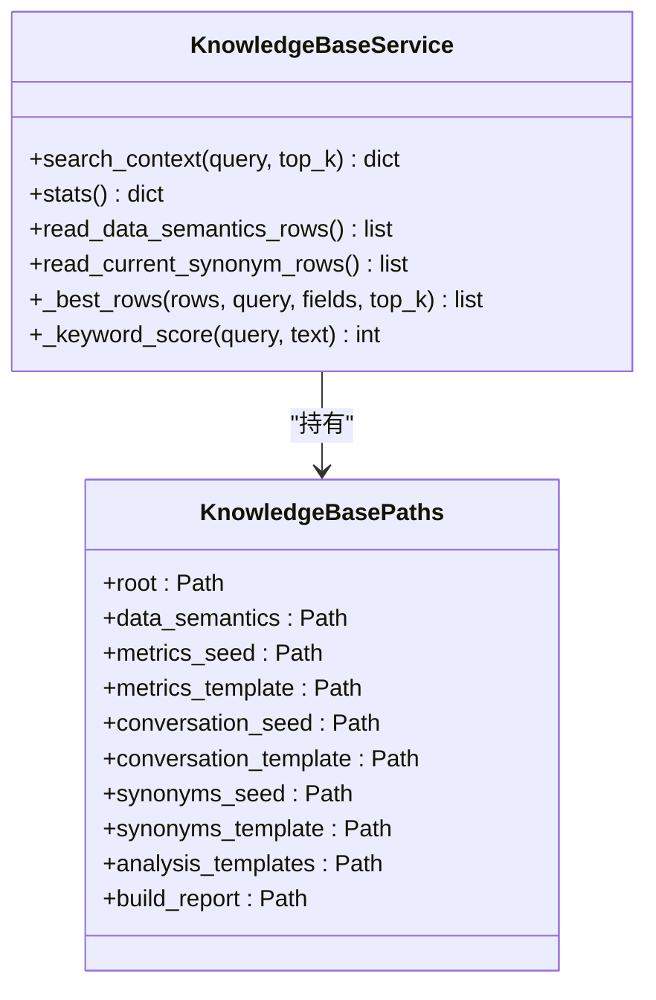
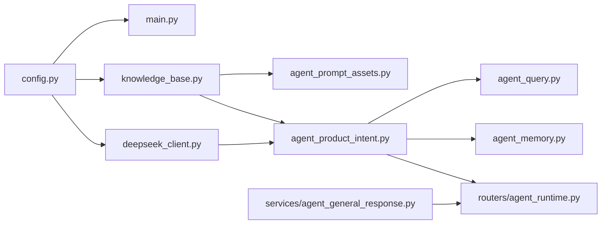

# AI集成文档

<cite>
**本文档引用的文件**
- [apps/api/app/config.py](file://apps/api/app/config.py)
- [apps/api/app/deepseek_client.py](file://apps/api/app/deepseek_client.py)
- [apps/api/app/knowledge_base.py](file://apps/api/app/knowledge_base.py)
- [apps/api/app/agent_prompt_assets.py](file://apps/api/app/agent_prompt_assets.py)
- [apps/api/app/agent_memory.py](file://apps/api/app/agent_memory.py)
- [apps/api/app/agent_product_intent.py](file://apps/api/app/agent_product_intent.py)
- [apps/api/app/agent_query.py](file://apps/api/app/agent_query.py)
- [apps/api/app/routers/agent_runtime.py](file://apps/api/app/routers/agent_runtime.py)
- [apps/api/app/services/agent_general_response.py](file://apps/api/app/services/agent_general_response.py)
- [apps/api/app/main.py](file://apps/api/app/main.py)
- [resources/knowledge_base/06_agent_prompts/README.md](file://resources/knowledge_base/06_agent_prompts/README.md)
- [resources/knowledge_base/06_agent_prompts/product_manager_intent_system.md](file://resources/knowledge_base/06_agent_prompts/product_manager_intent_system.md)
- [resources/knowledge_base/06_agent_prompts/product_manager_intent_user.md](file://resources/knowledge_base/06_agent_prompts/product_manager_intent_user.md)
- [resources/knowledge_base/06_agent_prompts/product_manager_intent_messages.json](file://resources/knowledge_base/06_agent_prompts/product_manager_intent_messages.json)
</cite>

## 目录
1. [简介](#简介)
2. [项目结构](#项目结构)
3. [核心组件](#核心组件)
4. [架构总览](#架构总览)
5. [组件详解](#组件详解)
6. [依赖关系分析](#依赖关系分析)
7. [性能与稳定性](#性能与稳定性)
8. [故障排除指南](#故障排除指南)
9. [结论](#结论)
10. [附录](#附录)

## 简介
本文件面向智能预算预测系统的AI集成功能，系统化阐述AI服务配置、DeepSeek大模型API的集成方式与使用方法，覆盖提示词工程、Agent技能体系、知识库管理与维护、AI驱动的预算预测原理与智能分析算法、决策支持机制、Agent技能开发与扩展、知识库版本管理、模型调优与性能监控、安全与合规、使用示例与最佳实践，以及局限性与适用场景。

## 项目结构
AI相关能力主要分布在后端API服务中，围绕“配置—客户端—知识库—提示词—Agent图谱—查询执行—路由接口—记忆存储”的链路组织，前端通过Web接口与Agent交互。

图表来源
- [apps/api/app/config.py:1-41](file://apps/api/app/config.py#L1-L41)
- [apps/api/app/main.py:132-147](file://apps/api/app/main.py#L132-L147)
- [apps/api/app/deepseek_client.py:9-70](file://apps/api/app/deepseek_client.py#L9-L70)
- [apps/api/app/knowledge_base.py:50-282](file://apps/api/app/knowledge_base.py#L50-L282)
- [apps/api/app/agent_prompt_assets.py:33-83](file://apps/api/app/agent_prompt_assets.py#L33-L83)
- [apps/api/app/agent_product_intent.py:1-200](file://apps/api/app/agent_product_intent.py#L1-L200)
- [apps/api/app/agent_query.py:28-200](file://apps/api/app/agent_query.py#L28-L200)
- [apps/api/app/routers/agent_runtime.py:121-257](file://apps/api/app/routers/agent_runtime.py#L121-L257)
- [apps/api/app/agent_memory.py:14-91](file://apps/api/app/agent_memory.py#L14-L91)
- [apps/api/app/services/agent_general_response.py:1-104](file://apps/api/app/services/agent_general_response.py#L1-L104)

章节来源
- [apps/api/app/config.py:1-41](file://apps/api/app/config.py#L1-L41)
- [apps/api/app/main.py:132-147](file://apps/api/app/main.py#L132-L147)

## 核心组件
- 配置中心：集中管理知识库根目录、AI服务密钥与端点、CORS、日志路径等。
- DeepSeek客户端：封装HTTP调用、重试与错误处理，统一返回模型输出。
- 知识库服务：读取CSV/YAML/JSONL/Markdown等多源知识，构建上下文检索与评分匹配。
- 提示词资产：按目录加载系统提示、用户模板、消息样例、科目快照与规则，支持进程内缓存与热更新。
- 意图路由与规则：基于系统提示与规则，对用户输入进行路由（敏感/离题/领域知识/查询不完整/查询就绪），并生成规范化查询规范。
- 对话记忆存储：记录每次交互的摘要、SQL建议、反馈等，支持运行时追加与反馈更新。
- 只读SQL执行器：限定访问预算/汇总/版本/期间/指标/部门/产品等只读表，提供字段本地化与格式化输出。
- Agent运行时路由：FastAPI路由，接收聊天请求，调用Agent图谱服务，返回结构化响应与可选的透视建议。
- 通用回复助手：在通用领域提供简明回复模板，缩短冗长回答，提升用户体验。

章节来源
- [apps/api/app/config.py:9-41](file://apps/api/app/config.py#L9-L41)
- [apps/api/app/deepseek_client.py:9-70](file://apps/api/app/deepseek_client.py#L9-L70)
- [apps/api/app/knowledge_base.py:50-282](file://apps/api/app/knowledge_base.py#L50-L282)
- [apps/api/app/agent_prompt_assets.py:33-83](file://apps/api/app/agent_prompt_assets.py#L33-L83)
- [apps/api/app/agent_product_intent.py:1-200](file://apps/api/app/agent_product_intent.py#L1-L200)
- [apps/api/app/agent_memory.py:14-91](file://apps/api/app/agent_memory.py#L14-L91)
- [apps/api/app/agent_query.py:28-200](file://apps/api/app/agent_query.py#L28-L200)
- [apps/api/app/routers/agent_runtime.py:121-257](file://apps/api/app/routers/agent_runtime.py#L121-L257)
- [apps/api/app/services/agent_general_response.py:1-104](file://apps/api/app/services/agent_general_response.py#L1-L104)

## 架构总览
AI集成以“提示词+知识库+意图路由+模型推理+只读查询+记忆存储+API路由”为主线，形成闭环的智能问答与预算分析能力。

图表来源
- [apps/api/app/routers/agent_runtime.py:136-213](file://apps/api/app/routers/agent_runtime.py#L136-L213)
- [apps/api/app/agent_product_intent.py:1-200](file://apps/api/app/agent_product_intent.py#L1-L200)
- [apps/api/app/knowledge_base.py:197-248](file://apps/api/app/knowledge_base.py#L197-L248)
- [apps/api/app/deepseek_client.py:18-69](file://apps/api/app/deepseek_client.py#L18-L69)
- [apps/api/app/agent_query.py:28-200](file://apps/api/app/agent_query.py#L28-L200)

## 组件详解

### AI服务配置与初始化
- 配置项包括：知识库根目录、数据目录、下载模板目录、业务输入目录、Agent日志目录、预算年份、软件版本、CORS、本地用户信息、DeepSeek密钥/基础URL/模型名等。
- 应用启动时实例化DeepSeek客户端，并注入到智能报告与Agent服务中，同时注册Agent运行时路由。

章节来源
- [apps/api/app/config.py:9-41](file://apps/api/app/config.py#L9-L41)
- [apps/api/app/main.py:132-147](file://apps/api/app/main.py#L132-L147)

### DeepSeek大模型API集成
- 客户端职责：构造system/user消息、设置温度与最大token、超时与重试次数、Bearer鉴权头、状态码与异常处理、返回choices[0].message.content。
- 使用建议：在高并发或不稳定网络环境下适当提高max_attempts与timeout_seconds；对JSON解析失败的输出进行兜底截取。

图表来源
- [apps/api/app/deepseek_client.py:9-70](file://apps/api/app/deepseek_client.py#L9-L70)

章节来源
- [apps/api/app/deepseek_client.py:9-70](file://apps/api/app/deepseek_client.py#L9-L70)

### 提示词工程与资产加载
- 目录结构：resources/knowledge_base/06_agent_prompts，包含系统提示、用户模板、消息样例、科目快照、指标规则、组织提示等。
- 资产加载策略：按文件mtime做进程内缓存，修改任一文件后同进程内下次请求重新加载，确保提示词变更可快速生效。
- 关键文件：
  - 系统提示：约束路由与口径、歧义处理、问候优先、输出格式等。
  - 用户模板：拼装历史对话、待查清单、当前输入、对话ID与权重规则、路由输出要求。
  - 消息样例：敏感关键词、免责声明、默认回复、不完整尾语等。

章节来源
- [resources/knowledge_base/06_agent_prompts/README.md:1-22](file://resources/knowledge_base/06_agent_prompts/README.md#L1-L22)
- [resources/knowledge_base/06_agent_prompts/product_manager_intent_system.md:1-17](file://resources/knowledge_base/06_agent_prompts/product_manager_intent_system.md#L1-L17)
- [resources/knowledge_base/06_agent_prompts/product_manager_intent_user.md:1-104](file://resources/knowledge_base/06_agent_prompts/product_manager_intent_user.md#L1-L104)
- [resources/knowledge_base/06_agent_prompts/product_manager_intent_messages.json:1-20](file://resources/knowledge_base/06_agent_prompts/product_manager_intent_messages.json#L1-L20)
- [apps/api/app/agent_prompt_assets.py:33-83](file://apps/api/app/agent_prompt_assets.py#L33-L83)

### Agent技能系统与意图路由
- 技能组成：提示词资产加载、意图路由规则、查询规范规范化、SQL建议生成、记忆存储、通用回复助手。
- 路由逻辑：根据系统提示与规则，对输入进行敏感/离题/领域知识/查询不完整/查询就绪五类路由；在“查询不完整”时，明确缺失维度并引导用户从清单中选择。
- 查询规范：在“查询就绪”时，输出标准化的period_description/year/quarter/month、metric_nodes/data_accounts、departments/products、query_focus等字段。

图表来源
- [apps/api/app/agent_product_intent.py:1-200](file://apps/api/app/agent_product_intent.py#L1-L200)
- [apps/api/app/agent_query.py:28-200](file://apps/api/app/agent_query.py#L28-L200)
- [apps/api/app/services/agent_general_response.py:1-104](file://apps/api/app/services/agent_general_response.py#L1-L104)

章节来源
- [apps/api/app/agent_product_intent.py:1-200](file://apps/api/app/agent_product_intent.py#L1-L200)
- [apps/api/app/agent_query.py:28-200](file://apps/api/app/agent_query.py#L28-L200)
- [apps/api/app/services/agent_general_response.py:1-104](file://apps/api/app/services/agent_general_response.py#L1-L104)

### 知识库管理与维护
- 目录结构：01_data_semantics、02_metric_definitions、03_conversation_memory、04_term_synonyms、05_analysis_templates、06_agent_prompts、generated。
- 数据源与读取：
  - 数据语义CSV：实体类型/代码/名称/描述等。
  - 指标定义YAML：指标ID/名称/业务定义等。
  - 对话记忆JSONL：用户问题、分析摘要、嵌入文本等。
  - 同义词CSV：术语、标准化名称/代码、领域等。
  - 分析模板MD：分析模板摘录。
- 检索与评分：对查询在多个字段上进行关键词匹配与打分，返回Top-K匹配结果，并对已退休资源进行校验拦截。
- 版本与统计：提供统计接口，显示知识库根路径、文件存在性、各类条目数量与构建报告。

图表来源
- [apps/api/app/knowledge_base.py:36-64](file://apps/api/app/knowledge_base.py#L36-L64)
- [apps/api/app/knowledge_base.py:50-282](file://apps/api/app/knowledge_base.py#L50-L282)

章节来源
- [apps/api/app/knowledge_base.py:50-282](file://apps/api/app/knowledge_base.py#L50-L282)
- [resources/knowledge_base/06_agent_prompts/README.md:1-22](file://resources/knowledge_base/06_agent_prompts/README.md#L1-L22)

### 对话记忆与反馈
- 记忆存储：将用户问题、意图类型、下一步动作、SQL建议、分析摘要、最终需求、透视配置、澄清轮次、用户反馈等写入JSONL文件，支持运行时追加与反馈更新。
- 反馈更新：按memory_id定位记录，更新满意度与评论，并写回文件。

章节来源
- [apps/api/app/agent_memory.py:14-91](file://apps/api/app/agent_memory.py#L14-L91)

### 只读SQL执行与结果格式化
- 只读表白名单：预算明细、预算汇总、版本、期间、机构及产品指标编码/节点/绑定、部门科目、机构及产品主表快照等。
- 字段本地化与格式化：按字段类型映射中文名、金额/百分比/月份等格式化规则，支持预算/实际映射与展示层级优化。
- 数据价值类型：从公共数据库读取数据账户的值类型，用于列级格式化。

章节来源
- [apps/api/app/agent_query.py:28-200](file://apps/api/app/agent_query.py#L28-L200)

### Agent运行时API与文件解析
- 路由接口：/api/agent/chat 返回reply、need_clarification、clarification_options、assumptions、suggested_sql、kb_context、executed、result_row_count、result_preview、memory_id、reply_options、open_pivot_table、pivot_suggestion、dialogue_id、pending_query_spec等。
- 文件解析：支持TXT/MD/CVS/JSON/HTML/XLSX/DOCX/PDF/PNG/JPG等，OCR识别图片文字，提取摘要、关键要点与行动建议，并返回警告列表。

章节来源
- [apps/api/app/routers/agent_runtime.py:121-257](file://apps/api/app/routers/agent_runtime.py#L121-L257)

## 依赖关系分析
- 配置驱动：config.py为全局配置源，main.py负责实例化DeepSeek客户端与Agent服务并挂载路由。
- 意图路由依赖：agent_product_intent.py依赖提示词资产、查询规范规范化、只读SQL执行器与记忆存储。
- 知识库服务被多处组件依赖：提示词资产加载、意图路由、对话记忆、查询执行器字段映射等。
- API路由依赖：Agent运行时路由依赖Agent图谱服务与记忆存储，返回结构化响应。

图表来源
- [apps/api/app/config.py:9-41](file://apps/api/app/config.py#L9-L41)
- [apps/api/app/main.py:132-147](file://apps/api/app/main.py#L132-L147)
- [apps/api/app/deepseek_client.py:9-70](file://apps/api/app/deepseek_client.py#L9-L70)
- [apps/api/app/knowledge_base.py:50-282](file://apps/api/app/knowledge_base.py#L50-L282)
- [apps/api/app/agent_prompt_assets.py:33-83](file://apps/api/app/agent_prompt_assets.py#L33-L83)
- [apps/api/app/agent_product_intent.py:1-200](file://apps/api/app/agent_product_intent.py#L1-L200)
- [apps/api/app/agent_query.py:28-200](file://apps/api/app/agent_query.py#L28-L200)
- [apps/api/app/agent_memory.py:14-91](file://apps/api/app/agent_memory.py#L14-L91)
- [apps/api/app/routers/agent_runtime.py:121-257](file://apps/api/app/routers/agent_runtime.py#L121-L257)
- [apps/api/app/services/agent_general_response.py:1-104](file://apps/api/app/services/agent_general_response.py#L1-L104)

## 性能与稳定性
- 模型调优
  - 温度与最大token：在精确JSON输出场景建议较低温度与适中token上限，减少幻觉与截断。
  - 超时与重试：在网络抖动或上游限流时，合理增加超时与重试次数，避免早期失败。
  - 输出解析：对非JSON或截断输出进行容错解析，保留首个JSON对象片段。
- 知识库检索
  - Top-K与字段权重：根据业务重要性调整匹配字段集合与打分阈值，平衡召回与精度。
  - 缓存策略：提示词资产按mtime缓存，减少频繁磁盘读取。
- 查询执行
  - 只读白名单：严格限制可访问表，避免误操作与性能抖动。
  - 结果格式化：按值类型与列名映射进行本地化与格式化，减少前端负担。
- 监控与日志
  - Agent日志目录：记录意图路由与调试轨迹，便于回放与分析。
  - 响应指标：记录执行行数、预览行、内存ID、对话ID等，支撑后续分析与优化。

[本节为通用指导，无需特定文件来源]

## 故障排除指南
- 模型调用失败
  - 现象：chat_completion返回None或抛出异常。
  - 排查：检查配置中的API密钥、基础URL、模型名；查看状态码与异常堆栈；确认网络连通与限流情况。
  - 处理：启用重试、增大超时、降低温度与token上限。
- 提示词未生效
  - 现象：意图路由未按预期变化。
  - 排查：确认06_agent_prompts目录文件存在且可读；检查mtime缓存是否命中；核对系统/用户模板与消息样例。
  - 处理：修改任一提示词文件后重启服务或等待同进程内下次请求刷新。
- 知识库检索异常
  - 现象：search_context返回空或报错。
  - 排查：确认CSV/YAML/JSONL/MD文件存在且格式正确；检查已退休资源标记拦截；验证Top-K与字段集合。
  - 处理：修复文件格式与内容，清理无效行。
- SQL执行失败
  - 现象：suggested_sql无法执行或结果为空。
  - 排查：确认只读白名单与字段映射；检查period_description/year/quarter/month与metric_nodes/data_accounts/department/products是否满足路由要求。
  - 处理：在“查询不完整”时引导用户提供缺失维度；必要时调整路由规则。
- 反馈更新失败
  - 现象：更新memory_id对应的反馈失败。
  - 排查：确认memory_id存在且JSONL文件可读写；检查记录格式。
  - 处理：重新提交或手动修复文件。

章节来源
- [apps/api/app/deepseek_client.py:18-69](file://apps/api/app/deepseek_client.py#L18-L69)
- [apps/api/app/agent_prompt_assets.py:33-83](file://apps/api/app/agent_prompt_assets.py#L33-L83)
- [apps/api/app/knowledge_base.py:197-248](file://apps/api/app/knowledge_base.py#L197-L248)
- [apps/api/app/agent_query.py:28-200](file://apps/api/app/agent_query.py#L28-L200)
- [apps/api/app/agent_memory.py:62-90](file://apps/api/app/agent_memory.py#L62-L90)

## 结论
本AI集成方案以“提示词+知识库+意图路由+模型推理+只读查询+记忆存储+API路由”为核心，实现了预算领域的智能问答与分析闭环。通过严格的配置管理、稳健的模型调用、可维护的知识库与可扩展的Agent技能体系，系统在准确性、稳定性与可运维性之间取得平衡。建议持续完善提示词与知识库，加强监控与日志，按需扩展Agent技能与规则，确保AI能力在预算预测与决策支持中发挥更大价值。

[本节为总结，无需特定文件来源]

## 附录

### 使用示例与最佳实践
- 示例1：用户询问“净利息收入”，系统要求同时锁定“指标树节点/运行引用”与“部门/产品或全行”，否则路由为“查询不完整”，并引导从清单中选择。
- 示例2：上传Excel/Word/PDF/图片，系统提取文本并给出摘要、关键要点与行动建议，便于进一步分析。
- 最佳实践：
  - 明确时间、指标、组织三要素，避免歧义。
  - 使用系统提供的科目清单与指标规则，确保口径一致。
  - 在“查询不完整”时，优先采用选择式澄清，减少重复提问。
  - 对复杂问题，先给出结论与依据，再提供可执行建议。

[本节为通用指导，无需特定文件来源]

### 安全与合规
- 敏感内容拦截：提示词消息样例包含敏感关键词列表，路由至“敏感”类别并返回默认回复。
- 数据访问控制：只读SQL执行器严格限制访问表，避免越权与误操作。
- 日志与审计：Agent日志目录记录意图路由与调试轨迹，便于审计与回放。
- 合规要求：提示词约束不得输出旧口径字段，统一写入query_spec.metric_nodes与data_accounts；对历史对话进行资源有效性校验。

章节来源
- [resources/knowledge_base/06_agent_prompts/product_manager_intent_messages.json:1-20](file://resources/knowledge_base/06_agent_prompts/product_manager_intent_messages.json#L1-L20)
- [apps/api/app/agent_query.py:11-25](file://apps/api/app/agent_query.py#L11-L25)
- [apps/api/app/knowledge_base.py:160-164](file://apps/api/app/knowledge_base.py#L160-L164)

### 局限性与适用场景
- 局限性：
  - 模型输出需进行JSON解析与兜底，可能受噪声影响。
  - 知识库内容需与当前数据库与前端导航保持同步，否则可能导致路由不准确。
  - 仅支持只读查询，无法执行写操作。
- 适用场景：
  - 预算编制与解读、执行差异分析、指标口径对齐、组织维度钻取、历史对话辅助决策等。

[本节为通用指导，无需特定文件来源]