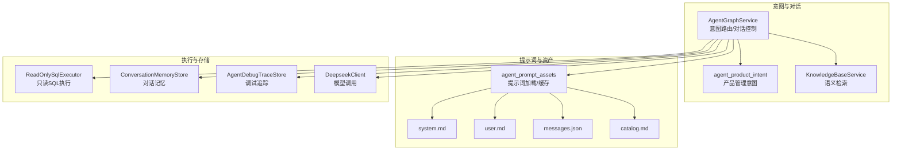
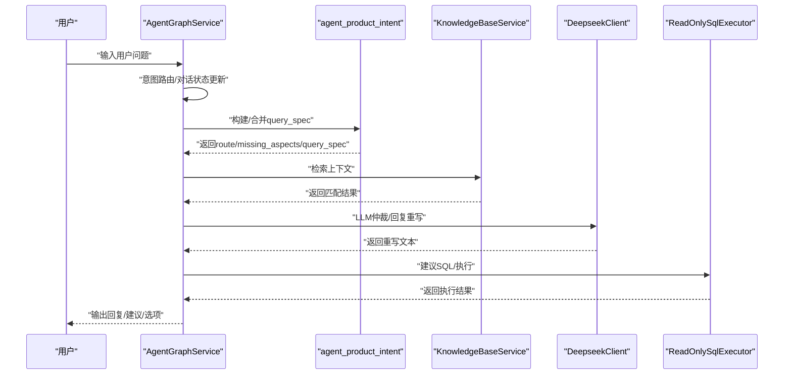
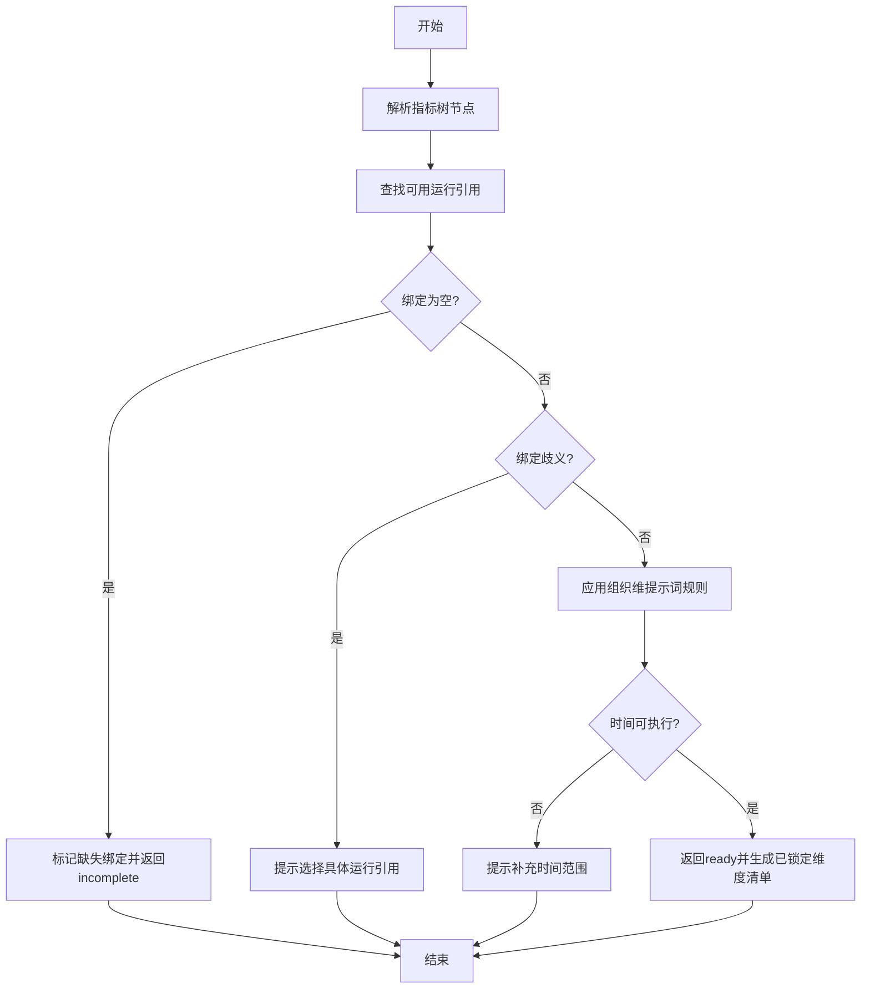
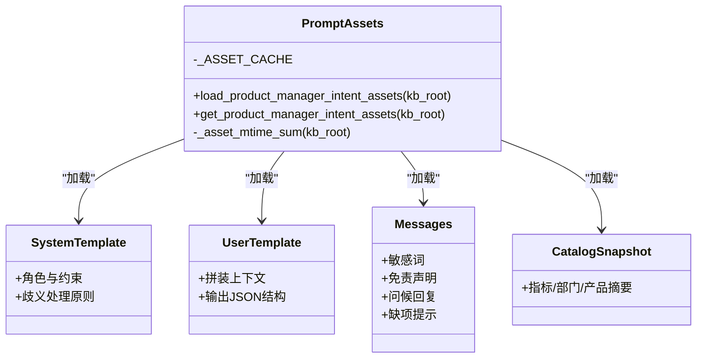
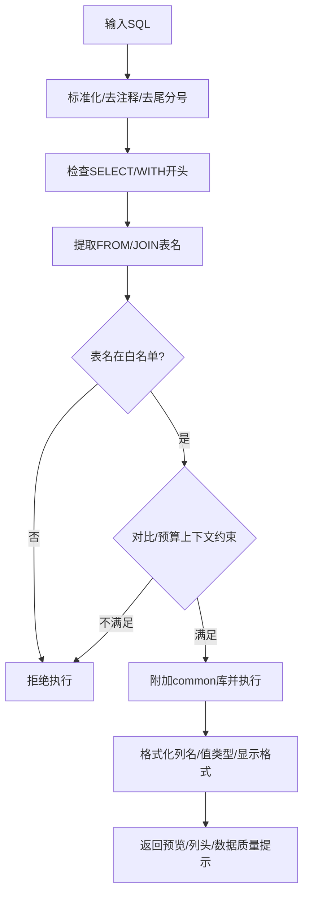
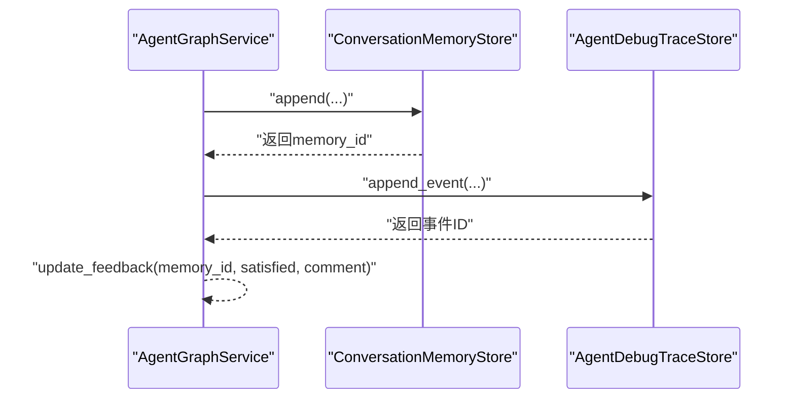
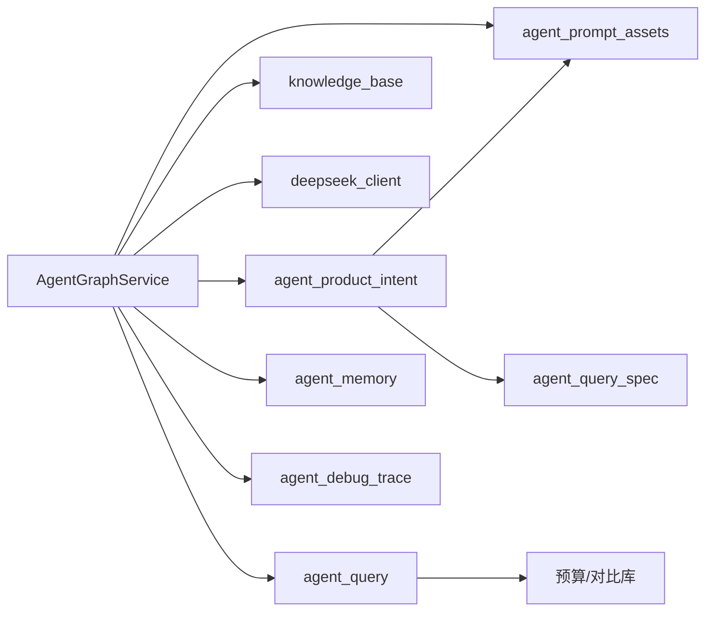

# Agent技能系统

<cite>
**本文档引用的文件**
- [.agents/README.md](file://.agents/README.md)
- [apps/api/app/agent_graph.py](file://apps/api/app/agent_graph.py)
- [apps/api/app/agent_product_intent.py](file://apps/api/app/agent_product_intent.py)
- [apps/api/app/agent_prompt_assets.py](file://apps/api/app/agent_prompt_assets.py)
- [apps/api/app/agent_query.py](file://apps/api/app/agent_query.py)
- [apps/api/app/agent_query_spec.py](file://apps/api/app/agent_query_spec.py)
- [apps/api/app/agent_memory.py](file://apps/api/app/agent_memory.py)
- [apps/api/app/agent_debug_trace.py](file://apps/api/app/agent_debug_trace.py)
- [apps/api/app/deepseek_client.py](file://apps/api/app/deepseek_client.py)
- [apps/api/app/knowledge_base.py](file://apps/api/app/knowledge_base.py)
- [resources/knowledge_base/06_agent_prompts/product_manager_intent_system.md](file://resources/knowledge_base/06_agent_prompts/product_manager_intent_system.md)
- [resources/knowledge_base/06_agent_prompts/product_manager_intent_user.md](file://resources/knowledge_base/06_agent_prompts/product_manager_intent_user.md)
- [resources/knowledge_base/06_agent_prompts/product_manager_intent_messages.json](file://resources/knowledge_base/06_agent_prompts/product_manager_intent_messages.json)
- [resources/knowledge_base/06_agent_prompts/product_manager_intent_catalog.md](file://resources/knowledge_base/06_agent_prompts/product_manager_intent_catalog.md)
</cite>

## 目录
1. [简介](#简介)
2. [项目结构](#项目结构)
3. [核心组件](#核心组件)
4. [架构总览](#架构总览)
5. [详细组件分析](#详细组件分析)
6. [依赖关系分析](#依赖关系分析)
7. [性能考量](#性能考量)
8. [故障排查指南](#故障排查指南)
9. [结论](#结论)
10. [附录](#附录)

## 简介
本文件系统化阐述智能预算预测系统的Agent技能体系，围绕“提示词资产、技能模板、技能组合与执行流程”进行深入解析，并提供开发、测试、部署、协作与安全等方面的实践指南。Agent技能以“意图路由—需求规约—查询规划—执行反馈—记忆沉淀”的闭环为核心，结合领域知识库与只读SQL执行器，确保预算数据查询与分析的准确性与一致性。

## 项目结构
- 本地Agent资产位于 .agents/，当前仅包含 skills/ 目录，遵循仓库门禁清单，避免历史与退役资产混入。
- 技能实现集中在 apps/api/app 下，围绕意图路由、提示词资产、查询规范、只读SQL执行、记忆与调试追踪等模块协同工作。
- 提示词资产位于 resources/knowledge_base/06_agent_prompts，包含系统提示、用户模板、消息片段与科目快照，按文件mtime进程内缓存。

```mermaid
graph TB
A[".agents/"] --> B["skills/"]
C["apps/api/app/"] --> D["agent_graph.py"]
C --> E["agent_product_intent.py"]
C --> F["agent_prompt_assets.py"]
C --> G["agent_query.py"]
C --> H["agent_query_spec.py"]
C --> I["agent_memory.py"]
C --> J["agent_debug_trace.py"]
C --> K["deepseek_client.py"]
L["resources/knowledge_base/06_agent_prompts/"] --> M["product_manager_intent_system.md"]
L --> N["product_manager_intent_user.md"]
L --> O["product_manager_intent_messages.json"]
L --> P["product_manager_intent_catalog.md"]
```

图示来源
- [.agents/README.md:1-20](file://.agents/README.md#L1-L20)
- [apps/api/app/agent_graph.py:1-120](file://apps/api/app/agent_graph.py#L1-L120)
- [apps/api/app/agent_product_intent.py:1-60](file://apps/api/app/agent_product_intent.py#L1-L60)
- [apps/api/app/agent_prompt_assets.py:1-40](file://apps/api/app/agent_prompt_assets.py#L1-L40)
- [apps/api/app/agent_query.py:1-40](file://apps/api/app/agent_query.py#L1-L40)
- [apps/api/app/agent_query_spec.py:1-30](file://apps/api/app/agent_query_spec.py#L1-L30)
- [apps/api/app/agent_memory.py:1-30](file://apps/api/app/agent_memory.py#L1-L30)
- [apps/api/app/agent_debug_trace.py:1-30](file://apps/api/app/agent_debug_trace.py#L1-L30)
- [apps/api/app/deepseek_client.py:1-30](file://apps/api/app/deepseek_client.py#L1-L30)
- [resources/knowledge_base/06_agent_prompts/product_manager_intent_system.md:1-20](file://resources/knowledge_base/06_agent_prompts/product_manager_intent_system.md#L1-L20)
- [resources/knowledge_base/06_agent_prompts/product_manager_intent_user.md:1-30](file://resources/knowledge_base/06_agent_prompts/product_manager_intent_user.md#L1-L30)
- [resources/knowledge_base/06_agent_prompts/product_manager_intent_messages.json:1-20](file://resources/knowledge_base/06_agent_prompts/product_manager_intent_messages.json#L1-L20)
- [resources/knowledge_base/06_agent_prompts/product_manager_intent_catalog.md:1-40](file://resources/knowledge_base/06_agent_prompts/product_manager_intent_catalog.md#L1-L40)

章节来源
- [.agents/README.md:1-20](file://.agents/README.md#L1-L20)

## 核心组件
- 意图路由与对话控制：AgentGraphService负责意图识别、对话状态流转、LLM仲裁与回复重写、知识库检索、需求规约构建与执行建议。
- 产品管理意图引擎：agent_product_intent负责指标树与运行引用的匹配、组织维补全、缺失要素判定与澄清消息生成。
- 提示词资产与缓存：agent_prompt_assets加载并缓存系统提示、用户模板、消息片段与科目快照，按mtime热更新。
- 查询规范与合并：agent_query_spec定义查询规约契约，提供规范化与合并逻辑，保证跨回合状态一致性。
- 只读SQL执行器：agent_query_guard对SQL进行白名单与上下文约束校验，确保预算/对比库访问安全与合规。
- 记忆与反馈：agent_memory持久化对话记忆，支持反馈更新；agent_debug_trace提供调试事件存储与实时轮询。
- 大模型客户端：deepseek_client封装模型调用，支持重试与限流。
- 知识库服务：knowledge_base提供语义检索、同义词过滤与构建报告统计。

章节来源
- [apps/api/app/agent_graph.py:148-265](file://apps/api/app/agent_graph.py#L148-L265)
- [apps/api/app/agent_product_intent.py:284-356](file://apps/api/app/agent_product_intent.py#L284-L356)
- [apps/api/app/agent_prompt_assets.py:33-82](file://apps/api/app/agent_prompt_assets.py#L33-L82)
- [apps/api/app/agent_query_spec.py:32-54](file://apps/api/app/agent_query_spec.py#L32-L54)
- [apps/api/app/agent_query.py:28-385](file://apps/api/app/agent_query.py#L28-L385)
- [apps/api/app/agent_memory.py:14-91](file://apps/api/app/agent_memory.py#L14-L91)
- [apps/api/app/agent_debug_trace.py:16-102](file://apps/api/app/agent_debug_trace.py#L16-L102)
- [apps/api/app/deepseek_client.py:9-70](file://apps/api/app/deepseek_client.py#L9-L70)
- [apps/api/app/knowledge_base.py:50-282](file://apps/api/app/knowledge_base.py#L50-L282)

## 架构总览
Agent技能系统采用“意图路由—需求规约—查询规划—执行反馈—记忆沉淀”的流水线式架构，结合提示词资产与知识库检索，确保对话连贯与查询可执行。

图示来源
- [apps/api/app/agent_graph.py:148-265](file://apps/api/app/agent_graph.py#L148-L265)
- [apps/api/app/agent_product_intent.py:284-356](file://apps/api/app/agent_product_intent.py#L284-L356)
- [apps/api/app/agent_prompt_assets.py:33-82](file://apps/api/app/agent_prompt_assets.py#L33-L82)
- [apps/api/app/agent_query.py:28-385](file://apps/api/app/agent_query.py#L28-L385)
- [apps/api/app/agent_memory.py:14-91](file://apps/api/app/agent_memory.py#L14-L91)
- [apps/api/app/agent_debug_trace.py:16-102](file://apps/api/app/agent_debug_trace.py#L16-L102)
- [apps/api/app/deepseek_client.py:9-70](file://apps/api/app/deepseek_client.py#L9-L70)
- [resources/knowledge_base/06_agent_prompts/product_manager_intent_system.md:1-20](file://resources/knowledge_base/06_agent_prompts/product_manager_intent_system.md#L1-L20)
- [resources/knowledge_base/06_agent_prompts/product_manager_intent_user.md:1-30](file://resources/knowledge_base/06_agent_prompts/product_manager_intent_user.md#L1-L30)
- [resources/knowledge_base/06_agent_prompts/product_manager_intent_messages.json:1-20](file://resources/knowledge_base/06_agent_prompts/product_manager_intent_messages.json#L1-L20)
- [resources/knowledge_base/06_agent_prompts/product_manager_intent_catalog.md:1-40](file://resources/knowledge_base/06_agent_prompts/product_manager_intent_catalog.md#L1-L40)

## 详细组件分析

### 组件A：AgentGraphService（意图路由与对话控制）
- 职责：意图识别、对话状态管理、LLM仲裁、回复重写、知识库检索、需求规约构建、执行建议与可视化推荐。
- 关键流程：
  - 意图路由：基于规则与语义检索，结合LLM仲裁决定“预算/通用”意图。
  - 需求规约：构建/合并query_spec，继承历史槽位，合并产品经理意图路由结果。
  - 回答重写：针对不同用途（查询规划、澄清、分析、通用）注入风格与约束。
  - 记忆与追踪：写入对话记忆与调试事件，支持反馈更新与实时轮询。

图示来源
- [apps/api/app/agent_graph.py:452-636](file://apps/api/app/agent_graph.py#L452-L636)
- [apps/api/app/agent_product_intent.py:497-550](file://apps/api/app/agent_product_intent.py#L497-L550)
- [apps/api/app/knowledge_base.py:197-248](file://apps/api/app/knowledge_base.py#L197-L248)
- [apps/api/app/deepseek_client.py:18-69](file://apps/api/app/deepseek_client.py#L18-L69)
- [apps/api/app/agent_query.py:345-385](file://apps/api/app/agent_query.py#L345-L385)

章节来源
- [apps/api/app/agent_graph.py:148-265](file://apps/api/app/agent_graph.py#L148-L265)
- [apps/api/app/agent_graph.py:452-636](file://apps/api/app/agent_graph.py#L452-L636)

### 组件B：agent_product_intent（产品管理意图）
- 职责：指标树与运行引用匹配、组织维补全、缺失要素判定、澄清消息生成、路由决策。
- 关键算法：
  - 指标树节点解析与后代展开：根据用户输入与已锁定节点，解析指标树节点并决定是否展开子节点。
  - 指标绑定查找：在指标树与产品范围下查找可用的运行引用（data_account），处理“空绑定”与“歧义绑定”两种异常路径。
  - 组织维提示词规则：按关键词规则补全部门/产品维度，避免仅锁指标而漏组织维。
  - 度量门控：时间可执行性、利息收入细项与指标编码锁定等，确保route=data_query_ready时具备可执行条件。

图示来源
- [apps/api/app/agent_product_intent.py:284-356](file://apps/api/app/agent_product_intent.py#L284-L356)
- [apps/api/app/agent_product_intent.py:367-550](file://apps/api/app/agent_product_intent.py#L367-L550)
- [apps/api/app/agent_product_intent.py:588-667](file://apps/api/app/agent_product_intent.py#L588-L667)

章节来源
- [apps/api/app/agent_product_intent.py:284-356](file://apps/api/app/agent_product_intent.py#L284-L356)
- [apps/api/app/agent_product_intent.py:367-550](file://apps/api/app/agent_product_intent.py#L367-L550)
- [apps/api/app/agent_product_intent.py:588-667](file://apps/api/app/agent_product_intent.py#L588-L667)

### 组件C：提示词资产与模板（agent_prompt_assets）
- 职责：加载系统提示、用户模板、消息片段与科目快照，按mtime进行进程内缓存，避免重复IO。
- 使用方法：
  - 系统提示：定义Agent角色、输出约束与歧义处理原则。
  - 用户模板：拼装catalog摘要、历史对话、待查清单与当前输入，输出JSON结构。
  - 消息片段：包含敏感词、免责声明、问候回复、缺项提示等。
  - 科目快照：从common.db导出的指标/部门/产品摘要，用于路由与澄清。

图示来源
- [apps/api/app/agent_prompt_assets.py:33-82](file://apps/api/app/agent_prompt_assets.py#L33-L82)
- [resources/knowledge_base/06_agent_prompts/product_manager_intent_system.md:1-20](file://resources/knowledge_base/06_agent_prompts/product_manager_intent_system.md#L1-L20)
- [resources/knowledge_base/06_agent_prompts/product_manager_intent_user.md:1-30](file://resources/knowledge_base/06_agent_prompts/product_manager_intent_user.md#L1-L30)
- [resources/knowledge_base/06_agent_prompts/product_manager_intent_messages.json:1-20](file://resources/knowledge_base/06_agent_prompts/product_manager_intent_messages.json#L1-L20)
- [resources/knowledge_base/06_agent_prompts/product_manager_intent_catalog.md:1-40](file://resources/knowledge_base/06_agent_prompts/product_manager_intent_catalog.md#L1-L40)

章节来源
- [apps/api/app/agent_prompt_assets.py:33-82](file://apps/api/app/agent_prompt_assets.py#L33-L82)
- [resources/knowledge_base/06_agent_prompts/product_manager_intent_system.md:1-20](file://resources/knowledge_base/06_agent_prompts/product_manager_intent_system.md#L1-L20)
- [resources/knowledge_base/06_agent_prompts/product_manager_intent_user.md:1-30](file://resources/knowledge_base/06_agent_prompts/product_manager_intent_user.md#L1-L30)
- [resources/knowledge_base/06_agent_prompts/product_manager_intent_messages.json:1-20](file://resources/knowledge_base/06_agent_prompts/product_manager_intent_messages.json#L1-L20)
- [resources/knowledge_base/06_agent_prompts/product_manager_intent_catalog.md:1-40](file://resources/knowledge_base/06_agent_prompts/product_manager_intent_catalog.md#L1-L40)

### 组件D：查询规范与只读SQL执行（agent_query_spec + agent_query）
- 查询规范：
  - 定义当前回合的query_spec契约，仅保留org-product指标运行引用、部门/产品/指标树节点与时间轴等字段。
  - 提供规范化与合并函数，确保跨回合状态一致性与历史槽位继承。
- 只读SQL执行：
  - 白名单表与字段校验，防止DDL/DML操作。
  - 强制版本/展示层级约束，避免越权或口径不一致。
  - 结果格式化与数据质量提示，提升用户体验。

图示来源
- [apps/api/app/agent_query.py:266-385](file://apps/api/app/agent_query.py#L266-L385)
- [apps/api/app/agent_query_spec.py:32-54](file://apps/api/app/agent_query_spec.py#L32-L54)

章节来源
- [apps/api/app/agent_query_spec.py:32-54](file://apps/api/app/agent_query_spec.py#L32-L54)
- [apps/api/app/agent_query.py:266-385](file://apps/api/app/agent_query.py#L266-L385)

### 组件E：记忆与调试（agent_memory + agent_debug_trace）
- 对话记忆：以JSONL形式持久化，包含用户问题、意图、最终需求、执行结果元信息与用户反馈。
- 调试追踪：事件队列+文件持久化，支持实时轮询与清理，不影响运行时稳定性。

图示来源
- [apps/api/app/agent_memory.py:18-91](file://apps/api/app/agent_memory.py#L18-L91)
- [apps/api/app/agent_debug_trace.py:56-102](file://apps/api/app/agent_debug_trace.py#L56-L102)

章节来源
- [apps/api/app/agent_memory.py:18-91](file://apps/api/app/agent_memory.py#L18-L91)
- [apps/api/app/agent_debug_trace.py:56-102](file://apps/api/app/agent_debug_trace.py#L56-L102)

## 依赖关系分析
- AgentGraphService依赖agent_product_intent、agent_prompt_assets、knowledge_base、deepseek_client、agent_query、agent_memory、agent_debug_trace。
- agent_product_intent依赖agent_prompt_assets、agent_query_spec与数据库连接。
- agent_query依赖只读白名单与上下文约束。
- 提示词资产与catalog相互依赖，共同支撑路由与澄清。

图示来源
- [apps/api/app/agent_graph.py:10-85](file://apps/api/app/agent_graph.py#L10-L85)
- [apps/api/app/agent_product_intent.py:10-15](file://apps/api/app/agent_product_intent.py#L10-L15)
- [apps/api/app/agent_prompt_assets.py:1-10](file://apps/api/app/agent_prompt_assets.py#L1-L10)
- [apps/api/app/agent_query.py:9-10](file://apps/api/app/agent_query.py#L9-L10)
- [apps/api/app/agent_query_spec.py:8-15](file://apps/api/app/agent_query_spec.py#L8-L15)

章节来源
- [apps/api/app/agent_graph.py:10-85](file://apps/api/app/agent_graph.py#L10-L85)
- [apps/api/app/agent_product_intent.py:10-15](file://apps/api/app/agent_product_intent.py#L10-L15)
- [apps/api/app/agent_prompt_assets.py:1-10](file://apps/api/app/agent_prompt_assets.py#L1-L10)
- [apps/api/app/agent_query.py:9-10](file://apps/api/app/agent_query.py#L9-L10)
- [apps/api/app/agent_query_spec.py:8-15](file://apps/api/app/agent_query_spec.py#L8-L15)

## 性能考量
- 提示词资产缓存：按mtime聚合sum，进程内缓存减少IO与解析开销。
- SQL执行限制：单条只读语句、白名单表与强制LIMIT，避免慢查询与越权。
- 对话状态最小化：query_spec仅保留必要字段，减少序列化与传输成本。
- LLM调用：温度与max_tokens参数按用途定制，避免冗长输出与高延迟。
- 调试追踪：内存队列+异步文件写入，失败不影响主线程。

## 故障排查指南
- 提示词加载失败：检查提示词目录与文件是否存在，确认system/user/messages/catalog文件完整性。
- SQL执行被拒：检查表名是否在白名单、是否包含非只读关键字、是否绑定版本/层级上下文。
- 意图仲裁异常：确认DeepseekClient配置与网络连通性，查看调试事件中的错误字段。
- 记忆写入失败：确认JSONL文件路径可写，关注异常捕获与回退逻辑。
- 知识库检索无结果：检查种子文件与同义词索引，确认未包含已退休口径标记。

章节来源
- [apps/api/app/agent_prompt_assets.py:41-64](file://apps/api/app/agent_prompt_assets.py#L41-L64)
- [apps/api/app/agent_query.py:291-343](file://apps/api/app/agent_query.py#L291-L343)
- [apps/api/app/deepseek_client.py:46-69](file://apps/api/app/deepseek_client.py#L46-L69)
- [apps/api/app/agent_memory.py:62-91](file://apps/api/app/agent_memory.py#L62-L91)
- [apps/api/app/knowledge_base.py:160-165](file://apps/api/app/knowledge_base.py#L160-L165)

## 结论
Agent技能系统通过“意图路由—需求规约—查询规划—执行反馈—记忆沉淀”的闭环，结合严格的提示词资产与只读SQL执行约束，实现了预算数据查询与分析的高可靠与高一致性。建议在开发新技能时遵循“最小可用—可测试—可审计—可演进”的原则，持续优化提示词与路由规则，强化安全与性能监控。

## 附录

### 技能开发指南（创建/测试/部署）
- 创建新技能
  - 在 .agents/skills/ 下新增技能目录与入口文件，遵循现有命名与职责划分。
  - 编写提示词资产：system/user/messages/catalog，确保mtime缓存生效。
  - 实现路由与规约：在AgentGraphService中注册新节点，或扩展agent_product_intent的路由分支。
- 测试
  - 使用AgentDebugTraceStore实时轮询事件，验证意图与回复重写。
  - 构造边界用例：敏感词、歧义绑定、时间缺失、组织维缺失等。
  - SQL安全测试：构造非只读语句与越权表访问，确保被拒绝。
- 部署
  - 更新runtime配置与意图仲裁阈值，灰度发布新路由。
  - 监控调试事件与对话记忆，收集用户反馈并迭代。

章节来源
- [.agents/README.md:1-20](file://.agents/README.md#L1-L20)
- [apps/api/app/agent_debug_trace.py:71-102](file://apps/api/app/agent_debug_trace.py#L71-L102)
- [apps/api/app/agent_query.py:291-343](file://apps/api/app/agent_query.py#L291-L343)

### 技能协作与依赖管理
- 技能间协作：通过query_spec合并与历史槽位继承，避免重复确认；在agent_product_intent中实现“上级优先”简化维度。
- 依赖管理：提示词资产与catalog强耦合，需同步更新；SQL执行依赖预算/对比库schema，变更需同步迁移。

章节来源
- [apps/api/app/agent_query_spec.py:44-54](file://apps/api/app/agent_query_spec.py#L44-L54)
- [apps/api/app/agent_product_intent.py:402-494](file://apps/api/app/agent_product_intent.py#L402-L494)

### 性能优化与版本管理
- 性能优化：提示词缓存、SQL白名单与LIMIT、LLM参数裁剪、调试事件异步持久化。
- 版本管理：提示词与catalog按mtime缓存，catalog由common.db导出；SQL执行强制版本/层级上下文，避免口径漂移。

章节来源
- [apps/api/app/agent_prompt_assets.py:14-30](file://apps/api/app/agent_prompt_assets.py#L14-L30)
- [apps/api/app/agent_query.py:334-343](file://apps/api/app/agent_query.py#L334-L343)

### 安全与权限控制
- 提示词安全：敏感词检测与路由分流，避免违规内容。
- SQL安全：只读白名单、DDL关键字拦截、版本/层级强制绑定、LIMIT限制。
- 记忆与追踪：文件权限控制与异常回退，避免影响运行时稳定性。

章节来源
- [resources/knowledge_base/06_agent_prompts/product_manager_intent_messages.json:2-11](file://resources/knowledge_base/06_agent_prompts/product_manager_intent_messages.json#L2-L11)
- [apps/api/app/agent_query.py:291-343](file://apps/api/app/agent_query.py#L291-L343)
- [apps/api/app/agent_memory.py:62-91](file://apps/api/app/agent_memory.py#L62-L91)
- [apps/api/app/agent_debug_trace.py:62-69](file://apps/api/app/agent_debug_trace.py#L62-L69)