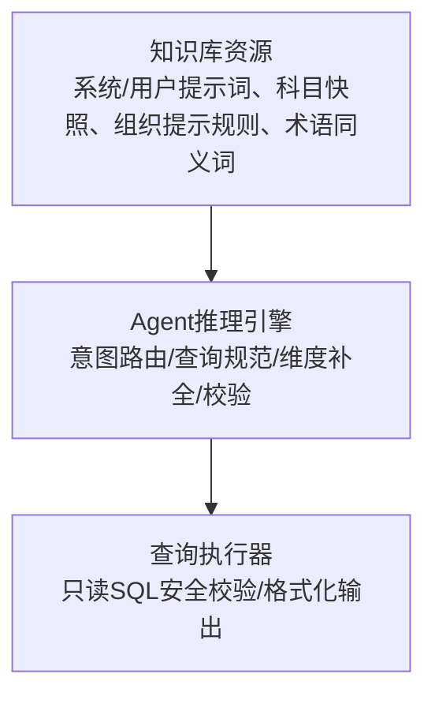
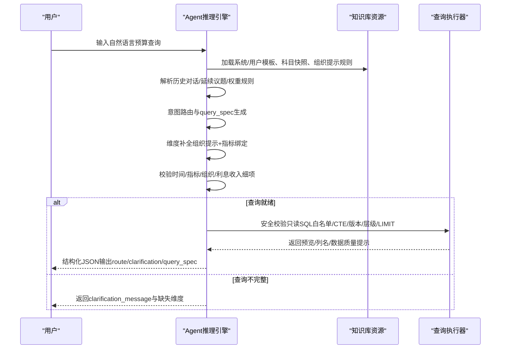
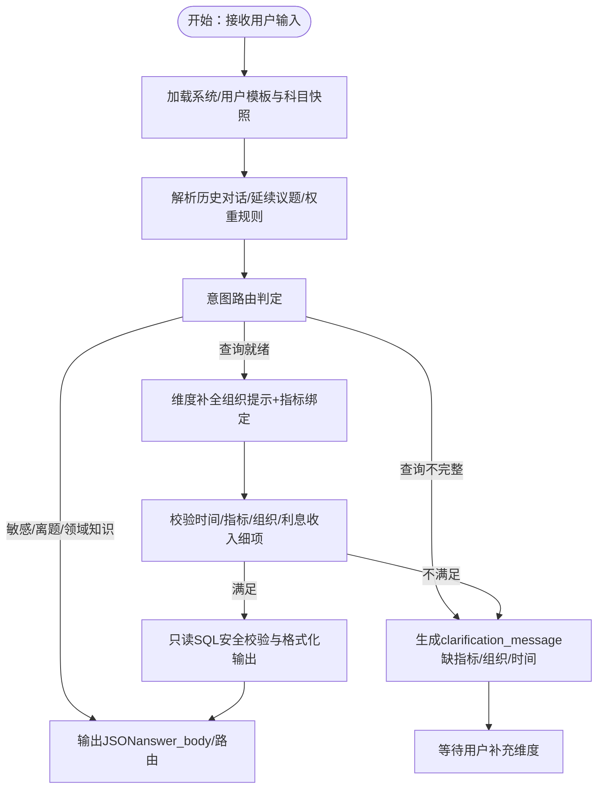

# 提示词工程

<cite>
**本文档引用的文件**   
- [README.md](file://README.md)
- [CONTEXT.md](file://CONTEXT.md)
- [agent_prompt_assets.py](file://apps/api/app/agent_prompt_assets.py)
- [agent_product_intent.py](file://apps/api/app/agent_product_intent.py)
- [agent_query.py](file://apps/api/app/agent_query.py)
- [product_manager_intent_system.md](file://resources/knowledge_base/06_agent_prompts/product_manager_intent_system.md)
- [product_manager_intent_user.md](file://resources/knowledge_base/06_agent_prompts/product_manager_intent_user.md)
- [product_manager_intent_messages.json](file://resources/knowledge_base/06_agent_prompts/product_manager_intent_messages.json)
- [product_manager_intent_catalog.md](file://resources/knowledge_base/06_agent_prompts/product_manager_intent_catalog.md)
- [product_manager_intent_org_hints.json](file://resources/knowledge_base/06_agent_prompts/product_manager_intent_org_hints.json)
- [synonyms_seed.csv](file://resources/knowledge_base/04_term_synonyms/synonyms_seed.csv)
- [intelligent_budget_solver.py](file://apps/api/app/services/intelligent_budget_solver.py)
- [intelligent_budget_scoring.py](file://apps/api/app/services/intelligent_budget_scoring.py)
- [intelligent_budget_simulation.py](file://apps/api/app/routers/intelligent_budget_simulation.py)
- [expense_forecast.py](file://apps/api/app/routers/expense_forecast.py)
- [OrgProductMetricContent.tsx](file://apps/web/src/app/components/OrgProductMetricContent.tsx)
- [test_agent_requirement_check.py](file://apps/api/test_agent_requirement_check.py)
</cite>

## 目录
1. [引言](#引言)
2. [项目结构](#项目结构)
3. [核心组件](#核心组件)
4. [架构总览](#架构总览)
5. [详细组件分析](#详细组件分析)
6. [依赖分析](#依赖分析)
7. [性能考量](#性能考量)
8. [故障排查指南](#故障排查指南)
9. [结论](#结论)
10. [附录](#附录)

## 引言
本文件面向智能预算预测系统的提示词工程，系统化阐述提示词设计原则、优化策略与实施方法，覆盖系统提示词、用户提示词与上下文提示词的编写规范；总结不同预算场景的提示词模板与变体；给出A/B测试与效果评估方法；说明提示词与Agent技能的协同使用；并提供预算预测、智能模拟、数据分析等场景的提示词示例与迭代优化流程。

## 项目结构
提示词工程围绕“知识库资源 + Agent推理引擎 + 查询执行器”的三层结构展开：
- 知识库资源层：存储系统提示词、用户模板、科目快照、组织提示规则与术语同义词等。
- Agent推理层：负责意图路由、查询规范构建、维度补全与校验、输出格式化。
- 查询执行层：对只读SQL进行安全校验与格式化输出，保障数据质量与可读性。

**图示来源**
- [agent_prompt_assets.py:33-82](file://apps/api/app/agent_prompt_assets.py#L33-L82)
- [agent_product_intent.py:497-550](file://apps/api/app/agent_product_intent.py#L497-L550)
- [agent_query.py:28-384](file://apps/api/app/agent_query.py#L28-L384)

**章节来源**
- [agent_prompt_assets.py:10-82](file://apps/api/app/agent_prompt_assets.py#L10-L82)
- [agent_product_intent.py:1-120](file://apps/api/app/agent_product_intent.py#L1-L120)
- [agent_query.py:11-75](file://apps/api/app/agent_query.py#L11-L75)

## 核心组件
- 系统提示词与用户模板：定义Agent的职责边界、歧义处理、默认值策略、口径一致性与输出格式。
- 维度与科目快照：提供指标树、运行引用、部门/产品科目、功能组等权威数据，确保查询规范可落地。
- 组织提示规则：将自然语言中的条线/业务语境映射到部门/产品科目，避免维度缺失。
- 术语同义词：提升意图识别鲁棒性，覆盖“预测/测算/模拟/滚动预算/版本/导出/查询/展示/对比”等预算关键词。
- 查询执行器：对只读SQL进行白名单校验、CTE识别、版本/层级上下文绑定、LIMIT注入与数据质量提示。

**章节来源**
- [product_manager_intent_system.md:1-17](file://resources/knowledge_base/06_agent_prompts/product_manager_intent_system.md#L1-L17)
- [product_manager_intent_user.md:22-103](file://resources/knowledge_base/06_agent_prompts/product_manager_intent_user.md#L22-L103)
- [product_manager_intent_catalog.md:1-120](file://resources/knowledge_base/06_agent_prompts/product_manager_intent_catalog.md#L1-L120)
- [product_manager_intent_org_hints.json:1-49](file://resources/knowledge_base/06_agent_prompts/product_manager_intent_org_hints.json#L1-L49)
- [synonyms_seed.csv:68-82](file://resources/knowledge_base/04_term_synonyms/synonyms_seed.csv#L68-L82)
- [agent_query.py:28-384](file://apps/api/app/agent_query.py#L28-L384)

## 架构总览
提示词工程的端到端流程如下：
- 加载提示词资产：从知识库目录读取系统/用户模板、消息示例、科目快照与组织提示规则，按mtime缓存。
- 用户输入解析：提取历史对话、延续/新议题、权重规则，结合模板填充上下文。
- 意图路由与查询规范：依据系统提示词与用户模板，判定路由（敏感/离题/领域知识/查询不完整/查询就绪），生成query_spec。
- 维度补全与校验：应用组织提示规则与指标树绑定，校验时间、指标/组织维度、利息收入细项等。
- 安全校验与输出：对只读SQL进行白名单、表/列/CTE合法性、版本/层级上下文绑定与LIMIT注入，输出预览与数据质量提示。

**图示来源**
- [agent_prompt_assets.py:33-82](file://apps/api/app/agent_prompt_assets.py#L33-L82)
- [agent_product_intent.py:497-667](file://apps/api/app/agent_product_intent.py#L497-L667)
- [agent_query.py:28-384](file://apps/api/app/agent_query.py#L28-L384)

## 详细组件分析

### 系统提示词与用户模板
- 系统提示词要点
  - 明确“时间、指标树节点与机构及产品指标运行引用、部门科目与产品科目”的四维组合必须同时具备，方可执行。
  - 对歧义采取“宁缺勿滥”策略：不确定时禁止输出“查询就绪”，必须通过澄清消息与用户交互。
  - 默认值策略：比较方式可缺省，默认“无比较”；“最近/近N期”等相对期有系统默认含义。
  - 上级优先：已锁定上级节点时默认覆盖下级，避免重复确认。
  - 口径约束：禁止输出旧口径字段；指标身份统一写入metric_nodes，取数明细统一写入data_accounts。
  - 问候优先短回复：对闲聊/寒暄优先off_topic短回复，避免长篇通用回答。
  - 输出格式：只输出JSON，不附加说明文字。
- 用户模板要点
  - 以“科目/口径规则与维度锁定”为前提，结合历史对话、延续议题、权重规则与当前输入，严格按路由输出。
  - 关键维度：时间（year/quarter/month/period_description）、比较方式（可选）、指标树/运行引用、组织对象（部门/产品或全行）、版本/展示源。
  - answer_body写作：已锁定维度清单需同时给出代码与名称；若需要同时体现“指标树/运行引用”与“部门/产品”组合，需点明二者独立锁定关系。
  - route=data_query_incomplete时的clarification_message：必须明确缺的是指标/组织/时间哪一类，优先采用选择式从清单中选取。

**图示来源**
- [product_manager_intent_system.md:1-17](file://resources/knowledge_base/06_agent_prompts/product_manager_intent_system.md#L1-L17)
- [product_manager_intent_user.md:22-103](file://resources/knowledge_base/06_agent_prompts/product_manager_intent_user.md#L22-L103)

**章节来源**
- [product_manager_intent_system.md:1-17](file://resources/knowledge_base/06_agent_prompts/product_manager_intent_system.md#L1-L17)
- [product_manager_intent_user.md:1-103](file://resources/knowledge_base/06_agent_prompts/product_manager_intent_user.md#L1-L103)

### 维度与科目快照
- 指标身份与取数明细
  - 指标身份：metric_nodes来自“机构及产品指标主表”的已确认引用；取数明细：data_accounts来自“机构及产品指标”主表的已确认引用。
  - 产品范围：products来自“机构及产品”主表展开的运行产品清单；部门范围：departments来自dept_account。
  - 相似指标查询使用functional_group_code；它不是指标身份，不能替代metric_node_code。
- 产品/部门科目树与指标样例
  - 提供产品群/产品线/部门/子部门的树形结构与典型指标节点、运行引用样例，支撑精确锁定与校验。
- 输出约束
  - 能锁定汇总指标时写入metric_nodes；能锁定叶子数据时写入data_accounts。
  - 不确定产品或部门时不要猜，走“查询不完整”并让用户选择。
  - 不要把functional_group_code当作取数code；它只用于跨产品相似指标聚合。

**章节来源**
- [product_manager_intent_catalog.md:1-120](file://resources/knowledge_base/06_agent_prompts/product_manager_intent_catalog.md#L1-L120)
- [product_manager_intent_catalog.md:361-539](file://resources/knowledge_base/06_agent_prompts/product_manager_intent_catalog.md#L361-L539)

### 组织提示规则
- 自然语言到部门/产品的默认映射规则，覆盖条线/业务语境关键词（如“汽车金融/车贷/Y103/A03”等），避免仅锁定指标编码而遗漏组织维。
- 更具体的规则应排在列表前部，以提高匹配优先级。

**章节来源**
- [product_manager_intent_org_hints.json:1-49](file://resources/knowledge_base/06_agent_prompts/product_manager_intent_org_hints.json#L1-L49)

### 术语同义词
- 覆盖预算关键词的同义词集合，增强意图识别鲁棒性，确保“预测/测算/模拟/滚动预算/版本/导出/查询/展示/对比”等词汇在不同表达下仍被正确识别。

**章节来源**
- [synonyms_seed.csv:68-82](file://resources/knowledge_base/04_term_synonyms/synonyms_seed.csv#L68-L82)

### 查询执行器（只读SQL安全校验与格式化）
- 白名单与关键字过滤：仅允许SELECT/WITH语句，拒绝INSERT/UPDATE/DELETE/DDL等非只读操作。
- 表/列/CTE合法性：基于预算/对比库只读表白名单校验，允许WITH子句中定义的CTE名称出现在FROM/JOIN位置。
- 版本/层级上下文绑定：对比查询需绑定show_level；预算查询需绑定version_id且与当前上下文一致。
- LIMIT注入：未显式LIMIT时自动追加最大行数限制，防止超大数据集输出。
- 数据质量提示：针对全零、预算/实际分离异常、单月明细不提示不完整等常见问题生成提示语。

**章节来源**
- [agent_query.py:28-384](file://apps/api/app/agent_query.py#L28-L384)

### Agent推理引擎（维度补全与校验）
- 维度补全
  - 应用组织提示规则，将条线/业务语境映射到部门/产品科目。
  - 指标树优先：自然语言先锁metric_node，再按产品/范围解析机构及产品指标编码；若为汇总指标且用户要求明细，则展开子树。
- 校验与路由
  - 时间可执行性、利息收入细项与指标编码锁定、指标绑定缺失/歧义、条线语境下必须锁定部门/产品等。
  - 对“仅因下级追问导致不完整”的情况，若时间已可执行且指标已锁定，则直接转为“查询就绪”。

**章节来源**
- [agent_product_intent.py:284-356](file://apps/api/app/agent_product_intent.py#L284-L356)
- [agent_product_intent.py:497-667](file://apps/api/app/agent_product_intent.py#L497-L667)

### 预算预测与智能模拟（Agent技能结合）
- 智能预算解决方案
  - 提供方案排名、数学评分、净利润增长、不良率、核心动作、驱动因子变动、产品贡献等结构化输出。
- 预算模拟与评分
  - 基于目标阈值与风险/扰动/偏差等维度进行综合评分与排序，支持A/B测试与效果评估。
- AI公式候选构建
  - 前端组件支持基于指标节点与显示代码的候选公式构建，辅助预算预测与模拟场景的提示词设计。

**章节来源**
- [intelligent_budget_solver.py:54-97](file://apps/api/app/services/intelligent_budget_solver.py#L54-L97)
- [intelligent_budget_scoring.py:45-60](file://apps/api/app/services/intelligent_budget_scoring.py#L45-L60)
- [OrgProductMetricContent.tsx:1665-2201](file://apps/web/src/app/components/OrgProductMetricContent.tsx#L1665-L2201)

## 依赖分析
提示词资产的加载与缓存依赖于知识库目录结构与文件mtime，确保提示词变更后进程内即时生效。

**图示来源**
- [agent_prompt_assets.py:14-30](file://apps/api/app/agent_prompt_assets.py#L14-L30)
- [agent_prompt_assets.py:67-82](file://apps/api/app/agent_prompt_assets.py#L67-L82)

**章节来源**
- [agent_prompt_assets.py:14-30](file://apps/api/app/agent_prompt_assets.py#L14-L30)
- [agent_prompt_assets.py:67-82](file://apps/api/app/agent_prompt_assets.py#L67-L82)

## 性能考量
- 提示词缓存：按知识库目录下关键文件mtime聚合，进程内缓存，避免频繁磁盘IO。
- SQL执行上限：自动注入LIMIT，控制输出规模；对空结果与不完整数据集提供质量提示，减少无效查询。
- 维度补全与校验前置：在路由阶段尽早发现缺失维度，减少无效SQL执行次数。

[本节为通用指导，无需特定文件引用]

## 故障排查指南
- 提示词未生效
  - 检查知识库目录文件是否存在与权限；确认mtime变化后进程内缓存是否更新。
- 路由异常
  - 检查系统提示词与用户模板是否符合路由定义；确认历史对话/延续议题/权重规则是否正确传入。
- 查询不完整
  - 查看clarification_message是否明确指出缺指标/组织/时间；确认组织提示规则是否覆盖用户输入关键词。
- SQL执行失败
  - 检查是否包含非只读关键字；确认表/列/CTE是否在白名单内；核对版本/层级上下文绑定是否正确。

**章节来源**
- [agent_prompt_assets.py:41-64](file://apps/api/app/agent_prompt_assets.py#L41-L64)
- [agent_product_intent.py:588-667](file://apps/api/app/agent_product_intent.py#L588-L667)
- [agent_query.py:285-343](file://apps/api/app/agent_query.py#L285-L343)

## 结论
通过系统化的提示词设计与严格的执行校验，智能预算预测系统能够在复杂预算场景下稳定地完成意图识别、维度补全与查询执行。建议持续优化提示词模板、加强A/B测试与效果评估，并结合Agent技能与前端候选构建，进一步提升用户体验与预测准确性。

[本节为总结性内容，无需特定文件引用]

## 附录

### 提示词设计原则与优化策略
- 可读性
  - 使用清晰的结构化模板，明确“历史对话/延续议题/权重规则/当前输入/分类与输出要求”等段落。
  - 输出格式严格限制为JSON，避免自然语言混杂。
- 准确性
  - 严格遵循“时间/指标/组织/版本”四维组合；对歧义采取“宁缺勿滥”策略。
  - 利息收入细项必须与机构及产品指标运行引用绑定，不得仅用粗指标节点。
- 鲁棒性
  - 通过组织提示规则与术语同义词增强对自然语言的容忍度。
  - 对常见数据质量问题（全零、预算/实际分离异常、单月明细）提供提示。

**章节来源**
- [product_manager_intent_system.md:1-17](file://resources/knowledge_base/06_agent_prompts/product_manager_intent_system.md#L1-L17)
- [product_manager_intent_user.md:22-103](file://resources/knowledge_base/06_agent_prompts/product_manager_intent_user.md#L22-L103)
- [synonyms_seed.csv:68-82](file://resources/knowledge_base/04_term_synonyms/synonyms_seed.csv#L68-L82)

### 不同预算场景的提示词模板与变体
- 预算预测
  - 模板要点：明确预测期间、产品/部门范围、驱动因子与模拟场景；输出包含预测值、预算达成、同比与月度分解。
- 智能模拟
  - 模板要点：设定目标阈值（如净利润增长、NPL比率）、风险缓冲与差异评分；输出包含方案排名、核心动作与因子变动。
- 数据分析
  - 模板要点：强调只读查询、版本/层级上下文绑定、数据质量提示；对空结果与不完整数据集提供解释。

**章节来源**
- [intelligent_budget_solver.py:54-97](file://apps/api/app/services/intelligent_budget_solver.py#L54-L97)
- [intelligent_budget_scoring.py:45-60](file://apps/api/app/services/intelligent_budget_scoring.py#L45-L60)
- [agent_query.py:221-264](file://apps/api/app/agent_query.py#L221-L264)

### A/B测试方法与效果评估指标
- A/B测试
  - 对比不同系统提示词/用户模板版本在“查询就绪率、澄清轮次、执行成功率、用户满意度”等指标上的差异。
- 效果评估
  - 关键指标：路由准确率（route正确率）、平均澄清轮次、SQL执行成功率、数据质量提示命中率、用户反馈评分。

**章节来源**
- [test_agent_requirement_check.py:74-100](file://apps/api/test_agent_requirement_check.py#L74-L100)

### 提示词与Agent技能的结合使用
- 指标树优先：自然语言先锁metric_node，再解析产品/范围；若为汇总指标且用户要求明细，则展开子树。
- 组织提示：将条线/业务语境映射到部门/产品科目，避免维度缺失。
- AI候选构建：前端组件支持基于指标节点与显示代码的候选公式构建，辅助预算预测与模拟场景的提示词设计。

**章节来源**
- [agent_product_intent.py:284-356](file://apps/api/app/agent_product_intent.py#L284-L356)
- [OrgProductMetricContent.tsx:1665-2201](file://apps/web/src/app/components/OrgProductMetricContent.tsx#L1665-L2201)

### 提示词迭代优化流程与最佳实践
- 流程
  - 设计→试点→A/B测试→评估→上线→监控→回滚/再优化。
- 最佳实践
  - 以“歧义处理/默认值/口径一致性/输出格式”为核心约束；持续优化组织提示规则与术语同义词；对历史对话与权重规则进行动态调整。

**章节来源**
- [product_manager_intent_system.md:1-17](file://resources/knowledge_base/06_agent_prompts/product_manager_intent_system.md#L1-L17)
- [product_manager_intent_user.md:22-103](file://resources/knowledge_base/06_agent_prompts/product_manager_intent_user.md#L22-L103)
- [product_manager_intent_org_hints.json:1-49](file://resources/knowledge_base/06_agent_prompts/product_manager_intent_org_hints.json#L1-L49)