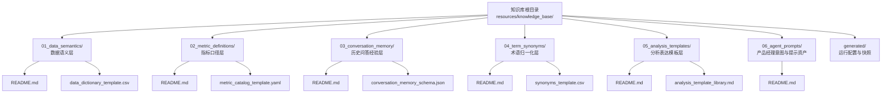
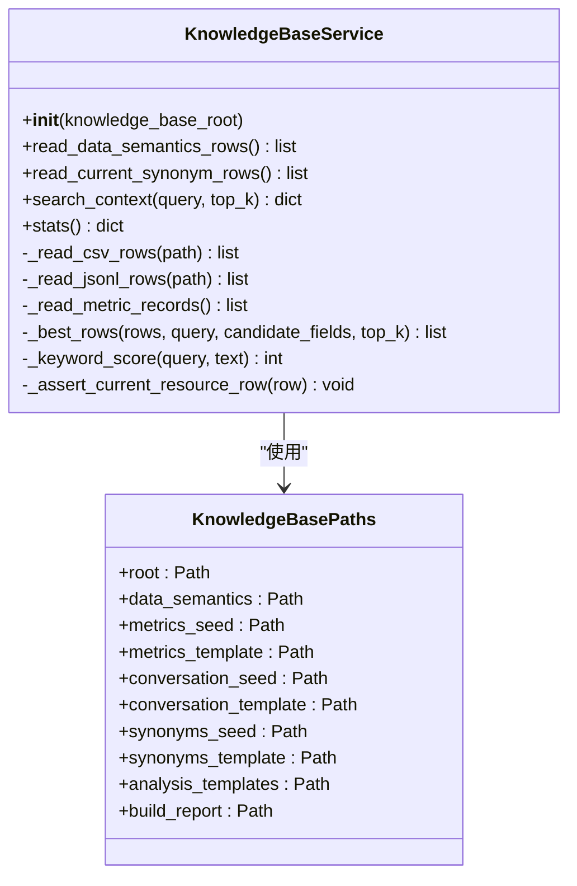
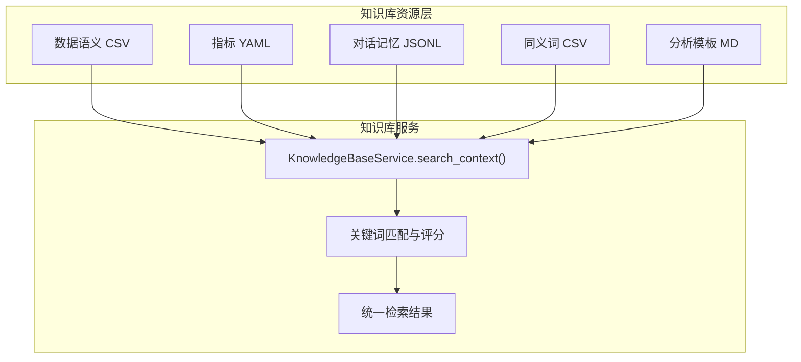
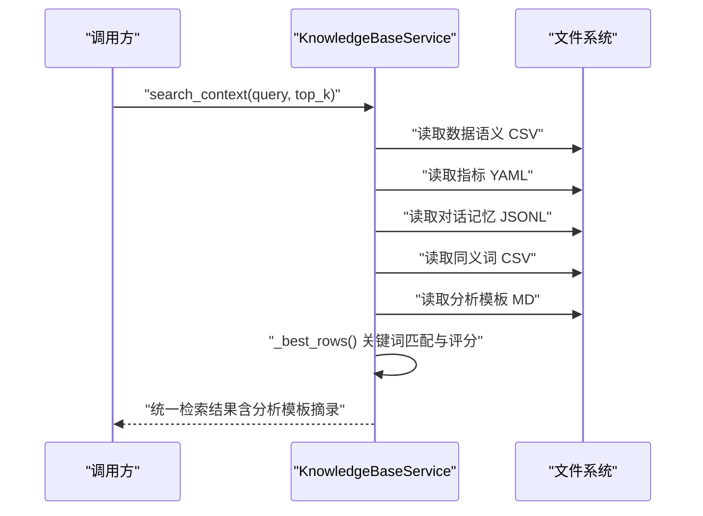
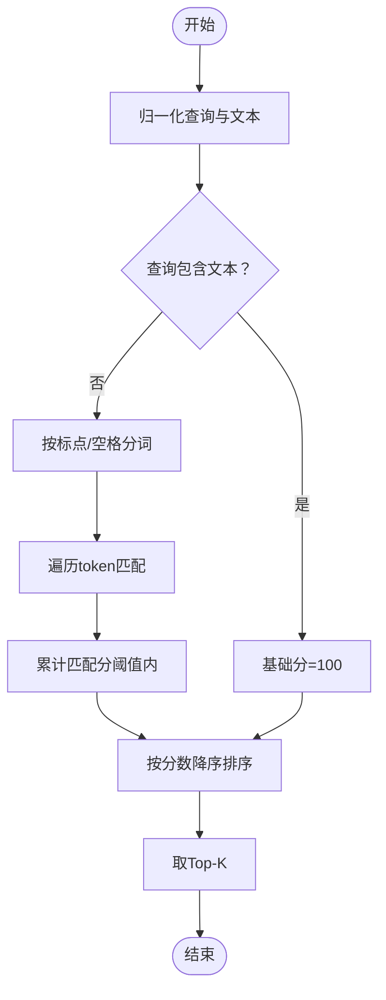
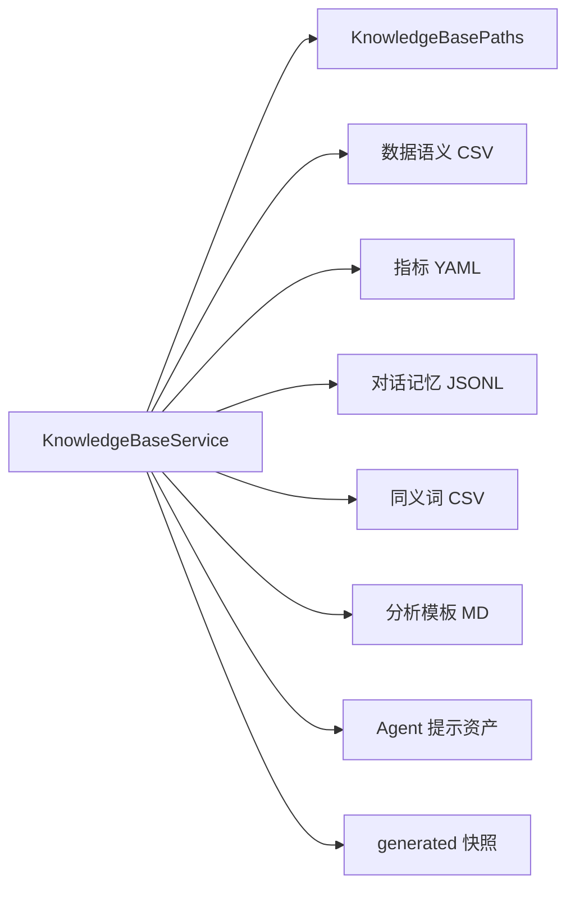

# 知识库管理

<cite>
**本文档引用的文件**
- [apps/api/app/knowledge_base.py](file://apps/api/app/knowledge_base.py)
- [resources/knowledge_base/README.md](file://resources/knowledge_base/README.md)
- [resources/knowledge_base/01_data_semantics/README.md](file://resources/knowledge_base/01_data_semantics/README.md)
- [resources/knowledge_base/02_metric_definitions/README.md](file://resources/knowledge_base/02_metric_definitions/README.md)
- [resources/knowledge_base/03_conversation_memory/README.md](file://resources/knowledge_base/03_conversation_memory/README.md)
- [resources/knowledge_base/04_term_synonyms/README.md](file://resources/knowledge_base/04_term_synonyms/README.md)
- [resources/knowledge_base/05_analysis_templates/README.md](file://resources/knowledge_base/05_analysis_templates/README.md)
- [resources/knowledge_base/06_agent_prompts/README.md](file://resources/knowledge_base/06_agent_prompts/README.md)
- [resources/knowledge_base/01_data_semantics/data_dictionary_template.csv](file://resources/knowledge_base/01_data_semantics/data_dictionary_template.csv)
- [resources/knowledge_base/02_metric_definitions/metric_catalog_template.yaml](file://resources/knowledge_base/02_metric_definitions/metric_catalog_template.yaml)
- [resources/knowledge_base/03_conversation_memory/conversation_memory_schema.json](file://resources/knowledge_base/03_conversation_memory/conversation_memory_schema.json)
- [resources/knowledge_base/04_term_synonyms/synonyms_template.csv](file://resources/knowledge_base/04_term_synonyms/synonyms_template.csv)
- [resources/knowledge_base/05_analysis_templates/analysis_template_library.md](file://resources/knowledge_base/05_analysis_templates/analysis_template_library.md)
</cite>

## 目录
1. [简介](#简介)
2. [项目结构](#项目结构)
3. [核心组件](#核心组件)
4. [架构总览](#架构总览)
5. [详细组件分析](#详细组件分析)
6. [依赖分析](#依赖分析)
7. [性能考虑](#性能考虑)
8. [故障排查指南](#故障排查指南)
9. [结论](#结论)
10. [附录](#附录)

## 简介
本文件面向智能预算预测系统的知识库管理系统，系统性阐述知识库的架构设计、数据组织方式、维护流程、版本管理与一致性保障、检索与匹配算法、与AI模型的集成方式、扩展与自定义方法、质量控制与验证机制，以及备份恢复与迁移策略。知识库以“资源层 + 运行配置层”的方式组织，覆盖数据语义、指标定义、对话记忆、术语同义词、分析模板与Agent提示资产等。

## 项目结构
知识库位于 resources/knowledge_base 下，按功能域划分为若干子目录，每个子目录包含用途说明、模板与种子文件，以及生成物目录 generated。核心服务通过知识库路径集合直接读取各资源文件，支持运行时统计与校验。

图表来源
- [resources/knowledge_base/README.md:1-47](file://resources/knowledge_base/README.md#L1-L47)
- [resources/knowledge_base/01_data_semantics/README.md:1-15](file://resources/knowledge_base/01_data_semantics/README.md#L1-L15)
- [resources/knowledge_base/02_metric_definitions/README.md:1-13](file://resources/knowledge_base/02_metric_definitions/README.md#L1-L13)
- [resources/knowledge_base/03_conversation_memory/README.md:1-15](file://resources/knowledge_base/03_conversation_memory/README.md#L1-L15)
- [resources/knowledge_base/04_term_synonyms/README.md:1-13](file://resources/knowledge_base/04_term_synonyms/README.md#L1-L13)
- [resources/knowledge_base/05_analysis_templates/README.md:1-13](file://resources/knowledge_base/05_analysis_templates/README.md#L1-L13)
- [resources/knowledge_base/06_agent_prompts/README.md:1-22](file://resources/knowledge_base/06_agent_prompts/README.md#L1-L22)

章节来源
- [resources/knowledge_base/README.md:1-47](file://resources/knowledge_base/README.md#L1-L47)

## 核心组件
- 知识库路径集合：封装各资源文件的路径，便于集中管理与读取。
- 知识库服务：负责读取CSV/YAML/JSONL等资源，构建检索上下文，进行关键词匹配与评分，输出统计信息与构建报告摘要。

图表来源
- [apps/api/app/knowledge_base.py:36-282](file://apps/api/app/knowledge_base.py#L36-L282)

章节来源
- [apps/api/app/knowledge_base.py:50-282](file://apps/api/app/knowledge_base.py#L50-L282)

## 架构总览
知识库采用“文件系统即知识库”的轻量架构：服务在启动或请求时读取各资源目录下的种子/模板文件，构建检索上下文；同时通过内置的关键词匹配算法对多类知识进行召回，最后返回统一的结构化结果，供上层Agent或前端使用。

图表来源
- [apps/api/app/knowledge_base.py:197-248](file://apps/api/app/knowledge_base.py#L197-L248)

## 详细组件分析

### 数据语义层（01_data_semantics）
- 作用：将自然语言映射到数据库可查询字段与编码，支撑实体识别与过滤条件生成。
- 数据结构：CSV，包含实体类型、编码、名称、来源表、层级、值类型、描述、状态等字段。
- 维护要点：编码需遵循主数据规范；每条记录尽量包含业务名、标准编码、所属表、可用过滤条件；同义词不在此处维护。

章节来源
- [resources/knowledge_base/01_data_semantics/README.md:1-15](file://resources/knowledge_base/01_data_semantics/README.md#L1-L15)
- [resources/knowledge_base/01_data_semantics/data_dictionary_template.csv:1-6](file://resources/knowledge_base/01_data_semantics/data_dictionary_template.csv#L1-L6)

### 指标口径层（02_metric_definitions）
- 作用：定义指标计算规则，确保口径一致与可复用。
- 数据结构：YAML，包含版本号、更新时间、指标列表，每项包含指标ID、名称、业务定义、SQL公式、所需维度、数据源、粒度、单位规则、解释模板、数据质量检查、负责人与状态等。
- 维护要点：新增指标需补充自然语言定义、公式、依赖字段、适用范围与异常解释；变更时保留版本号并记录原因。

章节来源
- [resources/knowledge_base/02_metric_definitions/README.md:1-13](file://resources/knowledge_base/02_metric_definitions/README.md#L1-L13)
- [resources/knowledge_base/02_metric_definitions/metric_catalog_template.yaml:1-44](file://resources/knowledge_base/02_metric_definitions/metric_catalog_template.yaml#L1-L44)

### 对话记忆层（03_conversation_memory）
- 作用：沉淀“问题 -> 澄清 -> 查询 -> 结论 -> 反馈”的经验闭环，提升Agent越用越聪明的能力。
- 数据结构：JSON Schema定义了会话级记录的字段规范；JSONL样例便于批量追加。
- 维护要点：一次会话一条主记录，必要时追加修订记录；推荐保留意图、关键维度、最终SQL、分析结论、用户满意度；向量化时使用 embedding_text 字段。

章节来源
- [resources/knowledge_base/03_conversation_memory/README.md:1-15](file://resources/knowledge_base/03_conversation_memory/README.md#L1-L15)
- [resources/knowledge_base/03_conversation_memory/conversation_memory_schema.json:1-60](file://resources/knowledge_base/03_conversation_memory/conversation_memory_schema.json#L1-L60)

### 术语同义词层（04_term_synonyms）
- 作用：将用户口语表达归一化到标准维度编码，减少澄清轮次。
- 数据结构：CSV，包含领域、术语、标准化类型、标准化编码、标准化名称、置信度、是否需要二次确认、备注等。
- 维护要点：一个业务词可映射多个候选标准项并设置置信度；模糊度高的词条建议 requires_confirmation=true。

章节来源
- [resources/knowledge_base/04_term_synonyms/README.md:1-13](file://resources/knowledge_base/04_term_synonyms/README.md#L1-L13)
- [resources/knowledge_base/04_term_synonyms/synonyms_template.csv:1-8](file://resources/knowledge_base/04_term_synonyms/synonyms_template.csv#L1-L8)

### 分析模板层（05_analysis_templates）
- 作用：规范Agent输出结构，使分析结果稳定、可读、可审阅。
- 数据结构：Markdown，包含多种模板场景（如预算 vs 实际、同比/环比趋势、多维透视），每种模板包含适用场景、输入变量、输出模板与风险提示。
- 维护要点：每种模板包含适用场景、输入变量、结论结构、风险提示；保持“数据事实 -> 原因解释 -> 建议动作”的三段式。

章节来源
- [resources/knowledge_base/05_analysis_templates/README.md:1-13](file://resources/knowledge_base/05_analysis_templates/README.md#L1-L13)
- [resources/knowledge_base/05_analysis_templates/analysis_template_library.md:1-67](file://resources/knowledge_base/05_analysis_templates/analysis_template_library.md#L1-L67)

### Agent提示资产（06_agent_prompts）
- 作用：存储产品管理意图路由与查询规划的提示资产，确保与当前系统导航与数据库保持一致。
- 数据结构：JSON/Markdown等，包含目录图谱元数据、意图分类与描述、消息示例、指标选择与锚定规则、组织与部门提示数据、系统/用户提示模板等。
- 维护要点：提示变更需与系统上下文与同步契约保持一致；运行时trace、失败对话与调试日志属于运行日志目录，不应放入此目录。

章节来源
- [resources/knowledge_base/06_agent_prompts/README.md:1-22](file://resources/knowledge_base/06_agent_prompts/README.md#L1-L22)

### 知识库服务与检索匹配
- 资源读取：服务按路径读取CSV/YAML/JSONL文件，若种子文件缺失则回退到模板文件。
- 同义词过滤：根据当前存在的实体编码集合过滤同义词，避免过期或退役的实体被误用。
- 关键词匹配：对候选字段组合进行关键词匹配与评分，按分数排序返回Top-K结果。
- 上下文组装：将数据语义、同义词、指标、对话记忆四类结果与分析模板摘录统一返回。

图表来源
- [apps/api/app/knowledge_base.py:197-248](file://apps/api/app/knowledge_base.py#L197-L248)

章节来源
- [apps/api/app/knowledge_base.py:197-248](file://apps/api/app/knowledge_base.py#L197-L248)

### 检索与匹配算法
- 文本归一化：去除空白与大小写规范化，提升匹配鲁棒性。
- 关键词评分：包含关系给高分，分词后逐token匹配累加，避免过度碎片化。
- 排序与截断：按分数降序，限制返回数量在合理区间。

图表来源
- [apps/api/app/knowledge_base.py:156-196](file://apps/api/app/knowledge_base.py#L156-L196)

章节来源
- [apps/api/app/knowledge_base.py:156-196](file://apps/api/app/knowledge_base.py#L156-L196)

## 依赖分析
- 组件内聚：知识库服务围绕“读取资源 + 匹配评分 + 统一输出”形成高内聚模块。
- 外部依赖：仅依赖Python标准库（csv/json/re/yaml），无第三方外部依赖，部署简单。
- 资源耦合：服务与各资源目录存在路径耦合，但通过统一的路径集合降低硬编码风险。
- 一致性约束：内置退役资源标记检测，防止历史口径混入当前知识库。

图表来源
- [apps/api/app/knowledge_base.py:50-64](file://apps/api/app/knowledge_base.py#L50-L64)

章节来源
- [apps/api/app/knowledge_base.py:11-33](file://apps/api/app/knowledge_base.py#L11-L33)
- [apps/api/app/knowledge_base.py:50-64](file://apps/api/app/knowledge_base.py#L50-L64)

## 性能考虑
- 文件读取：资源以本地文件形式存放，读取成本低；建议在高频场景下对JSONL进行预处理或缓存。
- 匹配复杂度：关键词匹配为线性扫描，时间复杂度与资源行数成正比；可通过分片/索引化（如向量化）优化。
- 返回规模：top_k限制在1~20之间，避免超大返回集影响响应时间。
- 并发安全：当前实现未引入并发锁，若在多进程/多线程环境下使用，需注意文件并发读取的一致性。

## 故障排查指南
- 退役资源混入：服务在读取对话记忆与通用记录时会进行退役标记检测，一旦命中将抛出错误，提示清理历史口径。
- 文件缺失：若种子文件缺失，服务会自动回退到模板文件；若模板也缺失，则对应资源为空。
- JSONL解析：JSONL逐行解析，遇到无效行会跳过，不影响其他记录。
- 统计与诊断：通过 stats 接口获取知识库根路径、文件存在性、各类资源数量与构建报告摘要，辅助定位问题。

章节来源
- [apps/api/app/knowledge_base.py:160-164](file://apps/api/app/knowledge_base.py#L160-L164)
- [apps/api/app/knowledge_base.py:110-122](file://apps/api/app/knowledge_base.py#L110-L122)
- [apps/api/app/knowledge_base.py:250-282](file://apps/api/app/knowledge_base.py#L250-L282)

## 结论
本知识库以“文件即知识”的轻量架构实现，通过清晰的资源分层与严格的维护流程，支撑预算智能体的长期记忆、查询规划与提示资产。服务提供统一检索接口与统计能力，配合内置一致性校验，确保知识质量与运行稳定。建议在生产环境中结合定期审计、版本管理与备份策略，持续提升知识库的可靠性与可维护性。

## 附录

### 维护流程与最佳实践
- 维护顺序：先完善数据语义层，再统一指标口径层，逐步沉淀对话记忆层，最后扩展术语、模板与提示资产。
- 更新机制：主数据变更后优先更新数据语义层；新增/变更指标后更新指标层并发布；每次真实问答后将有效记录写入对话记忆层；定期清洗低质量历史经验。
- 工作树门禁：每个一级目录必须保留独立README，明确用途、文件清单与禁止混入的历史/运行态材料。

章节来源
- [resources/knowledge_base/README.md:16-47](file://resources/knowledge_base/README.md#L16-L47)

### 版本管理、增量更新与一致性保证
- 版本管理：指标层采用版本号与更新时间字段，变更时保留历史并记录原因。
- 增量更新：对话记忆层支持JSONL样例追加；数据语义与同义词层支持增量CSV追加。
- 一致性保证：服务内置退役资源标记检测，避免历史口径污染；同义词过滤基于当前实体编码集合，防止过期实体被使用。

章节来源
- [resources/knowledge_base/02_metric_definitions/metric_catalog_template.yaml:1-44](file://resources/knowledge_base/02_metric_definitions/metric_catalog_template.yaml#L1-L44)
- [apps/api/app/knowledge_base.py:11-33](file://apps/api/app/knowledge_base.py#L11-L33)
- [apps/api/app/knowledge_base.py:84-102](file://apps/api/app/knowledge_base.py#L84-L102)

### 与AI模型的集成方式
- 检索增强：服务将数据语义、指标、同义词与对话记忆统一返回，供上层Agent进行检索增强生成。
- 模板约束：分析模板库提供稳定的输出结构，便于模型遵循固定格式生成可审阅的分析报告。
- 提示资产：Agent提示资产确保意图分类、指标选择与组织提示与当前系统导航保持一致。

章节来源
- [apps/api/app/knowledge_base.py:235-248](file://apps/api/app/knowledge_base.py#L235-L248)
- [resources/knowledge_base/05_analysis_templates/README.md:1-13](file://resources/knowledge_base/05_analysis_templates/README.md#L1-L13)
- [resources/knowledge_base/06_agent_prompts/README.md:1-22](file://resources/knowledge_base/06_agent_prompts/README.md#L1-L22)

### 扩展指南与自定义知识添加
- 自定义指标：在指标模板中新增指标项，填写自然语言定义、公式、依赖字段、适用范围与解释模板。
- 自定义术语：在同义词模板中新增术语映射，设置标准化类型/编码与置信度。
- 自定义模板：在分析模板库中新增模板场景，定义输入变量与输出模板。
- 自定义提示：在Agent提示资产中更新意图分类、消息示例与系统/用户提示模板，确保与当前系统导航一致。

章节来源
- [resources/knowledge_base/02_metric_definitions/metric_catalog_template.yaml:1-44](file://resources/knowledge_base/02_metric_definitions/metric_catalog_template.yaml#L1-L44)
- [resources/knowledge_base/04_term_synonyms/synonyms_template.csv:1-8](file://resources/knowledge_base/04_term_synonyms/synonyms_template.csv#L1-L8)
- [resources/knowledge_base/05_analysis_templates/analysis_template_library.md:1-67](file://resources/knowledge_base/05_analysis_templates/analysis_template_library.md#L1-L67)
- [resources/knowledge_base/06_agent_prompts/README.md:1-22](file://resources/knowledge_base/06_agent_prompts/README.md#L1-L22)

### 知识质量控制与验证机制
- 退役标记检测：服务在读取记录时进行关键字检测，防止历史口径混入。
- 同义词过滤：仅保留当前实体编码集合内的同义词，避免过期实体被使用。
- 统计与报告：通过 stats 接口输出资源数量与构建报告摘要，辅助质量审计。
- 日志与隔离：运行时调试日志写入专门目录，避免历史问答原文与旧提示词混入当前知识资源。

章节来源
- [apps/api/app/knowledge_base.py:160-164](file://apps/api/app/knowledge_base.py#L160-L164)
- [apps/api/app/knowledge_base.py:84-102](file://apps/api/app/knowledge_base.py#L84-L102)
- [apps/api/app/knowledge_base.py:250-282](file://apps/api/app/knowledge_base.py#L250-L282)
- [resources/knowledge_base/README.md:44-47](file://resources/knowledge_base/README.md#L44-L47)

### 备份恢复与迁移策略
- 备份：定期导出各资源目录的种子/模板文件与generated快照，确保可离线备份。
- 恢复：在新环境重建相同目录结构，导入对应种子/模板文件，恢复知识库状态。
- 迁移：当系统导航或数据库结构发生变更时，需同步更新Agent提示资产与数据语义层，并重新发布。

章节来源
- [resources/knowledge_base/README.md:42-47](file://resources/knowledge_base/README.md#L42-L47)