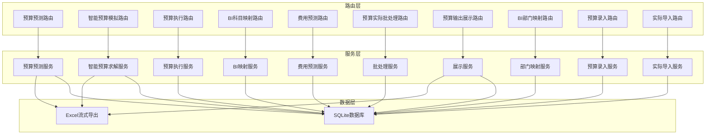
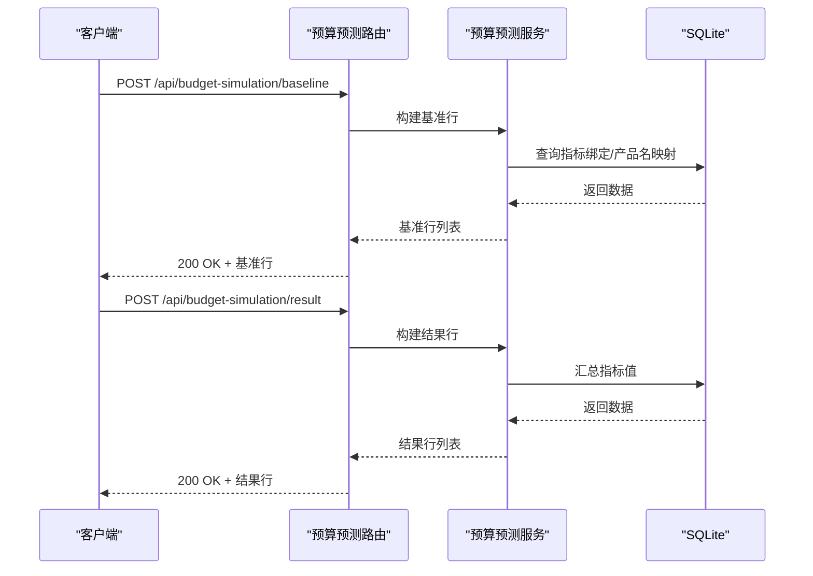
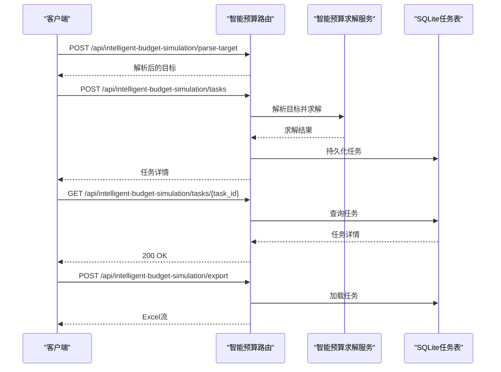
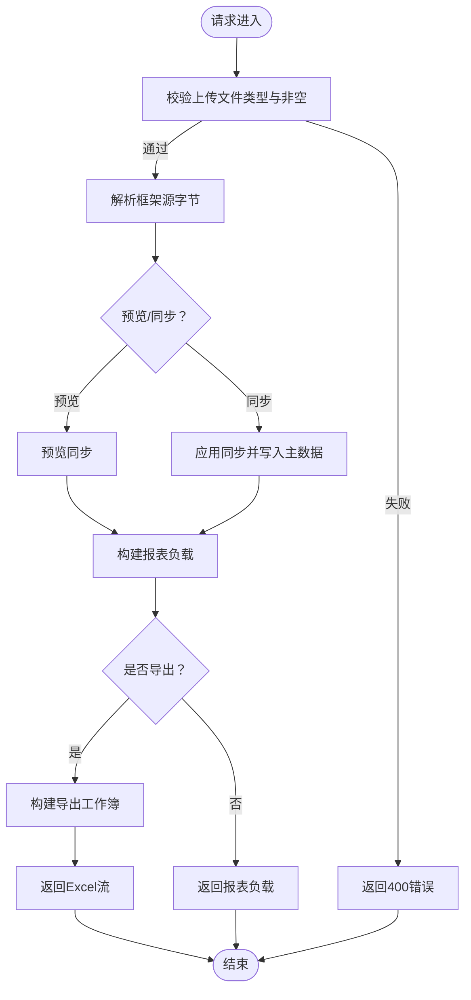
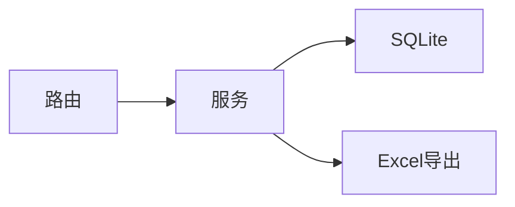

# API接口文档

<cite>
**本文档引用的文件**
- [apps/api/app/main.py](file://apps/api/app/main.py)
- [apps/api/app/routers/budget_simulation.py](file://apps/api/app/routers/budget_simulation.py)
- [apps/api/app/routers/intelligent_budget_simulation.py](file://apps/api/app/routers/intelligent_budget_simulation.py)
- [apps/api/app/routers/expense_budget_execution.py](file://apps/api/app/routers/expense_budget_execution.py)
- [apps/api/app/routers/bi_subject_mapping.py](file://apps/api/app/routers/bi_subject_mapping.py)
- [apps/api/app/routers/expense_forecast.py](file://apps/api/app/routers/expense_forecast.py)
- [apps/api/app/routers/budget_actual_batch.py](file://apps/api/app/routers/budget_actual_batch.py)
- [apps/api/app/routers/budget_output.py](file://apps/api/app/routers/budget_output.py)
- [apps/api/app/routers/bi_department_mapping.py](file://apps/api/app/routers/bi_department_mapping.py)
- [apps/api/app/routers/expense_budget_entry.py](file://apps/api/app/routers/expense_budget_entry.py)
- [apps/api/app/routers/expense_actual_import.py](file://apps/api/app/routers/expense_actual_import.py)
- [apps/api/app/schemas.py](file://apps/api/app/schemas.py)
- [apps/api/app/services/budget_simulation_results.py](file://apps/api/app/services/budget_simulation_results.py)
- [apps/api/app/services/intelligent_budget_solver.py](file://apps/api/app/services/intelligent_budget_solver.py)
- [apps/api/app/services/expense_forecast_view_read_model.py](file://apps/api/app/services/expense_forecast_view_read_model.py)
</cite>

## 目录
1. [简介](#简介)
2. [项目结构](#项目结构)
3. [核心组件](#核心组件)
4. [架构总览](#架构总览)
5. [详细组件分析](#详细组件分析)
6. [依赖关系分析](#依赖关系分析)
7. [性能考量](#性能考量)
8. [故障排除指南](#故障排除指南)
9. [结论](#结论)
10. [附录](#附录)

## 简介
本文件为“智能预算预测系统”的完整API接口文档，覆盖预算预测、智能预算模拟、预算执行、BI映射等模块的RESTful接口规范。内容包括：
- 接口的HTTP方法、URL模式、请求/响应模型与认证方式
- 参数校验规则、数据类型与约束条件
- 错误处理策略、状态码说明与异常场景
- 客户端实现指南、最佳实践、版本控制与迁移建议
- 速率限制、安全与性能优化建议

## 项目结构
后端采用FastAPI框架，通过主应用入口集中注册各模块路由，并以“routers”组织功能模块，“services”承载业务逻辑，“schemas”定义数据模型。

```mermaid
graph TB
A["主应用入口<br/>apps/api/app/main.py"] --> B["预算预测模块<br/>routers/budget_simulation.py"]
A --> C["智能预算模拟模块<br/>routers/intelligent_budget_simulation.py"]
A --> D["预算执行模块<br/>routers/expense_budget_execution.py"]
A --> E["BI科目映射模块<br/>routers/bi_subject_mapping.py"]
A --> F["费用预测模块<br/>routers/expense_forecast.py"]
A --> G["预算实际批处理模块<br/>routers/budget_actual_batch.py"]
A --> H["预算输出展示模块<br/>routers/budget_output.py"]
A --> I["BI部门映射模块<br/>routers/bi_department_mapping.py"]
A --> J["预算录入模块<br/>routers/expense_budget_entry.py"]
A --> K["实际导入模块<br/>routers/expense_actual_import.py"]
A --> L["数据模型定义<br/>schemas.py"]
```

图表来源
- [apps/api/app/main.py:109-412](file://apps/api/app/main.py#L109-L412)
- [apps/api/app/routers/budget_simulation.py:22-73](file://apps/api/app/routers/budget_simulation.py#L22-L73)
- [apps/api/app/routers/intelligent_budget_simulation.py:116-178](file://apps/api/app/routers/intelligent_budget_simulation.py#L116-L178)
- [apps/api/app/routers/expense_budget_execution.py:107-201](file://apps/api/app/routers/expense_budget_execution.py#L107-L201)
- [apps/api/app/routers/bi_subject_mapping.py:39-96](file://apps/api/app/routers/bi_subject_mapping.py#L39-L96)
- [apps/api/app/routers/expense_forecast.py:317-800](file://apps/api/app/routers/expense_forecast.py#L317-L800)
- [apps/api/app/routers/budget_actual_batch.py:162-221](file://apps/api/app/routers/budget_actual_batch.py#L162-L221)
- [apps/api/app/routers/budget_output.py:37-163](file://apps/api/app/routers/budget_output.py#L37-L163)
- [apps/api/app/routers/bi_department_mapping.py:13-50](file://apps/api/app/routers/bi_department_mapping.py#L13-L50)
- [apps/api/app/routers/expense_budget_entry.py:47-291](file://apps/api/app/routers/expense_budget_entry.py#L47-L291)
- [apps/api/app/routers/expense_actual_import.py:37-187](file://apps/api/app/routers/expense_actual_import.py#L37-L187)
- [apps/api/app/schemas.py:1-800](file://apps/api/app/schemas.py#L1-L800)

章节来源
- [apps/api/app/main.py:109-412](file://apps/api/app/main.py#L109-L412)

## 核心组件
- 主应用入口负责中间件、CORS、会话认证中间件、健康检查与模板路由注册，并集中挂载各模块路由。
- 数据模型统一在schemas中定义，包含预算、费用、图表、版本、会话等核心DTO。
- 各模块路由通过工厂函数构建，注入上下文提供器与服务层调用，保证可测试性与可扩展性。

章节来源
- [apps/api/app/main.py:109-412](file://apps/api/app/main.py#L109-L412)
- [apps/api/app/schemas.py:1-800](file://apps/api/app/schemas.py#L1-L800)

## 架构总览
系统采用“路由-服务-数据层”分层架构，路由层负责HTTP协议与参数校验，服务层封装业务流程，数据层通过SQLite/Excel流式导出等方式访问数据。

图表来源
- [apps/api/app/main.py:225-412](file://apps/api/app/main.py#L225-L412)
- [apps/api/app/routers/budget_simulation.py:22-73](file://apps/api/app/routers/budget_simulation.py#L22-L73)
- [apps/api/app/routers/intelligent_budget_simulation.py:116-178](file://apps/api/app/routers/intelligent_budget_simulation.py#L116-L178)
- [apps/api/app/routers/expense_budget_execution.py:107-201](file://apps/api/app/routers/expense_budget_execution.py#L107-L201)
- [apps/api/app/routers/bi_subject_mapping.py:39-96](file://apps/api/app/routers/bi_subject_mapping.py#L39-L96)
- [apps/api/app/routers/expense_forecast.py:317-800](file://apps/api/app/routers/expense_forecast.py#L317-L800)
- [apps/api/app/routers/budget_actual_batch.py:162-221](file://apps/api/app/routers/budget_actual_batch.py#L162-L221)
- [apps/api/app/routers/budget_output.py:37-163](file://apps/api/app/routers/budget_output.py#L37-L163)
- [apps/api/app/routers/bi_department_mapping.py:13-50](file://apps/api/app/routers/bi_department_mapping.py#L13-L50)
- [apps/api/app/routers/expense_budget_entry.py:47-291](file://apps/api/app/routers/expense_budget_entry.py#L47-L291)
- [apps/api/app/routers/expense_actual_import.py:37-187](file://apps/api/app/routers/expense_actual_import.py#L37-L187)

## 详细组件分析

### 预算预测API
- 功能概述：根据机构及产品指标读取基准值，生成模拟测算结果，并支持Excel导出。
- 关键端点
  - POST /api/budget-simulation/baseline
    - 请求体：列表[SimulationBaselineRequestItem]
    - 响应体：列表[SimulationBaselineRow]
    - 认证：会话Cookie
    - 备注：依赖可编辑版本上下文与年度期数映射
  - POST /api/budget-simulation/result
    - 请求体：列表[SimulationInputItem]
    - 响应体：列表[SimulationResultRow]
  - POST /api/budget-simulation/export
    - 请求体：列表[SimulationInputItem]
    - 响应体：Excel流
- 参数与模型
  - 请求模型：SimulationBaselineRequestItem、SimulationInputItem
  - 结果模型：SimulationBaselineRow、SimulationResultRow
- 错误处理
  - 返回400/404等HTTP状态码，错误消息来自服务层抛出的异常
- 性能建议
  - 批量请求合并，避免多次往返
  - 导出前先预览，减少大文件生成次数

图表来源
- [apps/api/app/routers/budget_simulation.py:22-73](file://apps/api/app/routers/budget_simulation.py#L22-L73)
- [apps/api/app/services/budget_simulation_results.py:100-200](file://apps/api/app/services/budget_simulation_results.py#L100-L200)

章节来源
- [apps/api/app/routers/budget_simulation.py:22-73](file://apps/api/app/routers/budget_simulation.py#L22-L73)
- [apps/api/app/services/budget_simulation_results.py:100-200](file://apps/api/app/services/budget_simulation_results.py#L100-L200)
- [apps/api/app/schemas.py:1-800](file://apps/api/app/schemas.py#L1-L800)

### 智能预算模拟API
- 功能概述：解析领导目标，生成多套预算方案，支持任务持久化、查询与导出。
- 关键端点
  - POST /api/intelligent-budget-simulation/parse-target
    - 请求体：ParseTargetRequest
    - 响应体：解析后的目标字典
  - POST /api/intelligent-budget-simulation/tasks
    - 请求体：CreateTaskRequest
    - 响应体：任务详情（含状态、阶段、步骤摘要、基线解、候选解、谈判信息）
    - 认证：会话Cookie
  - GET /api/intelligent-budget-simulation/tasks/{task_id}
    - 响应体：任务详情
  - POST /api/intelligent-budget-simulation/export
    - 请求体：ExportRequest
    - 响应体：Excel流
- 数据模型
  - ParseTargetRequest、CreateTaskRequest、ExportRequest
  - 解析与求解过程中的内部数据类（见服务层）
- 错误处理
  - 未确认目标即求解返回400
  - 任务不存在返回404
- 存储
  - 使用SQLite表存储任务，字段包含JSON序列化的结构

图表来源
- [apps/api/app/routers/intelligent_budget_simulation.py:116-178](file://apps/api/app/routers/intelligent_budget_simulation.py#L116-L178)
- [apps/api/app/services/intelligent_budget_solver.py:1-200](file://apps/api/app/services/intelligent_budget_solver.py#L1-L200)

章节来源
- [apps/api/app/routers/intelligent_budget_simulation.py:116-178](file://apps/api/app/routers/intelligent_budget_simulation.py#L116-L178)
- [apps/api/app/services/intelligent_budget_solver.py:1-200](file://apps/api/app/services/intelligent_budget_solver.py#L1-L200)

### 预算执行API
- 功能概述：查询预算执行报表、状态、框架同步与导出。
- 关键端点
  - GET /api/expense-budget-execution
    - 查询参数：mode、perspective、keyword、include_zero_rows、entity_name、group_name、owner_dept、subject_id、report_month
    - 响应体：展示报表负载
  - GET /api/expense-budget-execution/status
    - 响应体：执行状态
  - POST /api/expense-budget-execution/admin/framework-preview
    - 请求体：Excel文件
    - 响应体：预览同步结果
  - POST /api/expense-budget-execution/admin/framework-sync
    - 请求体：Excel文件 + apply_to_master_data
    - 响应体：同步结果
  - POST /api/expense-budget-execution/export
    - 请求体：ExpenseBudgetExecutionExportRequest
    - 响应体：Excel工作簿流
- 数据模型
  - ExpenseBudgetExecutionExportRequest、ExpenseBudgetExecutionExportOptions、ExpenseBudgetExecutionReportSelection
- 错误处理
  - 报表解析错误返回400
  - 文件类型不支持或空文件返回400
- 导出
  - 使用工作簿流响应，支持暴露下载头

图表来源
- [apps/api/app/routers/expense_budget_execution.py:107-201](file://apps/api/app/routers/expense_budget_execution.py#L107-L201)

章节来源
- [apps/api/app/routers/expense_budget_execution.py:107-201](file://apps/api/app/routers/expense_budget_execution.py#L107-L201)

### BI映射API
- 功能概述：管理BI科目映射与部门归属映射，支持参考数据、重载与自动生成功能。
- BI科目映射
  - GET /api/bi-ai-subject-mapping/list
  - GET /api/bi-ai-subject-mapping/reference-data
  - POST /api/bi-ai-subject-mapping/create
  - PUT /api/bi-ai-subject-mapping/update/{mapping_id}/manage-departments
  - POST /api/bi-ai-subject-mapping/reload
- BI部门映射
  - GET /api/manage-dept-owner-mapping/list
  - POST /api/manage-dept-owner-mapping/create
  - PUT /api/manage-dept-owner-mapping/update/{mapping_id}
  - DELETE /api/manage-dept-owner-mapping/delete/{mapping_id}
  - POST /api/manage-dept-owner-mapping/auto-generate
  - GET /api/manage-dept-owner-mapping/reference-data
- 错误处理
  - 缺失/错误的头部、源文件缺失、更新失败分别返回400/404

章节来源
- [apps/api/app/routers/bi_subject_mapping.py:39-96](file://apps/api/app/routers/bi_subject_mapping.py#L39-L96)
- [apps/api/app/routers/bi_department_mapping.py:13-50](file://apps/api/app/routers/bi_department_mapping.py#L13-L50)

### 费用预测API
- 功能概述：费用预测视图、规则管理、导入预览/应用、导出、追踪与重算。
- 关键端点
  - GET /api/expense-forecast/meta
  - GET /api/expense-forecast/view/scope
  - GET /api/expense-forecast/view/group
  - GET /api/expense-forecast/view/subject
  - POST /api/expense-forecast/cell
  - POST /api/expense-forecast/import-preview
  - POST /api/expense-forecast/import-apply
  - POST /api/expense-forecast/export
  - POST /api/expense-forecast/group-export
  - POST /api/expense-forecast/rules
  - GET /api/expense-forecast/rules/{rule_id}
  - PUT /api/expense-forecast/rules/{rule_id}
  - DELETE /api/expense-forecast/rules/{rule_id}
  - POST /api/expense-forecast/rules/copy
  - POST /api/expense-forecast/rules/import-preview
  - POST /api/expense-forecast/rules/import-apply
  - GET /api/expense-forecast/rules/template
  - POST /api/expense-forecast/rules/recalculate
  - POST /api/expense-forecast/trace
- 数据模型
  - ExpenseForecastMetaResponse、ExpenseForecastViewResponse、ExpenseForecastRow、ExpenseForecastMonthCell
  - ExpenseForecastCellUpsertRequest/Response、ExpenseForecastImportPreviewResponse、ExpenseForecastImportApplyResponse
  - ExpenseForecastExportRequest、ExpenseForecastGroupExportRequest
  - ExpenseForecastRuleSaveRequest、ExpenseForecastRuleRow、ExpenseForecastTraceResponse
- 错误处理
  - 上下文缺失、规则保存错误、导入解析错误等返回400/500
- 导出
  - 支持按范围/主体/组导出，Excel流响应

章节来源
- [apps/api/app/routers/expense_forecast.py:317-800](file://apps/api/app/routers/expense_forecast.py#L317-L800)
- [apps/api/app/services/expense_forecast_view_read_model.py:1-200](file://apps/api/app/services/expense_forecast_view_read_model.py#L1-L200)

### 预算实际批处理API
- 功能概述：批量预览与执行预算/实际数据处理，支持公式重算、汇总重建、对比数据同步。
- 关键端点
  - GET /api/budget-actual-batch/versions
  - POST /api/budget-actual-batch/preview
  - GET /api/budget-actual-batch/history
  - POST /api/budget-actual-batch/run
- 数据模型
  - BudgetActualBatchRequest、BudgetActualBatchResponse、BudgetActualBatchHistoryItem
- 错误处理
  - 版本不存在/产品不存在返回400/404

章节来源
- [apps/api/app/routers/budget_actual_batch.py:162-221](file://apps/api/app/routers/budget_actual_batch.py#L162-L221)

### 预算输出展示API
- 功能概述：展示配置管理、重建、报表生成与导出。
- 关键端点
  - GET /api/budget-output/display-config
  - GET /api/budget-output/display-config/export
  - POST /api/budget-output/display-config/import
  - POST /api/budget-output/display-config/rebuild-from-org-product
  - POST /api/budget-output/display-config/items
  - PATCH /api/budget-output/display-config/items/{row_key}
  - DELETE /api/budget-output/display-config/items/{row_key}
  - GET /api/budget-output/display-report
  - GET /api/budget-output/display-report/export-full
- 数据模型
  - BudgetOutputDisplayConfigResponse、BudgetOutputDisplayConfigCreate、BudgetOutputDisplayConfigUpdate
  - BudgetOutputDisplayReportResponse、BudgetOutputProductNodeDto、BudgetOutputReportNodeDto
- 错误处理
  - 配置错误返回对应状态码与详情

章节来源
- [apps/api/app/routers/budget_output.py:37-163](file://apps/api/app/routers/budget_output.py#L37-L163)

### 预算录入API
- 功能概述：预算录入模板下载、批次与明细查询、行更新、导入预览/导出/应用。
- 关键端点
  - GET /api/expense-budget-entry/template
  - GET /api/expense-budget-entry/batches
  - GET /api/expense-budget-entry/rows
  - PATCH /api/expense-budget-entry/rows/{row_id}
  - DELETE /api/expense-budget-entry/batches/{batch_id}
  - POST /api/expense-budget-entry/import-preview
  - POST /api/expense-budget-entry/import-export
  - POST /api/expense-budget-entry/import-apply
- 数据模型
  - ExpenseBudgetEntryBatchRow、ExpenseBudgetEntryRow、ExpenseBudgetEntryUpdateRequest
  - ExpenseBudgetEntryPreviewResponse、ExpenseBudgetEntryApplyResponse
- 错误处理
  - 单行缺失/批次缺失、单位解析错误、解析错误返回400/404

章节来源
- [apps/api/app/routers/expense_budget_entry.py:47-291](file://apps/api/app/routers/expense_budget_entry.py#L47-L291)

### 实际导入API
- 功能概述：部门费用实际导入的批次管理、导出、删除与导入预览/应用。
- 关键端点
  - GET /api/expense-actual-import/batches
  - GET /api/expense-actual-import/export
  - DELETE /api/expense-actual-import/batches/{batch_id}
  - POST /api/expense-actual-import/import-preview
  - POST /api/expense-actual-import/import-apply
- 数据模型
  - ExpenseActualImportBatchRow、ExpenseActualImportPreviewResponse、ExpenseActualImportApplyResponse
- 错误处理
  - 类型非法、缺失/导出缺失、解析错误返回400/404

章节来源
- [apps/api/app/routers/expense_actual_import.py:37-187](file://apps/api/app/routers/expense_actual_import.py#L37-L187)

## 依赖关系分析
- 路由依赖
  - 各路由通过工厂函数构建，注入上下文提供器（如可编辑版本、年度期数映射）、服务层调用与导出工具
- 服务依赖
  - 预算预测服务依赖指标绑定与产品名映射；智能预算求解服务依赖评分与目标解析；费用预测服务依赖规则、重算与视图模型
- 数据依赖
  - SQLite用于任务存储与业务数据；Excel流用于导出

图表来源
- [apps/api/app/routers/intelligent_budget_simulation.py:116-178](file://apps/api/app/routers/intelligent_budget_simulation.py#L116-L178)
- [apps/api/app/services/intelligent_budget_solver.py:1-200](file://apps/api/app/services/intelligent_budget_solver.py#L1-L200)

章节来源
- [apps/api/app/routers/intelligent_budget_simulation.py:116-178](file://apps/api/app/routers/intelligent_budget_simulation.py#L116-L178)
- [apps/api/app/services/intelligent_budget_solver.py:1-200](file://apps/api/app/services/intelligent_budget_solver.py#L1-L200)

## 性能考量
- 批量处理：优先使用批量端点（如预算预测导出、费用预测导出），减少请求次数
- 分页与限制：历史查询支持limit参数，建议合理设置上限（如最大200）
- 导出优化：先预览再导出，避免重复生成大文件
- 并发与连接：服务层使用异步SQLite连接，注意并发写入与事务边界
- 缓存与索引：在数据层建立必要索引，提升查询性能（如预算版本、指标绑定）

## 故障排除指南
- 常见错误
  - 400：参数非法、文件类型不支持、解析错误、规则保存错误
  - 404：版本不存在、产品不存在、任务不存在、批次不存在
  - 500：规则保存内部错误
- 排查步骤
  - 检查请求参数与文件格式
  - 查看服务日志与操作审计
  - 确认数据库表结构与版本上下文
- 建议
  - 在客户端实现重试与幂等设计
  - 对大文件导出增加超时与进度反馈

章节来源
- [apps/api/app/routers/budget_actual_batch.py:154-160](file://apps/api/app/routers/budget_actual_batch.py#L154-L160)
- [apps/api/app/routers/expense_budget_execution.py:103-105](file://apps/api/app/routers/expense_budget_execution.py#L103-L105)
- [apps/api/app/routers/expense_forecast.py:641-643](file://apps/api/app/routers/expense_forecast.py#L641-L643)

## 结论
本API文档覆盖了智能预算预测系统的预算预测、智能预算模拟、预算执行、BI映射、费用预测、预算实际批处理、预算输出展示、预算录入与实际导入等核心模块。通过清晰的端点定义、数据模型与错误处理策略，为前端与集成方提供了稳定可靠的接口规范。建议在生产环境中结合速率限制、鉴权与监控机制，持续优化性能与可靠性。

## 附录
- 认证与会话
  - 采用会话Cookie进行认证，中间件在HTTP层拦截并加载会话上下文
- CORS与跨域
  - 已启用CORS中间件，支持动态Origin正则匹配
- 版本控制与迁移
  - API路径不含版本号，建议在网关层或反向代理层做版本路由；如需迁移，保持向后兼容或提供迁移脚本
- 速率限制与安全
  - 建议在网关层实施限流与WAF；敏感端点（如框架同步、规则导入）建议额外鉴权
- 最佳实践
  - 使用Excel模板与预览后再应用，减少错误导入
  - 对批量操作使用异步导出与进度反馈
  - 对关键写操作记录审计日志

章节来源
- [apps/api/app/main.py:110-118](file://apps/api/app/main.py#L110-L118)
- [apps/api/app/main.py:225-230](file://apps/api/app/main.py#L225-L230)
- [apps/api/app/main.py:233-247](file://apps/api/app/main.py#L233-L247)