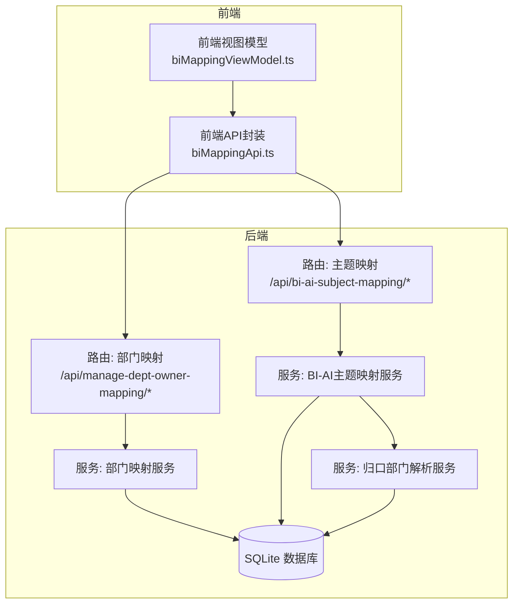
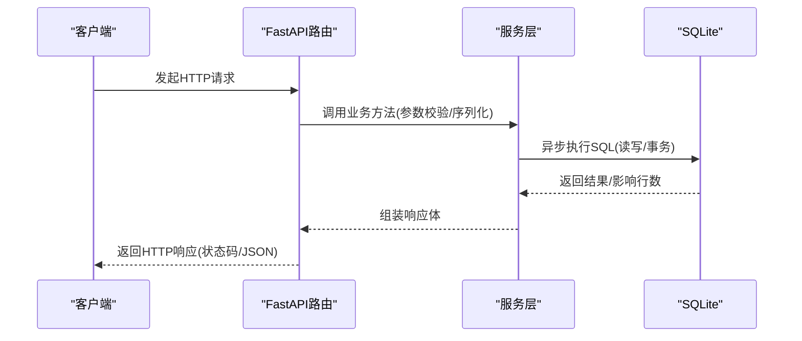
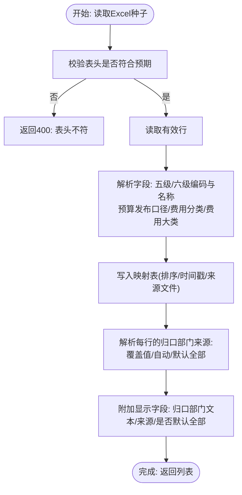
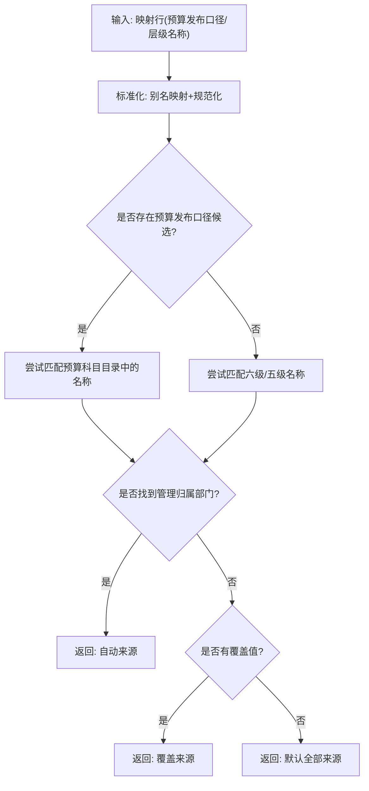
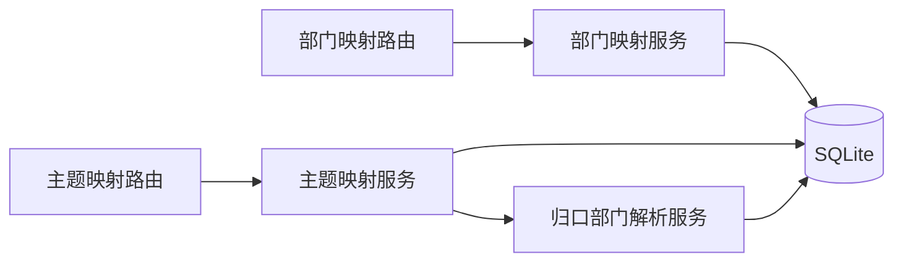

# BI映射API

<cite>
**本文引用的文件**
- [apps/api/app/routers/bi_department_mapping.py](file://apps/api/app/routers/bi_department_mapping.py)
- [apps/api/app/routers/bi_subject_mapping.py](file://apps/api/app/routers/bi_subject_mapping.py)
- [apps/api/app/services/bi_department_mapping.py](file://apps/api/app/services/bi_department_mapping.py)
- [apps/api/app/services/bi_ai_subject_mapping.py](file://apps/api/app/services/bi_ai_subject_mapping.py)
- [apps/api/app/services/bi_ai_manage_department.py](file://apps/api/app/services/bi_ai_manage_department.py)
- [apps/api/app/db_bootstrap/expense.py](file://apps/api/app/db_bootstrap/expense.py)
- [apps/api/test_bi_department_mapping_service.py](file://apps/api/test_bi_department_mapping_service.py)
- [apps/api/test_bi_ai_subject_mapping_service.py](file://apps/api/test_bi_ai_subject_mapping_service.py)
- [apps/web/src/lib/biMappingApi.ts](file://apps/web/src/lib/biMappingApi.ts)
- [apps/web/src/lib/biMappingViewModel.ts](file://apps/web/src/lib/biMappingViewModel.ts)
</cite>

## 目录
1. [简介](#简介)
2. [项目结构](#项目结构)
3. [核心组件](#核心组件)
4. [架构总览](#架构总览)
5. [详细组件分析](#详细组件分析)
6. [依赖分析](#依赖分析)
7. [性能考虑](#性能考虑)
8. [故障排查指南](#故障排查指南)
9. [结论](#结论)
10. [附录](#附录)

## 简介
本文件为“BI映射模块”的完整API接口文档，覆盖以下能力：
- 部门-指标映射：维护“归口管理部门”与“费用归属部门”的一对一映射，支持列表、创建、更新、删除、自动推导、参考数据查询。
- 主题映射（BI-AI科目映射）：维护BI六级科目与预算发布口径、费用分类的映射，支持列表、创建、手动指定归口部门、Excel种子导入重载、参考数据查询。
- AI管理（归口部门解析）：对映射行进行“归口部门”的自动解析与校验，支持显示来源（覆盖/自动/默认全部），并生成校验报告。

文档提供每个端点的HTTP方法、URL、请求/响应格式、参数校验规则、映射逻辑与AI算法接口规范、错误处理策略、状态码说明以及客户端实现与优化建议。

## 项目结构
- 后端采用FastAPI路由+服务层设计，数据库通过SQLite异步访问，核心映射表由引导脚本确保结构契约。
- 前端通过独立API封装模块调用后端接口，提供类型定义与视图模型辅助。

图表来源
- [apps/api/app/routers/bi_department_mapping.py:13-49](file://apps/api/app/routers/bi_department_mapping.py#L13-L49)
- [apps/api/app/routers/bi_subject_mapping.py:39-95](file://apps/api/app/routers/bi_subject_mapping.py#L39-L95)
- [apps/api/app/services/bi_department_mapping.py:84-215](file://apps/api/app/services/bi_department_mapping.py#L84-L215)
- [apps/api/app/services/bi_ai_subject_mapping.py:209-381](file://apps/api/app/services/bi_ai_subject_mapping.py#L209-L381)
- [apps/api/app/services/bi_ai_manage_department.py:109-288](file://apps/api/app/services/bi_ai_manage_department.py#L109-L288)
- [apps/web/src/lib/biMappingApi.ts:58-110](file://apps/web/src/lib/biMappingApi.ts#L58-L110)
- [apps/web/src/lib/biMappingViewModel.ts:1-129](file://apps/web/src/lib/biMappingViewModel.ts#L1-L129)

章节来源
- [apps/api/app/routers/bi_department_mapping.py:13-49](file://apps/api/app/routers/bi_department_mapping.py#L13-L49)
- [apps/api/app/routers/bi_subject_mapping.py:39-95](file://apps/api/app/routers/bi_subject_mapping.py#L39-L95)
- [apps/api/app/services/bi_department_mapping.py:84-215](file://apps/api/app/services/bi_department_mapping.py#L84-L215)
- [apps/api/app/services/bi_ai_subject_mapping.py:209-381](file://apps/api/app/services/bi_ai_subject_mapping.py#L209-L381)
- [apps/api/app/services/bi_ai_manage_department.py:109-288](file://apps/api/app/services/bi_ai_manage_department.py#L109-L288)
- [apps/web/src/lib/biMappingApi.ts:58-110](file://apps/web/src/lib/biMappingApi.ts#L58-L110)
- [apps/web/src/lib/biMappingViewModel.ts:1-129](file://apps/web/src/lib/biMappingViewModel.ts#L1-L129)

## 核心组件
- 部门映射路由与服务
  - 提供列表、创建、更新、删除、自动推导、参考数据查询等端点。
  - 错误以统一异常包装，返回HTTP状态码与详情。
- 主题映射路由与服务
  - 提供列表、参考数据、创建、更新归口部门、Excel重载等端点。
  - 支持Excel种子文件校验与强制重载。
- 归口部门解析服务
  - 将预算发布口径、科目层级名称标准化并映射到预算科目目录中的“管理归属部门”。
  - 支持覆盖值、自动解析、默认全部三种来源，生成校验报告。

章节来源
- [apps/api/app/routers/bi_department_mapping.py:13-49](file://apps/api/app/routers/bi_department_mapping.py#L13-L49)
- [apps/api/app/routers/bi_subject_mapping.py:39-95](file://apps/api/app/routers/bi_subject_mapping.py#L39-L95)
- [apps/api/app/services/bi_ai_manage_department.py:109-288](file://apps/api/app/services/bi_ai_manage_department.py#L109-L288)

## 架构总览
后端采用“路由-服务-数据库”三层结构，路由负责HTTP协议与参数校验，服务层负责业务逻辑与数据访问，数据库通过异步连接池访问SQLite。主题映射服务在解析时依赖预算科目目录与部门科目维护表，形成跨表映射。

图表来源
- [apps/api/app/routers/bi_department_mapping.py:16-39](file://apps/api/app/routers/bi_department_mapping.py#L16-L39)
- [apps/api/app/routers/bi_subject_mapping.py:42-93](file://apps/api/app/routers/bi_subject_mapping.py#L42-L93)
- [apps/api/app/services/bi_department_mapping.py:101-155](file://apps/api/app/services/bi_department_mapping.py#L101-L155)
- [apps/api/app/services/bi_ai_subject_mapping.py:306-372](file://apps/api/app/services/bi_ai_subject_mapping.py#L306-L372)

## 详细组件分析

### 部门-指标映射（归口部门-费用归属部门）
- 端点概览
  - GET /api/manage-dept-owner-mapping/list：列出所有映射
  - POST /api/manage-dept-owner-mapping/create：创建映射
  - PUT /api/manage-dept-owner-mapping/update/{mapping_id}：更新费用归属部门
  - DELETE /api/manage-dept-owner-mapping/delete/{mapping_id}：删除映射
  - POST /api/manage-dept-owner-mapping/auto-generate：基于实际数据自动推导映射
  - GET /api/manage-dept-owner-mapping/reference-data：获取参考数据（可选）

- 请求/响应格式
  - 列表项结构：包含id、归口管理部门、费用归属部门
  - 创建/更新请求体：包含归口管理部门、费用归属部门
  - 自动推导返回：包含生成数量与跳过数量
  - 参考数据：包含可选的归口部门、费用归属部门、按组织分组的费用归属部门树

- 参数校验规则
  - 创建/更新必填字段非空；创建时若归口部门已存在则冲突（409）
  - 删除/更新若记录不存在返回404
  - 自动推导会过滤无效或不在费用归属部门清单中的条目

- 映射逻辑
  - 自动推导从原始费用明细中提取“归口部门-费用归属部门”对，去重后写入映射表
  - 参考数据来源于部门科目维护表与原始费用明细

- 错误处理与状态码
  - 400：必填字段为空、参数非法
  - 404：记录不存在
  - 409：重复映射冲突

- 客户端实现要点
  - 使用前端API封装函数进行调用
  - 在UI中展示“其他-手填费用归属”等兜底选项
  - 对自动推导结果进行二次确认与修正

章节来源
- [apps/api/app/routers/bi_department_mapping.py:16-49](file://apps/api/app/routers/bi_department_mapping.py#L16-L49)
- [apps/api/app/services/bi_department_mapping.py:84-215](file://apps/api/app/services/bi_department_mapping.py#L84-L215)
- [apps/web/src/lib/biMappingApi.ts:58-85](file://apps/web/src/lib/biMappingApi.ts#L58-L85)
- [apps/web/src/lib/biMappingViewModel.ts:107-129](file://apps/web/src/lib/biMappingViewModel.ts#L107-L129)

### 主题映射（BI-AI科目映射）
- 端点概览
  - GET /api/bi-ai-subject-mapping/list：列出映射并附带解析后的归口部门信息
  - GET /api/bi-ai-subject-mapping/reference-data：获取可选的费用归属部门列表
  - POST /api/bi-ai-subject-mapping/create：创建一条映射（可选设置归口部门覆盖）
  - PUT /api/bi-ai-subject-mapping/update/{id}/manage-departments：更新某条映射的归口部门覆盖
  - POST /api/bi-ai-subject-mapping/reload：重载Excel种子文件（强制重载需存在源文件）

- 请求/响应格式
  - 列表项结构：包含五级/六级编码与名称、预算发布口径、费用分类、费用大类、解析后的归口部门、来源（覆盖/自动/默认全部）、是否默认全部、排序、来源文件等
  - 创建请求体：包含五级/六级编码与名称、预算发布口径、费用分类、费用大类、可选归口部门覆盖
  - 更新归口部门请求体：包含归口部门数组或null（清空覆盖）
  - 重载返回：包含行数与来源文件名

- 参数校验规则
  - 创建时五级/六级编码与名称、预算发布口径必填
  - 归口部门必须属于部门科目维护范围，否则报错
  - 表头必须符合预期，否则拒绝导入

- 映射逻辑与AI算法接口规范
  - 解析优先级：预算发布口径 → 六级名称 → 五级名称 → 默认全部
  - 标准化：对预算发布口径、科目名称使用别名映射与规范化处理
  - 来源标注：覆盖值（手动）、自动（从预算科目目录继承）、默认全部（当无法解析且无覆盖时）
  - 校验报告：统计解析成功/失败数量与样本

- 错误处理与状态码
  - 400：表头不符、参数非法、部门不在维护范围内
  - 404：源文件缺失（重载时）
  - 404：更新记录不存在

- 客户端实现要点
  - 使用前端API封装函数进行调用
  - 在表格中允许编辑“归口部门”列（对应更新归口部门覆盖）
  - 展示来源标识与默认全部提示

图表来源
- [apps/api/app/services/bi_ai_subject_mapping.py:93-206](file://apps/api/app/services/bi_ai_subject_mapping.py#L93-L206)
- [apps/api/app/services/bi_ai_subject_mapping.py:121-149](file://apps/api/app/services/bi_ai_subject_mapping.py#L121-L149)
- [apps/api/app/services/bi_ai_manage_department.py:158-218](file://apps/api/app/services/bi_ai_manage_department.py#L158-L218)

章节来源
- [apps/api/app/routers/bi_subject_mapping.py:42-93](file://apps/api/app/routers/bi_subject_mapping.py#L42-L93)
- [apps/api/app/services/bi_ai_subject_mapping.py:209-381](file://apps/api/app/services/bi_ai_subject_mapping.py#L209-L381)
- [apps/api/app/services/bi_ai_manage_department.py:109-288](file://apps/api/app/services/bi_ai_manage_department.py#L109-L288)
- [apps/web/src/lib/biMappingApi.ts:87-110](file://apps/web/src/lib/biMappingApi.ts#L87-L110)

### 归口部门解析服务（AI算法接口）
- 功能概述
  - 将预算发布口径、科目层级名称标准化并映射到预算科目目录中的“管理归属部门”
  - 支持别名映射、规范化、索引构建与校验报告生成
  - 提供“覆盖值/自动/默认全部”的解析来源判定

- 关键流程
  - 构建预算科目目录的“按名称→管理归属部门”的映射
  - 构建预算发布口径到科目名称的候选映射
  - 对每行映射计算解析结果与来源，并生成显示文本

图表来源
- [apps/api/app/services/bi_ai_manage_department.py:158-218](file://apps/api/app/services/bi_ai_manage_department.py#L158-L218)
- [apps/api/app/services/bi_ai_manage_department.py:221-247](file://apps/api/app/services/bi_ai_manage_department.py#L221-L247)

章节来源
- [apps/api/app/services/bi_ai_manage_department.py:109-288](file://apps/api/app/services/bi_ai_manage_department.py#L109-L288)

## 依赖分析
- 路由到服务
  - 部门映射路由直接调用部门映射服务
  - 主题映射路由调用主题映射服务，后者进一步调用归口部门解析服务
- 服务到数据库
  - 所有服务通过异步SQLite连接执行DDL/DML
  - 引导脚本确保表结构与约束满足当前契约
- 前端到后端
  - 前端API封装模块提供强类型DTO与端点调用
  - 视图模型负责表格列定义、筛选与部门树构建

图表来源
- [apps/api/app/routers/bi_department_mapping.py:13-49](file://apps/api/app/routers/bi_department_mapping.py#L13-L49)
- [apps/api/app/routers/bi_subject_mapping.py:39-95](file://apps/api/app/routers/bi_subject_mapping.py#L39-L95)
- [apps/api/app/services/bi_department_mapping.py:84-215](file://apps/api/app/services/bi_department_mapping.py#L84-L215)
- [apps/api/app/services/bi_ai_subject_mapping.py:209-381](file://apps/api/app/services/bi_ai_subject_mapping.py#L209-L381)
- [apps/api/app/services/bi_ai_manage_department.py:109-288](file://apps/api/app/services/bi_ai_manage_department.py#L109-L288)

章节来源
- [apps/api/app/db_bootstrap/expense.py:139-166](file://apps/api/app/db_bootstrap/expense.py#L139-L166)
- [apps/api/app/db_bootstrap/expense.py:566-616](file://apps/api/app/db_bootstrap/expense.py#L566-L616)

## 性能考虑
- SQLite异步访问：服务层使用异步连接，避免阻塞事件循环
- 查询索引：预算预测相关表具备常用查询索引，映射查询主要为小规模表，性能可控
- 批量操作：自动推导与Excel重载采用批量插入，减少往返次数
- 字段标准化：别名映射与规范化减少模糊匹配成本
- 建议
  - 控制Excel种子文件大小与行数，避免一次性导入过多数据
  - 对频繁更新的映射行，尽量使用覆盖值以减少解析开销
  - 前端分页/虚拟滚动展示大量映射行

## 故障排查指南
- 常见错误与处理
  - 400：表头不符/参数非法/部门不在维护范围内
    - 检查Excel表头是否与期望一致；检查部门名称是否存在于维护表
  - 404：源文件缺失/记录不存在
    - 确认种子文件路径与命名；确认映射ID正确
  - 409：重复映射冲突
    - 检查归口部门是否已存在映射
- 校验与诊断
  - 使用“管理归属部门解析校验”报告查看解析缺失样本
  - 对比“预算发布口径”与“科目名称”的标准化结果，确认别名映射是否生效
- 单元测试参考
  - 部门映射：自动推导、重复冲突、参考数据
  - 主题映射：种子缺失、表头不符、正常导入与列表

章节来源
- [apps/api/app/services/bi_ai_subject_mapping.py:41-54](file://apps/api/app/services/bi_ai_subject_mapping.py#L41-L54)
- [apps/api/app/services/bi_ai_subject_mapping.py:269-303](file://apps/api/app/services/bi_ai_subject_mapping.py#L269-L303)
- [apps/api/app/services/bi_department_mapping.py:108-141](file://apps/api/app/services/bi_department_mapping.py#L108-L141)
- [apps/api/test_bi_department_mapping_service.py:72-123](file://apps/api/test_bi_department_mapping_service.py#L72-L123)
- [apps/api/test_bi_ai_subject_mapping_service.py:32-83](file://apps/api/test_bi_ai_subject_mapping_service.py#L32-L83)

## 结论
本模块提供了完善的BI映射能力：部门-指标映射用于维护归口与费用归属的稳定关系，主题映射用于将BI六级科目与预算口径、费用分类关联，并通过AI解析服务实现自动归口部门推断与校验。前后端配合提供强类型API与视图模型，便于快速集成与扩展。

## 附录

### 端点一览与规范

- 部门-指标映射
  - GET /api/manage-dept-owner-mapping/list
    - 响应：映射列表
  - POST /api/manage-dept-owner-mapping/create
    - 请求体：{ manage_department, owner_department }
    - 响应：创建后的映射
  - PUT /api/manage-dept-owner-mapping/update/{mapping_id}
    - 请求体：{ owner_department }
    - 响应：{ id, owner_department }
  - DELETE /api/manage-dept-owner-mapping/delete/{mapping_id}
    - 响应：{ id }
  - POST /api/manage-dept-owner-mapping/auto-generate
    - 响应：{ generated, skipped }
  - GET /api/manage-dept-owner-mapping/reference-data
    - 响应：{ manage_departments, owner_departments, owner_dept_groups }

- 主题映射（BI-AI科目映射）
  - GET /api/bi-ai-subject-mapping/list
    - 响应：映射列表（含解析后的归口部门与来源）
  - GET /api/bi-ai-subject-mapping/reference-data
    - 响应：{ expense_departments }
  - POST /api/bi-ai-subject-mapping/create
    - 请求体：{ level5_code, level5_name, level6_code, level6_name, budget_release_caliber, fee_category, fee_major, manage_departments }
    - 响应：创建后的映射
  - PUT /api/bi-ai-subject-mapping/update/{id}/manage-departments
    - 请求体：{ manage_departments }
    - 响应：更新后的映射
  - POST /api/bi-ai-subject-mapping/reload
    - 响应：{ row_count, source_file }

- 参数与校验要点
  - 部门映射：创建必填两部门；更新必填费用归属部门；冲突409；不存在404
  - 主题映射：创建必填五级/六级编码与名称、预算发布口径；部门必须在维护范围内；表头不符400；源文件缺失404

- 响应字段说明（摘录）
  - 部门映射：id, manage_department, owner_department
  - 主题映射：id, level5_code, level5_name, level6_code, level6_name, budget_release_caliber, fee_category, fee_major, manage_department, manage_departments, manage_department_source, manage_department_override, manage_department_is_default_all, sort_order, source_file

- 状态码
  - 200：成功
  - 400：参数/数据错误
  - 404：资源不存在
  - 409：冲突

章节来源
- [apps/api/app/routers/bi_department_mapping.py:16-49](file://apps/api/app/routers/bi_department_mapping.py#L16-L49)
- [apps/api/app/routers/bi_subject_mapping.py:42-93](file://apps/api/app/routers/bi_subject_mapping.py#L42-L93)
- [apps/api/app/services/bi_ai_subject_mapping.py:209-381](file://apps/api/app/services/bi_ai_subject_mapping.py#L209-L381)
- [apps/api/app/services/bi_ai_manage_department.py:250-287](file://apps/api/app/services/bi_ai_manage_department.py#L250-L287)