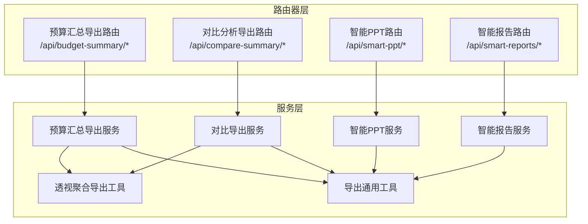
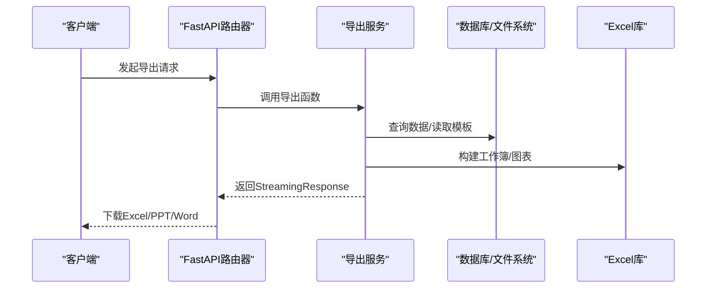
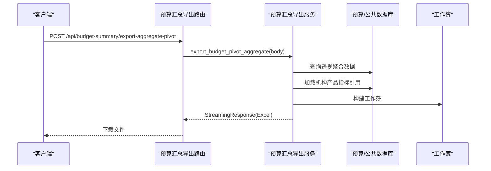
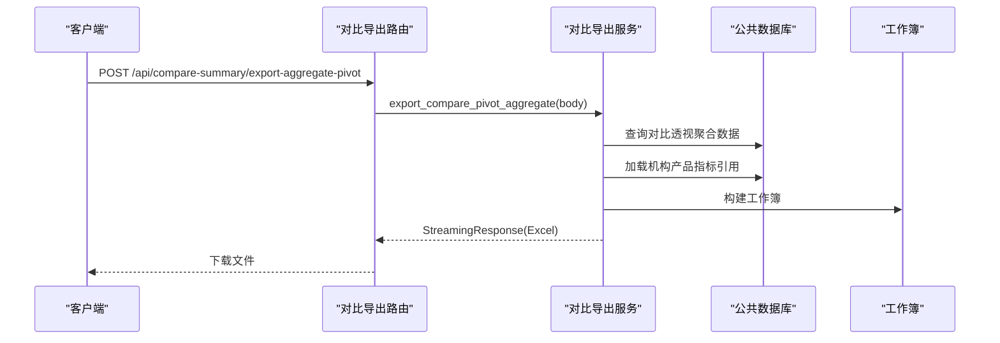
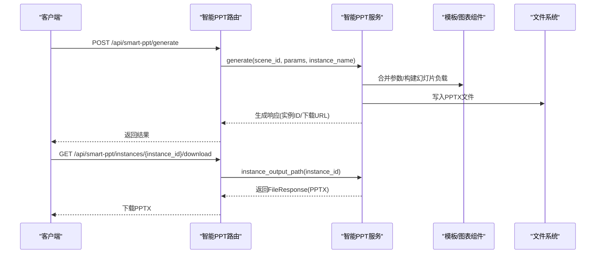
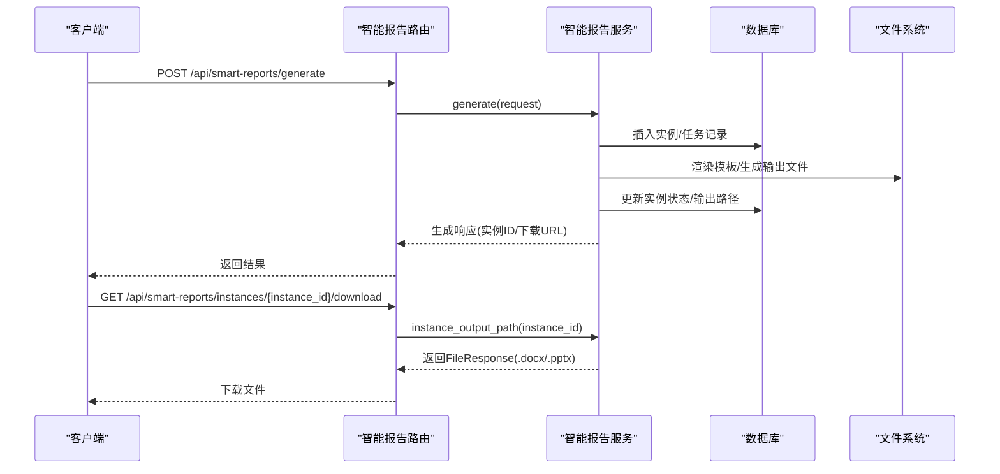
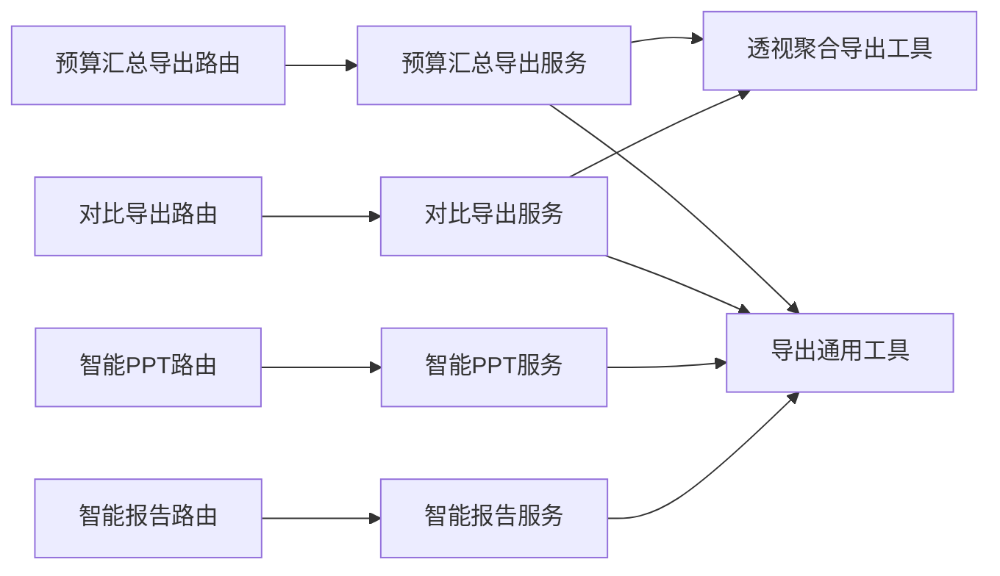

# 数据导出API

<cite>
**本文档引用的文件**
- [apps/api/app/routers/budget_summary_export.py](file://apps/api/app/routers/budget_summary_export.py)
- [apps/api/app/routers/compare_summary_export.py](file://apps/api/app/routers/compare_summary_export.py)
- [apps/api/app/routers/smart_ppt.py](file://apps/api/app/routers/smart_ppt.py)
- [apps/api/app/routers/smart_reports.py](file://apps/api/app/routers/smart_reports.py)
- [apps/api/app/services/budget_summary_export_service.py](file://apps/api/app/services/budget_summary_export_service.py)
- [apps/api/app/services/compare_export_service.py](file://apps/api/app/services/compare_export_service.py)
- [apps/api/app/services/export_common.py](file://apps/api/app/services/export_common.py)
- [apps/api/app/services/pivot_aggregate_export.py](file://apps/api/app/services/pivot_aggregate_export.py)
- [apps/api/app/services/smart_ppt_service.py](file://apps/api/app/services/smart_ppt_service.py)
- [apps/api/app/services/smart_report_service.py](file://apps/api/app/services/smart_report_service.py)
- [apps/api/app/schemas.py](file://apps/api/app/schemas.py)
</cite>

## 目录
1. [简介](#简介)
2. [项目结构](#项目结构)
3. [核心组件](#核心组件)
4. [架构总览](#架构总览)
5. [详细组件分析](#详细组件分析)
6. [依赖分析](#依赖分析)
7. [性能考虑](#性能考虑)
8. [故障排查指南](#故障排查指南)
9. [结论](#结论)
10. [附录](#附录)

## 简介
本文件面向“数据导出模块”的RESTful API，覆盖以下能力：
- 预算汇总导出：支持透视聚合导出、公式树带公式的导出
- 对比分析导出：多版本/多年度对比透视聚合导出
- 智能PPT生成：场景驱动的PPT生成、模板绑定、图表渲染与下载
- 智能报告：模板化报告生成、蓝图生成、变量绑定、AI解析与下载
- 公共导出能力：Excel流式响应、列宽自适应、版本信息拼接等

文档提供每个端点的HTTP方法、URL模式、请求/响应格式、参数校验规则、文件格式支持、错误处理策略、状态码说明以及客户端实现建议。

## 项目结构
导出相关模块主要分布在后端应用的路由器与服务层：
- 路由器层：定义REST端点与路径前缀
- 服务层：封装具体导出逻辑（数据库查询、Excel构建、文件写入）
- 公共工具：统一的Excel流式响应、列宽适配、版本信息拼接等
- 数据模型：Pydantic模型定义请求/响应结构

**图示来源**
- [apps/api/app/routers/budget_summary_export.py:10-23](file://apps/api/app/routers/budget_summary_export.py#L10-L23)
- [apps/api/app/routers/compare_summary_export.py:10-20](file://apps/api/app/routers/compare_summary_export.py#L10-L20)
- [apps/api/app/routers/smart_ppt.py:26-107](file://apps/api/app/routers/smart_ppt.py#L26-L107)
- [apps/api/app/routers/smart_reports.py:32-220](file://apps/api/app/routers/smart_reports.py#L32-L220)
- [apps/api/app/services/budget_summary_export_service.py:55-96](file://apps/api/app/services/budget_summary_export_service.py#L55-L96)
- [apps/api/app/services/compare_export_service.py:13-33](file://apps/api/app/services/compare_export_service.py#L13-L33)
- [apps/api/app/services/export_common.py:28-77](file://apps/api/app/services/export_common.py#L28-L77)
- [apps/api/app/services/pivot_aggregate_export.py:89-294](file://apps/api/app/services/pivot_aggregate_export.py#L89-L294)

**章节来源**
- [apps/api/app/routers/budget_summary_export.py:10-23](file://apps/api/app/routers/budget_summary_export.py#L10-L23)
- [apps/api/app/routers/compare_summary_export.py:10-20](file://apps/api/app/routers/compare_summary_export.py#L10-L20)
- [apps/api/app/routers/smart_ppt.py:26-107](file://apps/api/app/routers/smart_ppt.py#L26-L107)
- [apps/api/app/routers/smart_reports.py:32-220](file://apps/api/app/routers/smart_reports.py#L32-L220)

## 核心组件
- 预算汇总导出服务：负责透视聚合导出与公式树带公式导出，返回Excel流
- 对比导出服务：负责多版本/多年度对比透视聚合导出，返回Excel流
- 智能PPT服务：负责场景管理、参数合并、数据取数、图表渲染、PPT组装与下载
- 智能报告服务：负责模板管理、变量绑定、AI解析、报告生成与下载
- 导出通用工具：统一的Excel流式响应、列宽自适应、版本信息拼接
- 透视聚合导出工具：构建透视聚合工作簿、行列合计、百分比格式化

**章节来源**
- [apps/api/app/services/budget_summary_export_service.py:55-96](file://apps/api/app/services/budget_summary_export_service.py#L55-L96)
- [apps/api/app/services/compare_export_service.py:13-33](file://apps/api/app/services/compare_export_service.py#L13-L33)
- [apps/api/app/services/smart_ppt_service.py:130-289](file://apps/api/app/services/smart_ppt_service.py#L130-L289)
- [apps/api/app/services/smart_report_service.py:121-800](file://apps/api/app/services/smart_report_service.py#L121-L800)
- [apps/api/app/services/export_common.py:28-77](file://apps/api/app/services/export_common.py#L28-L77)
- [apps/api/app/services/pivot_aggregate_export.py:89-294](file://apps/api/app/services/pivot_aggregate_export.py#L89-L294)

## 架构总览
下图展示了导出API的调用链路与数据流向：

**图示来源**
- [apps/api/app/routers/budget_summary_export.py:16-21](file://apps/api/app/routers/budget_summary_export.py#L16-L21)
- [apps/api/app/routers/compare_summary_export.py:16-18](file://apps/api/app/routers/compare_summary_export.py#L16-L18)
- [apps/api/app/routers/smart_ppt.py:40-46](file://apps/api/app/routers/smart_ppt.py#L40-L46)
- [apps/api/app/routers/smart_reports.py:174-184](file://apps/api/app/routers/smart_reports.py#L174-L184)
- [apps/api/app/services/budget_summary_export_service.py:63-95](file://apps/api/app/services/budget_summary_export_service.py#L63-L95)
- [apps/api/app/services/compare_export_service.py:14-33](file://apps/api/app/services/compare_export_service.py#L14-L33)
- [apps/api/app/services/smart_ppt_service.py:223-289](file://apps/api/app/services/smart_ppt_service.py#L223-L289)
- [apps/api/app/services/smart_report_service.py:610-652](file://apps/api/app/services/smart_report_service.py#L610-L652)
- [apps/api/app/services/export_common.py:28-77](file://apps/api/app/services/export_common.py#L28-L77)

## 详细组件分析

### 预算汇总导出API
- 端点：POST /api/budget-summary/export-aggregate-pivot
- 请求体：BudgetSummaryExportPivotRequest（包含行/列/页字段、筛选条件、搜索文本等）
- 响应：Excel文件流（application/vnd.openxmlformats-officedocument.spreadsheetml.sheet）
- 处理流程：
  - 解析请求体为聚合请求
  - 查询预算透视聚合数据
  - 加载机构产品指标引用
  - 构建工作簿并返回流式响应
- 参数校验：请求体通过Pydantic模型进行字段校验
- 错误处理：版本不存在时返回400；内部异常返回500
- 文件下载：Content-Disposition使用UTF-8编码的文件名

**图示来源**
- [apps/api/app/routers/budget_summary_export.py:16-21](file://apps/api/app/routers/budget_summary_export.py#L16-L21)
- [apps/api/app/services/budget_summary_export_service.py:63-95](file://apps/api/app/services/budget_summary_export_service.py#L63-L95)
- [apps/api/app/services/pivot_aggregate_export.py:89-294](file://apps/api/app/services/pivot_aggregate_export.py#L89-L294)
- [apps/api/app/services/export_common.py:28-77](file://apps/api/app/services/export_common.py#L28-L77)

**章节来源**
- [apps/api/app/routers/budget_summary_export.py:10-23](file://apps/api/app/routers/budget_summary_export.py#L10-L23)
- [apps/api/app/services/budget_summary_export_service.py:63-95](file://apps/api/app/services/budget_summary_export_service.py#L63-L95)
- [apps/api/app/services/pivot_aggregate_export.py:89-294](file://apps/api/app/services/pivot_aggregate_export.py#L89-L294)
- [apps/api/app/services/export_common.py:28-77](file://apps/api/app/services/export_common.py#L28-L77)

### 对比分析导出API
- 端点：POST /api/compare-summary/export-aggregate-pivot
- 请求体：BudgetSummaryExportPivotRequest
- 响应：Excel文件流（application/vnd.openxmlformats-officedocument.spreadsheetml.sheet）
- 处理流程：
  - 将请求体转为聚合请求
  - 查询对比透视聚合数据
  - 加载机构产品指标引用
  - 构建工作簿并返回流式响应
- 参数校验：同预算汇总导出
- 错误处理：内部异常返回500

**图示来源**
- [apps/api/app/routers/compare_summary_export.py:16-18](file://apps/api/app/routers/compare_summary_export.py#L16-L18)
- [apps/api/app/services/compare_export_service.py:14-33](file://apps/api/app/services/compare_export_service.py#L14-L33)
- [apps/api/app/services/pivot_aggregate_export.py:89-294](file://apps/api/app/services/pivot_aggregate_export.py#L89-L294)

**章节来源**
- [apps/api/app/routers/compare_summary_export.py:10-20](file://apps/api/app/routers/compare_summary_export.py#L10-L20)
- [apps/api/app/services/compare_export_service.py:13-33](file://apps/api/app/services/compare_export_service.py#L13-L33)
- [apps/api/app/services/pivot_aggregate_export.py:89-294](file://apps/api/app/services/pivot_aggregate_export.py#L89-L294)

### 智能PPT生成API
- 场景管理
  - GET /api/smart-ppt/scenes：列出激活场景
- PPT生成
  - POST /api/smart-ppt/generate：根据场景与参数生成PPT，返回实例ID与下载链接
  - POST /api/smart-ppt/preview：预览场景内容（不含图表）
- 实例管理
  - GET /api/smart-ppt/instances：列出实例
  - GET /api/smart-ppt/instances/{instance_id}/download：下载PPT
- 模板工作台
  - GET /api/smart-ppt/template-studio/inspect：检查模板文件
  - GET /api/smart-ppt/template-studio/bindings：获取模板绑定配置
  - GET /api/smart-ppt/template-studio/chart-blocks：建议图表块
  - PUT /api/smart-ppt/template-studio/bindings：保存模板绑定配置
  - POST /api/smart-ppt/template-studio/generate：基于绑定生成PPT
  - GET /api/smart-ppt/template-studio/download/{output_filename}：下载模板生成的PPT
- 图表规则
  - GET /api/smart-ppt/chart-configs：列出图表配置

- 参数与响应要点
  - 场景与参数：场景默认参数与用户传参合并
  - 数据取数：按图表类型与分组维度取值
  - 图表渲染：支持折线、柱状、双柱、饼图等
  - 输出：PPTX文件，下载时指定媒体类型
- 错误处理：场景不存在返回404；生成失败返回500

**图示来源**
- [apps/api/app/routers/smart_ppt.py:34-65](file://apps/api/app/routers/smart_ppt.py#L34-L65)
- [apps/api/app/routers/smart_ppt.py:88-99](file://apps/api/app/routers/smart_ppt.py#L88-L99)
- [apps/api/app/services/smart_ppt_service.py:223-289](file://apps/api/app/services/smart_ppt_service.py#L223-L289)
- [apps/api/app/services/smart_ppt_service.py:130-168](file://apps/api/app/services/smart_ppt_service.py#L130-L168)

**章节来源**
- [apps/api/app/routers/smart_ppt.py:26-107](file://apps/api/app/routers/smart_ppt.py#L26-L107)
- [apps/api/app/services/smart_ppt_service.py:130-289](file://apps/api/app/services/smart_ppt_service.py#L130-L289)

### 智能报告API
- 模板管理
  - GET /api/smart-reports/templates：列出模板
  - POST /api/smart-reports/templates：上传模板（.docx/.pptx）
  - POST /api/smart-reports/templates/text：保存文本模板
  - GET /api/smart-reports/templates/{template_id}：获取模板
  - GET /api/smart-reports/templates/{template_id}/variables：列出变量
  - PUT /api/smart-reports/templates/{template_id}/variables：增删改变量
- 计算指标
  - GET /api/smart-reports/calc-metrics：列出计算指标
  - PUT /api/smart-reports/calc-metrics/{metric_code}：保存计算指标
- 蓝图
  - POST /api/smart-reports/ai/inspect：AI解析报告（.docx）
  - GET /api/smart-reports/blueprints：列出蓝图
  - POST /api/smart-reports/blueprints：保存蓝图
  - GET /api/smart-reports/blueprints/{blueprint_id}：获取蓝图
  - POST /api/smart-reports/blueprints/{blueprint_id}/preview：预览蓝图
  - POST /api/smart-reports/blueprints/{blueprint_id}/generate：生成蓝图Word
  - GET /api/smart-reports/blueprints/{blueprint_id}/download：下载蓝图
- 报告生成与预览
  - POST /api/smart-reports/generate：生成报告（.docx/.pptx）
  - POST /api/smart-reports/preview：预览报告
  - GET /api/smart-reports/instances：列出实例
  - POST /api/smart-reports/instances/{instance_id}/refresh：刷新实例
  - GET /api/smart-reports/instances/{instance_id}/download：下载报告（自动识别.docx/.pptx）

- 参数与响应要点
  - AI解析：支持.docx，返回解析块、问题与置信度
  - 变量绑定：支持占位符与图表占位符，支持表达式与格式化
  - 生成流程：写入实例表、生成任务、落盘输出文件、更新状态
- 错误处理：模板类型不符返回400；实例不存在返回404；生成失败返回500

**图示来源**
- [apps/api/app/routers/smart_reports.py:92-117](file://apps/api/app/routers/smart_reports.py#L92-L117)
- [apps/api/app/routers/smart_reports.py:174-184](file://apps/api/app/routers/smart_reports.py#L174-L184)
- [apps/api/app/routers/smart_reports.py:206-218](file://apps/api/app/routers/smart_reports.py#L206-L218)
- [apps/api/app/services/smart_report_service.py:610-652](file://apps/api/app/services/smart_report_service.py#L610-L652)
- [apps/api/app/services/smart_report_service.py:711-787](file://apps/api/app/services/smart_report_service.py#L711-L787)

**章节来源**
- [apps/api/app/routers/smart_reports.py:32-220](file://apps/api/app/routers/smart_reports.py#L32-L220)
- [apps/api/app/services/smart_report_service.py:121-800](file://apps/api/app/services/smart_report_service.py#L121-L800)

### 数据模型与请求/响应格式
- 预算汇总导出请求模型：BudgetSummaryExportPivotRequest（字段如 row_field_ids、column_field_ids、page_field_ids、page_selections、pivot_search_text 等）
- 对比导出请求模型：BudgetSummaryExportPivotRequest（与预算汇总一致）
- 智能PPT请求模型：SmartPptGenerateRequest、SmartPptPreviewRequest、SmartPptTemplateGenerateRequest 等
- 智能报告请求模型：SmartReportGenerateRequest、SmartReportPreviewRequest、SmartReportBlueprintSaveRequest 等
- 响应模型：各路由返回对应响应模型（如 SmartPptGenerateResponse、SmartReportGenerateResponse 等）

注意：上述模型字段定义位于数据模型文件中，具体字段与校验规则以模型定义为准。

**章节来源**
- [apps/api/app/schemas.py:396-400](file://apps/api/app/schemas.py#L396-L400)
- [apps/api/app/schemas.py:1-200](file://apps/api/app/schemas.py#L1-L200)
- [apps/api/app/schemas.py:200-400](file://apps/api/app/schemas.py#L200-L400)

## 依赖分析
- 路由器依赖服务：每个路由通过依赖注入的服务对象执行导出逻辑
- 服务依赖公共工具：导出通用工具提供统一的Excel流式响应、列宽适配、版本信息拼接
- 透视聚合导出工具：独立于具体业务，复用预算/对比导出服务
- 智能PPT/报告服务：依赖模板/图表组件、数据库与文件系统

**图示来源**
- [apps/api/app/routers/budget_summary_export.py:10-23](file://apps/api/app/routers/budget_summary_export.py#L10-L23)
- [apps/api/app/routers/compare_summary_export.py:10-20](file://apps/api/app/routers/compare_summary_export.py#L10-L20)
- [apps/api/app/routers/smart_ppt.py:26-107](file://apps/api/app/routers/smart_ppt.py#L26-L107)
- [apps/api/app/routers/smart_reports.py:32-220](file://apps/api/app/routers/smart_reports.py#L32-L220)
- [apps/api/app/services/budget_summary_export_service.py:55-96](file://apps/api/app/services/budget_summary_export_service.py#L55-L96)
- [apps/api/app/services/compare_export_service.py:13-33](file://apps/api/app/services/compare_export_service.py#L13-L33)
- [apps/api/app/services/export_common.py:28-77](file://apps/api/app/services/export_common.py#L28-L77)
- [apps/api/app/services/pivot_aggregate_export.py:89-294](file://apps/api/app/services/pivot_aggregate_export.py#L89-L294)

**章节来源**
- [apps/api/app/services/export_common.py:28-77](file://apps/api/app/services/export_common.py#L28-L77)
- [apps/api/app/services/pivot_aggregate_export.py:89-294](file://apps/api/app/services/pivot_aggregate_export.py#L89-L294)

## 性能考虑
- 流式响应：导出接口均采用StreamingResponse，避免一次性加载大文件至内存
- 列宽自适应：自动计算列宽，提升可读性同时控制文件体积
- 版本信息拼接：统一格式化版本信息，减少重复计算
- 图表渲染：图表生成使用无头绘图后端，避免阻塞UI线程
- 数据库连接：使用异步SQLite连接，降低I/O等待
- 缓存：图表缓存目录用于复用渲染结果，减少重复计算

[本节为通用指导，无需特定文件引用]

## 故障排查指南
- Excel下载文件名乱码
  - 现象：浏览器下载文件名为ASCII回退名或乱码
  - 处理：确保Content-Disposition使用UTF-8编码文件名
  - 参考：导出通用工具中的二进制流式响应实现
- 模板变量未生效
  - 现象：报告生成后占位符未替换
  - 处理：检查变量键名是否匹配、绑定配置是否正确
  - 参考：智能报告服务的变量解析与占位符提取
- PPT生成失败
  - 现象：生成接口返回500
  - 处理：查看实例错误消息，确认图表类型是否受支持、参数是否合法
  - 参考：智能PPT服务的生成流程与错误捕获
- 蓝图生成后无法下载
  - 现象：蓝图生成成功但下载报404
  - 处理：确认输出路径是否存在且为文件
  - 参考：智能报告服务的蓝图输出路径校验

**章节来源**
- [apps/api/app/services/export_common.py:56-77](file://apps/api/app/services/export_common.py#L56-L77)
- [apps/api/app/services/smart_report_service.py:299-306](file://apps/api/app/services/smart_report_service.py#L299-L306)
- [apps/api/app/services/smart_ppt_service.py:270-280](file://apps/api/app/services/smart_ppt_service.py#L270-L280)

## 结论
本API体系覆盖预算汇总、对比分析、智能PPT与智能报告四大类导出能力，具备完善的参数校验、错误处理与文件下载机制。通过流式响应与列宽自适应等优化手段，兼顾性能与用户体验。建议客户端在发起大批量导出时结合分页与并发控制，并在下载完成后及时清理临时文件。

[本节为总结性内容，无需特定文件引用]

## 附录

### 端点一览与规范
- 预算汇总导出
  - 方法：POST
  - 路径：/api/budget-summary/export-aggregate-pivot
  - 请求体：BudgetSummaryExportPivotRequest
  - 响应：Excel文件流
- 对比分析导出
  - 方法：POST
  - 路径：/api/compare-summary/export-aggregate-pivot
  - 请求体：BudgetSummaryExportPivotRequest
  - 响应：Excel文件流
- 智能PPT
  - 场景列表：GET /api/smart-ppt/scenes
  - 生成：POST /api/smart-ppt/generate
  - 预览：POST /api/smart-ppt/preview
  - 实例下载：GET /api/smart-ppt/instances/{instance_id}/download
  - 模板工作台：GET/PUT/POST /api/smart-ppt/template-studio/*
  - 图表配置：GET /api/smart-ppt/chart-configs
- 智能报告
  - 模板：GET/POST /api/smart-reports/templates*
  - 变量：GET/PUT /api/smart-reports/templates/{template_id}/variables
  - 计算指标：GET/PUT /api/smart-reports/calc-metrics*
  - 蓝图：GET/POST /api/smart-reports/blueprints*
  - 报告：POST /api/smart-reports/generate
  - 预览：POST /api/smart-reports/preview
  - 实例：GET /api/smart-reports/instances
  - 刷新：POST /api/smart-reports/instances/{instance_id}/refresh
  - 下载：GET /api/smart-reports/instances/{instance_id}/download

**章节来源**
- [apps/api/app/routers/budget_summary_export.py:16-21](file://apps/api/app/routers/budget_summary_export.py#L16-L21)
- [apps/api/app/routers/compare_summary_export.py:16-18](file://apps/api/app/routers/compare_summary_export.py#L16-L18)
- [apps/api/app/routers/smart_ppt.py:34-65](file://apps/api/app/routers/smart_ppt.py#L34-L65)
- [apps/api/app/routers/smart_ppt.py:88-99](file://apps/api/app/routers/smart_ppt.py#L88-L99)
- [apps/api/app/routers/smart_reports.py:92-117](file://apps/api/app/routers/smart_reports.py#L92-L117)
- [apps/api/app/routers/smart_reports.py:174-184](file://apps/api/app/routers/smart_reports.py#L174-L184)
- [apps/api/app/routers/smart_reports.py:206-218](file://apps/api/app/routers/smart_reports.py#L206-L218)

### 参数验证与文件格式
- 参数验证
  - 使用Pydantic模型对请求体进行字段校验
  - 模板上传类型限制：.docx/.pptx
  - 年份/月份/季度解析：统一格式化与边界检查
- 文件格式
  - Excel：application/vnd.openxmlformats-officedocument.spreadsheetml.sheet
  - PPT：application/vnd.openxmlformats-officedocument.presentationml.presentation
  - Word：application/vnd.openxmlformats-officedocument.wordprocessingml.document

**章节来源**
- [apps/api/app/routers/smart_reports.py:100-102](file://apps/api/app/routers/smart_reports.py#L100-L102)
- [apps/api/app/services/export_common.py:17-17](file://apps/api/app/services/export_common.py#L17-L17)
- [apps/api/app/services/smart_ppt_service.py:282-289](file://apps/api/app/services/smart_ppt_service.py#L282-L289)
- [apps/api/app/services/smart_report_service.py:729-734](file://apps/api/app/services/smart_report_service.py#L729-L734)

### 客户端实现建议
- 分批导出：对大数据集采用分页/分版本导出，避免单次请求过大
- 并发控制：多个导出任务并发时限制并发数，避免资源争用
- 断点续传：对于超大文件，建议前端轮询任务状态并断点续传
- 缓存策略：对常用图表与模板结果进行本地缓存
- 错误重试：网络抖动或服务异常时，按指数退避重试

[本节为通用指导，无需特定文件引用]