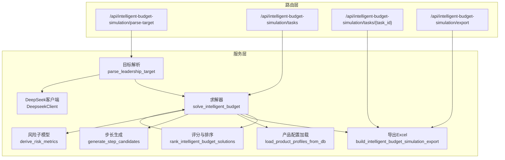
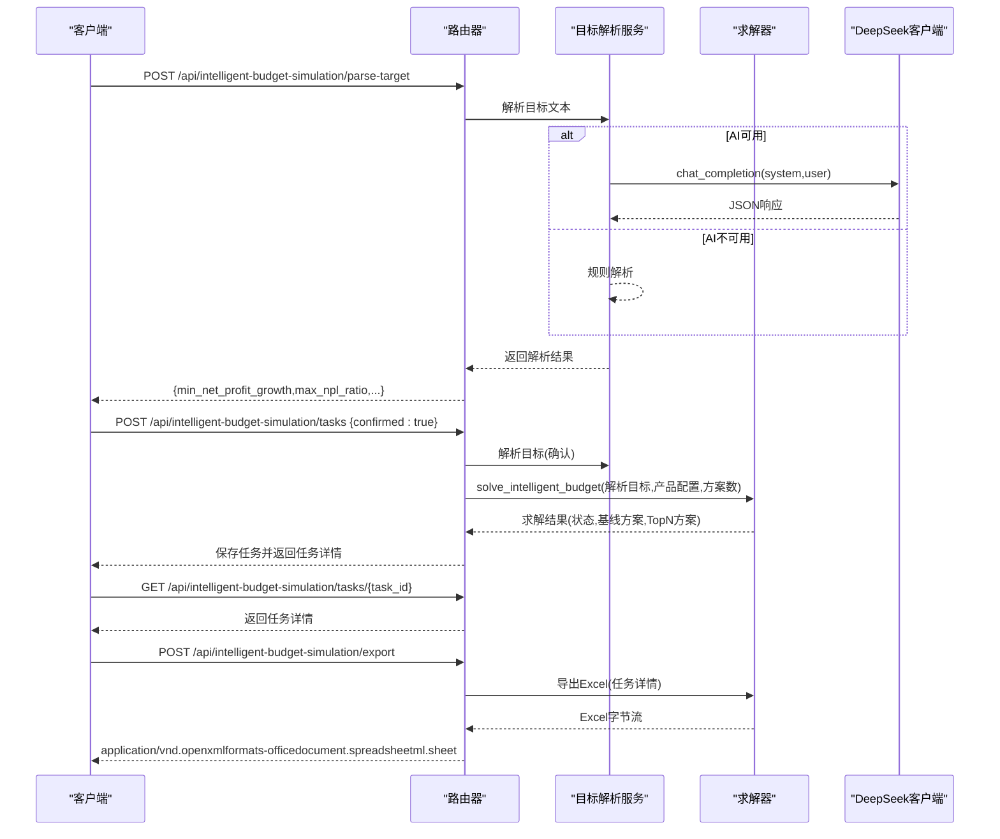
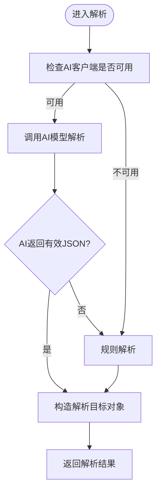
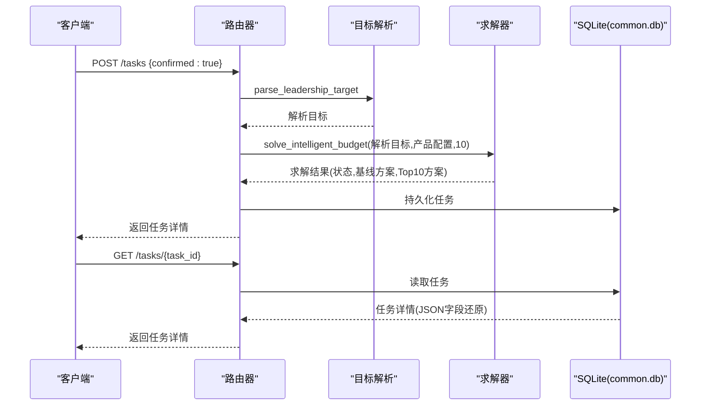
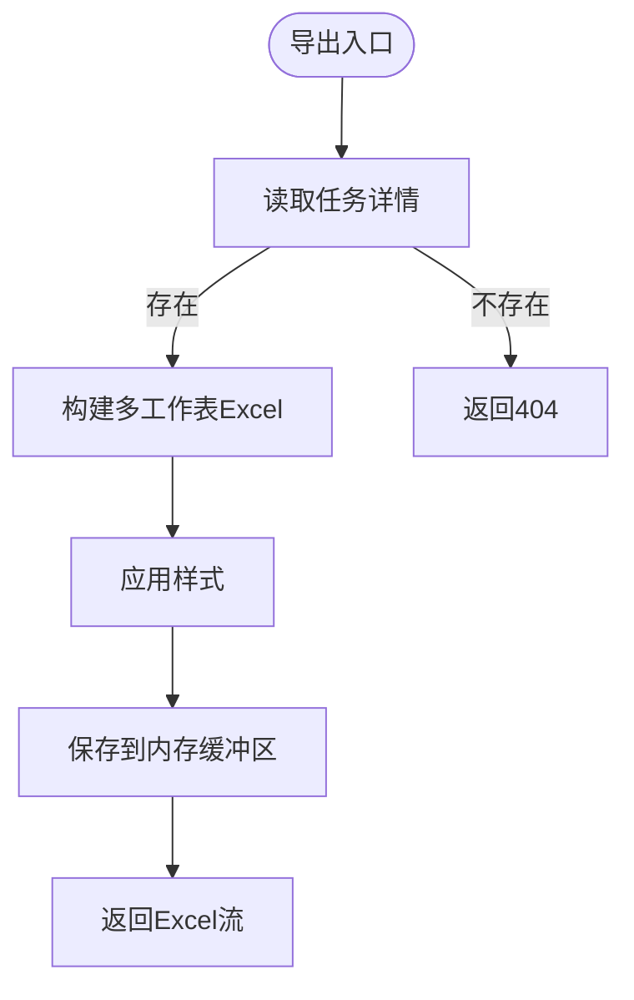
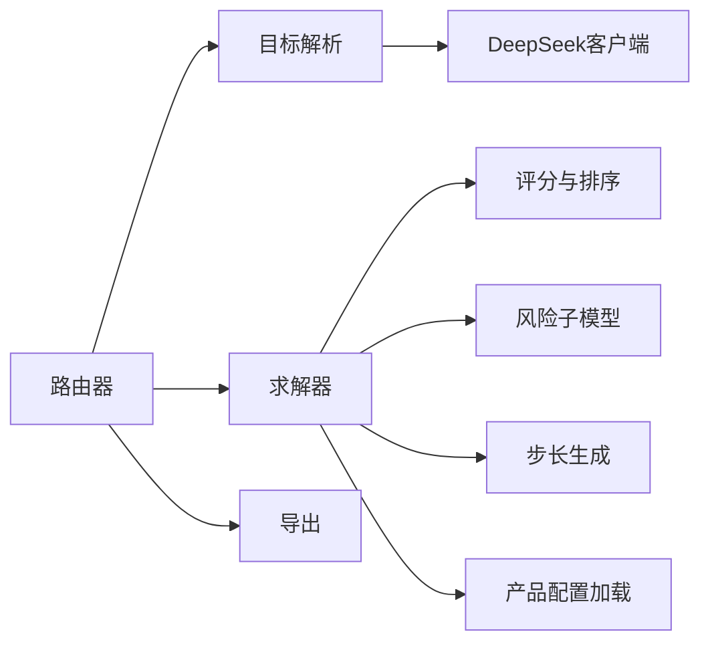

# 智能预算模拟API

<cite>
**本文引用的文件**
- [apps/api/app/routers/intelligent_budget_simulation.py](file://apps/api/app/routers/intelligent_budget_simulation.py)
- [apps/api/app/services/intelligent_budget_target_parser.py](file://apps/api/app/services/intelligent_budget_target_parser.py)
- [apps/api/app/services/intelligent_budget_solver.py](file://apps/api/app/services/intelligent_budget_solver.py)
- [apps/api/app/services/intelligent_budget_scoring.py](file://apps/api/app/services/intelligent_budget_scoring.py)
- [apps/api/app/services/intelligent_budget_export.py](file://apps/api/app/services/intelligent_budget_export.py)
- [apps/api/app/services/intelligent_budget_product_loader.py](file://apps/api/app/services/intelligent_budget_product_loader.py)
- [apps/api/app/services/intelligent_budget_steps.py](file://apps/api/app/services/intelligent_budget_steps.py)
- [apps/api/app/services/intelligent_budget_risk.py](file://apps/api/app/services/intelligent_budget_risk.py)
- [apps/api/app/deepseek_client.py](file://apps/api/app/deepseek_client.py)
- [apps/api/test_intelligent_budget_simulation_router.py](file://apps/api/test_intelligent_budget_simulation_router.py)
- [apps/api/test_intelligent_budget_simulation_core.py](file://apps/api/test_intelligent_budget_simulation_core.py)
</cite>

## 目录
1. [简介](#简介)
2. [项目结构](#项目结构)
3. [核心组件](#核心组件)
4. [架构总览](#架构总览)
5. [详细组件分析](#详细组件分析)
6. [依赖分析](#依赖分析)
7. [性能考虑](#性能考虑)
8. [故障排查指南](#故障排查指南)
9. [结论](#结论)
10. [附录](#附录)

## 简介
本文件为“智能预算模拟模块”的完整RESTful API接口文档，覆盖以下能力：
- 预算目标输入与解析：接收领导层自然语言目标，解析为硬约束与偏好，并支持AI模型兜底。
- 方案生成：基于产品弹性与策略模板，自动生成差异化因子向量并进行利润与风险估计。
- 方案评估与排序：以数学评分与硬约束过滤为核心，输出TopN方案及推荐角色。
- 结果导出：将目标、步骤摘要、预算快照、Top10方案、二层因子、产品拆解、风险传导、协商记录等导出为Excel。

接口遵循REST设计，使用JSON作为请求/响应载体；错误通过HTTP状态码与标准错误体返回；AI解析通过可插拔的DeepSeek客户端实现。

## 项目结构
- 路由层：定义API端点、请求/响应模型、SQLite任务存储与导出适配。
- 服务层：
  - 目标解析：规则解析与AI兜底，构建解析目标对象。
  - 解析器：将解析目标传入求解器。
  - 求解器：产品敏感度分析、因子候选生成、利润与NPL估计、风险桥接、产品贡献分解、显示角色与推荐理由、数学评分与排序。
  - 导出：构建多工作表Excel并流式返回。
  - 数据加载：从运行指标树与预算数据库读取产品配置。
  - 步长生成：公式感知的自适应步长生成。
  - 风险子模型：NPL与拨备推导。
  - AI客户端：DeepSeek聊天接口封装。

图表来源
- [apps/api/app/routers/intelligent_budget_simulation.py:129-177](file://apps/api/app/routers/intelligent_budget_simulation.py#L129-L177)
- [apps/api/app/services/intelligent_budget_target_parser.py:117-149](file://apps/api/app/services/intelligent_budget_target_parser.py#L117-L149)
- [apps/api/app/services/intelligent_budget_solver.py:642-730](file://apps/api/app/services/intelligent_budget_solver.py#L642-L730)
- [apps/api/app/services/intelligent_budget_scoring.py:63-88](file://apps/api/app/services/intelligent_budget_scoring.py#L63-L88)
- [apps/api/app/services/intelligent_budget_export.py:26-156](file://apps/api/app/services/intelligent_budget_export.py#L26-L156)
- [apps/api/app/services/intelligent_budget_product_loader.py:16-150](file://apps/api/app/services/intelligent_budget_product_loader.py#L16-L150)
- [apps/api/app/services/intelligent_budget_steps.py:45-80](file://apps/api/app/services/intelligent_budget_steps.py#L45-L80)
- [apps/api/app/services/intelligent_budget_risk.py:37-66](file://apps/api/app/services/intelligent_budget_risk.py#L37-L66)
- [apps/api/app/deepseek_client.py:9-69](file://apps/api/app/deepseek_client.py#L9-L69)

章节来源
- [apps/api/app/routers/intelligent_budget_simulation.py:116-177](file://apps/api/app/routers/intelligent_budget_simulation.py#L116-L177)

## 核心组件
- 路由器与端点
  - 目标解析：POST /api/intelligent-budget-simulation/parse-target
  - 创建任务：POST /api/intelligent-budget-simulation/tasks
  - 查询任务：GET /api/intelligent-budget-simulation/tasks/{task_id}
  - 导出结果：POST /api/intelligent-budget-simulation/export
- 请求/响应模型
  - ParseTargetRequest：{ target_text: string }
  - CreateTaskRequest：{ target_text: string, confirmed: boolean }
  - ExportRequest：{ task_id: string }
- 内部数据结构
  - ParsedIntelligentBudgetTarget：解析后的目标与偏好
  - IntelligentBudgetSolveRequest：求解请求（解析目标、产品配置、方案数量）
  - IntelligentBudgetSolution：单个方案（含预算快照、风险桥、Top产品贡献等）
  - IntelligentBudgetSolveResult：求解结果（状态、基线方案、TopN方案、步骤摘要、协商信息）

章节来源
- [apps/api/app/routers/intelligent_budget_simulation.py:28-39](file://apps/api/app/routers/intelligent_budget_simulation.py#L28-L39)
- [apps/api/app/services/intelligent_budget_target_parser.py:32-42](file://apps/api/app/services/intelligent_budget_target_parser.py#L32-L42)
- [apps/api/app/services/intelligent_budget_solver.py:36-81](file://apps/api/app/services/intelligent_budget_solver.py#L36-L81)

## 架构总览
智能预算模拟API采用“路由-服务”分层：
- 路由层负责HTTP协议、参数校验、任务持久化与导出适配。
- 服务层完成业务逻辑：目标解析（规则+AI）、产品敏感度分析、因子候选生成、利润/NPL估计、风险桥、产品贡献分解、数学评分与排序、Excel导出。
- AI接口通过可插拔客户端接入DeepSeek，实现解析兜底。

图表来源
- [apps/api/app/routers/intelligent_budget_simulation.py:129-177](file://apps/api/app/routers/intelligent_budget_simulation.py#L129-L177)
- [apps/api/app/services/intelligent_budget_target_parser.py:97-149](file://apps/api/app/services/intelligent_budget_target_parser.py#L97-L149)
- [apps/api/app/services/intelligent_budget_solver.py:642-730](file://apps/api/app/services/intelligent_budget_solver.py#L642-L730)
- [apps/api/app/deepseek_client.py:18-69](file://apps/api/app/deepseek_client.py#L18-L69)

## 详细组件分析

### 目标解析接口
- 方法与路径
  - POST /api/intelligent-budget-simulation/parse-target
- 请求体
  - 参数：target_text（string，必填）
- 响应体
  - 字段：min_net_profit_growth（number，小数），max_npl_ratio（number，小数），hard_targets（object），soft_preferences（array[string]），adjustable_factors（array[string]），requires_confirmation（boolean），warnings（array[string]）
- 解析流程
  - 若AI客户端启用且可用，调用AI模型输出JSON，提取hard_targets与soft_preferences。
  - 若AI不可用或失败，回退至规则解析，按关键词匹配百分比并设置默认偏好。
- 错误处理
  - 输入为空时返回默认演示目标并标记需要人工确认。
  - AI返回非JSON或缺失字段时抛出异常并回退规则解析。

图表来源
- [apps/api/app/services/intelligent_budget_target_parser.py:97-149](file://apps/api/app/services/intelligent_budget_target_parser.py#L97-L149)

章节来源
- [apps/api/app/routers/intelligent_budget_simulation.py:129-131](file://apps/api/app/routers/intelligent_budget_simulation.py#L129-L131)
- [apps/api/app/services/intelligent_budget_target_parser.py:117-149](file://apps/api/app/services/intelligent_budget_target_parser.py#L117-L149)

### 多方案生成与评估接口
- 方法与路径
  - POST /api/intelligent-budget-simulation/tasks
  - GET /api/intelligent-budget-simulation/tasks/{task_id}
- 请求体（创建任务）
  - 参数：target_text（string，必填），confirmed（boolean，默认false）
  - 语义：必须先确认AI解析结果，再开始求解
- 响应体（创建任务）
  - 字段：task_id（string），target_text（string），parsed_target（object），status（string，"completed"|"negotiation_required"），stage（string，"completed"|"negotiation"），step_summary（string），baseline_solution（object），solutions（array[object]，长度10），negotiation_message（string），negotiation_suggestions（array[string]）
- 求解流程
  - 产品敏感度分析：基于产品规模、收益率、风险成本率、费用计算边际利润贡献。
  - 因子候选生成：基于策略模板与弹性上限，自动生成差异化因子向量。
  - 利润与NPL估计：基于弹性与因子向量估算净利润增长与不良率。
  - 数学评分与排序：过滤硬约束后按评分排序，输出TopN方案。
  - 显示角色与推荐理由：为最优、风险优先、利润优先方案标注角色与理由。
- 错误处理
  - 未确认解析结果即提交求解，返回400并提示确认。

图表来源
- [apps/api/app/routers/intelligent_budget_simulation.py:133-167](file://apps/api/app/routers/intelligent_budget_simulation.py#L133-L167)
- [apps/api/app/services/intelligent_budget_solver.py:642-730](file://apps/api/app/services/intelligent_budget_solver.py#L642-L730)

章节来源
- [apps/api/app/routers/intelligent_budget_simulation.py:133-167](file://apps/api/app/routers/intelligent_budget_simulation.py#L133-L167)
- [apps/api/app/services/intelligent_budget_solver.py:126-175](file://apps/api/app/services/intelligent_budget_solver.py#L126-L175)
- [apps/api/app/services/intelligent_budget_solver.py:182-272](file://apps/api/app/services/intelligent_budget_solver.py#L182-L272)
- [apps/api/app/services/intelligent_budget_solver.py:283-371](file://apps/api/app/services/intelligent_budget_solver.py#L283-L371)
- [apps/api/app/services/intelligent_budget_solver.py:642-730](file://apps/api/app/services/intelligent_budget_solver.py#L642-L730)

### 方案导出接口
- 方法与路径
  - POST /api/intelligent-budget-simulation/export
- 请求体
  - 参数：task_id（string，必填）
- 响应体
  - 类型：application/vnd.openxmlformats-officedocument.spreadsheetml.sheet
  - 文件名：intelligent_budget_simulation_YYYYMMDDHHMMSS.xlsx
  - 工作表：目标与约束、步长摘要、预算结果快照、Top10方案、二层因子、产品拆解、风险传导、协商记录
- 导出内容要点
  - 预算结果快照：贷款余额、生息资产、营业收入、净利息收入、费用、拨备/减值、净利润、净利润增长、不良余额、不良率、风险成本率、拨备余额、超额拨备。
  - Top10方案：排名、方案名称、推荐角色、推荐理由、数学评分、净利润增长、不良率、核心动作。
  - 二层因子：规模、收益率bp、费用、新生成不良控制、回收/清收提升、拨备调节。
  - 产品拆解：Top5产品边际贡献与“其他产品”合计。
  - 风险传导：期初/期末NPL、新生成不良、回收清收、核销处置、推导不良率等。
  - 协商记录：状态、提示、建议。

图表来源
- [apps/api/app/routers/intelligent_budget_simulation.py:169-175](file://apps/api/app/routers/intelligent_budget_simulation.py#L169-L175)
- [apps/api/app/services/intelligent_budget_export.py:26-156](file://apps/api/app/services/intelligent_budget_export.py#L26-L156)

章节来源
- [apps/api/app/routers/intelligent_budget_simulation.py:169-175](file://apps/api/app/routers/intelligent_budget_simulation.py#L169-L175)
- [apps/api/app/services/intelligent_budget_export.py:26-156](file://apps/api/app/services/intelligent_budget_export.py#L26-L156)

### 数据模型与字段说明

#### 目标解析相关
- ParsedIntelligentBudgetTarget
  - 字段：original_text（string），min_net_profit_growth（number），max_npl_ratio（number），hard_targets（object），soft_preferences（array[string]），adjustable_factors（array[string]），requires_confirmation（boolean），warnings（array[string]）

章节来源
- [apps/api/app/services/intelligent_budget_target_parser.py:32-42](file://apps/api/app/services/intelligent_budget_target_parser.py#L32-L42)

#### 求解相关
- IntelligentBudgetSolveRequest
  - 字段：parsed_target（object），product_profiles（array[object]），required_solution_count（number，默认10）
- IntelligentBudgetProductProfile
  - 字段：product_code（string），product_name（string），loan_scale（number），yield_rate（number），expense_amount（number），opening_npl_balance（number），opening_provision_balance（number），risk_cost_rate（number），baseline_profit_contribution（number）
- IntelligentBudgetSolution
  - 字段：solution_id（string），rank（number），name（string），math_score（number），net_profit_growth（number），npl_ratio（number），core_actions（object），factor_movements（object），top_product_contributions（array[object]），other_product_contribution（number），explanation（string），display_role（string），recommendation_reason（string），budget_snapshot（object），risk_bridge（object）
- IntelligentBudgetSolveResult
  - 字段：status（string），baseline_solution（object），solutions（array[object]），step_summary（string），negotiation_message（string），negotiation_suggestions（array[string]）

章节来源
- [apps/api/app/services/intelligent_budget_solver.py:23-81](file://apps/api/app/services/intelligent_budget_solver.py#L23-L81)

#### 评分与排序相关
- IntelligentBudgetTargetThresholds
  - 字段：min_net_profit_growth（number），max_npl_ratio（number）
- IntelligentBudgetScoringInput
  - 字段：solution_id（string），net_profit_growth（number），npl_ratio（number），operating_disturbance（number），historical_deviation（number)，product_decomposition_penalty（number），risk_action_difficulty（number），excess_provision_buffer（number），difference_score（number）
- IntelligentBudgetScoredSolution
  - 字段：solution_id（string），rank（number），math_score（number），net_profit_growth（number），npl_ratio（number）

章节来源
- [apps/api/app/services/intelligent_budget_scoring.py:7-33](file://apps/api/app/services/intelligent_budget_scoring.py#L7-L33)

#### 步长生成相关
- StepVariable
  - 字段：variable_code（string），label（string），baseline_value（number），sensitivity（number），target_step（number），historical_min_reasonable_step（number），historical_max_reasonable_step（number），business_unit（number），lower_bound（number），upper_bound（number），levels_each_side（number，默认3）
- StepCandidateSummary
  - 字段：variable_code（string），label（string），method（string），sensitivity（number），raw_step（number），step_size（number），candidate_values（array[number]），reason（string）

章节来源
- [apps/api/app/services/intelligent_budget_steps.py:7-32](file://apps/api/app/services/intelligent_budget_steps.py#L7-L32)

#### 风险子模型相关
- RiskSubmodelInput
  - 字段：opening_loan_scale（number），ending_loan_scale（number），opening_npl_balance（number），new_npl（number），recovery_collection（number），writeoff_disposal（number），opening_provision_balance（number），provision_charge（number），writeoff_provision_consumption（number）
- RiskSubmodelResult
  - 字段：opening_loan_scale（number），ending_loan_scale（number），opening_npl_balance（number），ending_npl_balance（number），opening_npl_ratio（number），npl_ratio（number），ending_provision_balance（number），excess_provision（number），scale_dilution_only（boolean）

章节来源
- [apps/api/app/services/intelligent_budget_risk.py:7-31](file://apps/api/app/services/intelligent_budget_risk.py#L7-L31)

### 参数验证规则与数据类型
- 请求体字段类型与约束
  - ParseTargetRequest：target_text（string，非空）
  - CreateTaskRequest：target_text（string，非空），confirmed（boolean，true时才允许求解）
  - ExportRequest：task_id（string，非空）
- 响应体字段类型
  - 解析结果：min_net_profit_growth（number，0~1），max_npl_ratio（number，≥0），adjustable_factors（array[string]），requires_confirmation（boolean），warnings（array[string]）
  - 任务详情：status（string），stage（string），solutions（array长度10），baseline_solution（object），negotiation_*（可选）
  - 导出：返回Excel二进制流，Content-Type为application/vnd.openxmlformats-officedocument.spreadsheetml.sheet
- AI解析兜底
  - 当AI不可用或返回无效时，回退规则解析并添加警告提示

章节来源
- [apps/api/app/routers/intelligent_budget_simulation.py:28-39](file://apps/api/app/routers/intelligent_budget_simulation.py#L28-L39)
- [apps/api/app/services/intelligent_budget_target_parser.py:117-149](file://apps/api/app/services/intelligent_budget_target_parser.py#L117-L149)

### AI算法接口规范
- DeepSeek客户端
  - 方法：chat_completion(system_prompt, user_prompt, temperature, max_tokens, timeout_seconds, max_attempts)
  - 返回：字符串内容或None
  - 状态：is_enabled()决定是否启用
- 目标解析AI提供者
  - 构造函数：build_deepseek_target_provider(deepseek_client)
  - 行为：调用chat_completion并解析JSON，提取hard_targets与soft_preferences
  - 异常：返回空或非JSON时回退规则解析

章节来源
- [apps/api/app/deepseek_client.py:9-69](file://apps/api/app/deepseek_client.py#L9-L69)
- [apps/api/app/services/intelligent_budget_target_parser.py:97-114](file://apps/api/app/services/intelligent_budget_target_parser.py#L97-L114)

## 依赖分析
- 组件耦合
  - 路由器依赖目标解析与求解器；求解器依赖评分与导出；导出依赖任务详情；产品配置加载为求解器提供输入。
- 外部依赖
  - AI客户端：DeepSeek
  - 数据库：common.db（任务存储）、预算数据库（产品配置）
  - 第三方库：openpyxl（Excel导出）、httpx（HTTP客户端）
- 潜在循环依赖
  - 未发现循环导入；模块职责清晰，接口边界明确。

图表来源
- [apps/api/app/routers/intelligent_budget_simulation.py:116-177](file://apps/api/app/routers/intelligent_budget_simulation.py#L116-L177)
- [apps/api/app/services/intelligent_budget_solver.py:642-730](file://apps/api/app/services/intelligent_budget_solver.py#L642-L730)
- [apps/api/app/services/intelligent_budget_target_parser.py:97-149](file://apps/api/app/services/intelligent_budget_target_parser.py#L97-L149)
- [apps/api/app/services/intelligent_budget_export.py:26-156](file://apps/api/app/services/intelligent_budget_export.py#L26-L156)
- [apps/api/app/services/intelligent_budget_product_loader.py:16-150](file://apps/api/app/services/intelligent_budget_product_loader.py#L16-L150)
- [apps/api/app/services/intelligent_budget_steps.py:45-80](file://apps/api/app/services/intelligent_budget_steps.py#L45-L80)
- [apps/api/app/services/intelligent_budget_risk.py:37-66](file://apps/api/app/services/intelligent_budget_risk.py#L37-L66)
- [apps/api/app/deepseek_client.py:18-69](file://apps/api/app/deepseek_client.py#L18-L69)

章节来源
- [apps/api/app/routers/intelligent_budget_simulation.py:116-177](file://apps/api/app/routers/intelligent_budget_simulation.py#L116-L177)
- [apps/api/app/services/intelligent_budget_solver.py:642-730](file://apps/api/app/services/intelligent_budget_solver.py#L642-L730)

## 性能考虑
- 产品敏感度与因子候选生成：基于产品弹性与策略模板，避免硬编码具体数值，提高可扩展性。
- 步长生成：公式感知与历史约束结合，减少无效探索，提升收敛效率。
- 导出：使用内存缓冲区与流式响应，避免大文件占用过多内存。
- AI调用：限制超时与最大尝试次数，防止阻塞；AI不可用时快速回退规则解析。

## 故障排查指南
- 常见错误与处理
  - 未确认解析即求解：返回400，提示先确认AI解析后的目标与约束。
  - 任务不存在：查询任务返回404。
  - AI解析失败：解析器记录警告并回退规则解析。
  - 方案不足：当硬约束下可行方案少于所需数量，返回“协商必要”，并给出放宽目标或分阶段达成的建议。
- 排查步骤
  - 确认AI客户端配置正确且可用。
  - 检查common.db中intelligent_budget_tasks表是否存在与可写。
  - 核对产品配置加载是否成功（预算数据库连接、版本ID、指标映射）。
  - 使用测试用例验证端点行为（解析、创建任务、导出）。

章节来源
- [apps/api/app/routers/intelligent_budget_simulation.py:135-136](file://apps/api/app/routers/intelligent_budget_simulation.py#L135-L136)
- [apps/api/app/routers/intelligent_budget_simulation.py:165-166](file://apps/api/app/routers/intelligent_budget_simulation.py#L165-L166)
- [apps/api/app/services/intelligent_budget_target_parser.py:145-149](file://apps/api/app/services/intelligent_budget_target_parser.py#L145-L149)
- [apps/api/app/services/intelligent_budget_solver.py:710-722](file://apps/api/app/services/intelligent_budget_solver.py#L710-L722)
- [apps/api/test_intelligent_budget_simulation_router.py:18-92](file://apps/api/test_intelligent_budget_simulation_router.py#L18-L92)
- [apps/api/test_intelligent_budget_simulation_core.py:14-146](file://apps/api/test_intelligent_budget_simulation_core.py#L14-L146)

## 结论
智能预算模拟API通过清晰的端点划分与模块化服务，实现了从目标解析、方案生成、评估排序到结果导出的全链路自动化。其核心优势在于：
- 可插拔的AI解析能力，兼顾规则与模型的优势。
- 基于产品弹性与策略模板的因子生成，避免硬编码，提升灵活性。
- 完整的Excel导出，便于审阅与汇报。
- 完善的错误处理与协商机制，提升可用性与可解释性。

## 附录

### 端点一览与示例

- 目标解析
  - 方法：POST
  - 路径：/api/intelligent-budget-simulation/parse-target
  - 请求体：{ "target_text": "净利润增长10%，不良率控制在1.2%" }
  - 响应体：{ "min_net_profit_growth": 0.10, "max_npl_ratio": 0.012, "requires_confirmation": true, ... }

- 创建任务
  - 方法：POST
  - 路径：/api/intelligent-budget-simulation/tasks
  - 请求体：{ "target_text": "...", "confirmed": true }
  - 响应体：包含task_id、status、baseline_solution、solutions等

- 查询任务
  - 方法：GET
  - 路径：/api/intelligent-budget-simulation/tasks/{task_id}
  - 响应体：任务详情（含JSON字段还原）

- 导出结果
  - 方法：POST
  - 路径：/api/intelligent-budget-simulation/export
  - 请求体：{ "task_id": "..." }
  - 响应体：application/vnd.openxmlformats-officedocument.spreadsheetml.sheet

章节来源
- [apps/api/app/routers/intelligent_budget_simulation.py:129-177](file://apps/api/app/routers/intelligent_budget_simulation.py#L129-L177)
- [apps/api/test_intelligent_budget_simulation_router.py:18-92](file://apps/api/test_intelligent_budget_simulation_router.py#L18-L92)