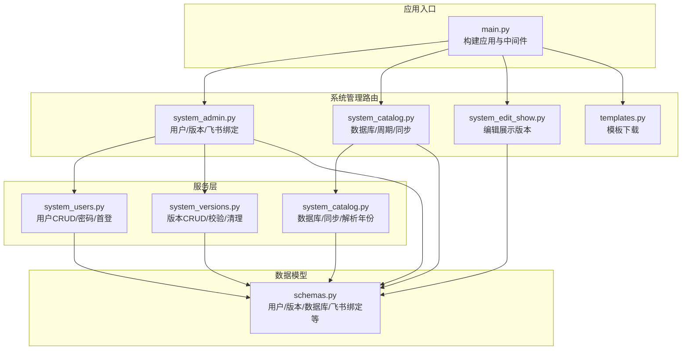
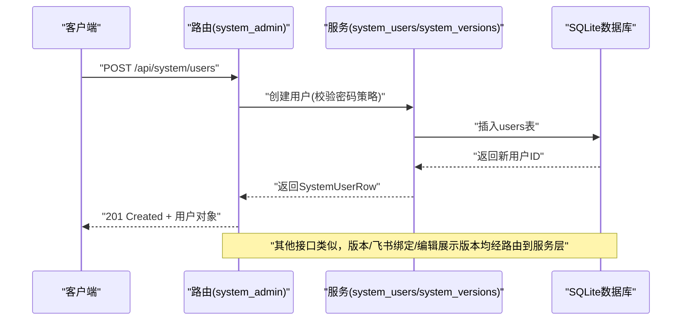
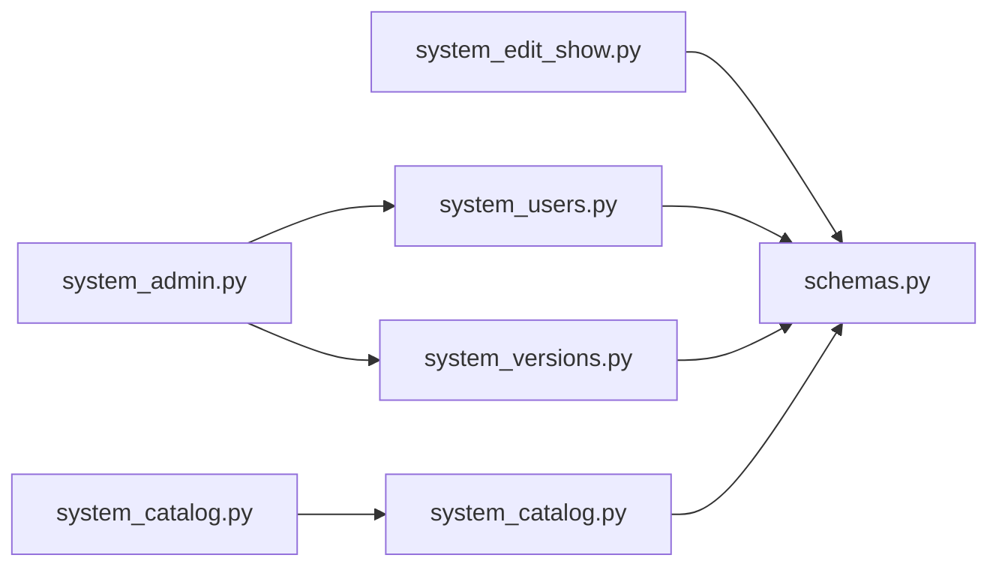

# 系统管理API

<cite>
**本文档引用的文件**
- [apps/api/app/main.py](file://apps/api/app/main.py)
- [apps/api/app/routers/system_admin.py](file://apps/api/app/routers/system_admin.py)
- [apps/api/app/routers/system_catalog.py](file://apps/api/app/routers/system_catalog.py)
- [apps/api/app/routers/system_edit_show.py](file://apps/api/app/routers/system_edit_show.py)
- [apps/api/app/routers/templates.py](file://apps/api/app/routers/templates.py)
- [apps/api/app/services/system_users.py](file://apps/api/app/services/system_users.py)
- [apps/api/app/services/system_versions.py](file://apps/api/app/services/system_versions.py)
- [apps/api/app/services/system_catalog.py](file://apps/api/app/services/system_catalog.py)
- [apps/api/app/services/auth_access_policy.py](file://apps/api/app/services/auth_access_policy.py)
- [apps/api/app/schemas.py](file://apps/api/app/schemas.py)
</cite>

## 目录
1. [简介](#简介)
2. [项目结构](#项目结构)
3. [核心组件](#核心组件)
4. [架构总览](#架构总览)
5. [详细组件分析](#详细组件分析)
6. [依赖分析](#依赖分析)
7. [性能考虑](#性能考虑)
8. [故障排除指南](#故障排除指南)
9. [结论](#结论)
10. [附录](#附录)

## 简介
本文件为“系统管理API”的权威技术文档，覆盖用户管理、系统配置与版本控制、模板下载、编辑展示版本管理等系统管理相关RESTful接口。文档面向前后端开发者与运维人员，提供HTTP方法、URL模式、请求/响应格式、参数校验规则、权限控制、错误处理策略、状态码说明以及安全与维护建议。

## 项目结构
系统管理API由FastAPI应用统一挂载，按功能模块拆分为多个路由子模块，并通过服务层与数据库交互。核心模块包括：
- 系统用户与权限：用户增删改查、首次登录密码重置、首登标志设置、飞书账号绑定
- 系统配置与目录：数据库同步、周期年份查询、数据库增删、创建新年度数据库
- 版本控制：版本列表、创建、打补丁更新、删除
- 编辑展示版本：全局编辑/展示版本选择与保存
- 模板下载：从资源目录下载Excel模板

图表来源
- [apps/api/app/main.py:334-357](file://apps/api/app/main.py#L334-L357)
- [apps/api/app/routers/system_admin.py:59-196](file://apps/api/app/routers/system_admin.py#L59-L196)
- [apps/api/app/routers/system_catalog.py:19-61](file://apps/api/app/routers/system_catalog.py#L19-L61)
- [apps/api/app/routers/system_edit_show.py:16-106](file://apps/api/app/routers/system_edit_show.py#L16-L106)
- [apps/api/app/routers/templates.py:8-44](file://apps/api/app/routers/templates.py#L8-L44)
- [apps/api/app/services/system_users.py:58-196](file://apps/api/app/services/system_users.py#L58-L196)
- [apps/api/app/services/system_versions.py:81-375](file://apps/api/app/services/system_versions.py#L81-L375)
- [apps/api/app/services/system_catalog.py:51-224](file://apps/api/app/services/system_catalog.py#L51-L224)
- [apps/api/app/schemas.py:735-920](file://apps/api/app/schemas.py#L735-L920)

章节来源
- [apps/api/app/main.py:334-357](file://apps/api/app/main.py#L334-L357)

## 核心组件
- 用户管理与权限
  - 用户列表、创建、更新、删除
  - 首次登录密码重置、首登标志设置
  - 飞书账号绑定/解绑/查询
- 系统配置与目录
  - 数据库与文件同步、周期年份查询
  - 新建/删除年度数据库
- 版本控制
  - 年度数据库版本列表、创建、打补丁更新、删除
- 编辑展示版本
  - 全局编辑/展示版本状态读取与保存
- 模板下载
  - 下载预置Excel模板

章节来源
- [apps/api/app/routers/system_admin.py:127-196](file://apps/api/app/routers/system_admin.py#L127-L196)
- [apps/api/app/routers/system_catalog.py:28-61](file://apps/api/app/routers/system_catalog.py#L28-L61)
- [apps/api/app/routers/system_edit_show.py:47-106](file://apps/api/app/routers/system_edit_show.py#L47-L106)
- [apps/api/app/routers/templates.py:19-44](file://apps/api/app/routers/templates.py#L19-L44)

## 架构总览
系统管理API采用“路由层-服务层-数据模型”三层结构：
- 路由层负责HTTP协议细节与异常转换
- 服务层封装业务逻辑与数据库操作
- 数据模型定义请求/响应结构与校验规则
- 权限策略通过访问决策函数与中间件共同实现

图表来源
- [apps/api/app/routers/system_admin.py:127-156](file://apps/api/app/routers/system_admin.py#L127-L156)
- [apps/api/app/services/system_users.py:72-100](file://apps/api/app/services/system_users.py#L72-L100)

## 详细组件分析

### 用户管理接口
- 列表用户
  - 方法与路径：GET /api/system/users
  - 响应：用户数组（SystemUserRow）
- 创建用户
  - 方法与路径：POST /api/system/users
  - 请求体：SystemUserCreateRequest
  - 校验：密码需满足长度与字符要求
  - 响应：SystemUserRow
  - 错误：400 用户名重复
- 更新用户
  - 方法与路径：PATCH /api/system/users/{user_id}
  - 请求体：SystemUserUpdateRequest
  - 校验：至少提供一个可更新字段
  - 响应：SystemUserRow
  - 错误：400 无更新字段；404 用户不存在；400 用户名重复
- 删除用户
  - 方法与路径：DELETE /api/system/users/{user_id}
  - 响应：{"deleted": true, "user_id": int}
  - 错误：404 用户不存在
- 首次登录密码重置
  - 方法与路径：PATCH /api/system/users/{user_id}/reset-first-password
  - 请求体：SystemUserPasswordResetRequest
  - 响应：SystemUserRow
  - 错误：404 用户不存在
- 设置首登标志
  - 方法与路径：PATCH /api/system/users/{user_id}/first-login-flag
  - 请求体：SystemUserFirstLoginFlagRequest
  - 响应：SystemUserRow
  - 错误：404 用户不存在
- 飞书账号绑定/查询/解绑
  - 查询：GET /api/system/feishu/bindings → FeishuBindingRow[]
  - 写入：POST /api/system/feishu/bindings → FeishuBindingRow
  - 删除：DELETE /api/system/feishu/bindings/{open_id}

请求/响应数据模型
- SystemUserRow：包含id、user_name、permission_type、first_login_flag、create_time、update_time
- SystemUserCreateRequest/SystemUserUpdateRequest：字段见schemas中对应定义
- FeishuBindingRow/FeishuBindingUpsertRequest：绑定相关字段

权限与安全
- 密码策略：长度≥8，必须包含字母（区分大小写）
- 首次登录强制修改密码期间，仅允许会话查询、首次密码修改与登出

章节来源
- [apps/api/app/routers/system_admin.py:127-196](file://apps/api/app/routers/system_admin.py#L127-L196)
- [apps/api/app/services/system_users.py:58-196](file://apps/api/app/services/system_users.py#L58-L196)
- [apps/api/app/services/auth_access_policy.py:152-159](file://apps/api/app/services/auth_access_policy.py#L152-L159)
- [apps/api/app/schemas.py:837-920](file://apps/api/app/schemas.py#L837-L920)

### 系统配置与目录接口
- 同步数据库与文件
  - 方法与路径：POST /api/system/databases/sync
  - 响应：SystemDatabaseRow[]
- 周期年份列表
  - 方法与路径：GET /api/system/period-years
  - 响应：SystemPeriodYearDto[]
- 数据库列表
  - 方法与路径：GET /api/system/databases
  - 响应：SystemDatabaseRow[]
- 创建数据库
  - 方法与路径：POST /api/system/databases
  - 请求体：SystemDatabaseCreateRequest
  - 校验：同一年度数据库不可重复；period中必须存在该年
  - 响应：SystemDatabaseRow
- 删除数据库
  - 方法与路径：DELETE /api/system/databases/{data_file_id}
  - 响应：{"deleted": true, "data_file_id": int, "file_name": str}

请求/响应数据模型
- SystemDatabaseRow/SystemDatabaseCreateRequest/SystemPeriodYearDto：见schemas

章节来源
- [apps/api/app/routers/system_catalog.py:28-61](file://apps/api/app/routers/system_catalog.py#L28-L61)
- [apps/api/app/services/system_catalog.py:51-224](file://apps/api/app/services/system_catalog.py#L51-L224)
- [apps/api/app/schemas.py:735-810](file://apps/api/app/schemas.py#L735-L810)

### 版本控制接口
- 列表版本
  - 方法与路径：GET /api/system/databases/{data_file_id}/versions
  - 响应：SystemVersionRow[]
- 创建版本
  - 方法与路径：POST /api/system/databases/{data_file_id}/versions
  - 请求体：SystemVersionCreateRequest
  - 校验：文件名需匹配预算数据库命名规范；period中存在该年；可选父版本存在性校验；current_month归一化至[1,13]
  - 响应：SystemVersionRow
- 打补丁更新版本
  - 方法与路径：PATCH /api/system/databases/{data_file_id}/versions/{version_id}
  - 请求体：SystemVersionPatchRequest
  - 限制：仅可更新版本名称，ID、创建时间、current_month不可修改
  - 响应：SystemVersionRow
- 删除版本
  - 方法与路径：DELETE /api/system/databases/{data_file_id}/versions/{version_id}
  - 响应：{"deleted": true, "data_file_id": int, "version_id": int, "budget_data_deleted": int, "file_name": str}
  - 注意：同时清理预算汇总与版本数据，并从编辑展示版本映射中移除

请求/响应数据模型
- SystemVersionRow/SystemVersionCreateRequest/SystemVersionPatchRequest：见schemas

错误处理
- 404：版本或数据库不存在
- 400：请求参数非法（如命名不规范、period缺失、无更新字段）
- 500：模式错误或操作失败

章节来源
- [apps/api/app/routers/system_admin.py:71-126](file://apps/api/app/routers/system_admin.py#L71-L126)
- [apps/api/app/services/system_versions.py:81-375](file://apps/api/app/services/system_versions.py#L81-L375)
- [apps/api/app/schemas.py:743-836](file://apps/api/app/schemas.py#L743-L836)

### 编辑展示版本接口
- 获取当前状态
  - 方法与路径：GET /api/system/edit-show-version
  - 响应：EditShowVersionState（包含edit与shows列表）
- 保存状态
  - 方法与路径：PUT /api/system/edit-show-version
  - 请求体：EditShowVersionSaveRequest
  - 校验：level去重；edit与shows中的每个条目对应的数据库与版本必须存在
  - 响应：EditShowVersionState

请求/响应数据模型
- EditShowVersionState/EditVersionSelection/EditShowVersionSelection：见schemas

章节来源
- [apps/api/app/routers/system_edit_show.py:47-106](file://apps/api/app/routers/system_edit_show.py#L47-L106)
- [apps/api/app/schemas.py:768-780](file://apps/api/app/schemas.py#L768-L780)

### 模板下载接口
- 下载模板
  - 方法与路径：GET /api/templates/{template_name}
  - 支持模板名：budget_data_temp、dept_acct_temp、pivot_export_temp、product_org_tree_import_template
  - 校验：模板名非空且不含路径分隔符；模板目录存在；目标文件存在
  - 响应：FileResponse（二进制流）

章节来源
- [apps/api/app/routers/templates.py:19-44](file://apps/api/app/routers/templates.py#L19-L44)

## 依赖分析
- 路由到服务层
  - system_admin路由调用system_users与system_versions服务
  - system_catalog路由调用system_catalog服务
  - system_edit_show路由直接读写数据库
- 服务层到数据模型
  - 所有服务层函数返回/接收Pydantic模型，确保类型与校验一致
- 权限策略
  - 访问决策函数对/api/system路径默认要求权限级别3
  - 其他路径根据方法与模块映射到不同权限级别

图表来源
- [apps/api/app/routers/system_admin.py:59-196](file://apps/api/app/routers/system_admin.py#L59-L196)
- [apps/api/app/routers/system_catalog.py:19-61](file://apps/api/app/routers/system_catalog.py#L19-L61)
- [apps/api/app/routers/system_edit_show.py:16-106](file://apps/api/app/routers/system_edit_show.py#L16-L106)
- [apps/api/app/services/system_users.py:58-196](file://apps/api/app/services/system_users.py#L58-L196)
- [apps/api/app/services/system_versions.py:81-375](file://apps/api/app/services/system_versions.py#L81-L375)
- [apps/api/app/services/system_catalog.py:51-224](file://apps/api/app/services/system_catalog.py#L51-L224)
- [apps/api/app/schemas.py:735-920](file://apps/api/app/schemas.py#L735-L920)

## 性能考虑
- 批量同步数据库与文件时，使用ON CONFLICT避免重复写入
- 版本创建时按实际/预算区间选择性复制预算数据，减少无关数据迁移
- 使用异步SQLite连接池（aiosqlite）提升并发能力
- 建议在高并发场景下对频繁查询接口增加缓存（如周期年份列表）

## 故障排除指南
常见错误与处理
- 400 参数非法
  - 用户名为空或重复；无更新字段；模板名非法；数据库文件名不匹配；period中无该年
- 404 资源不存在
  - 用户ID/版本ID/数据库ID不存在；模板文件不存在
- 403 权限不足
  - 当前会话权限不足以访问系统管理接口
- 500 操作失败/模式错误
  - 版本模式校验失败；绑定写入后读取失败

排查步骤
- 确认会话有效且满足权限要求
- 校验请求体字段是否符合模型校验规则
- 对于版本创建，确认父版本存在且current_month合理
- 对于数据库创建，确认period中存在对应年份

章节来源
- [apps/api/app/routers/system_admin.py:49-56](file://apps/api/app/routers/system_admin.py#L49-L56)
- [apps/api/app/services/system_users.py:123-135](file://apps/api/app/services/system_users.py#L123-L135)
- [apps/api/app/services/system_versions.py:220-226](file://apps/api/app/services/system_versions.py#L220-L226)
- [apps/api/app/services/system_catalog.py:155-163](file://apps/api/app/services/system_catalog.py#L155-L163)
- [apps/api/app/routers/templates.py:20-37](file://apps/api/app/routers/templates.py#L20-L37)

## 结论
系统管理API以清晰的路由与服务分层实现了用户管理、系统配置、版本控制与模板下载等核心能力。通过严格的参数校验、明确的权限策略与完善的错误处理，保障了系统的安全性与稳定性。建议在生产环境中结合会话中间件、审计日志与缓存策略进一步优化性能与可观测性。

## 附录

### 接口一览与参数说明

- 用户管理
  - GET /api/system/users → 响应：SystemUserRow[]
  - POST /api/system/users → 请求：SystemUserCreateRequest → 响应：SystemUserRow
  - PATCH /api/system/users/{user_id} → 请求：SystemUserUpdateRequest → 响应：SystemUserRow
  - DELETE /api/system/users/{user_id} → 响应：{"deleted": true, "user_id": int}
  - PATCH /api/system/users/{user_id}/reset-first-password → 请求：SystemUserPasswordResetRequest → 响应：SystemUserRow
  - PATCH /api/system/users/{user_id}/first-login-flag → 请求：SystemUserFirstLoginFlagRequest → 响应：SystemUserRow
  - GET /api/system/feishu/bindings → 响应：FeishuBindingRow[]
  - POST /api/system/feishu/bindings → 请求：FeishuBindingUpsertRequest → 响应：FeishuBindingRow
  - DELETE /api/system/feishu/bindings/{open_id} → 响应：{"deleted": true, "open_id": str}

- 系统配置与目录
  - POST /api/system/databases/sync → 响应：SystemDatabaseRow[]
  - GET /api/system/period-years → 响应：SystemPeriodYearDto[]
  - GET /api/system/databases → 响应：SystemDatabaseRow[]
  - POST /api/system/databases → 请求：SystemDatabaseCreateRequest → 响应：SystemDatabaseRow
  - DELETE /api/system/databases/{data_file_id} → 响应：{"deleted": true, "data_file_id": int, "file_name": str}

- 版本控制
  - GET /api/system/databases/{data_file_id}/versions → 响应：SystemVersionRow[]
  - POST /api/system/databases/{data_file_id}/versions → 请求：SystemVersionCreateRequest → 响应：SystemVersionRow
  - PATCH /api/system/databases/{data_file_id}/versions/{version_id} → 请求：SystemVersionPatchRequest → 响应：SystemVersionRow
  - DELETE /api/system/databases/{data_file_id}/versions/{version_id} → 响应：{"deleted": true, "data_file_id": int, "version_id": int, "budget_data_deleted": int, "file_name": str}

- 编辑展示版本
  - GET /api/system/edit-show-version → 响应：EditShowVersionState
  - PUT /api/system/edit-show-version → 请求：EditShowVersionSaveRequest → 响应：EditShowVersionState

- 模板下载
  - GET /api/templates/{template_name} → 响应：FileResponse（二进制流）

### 数据模型摘要
- 用户相关：SystemUserRow、SystemUserCreateRequest、SystemUserUpdateRequest、SystemUserPasswordResetRequest、SystemUserFirstLoginFlagRequest、FeishuBindingRow、FeishuBindingUpsertRequest
- 系统配置：SystemDatabaseRow、SystemDatabaseCreateRequest、SystemPeriodYearDto
- 版本相关：SystemVersionRow、SystemVersionCreateRequest、SystemVersionPatchRequest
- 编辑展示：EditShowVersionState、EditVersionSelection、EditShowVersionSelection

章节来源
- [apps/api/app/schemas.py:735-920](file://apps/api/app/schemas.py#L735-L920)