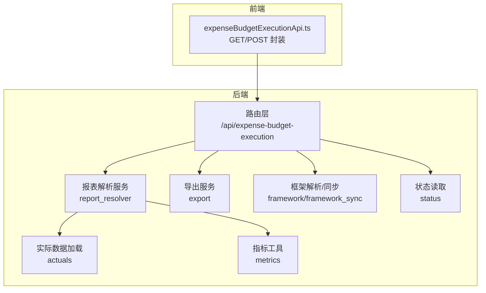
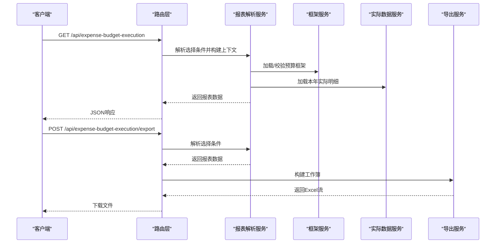
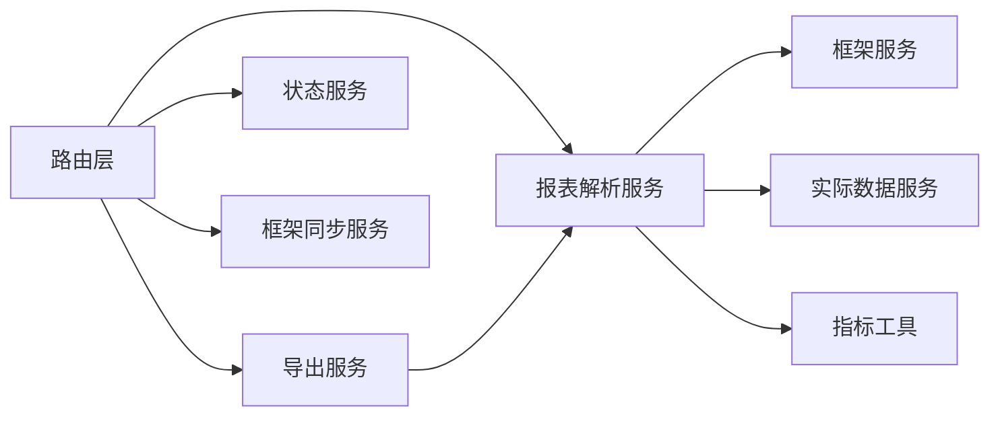

# 预算执行API

<cite>
**本文引用的文件**
- [apps/api/app/routers/expense_budget_execution.py](file://apps/api/app/routers/expense_budget_execution.py)
- [apps/api/app/services/expense_budget_execution_report_resolver.py](file://apps/api/app/services/expense_budget_execution_report_resolver.py)
- [apps/api/app/services/expense_budget_execution_export.py](file://apps/api/app/services/expense_budget_execution_export.py)
- [apps/api/app/services/expense_budget_execution_framework.py](file://apps/api/app/services/expense_budget_execution_framework.py)
- [apps/api/app/services/expense_budget_execution_framework_sync.py](file://apps/api/app/services/expense_budget_execution_framework_sync.py)
- [apps/api/app/services/expense_budget_execution_status.py](file://apps/api/app/services/expense_budget_execution_status.py)
- [apps/api/app/services/expense_budget_execution_actuals.py](file://apps/api/app/services/expense_budget_execution_actuals.py)
- [apps/api/app/services/expense_budget_execution_metrics.py](file://apps/api/app/services/expense_budget_execution_metrics.py)
- [apps/api/app/services/expense_budget_execution_modes.py](file://apps/api/app/services/expense_budget_execution_modes.py)
- [apps/api/app/schemas.py](file://apps/api/app/schemas.py)
- [apps/web/src/lib/expenseBudgetExecutionApi.ts](file://apps/web/src/lib/expenseBudgetExecutionApi.ts)
</cite>

## 目录
1. [简介](#简介)
2. [项目结构](#项目结构)
3. [核心组件](#核心组件)
4. [架构总览](#架构总览)
5. [详细组件分析](#详细组件分析)
6. [依赖分析](#依赖分析)
7. [性能考虑](#性能考虑)
8. [故障排除指南](#故障排除指南)
9. [结论](#结论)
10. [附录](#附录)

## 简介
本文件为预算执行模块的详细API接口文档，覆盖以下能力：
- 执行数据查询与展示：按主体/事业群/费用归属部门三种视角进行预算执行数据查询
- 实际数据导入：本年实际明细导入与预览、应用流程
- 执行进度计算：月度、同比、环比等关键指标
- 报表导出：多种模式与单位的Excel导出
- 框架同步：预算框架（部门/科目）的预览与同步
- 状态查询：预算执行工作流状态与数据量统计

接口遵循RESTful风格，统一使用JSON作为请求/响应格式，错误通过HTTP状态码与错误信息返回。

## 项目结构
预算执行API位于后端FastAPI路由层，服务层负责解析框架、加载预算与实际数据、构建报表模型与导出工作簿，前端通过TypeScript封装调用。

图表来源
- [apps/api/app/routers/expense_budget_execution.py:128-200](file://apps/api/app/routers/expense_budget_execution.py#L128-L200)
- [apps/api/app/services/expense_budget_execution_report_resolver.py:1-120](file://apps/api/app/services/expense_budget_execution_report_resolver.py#L1-L120)
- [apps/api/app/services/expense_budget_execution_export.py:507-599](file://apps/api/app/services/expense_budget_execution_export.py#L507-L599)
- [apps/api/app/services/expense_budget_execution_framework.py:211-314](file://apps/api/app/services/expense_budget_execution_framework.py#L211-L314)
- [apps/api/app/services/expense_budget_execution_framework_sync.py:24-68](file://apps/api/app/services/expense_budget_execution_framework_sync.py#L24-L68)
- [apps/api/app/services/expense_budget_execution_status.py:48-56](file://apps/api/app/services/expense_budget_execution_status.py#L48-L56)
- [apps/api/app/services/expense_budget_execution_actuals.py:92-149](file://apps/api/app/services/expense_budget_execution_actuals.py#L92-L149)
- [apps/api/app/services/expense_budget_execution_metrics.py:9-118](file://apps/api/app/services/expense_budget_execution_metrics.py#L9-L118)
- [apps/web/src/lib/expenseBudgetExecutionApi.ts:1-204](file://apps/web/src/lib/expenseBudgetExecutionApi.ts#L1-L204)

章节来源
- [apps/api/app/routers/expense_budget_execution.py:128-200](file://apps/api/app/routers/expense_budget_execution.py#L128-L200)
- [apps/web/src/lib/expenseBudgetExecutionApi.ts:1-204](file://apps/web/src/lib/expenseBudgetExecutionApi.ts#L1-L204)

## 核心组件
- 路由器：提供查询、导出、状态、框架同步等端点
- 报表解析服务：根据选择条件构建查询/模板/科目模式的报表模型
- 导出服务：根据选项生成Excel工作簿并输出流
- 框架服务：解析Excel框架、构建上下文、持久化快照
- 实际数据服务：从原始明细表加载本年实际并聚合
- 指标工具：计算月度、同比、环比等指标
- 前端API封装：统一请求参数与响应DTO

章节来源
- [apps/api/app/routers/expense_budget_execution.py:107-201](file://apps/api/app/routers/expense_budget_execution.py#L107-L201)
- [apps/api/app/services/expense_budget_execution_report_resolver.py:94-205](file://apps/api/app/services/expense_budget_execution_report_resolver.py#L94-L205)
- [apps/api/app/services/expense_budget_execution_export.py:29-75](file://apps/api/app/services/expense_budget_execution_export.py#L29-L75)
- [apps/api/app/services/expense_budget_execution_framework.py:52-749](file://apps/api/app/services/expense_budget_execution_framework.py#L52-L749)
- [apps/api/app/services/expense_budget_execution_actuals.py:30-149](file://apps/api/app/services/expense_budget_execution_actuals.py#L30-L149)
- [apps/api/app/services/expense_budget_execution_metrics.py:9-118](file://apps/api/app/services/expense_budget_execution_metrics.py#L9-L118)
- [apps/web/src/lib/expenseBudgetExecutionApi.ts:103-139](file://apps/web/src/lib/expenseBudgetExecutionApi.ts#L103-L139)

## 架构总览
预算执行API的调用链路如下：

图表来源
- [apps/api/app/routers/expense_budget_execution.py:128-199](file://apps/api/app/routers/expense_budget_execution.py#L128-L199)
- [apps/api/app/services/expense_budget_execution_report_resolver.py:267-309](file://apps/api/app/services/expense_budget_execution_report_resolver.py#L267-L309)
- [apps/api/app/services/expense_budget_execution_export.py:580-599](file://apps/api/app/services/expense_budget_execution_export.py#L580-L599)
- [apps/api/app/services/expense_budget_execution_framework.py:408-459](file://apps/api/app/services/expense_budget_execution_framework.py#L408-L459)
- [apps/api/app/services/expense_budget_execution_actuals.py:92-149](file://apps/api/app/services/expense_budget_execution_actuals.py#L92-L149)

## 详细组件分析

### 查询接口
- 端点：GET /api/expense-budget-execution
- 功能：按模式与视角查询预算执行数据
- 请求参数（查询字符串）
  - mode: 模式，支持 "query"|"template"|"subject"
  - perspective: 视角，支持 "entity"|"group"|"owner_dept"
  - keyword: 关键词过滤
  - include_zero_rows: 是否包含零行
  - entity_name: 主体名称
  - group_name: 事业群名称
  - owner_dept: 费用归属部门
  - subject_id: 预算科目ID（正整数）
  - report_month: 报告月份（1-12）

- 响应字段（节选）
  - mode/perspective/budget_year/version_id/version_name/current_month
  - framework_source_mode/actual_source_mode
  - available_entities/available_groups/available_owner_departments
  - template_scope_options/selected_*_name
  - template_title/subject_title
  - rows/subject_tree/monthly_*_rows/monthly_daily_*_blocks
  - consistency_warnings/subject_scope_tree/note

- 参数校验
  - perspective必须在允许集合内
  - subject_id需为正整数
  - report_month需在1-12之间

- 错误处理
  - 当框架或实际数据缺失时抛出400错误
  - 参数非法时抛出400错误

章节来源
- [apps/api/app/routers/expense_budget_execution.py:128-158](file://apps/api/app/routers/expense_budget_execution.py#L128-L158)
- [apps/api/app/services/expense_budget_execution_report_resolver.py:62-92](file://apps/api/app/services/expense_budget_execution_report_resolver.py#L62-L92)
- [apps/web/src/lib/expenseBudgetExecutionApi.ts:141-151](file://apps/web/src/lib/expenseBudgetExecutionApi.ts#L141-L151)

### 导出接口
- 端点：POST /api/expense-budget-execution/export
- 功能：根据请求参数导出Excel
- 请求体字段
  - mode: 模式，支持 "query"|"template"|"subject"|"flat"
  - perspective: 视角，支持 "entity"|"group"|"owner_dept"
  - amount_unit: 金额单位，支持 "yuan"|"thousand"|"ten_thousand"|"million"|"hundred_million"
  - keyword/include_zero_rows/entity_name/group_name/owner_dept
  - subject_id/report_month
  - include_monthly_actuals: 是否包含当月累计前各月实际
  - include_last_year_monthly_actuals: 是否包含去年同期各月实际

- 响应：二进制Excel文件流

- 导出模式映射
  - query → monthly 工作簿
  - template → template 工作簿
  - subject → subject 工作簿
  - flat → 平铺工作簿（按视角展开）

- 单位换算
  - yuan: 1；thousand: 1000；ten_thousand: 10000；million: 1000000；hundred_million: 100000000

章节来源
- [apps/api/app/routers/expense_budget_execution.py:181-199](file://apps/api/app/routers/expense_budget_execution.py#L181-L199)
- [apps/api/app/services/expense_budget_execution_export.py:29-75](file://apps/api/app/services/expense_budget_execution_export.py#L29-L75)
- [apps/api/app/services/expense_budget_execution_export.py:507-599](file://apps/api/app/services/expense_budget_execution_export.py#L507-L599)

### 状态查询接口
- 端点：GET /api/expense-budget-execution/status
- 功能：返回预算执行工作流状态与关键表行数
- 响应字段
  - framework_import/master_apply 同步元数据
  - counts 各表行数统计

章节来源
- [apps/api/app/routers/expense_budget_execution.py:159-162](file://apps/api/app/routers/expense_budget_execution.py#L159-L162)
- [apps/api/app/services/expense_budget_execution_status.py:48-56](file://apps/api/app/services/expense_budget_execution_status.py#L48-L56)

### 框架同步接口
- 端点
  - POST /api/expense-budget-execution/admin/framework-preview
  - POST /api/expense-budget-execution/admin/framework-sync
- 功能
  - 预览：解析上传的框架文件，合并现有框架，生成预览结果
  - 同步：持久化框架快照；可选应用到主数据并写入审计日志
- 请求
  - 文件上传（.xls/.xlsx/.xlsm），同步接口额外支持 apply_to_master_data 表单参数
- 响应
  - 预览：合并后的框架与主数据计划摘要
  - 同步：源文件、框架行数统计、是否应用主数据、主数据应用结果

章节来源
- [apps/api/app/routers/expense_budget_execution.py:163-179](file://apps/api/app/routers/expense_budget_execution.py#L163-L179)
- [apps/api/app/services/expense_budget_execution_framework_sync.py:24-68](file://apps/api/app/services/expense_budget_execution_framework_sync.py#L24-L68)
- [apps/api/app/services/expense_budget_execution_framework.py:211-314](file://apps/api/app/services/expense_budget_execution_framework.py#L211-L314)

### 实际数据导入接口
- 端点：POST /api/expense-budget-execution/admin/framework-sync
- 功能：同步框架后，可选将框架应用到主数据并校验机构及产品指标科目
- 注意：本接口同时用于框架同步，实际数据导入另有独立模块（ExpenseActualImport*），此处为框架同步流程的一部分

章节来源
- [apps/api/app/routers/expense_budget_execution.py:169-179](file://apps/api/app/routers/expense_budget_execution.py#L169-L179)
- [apps/api/app/services/expense_budget_execution_framework_sync.py:30-68](file://apps/api/app/services/expense_budget_execution_framework_sync.py#L30-L68)

### 执行进度与指标
- 计算逻辑
  - 本年实际：1月至当前月累计
  - 预算进度%：本年实际/本年预算
  - 同比：本年实际-去年同期实际
  - 同比%：同比/去年同期实际
  - 环比：当月实际-上月实际
  - 环比%：环比/上月实际
- 数据来源
  - 实际数据来自本年实际明细表，按主体/事业群/费用归属部门/预算科目聚合
  - 预算数据来自预算版本与导入数据

章节来源
- [apps/api/app/services/expense_budget_execution_metrics.py:13-52](file://apps/api/app/services/expense_budget_execution_metrics.py#L13-L52)
- [apps/api/app/services/expense_budget_execution_actuals.py:92-149](file://apps/api/app/services/expense_budget_execution_actuals.py#L92-L149)

### 数据模型与DTO
- 前端响应DTO（节选）
  - rows：按视角展开的明细行
  - subject_tree：模板模式下的科目树
  - monthly_*_rows：月报分块行
  - consistency_warnings：一致性校验警告
  - note：说明文本
- 请求DTO（节选）
  - ExpenseBudgetExecutionReportRequest：查询请求
  - ExpenseBudgetExecutionExportRequest：导出请求（含金额单位、是否包含月度实际等）

章节来源
- [apps/web/src/lib/expenseBudgetExecutionApi.ts:103-160](file://apps/web/src/lib/expenseBudgetExecutionApi.ts#L103-L160)

## 依赖分析
- 路由层依赖服务层：报表解析、导出、框架同步、状态读取
- 报表解析依赖：框架上下文、实际数据、预算数据、科目目录、指标工具
- 导出依赖：报表解析结果与导出选项
- 框架解析依赖：Excel解析、数据库持久化、主数据应用

图表来源
- [apps/api/app/routers/expense_budget_execution.py:107-201](file://apps/api/app/routers/expense_budget_execution.py#L107-L201)
- [apps/api/app/services/expense_budget_execution_report_resolver.py:1-120](file://apps/api/app/services/expense_budget_execution_report_resolver.py#L1-L120)
- [apps/api/app/services/expense_budget_execution_export.py:507-599](file://apps/api/app/services/expense_budget_execution_export.py#L507-L599)
- [apps/api/app/services/expense_budget_execution_framework_sync.py:24-68](file://apps/api/app/services/expense_budget_execution_framework_sync.py#L24-L68)
- [apps/api/app/services/expense_budget_execution_status.py:48-56](file://apps/api/app/services/expense_budget_execution_status.py#L48-L56)

## 性能考虑
- 分页与过滤：通过keyword、include_zero_rows、scope筛选减少数据量
- 聚合计算：按主体/事业群/费用归属部门聚合，避免重复扫描
- 导出优化：仅在需要时包含月度实际与去年同期，降低工作簿体积
- 缓存建议：框架与主数据变更频率较低，可在前端缓存模板范围选项与实体/分组列表

## 故障排除指南
- 400 错误
  - 参数非法：perspective不在允许集合、subject_id非正整数、report_month不在1-12
  - 框架缺失：未维护部门费用主数据
  - 实际数据缺失：未导入本年实际明细
- 404 错误
  - 未找到对应报表或导出文件
- 500 错误
  - 数据库连接失败、Excel解析异常、导出构建异常
- 审计与追踪
  - 框架同步写入审计日志，包含受影响行数与目标表

章节来源
- [apps/api/app/services/expense_budget_execution_report_resolver.py:62-92](file://apps/api/app/services/expense_budget_execution_report_resolver.py#L62-L92)
- [apps/api/app/services/expense_budget_execution_framework.py:23-25](file://apps/api/app/services/expense_budget_execution_framework.py#L23-L25)
- [apps/api/app/services/expense_budget_execution_actuals.py:23-25](file://apps/api/app/services/expense_budget_execution_actuals.py#L23-L25)
- [apps/api/app/services/expense_budget_execution_framework_sync.py:47-67](file://apps/api/app/services/expense_budget_execution_framework_sync.py#L47-L67)

## 结论
预算执行API提供了完整的预算执行数据查询、导出、框架同步与状态监控能力。通过清晰的模式与视角划分、完善的参数校验与错误处理、以及灵活的导出选项，满足多场景的预算执行分析需求。建议在前端实现中充分利用过滤与聚合能力，并结合审计日志进行问题定位。

## 附录

### 接口一览表
- GET /api/expense-budget-execution
  - 查询预算执行数据
  - 支持模式：query/template/subject
  - 支持视角：entity/group/owner_dept
  - 支持过滤：keyword、include_zero_rows、scope、subject_id、report_month
- GET /api/expense-budget-execution/status
  - 查询预算执行工作流状态
- POST /api/expense-budget-execution/admin/framework-preview
  - 预览框架同步
- POST /api/expense-budget-execution/admin/framework-sync
  - 同步框架并可选应用到主数据
- POST /api/expense-budget-execution/export
  - 导出Excel报表
  - 支持模式：query/template/subject/flat
  - 支持单位：yuan/thousand/ten_thousand/million/hundred_million

章节来源
- [apps/api/app/routers/expense_budget_execution.py:128-199](file://apps/api/app/routers/expense_budget_execution.py#L128-L199)
- [apps/api/app/services/expense_budget_execution_export.py:507-599](file://apps/api/app/services/expense_budget_execution_export.py#L507-L599)

### 参数与数据类型对照
- 模式（mode）：query|template|subject|flat
- 视角（perspective）：entity|group|owner_dept
- 金额单位（amount_unit）：yuan|thousand|ten_thousand|million|hundred_million
- 布尔值：true/false（前端以布尔形式传递）
- 数值范围：subject_id>0；report_month∈[1,12]

章节来源
- [apps/api/app/services/expense_budget_execution_modes.py:5-7](file://apps/api/app/services/expense_budget_execution_modes.py#L5-L7)
- [apps/api/app/services/expense_budget_execution_report_resolver.py:71-92](file://apps/api/app/services/expense_budget_execution_report_resolver.py#L71-L92)
- [apps/web/src/lib/expenseBudgetExecutionApi.ts:141-160](file://apps/web/src/lib/expenseBudgetExecutionApi.ts#L141-L160)