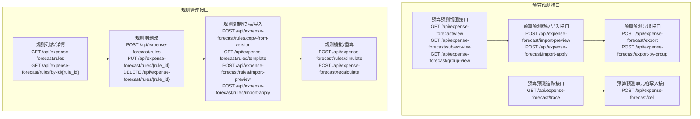
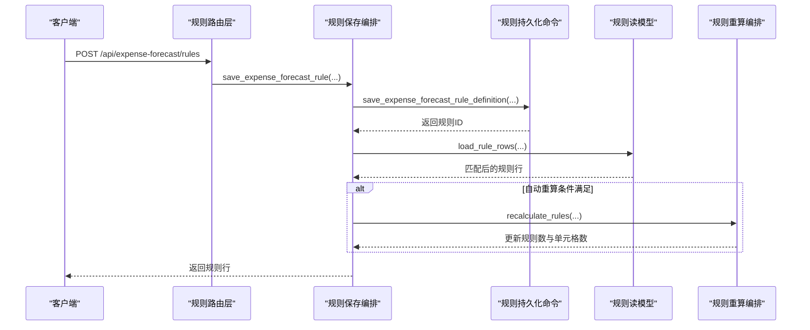
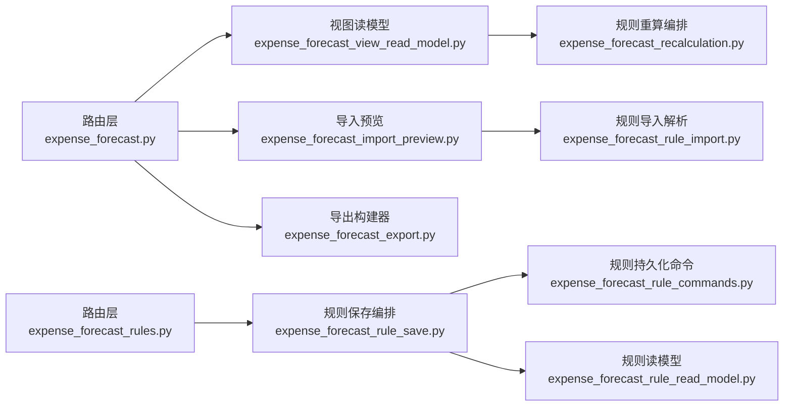
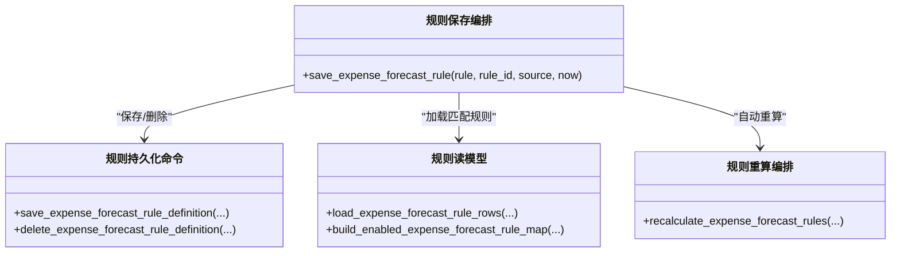

# 预算预测API

<cite>
**本文档引用的文件**
- [apps/api/app/routers/expense_forecast.py](file://apps/api/app/routers/expense_forecast.py)
- [apps/api/app/routers/expense_forecast_rules.py](file://apps/api/app/routers/expense_forecast_rules.py)
- [apps/api/app/services/expense_forecast_rule_read_model.py](file://apps/api/app/services/expense_forecast_rule_read_model.py)
- [apps/api/app/services/expense_forecast_view_read_model.py](file://apps/api/app/services/expense_forecast_view_read_model.py)
- [apps/api/app/services/expense_forecast_import_preview.py](file://apps/api/app/services/expense_forecast_import_preview.py)
- [apps/api/app/services/expense_forecast_export.py](file://apps/api/app/services/expense_forecast_export.py)
- [apps/api/app/services/expense_forecast_rule_commands.py](file://apps/api/app/services/expense_forecast_rule_commands.py)
- [apps/api/app/services/expense_forecast_rule_save.py](file://apps/api/app/services/expense_forecast_rule_save.py)
- [apps/api/app/services/expense_forecast_recalculation.py](file://apps/api/app/services/expense_forecast_recalculation.py)
- [apps/api/app/services/expense_forecast_rule_simulation.py](file://apps/api/app/services/expense_forecast_rule_simulation.py)
- [apps/api/app/services/expense_forecast_rule_import.py](file://apps/api/app/services/expense_forecast_rule_import.py)
</cite>

## 目录
1. [简介](#简介)
2. [项目结构](#项目结构)
3. [核心组件](#核心组件)
4. [架构总览](#架构总览)
5. [详细组件分析](#详细组件分析)
6. [依赖关系分析](#依赖关系分析)
7. [性能考虑](#性能考虑)
8. [故障排查指南](#故障排查指南)
9. [结论](#结论)
10. [附录](#附录)

## 简介
本文件为预算预测模块的详细API接口文档，覆盖预测数据导入、规则配置、预测计算、结果查询与导出等全流程能力。文档面向前后端开发者与测试人员，提供REST接口清单、请求/响应格式、参数校验规则、业务逻辑约束、错误处理策略与状态码说明，并给出客户端实现要点与性能优化建议。

## 项目结构
预算预测API主要由两部分组成：
- 预算预测视图与数据接口：提供预测视图查询、单元格写入、导入预览/应用、导出、追踪等能力
- 预算预测规则接口：提供规则的增删改查、规则复制、规则导入预览/应用、规则模拟、批量重算等能力

图表来源
- [apps/api/app/routers/expense_forecast.py:1338-1587](file://apps/api/app/routers/expense_forecast.py#L1338-L1587)
- [apps/api/app/routers/expense_forecast_rules.py:164-279](file://apps/api/app/routers/expense_forecast_rules.py#L164-L279)

章节来源
- [apps/api/app/routers/expense_forecast.py:1338-1587](file://apps/api/app/routers/expense_forecast.py#L1338-L1587)
- [apps/api/app/routers/expense_forecast_rules.py:164-279](file://apps/api/app/routers/expense_forecast_rules.py#L164-L279)

## 核心组件
- 视图读模型装配器：负责将多源数据组装为视图上下文，支撑按主体/事业群/费用归属部门的预测视图渲染
- 导入预览工作流：解析导入文件、评估每条记录的插入/更新/跳过/错误决策，生成预览结果与标准化行
- 导出构建器：根据编译模式（按费用归属部门/按预算科目）生成Excel工作簿，支持单位换算与字段排除
- 规则持久化与保存编排：封装规则的保存、删除、自动重算触发与审计日志
- 规则重算编排：加载规则与上下文，按规则计算每月预测值并落库
- 规则模拟：在不落库的情况下对规则进行月度模拟计算

章节来源
- [apps/api/app/services/expense_forecast_view_read_model.py:103-347](file://apps/api/app/services/expense_forecast_view_read_model.py#L103-L347)
- [apps/api/app/services/expense_forecast_import_preview.py:335-420](file://apps/api/app/services/expense_forecast_import_preview.py#L335-L420)
- [apps/api/app/services/expense_forecast_export.py:87-365](file://apps/api/app/services/expense_forecast_export.py#L87-L365)
- [apps/api/app/services/expense_forecast_rule_commands.py:36-140](file://apps/api/app/services/expense_forecast_rule_commands.py#L36-L140)
- [apps/api/app/services/expense_forecast_rule_save.py:108-144](file://apps/api/app/services/expense_forecast_rule_save.py#L108-L144)
- [apps/api/app/services/expense_forecast_recalculation.py:159-218](file://apps/api/app/services/expense_forecast_recalculation.py#L159-L218)
- [apps/api/app/services/expense_forecast_rule_simulation.py:64-115](file://apps/api/app/services/expense_forecast_rule_simulation.py#L64-L115)

## 架构总览
以下序列图展示“规则保存并触发自动重算”的关键流程：

图表来源
- [apps/api/app/routers/expense_forecast_rules.py:211-217](file://apps/api/app/routers/expense_forecast_rules.py#L211-L217)
- [apps/api/app/services/expense_forecast_rule_save.py:108-144](file://apps/api/app/services/expense_forecast_rule_save.py#L108-L144)
- [apps/api/app/services/expense_forecast_rule_commands.py:36-140](file://apps/api/app/services/expense_forecast_rule_commands.py#L36-L140)
- [apps/api/app/services/expense_forecast_rule_read_model.py:59-184](file://apps/api/app/services/expense_forecast_rule_read_model.py#L59-L184)
- [apps/api/app/services/expense_forecast_recalculation.py:159-218](file://apps/api/app/services/expense_forecast_recalculation.py#L159-L218)

## 详细组件分析

### 1. 预算预测视图接口
- 功能：按不同编制口径（主体/事业群/费用归属部门）返回预测视图，包含预算科目树、各月预测值、年度预算、业务报送、资划建议等
- 关键端点
  - GET /api/expense-forecast/meta：返回元信息（默认年份、版本建议、可选项）
  - GET /api/expense-forecast/view：按编制口径返回预测视图
  - GET /api/expense-forecast/subject-view：按预算科目返回部门维度视图
  - GET /api/expense-forecast/group-view：按事业群返回部门维度视图
- 请求参数
  - year：整型，默认年份
  - forecast_version：字符串，版本号
  - scope_type：字符串，取值 entity/group/owner
  - scope_value：字符串，对应口径值
  - subject_id：整型，预算科目ID（subject-view必填）
- 响应结构
  - 元信息：包含默认年份、版本建议、实体/事业群/费用归属部门选项、叶子预算科目选项等
  - 视图：包含年份、版本、编制口径、实际截至月、行集合（预算科目行），每行包含科目信息、12个月数据、合计/预算/缺口/执行率、业务报送/资划建议、是否可编辑、规则配置状态等
- 参数校验
  - 编制口径仅支持 entity、group、owner
  - 预算科目必须为叶子节点且无公式
- 错误处理
  - 编制口径非法：400
  - 预算科目不存在或非叶子：400
- 性能建议
  - 合理使用版本与年份过滤
  - 分页/限制返回字段数量（通过exclude_fields）

章节来源
- [apps/api/app/routers/expense_forecast.py:1338-1388](file://apps/api/app/routers/expense_forecast.py#L1338-L1388)
- [apps/api/app/routers/expense_forecast.py:1348-1388](file://apps/api/app/routers/expense_forecast.py#L1348-L1388)
- [apps/api/app/routers/expense_forecast.py:1362-1388](file://apps/api/app/routers/expense_forecast.py#L1362-L1388)
- [apps/api/app/routers/expense_forecast.py:1378-1388](file://apps/api/app/routers/expense_forecast.py#L1378-L1388)
- [apps/api/app/services/expense_forecast_view_read_model.py:255-303](file://apps/api/app/services/expense_forecast_view_read_model.py#L255-L303)

### 2. 预算预测单元格写入接口
- 功能：支持按预算科目、费用归属部门、字段（月预测/业务报送/资划建议）、月份写入或覆盖预测值，并可附带覆盖原因
- 端点
  - POST /api/expense-forecast/cell
- 请求体
  - year、forecast_version、scope_type、scope_value、subject_id、field_name（month_forecast/business_submission/capital_advice）、month（可选）、value、override_reason（可选）
- 响应体
  - updated（布尔）、actual_cutoff_month（整型）、mode（字符串）
- 参数校验
  - 字段名与月份范围校验
  - 实际截至月之前的月度禁止导入预测
- 错误处理
  - 写入流程异常：422/400

章节来源
- [apps/api/app/routers/expense_forecast.py:1390-1414](file://apps/api/app/routers/expense_forecast.py#L1390-L1414)
- [apps/api/app/services/expense_forecast_import_preview.py:124-332](file://apps/api/app/services/expense_forecast_import_preview.py#L124-L332)

### 3. 预算预测数据导入接口
- 功能：支持导入预测数据（Excel），先预览再应用，自动判断插入/更新/跳过/错误
- 端点
  - POST /api/expense-forecast/import-preview：导入预览
  - POST /api/expense-forecast/import-apply：导入应用
- 请求参数
  - year、forecast_version、scope_type、scope_value、group_name（可选）、compile_mode（scope/subject）、subject_id（可选）、mode（append/overwrite）、file（Excel文件）
- 预览响应
  - 文件名、导入模式、实际截至月、预览计数、可插入/可更新/跳过/错误单元格数、明细项（含动作与提示）
- 应用响应
  - 插入/更新/跳过/错误单元格数
- 参数校验
  - 编制口径与导入模式校验
  - 预算科目存在性与唯一性校验
  - 管理部门权限校验（仅允许的管理部门录入）
  - 月度不得早于实际截至月
- 错误处理
  - 导入计划/解析错误：400
  - 单元格错误：400

章节来源
- [apps/api/app/routers/expense_forecast.py:1416-1501](file://apps/api/app/routers/expense_forecast.py#L1416-L1501)
- [apps/api/app/services/expense_forecast_import_preview.py:335-420](file://apps/api/app/services/expense_forecast_import_preview.py#L335-L420)

### 4. 预算预测导出接口
- 功能：支持按编制口径导出预测表，或按事业群聚合导出
- 端点
  - POST /api/expense-forecast/export：常规导出（scope/subject两种编译模式）
  - POST /api/expense-forecast/export-by-group：按事业群导出
- 请求体
  - 年份、版本、编制口径、口径值、编译模式、预算科目ID（可选）、金额单位（yuan/thousand/ten_thousand/wan/million/hundred_million）、排除字段列表
- 响应
  - 流式Excel文件（支持fallback文件名）
- 参数校验
  - 金额单位映射与换算
  - 排除字段合法性
- 错误处理
  - 导出计划错误：400

章节来源
- [apps/api/app/routers/expense_forecast.py:1503-1546](file://apps/api/app/routers/expense_forecast.py#L1503-L1546)
- [apps/api/app/services/expense_forecast_export.py:87-365](file://apps/api/app/services/expense_forecast_export.py#L87-L365)

### 5. 预算预测追踪接口
- 功能：查看某预算科目在某版本下的逐月计算轨迹（系统值、覆盖值、来源、计算依据）
- 端点
  - GET /api/expense-forecast/trace
- 请求参数
  - year、forecast_version、owner_name、subject_id
- 响应体
  - 年份、版本、费用归属部门、预算科目ID、规则ID/方案、逐月项（最终值、系统值、覆盖值、值来源、计算依据JSON）

章节来源
- [apps/api/app/routers/expense_forecast.py:1563-1587](file://apps/api/app/routers/expense_forecast.py#L1563-L1587)

### 6. 预算预测规则接口
- 功能：规则的增删改查、复制、导入预览/应用、模板下载、模拟、批量重算
- 端点
  - GET /api/expense-forecast/rules：规则列表
  - GET /api/expense-forecast/rules/by-id/{rule_id}：规则详情
  - POST /api/expense-forecast/rules：新建规则
  - PUT /api/expense-forecast/rules/{rule_id}：更新规则
  - DELETE /api/expense-forecast/rules/{rule_id}：删除规则
  - POST /api/expense-forecast/rules/copy-from-version：从版本复制规则
  - GET /api/expense-forecast/rules/template：下载规则模板
  - POST /api/expense-forecast/rules/import-preview：规则导入预览
  - POST /api/expense-forecast/rules/import-apply：规则导入应用
  - POST /api/expense-forecast/rules/simulate：规则模拟
  - POST /api/expense-forecast/recalculate：批量重算
- 请求/响应体
  - 规则行：包含年份、版本、费用归属部门、预算科目、方案类型、启用/覆盖/自动刷新/手动重算开关、生效起止月、优先级、备注、参数与变量等
  - 复制响应：复制规则数量
  - 模拟响应：方案类型与逐月模拟值（含系统值、值来源、计算依据）
  - 重算响应：更新规则数、更新单元格数
- 参数校验
  - 方案类型：MANUAL/RESIDUAL_ALLOC/METRIC_EXPR
  - 生效起止月范围校验
  - 指标表达式规则必须提供表达式与变量映射JSON
  - 变量映射JSON需为数组且每项包含variable_code
- 错误处理
  - 规则不存在：404
  - 规则保存失败：500
  - 规则导入JSON不合法：400

章节来源
- [apps/api/app/routers/expense_forecast_rules.py:164-279](file://apps/api/app/routers/expense_forecast_rules.py#L164-L279)
- [apps/api/app/services/expense_forecast_rule_read_model.py:59-184](file://apps/api/app/services/expense_forecast_rule_read_model.py#L59-L184)
- [apps/api/app/services/expense_forecast_rule_commands.py:36-140](file://apps/api/app/services/expense_forecast_rule_commands.py#L36-L140)
- [apps/api/app/services/expense_forecast_rule_save.py:108-144](file://apps/api/app/services/expense_forecast_rule_save.py#L108-L144)
- [apps/api/app/services/expense_forecast_rule_simulation.py:64-115](file://apps/api/app/services/expense_forecast_rule_simulation.py#L64-L115)
- [apps/api/app/services/expense_forecast_rule_import.py:307-435](file://apps/api/app/services/expense_forecast_rule_import.py#L307-L435)

### 7. 数据模型与复杂度分析
- 规则读模型
  - 查询expense_forecast_rule及其参数、变量，组装为规则行列表
  - 时间复杂度：O(R + P + V)，R为规则数，P/V为参数/变量数
- 导入预览
  - 解析Excel → 构建导入计划 → 评估每行动作 → 生成预览与标准化行
  - 时间复杂度：O(N + M)，N为行数，M为映射查找
- 导出
  - 组装视图 → 写入Excel → 计算公式/样式
  - 时间复杂度：O(S)，S为输出单元格数
- 规则重算
  - 加载上下文 → 对每条规则计算逐月值 → 落库
  - 时间复杂度：O(K×M)，K为规则数，M为月份数

章节来源
- [apps/api/app/services/expense_forecast_rule_read_model.py:59-184](file://apps/api/app/services/expense_forecast_rule_read_model.py#L59-L184)
- [apps/api/app/services/expense_forecast_import_preview.py:335-420](file://apps/api/app/services/expense_forecast_import_preview.py#L335-L420)
- [apps/api/app/services/expense_forecast_export.py:87-365](file://apps/api/app/services/expense_forecast_export.py#L87-L365)
- [apps/api/app/services/expense_forecast_recalculation.py:159-218](file://apps/api/app/services/expense_forecast_recalculation.py#L159-L218)

## 依赖关系分析
- 路由层依赖服务层：路由负责参数校验与调用服务编排
- 服务层内部协作
  - 规则保存编排依赖规则持久化命令与规则读模型
  - 导入预览依赖导入计划构建与评估逻辑
  - 导出依赖视图上下文与工作簿构建
  - 重算依赖规则计算引擎与结果落库命令
- 外部依赖
  - SQLite（aiosqlite）用于规则与计算结果存储
  - OpenPyXL用于Excel导出

图表来源
- [apps/api/app/routers/expense_forecast.py:1338-1587](file://apps/api/app/routers/expense_forecast.py#L1338-L1587)
- [apps/api/app/routers/expense_forecast_rules.py:164-279](file://apps/api/app/routers/expense_forecast_rules.py#L164-L279)
- [apps/api/app/services/expense_forecast_view_read_model.py:103-347](file://apps/api/app/services/expense_forecast_view_read_model.py#L103-L347)
- [apps/api/app/services/expense_forecast_import_preview.py:335-420](file://apps/api/app/services/expense_forecast_import_preview.py#L335-L420)
- [apps/api/app/services/expense_forecast_export.py:87-365](file://apps/api/app/services/expense_forecast_export.py#L87-L365)
- [apps/api/app/services/expense_forecast_rule_save.py:108-144](file://apps/api/app/services/expense_forecast_rule_save.py#L108-L144)
- [apps/api/app/services/expense_forecast_rule_commands.py:36-140](file://apps/api/app/services/expense_forecast_rule_commands.py#L36-L140)
- [apps/api/app/services/expense_forecast_rule_read_model.py:59-184](file://apps/api/app/services/expense_forecast_rule_read_model.py#L59-L184)
- [apps/api/app/services/expense_forecast_recalculation.py:159-218](file://apps/api/app/services/expense_forecast_recalculation.py#L159-L218)
- [apps/api/app/services/expense_forecast_rule_import.py:307-435](file://apps/api/app/services/expense_forecast_rule_import.py#L307-L435)

## 性能考虑
- 批量操作
  - 导入预览限制返回明细数量（最多200条），避免大响应
  - 导出支持字段排除与单位换算，减少列数与计算量
- 数据库访问
  - 使用IN子句与占位符，避免多次往返
  - 合理使用索引字段（年份、版本、费用归属部门、预算科目）
- 计算优化
  - 规则重算按启用与触发条件筛选，避免无效计算
  - 结果落库采用批量写入
- I/O优化
  - 导出使用流式写入，降低内存占用

## 故障排查指南
- 常见错误与处理
  - 编制口径非法：检查scope_type取值
  - 预算科目不存在或非叶子：确认subject_id与叶子节点要求
  - 导入预览错误：检查Excel列头、预算科目唯一性、管理部门权限
  - 规则保存失败：检查方案类型、生效月范围、表达式与变量映射JSON
  - 规则不存在：确认rule_id与版本
- 日志与审计
  - 规则保存完成后写入操作审计日志，便于回溯
- 状态码
  - 400：参数/业务校验错误
  - 404：资源不存在
  - 422：工作流错误（如单元格写入）
  - 500：服务内部错误（如规则保存）

章节来源
- [apps/api/app/routers/expense_forecast.py:1283-1293](file://apps/api/app/routers/expense_forecast.py#L1283-L1293)
- [apps/api/app/routers/expense_forecast.py:1323-1324](file://apps/api/app/routers/expense_forecast.py#L1323-L1324)
- [apps/api/app/routers/expense_forecast_rules.py:207-208](file://apps/api/app/routers/expense_forecast_rules.py#L207-L208)
- [apps/api/app/routers/expense_forecast_rules.py:223-224](file://apps/api/app/routers/expense_forecast_rules.py#L223-L224)
- [apps/api/app/routers/expense_forecast_rules.py:277-278](file://apps/api/app/routers/expense_forecast_rules.py#L277-L278)
- [apps/api/app/services/expense_forecast_rule_save.py:137-143](file://apps/api/app/services/expense_forecast_rule_save.py#L137-L143)

## 结论
预算预测API围绕“视图查询—数据导入—规则管理—计算重算—结果导出—追踪溯源”形成闭环，具备完善的参数校验、业务约束与错误处理机制。通过流式导出、批量重算与字段排除等手段，兼顾易用性与性能。建议在生产环境结合缓存与异步任务进一步提升吞吐。

## 附录

### A. 接口清单与示例

- 规则管理
  - GET /api/expense-forecast/rules
    - 查询参数：year、forecast_version、owner_name、subject_id
    - 响应：规则行列表
  - GET /api/expense-forecast/rules/by-id/{rule_id}
    - 响应：单条规则行
  - POST /api/expense-forecast/rules
    - 请求体：规则保存请求（含方案类型、生效月、参数、变量等）
    - 响应：规则行
  - PUT /api/expense-forecast/rules/{rule_id}
    - 请求体：规则保存请求
    - 响应：规则行
  - DELETE /api/expense-forecast/rules/{rule_id}
    - 响应：无内容
  - POST /api/expense-forecast/rules/copy-from-version
    - 请求体：复制请求（年份、源版本、目标版本）
    - 响应：复制规则数
  - GET /api/expense-forecast/rules/template
    - 响应：Excel模板流
  - POST /api/expense-forecast/rules/import-preview
    - 请求：multipart/form-data，file字段
    - 响应：导入预览结果
  - POST /api/expense-forecast/rules/import-apply
    - 请求：multipart/form-data，file字段
    - 响应：导入应用结果
  - POST /api/expense-forecast/rules/simulate
    - 请求体：规则模拟请求
    - 响应：逐月模拟值
  - POST /api/expense-forecast/recalculate
    - 请求体：批量重算请求
    - 响应：更新规则数与单元格数

- 预测视图与数据
  - GET /api/expense-forecast/meta
    - 响应：元信息
  - GET /api/expense-forecast/view
    - 响应：按编制口径的预测视图
  - GET /api/expense-forecast/subject-view
    - 响应：按预算科目的部门视图
  - GET /api/expense-forecast/group-view
    - 响应：按事业群的部门视图
  - POST /api/expense-forecast/cell
    - 请求体：单元格写入请求
    - 响应：写入结果
  - POST /api/expense-forecast/import-preview
    - 请求：multipart/form-data，file字段
    - 响应：导入预览结果
  - POST /api/expense-forecast/import-apply
    - 请求：multipart/form-data，file字段
    - 响应：导入应用结果
  - POST /api/expense-forecast/export
    - 请求体：导出请求
    - 响应：Excel流
  - POST /api/expense-forecast/export-by-group
    - 请求体：按事业群导出请求
    - 响应：Excel流
  - GET /api/expense-forecast/trace
    - 响应：逐月轨迹

章节来源
- [apps/api/app/routers/expense_forecast_rules.py:164-279](file://apps/api/app/routers/expense_forecast_rules.py#L164-L279)
- [apps/api/app/routers/expense_forecast.py:1338-1587](file://apps/api/app/routers/expense_forecast.py#L1338-L1587)

### B. 参数与数据类型约束
- 编制口径：entity/group/owner
- 导入模式：append/overwrite
- 字段名：month_forecast/business_submission/capital_advice
- 金额单位：yuan/thousand/ten_thousand/wan/million/hundred_million
- 规则方案类型：MANUAL/RESIDUAL_ALLOC/METRIC_EXPR
- 生效起止月：1~12，起始月≤结束月
- JSON字段：表达式、变量映射JSON需为合法JSON

章节来源
- [apps/api/app/routers/expense_forecast.py:1283-1293](file://apps/api/app/routers/expense_forecast.py#L1283-L1293)
- [apps/api/app/services/expense_forecast_export.py:15-22](file://apps/api/app/services/expense_forecast_export.py#L15-L22)
- [apps/api/app/services/expense_forecast_rule_import.py:386-389](file://apps/api/app/services/expense_forecast_rule_import.py#L386-L389)
- [apps/api/app/services/expense_forecast_rule_import.py:416-435](file://apps/api/app/services/expense_forecast_rule_import.py#L416-L435)

### C. 客户端实现要点
- 预览先行：导入前务必调用预览接口，核对动作与提示
- 权限控制：确保当前用户有对应预算科目的录入权限
- 批量处理：对大量规则或数据采用分批/异步策略
- 错误恢复：对400/404错误进行明确提示与重试策略

### D. 类图（代码级）

图表来源
- [apps/api/app/services/expense_forecast_rule_save.py:108-144](file://apps/api/app/services/expense_forecast_rule_save.py#L108-L144)
- [apps/api/app/services/expense_forecast_rule_commands.py:36-140](file://apps/api/app/services/expense_forecast_rule_commands.py#L36-L140)
- [apps/api/app/services/expense_forecast_rule_read_model.py:59-184](file://apps/api/app/services/expense_forecast_rule_read_model.py#L59-L184)
- [apps/api/app/services/expense_forecast_recalculation.py:159-218](file://apps/api/app/services/expense_forecast_recalculation.py#L159-L218)