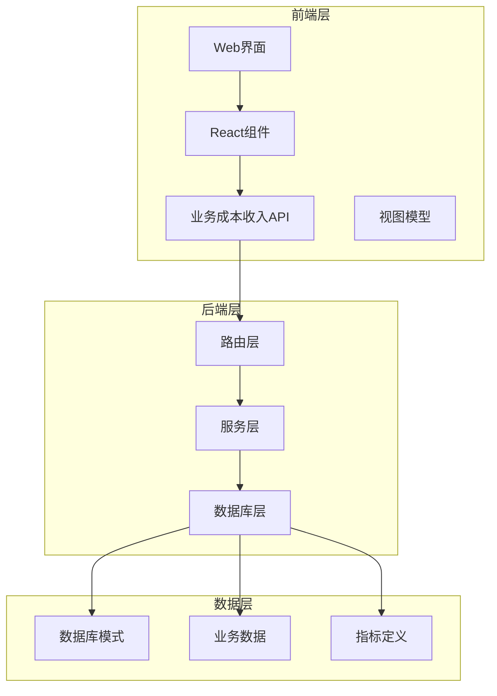
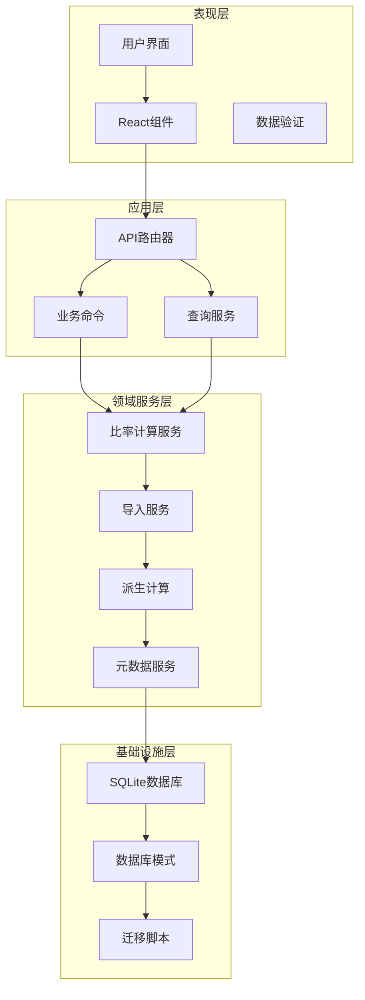
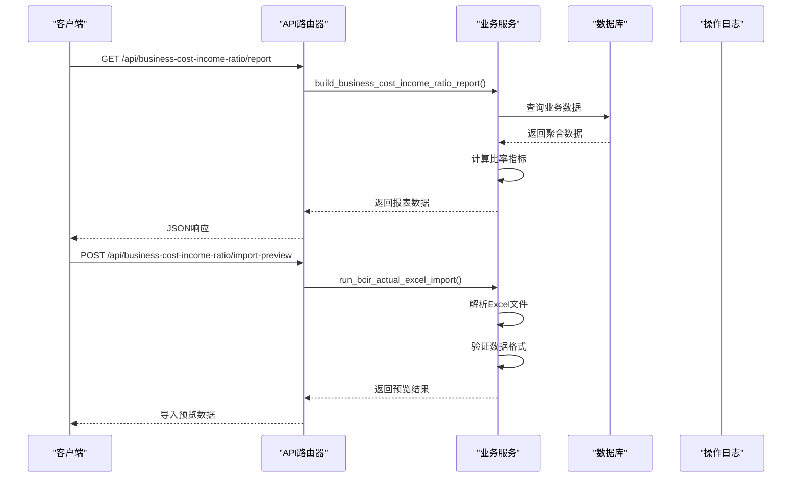
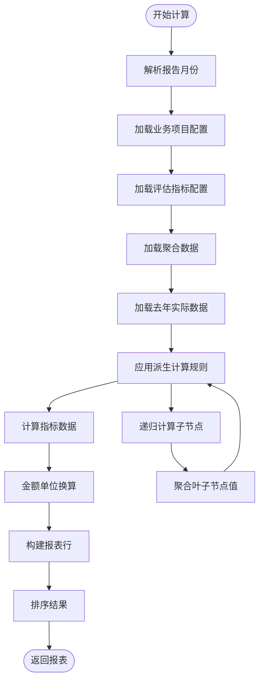
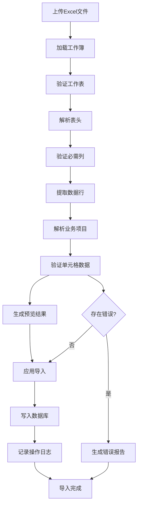
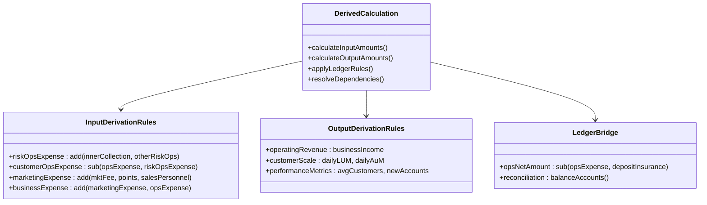
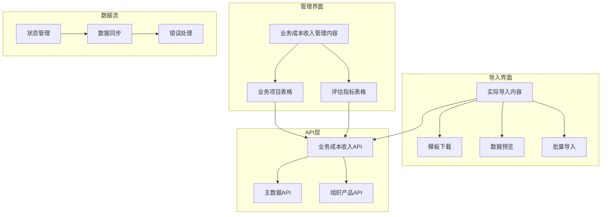
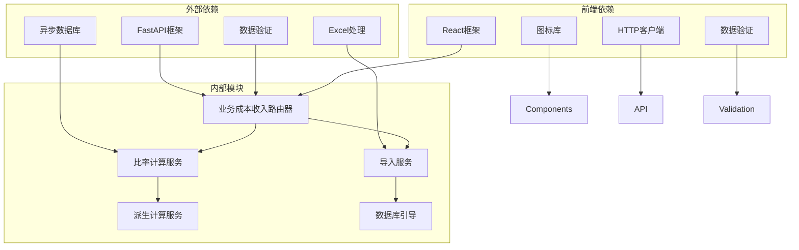
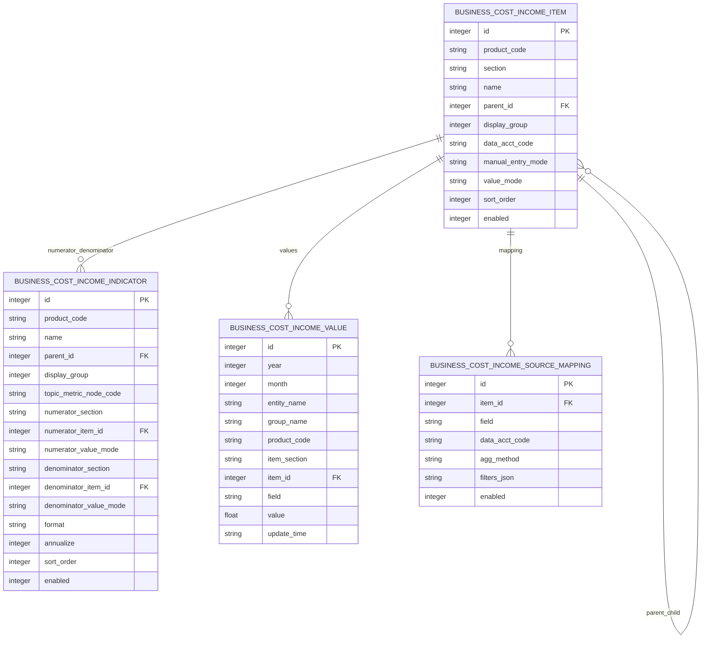

# 业务成本收入组件

<cite>
**本文档引用的文件**
- [apps/api/app/routers/business_cost_income_ratio.py](file://apps/api/app/routers/business_cost_income_ratio.py)
- [apps/api/app/services/business_cost_income_ratio.py](file://apps/api/app/services/business_cost_income_ratio.py)
- [apps/api/app/services/business_cost_income_import.py](file://apps/api/app/services/business_cost_income_import.py)
- [apps/api/app/services/business_cost_income_derived.py](file://apps/api/app/services/business_cost_income_derived.py)
- [apps/api/app/db_bootstrap/business_cost_income.py](file://apps/api/app/db_bootstrap/business_cost_income.py)
- [apps/web/src/app/components/BusinessCostIncomeIndicatorTable.tsx](file://apps/web/src/app/components/BusinessCostIncomeIndicatorTable.tsx)
- [apps/web/src/app/components/BusinessCostIncomeItemTable.tsx](file://apps/web/src/app/components/BusinessCostIncomeItemTable.tsx)
- [apps/web/src/app/components/BusinessCostIncomeRatioActualImportContent.tsx](file://apps/web/src/app/components/BusinessCostIncomeRatioActualImportContent.tsx)
- [apps/web/src/app/components/BusinessCostIncomeRatioAdminContent.tsx](file://apps/web/src/app/components/BusinessCostIncomeRatioAdminContent.tsx)
- [apps/web/src/lib/businessCostIncomeApi.ts](file://apps/web/src/lib/businessCostIncomeApi.ts)
- [apps/web/src/lib/businessCostIncomeAdminViewModel.ts](file://apps/web/src/lib/businessCostIncomeAdminViewModel.ts)
</cite>

## 目录
1. [简介](#简介)
2. [项目结构](#项目结构)
3. [核心组件](#核心组件)
4. [架构概览](#架构概览)
5. [详细组件分析](#详细组件分析)
6. [依赖关系分析](#依赖关系分析)
7. [性能考虑](#性能考虑)
8. [故障排除指南](#故障排除指南)
9. [结论](#结论)
10. [附录](#附录)

## 简介

业务成本收入组件是智能预算系统中的核心模块，负责管理业务成本收入相关的指标计算、数据导入和比率分析功能。该组件提供了完整的成本核算、收入统计和比率分析能力，支持多产品线、多维度的财务数据管理。

该系统采用前后端分离架构，后端基于FastAPI提供RESTful API服务，前端使用React构建用户界面。组件支持Excel模板导入、实时计算、批量处理和数据准确性保证等高级功能。

## 项目结构

业务成本收入组件的项目结构遵循清晰的分层设计：



**图表来源**
- [apps/api/app/routers/business_cost_income_ratio.py:285-745](file://apps/api/app/routers/business_cost_income_ratio.py#L285-L745)
- [apps/web/src/lib/businessCostIncomeApi.ts:1-364](file://apps/web/src/lib/businessCostIncomeApi.ts#L1-L364)

**章节来源**
- [apps/api/app/routers/business_cost_income_ratio.py:1-745](file://apps/api/app/routers/business_cost_income_ratio.py#L1-L745)
- [apps/web/src/lib/businessCostIncomeApi.ts:1-364](file://apps/web/src/lib/businessCostIncomeApi.ts#L1-L364)

## 核心组件

### 成本收入指标表格组件

成本收入指标表格组件负责展示和管理业务成本收入相关的评估指标。该组件支持指标的增删改查、排序调整和状态控制。

主要功能特性：
- 指标列表展示和交互
- 动态排序和拖拽功能
- 启用/停用状态切换
- 批量操作支持
- 实时数据同步

### 成本收入项目表格组件

成本收入项目表格组件提供业务投入和业务产出项目的树形结构管理。支持父子节点关系、层级显示和批量操作。

核心功能：
- 树形结构展示
- 展开/折叠控制
- 父子节点关系管理
- 排序和层级调整
- 批量添加和删除

### 实际导入内容组件

实际导入内容组件提供Excel模板下载、数据导入预览和批量导入功能。支持多产品线、多月份的数据导入。

关键特性：
- Excel模板生成和下载
- 导入数据预览和验证
- 错误检测和提示
- 批量数据写入
- 操作日志记录

### 比率管理内容组件

比率管理内容组件专注于业务成本收入比的计算和展示。提供多种格式的比率计算和可视化展示。

主要功能：
- 成本收入比计算
- 多种格式支持（比率、百分比、数值）
- 年度对比分析
- 月度趋势跟踪
- 自定义指标配置

**章节来源**
- [apps/web/src/app/components/BusinessCostIncomeIndicatorTable.tsx:1-157](file://apps/web/src/app/components/BusinessCostIncomeIndicatorTable.tsx#L1-L157)
- [apps/web/src/app/components/BusinessCostIncomeItemTable.tsx:1-256](file://apps/web/src/app/components/BusinessCostIncomeItemTable.tsx#L1-L256)
- [apps/web/src/app/components/BusinessCostIncomeRatioActualImportContent.tsx:1-342](file://apps/web/src/app/components/BusinessCostIncomeRatioActualImportContent.tsx#L1-L342)
- [apps/web/src/app/components/BusinessCostIncomeRatioAdminContent.tsx:1-800](file://apps/web/src/app/components/BusinessCostIncomeRatioAdminContent.tsx#L1-L800)

## 架构概览

业务成本收入组件采用分层架构设计，确保各层职责明确、耦合度低：



**图表来源**
- [apps/api/app/routers/business_cost_income_ratio.py:285-745](file://apps/api/app/routers/business_cost_income_ratio.py#L285-L745)
- [apps/api/app/services/business_cost_income_ratio.py:1-628](file://apps/api/app/services/business_cost_income_ratio.py#L1-L628)
- [apps/api/app/services/business_cost_income_import.py:1-550](file://apps/api/app/services/business_cost_income_import.py#L1-L550)

## 详细组件分析

### API路由器组件

API路由器组件是后端服务的核心入口，负责处理所有业务成本收入相关的HTTP请求。



**图表来源**
- [apps/api/app/routers/business_cost_income_ratio.py:291-479](file://apps/api/app/routers/business_cost_income_ratio.py#L291-L479)

#### 核心API端点

| 端点 | 方法 | 描述 | 请求参数 |
|------|------|------|----------|
| `/api/business-cost-income-ratio/meta` | GET | 获取元数据选项 | entity_name, report_month, product_code |
| `/api/business-cost-income-ratio/report` | GET | 获取成本收入比报表 | entity_name, report_month, group_name, product_code, amount_unit |
| `/api/business-cost-income-ratio/template` | GET | 下载导入模板 | product_codes, year, months |
| `/api/business-cost-income-ratio/import-preview` | POST | 导入预览 | file, year, months |
| `/api/business-cost-income-ratio/import-apply` | POST | 应用导入 | file, year, months |

**章节来源**
- [apps/api/app/routers/business_cost_income_ratio.py:285-745](file://apps/api/app/routers/business_cost_income_ratio.py#L285-L745)

### 比率计算服务

比率计算服务是业务逻辑的核心，负责处理复杂的财务指标计算和数据聚合。



**图表来源**
- [apps/api/app/services/business_cost_income_ratio.py:325-628](file://apps/api/app/services/business_cost_income_ratio.py#L325-L628)

#### 指标计算流程

比率计算服务实现了完整的财务指标计算流程：

1. **数据加载阶段**：从数据库加载业务项目配置、评估指标和历史数据
2. **派生计算阶段**：应用业务规则计算派生指标值
3. **指标计算阶段**：计算各种财务比率和统计数据
4. **结果构建阶段**：组织数据结构并进行单位换算

**章节来源**
- [apps/api/app/services/business_cost_income_ratio.py:1-628](file://apps/api/app/services/business_cost_income_ratio.py#L1-L628)

### 导入服务组件

导入服务组件提供完整的Excel数据导入功能，包括模板生成、数据验证和批量写入。



**图表来源**
- [apps/api/app/services/business_cost_income_import.py:370-550](file://apps/api/app/services/business_cost_income_import.py#L370-L550)

#### 导入处理流程

导入服务实现了严格的数据验证和处理流程：

1. **文件解析阶段**：读取Excel文件并解析各个工作表
2. **数据验证阶段**：验证表头、必需列和数据格式
3. **项目解析阶段**：将业务项目标识映射到系统中的实际项目
4. **数据转换阶段**：将Excel数据转换为系统内部格式
5. **批量写入阶段**：使用事务确保数据一致性

**章节来源**
- [apps/api/app/services/business_cost_income_import.py:1-550](file://apps/api/app/services/business_cost_income_import.py#L1-L550)

### 派生计算规则

派生计算规则定义了业务成本收入相关的计算逻辑和数据绑定关系。



**图表来源**
- [apps/api/app/services/business_cost_income_derived.py:74-350](file://apps/api/app/services/business_cost_income_derived.py#L74-L350)

#### 计算规则类型

系统定义了多种计算规则类型：

1. **加法运算规则**：用于组合多个子项目的值
2. **减法运算规则**：用于计算差额或净额
3. **账套桥接规则**：用于财务对账和平衡
4. **条件判断规则**：根据产品线或业务场景选择不同的计算逻辑

**章节来源**
- [apps/api/app/services/business_cost_income_derived.py:1-350](file://apps/api/app/services/business_cost_income_derived.py#L1-L350)

### 前端组件架构

前端组件采用React Hooks和函数式组件设计，提供响应式的用户交互体验。



**图表来源**
- [apps/web/src/app/components/BusinessCostIncomeRatioAdminContent.tsx:440-800](file://apps/web/src/app/components/BusinessCostIncomeRatioAdminContent.tsx#L440-L800)
- [apps/web/src/app/components/BusinessCostIncomeRatioActualImportContent.tsx:25-342](file://apps/web/src/app/components/BusinessCostIncomeRatioActualImportContent.tsx#L25-L342)

#### 组件交互模式

前端组件采用了统一的交互模式：

1. **状态管理模式**：使用React Hooks管理组件状态
2. **数据流设计**：单向数据流确保状态一致性
3. **错误处理机制**：统一的错误捕获和用户提示
4. **异步操作处理**：Promise链式调用处理异步请求

**章节来源**
- [apps/web/src/app/components/BusinessCostIncomeRatioAdminContent.tsx:1-800](file://apps/web/src/app/components/BusinessCostIncomeRatioAdminContent.tsx#L1-L800)
- [apps/web/src/app/components/BusinessCostIncomeRatioActualImportContent.tsx:1-342](file://apps/web/src/app/components/BusinessCostIncomeRatioActualImportContent.tsx#L1-L342)

## 依赖关系分析

业务成本收入组件的依赖关系清晰明确，遵循依赖倒置原则：



**图表来源**
- [apps/api/app/routers/business_cost_income_ratio.py:1-15](file://apps/api/app/routers/business_cost_income_ratio.py#L1-L15)
- [apps/web/src/lib/businessCostIncomeApi.ts:1-3](file://apps/web/src/lib/businessCostIncomeApi.ts#L1-L3)

### 数据库模式设计

数据库模式采用SQLite作为存储引擎，支持异步操作和事务处理：



**图表来源**
- [apps/api/app/db_bootstrap/business_cost_income.py:17-100](file://apps/api/app/db_bootstrap/business_cost_income.py#L17-L100)

**章节来源**
- [apps/api/app/db_bootstrap/business_cost_income.py:1-800](file://apps/api/app/db_bootstrap/business_cost_income.py#L1-L800)

## 性能考虑

业务成本收入组件在设计时充分考虑了性能优化：

### 数据库性能优化

1. **索引策略**：为常用查询字段建立复合索引
2. **查询优化**：使用聚合查询减少数据库往返
3. **连接池管理**：合理配置数据库连接池大小
4. **事务批处理**：批量操作使用事务提高效率

### 内存管理

1. **流式处理**：大文件导入使用流式处理避免内存溢出
2. **分页查询**：大量数据采用分页查询减少内存占用
3. **缓存策略**：合理使用缓存减少重复计算

### 前端性能优化

1. **虚拟滚动**：大数据表格使用虚拟滚动提升渲染性能
2. **懒加载**：组件按需加载减少初始包大小
3. **状态优化**：使用useMemo和useCallback避免不必要的重渲染

## 故障排除指南

### 常见问题及解决方案

#### 数据导入失败

**问题症状**：Excel导入时报错，提示数据格式不正确

**可能原因**：
1. Excel文件格式不符合要求
2. 必需列缺失
3. 业务项目标识不匹配
4. 数据格式错误

**解决步骤**：
1. 检查Excel文件是否为.xlsx格式
2. 确认必需列（产品编码、细项分区、细项ID或细项名称）是否存在
3. 验证业务项目是否已在系统中配置
4. 检查单元格数据格式是否为数字

#### 报表计算异常

**问题症状**：成本收入比计算结果不正确

**可能原因**：
1. 业务项目配置错误
2. 派生计算规则冲突
3. 数据库连接问题
4. 缓存数据过期

**解决步骤**：
1. 检查业务项目配置的父子关系
2. 验证派生计算规则的依赖关系
3. 确认数据库连接状态
4. 清除浏览器缓存后重试

#### 权限访问问题

**问题症状**：无法访问某些功能或数据

**可能原因**：
1. 用户权限不足
2. 会话过期
3. 产品线权限限制

**解决步骤**：
1. 检查用户角色和权限设置
2. 重新登录系统
3. 确认产品线访问权限

**章节来源**
- [apps/api/app/routers/business_cost_income_ratio.py:42-44](file://apps/api/app/routers/business_cost_income_ratio.py#L42-L44)
- [apps/api/app/services/business_cost_income_import.py:370-550](file://apps/api/app/services/business_cost_income_import.py#L370-L550)

## 结论

业务成本收入组件是一个功能完整、架构清晰的财务管理系统。该组件通过合理的分层设计、严格的业务规则实现和完善的错误处理机制，为企业提供了可靠的业务成本收入管理能力。

主要优势包括：
- **完整的功能覆盖**：从数据导入到报表展示的全流程支持
- **灵活的配置管理**：支持多产品线、多维度的业务配置
- **强大的计算能力**：支持复杂的财务指标计算和派生规则
- **良好的用户体验**：直观的界面设计和流畅的操作体验
- **可靠的数据质量**：严格的数据验证和错误处理机制

该组件为企业的财务管理和决策支持提供了坚实的技术基础，能够满足不同规模和复杂度的企业需求。

## 附录

### 使用示例

#### 成本收入比报表查询示例

```javascript
// 获取成本收入比报表
const report = await getBusinessCostIncomeReport({
  entityName: "微众银行",
  reportMonth: "2026-01",
  groupName: "金融科技群",
  productCode: "A04",
  amountUnit: "thousand"
});

console.log(report.rows);
```

#### 业务项目管理示例

```javascript
// 创建新的业务项目
const newItem = await createBusinessCostIncomeItem({
  productCode: "A04",
  section: "input",
  name: "新产品开发费用",
  parentId: null,
  displayGroup: false,
  dataAcctCode: "DEV001",
  manualEntryMode: "manual",
  valueMode: "tree",
  enabled: true
});

// 更新项目配置
await updateBusinessCostIncomeItem(newItem.id, {
  name: "新产品开发费用（优化版）",
  manualEntryMode: "manual_preferred"
});
```

#### Excel数据导入示例

```javascript
// 下载导入模板
await downloadBusinessCostIncomeImportTemplate({
  year: 2026,
  productCodes: ["A04", "B01"],
  months: [1, 2, 3]
});

// 预览导入数据
const preview = await previewBusinessCostIncomeImport(excelFile, 2026, [1, 2, 3]);

// 应用导入
const result = await applyBusinessCostIncomeImport(excelFile, 2026, [1, 2, 3]);
```

### API参考

#### 核心API方法

| 方法名 | 描述 | 参数 | 返回值 |
|--------|------|------|--------|
| `getBusinessCostIncomeMeta` | 获取元数据选项 | entityName?, reportMonth?, productCode? | BusinessCostIncomeMetaResponse |
| `getBusinessCostIncomeReport` | 获取成本收入比报表 | entityName, reportMonth, groupName?, productCode?, amountUnit | BusinessCostIncomeReportResponse |
| `upsertBusinessCostIncomeCell` | 更新单个单元格值 | BusinessCostIncomeCellUpsertRequest | { updated: boolean } |
| `listBusinessCostIncomeItems` | 列出业务项目 | productCode? | BusinessCostIncomeItemDto[] |
| `createBusinessCostIncomeItem` | 创建业务项目 | BusinessCostIncomeItemCreateRequest | BusinessCostIncomeItemDto |
| `downloadBusinessCostIncomeImportTemplate` | 下载导入模板 | year, productCodes, months | Promise<void> |
| `previewBusinessCostIncomeImport` | 导入预览 | file, year, months | BusinessCostIncomeActualImportPreviewResponse |
| `applyBusinessCostIncomeImport` | 应用导入 | file, year, months | BusinessCostIncomeActualImportApplyResponse |

**章节来源**
- [apps/web/src/lib/businessCostIncomeApi.ts:226-364](file://apps/web/src/lib/businessCostIncomeApi.ts#L226-L364)