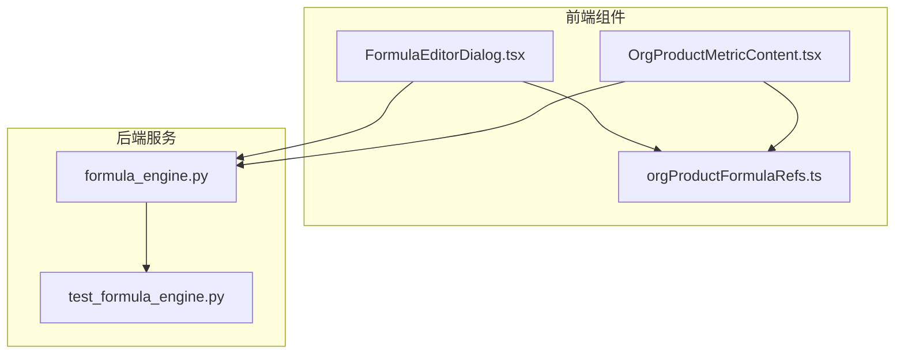
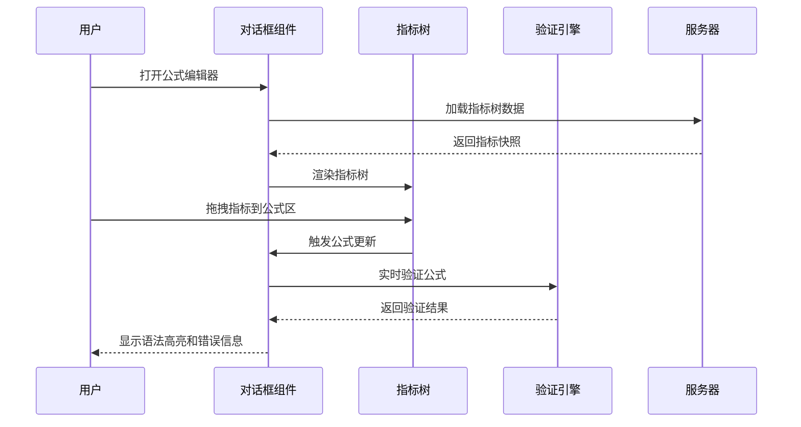
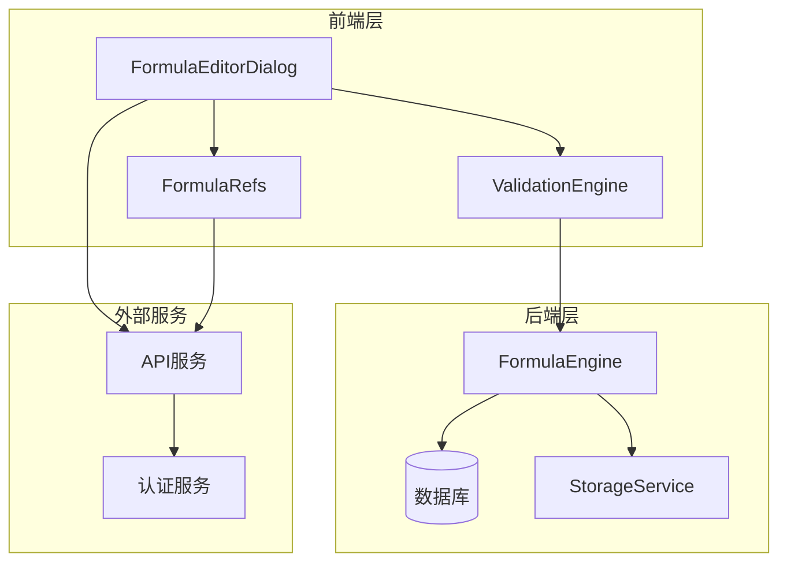
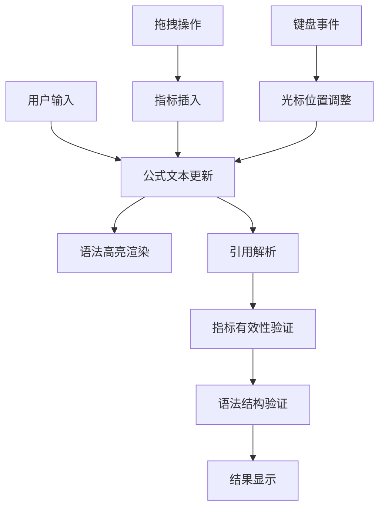
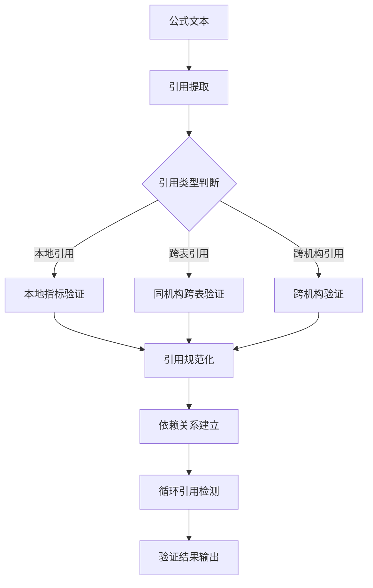
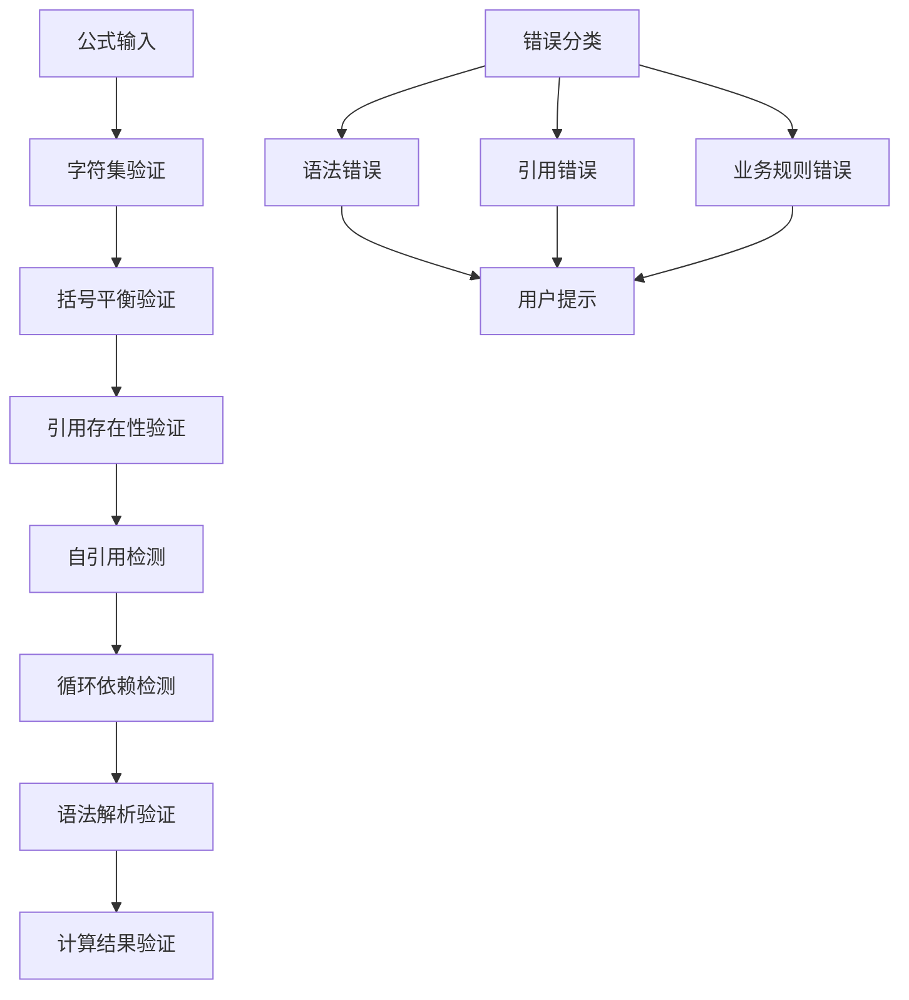
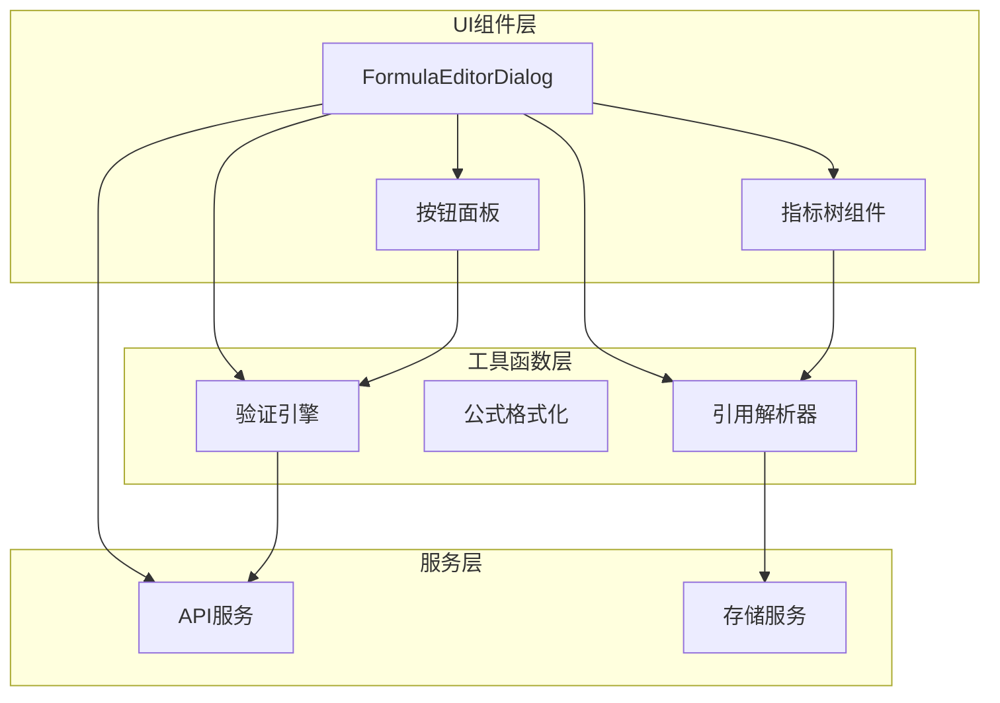
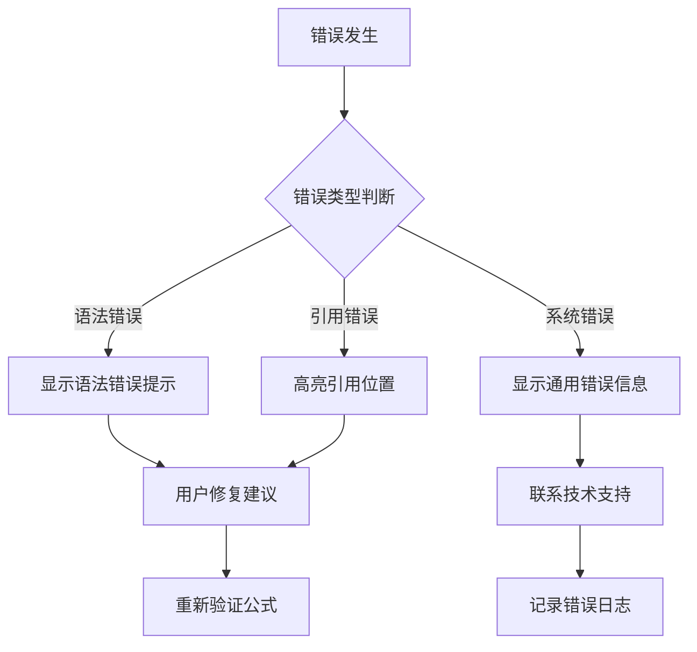

# 公式编辑器对话框

<cite>
**本文档引用的文件**
- [FormulaEditorDialog.tsx](file://apps/web/src/app/components/FormulaEditorDialog.tsx)
- [orgProductFormulaRefs.ts](file://apps/web/src/app/orgProductFormulaRefs.ts)
- [OrgProductMetricContent.tsx](file://apps/web/src/app/components/OrgProductMetricContent.tsx)
- [formula_engine.py](file://apps/api/app/services/formula_engine.py)
- [test_formula_engine.py](file://apps/api/test_formula_engine.py)
</cite>

## 目录
1. [简介](#简介)
2. [项目结构](#项目结构)
3. [核心组件](#核心组件)
4. [架构概览](#架构概览)
5. [详细组件分析](#详细组件分析)
6. [依赖分析](#依赖分析)
7. [性能考虑](#性能考虑)
8. [故障排除指南](#故障排除指南)
9. [结论](#结论)
10. [附录](#附录)

## 简介
公式编辑器对话框是一个专为预算预测驱动因素模块设计的可视化公式构建工具，支持拖拽式指标引用、语法高亮、实时验证和自动完成功能。该组件提供了完整的公式编辑体验，包括公式语法检查、指标引用验证、自动完成功能和错误提示。

## 项目结构
公式编辑器对话框位于前端Web应用的组件目录中，采用React Hooks模式实现，结合后端公式引擎服务提供完整的公式处理能力。

**图表来源**
- [FormulaEditorDialog.tsx:1-1471](file://apps/web/src/app/components/FormulaEditorDialog.tsx#L1-L1471)
- [orgProductFormulaRefs.ts:1-344](file://apps/web/src/app/orgProductFormulaRefs.ts#L1-L344)
- [formula_engine.py:1-148](file://apps/api/app/services/formula_engine.py#L1-L148)

**章节来源**
- [FormulaEditorDialog.tsx:1-1471](file://apps/web/src/app/components/FormulaEditorDialog.tsx#L1-L1471)
- [orgProductFormulaRefs.ts:1-344](file://apps/web/src/app/orgProductFormulaRefs.ts#L1-L344)

## 核心组件
公式编辑器对话框由多个核心组件构成，每个组件负责特定的功能领域：

### 主要组件架构
- **FormulaEditorDialog**: 主对话框组件，提供完整的公式编辑界面
- **指标树组件**: 提供拖拽式指标选择和浏览功能
- **公式验证引擎**: 实现公式语法和语义验证
- **引用解析器**: 处理跨表和跨机构指标引用
- **语法高亮渲染器**: 提供实时语法高亮显示

### 组件交互流程

**图表来源**
- [FormulaEditorDialog.tsx:350-394](file://apps/web/src/app/components/FormulaEditorDialog.tsx#L350-L394)
- [FormulaEditorDialog.tsx:803-848](file://apps/web/src/app/components/FormulaEditorDialog.tsx#L803-L848)

**章节来源**
- [FormulaEditorDialog.tsx:194-235](file://apps/web/src/app/components/FormulaEditorDialog.tsx#L194-L235)
- [FormulaEditorDialog.tsx:1062-1126](file://apps/web/src/app/components/FormulaEditorDialog.tsx#L1062-L1126)

## 架构概览
公式编辑器采用前后端分离架构，前端负责用户界面和实时验证，后端提供公式计算和存储支持。

**图表来源**
- [FormulaEditorDialog.tsx:1-10](file://apps/web/src/app/components/FormulaEditorDialog.tsx#L1-L10)
- [formula_engine.py:1-148](file://apps/api/app/services/formula_engine.py#L1-L148)

## 详细组件分析

### 公式编辑器对话框组件
主对话框组件实现了完整的公式编辑功能，包括拖拽、键盘导航和实时验证。

#### 核心功能特性
- **拖拽式指标选择**: 支持从指标树拖拽到公式编辑区
- **键盘导航**: 完整的键盘快捷键支持
- **实时语法高亮**: 即时显示公式语法结构
- **智能验证**: 编辑过程中的实时错误检测

#### 数据流分析

**图表来源**
- [FormulaEditorDialog.tsx:1265-1301](file://apps/web/src/app/components/FormulaEditorDialog.tsx#L1265-L1301)
- [FormulaEditorDialog.tsx:952-1029](file://apps/web/src/app/components/FormulaEditorDialog.tsx#L952-L1029)

**章节来源**
- [FormulaEditorDialog.tsx:678-701](file://apps/web/src/app/components/FormulaEditorDialog.tsx#L678-L701)
- [FormulaEditorDialog.tsx:877-940](file://apps/web/src/app/components/FormulaEditorDialog.tsx#L877-L940)

### 指标引用解析器
引用解析器负责处理不同类型的指标引用格式，支持本地、跨表和跨机构引用。

#### 引用类型支持
- **本地引用**: `<代码 名称>` 格式
- **跨表引用**: `表名/代码` 格式  
- **跨机构引用**: `机构/表名/代码` 格式

#### 解析算法流程

**图表来源**
- [orgProductFormulaRefs.ts:27-70](file://apps/web/src/app/orgProductFormulaRefs.ts#L27-L70)
- [orgProductFormulaRefs.ts:238-308](file://apps/web/src/app/orgProductFormulaRefs.ts#L238-L308)

**章节来源**
- [orgProductFormulaRefs.ts:8-11](file://apps/web/src/app/orgProductFormulaRefs.ts#L8-L11)
- [orgProductFormulaRefs.ts:238-308](file://apps/web/src/app/orgProductFormulaRefs.ts#L238-L308)

### 公式验证引擎
验证引擎实现了多层次的公式验证机制，确保公式的语法正确性和语义完整性。

#### 验证层次结构

**图表来源**
- [FormulaEditorDialog.tsx:803-848](file://apps/web/src/app/components/FormulaEditorDialog.tsx#L803-L848)
- [orgProductFormulaRefs.ts:252-308](file://apps/web/src/app/orgProductFormulaRefs.ts#L252-L308)

**章节来源**
- [FormulaEditorDialog.tsx:803-848](file://apps/web/src/app/components/FormulaEditorDialog.tsx#L803-L848)
- [orgProductFormulaRefs.ts:252-308](file://apps/web/src/app/orgProductFormulaRefs.ts#L252-L308)

### 语法高亮渲染器
语法高亮渲染器提供了实时的公式语法高亮显示，提升用户体验。

#### 高亮规则
- **指标引用**: 紫红色显示 `<代码 名称>`
- **数字**: 蓝色显示，支持小数点
- **运算符**: 绿色显示，包括 `+`, `-`, `*`, `/`, `=`, `<`, `>`
- **函数**: 绿色显示，如 `SUM`, `AVG`, `MAX`, `MIN`

**章节来源**
- [FormulaEditorDialog.tsx:952-1029](file://apps/web/src/app/components/FormulaEditorDialog.tsx#L952-L1029)

## 依赖分析

### 组件间依赖关系

**图表来源**
- [FormulaEditorDialog.tsx:1-10](file://apps/web/src/app/components/FormulaEditorDialog.tsx#L1-L10)
- [orgProductFormulaRefs.ts:1-344](file://apps/web/src/app/orgProductFormulaRefs.ts#L1-L344)

### 外部依赖
- **React Hooks**: 状态管理和生命周期控制
- **Lucide React**: 图标组件库
- **API客户端**: 与后端服务通信
- **样式系统**: Tailwind CSS

**章节来源**
- [FormulaEditorDialog.tsx:1-6](file://apps/web/src/app/components/FormulaEditorDialog.tsx#L1-L6)

## 性能考虑
公式编辑器在设计时充分考虑了性能优化：

### 渲染优化
- **虚拟滚动**: 指标树使用虚拟滚动技术处理大量数据
- **增量更新**: 仅更新变化的部分DOM元素
- **防抖处理**: 输入事件的防抖处理减少重绘频率

### 计算优化
- **懒加载**: 指标树数据按需加载
- **缓存机制**: 引用解析结果缓存
- **异步验证**: 验证操作异步执行避免阻塞UI

### 内存管理
- **垃圾回收**: 及时清理临时变量和事件监听器
- **内存泄漏防护**: 组件卸载时清理所有订阅

## 故障排除指南

### 常见问题诊断
1. **公式验证失败**
   - 检查引用的指标是否存在
   - 验证括号是否正确配对
   - 确认没有自引用或循环依赖

2. **指标树加载失败**
   - 检查网络连接状态
   - 验证API服务可用性
   - 查看浏览器开发者工具中的错误信息

3. **拖拽功能异常**
   - 确认浏览器支持HTML5拖拽API
   - 检查CSS样式冲突
   - 验证事件处理器绑定

### 错误处理机制

**图表来源**
- [FormulaEditorDialog.tsx:842-847](file://apps/web/src/app/components/FormulaEditorDialog.tsx#L842-L847)

**章节来源**
- [FormulaEditorDialog.tsx:842-858](file://apps/web/src/app/components/FormulaEditorDialog.tsx#L842-L858)

## 结论
公式编辑器对话框是一个功能完整、用户体验优秀的公式构建工具。它通过直观的拖拽界面、强大的验证机制和丰富的辅助功能，为用户提供了一个高效、可靠的公式编辑环境。组件设计遵循了现代前端开发的最佳实践，具有良好的可维护性和扩展性。

## 附录

### 使用示例
1. **基本公式编辑**
   - 打开公式编辑器对话框
   - 从指标树拖拽指标到公式区
   - 使用按钮面板添加运算符和函数
   - 实时查看语法高亮和验证结果

2. **高级功能使用**
   - 使用快捷键进行快速编辑
   - 利用自动完成功能提高效率
   - 通过右键菜单进行树操作
   - 使用测试功能验证公式正确性

### 最佳实践
1. **公式编写规范**
   - 使用清晰的指标命名
   - 合理使用括号组织运算顺序
   - 避免复杂的嵌套结构
   - 定期进行公式验证

2. **性能优化建议**
   - 控制公式复杂度
   - 合理使用函数调用
   - 避免不必要的重复引用
   - 定期清理历史版本

3. **用户体验优化**
   - 利用语法高亮提升可读性
   - 使用自动完成功能减少输入错误
   - 通过测试功能及时发现错误
   - 善用撤销/重做功能