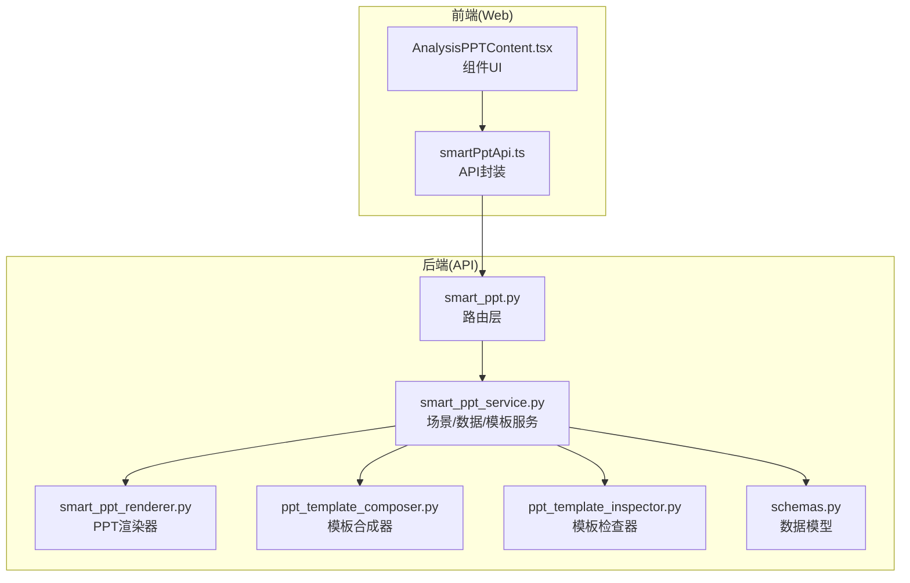
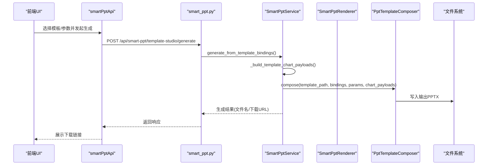
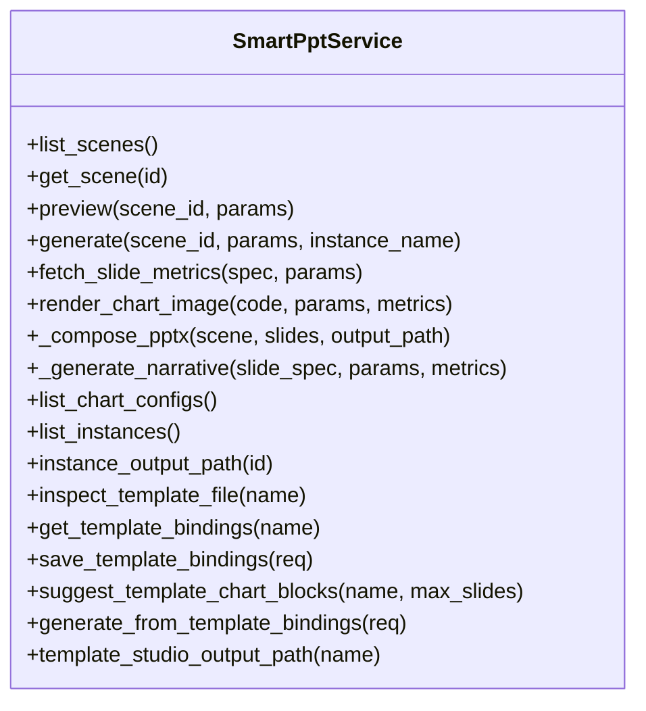
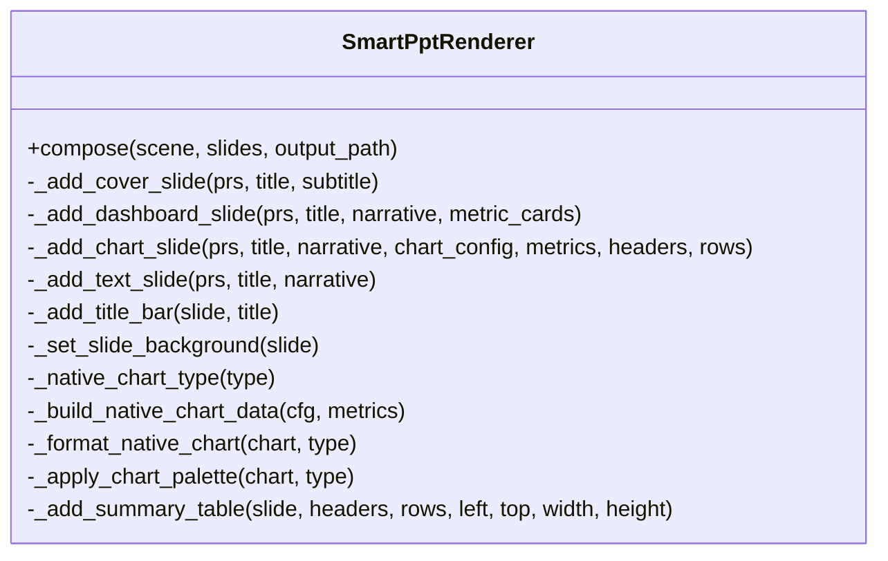
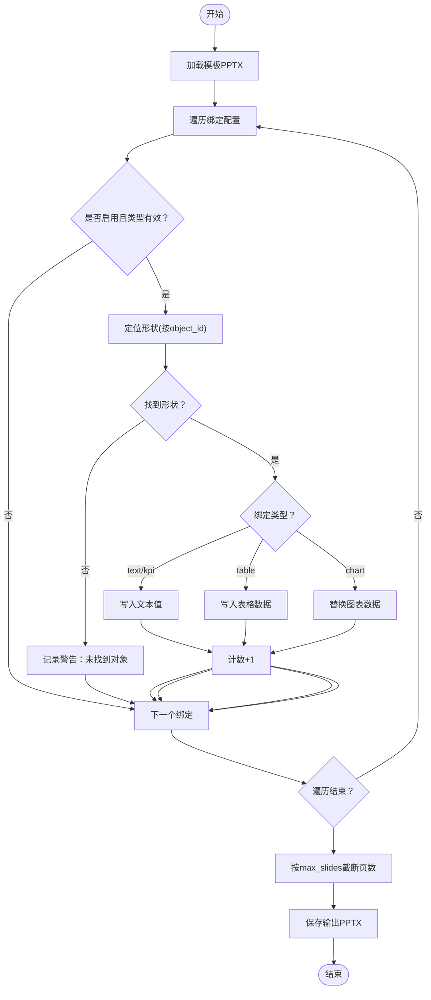
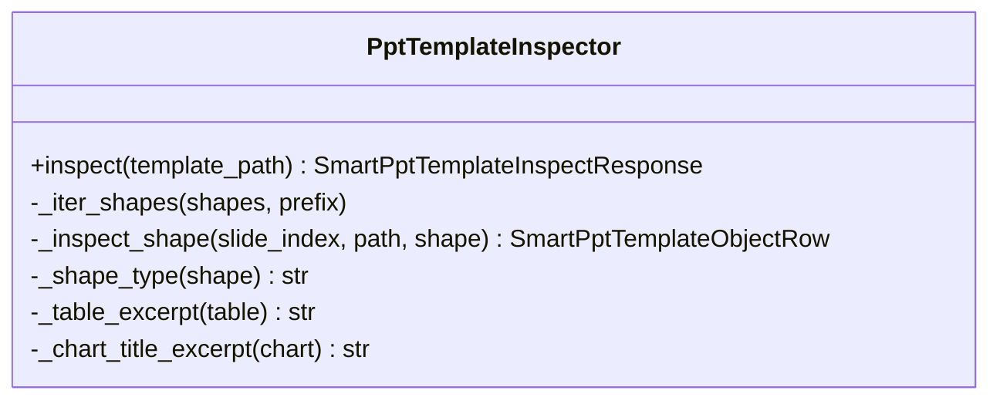
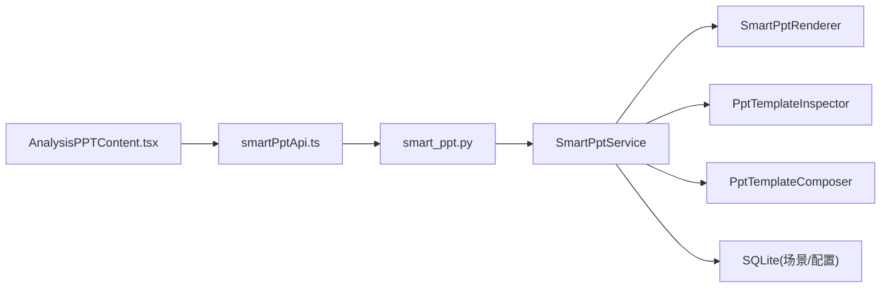

# 分析PPT内容组件

<cite>
**本文档引用的文件**
- [apps/api/app/routers/smart_ppt.py](file://apps/api/app/routers/smart_ppt.py)
- [apps/api/app/services/smart_ppt_service.py](file://apps/api/app/services/smart_ppt_service.py)
- [apps/api/app/services/smart_ppt_renderer.py](file://apps/api/app/services/smart_ppt_renderer.py)
- [apps/api/app/services/ppt_template_composer.py](file://apps/api/app/services/ppt_template_composer.py)
- [apps/api/app/services/ppt_template_inspector.py](file://apps/api/app/services/ppt_template_inspector.py)
- [apps/web/src/app/components/AnalysisPPTContent.tsx](file://apps/web/src/app/components/AnalysisPPTContent.tsx)
- [apps/web/src/lib/smartPptApi.ts](file://apps/web/src/lib/smartPptApi.ts)
- [apps/api/test_smart_ppt_service.py](file://apps/api/test_smart_ppt_service.py)
- [apps/api/app/schemas.py](file://apps/api/app/schemas.py)
</cite>

## 目录
1. [简介](#简介)
2. [项目结构](#项目结构)
3. [核心组件](#核心组件)
4. [架构总览](#架构总览)
5. [详细组件分析](#详细组件分析)
6. [依赖关系分析](#依赖关系分析)
7. [性能考虑](#性能考虑)
8. [故障排查指南](#故障排查指南)
9. [结论](#结论)
10. [附录](#附录)

## 简介
本文件面向“智能PPT报告生成功能”，系统性阐述分析PPT内容组件的设计与实现，涵盖场景驱动的内容编排、图表嵌入、模板工作台、样式定制、数据转换逻辑、PPT内容结构与幻灯片布局算法，并提供端到端使用示例与集成方式。该组件以 FastAPI 提供后端服务，React 前端负责交互与展示，通过统一的 API 协议完成从模板解析、变量绑定、图表生成到最终 PPT 输出的全流程。

## 项目结构
后端采用分层设计：
- 路由层：定义 REST 接口，暴露场景管理、PPT 生成、模板工作台等能力
- 服务层：核心业务逻辑，包括场景参数准备、数据取数、图表渲染、PPT 组装、模板解析与绑定
- 渲染层：基于 python-pptx 和 matplotlib 的可视化渲染器
- 前端：React 组件与 API 封装，提供模板解析、绑定配置、预览与下载功能

图示来源
- [apps/api/app/routers/smart_ppt.py:26-108](file://apps/api/app/routers/smart_ppt.py#L26-L108)
- [apps/api/app/services/smart_ppt_service.py:130-139](file://apps/api/app/services/smart_ppt_service.py#L130-L139)
- [apps/api/app/services/smart_ppt_renderer.py:21-60](file://apps/api/app/services/smart_ppt_renderer.py#L21-L60)
- [apps/api/app/services/ppt_template_composer.py:24-92](file://apps/api/app/services/ppt_template_composer.py#L24-L92)
- [apps/api/app/services/ppt_template_inspector.py:43-92](file://apps/api/app/services/ppt_template_inspector.py#L43-L92)
- [apps/web/src/lib/smartPptApi.ts:12-200](file://apps/web/src/lib/smartPptApi.ts#L12-L200)

章节来源
- [apps/api/app/routers/smart_ppt.py:26-108](file://apps/api/app/routers/smart_ppt.py#L26-L108)
- [apps/api/app/services/smart_ppt_service.py:130-139](file://apps/api/app/services/smart_ppt_service.py#L130-L139)
- [apps/web/src/app/components/AnalysisPPTContent.tsx:111-580](file://apps/web/src/app/components/AnalysisPPTContent.tsx#L111-L580)
- [apps/web/src/lib/smartPptApi.ts:12-200](file://apps/web/src/lib/smartPptApi.ts#L12-L200)

## 核心组件
- 场景驱动服务：负责场景参数合并、幻灯片规格解析、数据取数、AI 叙述生成、PPT 组装
- 渲染器：将语义化数据渲染为 PPTX，支持封面、仪表盘、图表与文本页，内置配色与排版
- 模板合成器：在保留模板样式的前提下，对文本、表格、图表进行绑定更新
- 模板检查器：解析 PPTX 结构，提取页面、对象、图表类型等信息，用于工作台绑定
- 路由与接口：提供场景查询、PPT 生成、模板解析、绑定保存、模板生成等 API
- 前端组件：模板解析、绑定配置、预览、下载与批量生成

章节来源
- [apps/api/app/services/smart_ppt_service.py:130-139](file://apps/api/app/services/smart_ppt_service.py#L130-L139)
- [apps/api/app/services/smart_ppt_renderer.py:21-60](file://apps/api/app/services/smart_ppt_renderer.py#L21-L60)
- [apps/api/app/services/ppt_template_composer.py:24-92](file://apps/api/app/services/ppt_template_composer.py#L24-L92)
- [apps/api/app/services/ppt_template_inspector.py:43-92](file://apps/api/app/services/ppt_template_inspector.py#L43-L92)
- [apps/api/app/routers/smart_ppt.py:26-108](file://apps/api/app/routers/smart_ppt.py#L26-L108)
- [apps/web/src/app/components/AnalysisPPTContent.tsx:111-580](file://apps/web/src/app/components/AnalysisPPTContent.tsx#L111-L580)

## 架构总览
整体流程分为“场景模式”和“模板工作台模式”两大路径：
- 场景模式：根据场景定义的幻灯片模板与图表配置，动态取数并生成 PPT
- 模板工作台模式：解析模板结构，生成绑定草案，保存绑定配置，按参数生成 PPT

图示来源
- [apps/api/app/routers/smart_ppt.py:88-91](file://apps/api/app/routers/smart_ppt.py#L88-L91)
- [apps/api/app/services/smart_ppt_service.py:1129-1156](file://apps/api/app/services/smart_ppt_service.py#L1129-L1156)
- [apps/api/app/services/ppt_template_composer.py:27-92](file://apps/api/app/services/ppt_template_composer.py#L27-L92)

章节来源
- [apps/api/app/routers/smart_ppt.py:26-108](file://apps/api/app/routers/smart_ppt.py#L26-L108)
- [apps/api/app/services/smart_ppt_service.py:1129-1156](file://apps/api/app/services/smart_ppt_service.py#L1129-L1156)
- [apps/api/app/services/ppt_template_composer.py:27-92](file://apps/api/app/services/ppt_template_composer.py#L27-L92)

## 详细组件分析

### 场景驱动服务（SmartPptService）
职责与流程：
- 场景管理：列出场景、获取场景详情、默认参数与模板
- 参数准备：合并默认参数与用户覆盖参数，推导季度/起止月份/月标签等
- 数据取数：按图表类型与分组维度聚合预算/实际数据，支持同比/预算完成率等派生指标
- 图表渲染：调用 Matplotlib 生成图表图像（用于预览或嵌入）
- PPT 组装：调用渲染器将语义化数据写入 PPTX
- AI 叙述：根据场景类型与指标生成自然语言叙述
- 实例管理：记录生成状态、输出路径、错误信息

图示来源
- [apps/api/app/services/smart_ppt_service.py:130-139](file://apps/api/app/services/smart_ppt_service.py#L130-L139)
- [apps/api/app/services/smart_ppt_service.py:214-289](file://apps/api/app/services/smart_ppt_service.py#L214-L289)
- [apps/api/app/services/smart_ppt_service.py:351-704](file://apps/api/app/services/smart_ppt_service.py#L351-L704)
- [apps/api/app/services/smart_ppt_service.py:868-926](file://apps/api/app/services/smart_ppt_service.py#L868-L926)
- [apps/api/app/services/smart_ppt_service.py:929-980](file://apps/api/app/services/smart_ppt_service.py#L929-L980)
- [apps/api/app/services/smart_ppt_service.py:993-1033](file://apps/api/app/services/smart_ppt_service.py#L993-L1033)
- [apps/api/app/services/smart_ppt_service.py:1075-1156](file://apps/api/app/services/smart_ppt_service.py#L1075-L1156)

章节来源
- [apps/api/app/services/smart_ppt_service.py:142-188](file://apps/api/app/services/smart_ppt_service.py#L142-L188)
- [apps/api/app/services/smart_ppt_service.py:214-289](file://apps/api/app/services/smart_ppt_service.py#L214-L289)
- [apps/api/app/services/smart_ppt_service.py:351-704](file://apps/api/app/services/smart_ppt_service.py#L351-L704)
- [apps/api/app/services/smart_ppt_service.py:868-926](file://apps/api/app/services/smart_ppt_service.py#L868-L926)
- [apps/api/app/services/smart_ppt_service.py:929-980](file://apps/api/app/services/smart_ppt_service.py#L929-L980)
- [apps/api/app/services/smart_ppt_service.py:993-1033](file://apps/api/app/services/smart_ppt_service.py#L993-L1033)
- [apps/api/app/services/smart_ppt_service.py:1075-1156](file://apps/api/app/services/smart_ppt_service.py#L1075-L1156)

### 渲染器（SmartPptRenderer）
职责与特性：
- 支持封面、仪表盘、图表与文本页四种布局
- 使用 python-pptx 创建幻灯片，设置背景、标题栏、边距与字体
- 将语义化指标数据映射为原生图表数据，自动适配系列数量与标签长度
- 应用统一配色方案与图例位置，设置网格线与坐标轴样式
- 生成摘要表格，按列宽自适应分配

图示来源
- [apps/api/app/services/smart_ppt_renderer.py:21-60](file://apps/api/app/services/smart_ppt_renderer.py#L21-L60)
- [apps/api/app/services/smart_ppt_renderer.py:162-196](file://apps/api/app/services/smart_ppt_renderer.py#L162-L196)
- [apps/api/app/services/smart_ppt_renderer.py:206-245](file://apps/api/app/services/smart_ppt_renderer.py#L206-L245)
- [apps/api/app/services/smart_ppt_renderer.py:247-340](file://apps/api/app/services/smart_ppt_renderer.py#L247-L340)

章节来源
- [apps/api/app/services/smart_ppt_renderer.py:21-60](file://apps/api/app/services/smart_ppt_renderer.py#L21-L60)
- [apps/api/app/services/smart_ppt_renderer.py:162-196](file://apps/api/app/services/smart_ppt_renderer.py#L162-L196)
- [apps/api/app/services/smart_ppt_renderer.py:206-245](file://apps/api/app/services/smart_ppt_renderer.py#L206-L245)
- [apps/api/app/services/smart_ppt_renderer.py:247-340](file://apps/api/app/services/smart_ppt_renderer.py#L247-L340)

### 模板合成器（PptTemplateComposer）
职责与特性：
- 在保留模板样式的前提下，对文本、表格、图表对象进行绑定更新
- 支持按 object_id 定位形状，支持分组形状遍历
- 文本绑定：将 params 中的值写入文本框
- 表格绑定：支持传入 headers/rows 或一维数组
- 图表绑定：将 series 名称与数值替换为动态数据
- 截断多余页数，确保输出 PPT 符合最大页数限制

图示来源
- [apps/api/app/services/ppt_template_composer.py:27-92](file://apps/api/app/services/ppt_template_composer.py#L27-L92)
- [apps/api/app/services/ppt_template_composer.py:94-107](file://apps/api/app/services/ppt_template_composer.py#L94-L107)
- [apps/api/app/services/ppt_template_composer.py:126-144](file://apps/api/app/services/ppt_template_composer.py#L126-L144)
- [apps/api/app/services/ppt_template_composer.py:145-174](file://apps/api/app/services/ppt_template_composer.py#L145-L174)
- [apps/api/app/services/ppt_template_composer.py:175-203](file://apps/api/app/services/ppt_template_composer.py#L175-L203)

章节来源
- [apps/api/app/services/ppt_template_composer.py:24-92](file://apps/api/app/services/ppt_template_composer.py#L24-L92)
- [apps/api/app/services/ppt_template_composer.py:94-107](file://apps/api/app/services/ppt_template_composer.py#L94-L107)
- [apps/api/app/services/ppt_template_composer.py:126-144](file://apps/api/app/services/ppt_template_composer.py#L126-L144)
- [apps/api/app/services/ppt_template_composer.py:145-174](file://apps/api/app/services/ppt_template_composer.py#L145-L174)
- [apps/api/app/services/ppt_template_composer.py:175-203](file://apps/api/app/services/ppt_template_composer.py#L175-L203)

### 模板检查器（PptTemplateInspector）
职责与特性：
- 解析 PPTX 页面与形状，统计各类对象数量
- 提取文本摘录、表格行列数、图表类型等元信息
- 生成稳定、友好的模板结构报告，便于工作台绑定

图示来源
- [apps/api/app/services/ppt_template_inspector.py:43-92](file://apps/api/app/services/ppt_template_inspector.py#L43-L92)
- [apps/api/app/services/ppt_template_inspector.py:94-132](file://apps/api/app/services/ppt_template_inspector.py#L94-L132)
- [apps/api/app/services/ppt_template_inspector.py:134-163](file://apps/api/app/services/ppt_template_inspector.py#L134-L163)

章节来源
- [apps/api/app/services/ppt_template_inspector.py:43-92](file://apps/api/app/services/ppt_template_inspector.py#L43-L92)
- [apps/api/app/services/ppt_template_inspector.py:94-132](file://apps/api/app/services/ppt_template_inspector.py#L94-L132)
- [apps/api/app/services/ppt_template_inspector.py:134-163](file://apps/api/app/services/ppt_template_inspector.py#L134-L163)

### 路由与接口（smart_ppt.py）
职责与特性：
- 场景管理：列出场景、实例列表；下载实例文件
- PPT 生成：预览场景、生成 PPT
- 模板工作台：解析模板、获取绑定、建议图表区块、保存绑定、从绑定生成 PPT
- 图表规则：列出可用图表配置

章节来源
- [apps/api/app/routers/smart_ppt.py:26-108](file://apps/api/app/routers/smart_ppt.py#L26-L108)

### 前端组件与API（AnalysisPPTContent.tsx / smartPptApi.ts）
职责与特性：
- 前端组件：模板列表、变量解析、参数输入、场景预览、模板解析与绑定、生成与下载
- API 封装：统一的请求方法、响应类型定义、下载工具函数
- 绑定工作流：解析模板 → 生成绑定草案 → 保存绑定 → 生成模板PPT → 下载

章节来源
- [apps/web/src/app/components/AnalysisPPTContent.tsx:111-580](file://apps/web/src/app/components/AnalysisPPTContent.tsx#L111-L580)
- [apps/web/src/lib/smartPptApi.ts:12-200](file://apps/web/src/lib/smartPptApi.ts#L12-L200)

## 依赖关系分析
- 组件耦合
  - SmartPptService 依赖 SmartPptRenderer、PptTemplateInspector、PptTemplateComposer 以及数据库中的场景与图表配置
  - 前端通过 smartPptApi.ts 与后端路由通信，避免直接依赖具体实现
- 外部依赖
  - python-pptx：PPTX 操作
  - aiosqlite/matplotlib：异步数据库访问与图表渲染
  - FastAPI：路由与响应模型

图示来源
- [apps/api/app/services/smart_ppt_service.py:130-139](file://apps/api/app/services/smart_ppt_service.py#L130-L139)
- [apps/api/app/routers/smart_ppt.py:26-108](file://apps/api/app/routers/smart_ppt.py#L26-L108)
- [apps/web/src/lib/smartPptApi.ts:12-200](file://apps/web/src/lib/smartPptApi.ts#L12-L200)

章节来源
- [apps/api/app/services/smart_ppt_service.py:130-139](file://apps/api/app/services/smart_ppt_service.py#L130-L139)
- [apps/api/app/routers/smart_ppt.py:26-108](file://apps/api/app/routers/smart_ppt.py#L26-L108)
- [apps/web/src/lib/smartPptApi.ts:12-200](file://apps/web/src/lib/smartPptApi.ts#L12-L200)

## 性能考虑
- 数据取数优化
  - 使用分组聚合与索引字段过滤，减少扫描范围
  - 对空值与零值进行裁剪，避免冗余序列
- 图表渲染
  - 使用 Agg 后端与固定 DPI，平衡清晰度与内存占用
  - 预算/实际系列按需添加，避免空系列导致的渲染开销
- 模板合成
  - 仅对启用的绑定进行处理，跳过无效对象
  - 截断页数时采用底层关系删除，避免不必要的复制
- 批量生成
  - 建议前端按需生成，后端限制最大页数，防止资源耗尽
  - 对模板绑定进行校验，提前发现不合法引用，降低运行时失败概率

## 故障排查指南
常见问题与处理：
- 模板文件名不合法或缺失
  - 触发条件：文件名为空、包含路径分隔符、非 .pptx 扩展名
  - 处理建议：检查文件名规范化与路径查找逻辑
- 绑定配置校验失败
  - 触发条件：机构产品指标引用与编码不匹配或未在主表确认
  - 处理建议：核对 org_product_metric_ref 与 org_product_data_acct_code 的一致性
- 图表配置缺失或不支持
  - 触发条件：图表类型不在支持集合内或未找到配置
  - 处理建议：切换到受支持类型或补充配置
- 数据库连接异常
  - 触发条件：预算数据库不存在或查询失败
  - 处理建议：确认数据库路径与年份参数，检查权限

章节来源
- [apps/api/app/services/smart_ppt_service.py:1035-1074](file://apps/api/app/services/smart_ppt_service.py#L1035-L1074)
- [apps/api/app/services/smart_ppt_service.py:1231-1237](file://apps/api/app/services/smart_ppt_service.py#L1231-L1237)
- [apps/api/app/services/smart_ppt_service.py:1239-1249](file://apps/api/app/services/smart_ppt_service.py#L1239-L1249)
- [apps/api/test_smart_ppt_service.py:34-53](file://apps/api/test_smart_ppt_service.py#L34-L53)
- [apps/api/test_smart_ppt_service.py:93-141](file://apps/api/test_smart_ppt_service.py#L93-L141)

## 结论
该分析PPT内容组件通过“场景驱动 + 模板工作台”的双轨模式，实现了从数据取数、图表生成到 PPT 组装的完整闭环。其核心优势在于：
- 统一的数据取数与派生指标计算，保证报告一致性
- 可扩展的图表与样式渲染，满足多场景视觉需求
- 模板工作台的结构化绑定，降低人工维护成本
- 前后端清晰的职责划分与接口契约，便于集成与扩展

## 附录

### 使用示例与代码片段路径
- 场景模式：生成 PPT
  - 路由：POST /api/smart-ppt/generate
  - 服务：generate(scene_id, params, instance_name)
  - 前端：generateSmartPptScene(...)
  - 代码片段路径
    - [apps/api/app/routers/smart_ppt.py:40-46](file://apps/api/app/routers/smart_ppt.py#L40-L46)
    - [apps/api/app/services/smart_ppt_service.py:223-289](file://apps/api/app/services/smart_ppt_service.py#L223-L289)
    - [apps/web/src/lib/smartPptApi.ts:62-75](file://apps/web/src/lib/smartPptApi.ts#L62-L75)
    - [apps/web/src/app/components/AnalysisPPTContent.tsx:396-419](file://apps/web/src/app/components/AnalysisPPTContent.tsx#L396-L419)

- 模板工作台：解析模板并生成 PPT
  - 路由：GET /api/smart-ppt/template-studio/inspect
  - 服务：inspect_template_file(template_file_name)
  - 路由：PUT /api/smart-ppt/template-studio/bindings
  - 服务：save_template_bindings(request)
  - 路由：POST /api/smart-ppt/template-studio/generate
  - 服务：generate_from_template_bindings(request)
  - 代码片段路径
    - [apps/api/app/routers/smart_ppt.py:69-91](file://apps/api/app/routers/smart_ppt.py#L69-L91)
    - [apps/api/app/services/smart_ppt_service.py:993-1033](file://apps/api/app/services/smart_ppt_service.py#L993-L1033)
    - [apps/api/app/services/smart_ppt_service.py:1015-1033](file://apps/api/app/services/smart_ppt_service.py#L1015-L1033)
    - [apps/api/app/services/smart_ppt_service.py:1129-1156](file://apps/api/app/services/smart_ppt_service.py#L1129-L1156)

- 模板对象解析与绑定建议
  - 服务：suggest_template_chart_blocks(template_file_name, max_slides)
  - 服务：_nearest_title_for_chart(objects, chart)
  - 代码片段路径
    - [apps/api/app/services/smart_ppt_service.py:1075-1127](file://apps/api/app/services/smart_ppt_service.py#L1075-L1127)
    - [apps/api/app/services/smart_ppt_service.py:1262-1286](file://apps/api/app/services/smart_ppt_service.py#L1262-L1286)

- 数据取数与派生指标
  - 服务：fetch_slide_metrics(slide_spec, params)
  - 服务：_sum_metric_value / _group_metric_values
  - 服务：_budget_summary_where
  - 代码片段路径
    - [apps/api/app/services/smart_ppt_service.py:351-704](file://apps/api/app/services/smart_ppt_service.py#L351-L704)
    - [apps/api/app/services/smart_ppt_service.py:642-704](file://apps/api/app/services/smart_ppt_service.py#L642-L704)
    - [apps/api/app/services/smart_ppt_service.py:706-763](file://apps/api/app/services/smart_ppt_service.py#L706-L763)

- 图表渲染与样式
  - 服务：render_chart_image(config_code, params, metrics)
  - 渲染器：_build_native_chart_data / _format_native_chart
  - 代码片段路径
    - [apps/api/app/services/smart_ppt_service.py:767-861](file://apps/api/app/services/smart_ppt_service.py#L767-L861)
    - [apps/api/app/services/smart_ppt_renderer.py:206-245](file://apps/api/app/services/smart_ppt_renderer.py#L206-L245)
    - [apps/api/app/services/smart_ppt_renderer.py:247-282](file://apps/api/app/services/smart_ppt_renderer.py#L247-L282)

- 实例管理与下载
  - 路由：GET /api/smart-ppt/instances/{instance_id}/download
  - 服务：instance_output_path(instance_id)
  - 代码片段路径
    - [apps/api/app/routers/smart_ppt.py:58-65](file://apps/api/app/routers/smart_ppt.py#L58-L65)
    - [apps/api/app/services/smart_ppt_service.py:982-991](file://apps/api/app/services/smart_ppt_service.py#L982-L991)

### 数据模型与字段说明
- 场景与图表配置
  - SmartPptSceneRow：场景定义、默认参数、幻灯片模板
  - SmartPptChartConfigRow：图表类型、指标配置、视觉配置
- 模板绑定与对象
  - SmartPptTemplateBindingConfigRow：绑定类型、目标键、图表配置代码、指标引用
  - SmartPptTemplateObjectRow：对象类型、文本摘录、图表类型、尺寸位置
- 响应与请求
  - SmartPptGenerateRequest/Response：生成请求与响应
  - SmartPptTemplateInspectResponse：模板结构报告
  - SmartPptTemplateChartBlockResponse：图表区块建议

章节来源
- [apps/api/app/schemas.py:1337-1390](file://apps/api/app/schemas.py#L1337-L1390)
- [apps/api/app/schemas.py:1351-1360](file://apps/api/app/schemas.py#L1351-L1360)
- [apps/api/app/schemas.py:1420-1446](file://apps/api/app/schemas.py#L1420-L1446)
- [apps/api/app/schemas.py:1464-1484](file://apps/api/app/schemas.py#L1464-L1484)
- [apps/api/app/schemas.py:1448-1462](file://apps/api/app/schemas.py#L1448-L1462)
- [apps/api/app/schemas.py:1505-1524](file://apps/api/app/schemas.py#L1505-L1524)