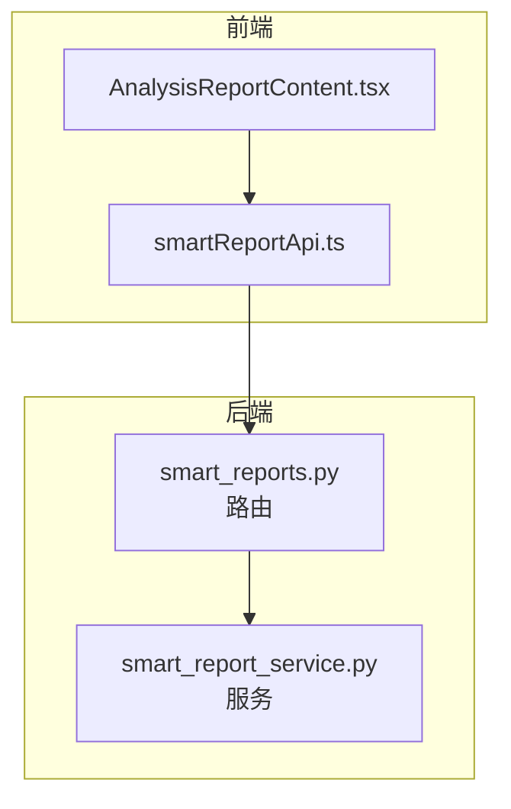
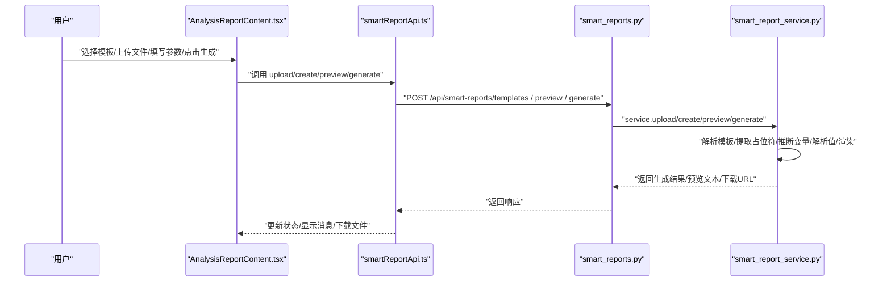
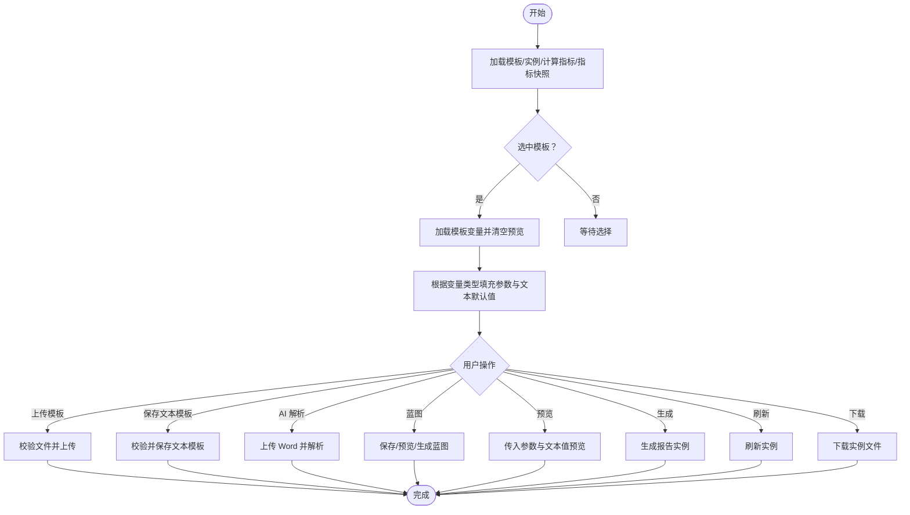
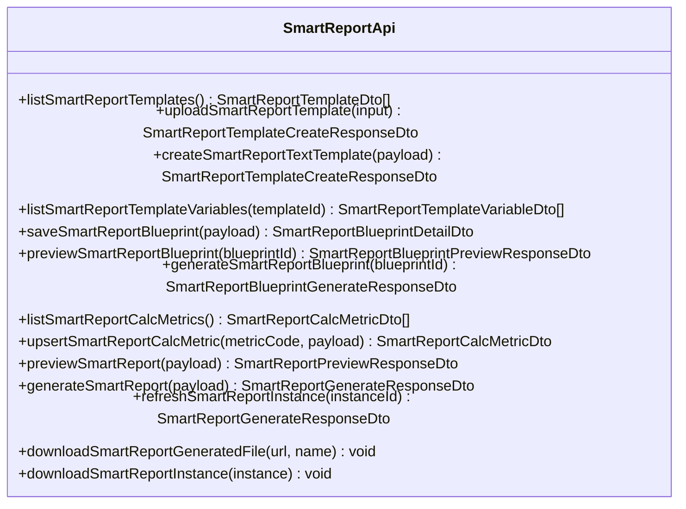
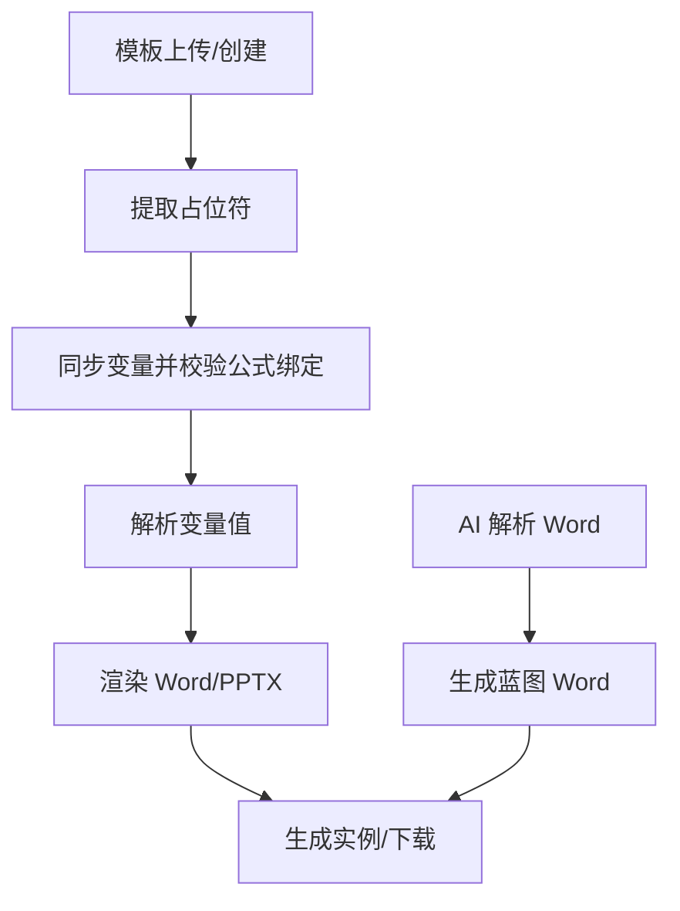
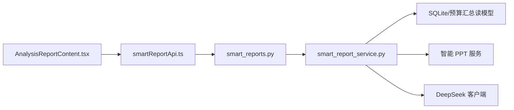
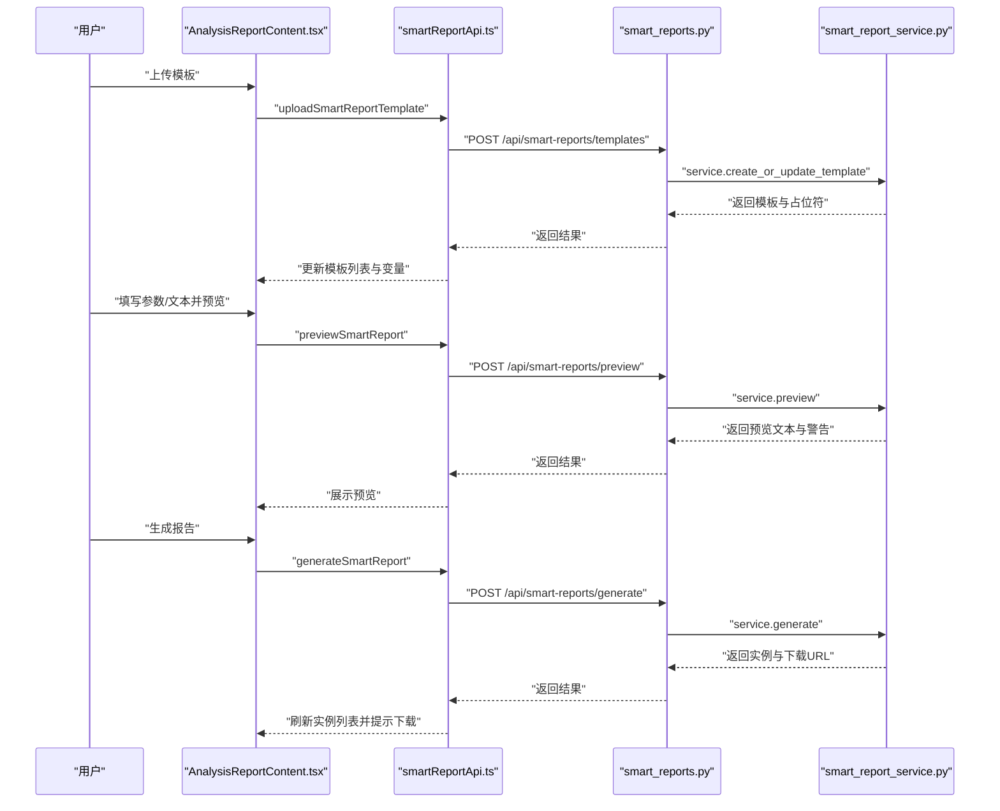

# 分析报告内容组件

<cite>
**本文档引用的文件**
- [AnalysisReportContent.tsx](file://apps/web/src/app/components/AnalysisReportContent.tsx)
- [smartReportApi.ts](file://apps/web/src/lib/smartReportApi.ts)
- [smart_report_service.py](file://apps/api/app/services/smart_report_service.py)
- [smart_reports.py](file://apps/api/app/routers/smart_reports.py)
- [test_smart_report_service_catalog.py](file://apps/api/test_smart_report_service_catalog.py)
</cite>

## 目录
1. [简介](#简介)
2. [项目结构](#项目结构)
3. [核心组件](#核心组件)
4. [架构总览](#架构总览)
5. [详细组件分析](#详细组件分析)
6. [依赖关系分析](#依赖关系分析)
7. [性能考虑](#性能考虑)
8. [故障排查指南](#故障排查指南)
9. [结论](#结论)
10. [附录](#附录)

## 简介
本文件面向“智能分析报告”前端组件与后端服务的完整实现，聚焦以下目标：
- 模板管理：支持上传 DOCX/PPTX 模板或手写文本模板，自动识别占位符并同步为模板变量。
- 变量绑定：通过前缀语法将占位符映射到指标、公式、计算指标、参数、文本、图表等类型。
- 参数配置与文本值设置：支持参数化渲染与文本替换，覆盖年、月、版本、口径等关键维度。
- 报告生成流程：预览、生成、实例刷新与下载，支持蓝图模式（AI 解析 Word 后生成 Word 蓝图）。
- 状态管理与数据加载：组件内状态、异步加载、错误提示与消息提示。
- 使用示例：从模板上传到最终报告生成的完整流程。
- 集成方式与错误处理：前端 API 封装、后端路由与服务层、错误处理策略与性能优化建议。

## 项目结构
前端组件位于 Web 应用中，后端服务位于 API 应用中，二者通过 REST 接口交互。核心文件如下：
- 前端组件：AnalysisReportContent.tsx（负责模板、变量、参数、文本、蓝图、生成与下载）
- 前端 API 封装：smartReportApi.ts（定义 DTO、请求方法与下载工具）
- 后端服务：smart_report_service.py（模板解析、变量推断、值解析、渲染、蓝图生成、AI 解析）
- 后端路由：smart_reports.py（暴露 /api/smart-reports 下的接口）
- 单元测试：test_smart_report_service_catalog.py（验证公式变量与计算指标约束）

**图表来源**
- [AnalysisReportContent.tsx:138-191](file://apps/web/src/app/components/AnalysisReportContent.tsx#L138-L191)
- [smartReportApi.ts:198-277](file://apps/web/src/lib/smartReportApi.ts#L198-L277)
- [smart_reports.py:32-221](file://apps/api/app/routers/smart_reports.py#L32-L221)
- [smart_report_service.py:121-1698](file://apps/api/app/services/smart_report_service.py#L121-L1698)

**章节来源**
- [AnalysisReportContent.tsx:138-191](file://apps/web/src/app/components/AnalysisReportContent.tsx#L138-L191)
- [smartReportApi.ts:198-277](file://apps/web/src/lib/smartReportApi.ts#L198-L277)
- [smart_reports.py:32-221](file://apps/api/app/routers/smart_reports.py#L32-L221)
- [smart_report_service.py:121-1698](file://apps/api/app/services/smart_report_service.py#L121-L1698)

## 核心组件
- 前端组件 AnalysisReportContent.tsx
  - 状态：模板列表、实例列表、变量列表、计算指标、指标快照、选中模板、搜索、模板输入模式、文件与文本模板内容、AI 报告文件、AI 解析结果、蓝图状态、参数与文本值、预览文本与警告、最后生成结果等。
  - 数据加载：并发加载模板、实例、计算指标与指标快照。
  - 用户交互：上传模板、保存文本模板、AI 解析 Word、保存蓝图、蓝图预览、蓝图生成、预览报告、生成报告、刷新实例、下载实例。
  - 变量与占位符：根据变量类型与绑定配置解析参数、指标、公式、计算指标、文本与图表占位符。
- 前端 API 封装 smartReportApi.ts
  - 定义模板、变量、计算指标、蓝图、实例、生成与预览等 DTO。
  - 提供 list、upload、create、preview、generate、refresh、download 等方法。
- 后端服务 smart_report_service.py
  - 模板管理：上传/创建模板、提取占位符、同步变量、校验公式绑定。
  - 变量解析：推断变量类型与绑定配置，解析参数、指标、公式、计算指标、文本与图表。
  - 渲染与生成：预览文本渲染、Word/PPTX 文本替换、图表占位符渲染为图片、生成实例与下载路径。
  - 蓝图与 AI：AI 解析 Word 结构、生成蓝图 Word、蓝图预览文本。
- 后端路由 smart_reports.py
  - 暴露模板、变量、计算指标、蓝图、生成、预览、实例、下载等接口。
- 单元测试 test_smart_report_service_catalog.py
  - 验证公式变量与计算指标需绑定已确认的机构及产品指标主表。

**章节来源**
- [AnalysisReportContent.tsx:138-191](file://apps/web/src/app/components/AnalysisReportContent.tsx#L138-L191)
- [smartReportApi.ts:7-176](file://apps/web/src/lib/smartReportApi.ts#L7-L176)
- [smart_report_service.py:121-1698](file://apps/api/app/services/smart_report_service.py#L121-L1698)
- [smart_reports.py:32-221](file://apps/api/app/routers/smart_reports.py#L32-L221)
- [test_smart_report_service_catalog.py:1-200](file://apps/api/test_smart_report_service_catalog.py#L1-L200)

## 架构总览
整体架构由前端组件驱动用户操作，调用前端 API 封装的方法，后端路由接收请求并委派给服务层，服务层完成模板解析、变量推断、值解析与渲染，最终生成 Word/PPTX 并提供下载。

**图表来源**
- [AnalysisReportContent.tsx:442-744](file://apps/web/src/app/components/AnalysisReportContent.tsx#L442-L744)
- [smartReportApi.ts:214-277](file://apps/web/src/lib/smartReportApi.ts#L214-L277)
- [smart_reports.py:92-221](file://apps/api/app/routers/smart_reports.py#L92-L221)
- [smart_report_service.py:1508-1698](file://apps/api/app/services/smart_report_service.py#L1508-L1698)

## 详细组件分析

### 组件：AnalysisReportContent.tsx
- 状态管理
  - 模板与实例：templates、instances、selectedTemplateId
  - 变量与计算指标：variables、calcMetrics
  - 指标树与候选：orgProductMetricSnapshot、metricTreeRoots、metricFormulaCandidates、selectedMetricNode、collapsedMetricNodes
  - 输入与交互：selectedFile、aiReportFile、templateInputMode、templateCode、templateName、templateContent、paramValues、textValues、previewText、previewWarnings、lastGenerated、aiInspection、savedBlueprint、blueprintPreviewText、blueprintGenerated
  - 加载与错误：loading、generating、previewing、refreshingInstanceId、error、message
- 数据加载机制
  - 首次加载：并发加载模板、实例、计算指标与指标快照。
  - 选中模板：加载该模板的变量并清空预览。
  - 参数与文本：根据变量类型动态填充默认值。
- 用户交互逻辑
  - 模板上传：校验文件、调用上传接口、提示占位符数量、刷新模板列表。
  - 文本模板保存：校验必填项、调用创建接口、提示占位符数量、刷新模板列表。
  - AI 解析：选择 Word 文件、调用 AI 解析接口、展示结构块与待确认项。
  - 蓝图：保存蓝图、蓝图预览、蓝图生成、下载。
  - 预览与生成：传入参数与文本值，生成预览文本与警告；生成报告实例并刷新实例列表。
  - 刷新与下载：刷新实例、下载实例文件。
- 变量与占位符处理
  - 变量分类：图表、参数、文本、指标。
  - 参数键与文本键：从 binding_config 或变量键推断。
  - 指标插入：支持直接插入公式占位符或插入计算指标占位符。
  - 计算指标：保存计算指标表达式与组件，插入到模板中。

**图表来源**
- [AnalysisReportContent.tsx:350-441](file://apps/web/src/app/components/AnalysisReportContent.tsx#L350-L441)
- [AnalysisReportContent.tsx:442-744](file://apps/web/src/app/components/AnalysisReportContent.tsx#L442-L744)

**章节来源**
- [AnalysisReportContent.tsx:138-191](file://apps/web/src/app/components/AnalysisReportContent.tsx#L138-L191)
- [AnalysisReportContent.tsx:350-441](file://apps/web/src/app/components/AnalysisReportContent.tsx#L350-L441)
- [AnalysisReportContent.tsx:442-744](file://apps/web/src/app/components/AnalysisReportContent.tsx#L442-L744)

### API 封装：smartReportApi.ts
- 类型定义
  - 变量类型枚举：metric/formula/calc/parameter/text/table/chart/analysis
  - 模板、变量、计算指标、蓝图、实例、生成与预览等 DTO
- 方法
  - 模板：list、upload、create text template、get variables
  - 蓝图：save、preview、generate
  - 计算指标：list、upsert
  - 预览与生成：preview、generate
  - 实例：list、refresh、download
  - 下载：download file、download instance

**图表来源**
- [smartReportApi.ts:198-277](file://apps/web/src/lib/smartReportApi.ts#L198-L277)

**章节来源**
- [smartReportApi.ts:7-176](file://apps/web/src/lib/smartReportApi.ts#L7-L176)
- [smartReportApi.ts:198-277](file://apps/web/src/lib/smartReportApi.ts#L198-L277)

### 服务层：smart_report_service.py
- 模板管理
  - 上传/创建模板：校验文件类型、保存模板、提取占位符、同步变量、校验公式绑定。
  - 文本模板：写入 Word 并提取占位符。
- 变量绑定与解析
  - 推断变量类型与绑定配置：基于前缀（metric/formula/calc/param/text/table/chart/analysis）。
  - 解析值：参数、指标、公式、计算指标、文本、图表占位符。
  - 公式解析：根据预算/实际选择公式文本。
  - 计算指标：安全表达式求值（仅允许基础指标别名与 + - * / ( ) 运算）。
- 渲染与生成
  - 预览文本：遍历段落与表格，替换占位符。
  - Word/PPTX 渲染：替换文本、处理图表占位符为图片、保存输出。
  - 图表缓存：生成 PNG 并缓存，避免重复渲染。
- 蓝图与 AI
  - AI 解析：提取 Word 文本、调用大模型解析、兜底规则解析。
  - 蓝图生成：生成 Word 蓝图与预览文本。
- 错误处理
  - HTTP 异常：参数校验、文件存在性、公式绑定校验、表达式合法性、图表服务初始化等。
  - 降级策略：AI 未返回时使用规则兜底解析。

**图表来源**
- [smart_report_service.py:860-924](file://apps/api/app/services/smart_report_service.py#L860-L924)
- [smart_report_service.py:997-1031](file://apps/api/app/services/smart_report_service.py#L997-L1031)
- [smart_report_service.py:1508-1698](file://apps/api/app/services/smart_report_service.py#L1508-L1698)

**章节来源**
- [smart_report_service.py:121-1698](file://apps/api/app/services/smart_report_service.py#L121-L1698)

### 路由层：smart_reports.py
- 模板：GET/POST/PUT 变量、GET 变量列表、POST 上传/创建文本模板
- 蓝图：GET 列表、POST 保存、POST 预览、POST 生成、GET 下载
- 计算指标：GET 列表、PUT 保存
- 预览与生成：POST 预览、POST 生成
- 实例：GET 列表、POST 刷新、GET 下载

**章节来源**
- [smart_reports.py:32-221](file://apps/api/app/routers/smart_reports.py#L32-L221)

### 单元测试：test_smart_report_service_catalog.py
- 验证公式变量与计算指标需绑定已确认的机构及产品指标主表，否则抛出 400 错误。
- 验证模板变量同步时对公式变量的校验逻辑。

**章节来源**
- [test_smart_report_service_catalog.py:163-200](file://apps/api/test_smart_report_service_catalog.py#L163-L200)

## 依赖关系分析
- 前端组件依赖 API 封装，API 封装依赖后端路由，路由依赖服务层。
- 服务层依赖数据库与外部图表服务（智能 PPT），并调用大模型客户端进行 AI 解析。
- 关键耦合点：变量类型推断、公式绑定校验、表达式安全求值、图表渲染缓存。

**图表来源**
- [AnalysisReportContent.tsx:138-191](file://apps/web/src/app/components/AnalysisReportContent.tsx#L138-L191)
- [smartReportApi.ts:198-277](file://apps/web/src/lib/smartReportApi.ts#L198-L277)
- [smart_reports.py:32-221](file://apps/api/app/routers/smart_reports.py#L32-L221)
- [smart_report_service.py:121-1698](file://apps/api/app/services/smart_report_service.py#L121-L1698)

**章节来源**
- [AnalysisReportContent.tsx:138-191](file://apps/web/src/app/components/AnalysisReportContent.tsx#L138-L191)
- [smartReportApi.ts:198-277](file://apps/web/src/lib/smartReportApi.ts#L198-L277)
- [smart_reports.py:32-221](file://apps/api/app/routers/smart_reports.py#L32-L221)
- [smart_report_service.py:121-1698](file://apps/api/app/services/smart_report_service.py#L121-L1698)

## 性能考虑
- 模板与变量加载：前端并发加载多个资源，减少等待时间。
- 图表渲染缓存：将渲染后的 PNG 缓存到磁盘，避免重复渲染。
- 表达式安全求值：限制表达式仅支持基础运算，降低解析复杂度。
- 预览文本生成：按段落与表格逐条替换，避免一次性大文本处理。
- 数据库查询：预算汇总查询按维度裁剪条件，避免全表扫描。
- AI 解析：限制输入长度与兜底规则，避免长文本导致超时。

[本节为通用指导，无需特定文件引用]

## 故障排查指南
- 模板上传失败
  - 检查文件类型是否为 .docx 或 .pptx。
  - 确认模板目录可写且空间充足。
- 公式变量绑定错误
  - 确保公式绑定的数据科目已在“机构及产品指标主表”中确认。
  - 若未确认，将收到 400 错误提示。
- 计算指标表达式错误
  - 表达式仅支持基础指标别名与 + - * / ( ) 运算。
  - 引用未选择的基础指标会触发 400 错误。
- 图表占位符渲染失败
  - 确认智能 PPT 服务已初始化。
  - 检查图表配置是否存在。
- 预览与生成异常
  - 查看预览警告信息，确认变量解析是否正确。
  - 检查参数与文本值是否完整。
- 下载失败
  - 确认实例输出文件存在且可访问。

**章节来源**
- [smart_report_service.py:925-941](file://apps/api/app/services/smart_report_service.py#L925-L941)
- [smart_report_service.py:1475-1494](file://apps/api/app/services/smart_report_service.py#L1475-L1494)
- [smart_report_service.py:1495-1506](file://apps/api/app/services/smart_report_service.py#L1495-L1506)
- [test_smart_report_service_catalog.py:163-200](file://apps/api/test_smart_report_service_catalog.py#L163-L200)

## 结论
智能分析报告内容组件通过清晰的前后端职责划分，实现了从模板管理、变量绑定、参数与文本值设置到报告生成与蓝图模式的完整闭环。前端组件提供直观的交互体验与状态管理，后端服务保障变量解析、值计算与渲染的准确性与稳定性。配合完善的错误处理与性能优化策略，能够满足日常预算分析场景下的高效产出需求。

[本节为总结，无需特定文件引用]

## 附录

### 使用示例：从模板上传到最终报告生成
- 步骤 1：上传模板
  - 在前端选择 .docx/.pptx 文件，填写模板编码与名称，点击上传。
  - 后端解析模板并提取占位符，同步为模板变量。
- 步骤 2：编辑变量与参数
  - 在变量列表中查看与调整参数、文本、指标、公式、计算指标与图表占位符。
  - 填写参数值（如年、月、版本、口径等）与文本值。
- 步骤 3：预览报告
  - 点击预览，后端解析变量并生成预览文本与警告。
- 步骤 4：生成报告
  - 点击生成，后端创建报告实例并返回下载链接。
- 步骤 5：下载与刷新
  - 在实例列表中下载生成的 Word/PPTX 文件。
  - 如需刷新，调用刷新接口重新生成。

**图表来源**
- [AnalysisReportContent.tsx:442-744](file://apps/web/src/app/components/AnalysisReportContent.tsx#L442-L744)
- [smartReportApi.ts:214-264](file://apps/web/src/lib/smartReportApi.ts#L214-L264)
- [smart_reports.py:92-184](file://apps/api/app/routers/smart_reports.py#L92-L184)
- [smart_report_service.py:1508-1698](file://apps/api/app/services/smart_report_service.py#L1508-L1698)

### 组件与智能报告 API 的集成方式
- 前端通过 smartReportApi.ts 的函数封装调用后端接口，统一处理请求与响应。
- 后端路由在 /api/smart-reports 下提供模板、变量、蓝图、计算指标、预览、生成、实例与下载等接口。
- 服务层负责业务逻辑与数据持久化，确保变量解析与渲染的正确性。

**章节来源**
- [smartReportApi.ts:198-277](file://apps/web/src/lib/smartReportApi.ts#L198-L277)
- [smart_reports.py:32-221](file://apps/api/app/routers/smart_reports.py#L32-L221)
- [smart_report_service.py:121-1698](file://apps/api/app/services/smart_report_service.py#L121-L1698)