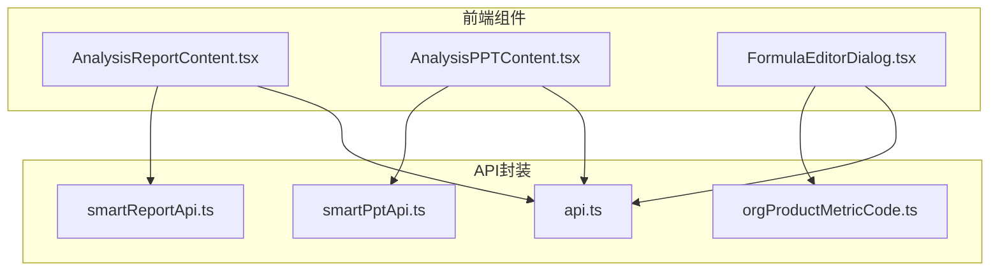
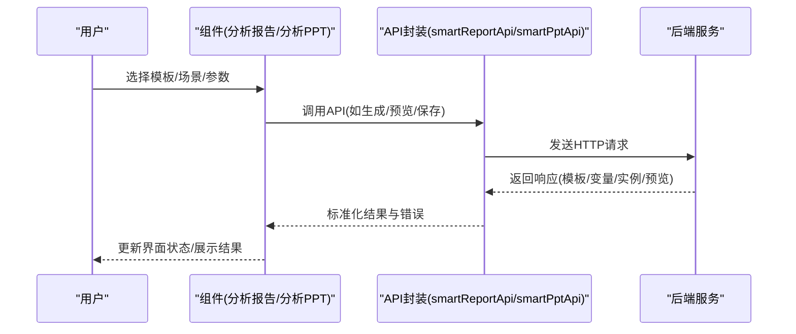
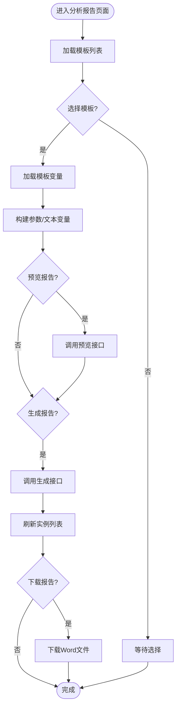
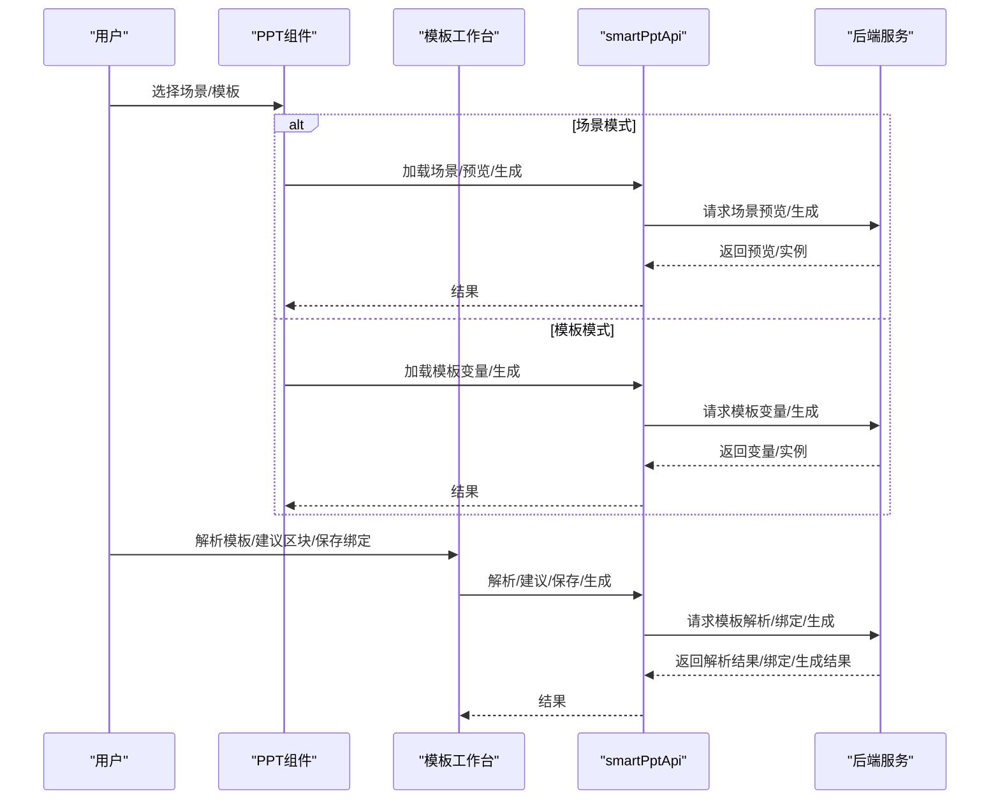
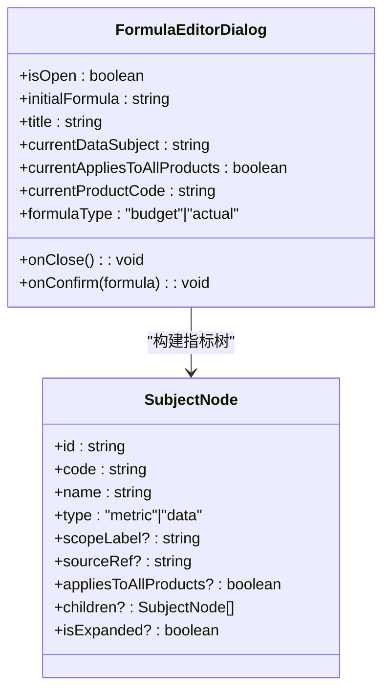
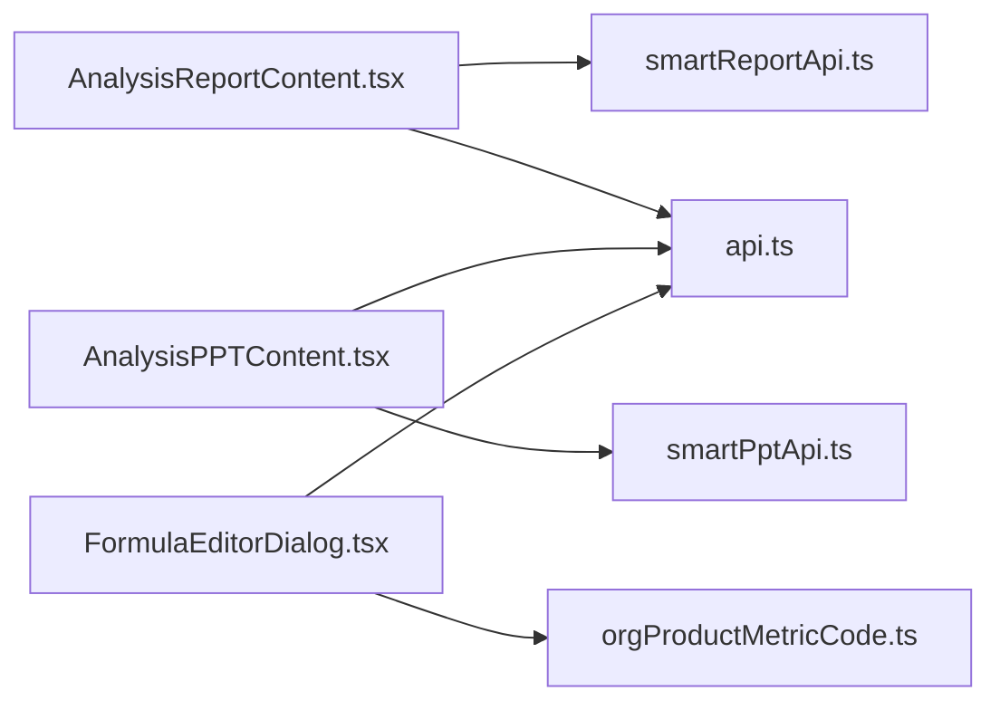

# 分析报告组件

<cite>
**本文档引用的文件**
- [AnalysisReportContent.tsx](file://apps/web/src/app/components/AnalysisReportContent.tsx)
- [AnalysisPPTContent.tsx](file://apps/web/src/app/components/AnalysisPPTContent.tsx)
- [FormulaEditorDialog.tsx](file://apps/web/src/app/components/FormulaEditorDialog.tsx)
- [smartReportApi.ts](file://apps/web/src/lib/smartReportApi.ts)
- [smartPptApi.ts](file://apps/web/src/lib/smartPptApi.ts)
- [orgProductMetricCode.ts](file://apps/web/src/lib/orgProductMetricCode.ts)
- [api.ts](file://apps/web/src/lib/api.ts)
</cite>

## 目录
1. [简介](#简介)
2. [项目结构](#项目结构)
3. [核心组件](#核心组件)
4. [架构总览](#架构总览)
5. [详细组件分析](#详细组件分析)
6. [依赖关系分析](#依赖关系分析)
7. [性能考虑](#性能考虑)
8. [故障排除指南](#故障排除指南)
9. [结论](#结论)
10. [附录](#附录)

## 简介
本文件面向智能预算系统的分析报告组件，系统性阐述以下能力与实现细节：
- 分析报告内容：模板管理、变量绑定、参数化生成、AI蓝图解析与生成、计算指标构建与插入。
- 分析PPT内容：场景驱动与模板驱动两种PPT生成模式、模板解析与绑定工作台、图表区块建议与批量生成。
- 透视表与透视图：基于模板变量与图表配置的动态渲染与数据绑定。
- 公式编辑器对话框：安全的公式输入体验、语法高亮、拖拽/双击插入、函数与运算符面板、公式验证与测试。
- 数据分析与报告生成：前端与后端API对接、指标树构建、参数与文本变量收集、预览与生成流程。
- 交互式分析与动态图表：实时预览、参数联动、图表配置、模板工作台可视化。
- 自定义报告：模板上传/保存、手工模板录入、变量占位符识别、蓝图保存与生成Word。
- 组件与分析引擎集成：通过API服务封装调用，统一错误处理与加载状态管理。

## 项目结构
分析报告组件位于Web前端工程的应用组件目录中，采用按功能域划分的组织方式：
- 分析报告页面：负责报告模板、变量、参数、预览与生成的全流程。
- 分析PPT页面：负责场景模式与模板模式的PPT生成，以及模板工作台的绑定配置。
- 公式编辑器对话框：提供受控的公式输入体验，支持拖拽/双击插入指标、函数与运算符。
- API封装：通过smartReportApi与smartPptApi抽象底层HTTP请求，统一返回类型与错误处理。
- 指标代码工具：deriveRuntimeRefFromOrgProductMetricCode用于从机构产品指标编码派生运行时引用。

**图表来源**
- [AnalysisReportContent.tsx](file://apps/web/src/app/components/AnalysisReportContent.tsx)
- [AnalysisPPTContent.tsx](file://apps/web/src/app/components/AnalysisPPTContent.tsx)
- [FormulaEditorDialog.tsx](file://apps/web/src/app/components/FormulaEditorDialog.tsx)
- [smartReportApi.ts](file://apps/web/src/lib/smartReportApi.ts)
- [smartPptApi.ts](file://apps/web/src/lib/smartPptApi.ts)
- [orgProductMetricCode.ts](file://apps/web/src/lib/orgProductMetricCode.ts)
- [api.ts](file://apps/web/src/lib/api.ts)

**章节来源**
- [AnalysisReportContent.tsx](file://apps/web/src/app/components/AnalysisReportContent.tsx)
- [AnalysisPPTContent.tsx](file://apps/web/src/app/components/AnalysisPPTContent.tsx)
- [FormulaEditorDialog.tsx](file://apps/web/src/app/components/FormulaEditorDialog.tsx)

## 核心组件
- 分析报告内容组件：提供模板上传/保存、手工模板录入、变量占位符识别、参数与文本变量收集、AI蓝图解析与生成、计算指标构建与插入、报告实例管理与刷新下载。
- 分析PPT内容组件：提供场景模式（场景选择、参数调整、预览生成）、模板模式（模板列表、变量参数、一键生成）、模板工作台（对象解析、图表区块建议、绑定配置、批量生成）。
- 公式编辑器对话框：提供拖拽/双击插入指标、函数与运算符面板、语法高亮显示、公式验证与测试、确认保存。

**章节来源**
- [AnalysisReportContent.tsx](file://apps/web/src/app/components/AnalysisReportContent.tsx)
- [AnalysisPPTContent.tsx](file://apps/web/src/app/components/AnalysisPPTContent.tsx)
- [FormulaEditorDialog.tsx](file://apps/web/src/app/components/FormulaEditorDialog.tsx)

## 架构总览
前端通过API封装与后端服务交互，形成清晰的职责边界：
- 组件负责UI状态管理、用户交互与流程编排。
- API封装负责HTTP请求、类型约束与错误处理。
- 指标代码工具负责从指标编码派生运行时引用，保证跨产品与全行范围的兼容性。

**图表来源**
- [AnalysisReportContent.tsx](file://apps/web/src/app/components/AnalysisReportContent.tsx)
- [AnalysisPPTContent.tsx](file://apps/web/src/app/components/AnalysisPPTContent.tsx)
- [smartReportApi.ts](file://apps/web/src/lib/smartReportApi.ts)
- [smartPptApi.ts](file://apps/web/src/lib/smartPptApi.ts)

## 详细组件分析

### 分析报告内容组件
该组件提供完整的报告制作与生成流程，包括模板管理、变量绑定、参数化生成、AI蓝图解析与生成、计算指标构建与插入、报告实例管理与刷新下载。

- 模板管理
  - 支持上传.docx模板并识别占位符，或手工录入文本模板并保存为模板。
  - 模板列表按编码/名称搜索过滤，支持刷新与选择。
- 变量与参数
  - 自动加载模板变量，区分参数变量、文本变量、图表变量与指标变量。
  - 参数变量支持年份、起止月份、版本、预算/实际等内置字段，以及模板自定义参数。
  - 文本变量支持多行文本替换。
- 预览与生成
  - 预览报告时展示替换后的正文与警告信息。
  - 生成Word报告并记录实例，支持刷新实例与下载。
- AI蓝图
  - 上传已有Word报告，AI解析结构、指标与待确认项。
  - 保存蓝图、生成指标预览、保存并生成Word、下载生成文件。
- 计算指标
  - 在指标树中选择基础指标，构建计算指标表达式(M1/M2...)。
  - 保存计算指标并自动插入到模板中。

**图表来源**
- [AnalysisReportContent.tsx](file://apps/web/src/app/components/AnalysisReportContent.tsx)

**章节来源**
- [AnalysisReportContent.tsx](file://apps/web/src/app/components/AnalysisReportContent.tsx)

### 分析PPT内容组件
该组件提供两种PPT生成模式：场景模式与模板模式，并提供模板工作台以实现对象解析、图表区块建议与批量绑定生成。

- 场景模式
  - 场景列表加载与选择，参数调整后预览幻灯片结构、指标卡、表格与图表。
  - 一键生成PPT并支持下载，同时记录生成实例。
- 模板模式
  - 模板列表与变量参数展示，支持一键生成与下载。
  - 模板概览统计参数变量、文本变量与数据占位符数量。
- 模板工作台
  - 解析目标模板，提取页面、图表、表格与文本对象。
  - 建议图表语义区块，生成绑定草案，支持保存绑定与批量生成模板PPT。
  - 可视化绑定配置，支持图表规则、数据源、指标编码与生成提示。

**图表来源**
- [AnalysisPPTContent.tsx](file://apps/web/src/app/components/AnalysisPPTContent.tsx)
- [smartPptApi.ts](file://apps/web/src/lib/smartPptApi.ts)

**章节来源**
- [AnalysisPPTContent.tsx](file://apps/web/src/app/components/AnalysisPPTContent.tsx)

### 公式编辑器对话框
该对话框提供安全且高效的公式输入体验，支持拖拽/双击插入指标、函数与运算符、语法高亮显示、公式验证与测试、确认保存。

- 指标树与搜索
  - 从机构产品指标快照构建指标树，支持展开/收起、搜索过滤、右键菜单快速展开/收起。
  - 根据当前适用范围限制可引用指标（如适用所有产品范围仅可引用“适用所有产品范围”的指标）。
- 公式输入与高亮
  - 受控textarea配合语法高亮层，数字用蓝色、运算符/函数用绿色、指标引用用紫红色。
  - 支持拖拽/双击插入指标引用，自动在光标处插入形如"<编码 名称>"的占位。
  - 键盘导航优化：左右箭头在指标引用间跳转，阻止空格/回车等干扰按键。
- 函数与运算符面板
  - 提供数字、运算符、括号、函数(SUM/AVG/MAX/MIN)与功能按钮(退格/清空/测试)。
- 公式验证与测试
  - 保存前先验证：替换指标引用为占位数值，执行语法解析与计算，返回结果或错误信息。
  - 测试按钮弹出原始公式、替换后公式与计算结果的提示框。

**图表来源**
- [FormulaEditorDialog.tsx](file://apps/web/src/app/components/FormulaEditorDialog.tsx)

**章节来源**
- [FormulaEditorDialog.tsx](file://apps/web/src/app/components/FormulaEditorDialog.tsx)

## 依赖关系分析
- 组件与API封装
  - 分析报告组件依赖smartReportApi进行模板、变量、实例、AI蓝图与生成相关操作。
  - 分析PPT组件依赖smartPptApi进行场景、模板、变量与生成相关操作。
- 组件与工具库
  - 指标编码派生：deriveRuntimeRefFromOrgProductMetricCode用于从实体/表/指标编码派生运行时引用。
  - 通用API：apiGet用于获取指标快照等数据。
- 组件内部耦合
  - 分析报告组件内部通过useMemo优化指标树与候选集计算，减少重渲染。
  - 分析PPT组件内部通过useMemo优化对象行与绑定集合，提升大模板工作台的交互性能。

**图表来源**
- [AnalysisReportContent.tsx](file://apps/web/src/app/components/AnalysisReportContent.tsx)
- [AnalysisPPTContent.tsx](file://apps/web/src/app/components/AnalysisPPTContent.tsx)
- [FormulaEditorDialog.tsx](file://apps/web/src/app/components/FormulaEditorDialog.tsx)
- [smartReportApi.ts](file://apps/web/src/lib/smartReportApi.ts)
- [smartPptApi.ts](file://apps/web/src/lib/smartPptApi.ts)
- [orgProductMetricCode.ts](file://apps/web/src/lib/orgProductMetricCode.ts)
- [api.ts](file://apps/web/src/lib/api.ts)

**章节来源**
- [AnalysisReportContent.tsx](file://apps/web/src/app/components/AnalysisReportContent.tsx)
- [AnalysisPPTContent.tsx](file://apps/web/src/app/components/AnalysisPPTContent.tsx)
- [FormulaEditorDialog.tsx](file://apps/web/src/app/components/FormulaEditorDialog.tsx)

## 性能考虑
- 指标树构建与缓存
  - 使用useMemo对指标树根节点、后代节点映射、指标候选集进行缓存，避免每次渲染重复计算。
  - 指标搜索与过滤在内存中进行，结合虚拟滚动可进一步优化超大指标树的渲染。
- 异步加载与并发
  - 并发加载模板、实例、计算指标与指标快照，减少首屏等待时间。
  - 对预览/生成等耗时操作设置loading状态，避免重复触发。
- 事件处理优化
  - 公式编辑器对话框中对键盘事件与滚动事件进行节流/防抖处理，提升输入流畅度。
- 图表与模板工作台
  - 模板工作台按需渲染对象列表与绑定配置，避免一次性渲染过多DOM节点。
  - 图表区块建议与绑定草案采用分批生成，降低首次加载压力。

## 故障排除指南
- 模板加载失败
  - 现象：模板列表为空或加载错误提示。
  - 排查：检查网络连接与后端服务状态；确认模板类型与权限。
  - 处理：点击刷新按钮重试；若仍失败，检查API返回与错误消息。
- 变量加载失败
  - 现象：模板变量为空或出现错误提示。
  - 排查：确认所选模板存在且变量定义正确。
  - 处理：重新选择模板或检查模板变量配置。
- 预览/生成失败
  - 现象：预览或生成时报错，实例状态异常。
  - 排查：检查参数与文本变量是否为空或非法；查看预览警告。
  - 处理：修正参数后重试；必要时清理缓存或重启浏览器。
- AI蓝图解析失败
  - 现象：上传报告后AI解析失败或无结果。
  - 排查：确认上传的是.docx文件且内容结构清晰。
  - 处理：更换文件或调整报告结构后重试。
- 公式验证失败
  - 现象：保存公式时报语法错误或科目不在范围内。
  - 排查：检查公式中引用的指标编码是否存在于当前适用范围内。
  - 处理：根据提示修正指标引用或调整适用范围。

**章节来源**
- [AnalysisReportContent.tsx](file://apps/web/src/app/components/AnalysisReportContent.tsx)
- [AnalysisPPTContent.tsx](file://apps/web/src/app/components/AnalysisPPTContent.tsx)
- [FormulaEditorDialog.tsx](file://apps/web/src/app/components/FormulaEditorDialog.tsx)

## 结论
分析报告组件通过清晰的组件划分与API封装，实现了从模板管理、变量绑定、参数化生成到AI蓝图解析与PPT模板工作的完整闭环。公式编辑器对话框提供了安全高效的公式输入体验，结合指标树与语法高亮，显著提升了用户的公式编写效率与准确性。通过useMemo与异步并发等优化策略，组件在大数据量场景下仍能保持良好的交互性能。建议后续持续完善指标树虚拟滚动、图表区块智能匹配与批量绑定优化，以进一步提升用户体验与生产效率。

## 附录

### 使用示例与代码片段路径
- 上传并识别报告模板
  - [handleUpload](file://apps/web/src/app/components/AnalysisReportContent.tsx)
- 预览报告
  - [handlePreview](file://apps/web/src/app/components/AnalysisReportContent.tsx)
- 生成Word报告
  - [handleGenerate](file://apps/web/src/app/components/AnalysisReportContent.tsx)
- AI解析报告结构并保存蓝图
  - [handleInspectReportWithAI](file://apps/web/src/app/components/AnalysisReportContent.tsx)
  - [handleSaveBlueprint](file://apps/web/src/app/components/AnalysisReportContent.tsx)
- 生成蓝图并下载
  - [handleGenerateBlueprint](file://apps/web/src/app/components/AnalysisReportContent.tsx)
  - [handleDownloadBlueprint](file://apps/web/src/app/components/AnalysisReportContent.tsx)
- 场景模式生成PPT
  - [handleGenerateScene](file://apps/web/src/app/components/AnalysisPPTContent.tsx)
- 模板工作台解析与生成
  - [handleInspectTemplate](file://apps/web/src/app/components/AnalysisPPTContent.tsx)
  - [handleSuggestTemplateBindings](file://apps/web/src/app/components/AnalysisPPTContent.tsx)
  - [handleSaveTemplateBindings](file://apps/web/src/app/components/AnalysisPPTContent.tsx)
  - [handleGenerateTemplateDeck](file://apps/web/src/app/components/AnalysisPPTContent.tsx)
- 公式编辑器对话框
  - [addSubjectToFormula](file://apps/web/src/app/components/FormulaEditorDialog.tsx)
  - [validateFormula](file://apps/web/src/app/components/FormulaEditorDialog.tsx)
  - [handleTestFormula](file://apps/web/src/app/components/FormulaEditorDialog.tsx)
  - [handleConfirm](file://apps/web/src/app/components/FormulaEditorDialog.tsx)