# 透视图表内容组件

<cite>
**本文档引用的文件**
- [PivotChartContent.tsx](file://apps/web/src/app/components/PivotChartContent.tsx)
- [chartApi.ts](file://apps/web/src/lib/chartApi.ts)
- [pivotTableModel.ts](file://apps/web/src/app/components/pivotTableModel.ts)
- [package.json](file://apps/web/package.json)
- [index.css](file://apps/web/src/styles/index.css)
- [theme.css](file://apps/web/src/styles/theme.css)
</cite>

## 目录
1. [简介](#简介)
2. [项目结构](#项目结构)
3. [核心组件](#核心组件)
4. [架构概览](#架构概览)
5. [详细组件分析](#详细组件分析)
6. [依赖关系分析](#依赖关系分析)
7. [性能考虑](#性能考虑)
8. [故障排除指南](#故障排除指南)
9. [结论](#结论)

## 简介

透视图表内容组件是一个基于 React 和 Recharts 的动态图表生成系统，专门用于预算预测和驱动因素分析。该组件提供了四种不同的图表类型（柱状图、堆积图、曲线图和饼环图），支持多维度数据透视分析，具备丰富的交互功能和响应式设计。

该组件的核心功能包括：
- 多图表类型的动态切换和渲染
- 实时数据映射和转换
- 自适应的样式定制
- 交互式图表操作
- PPT 导出功能
- 响应式布局适配

## 项目结构

透视图表内容组件位于前端 Web 应用的组件目录中，采用模块化设计，便于维护和扩展。

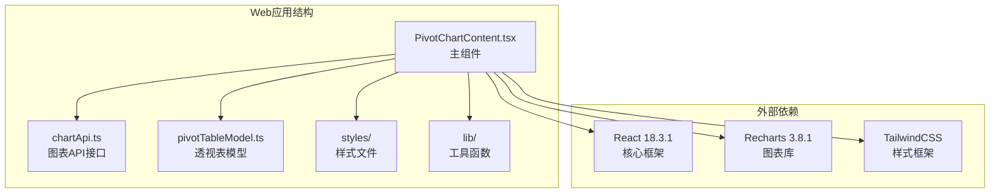

**图表来源**
- [PivotChartContent.tsx:1-50](file://apps/web/src/app/components/PivotChartContent.tsx#L1-L50)
- [chartApi.ts:1-30](file://apps/web/src/lib/chartApi.ts#L1-L30)

**章节来源**
- [PivotChartContent.tsx:1-2027](file://apps/web/src/app/components/PivotChartContent.tsx#L1-L2027)
- [package.json:15-32](file://apps/web/package.json#L15-L32)

## 核心组件

### 主要组件架构

透视图表内容组件采用函数式组件设计，结合 React Hooks 实现状态管理和数据流控制。

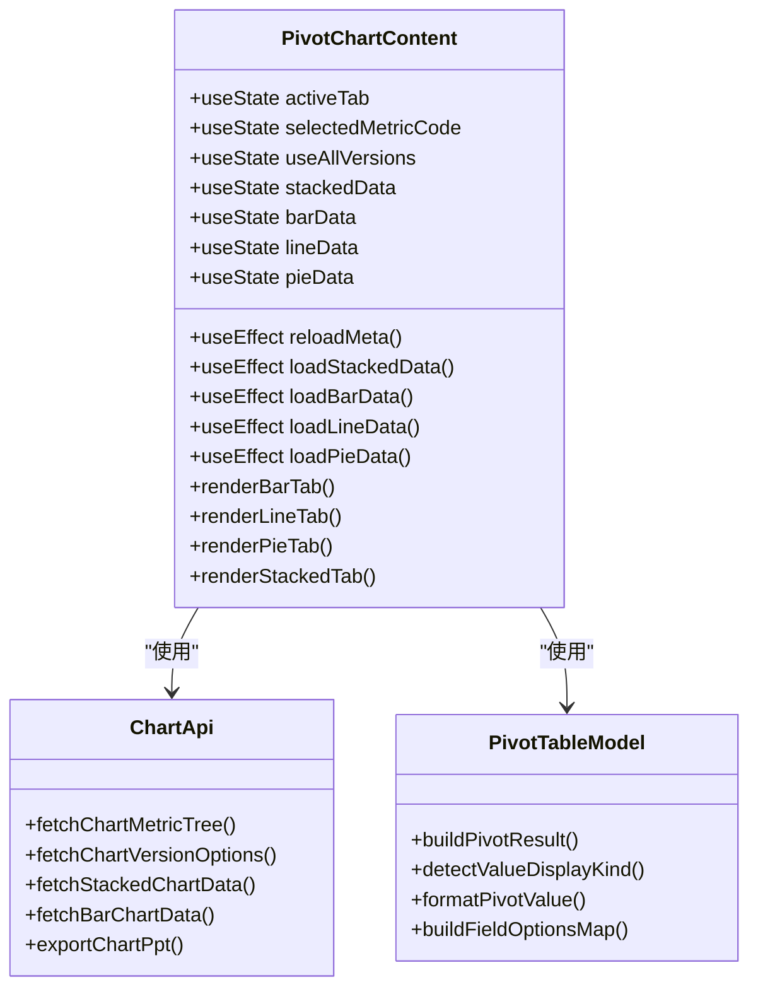

**图表来源**
- [PivotChartContent.tsx:142-2027](file://apps/web/src/app/components/PivotChartContent.tsx#L142-L2027)
- [chartApi.ts:95-116](file://apps/web/src/lib/chartApi.ts#L95-L116)
- [pivotTableModel.ts:252-416](file://apps/web/src/app/components/pivotTableModel.ts#L252-L416)

### 图表类型定义

组件支持四种不同的图表类型，每种类型都有其特定的数据处理和渲染逻辑：

| 图表类型 | 文件路径 | 数据源 | 特殊功能 |
|---------|----------|--------|----------|
| 柱状图 | renderBarTab | ChartStackedResponseDto | 支持本节点比较和下级指标比较 |
| 堆积图 | renderStackedTab | ChartStackedResponseDto | 支持累计值和占比两种模式 |
| 曲线图 | renderLineTab | ChartStackedResponseDto | 时间序列趋势分析 |
| 饼环图 | renderPieTab | ChartStackedResponseDto | 多维度构成分析 |

**章节来源**
- [PivotChartContent.tsx:66-71](file://apps/web/src/app/components/PivotChartContent.tsx#L66-L71)
- [PivotChartContent.tsx:817-1737](file://apps/web/src/app/components/PivotChartContent.tsx#L817-L1737)

## 架构概览

### 数据流架构

透视图表内容组件采用自上而下的数据流设计，确保数据的一致性和可预测性。

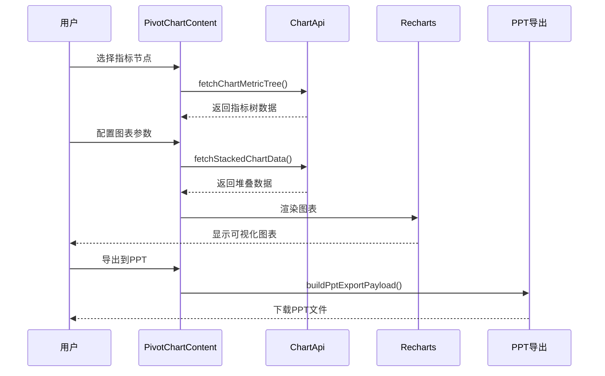

**图表来源**
- [PivotChartContent.tsx:625-651](file://apps/web/src/app/components/PivotChartContent.tsx#L625-L651)
- [chartApi.ts:103-116](file://apps/web/src/lib/chartApi.ts#L103-L116)

### 状态管理架构

组件使用 React Hooks 进行状态管理，实现了清晰的状态分离和数据流控制。

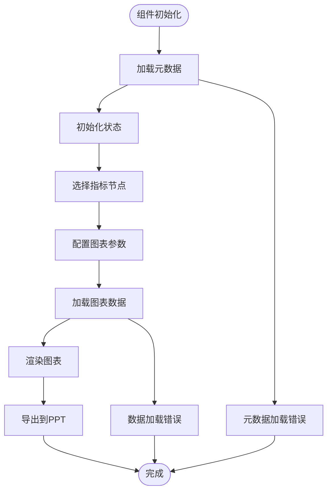

**图表来源**
- [PivotChartContent.tsx:625-651](file://apps/web/src/app/components/PivotChartContent.tsx#L625-L651)
- [PivotChartContent.tsx:664-787](file://apps/web/src/app/components/PivotChartContent.tsx#L664-L787)

**章节来源**
- [PivotChartContent.tsx:142-2027](file://apps/web/src/app/components/PivotChartContent.tsx#L142-L2027)

## 详细组件分析

### 图表渲染逻辑

#### 柱状图渲染流程

柱状图是透视图表中最复杂的图表类型，支持多种比较模式和数据展示方式。

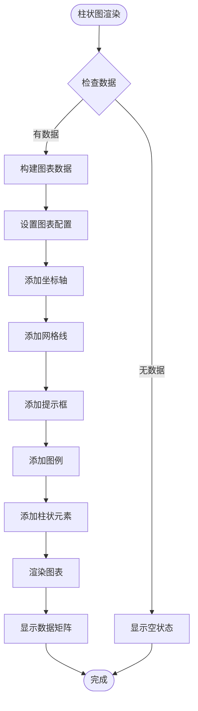

**图表来源**
- [PivotChartContent.tsx:976-1005](file://apps/web/src/app/components/PivotChartContent.tsx#L976-L1005)
- [PivotChartContent.tsx:1008-1041](file://apps/web/src/app/components/PivotChartContent.tsx#L1008-L1041)

#### 饼环图渲染逻辑

饼环图支持多种构成分析模式，包括下级指标占比和期间占比分析。

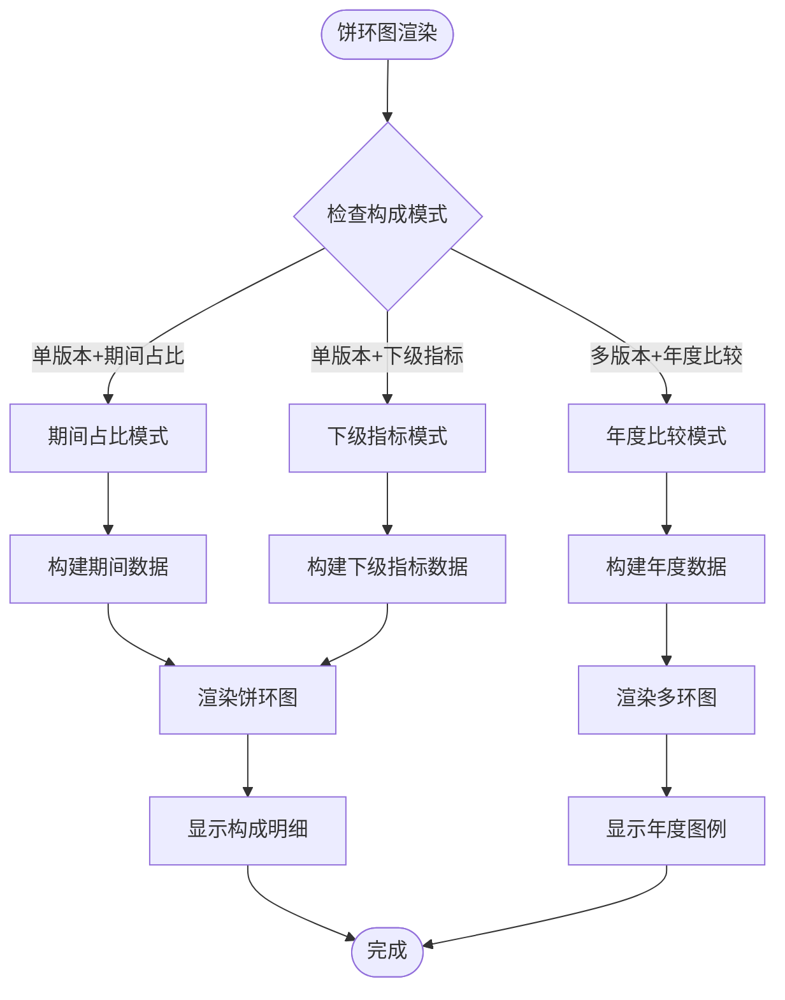

**图表来源**
- [PivotChartContent.tsx:1472-1593](file://apps/web/src/app/components/PivotChartContent.tsx#L1472-L1593)
- [PivotChartContent.tsx:1630-1735](file://apps/web/src/app/components/PivotChartContent.tsx#L1630-L1735)

### 数据转换算法

#### 图表数据映射

组件实现了复杂的数据映射算法，将后端返回的原始数据转换为 Recharts 可识别的格式。

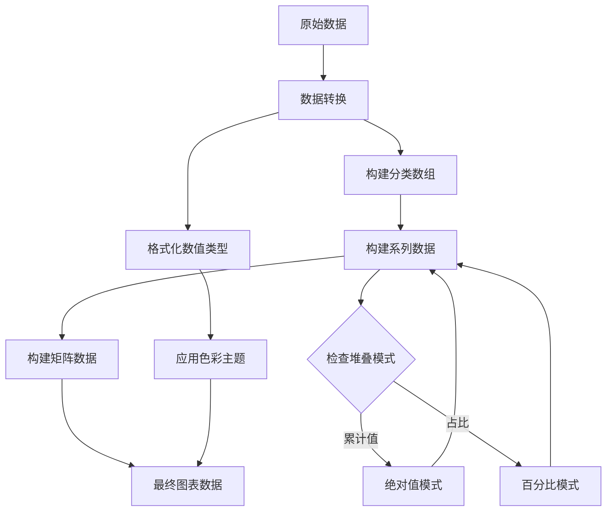

**图表来源**
- [PivotChartContent.tsx:251-282](file://apps/web/src/app/components/PivotChartContent.tsx#L251-L282)
- [PivotChartContent.tsx:284-298](file://apps/web/src/app/components/PivotChartContent.tsx#L284-L298)

#### 版本选择算法

组件实现了智能的版本选择算法，支持单版本和多版本的灵活配置。

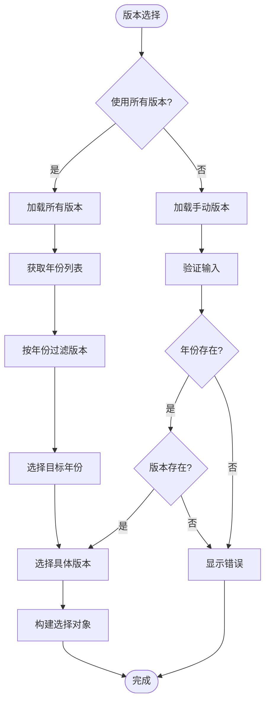

**图表来源**
- [PivotChartContent.tsx:190-206](file://apps/web/src/app/components/PivotChartContent.tsx#L190-L206)
- [PivotChartContent.tsx:625-651](file://apps/web/src/app/components/PivotChartContent.tsx#L625-L651)

### 样式定制系统

#### 色彩主题管理

组件采用了统一的色彩主题管理系统，支持深色和浅色模式的自动切换。

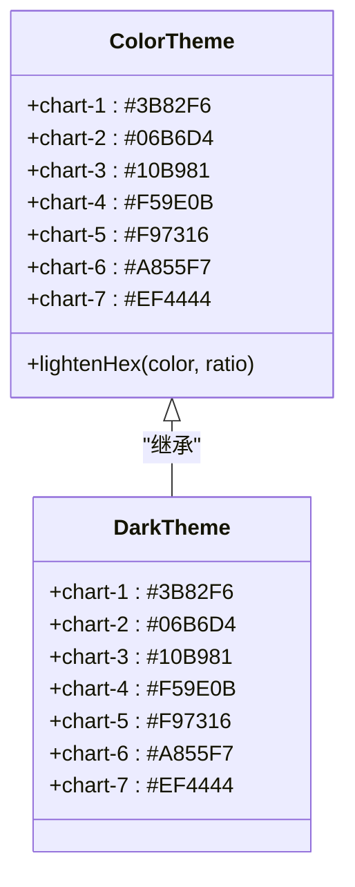

**图表来源**
- [PivotChartContent.tsx:73](file://apps/web/src/app/components/PivotChartContent.tsx#L73)
- [theme.css:28-70](file://apps/web/src/styles/theme.css#L28-L70)

#### 响应式布局设计

组件实现了完整的响应式布局系统，确保在不同设备上的最佳显示效果。

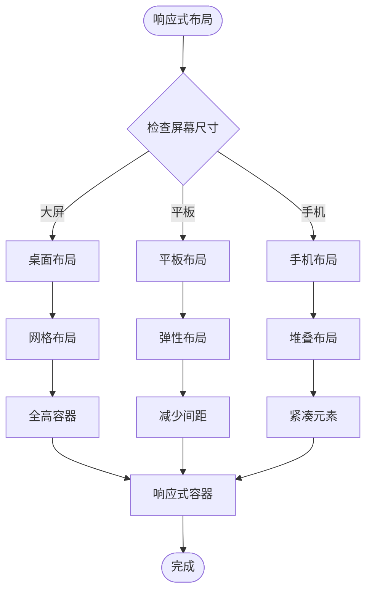

**图表来源**
- [PivotChartContent.tsx:976](file://apps/web/src/app/components/PivotChartContent.tsx#L976)
- [PivotChartContent.tsx:1532](file://apps/web/src/app/components/PivotChartContent.tsx#L1532)

**章节来源**
- [PivotChartContent.tsx:1-2027](file://apps/web/src/app/components/PivotChartContent.tsx#L1-L2027)
- [theme.css:1-182](file://apps/web/src/styles/theme.css#L1-L182)

## 依赖关系分析

### 外部依赖管理

透视图表内容组件依赖于多个关键的第三方库，这些依赖关系构成了组件的功能基础。

```mermaid
graph TB
subgraph "核心依赖"
A[React 18.3.1<br/>UI框架]
B[Recharts 3.8.1<br/>图表库]
C[TailwindCSS<br/>样式框架]
end
subgraph "开发依赖"
D[@vitejs/plugin-react<br/>构建工具]
E[typescript<br/>类型检查]
F[autoprefixer<br/>CSS前缀]
end
subgraph "应用组件"
G[PivotChartContent.tsx]
H[chartApi.ts]
I[pivotTableModel.ts]
end
G --> A
G --> B
G --> C
H --> A
I --> A
I --> C
```

**图表来源**
- [package.json:15-32](file://apps/web/package.json#L15-L32)
- [PivotChartContent.tsx:1-32](file://apps/web/src/app/components/PivotChartContent.tsx#L1-L32)

### 内部模块依赖

组件内部模块之间的依赖关系清晰明确，遵循单一职责原则。

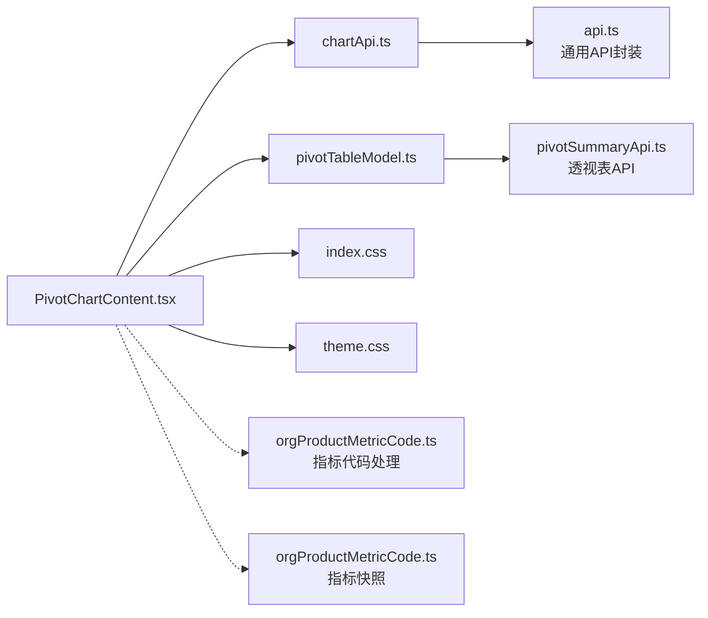

**图表来源**
- [PivotChartContent.tsx:17-32](file://apps/web/src/app/components/PivotChartContent.tsx#L17-L32)
- [chartApi.ts:1](file://apps/web/src/lib/chartApi.ts#L1)

**章节来源**
- [package.json:1-34](file://apps/web/package.json#L1-L34)
- [PivotChartContent.tsx:1-50](file://apps/web/src/app/components/PivotChartContent.tsx#L1-L50)

## 性能考虑

### 数据加载优化

组件实现了多层数据加载优化策略，确保在大数据量场景下的流畅体验。

#### 并行数据加载

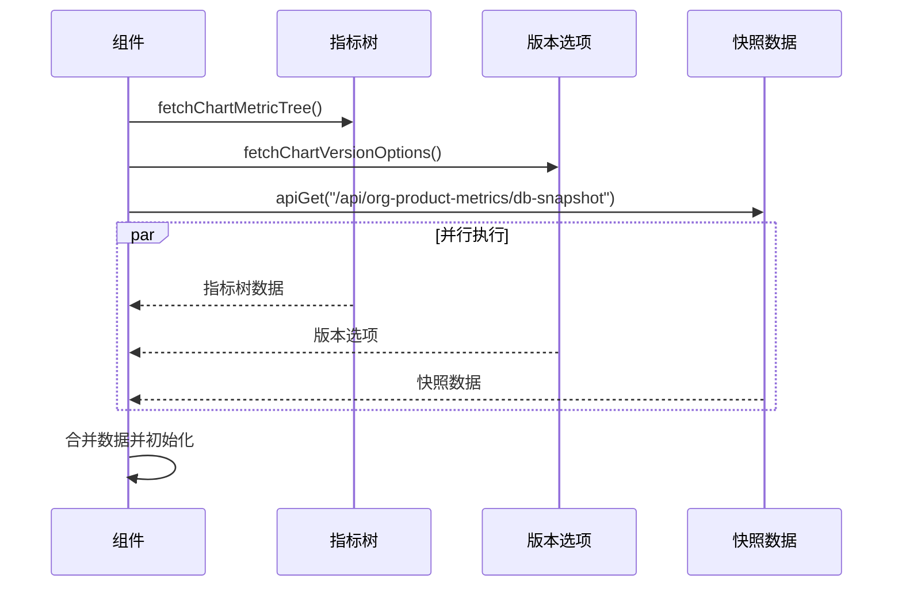

**图表来源**
- [PivotChartContent.tsx:629-640](file://apps/web/src/app/components/PivotChartContent.tsx#L629-L640)

#### 缓存策略

组件采用了智能缓存机制，避免重复的数据请求和计算。

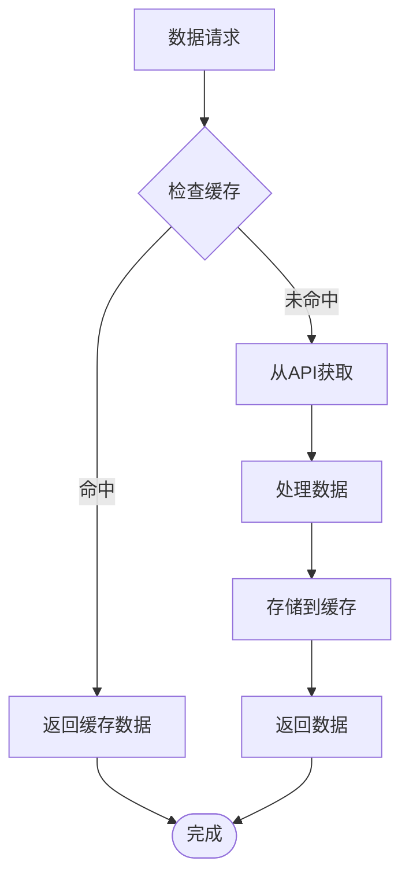

### 渲染性能优化

#### 虚拟化表格

对于大型数据矩阵，组件实现了虚拟化表格技术，只渲染可见区域的数据。

#### 图表懒加载

图表组件采用了懒加载策略，只有在用户切换到相应标签页时才进行数据加载和渲染。

### 内存管理

组件实现了有效的内存管理策略，防止内存泄漏和性能下降。

## 故障排除指南

### 常见问题诊断

#### 数据加载失败

当图表数据加载失败时，组件会显示相应的错误信息和重试机制。

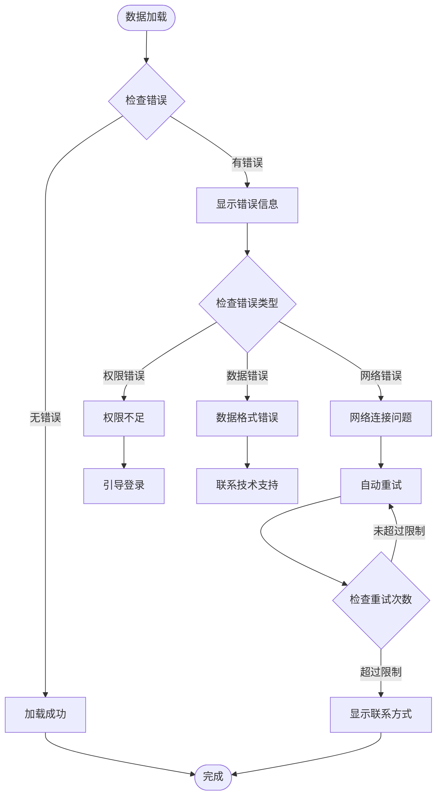

**图表来源**
- [PivotChartContent.tsx:664-691](file://apps/web/src/app/components/PivotChartContent.tsx#L664-L691)
- [PivotChartContent.tsx:722-750](file://apps/web/src/app/components/PivotChartContent.tsx#L722-L750)

#### 图表渲染异常

当图表渲染出现问题时，组件提供了详细的错误诊断信息。

**章节来源**
- [PivotChartContent.tsx:664-787](file://apps/web/src/app/components/PivotChartContent.tsx#L664-L787)

### 调试工具

组件内置了多种调试工具，帮助开发者快速定位和解决问题。

#### 状态监控

组件提供了实时的状态监控功能，可以查看当前的所有状态变量和数据流。

#### 性能分析

组件集成了性能分析工具，可以监控数据加载时间、渲染时间和内存使用情况。

## 结论

透视图表内容组件是一个功能完整、架构清晰的动态图表生成系统。它通过以下关键特性实现了优秀的用户体验：

### 技术优势

1. **模块化设计**：采用函数式组件和 Hooks，代码结构清晰，易于维护
2. **数据驱动**：基于 Recharts 的数据驱动渲染，支持丰富的交互功能
3. **响应式布局**：完整的响应式设计，适配各种设备和屏幕尺寸
4. **性能优化**：多层缓存和懒加载策略，确保大数据量场景下的流畅体验

### 功能特色

1. **多图表支持**：四种不同的图表类型，满足多样化的数据分析需求
2. **智能数据映射**：自动的数据转换和格式化，简化开发工作
3. **灵活配置**：丰富的配置选项，支持个性化的图表定制
4. **PPT导出**：完整的 PPT 导出功能，便于报告分享

### 扩展性

组件具有良好的扩展性，可以通过以下方式进一步增强：

1. **更多图表类型**：可以轻松添加新的图表类型支持
2. **自定义样式**：支持更多的样式定制选项
3. **插件系统**：可以开发插件扩展特定功能
4. **国际化支持**：可以添加多语言支持

该组件为预算预测和驱动因素分析提供了强大的可视化工具，是现代数据驱动应用的重要组成部分。