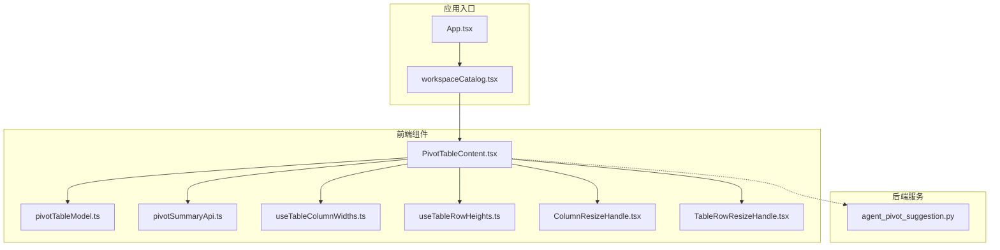
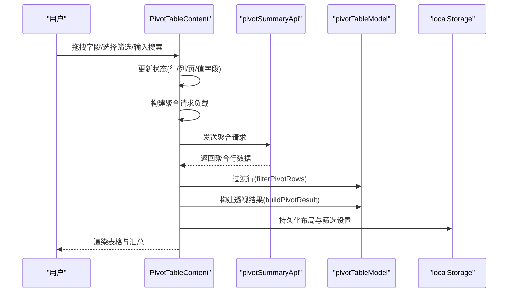
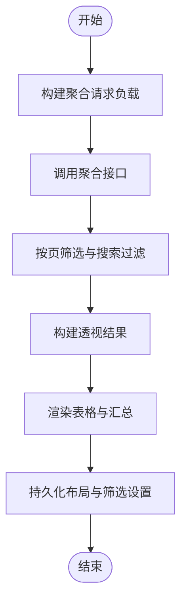
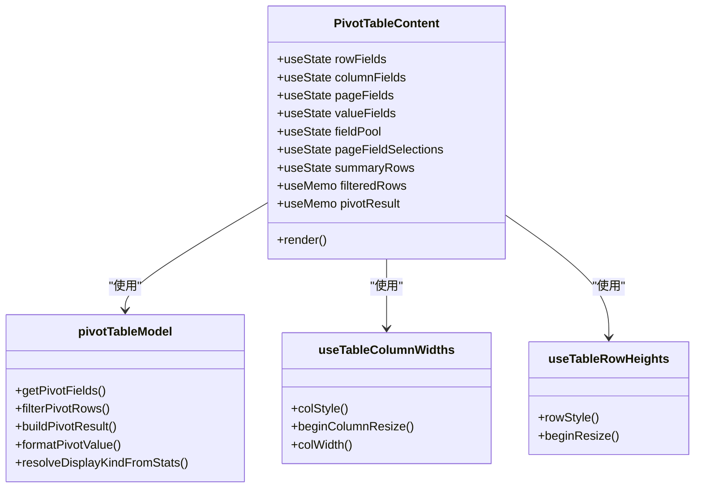
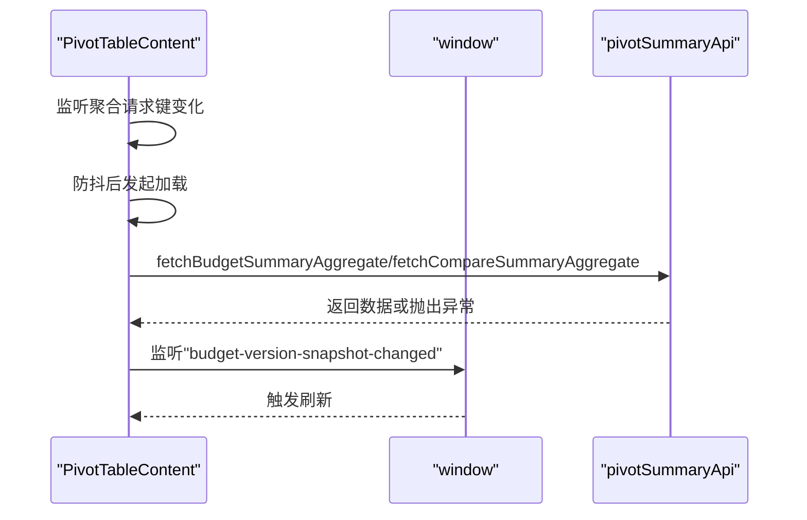
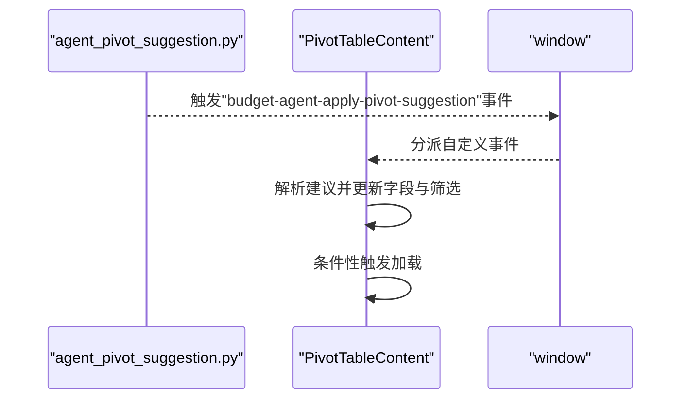
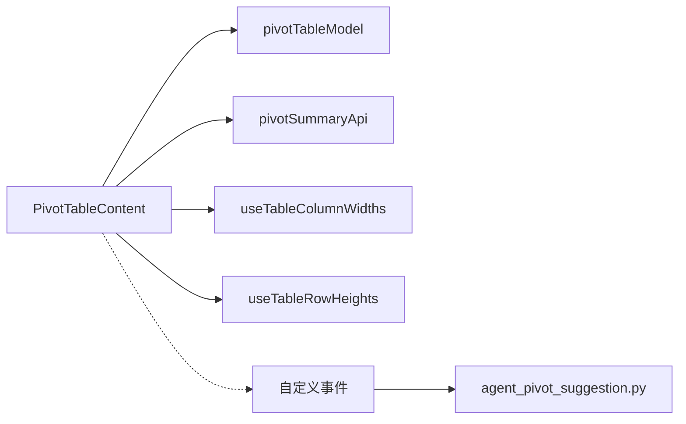

# 透视表内容组件

<cite>
**本文档引用的文件**
- [PivotTableContent.tsx](file://apps/web/src/app/components/PivotTableContent.tsx)
- [pivotTableModel.ts](file://apps/web/src/app/components/pivotTableModel.ts)
- [pivotSummaryApi.ts](file://apps/web/src/lib/pivotSummaryApi.ts)
- [useTableColumnWidths.ts](file://apps/web/src/lib/useTableColumnWidths.ts)
- [useTableRowHeights.ts](file://apps/web/src/lib/useTableRowHeights.ts)
- [ColumnResizeHandle.tsx](file://apps/web/src/app/components/ColumnResizeHandle.tsx)
- [TableRowResizeHandle.tsx](file://apps/web/src/app/components/TableRowResizeHandle.tsx)
- [App.tsx](file://apps/web/src/app/App.tsx)
- [workspaceCatalog.tsx](file://apps/web/src/app/workspaceCatalog.tsx)
- [agent_pivot_suggestion.py](file://apps/api/app/services/agent_pivot_suggestion.py)
</cite>

## 目录
1. [简介](#简介)
2. [项目结构](#项目结构)
3. [核心组件](#核心组件)
4. [架构概览](#架构概览)
5. [详细组件分析](#详细组件分析)
6. [依赖关系分析](#依赖关系分析)
7. [性能考虑](#性能考虑)
8. [故障排除指南](#故障排除指南)
9. [结论](#结论)
10. [附录](#附录)

## 简介
本文件详细记录了动态透视表内容组件的实现，涵盖数据聚合、行列字段配置、筛选条件设置、排序功能、表格渲染逻辑、列宽调整机制以及数据刷新策略。文档还提供了完整的使用示例，从数据加载到交互式分析的全流程操作，并包含性能优化技巧、大数据集处理和内存管理策略。

## 项目结构
该组件位于前端 Web 应用中，采用模块化设计，核心文件如下：
- PivotTableContent.tsx：主组件，负责 UI 布局、状态管理、事件处理和数据刷新
- pivotTableModel.ts：透视表模型与算法，包括字段定义、过滤、聚合和格式化
- pivotSummaryApi.ts：与后端 API 的交互封装，支持预算和对比两种数据源
- useTableColumnWidths.ts / useTableRowHeights.ts：表格列宽和行高的拖拽调整与持久化
- ColumnResizeHandle.tsx / TableRowResizeHandle.tsx：拖拽手柄组件
- App.tsx / workspaceCatalog.tsx：应用入口和工作区目录，注册透视表页面
- agent_pivot_suggestion.py：后端智能建议生成，用于自动化配置透视表

**图表来源**
- [PivotTableContent.tsx:51-867](file://apps/web/src/app/components/PivotTableContent.tsx#L51-L867)
- [pivotTableModel.ts:1-416](file://apps/web/src/app/components/pivotTableModel.ts#L1-L416)
- [pivotSummaryApi.ts:1-101](file://apps/web/src/lib/pivotSummaryApi.ts#L1-L101)
- [useTableColumnWidths.ts:1-89](file://apps/web/src/lib/useTableColumnWidths.ts#L1-L89)
- [useTableRowHeights.ts:1-81](file://apps/web/src/lib/useTableRowHeights.ts#L1-L81)
- [ColumnResizeHandle.tsx:1-19](file://apps/web/src/app/components/ColumnResizeHandle.tsx#L1-L19)
- [TableRowResizeHandle.tsx:1-19](file://apps/web/src/app/components/TableRowResizeHandle.tsx#L1-L19)
- [App.tsx:241-241](file://apps/web/src/app/App.tsx#L241-L241)
- [workspaceCatalog.tsx:175-176](file://apps/web/src/app/workspaceCatalog.tsx#L175-L176)
- [agent_pivot_suggestion.py:216-273](file://apps/api/app/services/agent_pivot_suggestion.py#L216-L273)

**章节来源**
- [PivotTableContent.tsx:51-867](file://apps/web/src/app/components/PivotTableContent.tsx#L51-L867)
- [pivotTableModel.ts:1-416](file://apps/web/src/app/components/pivotTableModel.ts#L1-L416)
- [pivotSummaryApi.ts:1-101](file://apps/web/src/lib/pivotSummaryApi.ts#L1-L101)
- [useTableColumnWidths.ts:1-89](file://apps/web/src/lib/useTableColumnWidths.ts#L1-L89)
- [useTableRowHeights.ts:1-81](file://apps/web/src/lib/useTableRowHeights.ts#L1-L81)
- [workspaceCatalog.tsx:175-176](file://apps/web/src/app/workspaceCatalog.tsx#L175-L176)

## 核心组件
- 主组件 PivotTableContent：负责字段拖拽、筛选、搜索、汇总显示、导出和刷新
- 模型与算法 pivotTableModel：提供字段定义、选项映射、行过滤、透视聚合构建和格式化
- API 封装 pivotSummaryApi：统一预算和对比数据源的聚合请求与导出
- 表格尺寸工具 useTableColumnWidths / useTableRowHeights：提供拖拽调整与本地存储
- 拖拽手柄 ColumnResizeHandle / TableRowResizeHandle：增强用户体验

**章节来源**
- [PivotTableContent.tsx:51-867](file://apps/web/src/app/components/PivotTableContent.tsx#L51-L867)
- [pivotTableModel.ts:1-416](file://apps/web/src/app/components/pivotTableModel.ts#L1-L416)
- [pivotSummaryApi.ts:1-101](file://apps/web/src/lib/pivotSummaryApi.ts#L1-L101)
- [useTableColumnWidths.ts:1-89](file://apps/web/src/lib/useTableColumnWidths.ts#L1-L89)
- [useTableRowHeights.ts:1-81](file://apps/web/src/lib/useTableRowHeights.ts#L1-L81)

## 架构概览
组件采用分层架构：
- 视图层：PivotTableContent 渲染 UI 并管理用户交互
- 模型层：pivotTableModel 提供数据结构、过滤与聚合算法
- 服务层：pivotSummaryApi 封装 API 请求与响应
- 工具层：useTableColumnWidths / useTableRowHeights 提供交互体验增强
- 事件层：通过自定义事件接收后端智能建议并自动应用

**图表来源**
- [PivotTableContent.tsx:150-237](file://apps/web/src/app/components/PivotTableContent.tsx#L150-L237)
- [pivotSummaryApi.ts:78-100](file://apps/web/src/lib/pivotSummaryApi.ts#L78-L100)
- [pivotTableModel.ts:228-415](file://apps/web/src/app/components/pivotTableModel.ts#L228-L415)

**章节来源**
- [PivotTableContent.tsx:150-237](file://apps/web/src/app/components/PivotTableContent.tsx#L150-L237)
- [pivotSummaryApi.ts:78-100](file://apps/web/src/lib/pivotSummaryApi.ts#L78-L100)
- [pivotTableModel.ts:228-415](file://apps/web/src/app/components/pivotTableModel.ts#L228-L415)

## 详细组件分析

### 动态透视表实现细节
- 数据聚合
  - 聚合请求负载由行、列、页字段 ID、页筛选和搜索文本组成
  - 加载完成后根据数据源设置提示信息与当前月份窗口
  - 对于对比数据源，支持同步后重新加载以反映最新版本
- 字段配置
  - 字段分为维度(dimension)与度量(measure)，分别用于行、列、页与值区域
  - 字段池(pool)存放未分配字段，拖拽时确保同一字段不重复出现在多个区域
  - 页字段支持下拉选择，自动维护有效选项集合
- 筛选与搜索
  - 页筛选基于字段选项映射，支持模糊匹配与部门层级模糊匹配
  - 搜索文本按空格/逗号/分号/斜杠分割关键词，对可搜索维度字段进行包含匹配
- 排序
  - 行节点按标签进行本地化排序(localeCompare)
  - 列叶元组按中文环境排序，保证稳定且符合中文习惯
- 表格渲染
  - 多级列头按层级合并单元格，最后一行列头与列键对齐
  - 数值单元格根据值类型自动切换金额/百分比格式
  - 支持行/列汇总显示与合计行
- 列宽调整
  - 使用拖拽手柄实时调整列宽，范围受最小/最大值限制
  - 调整结果持久化到 localStorage，按 tableId 分组
- 数据刷新策略
  - 聚合请求键变更触发防抖加载
  - 版本快照变更监听触发刷新
  - 支持手动刷新按钮

**图表来源**
- [PivotTableContent.tsx:150-237](file://apps/web/src/app/components/PivotTableContent.tsx#L150-L237)
- [pivotTableModel.ts:228-415](file://apps/web/src/app/components/pivotTableModel.ts#L228-L415)

**章节来源**
- [PivotTableContent.tsx:150-237](file://apps/web/src/app/components/PivotTableContent.tsx#L150-L237)
- [pivotTableModel.ts:228-415](file://apps/web/src/app/components/pivotTableModel.ts#L228-L415)

### 表格渲染逻辑与列宽调整机制
- 表头渲染
  - 多级列头按层级生成，计算每个单元格的跨列跨度
  - 最后一行列头与列键对齐，确保单元格与标题一一对应
- 单元格渲染
  - 行字段列包含树形缩进与首列行高拖拽手柄
  - 数值单元格根据格式统计自动选择金额或百分比显示
- 列宽调整
  - ColumnResizeHandle 在表头右侧提供拖拽手柄
  - useTableColumnWidths 统一管理列宽状态与持久化
  - 支持最小/最大宽度约束与样式合并

**图表来源**
- [PivotTableContent.tsx:51-867](file://apps/web/src/app/components/PivotTableContent.tsx#L51-L867)
- [pivotTableModel.ts:1-416](file://apps/web/src/app/components/pivotTableModel.ts#L1-L416)
- [useTableColumnWidths.ts:1-89](file://apps/web/src/lib/useTableColumnWidths.ts#L1-L89)
- [useTableRowHeights.ts:1-81](file://apps/web/src/lib/useTableRowHeights.ts#L1-L81)

**章节来源**
- [PivotTableContent.tsx:712-867](file://apps/web/src/app/components/PivotTableContent.tsx#L712-L867)
- [pivotTableModel.ts:1-416](file://apps/web/src/app/components/pivotTableModel.ts#L1-L416)
- [useTableColumnWidths.ts:1-89](file://apps/web/src/lib/useTableColumnWidths.ts#L1-L89)
- [useTableRowHeights.ts:1-81](file://apps/web/src/lib/useTableRowHeights.ts#L1-L81)

### 数据刷新策略与版本管理
- 自动刷新
  - 聚合请求键变更触发防抖加载，避免频繁请求
  - 监听预算版本快照变更事件，及时更新数据
- 版本选择
  - 对于对比数据源，支持自动选择最新版本
  - 代理建议中明确版本时，跳过自动选择
- 错误处理
  - 对 404/未找到等错误进行友好提示
  - 设置错误状态并清空结果集

**图表来源**
- [PivotTableContent.tsx:226-254](file://apps/web/src/app/components/PivotTableContent.tsx#L226-L254)
- [pivotSummaryApi.ts:78-88](file://apps/web/src/lib/pivotSummaryApi.ts#L78-L88)

**章节来源**
- [PivotTableContent.tsx:226-254](file://apps/web/src/app/components/PivotTableContent.tsx#L226-L254)
- [pivotSummaryApi.ts:78-88](file://apps/web/src/lib/pivotSummaryApi.ts#L78-L88)

### 智能建议与自动化配置
- 后端建议
  - 根据运行时配置与意图识别生成透视建议，包含行/列/页字段与值字段
  - 建议解释包含置信度与推荐理由
- 前端应用
  - 监听自定义事件，解析建议并自动填充字段与筛选
  - 搜索建议文本仅在命中数据时生效

**图表来源**
- [agent_pivot_suggestion.py:216-273](file://apps/api/app/services/agent_pivot_suggestion.py#L216-L273)
- [PivotTableContent.tsx:343-352](file://apps/web/src/app/components/PivotTableContent.tsx#L343-L352)

**章节来源**
- [agent_pivot_suggestion.py:216-273](file://apps/api/app/services/agent_pivot_suggestion.py#L216-L273)
- [PivotTableContent.tsx:343-352](file://apps/web/src/app/components/PivotTableContent.tsx#L343-L352)

## 依赖关系分析
- 组件耦合
  - PivotTableContent 依赖 pivotTableModel 提供的数据结构与算法
  - 通过 pivotSummaryApi 与后端通信，解耦数据获取与渲染
  - useTableColumnWidths / useTableRowHeights 提供通用交互能力
- 外部依赖
  - localStorage 用于持久化用户偏好
  - 自定义事件用于跨组件通信（智能建议）
- 潜在循环依赖
  - 未发现直接循环依赖，各模块职责清晰

**图表来源**
- [PivotTableContent.tsx:1-32](file://apps/web/src/app/components/PivotTableContent.tsx#L1-L32)
- [pivotSummaryApi.ts:1-101](file://apps/web/src/lib/pivotSummaryApi.ts#L1-L101)
- [useTableColumnWidths.ts:1-89](file://apps/web/src/lib/useTableColumnWidths.ts#L1-L89)
- [useTableRowHeights.ts:1-81](file://apps/web/src/lib/useTableRowHeights.ts#L1-L81)
- [agent_pivot_suggestion.py:216-273](file://apps/api/app/services/agent_pivot_suggestion.py#L216-L273)

**章节来源**
- [PivotTableContent.tsx:1-32](file://apps/web/src/app/components/PivotTableContent.tsx#L1-L32)
- [pivotSummaryApi.ts:1-101](file://apps/web/src/lib/pivotSummaryApi.ts#L1-L101)
- [useTableColumnWidths.ts:1-89](file://apps/web/src/lib/useTableColumnWidths.ts#L1-L89)
- [useTableRowHeights.ts:1-81](file://apps/web/src/lib/useTableRowHeights.ts#L1-L81)

## 性能考虑
- 防抖与缓存
  - 聚合请求键变更后延迟加载，减少频繁网络请求
  - 本地存储持久化布局与筛选，避免每次重载重建
- 计算优化
  - 过滤与聚合在模型层集中实现，避免重复计算
  - 列头合并与排序使用本地化比较，提升中文环境下稳定性
- 内存管理
  - 使用 useMemo 缓存过滤后的行与透视结果
  - 清理事件监听器与定时器，防止内存泄漏
- 大数据集处理
  - 优先使用页筛选与搜索缩小数据集
  - 控制列宽与行高范围，避免过度渲染
  - 导出时使用二进制流下载，降低前端内存压力

[本节为通用指导，无需特定文件分析]

## 故障排除指南
- 加载失败
  - 检查后端聚合服务状态与权限
  - 关注错误消息中的 404/未找到提示
- 数据为空
  - 确认预算事实刷新跑批已完成
  - 检查页筛选与搜索条件是否过于严格
- 列宽/行高异常
  - 清除 localStorage 中对应 tableId 的存储项
  - 检查最小/最大限制是否合理
- 智能建议未生效
  - 确认事件名称与数据源匹配
  - 检查建议中的字段 ID 是否存在于当前字段池

**章节来源**
- [PivotTableContent.tsx:177-197](file://apps/web/src/app/components/PivotTableContent.tsx#L177-L197)
- [pivotSummaryApi.ts:78-88](file://apps/web/src/lib/pivotSummaryApi.ts#L78-L88)

## 结论
该动态透视表组件通过清晰的分层设计与完善的交互机制，实现了灵活的字段配置、高效的筛选与搜索、稳定的聚合与渲染，以及良好的用户体验。结合智能建议与数据刷新策略，能够满足复杂预算分析场景的需求。建议在生产环境中配合缓存与导出策略进一步优化性能。

[本节为总结性内容，无需特定文件分析]

## 附录

### 完整使用示例（从数据加载到交互式分析）
- 步骤 1：进入透视表页面
  - 通过工作区目录选择“当前可编辑年度多版本透视报表”或“多年度对比透视报表”
- 步骤 2：加载数据
  - 组件自动发起聚合请求，显示加载状态
  - 成功后渲染表格与汇总，同时显示规则提示与当前月份窗口
- 步骤 3：配置字段
  - 将维度字段拖拽至行/列/页区域，度量字段拖拽至值区域
  - 使用页字段下拉选择筛选条件
- 步骤 4：搜索与筛选
  - 在搜索框中输入关键词，支持多关键词任意匹配
  - 通过页筛选进一步限定数据范围
- 步骤 5：调整布局
  - 使用列宽拖拽手柄调整列宽
  - 在树形行首列使用行高拖拽手柄调整行高
- 步骤 6：查看与导出
  - 查看行/列汇总与合计行
  - 点击导出按钮下载当前透视聚合结果

**章节来源**
- [workspaceCatalog.tsx:175-176](file://apps/web/src/app/workspaceCatalog.tsx#L175-L176)
- [PivotTableContent.tsx:605-867](file://apps/web/src/app/components/PivotTableContent.tsx#L605-L867)
- [pivotSummaryApi.ts:90-100](file://apps/web/src/lib/pivotSummaryApi.ts#L90-L100)