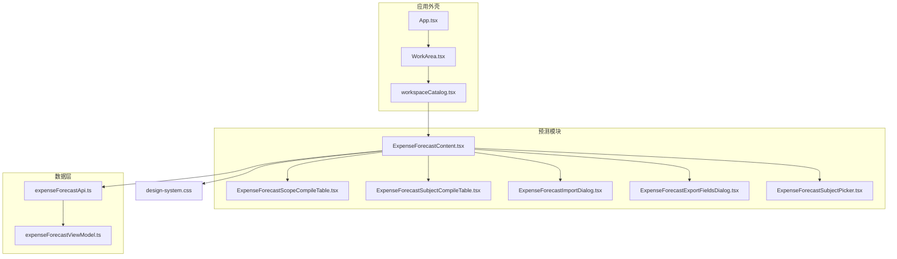
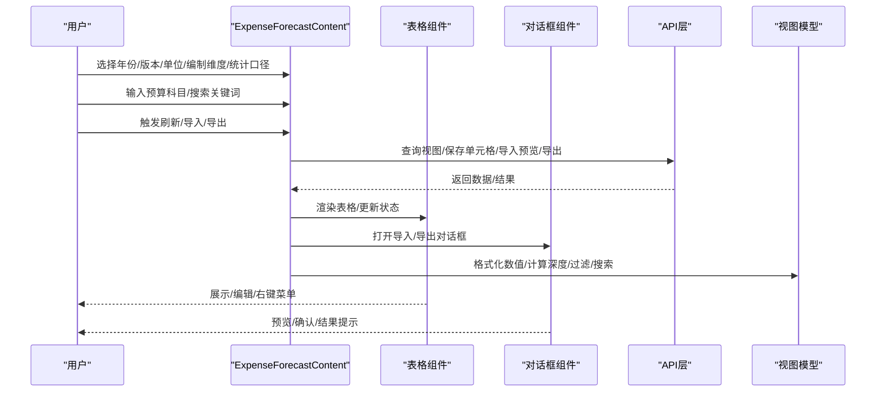
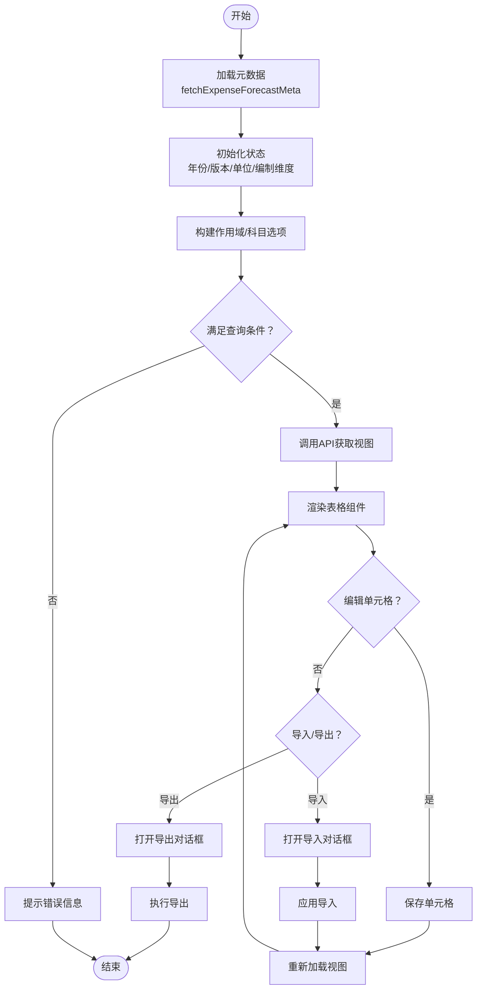
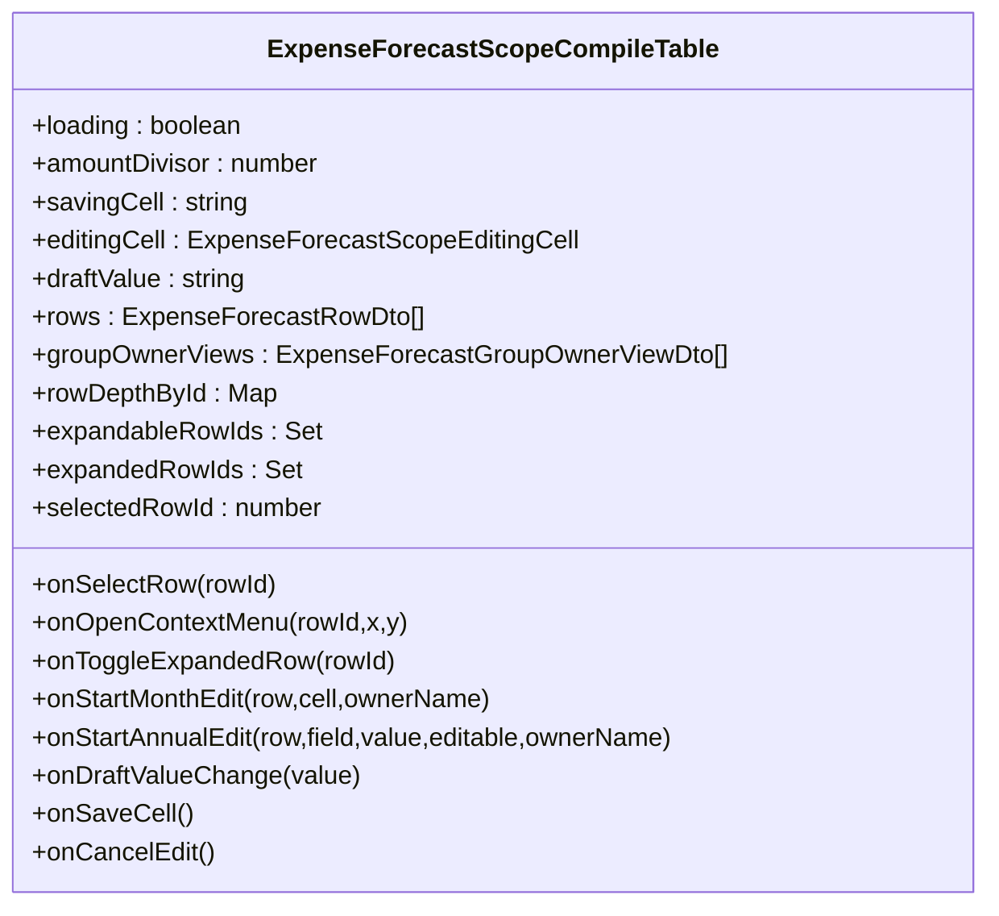
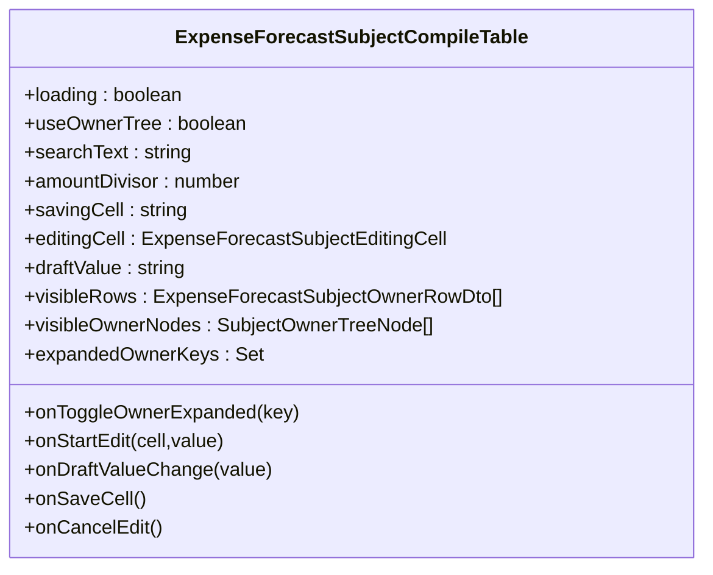
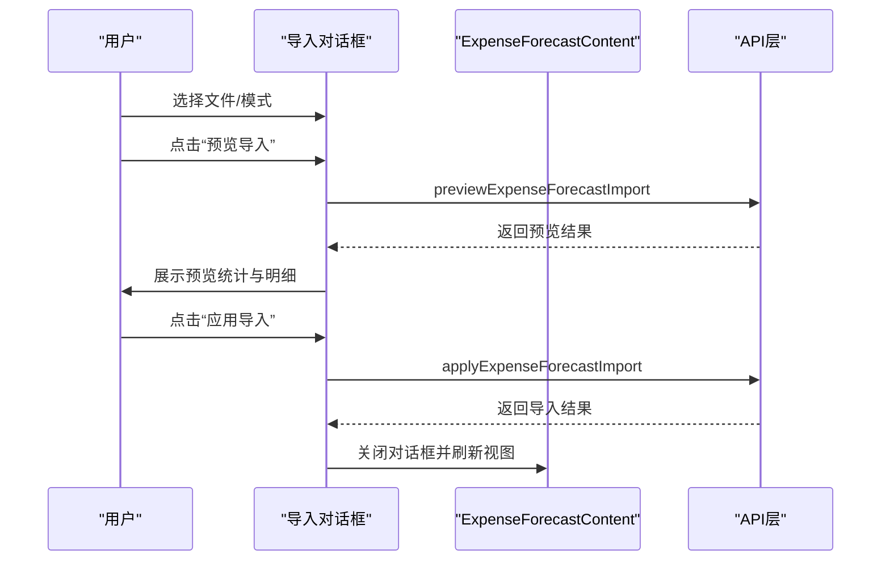
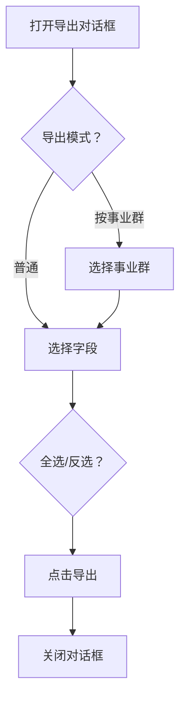
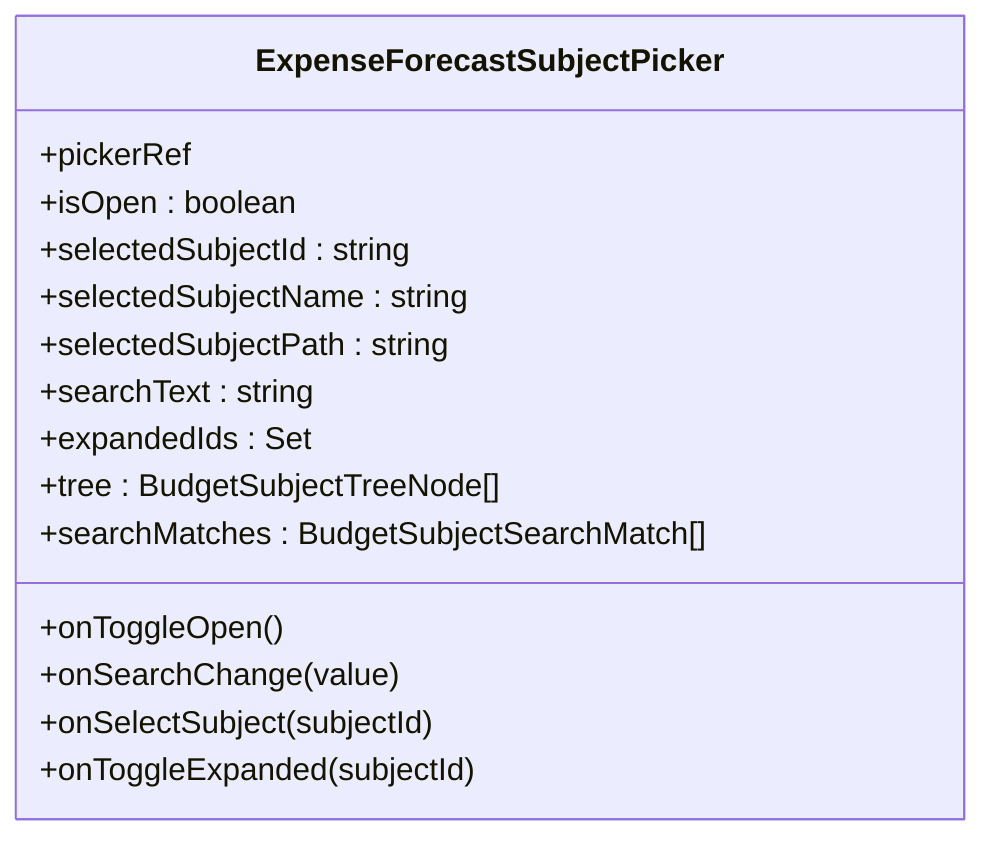
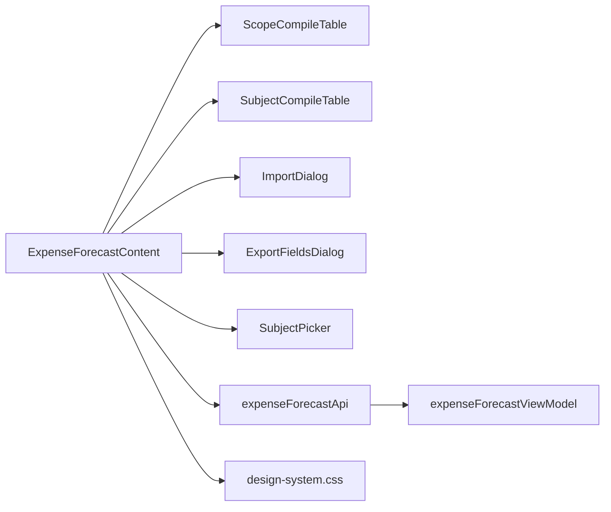

# 前端组件文档

<cite>
**本文档引用的文件**
- [ExpenseForecastContent.tsx](file://apps/web/src/app/components/ExpenseForecastContent.tsx)
- [ExpenseForecastScopeCompileTable.tsx](file://apps/web/src/app/components/ExpenseForecastScopeCompileTable.tsx)
- [ExpenseForecastSubjectCompileTable.tsx](file://apps/web/src/app/components/ExpenseForecastSubjectCompileTable.tsx)
- [ExpenseForecastImportDialog.tsx](file://apps/web/src/app/components/ExpenseForecastImportDialog.tsx)
- [ExpenseForecastExportFieldsDialog.tsx](file://apps/web/src/app/components/ExpenseForecastExportFieldsDialog.tsx)
- [ExpenseForecastSubjectPicker.tsx](file://apps/web/src/app/components/ExpenseForecastSubjectPicker.tsx)
- [expenseForecastApi.ts](file://apps/web/src/lib/expenseForecastApi.ts)
- [expenseForecastViewModel.ts](file://apps/web/src/lib/expenseForecastViewModel.ts)
- [App.tsx](file://apps/web/src/app/App.tsx)
- [WorkArea.tsx](file://apps/web/src/app/components/WorkArea.tsx)
- [workspaceCatalog.tsx](file://apps/web/src/app/workspaceCatalog.tsx)
- [design-system.css](file://apps/web/src/styles/design-system.css)
</cite>

## 目录
1. [简介](#简介)
2. [项目结构](#项目结构)
3. [核心组件](#核心组件)
4. [架构总览](#架构总览)
5. [详细组件分析](#详细组件分析)
6. [依赖关系分析](#依赖关系分析)
7. [性能考虑](#性能考虑)
8. [故障排查指南](#故障排查指南)
9. [结论](#结论)
10. [附录](#附录)

## 简介
本文件面向“智能预算预测系统”的前端组件，聚焦于“部门费用预测”功能的React组件集合。内容涵盖组件的视觉外观、行为与交互模式，props/属性、事件、插槽与自定义选项，使用示例与代码片段路径，响应式设计与无障碍访问指导，状态管理、动画与过渡效果，样式自定义与主题支持，跨浏览器兼容性与性能优化，以及组件组合与与其他UI元素的集成方式。目标是帮助开发者快速理解并高效扩展该模块。

## 项目结构
该模块位于Web前端工程的组件与API层，采用“工作区模块化 + 组件分层”的组织方式：
- 应用外壳与工作区：App.tsx、WorkArea.tsx、workspaceCatalog.tsx
- 预测模块核心：ExpenseForecastContent.tsx 及其子组件（表格、对话框、选择器）
- 数据接口与视图模型：expenseForecastApi.ts、expenseForecastViewModel.ts
- 设计系统与主题：design-system.css

图表来源
- [App.tsx:388-519](file://apps/web/src/app/App.tsx#L388-L519)
- [WorkArea.tsx:18-151](file://apps/web/src/app/components/WorkArea.tsx#L18-L151)
- [workspaceCatalog.tsx:235-252](file://apps/web/src/app/workspaceCatalog.tsx#L235-L252)
- [ExpenseForecastContent.tsx:81-1144](file://apps/web/src/app/components/ExpenseForecastContent.tsx#L81-L1144)
- [ExpenseForecastScopeCompileTable.tsx:52-283](file://apps/web/src/app/components/ExpenseForecastScopeCompileTable.tsx#L52-L283)
- [ExpenseForecastSubjectCompileTable.tsx:38-249](file://apps/web/src/app/components/ExpenseForecastSubjectCompileTable.tsx#L38-L249)
- [ExpenseForecastImportDialog.tsx:28-182](file://apps/web/src/app/components/ExpenseForecastImportDialog.tsx#L28-L182)
- [ExpenseForecastExportFieldsDialog.tsx:17-111](file://apps/web/src/app/components/ExpenseForecastExportFieldsDialog.tsx#L17-L111)
- [ExpenseForecastSubjectPicker.tsx:43-160](file://apps/web/src/app/components/ExpenseForecastSubjectPicker.tsx#L43-L160)
- [expenseForecastApi.ts:370-547](file://apps/web/src/lib/expenseForecastApi.ts#L370-L547)
- [expenseForecastViewModel.ts:70-351](file://apps/web/src/lib/expenseForecastViewModel.ts#L70-L351)
- [design-system.css:1-705](file://apps/web/src/styles/design-system.css#L1-L705)

章节来源
- [App.tsx:388-519](file://apps/web/src/app/App.tsx#L388-L519)
- [WorkArea.tsx:18-151](file://apps/web/src/app/components/WorkArea.tsx#L18-L151)
- [workspaceCatalog.tsx:105-206](file://apps/web/src/app/workspaceCatalog.tsx#L105-L206)

## 核心组件
- ExpenseForecastContent：预测主控组件，负责筛选条件、视图切换、导入导出、上下文菜单、消息提示等。
- ExpenseForecastScopeCompileTable：按预算部门编制的表格，支持树形展开、月度/年度字段编辑、右键上下文菜单。
- ExpenseForecastSubjectCompileTable：按预算科目编制的表格，支持费用归属部门树与高亮搜索。
- ExpenseForecastImportDialog：Excel导入预览与应用对话框，支持追加/覆盖模式。
- ExpenseForecastExportFieldsDialog：Excel导出字段选择对话框，支持按事业群批量导出。
- ExpenseForecastSubjectPicker：预算科目选择器，支持搜索、路径高亮、树形展开/折叠。
- expenseForecastApi：预测模块API封装，包括视图查询、单元格保存、导入/导出、规则管理等。
- expenseForecastViewModel：视图模型与格式化工具，包括金额单位换算、月度单元格状态、搜索与树构建等。

章节来源
- [ExpenseForecastContent.tsx:81-1144](file://apps/web/src/app/components/ExpenseForecastContent.tsx#L81-L1144)
- [ExpenseForecastScopeCompileTable.tsx:24-283](file://apps/web/src/app/components/ExpenseForecastScopeCompileTable.tsx#L24-L283)
- [ExpenseForecastSubjectCompileTable.tsx:20-249](file://apps/web/src/app/components/ExpenseForecastSubjectCompileTable.tsx#L20-L249)
- [ExpenseForecastImportDialog.tsx:8-182](file://apps/web/src/app/components/ExpenseForecastImportDialog.tsx#L8-L182)
- [ExpenseForecastExportFieldsDialog.tsx:6-111](file://apps/web/src/app/components/ExpenseForecastExportFieldsDialog.tsx#L6-L111)
- [ExpenseForecastSubjectPicker.tsx:8-160](file://apps/web/src/app/components/ExpenseForecastSubjectPicker.tsx#L8-L160)
- [expenseForecastApi.ts:370-547](file://apps/web/src/lib/expenseForecastApi.ts#L370-L547)
- [expenseForecastViewModel.ts:70-351](file://apps/web/src/lib/expenseForecastViewModel.ts#L70-L351)

## 架构总览
预测模块采用“容器组件 + 表格组件 + 对话框组件 + 选择器组件”的分层设计，配合API层与视图模型层实现数据驱动的渲染与交互。

图表来源
- [ExpenseForecastContent.tsx:285-356](file://apps/web/src/app/components/ExpenseForecastContent.tsx#L285-L356)
- [ExpenseForecastScopeCompileTable.tsx:52-283](file://apps/web/src/app/components/ExpenseForecastScopeCompileTable.tsx#L52-L283)
- [ExpenseForecastImportDialog.tsx:28-182](file://apps/web/src/app/components/ExpenseForecastImportDialog.tsx#L28-L182)
- [ExpenseForecastExportFieldsDialog.tsx:17-111](file://apps/web/src/app/components/ExpenseForecastExportFieldsDialog.tsx#L17-L111)
- [expenseForecastApi.ts:370-547](file://apps/web/src/lib/expenseForecastApi.ts#L370-L547)
- [expenseForecastViewModel.ts:70-351](file://apps/web/src/lib/expenseForecastViewModel.ts#L70-L351)

## 详细组件分析

### ExpenseForecastContent（预测主控组件）
- 视觉外观：顶部筛选区（年份、版本、单位、编制维度、预算科目选择器、统计口径、搜索）、中部表格区、底部状态栏与消息提示。
- 行为与交互：
  - 条件联动：根据统计口径动态生成作用域选项；当选择“费用归属部门”时启用导入能力。
  - 编制维度切换：支持“按预算部门/按预算科目”两种视图。
  - 表格渲染：根据是否启用科目编制，分别渲染 ScopeCompileTable 或 SubjectCompileTable。
  - 上下文菜单：右键预算科目行弹出展开/收起/定位/刷新等操作。
  - 导入/导出：打开对话框进行Excel导入预览与应用，或导出Excel并支持字段选择。
  - 单元格编辑：双击或点击进入编辑态，支持回车保存、ESC取消。
- 关键状态：
  - 元数据（meta）、视图数据（view/groupView/subjectView）、加载状态、保存状态、搜索关键字、展开状态、上下文菜单状态、导入/导出对话框开关等。
- 事件与回调：
  - onStartMonthEdit/onStartAnnualEdit/onSaveCell/onCancelEdit 等编辑流程回调。
  - onToggleExpandedRow/onSelectRow/onOpenContextMenu 等表格交互回调。
  - onModeChange/onFileChange/onPreview/onApply 等导入流程回调。
  - onSelectedFieldsChange/onExport 等导出流程回调。
- 自定义选项：
  - amountUnit：金额单位（元/千元/万元/百万元/亿元），持久化到本地存储。
  - compileMode/scopeType/scopeValue/subjectCompileId：控制视图类型与渲染。
- 使用示例（代码片段路径）
  - [主控组件渲染与状态管理:81-123](file://apps/web/src/app/components/ExpenseForecastContent.tsx#L81-L123)
  - [视图加载与条件校验:285-356](file://apps/web/src/app/components/ExpenseForecastContent.tsx#L285-L356)
  - [单元格保存流程:448-508](file://apps/web/src/app/components/ExpenseForecastContent.tsx#L448-L508)
  - [导入预览与应用:617-690](file://apps/web/src/app/components/ExpenseForecastContent.tsx#L617-L690)
  - [导出流程:574-615](file://apps/web/src/app/components/ExpenseForecastContent.tsx#L574-L615)

图表来源
- [ExpenseForecastContent.tsx:126-133](file://apps/web/src/app/components/ExpenseForecastContent.tsx#L126-L133)
- [ExpenseForecastContent.tsx:285-356](file://apps/web/src/app/components/ExpenseForecastContent.tsx#L285-L356)
- [ExpenseForecastContent.tsx:448-508](file://apps/web/src/app/components/ExpenseForecastContent.tsx#L448-L508)
- [ExpenseForecastContent.tsx:617-690](file://apps/web/src/app/components/ExpenseForecastContent.tsx#L617-L690)
- [ExpenseForecastContent.tsx:574-615](file://apps/web/src/app/components/ExpenseForecastContent.tsx#L574-L615)

章节来源
- [ExpenseForecastContent.tsx:81-1144](file://apps/web/src/app/components/ExpenseForecastContent.tsx#L81-L1144)

### ExpenseForecastScopeCompileTable（按预算部门编制表格）
- 视觉外观：固定“预算科目”列与12个月列，附加全年预测、年度预算、差额、预算执行率、业务报送、资划建议、差额等列；支持树形展开/折叠。
- 行为与交互：
  - 月度单元格：双击进入编辑，支持键盘回车保存、ESC取消。
  - 年度字段：业务报送/资划建议支持编辑，只读汇总单元格禁用编辑。
  - 行选择与右键菜单：点击行选中，右键弹出上下文菜单（展开/收起/定位/刷新）。
  - 单元格状态：根据来源（实际/手工/自动/人工覆盖/未配置/汇总）显示不同样式与标题。
- props/属性
  - loading/amountDivisor/savingCell/editingCell/draftValue/rows/groupOwnerViews
  - rowDepthById/expandableRowIds/expandedRowIds/selectedRowId
  - onSelectRow/onOpenContextMenu/onToggleExpandedRow/onStartMonthEdit/onStartAnnualEdit/onDraftValueChange/onSaveCell/onCancelEdit
- 使用示例（代码片段路径）
  - [表格渲染与列定义:238-282](file://apps/web/src/app/components/ExpenseForecastScopeCompileTable.tsx#L238-282)
  - [月度单元格渲染与编辑:125-160](file://apps/web/src/app/components/ExpenseForecastScopeCompileTable.tsx#L125-160)
  - [年度字段渲染与编辑:162-193](file://apps/web/src/app/components/ExpenseForecastScopeCompileTable.tsx#L162-193)
  - [行渲染与上下文菜单:195-234](file://apps/web/src/app/components/ExpenseForecastScopeCompileTable.tsx#L195-234)

图表来源
- [ExpenseForecastScopeCompileTable.tsx:24-50](file://apps/web/src/app/components/ExpenseForecastScopeCompileTable.tsx#L24-L50)

章节来源
- [ExpenseForecastScopeCompileTable.tsx:24-283](file://apps/web/src/app/components/ExpenseForecastScopeCompileTable.tsx#L24-L283)

### ExpenseForecastSubjectCompileTable（按预算科目编制表格）
- 视觉外观：固定“费用归属部门”列与12个月列，附加汇总列；支持费用归属部门树与高亮搜索。
- 行为与交互：
  - 支持 useOwnerTree 模式，基于部门树聚合显示。
  - 月度/年度字段编辑与 ScopeCompileTable 类似。
  - 行渲染时对部门名称与路径进行高亮显示。
- props/属性
  - loading/useOwnerTree/searchText/amountDivisor/savingCell/editingCell/draftValue/visibleRows/visibleOwnerNodes/expandedOwnerKeys
  - onToggleOwnerExpanded/onStartEdit/onDraftValueChange/onSaveCell/onCancelEdit
- 使用示例（代码片段路径）
  - [表格渲染与列定义:191-247](file://apps/web/src/app/components/ExpenseForecastSubjectCompileTable.tsx#L191-247)
  - [行渲染与部门树节点:55-135](file://apps/web/src/app/components/ExpenseForecastSubjectCompileTable.tsx#L55-135)
  - [年度字段编辑:137-187](file://apps/web/src/app/components/ExpenseForecastSubjectCompileTable.tsx#L137-187)

图表来源
- [ExpenseForecastSubjectCompileTable.tsx:20-36](file://apps/web/src/app/components/ExpenseForecastSubjectCompileTable.tsx#L20-L36)

章节来源
- [ExpenseForecastSubjectCompileTable.tsx:20-249](file://apps/web/src/app/components/ExpenseForecastSubjectCompileTable.tsx#L20-L249)

### ExpenseForecastImportDialog（导入对话框）
- 视觉外观：模态框，包含导入模式选择、文件选择、预览按钮、应用按钮、说明与错误/成功提示区域。
- 行为与交互：
  - 支持“追加/覆盖”两种导入模式。
  - 预览阶段展示可新增/可覆盖/跳过/错误数量与明细。
  - 应用导入后展示最终统计结果。
- props/属性
  - scopeType/scopeValue/forecastVersion/ownerEditableScope/importMode/importFile/importLoading/importPreview/importResult/amountDivisor/error/message
  - onClose/onModeChange/onFileChange/onPreview/onApply
- 使用示例（代码片段路径）
  - [对话框渲染与按钮状态:47-181](file://apps/web/src/app/components/ExpenseForecastImportDialog.tsx#L47-181)
  - [预览结果表格:135-169](file://apps/web/src/app/components/ExpenseForecastImportDialog.tsx#L135-169)
  - [应用导入结果提示:171-177](file://apps/web/src/app/components/ExpenseForecastImportDialog.tsx#L171-177)

图表来源
- [ExpenseForecastImportDialog.tsx:28-182](file://apps/web/src/app/components/ExpenseForecastImportDialog.tsx#L28-L182)
- [ExpenseForecastContent.tsx:617-690](file://apps/web/src/app/components/ExpenseForecastContent.tsx#L617-L690)
- [expenseForecastApi.ts:465-481](file://apps/web/src/lib/expenseForecastApi.ts#L465-L481)

章节来源
- [ExpenseForecastImportDialog.tsx:8-182](file://apps/web/src/app/components/ExpenseForecastImportDialog.tsx#L8-L182)

### ExpenseForecastExportFieldsDialog（导出字段选择对话框）
- 视觉外观：模态框，包含“按事业群导出”选项与字段全选/反选，支持分组勾选。
- 行为与交互：
  - 支持按事业群批量导出。
  - 字段全选/反选与按组勾选。
- props/属性
  - exportMode/exportGroupName/ownerGroups/selectedFields/onGroupNameChange/onSelectedFieldsChange/onClose/onExport
- 使用示例（代码片段路径）
  - [对话框渲染与字段分组:27-111](file://apps/web/src/app/components/ExpenseForecastExportFieldsDialog.tsx#L27-111)
  - [导出触发与排除字段:99-105](file://apps/web/src/app/components/ExpenseForecastExportFieldsDialog.tsx#L99-105)

图表来源
- [ExpenseForecastExportFieldsDialog.tsx:17-111](file://apps/web/src/app/components/ExpenseForecastExportFieldsDialog.tsx#L17-L111)

章节来源
- [ExpenseForecastExportFieldsDialog.tsx:6-111](file://apps/web/src/app/components/ExpenseForecastExportFieldsDialog.tsx#L6-L111)

### ExpenseForecastSubjectPicker（预算科目选择器）
- 视觉外观：下拉面板，顶部为搜索框，下方为树形列表，支持路径高亮与展开/折叠。
- 行为与交互：
  - 支持搜索预算科目或路径，高亮匹配部分。
  - 叶子节点可选，非叶子节点仅支持展开。
- props/属性
  - pickerRef/isOpen/selectedSubjectId/selectedSubjectName/selectedSubjectPath/searchText/expandedIds/tree/searchMatches
  - onToggleOpen/onSearchChange/onSelectSubject/onToggleExpanded
- 使用示例（代码片段路径）
  - [选择器渲染与树形展示:99-160](file://apps/web/src/app/components/ExpenseForecastSubjectPicker.tsx#L99-160)
  - [搜索高亮渲染:24-41](file://apps/web/src/app/components/ExpenseForecastSubjectPicker.tsx#L24-41)

图表来源
- [ExpenseForecastSubjectPicker.tsx:8-22](file://apps/web/src/app/components/ExpenseForecastSubjectPicker.tsx#L8-L22)

章节来源
- [ExpenseForecastSubjectPicker.tsx:8-160](file://apps/web/src/app/components/ExpenseForecastSubjectPicker.tsx#L8-L160)

### API与视图模型
- API层（expenseForecastApi.ts）
  - 元数据查询：fetchExpenseForecastMeta
  - 视图查询：fetchExpenseForecastView/fetchExpenseForecastGroupView/fetchExpenseForecastSubjectView
  - 单元格保存：saveExpenseForecastCell
  - 导入/导出：exportExpenseForecastWorkbook/exportExpenseForecastGroupWorkbook
  - 导入预览/应用：previewExpenseForecastImport/applyExpenseForecastImport
  - 规则管理：list/create/update/delete/copy/recalculate/rule模板下载/规则导入
- 视图模型（expenseForecastViewModel.ts）
  - 金额格式化/百分比格式化/数字解析
  - 月度单元格状态与样式类
  - 预算科目搜索与路径映射
  - 行树构建、深度映射、可见行过滤
  - 主题/单位/口径标签等工具函数

章节来源
- [expenseForecastApi.ts:370-547](file://apps/web/src/lib/expenseForecastApi.ts#L370-L547)
- [expenseForecastViewModel.ts:70-351](file://apps/web/src/lib/expenseForecastViewModel.ts#L70-L351)

## 依赖关系分析
- 组件耦合：
  - ExpenseForecastContent 是核心容器，依赖多个子组件与API层。
  - 表格组件与对话框组件均通过props注入回调，保持低耦合。
- 外部依赖：
  - API层封装HTTP请求，视图模型提供数据转换与格式化。
  - 设计系统CSS提供统一的主题变量与组件样式基线。
- 潜在循环依赖：
  - 无直接循环依赖，模块职责清晰。

图表来源
- [ExpenseForecastContent.tsx:950-1144](file://apps/web/src/app/components/ExpenseForecastContent.tsx#L950-L1144)
- [expenseForecastApi.ts:370-547](file://apps/web/src/lib/expenseForecastApi.ts#L370-L547)
- [expenseForecastViewModel.ts:70-351](file://apps/web/src/lib/expenseForecastViewModel.ts#L70-L351)
- [design-system.css:1-705](file://apps/web/src/styles/design-system.css#L1-L705)

章节来源
- [ExpenseForecastContent.tsx:950-1144](file://apps/web/src/app/components/ExpenseForecastContent.tsx#L950-L1144)

## 性能考虑
- 渲染优化
  - 使用 useMemo 缓存计算结果（如选项列表、树结构、可见行、深度映射等），减少重复计算。
  - 表格组件按需渲染，支持虚拟滚动与懒加载（由外部容器或第三方库实现）。
- 状态管理
  - 将大对象（如整张表数据）拆分为多个独立状态，避免不必要的重渲染。
  - 使用局部状态与受控组件模式，确保编辑态最小化。
- 网络请求
  - 合理的加载状态与错误提示，避免频繁重复请求。
  - 导入预览与应用分离，降低失败风险。
- 样式与主题
  - 使用CSS变量与设计系统，减少重复样式定义，提升主题一致性与切换效率。

## 故障排查指南
- 常见问题
  - “请选择事业群后再导入/导出全部部门Excel”：当选择“全部部门”但未选择事业群时触发。
  - “仅费用归属部门口径支持导入Excel”：当统计口径不是“费用归属部门”时禁用导入按钮。
  - “保存预估失败/导出失败/导入失败”：捕获异常并显示错误信息，检查网络与权限。
- 排查步骤
  - 检查当前统计口径与作用域值是否有效。
  - 确认导入文件格式与模板要求一致。
  - 查看控制台网络请求与返回状态码。
  - 清除本地缓存（如金额单位）后重试。
- 相关代码片段路径
  - [错误提示与条件校验:574-615](file://apps/web/src/app/components/ExpenseForecastContent.tsx#L574-L615)
  - [导入错误处理:617-690](file://apps/web/src/app/components/ExpenseForecastContent.tsx#L617-L690)
  - [导出错误处理:574-615](file://apps/web/src/app/components/ExpenseForecastContent.tsx#L574-L615)

章节来源
- [ExpenseForecastContent.tsx:574-690](file://apps/web/src/app/components/ExpenseForecastContent.tsx#L574-L690)

## 结论
该预测模块通过清晰的组件分层与数据流设计，实现了预算部门与预算科目双视角的预测表格、灵活的导入导出能力、丰富的交互与状态管理。结合视图模型与设计系统，具备良好的可扩展性与可维护性。建议在后续迭代中进一步引入虚拟滚动、更细粒度的状态切分与缓存策略，以提升大数据量场景下的性能表现。

## 附录
- 响应式设计与无障碍访问
  - 使用语义化HTML与aria-label完善可访问性。
  - 控制器尺寸与间距遵循设计系统，确保在小屏设备上可读可用。
  - 键盘导航支持（回车保存、ESC取消）。
- 样式自定义与主题支持
  - 通过CSS变量统一管理颜色与间距，便于主题切换。
  - 组件样式遵循设计系统命名规范，避免样式冲突。
- 跨浏览器兼容性
  - 使用现代CSS特性与渐进增强策略，确保主流浏览器兼容。
  - 对旧版浏览器提供降级方案（如polyfill）。
- 组件组合与集成
  - 在工作区模块中通过 workspaceCatalog.tsx 注册与渲染，支持权限控制与导航集成。
  - 与App.tsx/WorkArea.tsx 的标签页系统无缝衔接。

章节来源
- [design-system.css:1-705](file://apps/web/src/styles/design-system.css#L1-L705)
- [workspaceCatalog.tsx:105-206](file://apps/web/src/app/workspaceCatalog.tsx#L105-L206)
- [App.tsx:388-519](file://apps/web/src/app/App.tsx#L388-L519)
- [WorkArea.tsx:18-151](file://apps/web/src/app/components/WorkArea.tsx#L18-L151)