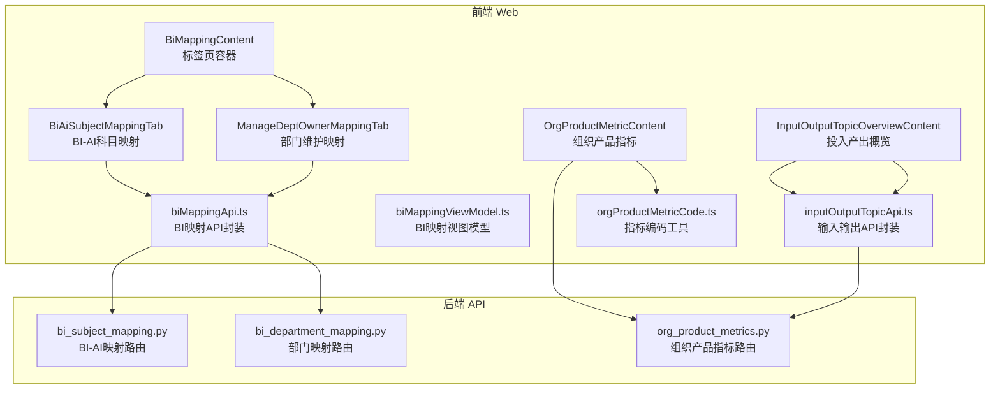
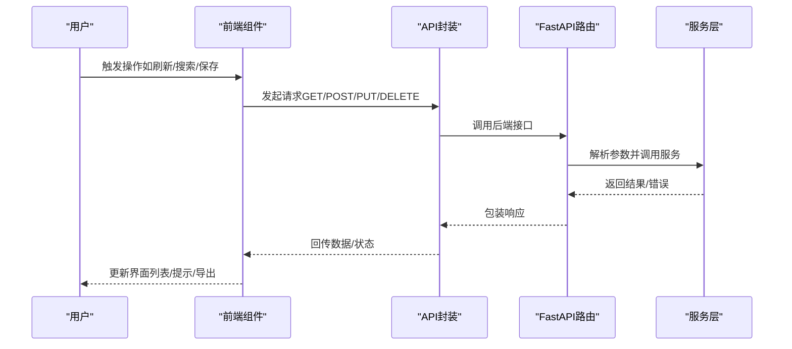
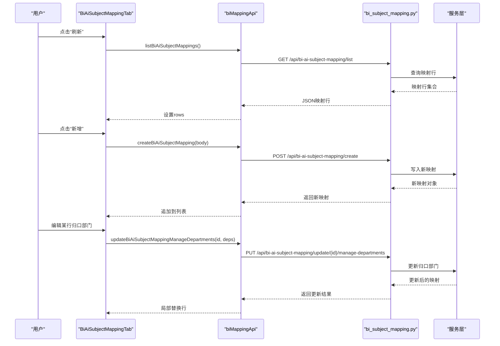
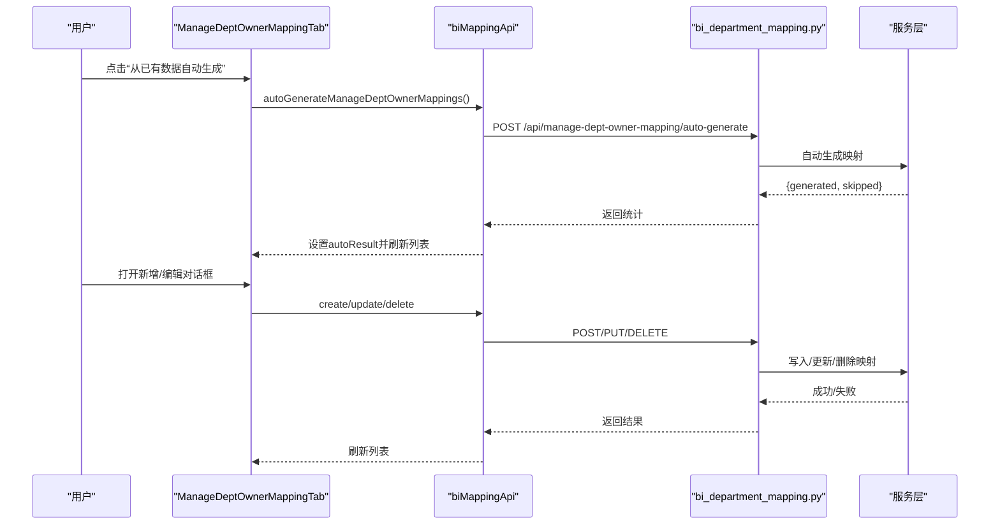
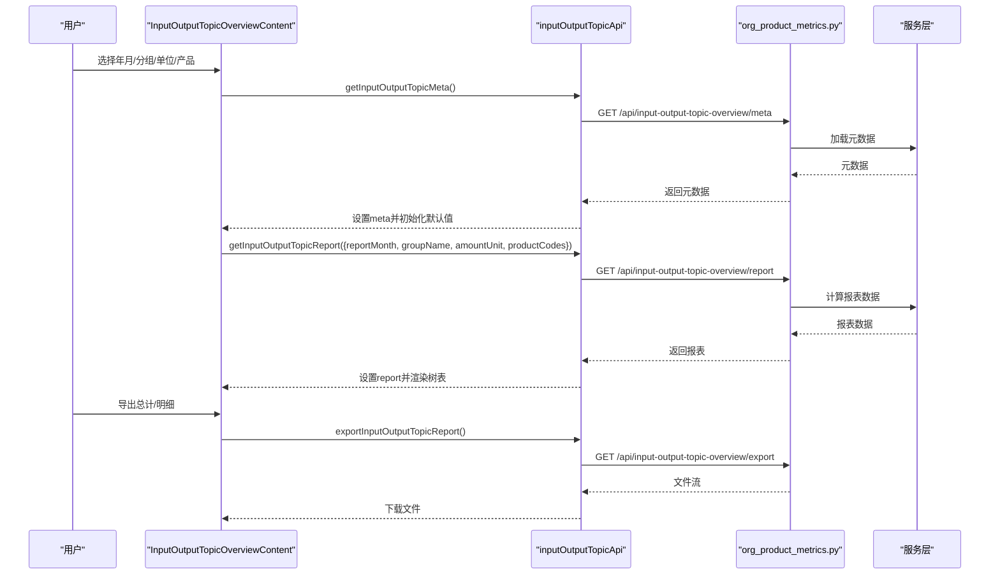
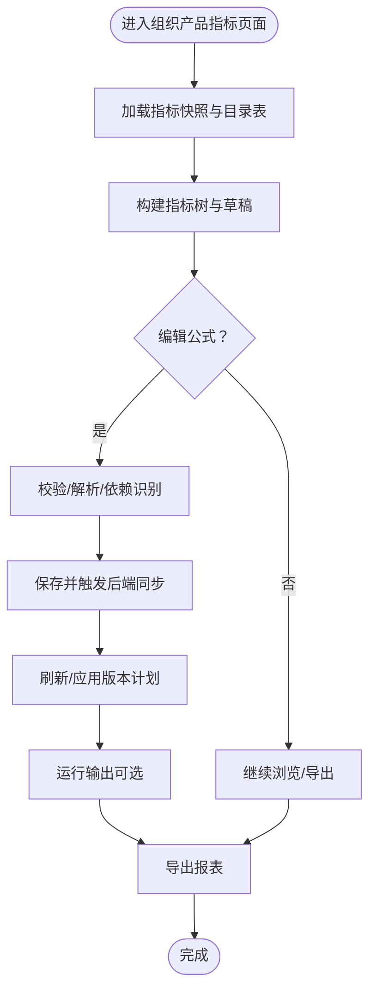
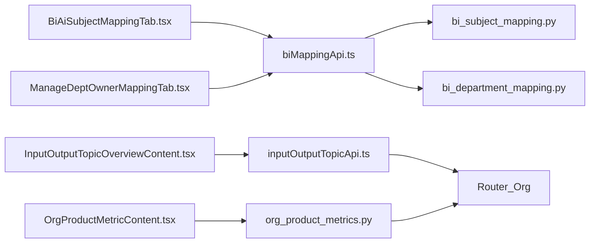

# 商业智能组件

<cite>
**本文引用的文件**
- [apps/web/src/app/components/BiMappingContent.tsx](file://apps/web/src/app/components/BiMappingContent.tsx)
- [apps/web/src/app/components/BiAiSubjectMappingTab.tsx](file://apps/web/src/app/components/BiAiSubjectMappingTab.tsx)
- [apps/web/src/app/components/ManageDeptOwnerMappingTab.tsx](file://apps/web/src/app/components/ManageDeptOwnerMappingTab.tsx)
- [apps/web/src/app/components/InputOutputTopicOverviewContent.tsx](file://apps/web/src/app/components/InputOutputTopicOverviewContent.tsx)
- [apps/web/src/app/components/OrgProductMetricContent.tsx](file://apps/web/src/app/components/OrgProductMetricContent.tsx)
- [apps/web/src/lib/biMappingApi.ts](file://apps/web/src/lib/biMappingApi.ts)
- [apps/web/src/lib/biMappingViewModel.ts](file://apps/web/src/lib/biMappingViewModel.ts)
- [apps/web/src/lib/inputOutputTopicApi.ts](file://apps/web/src/lib/inputOutputTopicApi.ts)
- [apps/web/src/lib/orgProductMetricCode.ts](file://apps/web/src/lib/orgProductMetricCode.ts)
- [apps/api/app/routers/bi_subject_mapping.py](file://apps/api/app/routers/bi_subject_mapping.py)
- [apps/api/app/routers/bi_department_mapping.py](file://apps/api/app/routers/bi_department_mapping.py)
- [apps/api/app/routers/org_product_metrics.py](file://apps/api/app/routers/org_product_metrics.py)
</cite>

## 目录
1. [简介](#简介)
2. [项目结构](#项目结构)
3. [核心组件](#核心组件)
4. [架构总览](#架构总览)
5. [详细组件分析](#详细组件分析)
6. [依赖分析](#依赖分析)
7. [性能考虑](#性能考虑)
8. [故障排查指南](#故障排查指南)
9. [结论](#结论)
10. [附录](#附录)

## 简介
本文件面向商业智能（BI）相关组件的使用者与维护者，系统性阐述以下能力：
- BI映射内容：包括BI-AI科目映射与归口部门维护两大子功能，覆盖列表、搜索、新建、编辑、按Excel重建等流程。
- AI主题映射标签页：提供BI-AI科目映射的表格视图与交互式编辑体验。
- 部门所有者映射管理：提供“归口部门-费用归属部门”的双向映射与批量自动生成。
- 输入输出主题概览：围绕投入产出专题的指标、输入、输出三类细项进行树形展示、月份序列对比与导出。
- 组织产品指标组件：围绕机构与产品维度的指标树、公式引擎、版本与快照、导入导出与运行输出。

文档同时给出组件的映射配置、数据关联与可视化展示方法，提供端到端的使用示例与代码片段路径，并说明与BI系统API的集成方式与数据同步策略。

## 项目结构
前端采用React组件与类型定义分离的组织方式，后端以FastAPI路由封装服务层接口。BI映射与输入输出概览分别对应独立页面组件，组织产品指标组件提供指标树与公式编辑能力。

**图表来源**
- [apps/web/src/app/components/BiMappingContent.tsx:1-37](file://apps/web/src/app/components/BiMappingContent.tsx#L1-L37)
- [apps/web/src/app/components/BiAiSubjectMappingTab.tsx:1-449](file://apps/web/src/app/components/BiAiSubjectMappingTab.tsx#L1-L449)
- [apps/web/src/app/components/ManageDeptOwnerMappingTab.tsx:1-357](file://apps/web/src/app/components/ManageDeptOwnerMappingTab.tsx#L1-L357)
- [apps/web/src/app/components/InputOutputTopicOverviewContent.tsx:1-800](file://apps/web/src/app/components/InputOutputTopicOverviewContent.tsx#L1-L800)
- [apps/web/src/app/components/OrgProductMetricContent.tsx:1-200](file://apps/web/src/app/components/OrgProductMetricContent.tsx#L1-L200)
- [apps/web/src/lib/biMappingApi.ts:1-111](file://apps/web/src/lib/biMappingApi.ts#L1-L111)
- [apps/web/src/lib/biMappingViewModel.ts:1-129](file://apps/web/src/lib/biMappingViewModel.ts#L1-L129)
- [apps/web/src/lib/inputOutputTopicApi.ts:1-127](file://apps/web/src/lib/inputOutputTopicApi.ts#L1-L127)
- [apps/web/src/lib/orgProductMetricCode.ts:1-30](file://apps/web/src/lib/orgProductMetricCode.ts#L1-L30)
- [apps/api/app/routers/bi_subject_mapping.py:1-96](file://apps/api/app/routers/bi_subject_mapping.py#L1-L96)
- [apps/api/app/routers/bi_department_mapping.py:1-50](file://apps/api/app/routers/bi_department_mapping.py#L1-L50)
- [apps/api/app/routers/org_product_metrics.py:1-800](file://apps/api/app/routers/org_product_metrics.py#L1-L800)

**章节来源**
- [apps/web/src/app/components/BiMappingContent.tsx:1-37](file://apps/web/src/app/components/BiMappingContent.tsx#L1-L37)
- [apps/web/src/app/components/BiAiSubjectMappingTab.tsx:1-449](file://apps/web/src/app/components/BiAiSubjectMappingTab.tsx#L1-L449)
- [apps/web/src/app/components/ManageDeptOwnerMappingTab.tsx:1-357](file://apps/web/src/app/components/ManageDeptOwnerMappingTab.tsx#L1-L357)
- [apps/web/src/app/components/InputOutputTopicOverviewContent.tsx:1-800](file://apps/web/src/app/components/InputOutputTopicOverviewContent.tsx#L1-L800)
- [apps/web/src/app/components/OrgProductMetricContent.tsx:1-200](file://apps/web/src/app/components/OrgProductMetricContent.tsx#L1-L200)

## 核心组件
- BI映射内容容器：负责在“BI-AI科目映射表”和“BI部门维护”两个标签页之间切换。
- BI-AI科目映射：提供列表、搜索、刷新、新增、按Excel重建、归口部门编辑等能力。
- 部门所有者映射：提供列表、搜索、刷新、自动生成、新增/编辑/删除映射、费用归属部门选择器等能力。
- 输入输出主题概览：提供实体/产品/年份/单位等筛选，树形表格展示指标、输入、输出三类细项，支持月份序列展开/收起与导出。
- 组织产品指标：提供指标树、公式编辑、版本与快照、导入导出、运行输出等能力。

**章节来源**
- [apps/web/src/app/components/BiMappingContent.tsx:5-36](file://apps/web/src/app/components/BiMappingContent.tsx#L5-L36)
- [apps/web/src/app/components/BiAiSubjectMappingTab.tsx:297-448](file://apps/web/src/app/components/BiAiSubjectMappingTab.tsx#L297-L448)
- [apps/web/src/app/components/ManageDeptOwnerMappingTab.tsx:25-356](file://apps/web/src/app/components/ManageDeptOwnerMappingTab.tsx#L25-L356)
- [apps/web/src/app/components/InputOutputTopicOverviewContent.tsx:233-800](file://apps/web/src/app/components/InputOutputTopicOverviewContent.tsx#L233-L800)
- [apps/web/src/app/components/OrgProductMetricContent.tsx:1118-1121](file://apps/web/src/app/components/OrgProductMetricContent.tsx#L1118-L1121)

## 架构总览
前端通过API封装模块调用后端路由，后端路由委托服务层处理业务逻辑。BI映射与输入输出概览分别对应独立的API域，组织产品指标路由覆盖更广的数据与公式处理能力。

**图表来源**
- [apps/web/src/lib/biMappingApi.ts:58-110](file://apps/web/src/lib/biMappingApi.ts#L58-L110)
- [apps/web/src/lib/inputOutputTopicApi.ts:106-126](file://apps/web/src/lib/inputOutputTopicApi.ts#L106-L126)
- [apps/api/app/routers/bi_subject_mapping.py:42-94](file://apps/api/app/routers/bi_subject_mapping.py#L42-L94)
- [apps/api/app/routers/bi_department_mapping.py:16-47](file://apps/api/app/routers/bi_department_mapping.py#L16-L47)
- [apps/api/app/routers/org_product_metrics.py:1-800](file://apps/api/app/routers/org_product_metrics.py#L1-L800)

## 详细组件分析

### BI映射内容与AI主题映射标签页
- 功能要点
  - 标签页切换：在“BI-AI科目映射表”和“BI部门维护”之间切换。
  - BI-AI科目映射表：支持关键词搜索、刷新、新增、按Excel重建、归口部门多选编辑。
  - 归口部门编辑：弹出面板支持全选/清空/恢复默认、点击外部关闭、保存状态反馈。
  - 新增映射：表单字段包含五级/六级编码与名称、预算发布口径、费用类别/大类，以及归口部门多选。
- 数据流
  - 列表与参考数据并行加载，确保表格与下拉选项一致。
  - 更新归口部门触发PUT请求，成功后局部刷新行数据。
  - 新增映射提交表单，成功后追加到列表。
  - 按Excel重建触发POST请求，完成后重新加载并提示重建来源与条数。
- 关键API
  - 列表、参考数据、创建、更新归口部门、重建：见“BI映射API封装”。

**图表来源**
- [apps/web/src/app/components/BiAiSubjectMappingTab.tsx:305-345](file://apps/web/src/app/components/BiAiSubjectMappingTab.tsx#L305-L345)
- [apps/web/src/lib/biMappingApi.ts:87-110](file://apps/web/src/lib/biMappingApi.ts#L87-L110)
- [apps/api/app/routers/bi_subject_mapping.py:42-94](file://apps/api/app/routers/bi_subject_mapping.py#L42-L94)

**章节来源**
- [apps/web/src/app/components/BiMappingContent.tsx:5-36](file://apps/web/src/app/components/BiMappingContent.tsx#L5-L36)
- [apps/web/src/app/components/BiAiSubjectMappingTab.tsx:297-448](file://apps/web/src/app/components/BiAiSubjectMappingTab.tsx#L297-L448)
- [apps/web/src/lib/biMappingApi.ts:87-110](file://apps/web/src/lib/biMappingApi.ts#L87-L110)
- [apps/api/app/routers/bi_subject_mapping.py:42-94](file://apps/api/app/routers/bi_subject_mapping.py#L42-L94)

### 部门所有者映射管理
- 功能要点
  - 列表展示：按事业群分组、费用归属部门聚合、归口部门列表。
  - 自动生成：基于现有数据生成映射，返回新增与跳过数量。
  - 新增/编辑：支持费用归属部门下拉或“其他（手动输入）”，归口部门支持模糊搜索与分组展示。
  - 删除：确认后移除映射。
- 数据流
  - 参考数据与部门账户并行加载，构建实体-事业群-部门树。
  - 保存时校验必填，区分新增与编辑两种路径。
  - 自动生成功能返回统计结果并在刷新后呈现。

**图表来源**
- [apps/web/src/app/components/ManageDeptOwnerMappingTab.tsx:123-127](file://apps/web/src/app/components/ManageDeptOwnerMappingTab.tsx#L123-L127)
- [apps/web/src/lib/biMappingApi.ts:58-81](file://apps/web/src/lib/biMappingApi.ts#L58-L81)
- [apps/api/app/routers/bi_department_mapping.py:16-47](file://apps/api/app/routers/bi_department_mapping.py#L16-L47)

**章节来源**
- [apps/web/src/app/components/ManageDeptOwnerMappingTab.tsx:25-356](file://apps/web/src/app/components/ManageDeptOwnerMappingTab.tsx#L25-L356)
- [apps/web/src/lib/biMappingApi.ts:58-81](file://apps/web/src/lib/biMappingApi.ts#L58-L81)
- [apps/api/app/routers/bi_department_mapping.py:16-47](file://apps/api/app/routers/bi_department_mapping.py#L16-L47)

### 输入输出主题概览
- 功能要点
  - 元数据加载：实体、产品、年份、单位等选项，本地持久化产品范围。
  - 报表加载：按年月、分组、单位、产品集合请求报表，支持总计/明细视图。
  - 树形表格：评估指标、业务投入、业务产出三类细项，支持展开/收起、月份序列切换。
  - 导出：支持导出总计或明细视图为Excel。
- 数据流
  - 元数据与指标快照并行加载，解析指标引用与数据账户映射。
  - 选择产品范围、年份、单位后触发报表请求，渲染树形表格。
  - 支持按需展开/收起父节点，控制实际/同比月份列显隐。

**图表来源**
- [apps/web/src/app/components/InputOutputTopicOverviewContent.tsx:338-418](file://apps/web/src/app/components/InputOutputTopicOverviewContent.tsx#L338-L418)
- [apps/web/src/lib/inputOutputTopicApi.ts:106-126](file://apps/web/src/lib/inputOutputTopicApi.ts#L106-L126)
- [apps/api/app/routers/org_product_metrics.py:1-800](file://apps/api/app/routers/org_product_metrics.py#L1-L800)

**章节来源**
- [apps/web/src/app/components/InputOutputTopicOverviewContent.tsx:233-800](file://apps/web/src/app/components/InputOutputTopicOverviewContent.tsx#L233-L800)
- [apps/web/src/lib/inputOutputTopicApi.ts:106-126](file://apps/web/src/lib/inputOutputTopicApi.ts#L106-L126)
- [apps/api/app/routers/org_product_metrics.py:1-800](file://apps/api/app/routers/org_product_metrics.py#L1-L800)

### 组织产品指标组件
- 功能要点
  - 指标树：支持按实体/产品维度的树形结构，支持展开/折叠、搜索、导入/导出、保存/刷新。
  - 公式引擎：提供公式文本规范化、解析、依赖识别、显示装饰、验证与插入等功能。
  - 版本与快照：支持数据库快照读取、版本计划与应用、目录表管理。
  - 运行输出：支持按实体/年/版本/表运行输出，支持提交与强制覆盖。
- 数据流
  - 通过API获取指标快照与目录表，构建本地树与草稿。
  - 公式编辑与校验在前端完成，保存后触发后端同步与刷新。
  - 导入Excel时进行公式转换与错误收集，导出时生成多工作表。

**图表来源**
- [apps/web/src/app/components/OrgProductMetricContent.tsx:1118-1121](file://apps/web/src/app/components/OrgProductMetricContent.tsx#L1118-L1121)
- [apps/web/src/lib/orgProductMetricCode.ts:5-28](file://apps/web/src/lib/orgProductMetricCode.ts#L5-L28)
- [apps/api/app/routers/org_product_metrics.py:1-800](file://apps/api/app/routers/org_product_metrics.py#L1-L800)

**章节来源**
- [apps/web/src/app/components/OrgProductMetricContent.tsx:1-200](file://apps/web/src/app/components/OrgProductMetricContent.tsx#L1-L200)
- [apps/web/src/lib/orgProductMetricCode.ts:1-30](file://apps/web/src/lib/orgProductMetricCode.ts#L1-L30)
- [apps/api/app/routers/org_product_metrics.py:1-800](file://apps/api/app/routers/org_product_metrics.py#L1-L800)

## 依赖分析
- 组件内聚与耦合
  - BI映射相关组件高内聚于biMappingApi与biMappingViewModel，职责清晰：API封装负责网络请求，视图模型负责过滤与分组。
  - 输入输出概览组件与API封装紧密耦合，通过URL参数传递筛选条件，后端路由统一处理。
  - 组织产品指标组件与后端路由耦合度较高，涉及大量数据结构与公式处理。
- 外部依赖
  - 前端依赖：React Hooks、Lucide图标、本地存储（localStorage）、下载文件。
  - 后端依赖：FastAPI、SQLite、openpyxl、公式AST解析。

**图表来源**
- [apps/web/src/app/components/BiAiSubjectMappingTab.tsx:1-12](file://apps/web/src/app/components/BiAiSubjectMappingTab.tsx#L1-L12)
- [apps/web/src/app/components/ManageDeptOwnerMappingTab.tsx:1-13](file://apps/web/src/app/components/ManageDeptOwnerMappingTab.tsx#L1-L13)
- [apps/web/src/lib/biMappingApi.ts:1-111](file://apps/web/src/lib/biMappingApi.ts#L1-L111)
- [apps/web/src/lib/inputOutputTopicApi.ts:1-127](file://apps/web/src/lib/inputOutputTopicApi.ts#L1-L127)
- [apps/api/app/routers/bi_subject_mapping.py:1-96](file://apps/api/app/routers/bi_subject_mapping.py#L1-L96)
- [apps/api/app/routers/bi_department_mapping.py:1-50](file://apps/api/app/routers/bi_department_mapping.py#L1-L50)
- [apps/api/app/routers/org_product_metrics.py:1-800](file://apps/api/app/routers/org_product_metrics.py#L1-L800)

**章节来源**
- [apps/web/src/lib/biMappingViewModel.ts:1-129](file://apps/web/src/lib/biMappingViewModel.ts#L1-L129)
- [apps/web/src/lib/biMappingApi.ts:1-111](file://apps/web/src/lib/biMappingApi.ts#L1-L111)
- [apps/web/src/lib/inputOutputTopicApi.ts:1-127](file://apps/web/src/lib/inputOutputTopicApi.ts#L1-L127)
- [apps/api/app/routers/bi_subject_mapping.py:1-96](file://apps/api/app/routers/bi_subject_mapping.py#L1-L96)
- [apps/api/app/routers/bi_department_mapping.py:1-50](file://apps/api/app/routers/bi_department_mapping.py#L1-L50)
- [apps/api/app/routers/org_product_metrics.py:1-800](file://apps/api/app/routers/org_product_metrics.py#L1-L800)

## 性能考虑
- 并行加载：BI-AI映射与参考数据、输入输出概览的元数据与报表数据均采用Promise.all并行请求，减少等待时间。
- 本地缓存：输入输出概览将产品范围持久化至localStorage，避免重复选择。
- 虚拟滚动与懒渲染：建议在大型表格场景引入虚拟滚动与按需展开，降低DOM压力。
- 导出优化：后端导出使用流式响应，前端下载时注意内存占用与超时处理。

[本节为通用指导，无需特定文件引用]

## 故障排查指南
- BI-AI科目映射重建失败
  - 现象：点击“按Excel重建”后弹窗提示失败。
  - 排查：检查源文件是否存在、表头是否正确、后端是否抛出“源缺失/表头错误”异常。
  - 参考：后端路由对不同异常返回HTTP 404/400。
- 归口部门保存失败
  - 现象：编辑归口部门后提示保存失败。
  - 排查：确认请求体字段、后端服务层是否抛出“未找到/更新错误”。
- 输入输出概览加载失败
  - 现象：切换筛选条件后无数据或报错。
  - 排查：检查reportMonth、amountUnit、productCodes参数是否有效；后端是否返回空集或异常。
- 组织产品指标导入失败
  - 现象：上传Excel后出现公式转换错误或忽略明细。
  - 排查：查看导入响应中的错误详情，修正公式格式或表名别名。

**章节来源**
- [apps/api/app/routers/bi_subject_mapping.py:46-93](file://apps/api/app/routers/bi_subject_mapping.py#L46-L93)
- [apps/api/app/routers/bi_department_mapping.py:9-11](file://apps/api/app/routers/bi_department_mapping.py#L9-L11)
- [apps/web/src/lib/inputOutputTopicApi.ts:106-126](file://apps/web/src/lib/inputOutputTopicApi.ts#L106-L126)

## 结论
上述组件共同构成了商业智能领域的映射、概览与指标体系：BI映射保障科目与部门的准确关联，输入输出概览提供多维对比与导出能力，组织产品指标则支撑复杂的公式与版本管理。通过前后端清晰的职责划分与API契约，系统实现了良好的扩展性与可维护性。

[本节为总结，无需特定文件引用]

## 附录

### 使用示例与代码片段路径
- BI-AI科目映射：刷新/搜索/新增/按Excel重建/编辑归口部门
  - 刷新与重建：[apps/web/src/app/components/BiAiSubjectMappingTab.tsx:305-345](file://apps/web/src/app/components/BiAiSubjectMappingTab.tsx#L305-L345)
  - 新增映射表单：[apps/web/src/app/components/BiAiSubjectMappingTab.tsx:181-295](file://apps/web/src/app/components/BiAiSubjectMappingTab.tsx#L181-L295)
  - 编辑归口部门：[apps/web/src/app/components/BiAiSubjectMappingTab.tsx:20-168](file://apps/web/src/app/components/BiAiSubjectMappingTab.tsx#L20-L168)
- 部门维护映射：自动生成/新增/编辑/删除
  - 自动生成与保存：[apps/web/src/app/components/ManageDeptOwnerMappingTab.tsx:123-127](file://apps/web/src/app/components/ManageDeptOwnerMappingTab.tsx#L123-L127)
  - 对话框与选择器：[apps/web/src/app/components/ManageDeptOwnerMappingTab.tsx:215-356](file://apps/web/src/app/components/ManageDeptOwnerMappingTab.tsx#L215-L356)
- 输入输出概览：元数据加载/报表请求/导出
  - 元数据与报表：[apps/web/src/app/components/InputOutputTopicOverviewContent.tsx:338-418](file://apps/web/src/app/components/InputOutputTopicOverviewContent.tsx#L338-L418)
  - 导出：[apps/web/src/lib/inputOutputTopicApi.ts:118-126](file://apps/web/src/lib/inputOutputTopicApi.ts#L118-L126)
- 组织产品指标：指标树与公式
  - 页面入口与存储：[apps/web/src/app/components/OrgProductMetricContent.tsx:1118-1121](file://apps/web/src/app/components/OrgProductMetricContent.tsx#L1118-L1121)
  - 指标编码转换：[apps/web/src/lib/orgProductMetricCode.ts:5-28](file://apps/web/src/lib/orgProductMetricCode.ts#L5-L28)

**章节来源**
- [apps/web/src/app/components/BiAiSubjectMappingTab.tsx:181-295](file://apps/web/src/app/components/BiAiSubjectMappingTab.tsx#L181-L295)
- [apps/web/src/app/components/ManageDeptOwnerMappingTab.tsx:215-356](file://apps/web/src/app/components/ManageDeptOwnerMappingTab.tsx#L215-L356)
- [apps/web/src/lib/inputOutputTopicApi.ts:118-126](file://apps/web/src/lib/inputOutputTopicApi.ts#L118-L126)
- [apps/web/src/lib/orgProductMetricCode.ts:5-28](file://apps/web/src/lib/orgProductMetricCode.ts#L5-L28)
- [apps/web/src/app/components/OrgProductMetricContent.tsx:1118-1121](file://apps/web/src/app/components/OrgProductMetricContent.tsx#L1118-L1121)