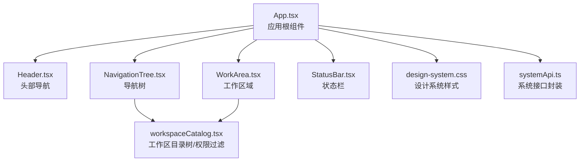
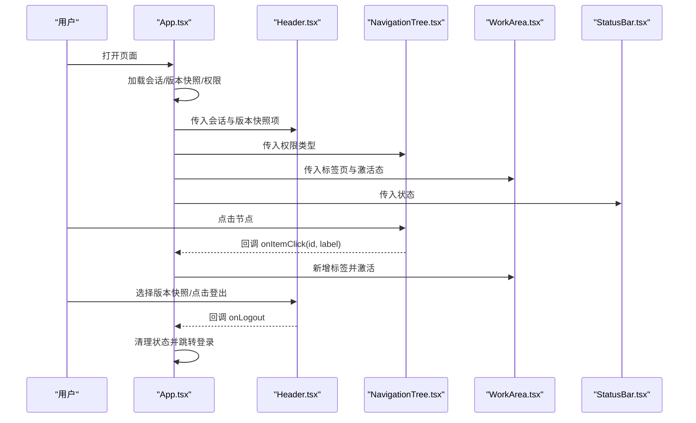
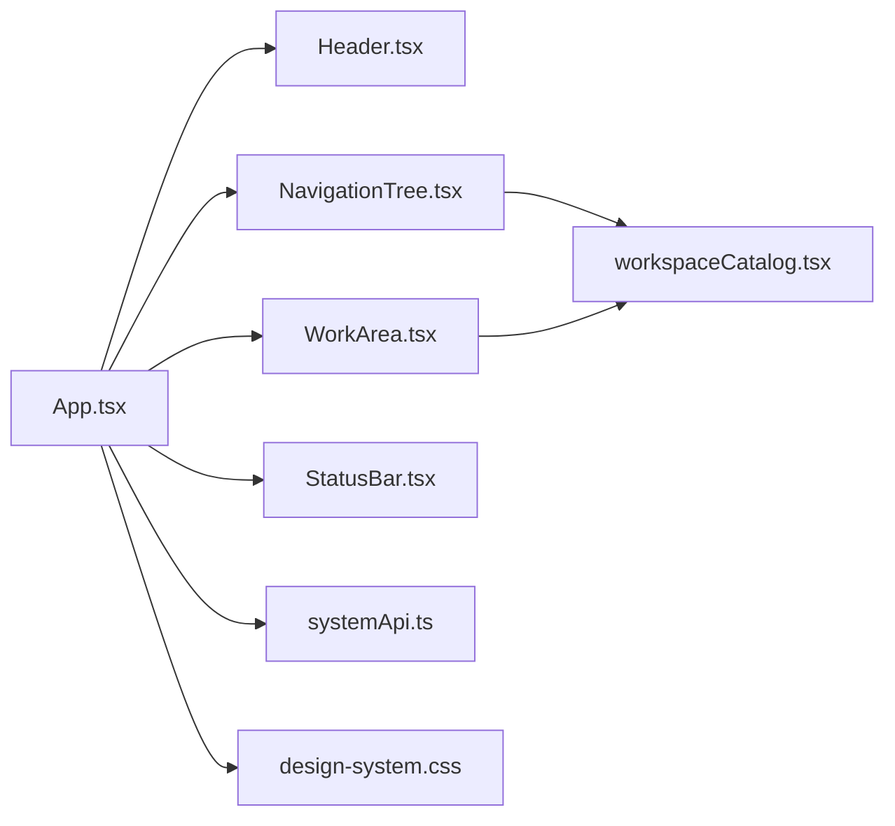

# 导航组件

<cite>
**本文档引用的文件**
- [App.tsx](file://apps/web/src/app/App.tsx)
- [Header.tsx](file://apps/web/src/app/components/Header.tsx)
- [NavigationTree.tsx](file://apps/web/src/app/components/NavigationTree.tsx)
- [WorkArea.tsx](file://apps/web/src/app/components/WorkArea.tsx)
- [StatusBar.tsx](file://apps/web/src/app/components/StatusBar.tsx)
- [workspaceCatalog.tsx](file://apps/web/src/app/workspaceCatalog.tsx)
- [design-system.css](file://apps/web/src/styles/design-system.css)
- [systemApi.ts](file://apps/web/src/lib/systemApi.ts)
</cite>

## 目录
1. [简介](#简介)
2. [项目结构](#项目结构)
3. [核心组件](#核心组件)
4. [架构总览](#架构总览)
5. [组件详解](#组件详解)
6. [依赖关系分析](#依赖关系分析)
7. [性能考量](#性能考量)
8. [故障排查指南](#故障排查指南)
9. [结论](#结论)
10. [附录](#附录)

## 简介
本文件聚焦于前端导航体系，覆盖头部导航、导航树、状态栏与工作区域四大组件的实现与使用方法。内容包括：
- 组件属性配置与事件处理
- 状态管理与数据流
- 布局设计与交互模式
- 组件间通信与数据传递
- 响应式与移动端适配策略
- 集成示例与最佳实践

## 项目结构
导航组件位于 Web 前端应用中，采用分层组织：
- 应用根组件负责全局状态与布局编排
- 头部导航、导航树、工作区、状态栏为独立 UI 组件
- 工作区模块渲染由工作区目录树与权限过滤共同决定
- 样式系统通过设计系统 CSS 类名统一风格

图表来源
- [App.tsx:35-520](file://apps/web/src/app/App.tsx#L35-L520)
- [Header.tsx:25-94](file://apps/web/src/app/components/Header.tsx#L25-L94)
- [NavigationTree.tsx:53-71](file://apps/web/src/app/components/NavigationTree.tsx#L53-L71)
- [WorkArea.tsx:18-152](file://apps/web/src/app/components/WorkArea.tsx#L18-L152)
- [StatusBar.tsx:18-103](file://apps/web/src/app/components/StatusBar.tsx#L18-L103)
- [workspaceCatalog.tsx:105-253](file://apps/web/src/app/workspaceCatalog.tsx#L105-L253)
- [design-system.css:74-704](file://apps/web/src/styles/design-system.css#L74-L704)
- [systemApi.ts:103-125](file://apps/web/src/lib/systemApi.ts#L103-L125)

章节来源
- [App.tsx:1-520](file://apps/web/src/app/App.tsx#L1-L520)
- [design-system.css:1-705](file://apps/web/src/styles/design-system.css#L1-L705)

## 核心组件
- 头部导航 Header：展示系统信息、版本快照选择、用户信息与登出
- 导航树 NavigationTree：基于工作区目录树与权限过滤的层级导航
- 工作区域 WorkArea：多标签页容器与模块渲染区
- 状态栏 StatusBar：数据库连接状态与全局刷新时间展示

章节来源
- [Header.tsx:25-94](file://apps/web/src/app/components/Header.tsx#L25-L94)
- [NavigationTree.tsx:53-71](file://apps/web/src/app/components/NavigationTree.tsx#L53-L71)
- [WorkArea.tsx:18-152](file://apps/web/src/app/components/WorkArea.tsx#L18-L152)
- [StatusBar.tsx:18-103](file://apps/web/src/app/components/StatusBar.tsx#L18-L103)

## 架构总览
整体采用“根组件编排 + 子组件解耦”的架构：
- 根组件 App 负责认证态、版本快照、权限类型、面板折叠与尺寸、标签页状态等
- 各子组件通过 props 接收数据与回调，保持低耦合
- 工作区模块渲染由目录树与权限过滤共同决定

图表来源
- [App.tsx:165-297](file://apps/web/src/app/App.tsx#L165-L297)
- [Header.tsx:25-94](file://apps/web/src/app/components/Header.tsx#L25-L94)
- [NavigationTree.tsx:53-71](file://apps/web/src/app/components/NavigationTree.tsx#L53-L71)
- [WorkArea.tsx:18-152](file://apps/web/src/app/components/WorkArea.tsx#L18-L152)
- [StatusBar.tsx:18-103](file://apps/web/src/app/components/StatusBar.tsx#L18-L103)

## 组件详解

### 头部导航 Header
- 职责
  - 展示系统标题、软件版本与数据库版本信息
  - 提供版本快照下拉选择（支持从外部注入或回退到会话）
  - 展示当前用户信息与角色
  - 触发登出流程
- 关键属性
  - session: HeaderSession | null
  - versionSnapshotItems: HeaderVersionSnapshotItem[]
  - onLogout: () => void
- 关键行为
  - 选区变化时更新内部索引
  - 无外部快照时回退到会话中的“可编辑版本”
  - 登出时触发回调清理状态
- 交互与样式
  - 使用设计系统类名统一外观
  - 版本快照下拉宽度自适应，支持长文本截断

章节来源
- [Header.tsx:25-94](file://apps/web/src/app/components/Header.tsx#L25-L94)
- [systemApi.ts:103-109](file://apps/web/src/lib/systemApi.ts#L103-L109)

### 导航树 NavigationTree
- 职责
  - 呈现工作区目录树，支持层级展开/收起
  - 根据权限类型过滤不可见节点
  - 点击叶子节点触发回调，用于打开工作区模块
- 关键属性
  - onItemClick?: (id: string, label: string) => void
  - permissionType: number
- 关键行为
  - TreeItem 递归渲染子节点
  - 叶子节点点击触发回调；有子节点时切换展开状态
  - 通过权限过滤函数剔除无权访问的分支
- 交互与样式
  - 左侧缩进与层级相关
  - 诊断性节点高亮提示

章节来源
- [NavigationTree.tsx:9-71](file://apps/web/src/app/components/NavigationTree.tsx#L9-L71)
- [workspaceCatalog.tsx:214-233](file://apps/web/src/app/workspaceCatalog.tsx#L214-L233)

### 工作区域 WorkArea
- 职责
  - 多标签页容器：新增、关闭、重排、激活
  - 模块渲染：根据激活标签从目录树查找并渲染对应模块
  - 无标签时展示欢迎页与业务引导
- 关键属性
  - tabs: Tab[]
  - activeTab: string
  - onTabClick: (id: string) => void
  - onTabClose: (id: string) => void
  - onTabReorder: (id: string) => void
- 关键行为
  - 标签溢出时提供下拉菜单
  - 激活标签变更时触发渲染
  - 关闭激活标签时回退到上一个标签
- 交互与样式
  - 标签栏固定高度，溢出按钮提供下拉菜单
  - 欢迎页提供业务入口与推荐检查顺序

章节来源
- [WorkArea.tsx:18-152](file://apps/web/src/app/components/WorkArea.tsx#L18-L152)
- [workspaceCatalog.tsx:235-252](file://apps/web/src/app/workspaceCatalog.tsx#L235-L252)

### 状态栏 StatusBar
- 职责
  - 展示数据库连接状态
  - 弹出面板展示全局刷新状态详情（年度、对比库、计划刷新时间）
- 关键属性
  - state: StatusBarState
- 关键行为
  - 打开弹窗时异步加载刷新状态
  - 点击文档其他区域自动关闭弹窗
  - 错误与加载状态可视化
- 交互与样式
  - 使用设计系统类名统一外观
  - 弹窗采用悬浮层样式

章节来源
- [StatusBar.tsx:18-103](file://apps/web/src/app/components/StatusBar.tsx#L18-L103)
- [systemApi.ts:123-125](file://apps/web/src/lib/systemApi.ts#L123-L125)

### 工作区目录树与权限过滤
- 结构
  - 以树形结构组织模块，支持图标、诊断标记、权限级别
  - 支持动态渲染模块内容
- 权限
  - 通过 requiredPermission 与用户权限类型进行过滤
  - 无权限的节点与空分支会被剔除
- 渲染
  - 根据激活标签在树中查找并渲染对应模块

章节来源
- [workspaceCatalog.tsx:32-253](file://apps/web/src/app/workspaceCatalog.tsx#L32-L253)

### 设计系统与样式
- 组件外观
  - 顶部栏、状态栏、树面板、标签页等均通过设计系统类名控制
  - 主题色、边框、阴影、圆角等统一管理
- 响应式
  - 标签栏与树面板具备滚动能力，避免布局破坏
  - 弹窗采用绝对定位，不影响主体布局

章节来源
- [design-system.css:74-704](file://apps/web/src/styles/design-system.css#L74-L704)

## 依赖关系分析
- 组件耦合
  - App 对四个子组件均有直接依赖，但通过 props 传递数据与回调，耦合度可控
  - NavigationTree 与 WorkArea 依赖工作区目录树与权限过滤
- 外部依赖
  - systemApi 提供会话、版本快照、登录登出、全局刷新状态等接口
- 事件与通信
  - App 通过回调与自定义事件在组件间传递数据（如打开模块事件）

图表来源
- [App.tsx:1-520](file://apps/web/src/app/App.tsx#L1-L520)
- [systemApi.ts:1-218](file://apps/web/src/lib/systemApi.ts#L1-L218)
- [workspaceCatalog.tsx:1-253](file://apps/web/src/app/workspaceCatalog.tsx#L1-L253)
- [design-system.css:1-705](file://apps/web/src/styles/design-system.css#L1-L705)

章节来源
- [App.tsx:1-520](file://apps/web/src/app/App.tsx#L1-L520)
- [systemApi.ts:1-218](file://apps/web/src/lib/systemApi.ts#L1-L218)

## 性能考量
- 渲染优化
  - NavigationTree 使用 useMemo 控制版本快照列表的计算
  - WorkArea 标签溢出时仅渲染可见与下拉部分
- 状态管理
  - App 集中管理面板折叠、尺寸、标签页与激活态，减少重复渲染
- 异步加载
  - StatusBar 在弹窗打开时才加载刷新状态，避免不必要的请求
- 响应式
  - 树面板与标签栏具备滚动，避免大体量内容导致布局抖动

## 故障排查指南
- 登录态异常
  - 现象：进入页面后反复出现登录界面
  - 排查：检查会话接口是否返回有效数据；确认 App 的会话加载逻辑与错误处理
  - 参考
    - [App.tsx:61-104](file://apps/web/src/app/App.tsx#L61-L104)
    - [systemApi.ts:103-105](file://apps/web/src/lib/systemApi.ts#L103-L105)
- 版本快照为空
  - 现象：头部版本下拉为空
  - 排查：确认版本快照接口返回；若为空，回退到会话中的“可编辑版本”
  - 参考
    - [Header.tsx:40-52](file://apps/web/src/app/components/Header.tsx#L40-L52)
    - [systemApi.ts:107-109](file://apps/web/src/lib/systemApi.ts#L107-L109)
- 权限导致模块不可见
  - 现象：导航树中某些模块缺失
  - 排查：检查用户权限类型与 requiredPermission 的匹配关系
  - 参考
    - [workspaceCatalog.tsx:208-233](file://apps/web/src/app/workspaceCatalog.tsx#L208-L233)
- 状态栏弹窗无法关闭
  - 现象：点击文档其他区域不关闭
  - 排查：确认弹窗关闭的文档事件监听是否正确绑定与解绑
  - 参考
    - [StatusBar.tsx:38-54](file://apps/web/src/app/components/StatusBar.tsx#L38-L54)
- 标签页关闭后无激活标签
  - 现象：关闭最后一个标签后空白
  - 排查：确保关闭逻辑回退到最后一个标签或清空激活态
  - 参考
    - [WorkArea.tsx:185-199](file://apps/web/src/app/components/WorkArea.tsx#L185-L199)

## 结论
该导航体系以 App 为核心编排者，结合 Header、NavigationTree、WorkArea、StatusBar 四大组件，实现了清晰的职责分离与良好的扩展性。通过工作区目录树与权限过滤，系统能够灵活地呈现不同用户的可用模块；通过设计系统样式与响应式布局，确保在桌面与移动端的良好体验。

## 附录

### 组件属性与事件一览
- Header
  - 属性
    - session: HeaderSession | null
    - versionSnapshotItems: HeaderVersionSnapshotItem[]
    - onLogout: () => void
  - 事件
    - 版本快照选择变化
    - 登出按钮点击
- NavigationTree
  - 属性
    - onItemClick?: (id: string, label: string) => void
    - permissionType: number
- WorkArea
  - 属性
    - tabs: Tab[]
    - activeTab: string
    - onTabClick: (id: string) => void
    - onTabClose: (id: string) => void
    - onTabReorder: (id: string) => void
- StatusBar
  - 属性
    - state: StatusBarState

章节来源
- [Header.tsx:25-94](file://apps/web/src/app/components/Header.tsx#L25-L94)
- [NavigationTree.tsx:53-71](file://apps/web/src/app/components/NavigationTree.tsx#L53-L71)
- [WorkArea.tsx:18-152](file://apps/web/src/app/components/WorkArea.tsx#L18-L152)
- [StatusBar.tsx:18-103](file://apps/web/src/app/components/StatusBar.tsx#L18-L103)

### 响应式与移动端适配要点
- 面板折叠
  - 左侧导航与右侧助手均可折叠，折叠时保留最小宽度按钮区
- 标签溢出
  - 标签超过阈值后隐藏至下拉菜单，避免标签栏换行
- 弹窗定位
  - 状态栏弹窗采用绝对定位，避免影响主体布局
- 字体与间距
  - 使用设计系统变量控制字号与间距，保证在小屏设备上的可读性

章节来源
- [App.tsx:397-518](file://apps/web/src/app/App.tsx#L397-L518)
- [WorkArea.tsx:24-32](file://apps/web/src/app/components/WorkArea.tsx#L24-L32)
- [StatusBar.tsx:64-98](file://apps/web/src/app/components/StatusBar.tsx#L64-L98)
- [design-system.css:24-33](file://apps/web/src/styles/design-system.css#L24-L33)