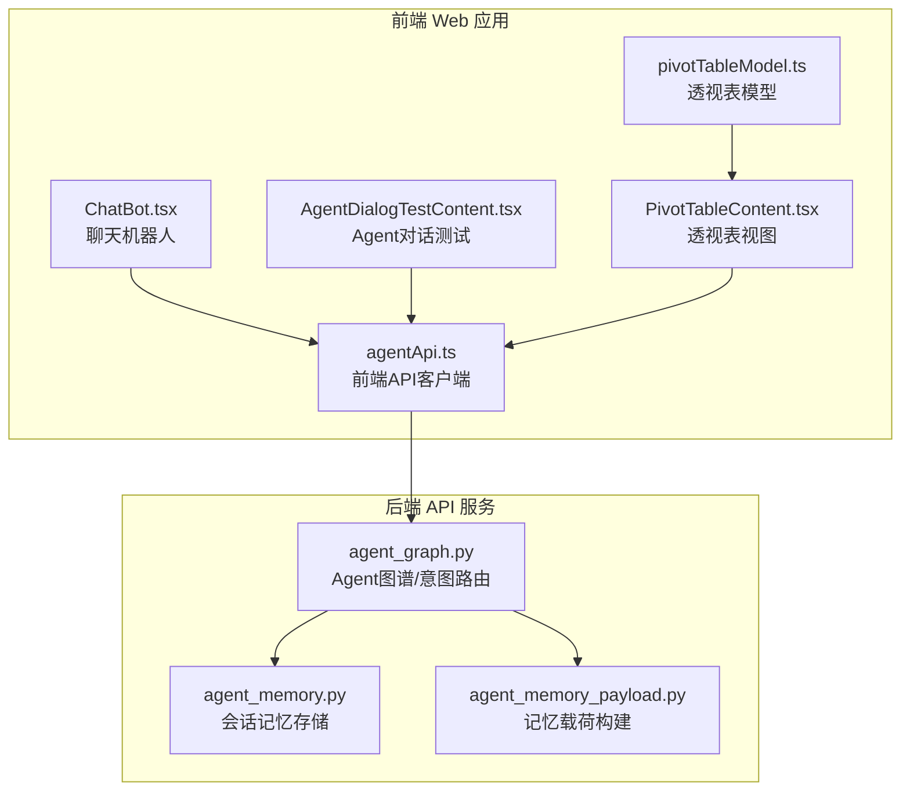
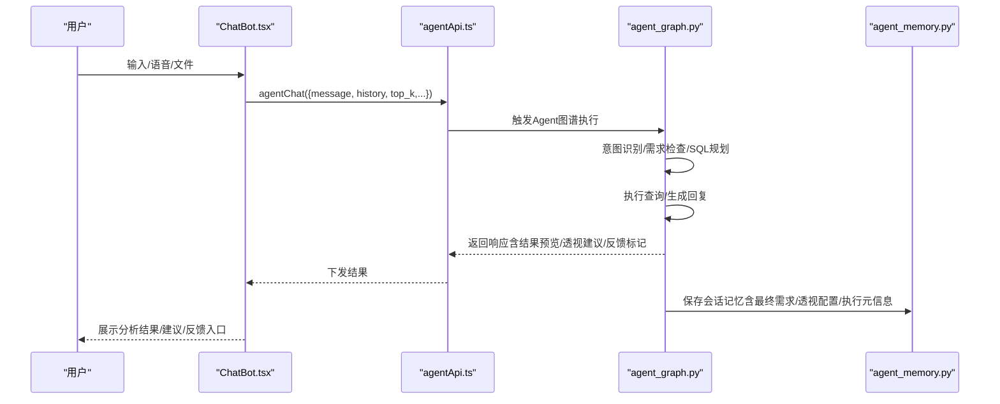
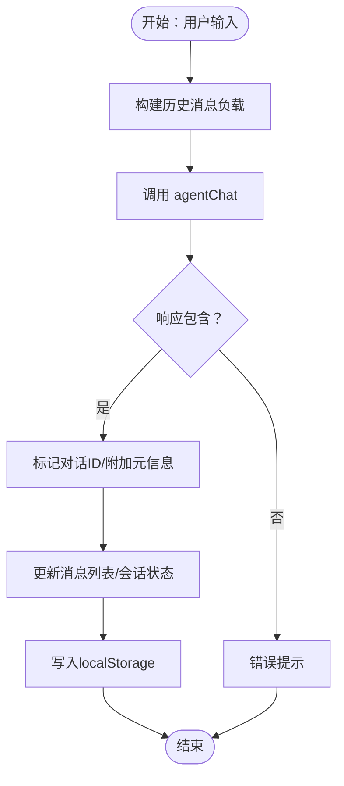
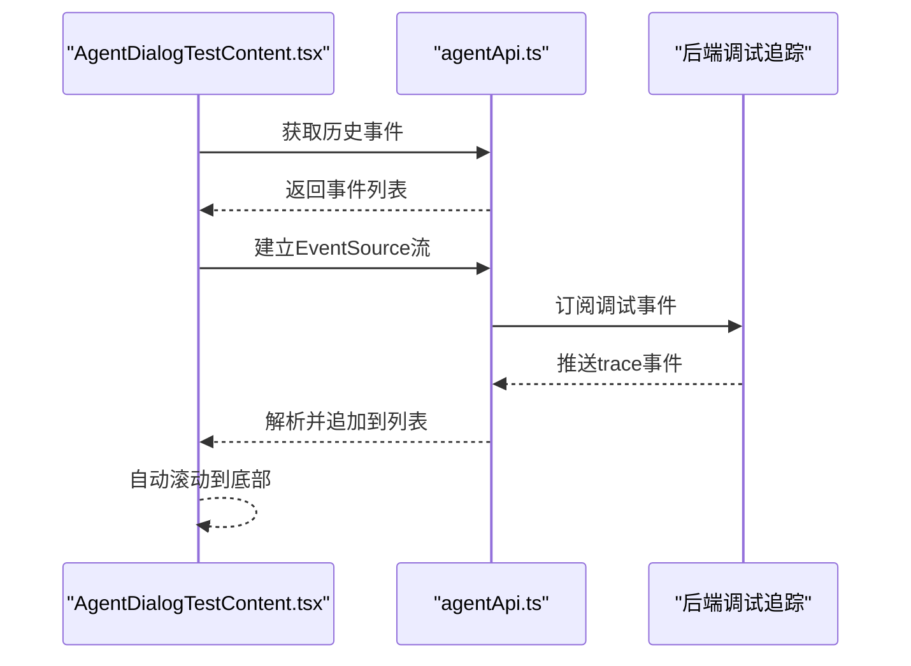
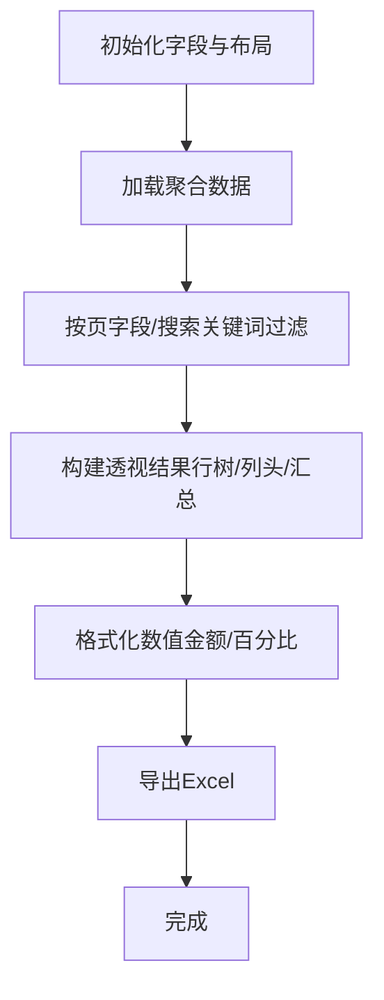
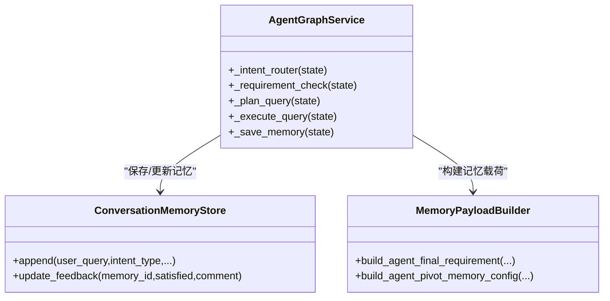
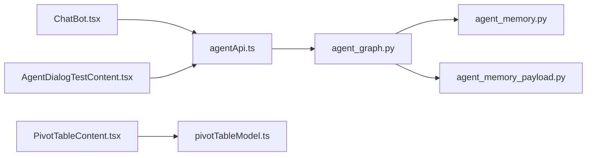

# 工具组件

<cite>
**本文引用的文件**
- [ChatBot.tsx](file://apps/web/src/app/components/ChatBot.tsx)
- [AgentDialogTestContent.tsx](file://apps/web/src/app/components/AgentDialogTestContent.tsx)
- [pivotTableModel.ts](file://apps/web/src/app/components/pivotTableModel.ts)
- [PivotTableContent.tsx](file://apps/web/src/app/components/PivotTableContent.tsx)
- [agentApi.ts](file://apps/web/src/lib/agentApi.ts)
- [agent_graph.py](file://apps/api/app/agent_graph.py)
- [agent_memory.py](file://apps/api/app/agent_memory.py)
- [agent_memory_payload.py](file://apps/api/app/services/agent_memory_payload.py)
- [test_agent_memory_payload.py](file://apps/api/test_agent_memory_payload.py)
</cite>

## 目录
1. [简介](#简介)
2. [项目结构](#项目结构)
3. [核心组件](#核心组件)
4. [架构总览](#架构总览)
5. [详细组件分析](#详细组件分析)
6. [依赖分析](#依赖分析)
7. [性能考虑](#性能考虑)
8. [故障排查指南](#故障排查指南)
9. [结论](#结论)
10. [附录](#附录)

## 简介
本文件系统性梳理“工具组件”的设计与实现，重点覆盖以下方面：
- 聊天机器人：用户与Agent的自然语言交互、多模态输入（文本/语音）、对话状态管理、反馈闭环与本地持久化。
- Agent对话测试：实时调试流、事件回放、清空与导出能力，便于开发与运维验证。
- 透视表模型：多维聚合数据建模、字段拖拽布局、搜索过滤、汇总计算与导出。

通过前后端协作，组件实现了“智能问答—对话管理—数据处理”的闭环，既满足预算分析的强业务场景，又具备良好的扩展性与可观测性。

## 项目结构
工具组件主要分布在前端Web应用与后端API服务两大侧：
- 前端（React + TypeScript）
  - 聊天机器人UI与会话管理：ChatBot.tsx
  - Agent对话测试面板：AgentDialogTestContent.tsx
  - 透视表UI与数据模型：PivotTableContent.tsx、pivotTableModel.ts
  - 前端API客户端：agentApi.ts
- 后端（Python + FastAPI）
  - Agent图谱与意图路由：agent_graph.py
  - 会话记忆存储：agent_memory.py
  - 记忆载荷构建：agent_memory_payload.py
  - 单元测试：test_agent_memory_payload.py

图表来源
- [ChatBot.tsx:250-775](file://apps/web/src/app/components/ChatBot.tsx#L250-L775)
- [AgentDialogTestContent.tsx:62-202](file://apps/web/src/app/components/AgentDialogTestContent.tsx#L62-L202)
- [PivotTableContent.tsx:51-800](file://apps/web/src/app/components/PivotTableContent.tsx#L51-L800)
- [pivotTableModel.ts:1-416](file://apps/web/src/app/components/pivotTableModel.ts#L1-L416)
- [agentApi.ts:55-101](file://apps/web/src/lib/agentApi.ts#L55-L101)
- [agent_graph.py:148-800](file://apps/api/app/agent_graph.py#L148-L800)
- [agent_memory.py:14-91](file://apps/api/app/agent_memory.py#L14-L91)
- [agent_memory_payload.py:1-200](file://apps/api/app/services/agent_memory_payload.py#L1-L200)

章节来源
- [ChatBot.tsx:250-775](file://apps/web/src/app/components/ChatBot.tsx#L250-L775)
- [AgentDialogTestContent.tsx:62-202](file://apps/web/src/app/components/AgentDialogTestContent.tsx#L62-L202)
- [PivotTableContent.tsx:51-800](file://apps/web/src/app/components/PivotTableContent.tsx#L51-L800)
- [pivotTableModel.ts:1-416](file://apps/web/src/app/components/pivotTableModel.ts#L1-L416)
- [agentApi.ts:55-101](file://apps/web/src/lib/agentApi.ts#L55-L101)
- [agent_graph.py:148-800](file://apps/api/app/agent_graph.py#L148-L800)
- [agent_memory.py:14-91](file://apps/api/app/agent_memory.py#L14-L91)
- [agent_memory_payload.py:1-200](file://apps/api/app/services/agent_memory_payload.py#L1-L200)

## 核心组件
- 聊天机器人（ChatBot）
  - 支持文本输入、语音识别/电话模式、文件解析、智能模板、历史会话、反馈打分、多轮澄清与对话状态持久化。
  - 关键流程：发送消息 → 调用后端Agent → 接收响应（含结果预览、透视建议、回复选项）→ 更新UI与本地存储。
- Agent对话测试（AgentDialogTestContent）
  - 实时订阅后端调试事件流，支持历史加载、清空、滚动定位与错误提示。
- 透视表模型（PivotTableContent + pivotTableModel）
  - 字段拖拽布局、页/行/列/值分区、搜索过滤、汇总计算、导出Excel。
  - 数据模型负责行树构建、列头聚合、值格式化与总计统计。

章节来源
- [ChatBot.tsx:41-150](file://apps/web/src/app/components/ChatBot.tsx#L41-L150)
- [AgentDialogTestContent.tsx:62-139](file://apps/web/src/app/components/AgentDialogTestContent.tsx#L62-L139)
- [PivotTableContent.tsx:51-228](file://apps/web/src/app/components/PivotTableContent.tsx#L51-L228)
- [pivotTableModel.ts:15-120](file://apps/web/src/app/components/pivotTableModel.ts#L15-L120)

## 架构总览
前端通过agentApi.ts与后端FastAPI交互，后端以agent_graph.py为核心，串联意图识别、需求提取、SQL规划、执行与回复生成，并将分析结果与记忆信息落盘。

图表来源
- [agentApi.ts:55-101](file://apps/web/src/lib/agentApi.ts#L55-L101)
- [agent_graph.py:148-800](file://apps/api/app/agent_graph.py#L148-L800)
- [agent_memory.py:14-91](file://apps/api/app/agent_memory.py#L14-L91)
- [ChatBot.tsx:412-490](file://apps/web/src/app/components/ChatBot.tsx#L412-L490)

## 详细组件分析

### 聊天机器人（ChatBot）
- 会话与消息模型
  - 会话记录包含：会话ID、话题、创建/最后消息时间、消息列表、上一轮对话ID、待合并查询规范。
  - 消息增强：附加结果预览、记忆ID、反馈状态、是否需要澄清、澄清选项、回复选项、透视建议。
- 对话工作阶段
  - 意图识别、上下文整理、节点路由、推理与生成、结果整理。
- 多模态输入
  - 文本输入、语音识别（连续/最终结果）、电话模式（边听边说，自动朗读助手回复）。
- 交互特性
  - 智能模板、历史会话恢复、文件解析（摘要/关键点/建议/提示）、反馈打分（满意/不满意）。
- 本地持久化
  - 使用localStorage存储会话列表、当前会话ID与输入草稿，限制保留数量，滚动至底部。

图表来源
- [ChatBot.tsx:412-490](file://apps/web/src/app/components/ChatBot.tsx#L412-L490)
- [ChatBot.tsx:333-350](file://apps/web/src/app/components/ChatBot.tsx#L333-L350)
- [ChatBot.tsx:616-647](file://apps/web/src/app/components/ChatBot.tsx#L616-L647)

章节来源
- [ChatBot.tsx:41-150](file://apps/web/src/app/components/ChatBot.tsx#L41-L150)
- [ChatBot.tsx:250-775](file://apps/web/src/app/components/ChatBot.tsx#L250-L775)
- [agentApi.ts:55-101](file://apps/web/src/lib/agentApi.ts#L55-L101)

### Agent对话测试（AgentDialogTestContent）
- 实时事件流
  - 连接EventSource，接收trace事件，滚动至底部，断线自动重连。
- 历史加载与清空
  - 支持加载最近N条调试事件，清空当前窗口与后端调试日志。
- 显示格式
  - 时间戳、通道、用途、会话/轮次ID、用户问题、大模型输入/输出全文。

图表来源
- [AgentDialogTestContent.tsx:62-139](file://apps/web/src/app/components/AgentDialogTestContent.tsx#L62-L139)
- [agentApi.ts:79-101](file://apps/web/src/lib/agentApi.ts#L79-L101)

章节来源
- [AgentDialogTestContent.tsx:62-202](file://apps/web/src/app/components/AgentDialogTestContent.tsx#L62-L202)
- [agentApi.ts:79-101](file://apps/web/src/lib/agentApi.ts#L79-L101)

### 透视表模型（PivotTableContent + pivotTableModel）
- 字段体系
  - 维度字段：指标层级、部门科目、年度/季度/月份、预算/实际、取值来源、数值类型等。
  - 度量字段：预算数值。
- 布局与交互
  - 字段池与四区布局（行/列/页/值），拖拽排序与移除，页字段下拉筛选，搜索关键词（空格/逗号/分号/斜杠分隔）。
- 数据处理
  - 过滤：按页字段与搜索关键词过滤；选项映射与模糊匹配（支持部门名称归一化）。
  - 聚合：构建行树、列头聚合、汇总统计、合计与总计。
  - 格式化：根据数值类型自动切换金额/百分比显示。
- 导出
  - 支持导出当前透视聚合结果为Excel。

图表来源
- [PivotTableContent.tsx:158-228](file://apps/web/src/app/components/PivotTableContent.tsx#L158-L228)
- [PivotTableContent.tsx:475-497](file://apps/web/src/app/components/PivotTableContent.tsx#L475-L497)
- [pivotTableModel.ts:252-415](file://apps/web/src/app/components/pivotTableModel.ts#L252-L415)

章节来源
- [PivotTableContent.tsx:51-800](file://apps/web/src/app/components/PivotTableContent.tsx#L51-L800)
- [pivotTableModel.ts:1-416](file://apps/web/src/app/components/pivotTableModel.ts#L1-L416)

### 后端Agent图谱与记忆（agent_graph.py + agent_memory.py + agent_memory_payload.py）
- Agent图谱
  - 意图识别：规则+语义检索+LLM仲裁；支持轻量社交信号识别与偏好执行。
  - 需求检查：提取/继承槽位、缺失要素、澄清选项、PM前置查询规范。
  - SQL规划与执行：预算汇总/对比SQL建议、只读执行、回复构建与单位规范化。
  - 记忆与反馈：保存会话记忆、更新用户反馈、生成透视建议与回复选项。
- 会话记忆存储
  - JSONL文件存储，包含用户问题、意图、最终需求、透视配置、SQL执行元信息、用户反馈等。
- 记忆载荷构建
  - 将最终需求复制到记忆载荷，透视配置基于查询槽位与预算年度推断。

图表来源
- [agent_graph.py:148-800](file://apps/api/app/agent_graph.py#L148-L800)
- [agent_memory.py:14-91](file://apps/api/app/agent_memory.py#L14-L91)
- [agent_memory_payload.py:1-200](file://apps/api/app/services/agent_memory_payload.py#L1-L200)

章节来源
- [agent_graph.py:148-800](file://apps/api/app/agent_graph.py#L148-L800)
- [agent_memory.py:14-91](file://apps/api/app/agent_memory.py#L14-L91)
- [agent_memory_payload.py:1-200](file://apps/api/app/services/agent_memory_payload.py#L1-L200)
- [test_agent_memory_payload.py:12-35](file://apps/api/test_agent_memory_payload.py#L12-L35)

## 依赖分析
- 前端依赖
  - ChatBot.tsx依赖agentApi.ts进行Agent聊天、文件解析与反馈提交。
  - PivotTableContent.tsx依赖pivotTableModel.ts进行数据建模与渲染。
- 后端依赖
  - agent_graph.py依赖多个服务模块（意图信号、领域词典、需求检查、SQL建议、执行回复、内存载荷等），并通过ConversationMemoryStore持久化。
- 耦合与内聚
  - 前端组件职责清晰：UI交互与状态管理（ChatBot、AgentDialogTest、PivotTable）；数据模型独立（pivotTableModel）。
  - 后端以AgentGraphService为中心，通过服务模块解耦意图识别、需求检查、SQL规划与执行。

图表来源
- [ChatBot.tsx:250-775](file://apps/web/src/app/components/ChatBot.tsx#L250-L775)
- [AgentDialogTestContent.tsx:62-202](file://apps/web/src/app/components/AgentDialogTestContent.tsx#L62-L202)
- [PivotTableContent.tsx:51-800](file://apps/web/src/app/components/PivotTableContent.tsx#L51-L800)
- [pivotTableModel.ts:1-416](file://apps/web/src/app/components/pivotTableModel.ts#L1-L416)
- [agentApi.ts:55-101](file://apps/web/src/lib/agentApi.ts#L55-L101)
- [agent_graph.py:148-800](file://apps/api/app/agent_graph.py#L148-L800)
- [agent_memory.py:14-91](file://apps/api/app/agent_memory.py#L14-L91)
- [agent_memory_payload.py:1-200](file://apps/api/app/services/agent_memory_payload.py#L1-L200)

## 性能考虑
- 前端
  - 会话列表与消息数组截断（保留最近N条），减少DOM与内存压力。
  - 透视表加载采用防抖节流（变更后延时触发），避免频繁请求。
  - 本地存储写入采用批量合并，降低IO频率。
- 后端
  - 意图仲裁与LLM重写采用最小化token与温度控制，平衡质量与延迟。
  - 只读查询执行与结果预览分离，避免阻塞UI渲染。
- 数据建模
  - 行树与列头聚合使用Map与有序遍历，复杂度与数据规模线性相关；建议合理设置页字段与搜索关键词以控制数据量。

## 故障排查指南
- 聊天机器人
  - 语音权限：浏览器不支持或未授权，需引导开启麦克风权限。
  - 电话模式：识别/合成异常时自动停止并提示。
  - 文件解析：解析失败时返回错误信息，检查文件类型与内容。
  - 反馈提交：重复提交或缺少记忆ID将被忽略，确保memory_id有效。
- Agent对话测试
  - 实时流断开：自动重连，关注状态栏提示；清空按钮可一键清理。
  - 历史加载：网络异常时显示错误，重试或检查后端服务状态。
- 透视表
  - 加载失败：检查后端聚合服务是否就绪；提示中包含重启后端指引。
  - 导出异常：确认浏览器下载设置与弹窗策略；提示中包含默认下载路径说明。

章节来源
- [ChatBot.tsx:492-610](file://apps/web/src/app/components/ChatBot.tsx#L492-L610)
- [AgentDialogTestContent.tsx:93-139](file://apps/web/src/app/components/AgentDialogTestContent.tsx#L93-L139)
- [PivotTableContent.tsx:158-198](file://apps/web/src/app/components/PivotTableContent.tsx#L158-L198)

## 结论
工具组件围绕“智能问答—对话管理—数据处理”形成闭环：前端提供直观的交互与可视化，后端以Agent图谱实现意图识别与查询规划，并通过会话记忆与调试能力保障可观察性与可迭代性。透视表模型在多维聚合与导出方面提供了强大的分析支撑。整体架构清晰、职责分离、易于扩展与维护。

## 附录
- 使用示例（步骤说明）
  - 聊天机器人
    - 在输入框中输入预算分析问题，点击发送；或使用语音/电话模式；支持从智能模板快速发起分析。
    - 查看助手回复与结果预览，必要时选择澄清选项或点击“打开数据透视表”进入透视视图。
    - 对结果进行满意/不满意打分，以便优化后续分析。
  - Agent对话测试
    - 打开Agent对话测试页面，触发一次Agent对话后即可看到实时LLM输入/输出。
    - 如需清理，可点击“清空对话”按钮。
  - 透视表
    - 在字段池中选择维度/度量字段，拖拽到行/列/页/值区域。
    - 设置页字段筛选与搜索关键词，查看聚合结果。
    - 点击“导出当前透视聚合结果”下载Excel。

- 代码片段路径（供查阅）
  - 聊天机器人发送消息流程：[ChatBot.tsx:412-490](file://apps/web/src/app/components/ChatBot.tsx#L412-L490)
  - Agent调试事件流订阅：[AgentDialogTestContent.tsx:93-139](file://apps/web/src/app/components/AgentDialogTestContent.tsx#L93-L139)
  - 透视表聚合与渲染：[PivotTableContent.tsx:158-228](file://apps/web/src/app/components/PivotTableContent.tsx#L158-L228)、[pivotTableModel.ts:252-415](file://apps/web/src/app/components/pivotTableModel.ts#L252-L415)
  - 后端Agent图谱与记忆：[agent_graph.py:148-800](file://apps/api/app/agent_graph.py#L148-L800)、[agent_memory.py:14-91](file://apps/api/app/agent_memory.py#L14-L91)、[agent_memory_payload.py:1-200](file://apps/api/app/services/agent_memory_payload.py#L1-L200)