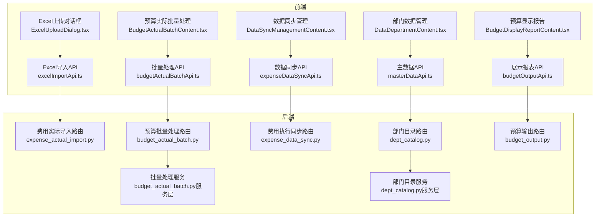
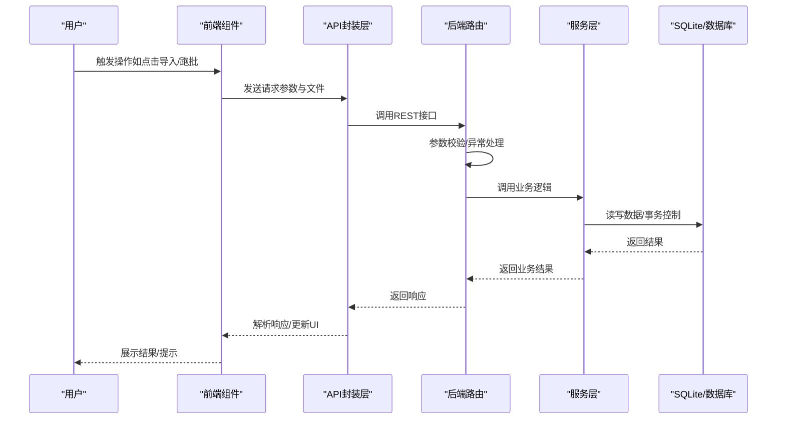
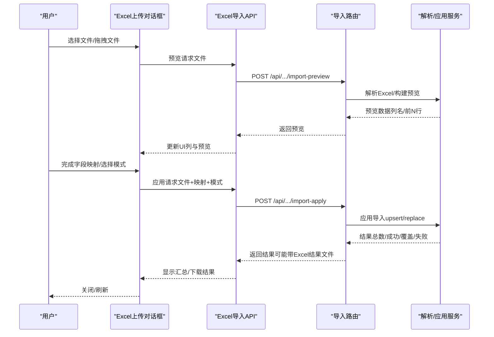
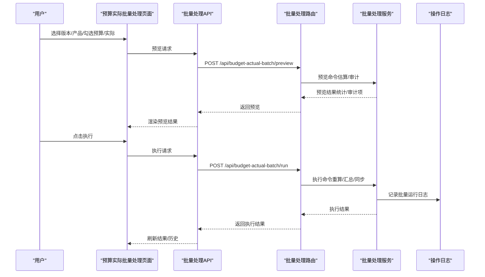
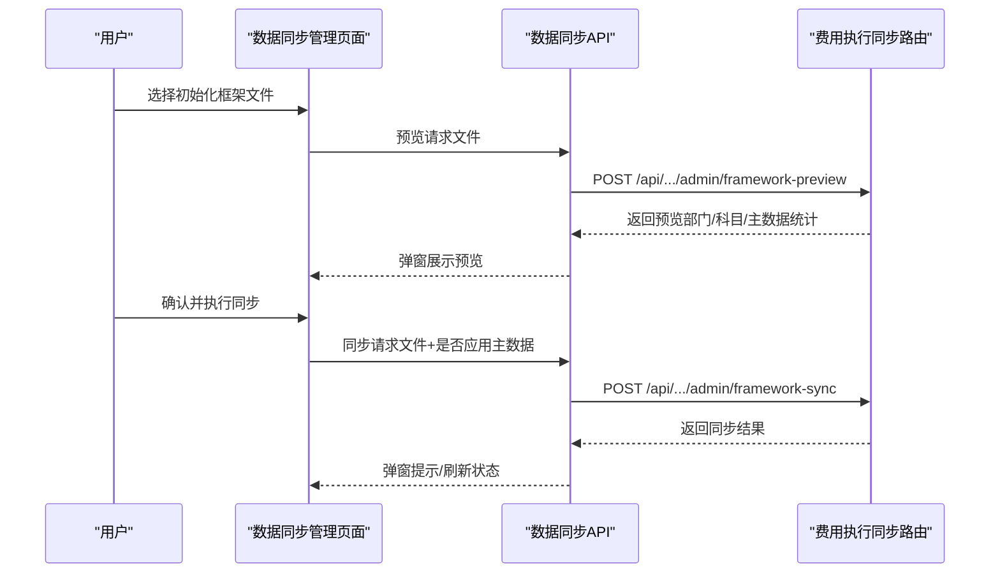
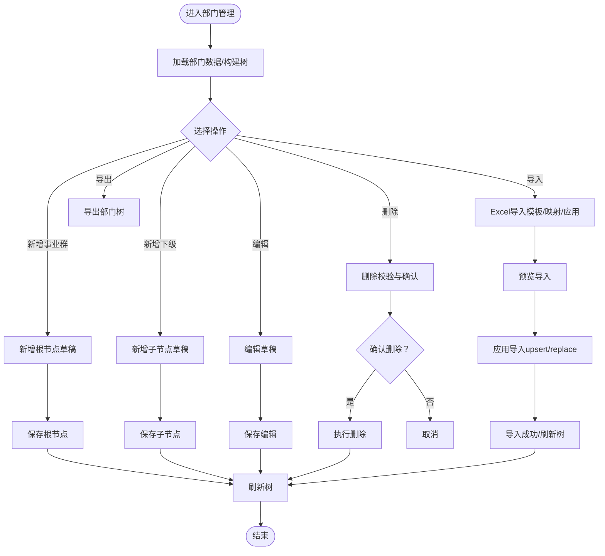
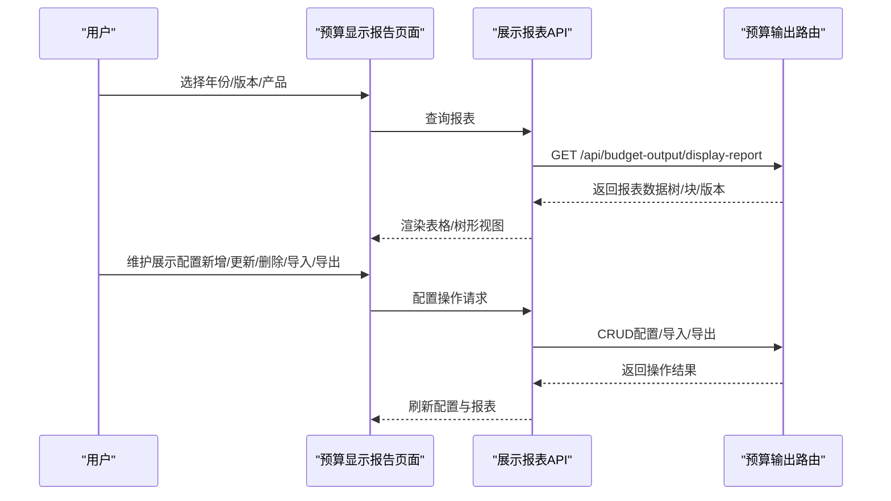
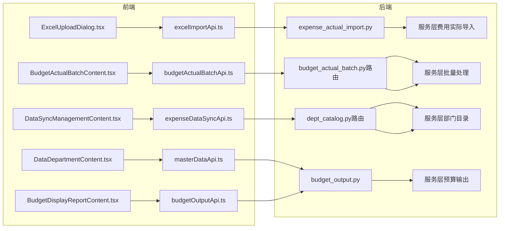

# 数据管理组件

<cite>
**本文档引用的文件**
- [ExcelUploadDialog.tsx](file://apps/web/src/app/components/ExcelUploadDialog.tsx)
- [BudgetActualBatchContent.tsx](file://apps/web/src/app/components/BudgetActualBatchContent.tsx)
- [DataSyncManagementContent.tsx](file://apps/web/src/app/components/DataSyncManagementContent.tsx)
- [DataDepartmentContent.tsx](file://apps/web/src/app/components/DataDepartmentContent.tsx)
- [BudgetDisplayReportContent.tsx](file://apps/web/src/app/components/BudgetDisplayReportContent.tsx)
- [excelImportApi.ts](file://apps/web/src/lib/excelImportApi.ts)
- [budgetActualBatchApi.ts](file://apps/web/src/lib/budgetActualBatchApi.ts)
- [expenseDataSyncApi.ts](file://apps/web/src/lib/expenseDataSyncApi.ts)
- [masterDataApi.ts](file://apps/web/src/lib/masterDataApi.ts)
- [budgetOutputApi.ts](file://apps/web/src/lib/budgetOutputApi.ts)
- [expense_actual_import.py](file://apps/api/app/routers/expense_actual_import.py)
- [budget_actual_batch.py](file://apps/api/app/routers/budget_actual_batch.py)
- [dept_catalog.py](file://apps/api/app/routers/dept_catalog.py)
- [budget_output.py](file://apps/api/app/routers/budget_output.py)
- [budget_actual_batch.py（服务层）](file://apps/api/app/services/budget_actual_batch.py)
- [dept_catalog.py（服务层）](file://apps/api/app/services/dept_catalog.py)
</cite>

## 目录
1. [简介](#简介)
2. [项目结构](#项目结构)
3. [核心组件](#核心组件)
4. [架构概览](#架构概览)
5. [详细组件分析](#详细组件分析)
6. [依赖关系分析](#依赖关系分析)
7. [性能考虑](#性能考虑)
8. [故障排除指南](#故障排除指南)
9. [结论](#结论)
10. [附录](#附录)

## 简介
本文件面向智能预算系统的数据管理组件，围绕以下五个核心功能进行深入文档化：
- Excel上传对话框：通用的Excel文件上传、模板下载、字段映射与导入流程
- 预算实际批量处理：预算事实刷新跑批的预览与执行、历史记录与审计
- 数据同步管理：费用执行框架导入的预览与同步、状态查看
- 部门数据管理：部门科目树的增删改查、Excel导入导出与批量操作
- 预算显示报告：预算展示报表的查询、配置与导出

文档涵盖组件的文件处理、数据验证、批量操作、错误处理、进度反馈与用户确认机制，并说明前端组件与数据管理API的交互模式与数据一致性保障。

## 项目结构
数据管理相关组件主要分布在前端Web应用与后端API两个层面：
- 前端组件层：位于 apps/web/src/app/components，负责用户界面与交互
- 前端API封装层：位于 apps/web/src/lib，封装HTTP请求与响应格式
- 后端API路由层：位于 apps/api/app/routers，定义REST接口与参数校验
- 后端服务层：位于 apps/api/app/services，实现业务逻辑与数据一致性

图表来源
- [ExcelUploadDialog.tsx:1-394](file://apps/web/src/app/components/ExcelUploadDialog.tsx#L1-L394)
- [BudgetActualBatchContent.tsx:1-615](file://apps/web/src/app/components/BudgetActualBatchContent.tsx#L1-L615)
- [DataSyncManagementContent.tsx:1-173](file://apps/web/src/app/components/DataSyncManagementContent.tsx#L1-L173)
- [DataDepartmentContent.tsx:1-831](file://apps/web/src/app/components/DataDepartmentContent.tsx#L1-L831)
- [BudgetDisplayReportContent.tsx:1-1323](file://apps/web/src/app/components/BudgetDisplayReportContent.tsx#L1-L1323)
- [excelImportApi.ts:1-147](file://apps/web/src/lib/excelImportApi.ts#L1-L147)
- [budgetActualBatchApi.ts:1-108](file://apps/web/src/lib/budgetActualBatchApi.ts#L1-L108)
- [expenseDataSyncApi.ts:1-86](file://apps/web/src/lib/expenseDataSyncApi.ts#L1-L86)
- [masterDataApi.ts:1-103](file://apps/web/src/lib/masterDataApi.ts#L1-L103)
- [budgetOutputApi.ts:1-240](file://apps/web/src/lib/budgetOutputApi.ts#L1-L240)
- [expense_actual_import.py:1-187](file://apps/api/app/routers/expense_actual_import.py#L1-L187)
- [budget_actual_batch.py（路由）:1-221](file://apps/api/app/routers/budget_actual_batch.py#L1-L221)
- [dept_catalog.py（路由）:1-128](file://apps/api/app/routers/dept_catalog.py#L1-L128)
- [budget_output.py:1-163](file://apps/api/app/routers/budget_output.py#L1-L163)
- [budget_actual_batch.py（服务层）:1-200](file://apps/api/app/services/budget_actual_batch.py#L1-L200)
- [dept_catalog.py（服务层）:1-200](file://apps/api/app/services/dept_catalog.py#L1-L200)

章节来源
- [ExcelUploadDialog.tsx:1-394](file://apps/web/src/app/components/ExcelUploadDialog.tsx#L1-L394)
- [BudgetActualBatchContent.tsx:1-615](file://apps/web/src/app/components/BudgetActualBatchContent.tsx#L1-L615)
- [DataSyncManagementContent.tsx:1-173](file://apps/web/src/app/components/DataSyncManagementContent.tsx#L1-L173)
- [DataDepartmentContent.tsx:1-831](file://apps/web/src/app/components/DataDepartmentContent.tsx#L1-L831)
- [BudgetDisplayReportContent.tsx:1-1323](file://apps/web/src/app/components/BudgetDisplayReportContent.tsx#L1-L1323)

## 核心组件
本节概述五大组件的功能职责与交互要点：
- Excel上传对话框：提供模板下载、文件上传、字段自动映射、预览与导入执行，支持 upsert/replace 两种导入模式
- 预算实际批量处理：选择版本与产品范围，预览/执行跑批，查看历史与审计信息
- 数据同步管理：查看费用执行框架同步状态，预览并执行初始化框架导入
- 部门数据管理：维护部门科目树，支持Excel导入导出、字段映射与批量操作
- 预算显示报告：查询预算展示报表，维护展示配置，支持导出与导入配置

章节来源
- [ExcelUploadDialog.tsx:1-394](file://apps/web/src/app/components/ExcelUploadDialog.tsx#L1-L394)
- [BudgetActualBatchContent.tsx:1-615](file://apps/web/src/app/components/BudgetActualBatchContent.tsx#L1-L615)
- [DataSyncManagementContent.tsx:1-173](file://apps/web/src/app/components/DataSyncManagementContent.tsx#L1-L173)
- [DataDepartmentContent.tsx:1-831](file://apps/web/src/app/components/DataDepartmentContent.tsx#L1-L831)
- [BudgetDisplayReportContent.tsx:1-1323](file://apps/web/src/app/components/BudgetDisplayReportContent.tsx#L1-L1323)

## 架构概览
前端组件通过API封装层调用后端路由，路由层对请求参数进行校验并调用服务层实现业务逻辑。服务层确保数据一致性并通过日志记录关键操作。

图表来源
- [excelImportApi.ts:1-147](file://apps/web/src/lib/excelImportApi.ts#L1-L147)
- [budgetActualBatchApi.ts:1-108](file://apps/web/src/lib/budgetActualBatchApi.ts#L1-L108)
- [expenseDataSyncApi.ts:1-86](file://apps/web/src/lib/expenseDataSyncApi.ts#L1-L86)
- [masterDataApi.ts:1-103](file://apps/web/src/lib/masterDataApi.ts#L1-L103)
- [budgetOutputApi.ts:1-240](file://apps/web/src/lib/budgetOutputApi.ts#L1-L240)
- [expense_actual_import.py:1-187](file://apps/api/app/routers/expense_actual_import.py#L1-L187)
- [budget_actual_batch.py（路由）:1-221](file://apps/api/app/routers/budget_actual_batch.py#L1-L221)
- [dept_catalog.py（路由）:1-128](file://apps/api/app/routers/dept_catalog.py#L1-L128)
- [budget_output.py:1-163](file://apps/api/app/routers/budget_output.py#L1-L163)
- [budget_actual_batch.py（服务层）:1-200](file://apps/api/app/services/budget_actual_batch.py#L1-L200)
- [dept_catalog.py（服务层）:1-200](file://apps/api/app/services/dept_catalog.py#L1-L200)

## 详细组件分析

### Excel上传对话框
- 文件处理与验证
  - 支持 .xlsx/.xls 文件类型校验
  - 模板下载：通过模板名称请求后端模板文件并触发浏览器下载
  - 上传预览：将文件提交至后端解析，返回列名与前N行预览数据
- 字段映射与自动匹配
  - 提供系统字段列表与Excel列的映射界面
  - 自动映射策略：优先精确匹配，其次模糊匹配（包含/被包含）
  - 必填字段校验：在导入前检查必填字段是否完成映射
- 导入执行与结果反馈
  - 支持 upsert 与 replace 两种模式（当路由允许替换时显示）
  - 导入完成后弹窗提示汇总信息，支持回调通知上层组件
  - 进度反馈：上传阶段显示解析进度百分比
- 错误处理与用户确认
  - 文件解析失败、模板缺失等异常捕获并提示
  - 模板缺失场景可自动关闭对话框
  - 导入过程禁用按钮，避免重复提交

图表来源
- [ExcelUploadDialog.tsx:1-394](file://apps/web/src/app/components/ExcelUploadDialog.tsx#L1-L394)
- [excelImportApi.ts:1-147](file://apps/web/src/lib/excelImportApi.ts#L1-L147)
- [expense_actual_import.py:106-184](file://apps/api/app/routers/expense_actual_import.py#L106-L184)

章节来源
- [ExcelUploadDialog.tsx:1-394](file://apps/web/src/app/components/ExcelUploadDialog.tsx#L1-L394)
- [excelImportApi.ts:1-147](file://apps/web/src/lib/excelImportApi.ts#L1-L147)
- [expense_actual_import.py:106-184](file://apps/api/app/routers/expense_actual_import.py#L106-L184)

### 预算实际批量处理
- 初始化与参数准备
  - 加载预算版本选项、产品列表与组织产品指标快照
  - 默认选择当前会话版本，支持切换版本与产品范围
- 预览与执行
  - 构建请求体：产品代码、版本ID、预算/实际标志、开关参数
  - 预览：返回预计影响的统计指标（公式任务数、汇总行数、对比行数等）
  - 执行：返回实际执行后的统计指标，并刷新历史记录
- 结果展示与审计
  - 展示明细产品数、指标数、公式与父节点任务/单元格数量
  - 父节点审计：展示目标节点、写入指标、来源指标、方法与公式
  - 警告信息：集中展示执行过程中的风险提示
- 历史记录
  - 查询最近N条执行日志，包含版本、产品范围、动作与影响行数
  - 支持手动刷新

图表来源
- [BudgetActualBatchContent.tsx:1-615](file://apps/web/src/app/components/BudgetActualBatchContent.tsx#L1-L615)
- [budgetActualBatchApi.ts:1-108](file://apps/web/src/lib/budgetActualBatchApi.ts#L1-L108)
- [budget_actual_batch.py（路由）:182-218](file://apps/api/app/routers/budget_actual_batch.py#L182-L218)
- [budget_actual_batch.py（服务层）:1-200](file://apps/api/app/services/budget_actual_batch.py#L1-L200)

章节来源
- [BudgetActualBatchContent.tsx:1-615](file://apps/web/src/app/components/BudgetActualBatchContent.tsx#L1-L615)
- [budgetActualBatchApi.ts:1-108](file://apps/web/src/lib/budgetActualBatchApi.ts#L1-L108)
- [budget_actual_batch.py（路由）:182-218](file://apps/api/app/routers/budget_actual_batch.py#L182-L218)
- [budget_actual_batch.py（服务层）:1-200](file://apps/api/app/services/budget_actual_batch.py#L1-L200)

### 数据同步管理
- 同步状态查看
  - 获取费用执行框架导入状态与主数据应用状态
  - 展示内部表计数与最后同步时间
- 初始化框架导入
  - 选择Excel文件后预览：返回预算部门/科目数量、主数据预览统计
  - 确认后执行同步：可选择是否应用到主数据，返回同步结果
  - 支持下载结果文件与刷新状态
- 用户确认与进度反馈
  - 预览与执行均需要用户二次确认
  - 执行期间禁用按钮，结束后弹窗提示并刷新状态

图表来源
- [DataSyncManagementContent.tsx:1-173](file://apps/web/src/app/components/DataSyncManagementContent.tsx#L1-L173)
- [expenseDataSyncApi.ts:1-86](file://apps/web/src/lib/expenseDataSyncApi.ts#L1-L86)
- [expenseDataSyncApi.ts:64-85](file://apps/web/src/lib/expenseDataSyncApi.ts#L64-L85)

章节来源
- [DataSyncManagementContent.tsx:1-173](file://apps/web/src/app/components/DataSyncManagementContent.tsx#L1-L173)
- [expenseDataSyncApi.ts:1-86](file://apps/web/src/lib/expenseDataSyncApi.ts#L1-L86)

### 部门数据管理
- 部门树维护
  - 支持新增事业群、新增下级部门、编辑与删除
  - 支持展开/收起、全展开/全收起、按层级展开/收起
  - 搜索与过滤：按主体/部门名称搜索
- Excel导入与导出
  - Excel导入：通过部门科目导入工作流，支持模板下载、字段映射与批量应用
  - Excel导出：导出部门树结构到Excel
- 数据验证与一致性
  - 部门代码唯一性校验
  - 上级部门存在性校验
  - 删除前检查是否存在子节点
  - 更新时可同步相关费用主数据引用

图表来源
- [DataDepartmentContent.tsx:1-831](file://apps/web/src/app/components/DataDepartmentContent.tsx#L1-L831)
- [masterDataApi.ts:1-103](file://apps/web/src/lib/masterDataApi.ts#L1-L103)
- [dept_catalog.py（路由）:36-75](file://apps/api/app/routers/dept_catalog.py#L36-L75)
- [dept_catalog.py（服务层）:87-200](file://apps/api/app/services/dept_catalog.py#L87-L200)

章节来源
- [DataDepartmentContent.tsx:1-831](file://apps/web/src/app/components/DataDepartmentContent.tsx#L1-L831)
- [masterDataApi.ts:1-103](file://apps/web/src/lib/masterDataApi.ts#L1-L103)
- [dept_catalog.py（路由）:36-75](file://apps/api/app/routers/dept_catalog.py#L36-L75)
- [dept_catalog.py（服务层）:87-200](file://apps/api/app/services/dept_catalog.py#L87-L200)

### 预算显示报告
- 报表查询与配置
  - 查询预算展示报表：支持年份、预算版本、预测版本、产品范围筛选
  - 展示配置：维护展示科目树，支持拖拽排序、新增分组、更新/删除配置项
  - 导入/导出配置：支持覆盖导入与模板导出
- 报表渲染
  - 多版本列：实际、预算、预测、差异、达成率、同比等
  - 树形表格：支持展开/收起、层级控制、空值占位
  - 单位换算：支持亿元/万元/元切换
- 用户交互
  - 配置搜索：按指标/来源/范围等关键词过滤候选
  - 面板切换：总览/产品/明细视图
  - 配置面板：拖拽放置、右键菜单、键盘Esc关闭

图表来源
- [BudgetDisplayReportContent.tsx:1-1323](file://apps/web/src/app/components/BudgetDisplayReportContent.tsx#L1-L1323)
- [budgetOutputApi.ts:1-240](file://apps/web/src/lib/budgetOutputApi.ts#L1-L240)
- [budget_output.py:127-160](file://apps/api/app/routers/budget_output.py#L127-L160)

章节来源
- [BudgetDisplayReportContent.tsx:1-1323](file://apps/web/src/app/components/BudgetDisplayReportContent.tsx#L1-L1323)
- [budgetOutputApi.ts:1-240](file://apps/web/src/lib/budgetOutputApi.ts#L1-L240)
- [budget_output.py:127-160](file://apps/api/app/routers/budget_output.py#L127-L160)

## 依赖关系分析
- 组件与API封装
  - Excel上传对话框依赖 excelImportApi.ts 的工作流函数
  - 预算实际批量处理依赖 budgetActualBatchApi.ts 的版本/历史/预览/执行接口
  - 数据同步管理依赖 expenseDataSyncApi.ts 的状态/预览/同步接口
  - 部门数据管理依赖 masterDataApi.ts 的部门树/导入/导出接口
  - 预算显示报告依赖 budgetOutputApi.ts 的报表/配置/导出接口
- API封装与后端路由
  - excelImportApi.ts 使用 buildApiUrl 与 downloadBlob，调用后端导入路由
  - budgetActualBatchApi.ts、expenseDataSyncApi.ts、masterDataApi.ts、budgetOutputApi.ts 分别封装对应路由
- 后端路由与服务
  - 各路由对输入参数进行校验，调用服务层实现业务逻辑
  - 服务层通过事务与日志保障数据一致性与可追溯性

图表来源
- [ExcelUploadDialog.tsx:1-394](file://apps/web/src/app/components/ExcelUploadDialog.tsx#L1-L394)
- [BudgetActualBatchContent.tsx:1-615](file://apps/web/src/app/components/BudgetActualBatchContent.tsx#L1-L615)
- [DataSyncManagementContent.tsx:1-173](file://apps/web/src/app/components/DataSyncManagementContent.tsx#L1-L173)
- [DataDepartmentContent.tsx:1-831](file://apps/web/src/app/components/DataDepartmentContent.tsx#L1-L831)
- [BudgetDisplayReportContent.tsx:1-1323](file://apps/web/src/app/components/BudgetDisplayReportContent.tsx#L1-L1323)
- [excelImportApi.ts:1-147](file://apps/web/src/lib/excelImportApi.ts#L1-L147)
- [budgetActualBatchApi.ts:1-108](file://apps/web/src/lib/budgetActualBatchApi.ts#L1-L108)
- [expenseDataSyncApi.ts:1-86](file://apps/web/src/lib/expenseDataSyncApi.ts#L1-L86)
- [masterDataApi.ts:1-103](file://apps/web/src/lib/masterDataApi.ts#L1-L103)
- [budgetOutputApi.ts:1-240](file://apps/web/src/lib/budgetOutputApi.ts#L1-L240)
- [expense_actual_import.py:1-187](file://apps/api/app/routers/expense_actual_import.py#L1-L187)
- [budget_actual_batch.py（路由）:1-221](file://apps/api/app/routers/budget_actual_batch.py#L1-L221)
- [dept_catalog.py（路由）:1-128](file://apps/api/app/routers/dept_catalog.py#L1-L128)
- [budget_output.py:1-163](file://apps/api/app/routers/budget_output.py#L1-L163)

章节来源
- [excelImportApi.ts:1-147](file://apps/web/src/lib/excelImportApi.ts#L1-L147)
- [budgetActualBatchApi.ts:1-108](file://apps/web/src/lib/budgetActualBatchApi.ts#L1-L108)
- [expenseDataSyncApi.ts:1-86](file://apps/web/src/lib/expenseDataSyncApi.ts#L1-L86)
- [masterDataApi.ts:1-103](file://apps/web/src/lib/masterDataApi.ts#L1-L103)
- [budgetOutputApi.ts:1-240](file://apps/web/src/lib/budgetOutputApi.ts#L1-L240)

## 性能考虑
- 前端
  - 预览与执行阶段禁用按钮，避免重复请求
  - 大表格采用虚拟滚动与可见行过滤，减少DOM渲染压力
  - 导入预览限制候选字段数量，提升交互响应速度
- 后端
  - 批量处理预览阶段尽量使用估算与审计，避免全量重算
  - 导入应用阶段通过事务一次性提交，减少锁竞争
  - 导出采用流式响应，避免大对象内存占用

## 故障排除指南
- Excel导入
  - 模板缺失：后端返回“缺失数据模版”工作表，前端自动关闭对话框并提示
  - 字段映射缺失：导入前校验必填字段，提示用户完成映射
  - 解析失败：捕获异常并弹窗提示具体错误
- 批量处理
  - 版本不存在：后端抛出版本不存在异常，前端显示错误并阻止执行
  - 产品不存在：后端抛出产品不存在异常，前端提示用户修正
  - 执行失败：捕获异常并显示错误信息，保留历史记录便于回溯
- 数据同步
  - 文件为空：后端拒绝空文件，提示重新选择
  - 预览失败：捕获异常并提示读取预览失败
- 部门管理
  - 代码冲突：新增/更新时检查唯一性，提示用户修改
  - 上级不存在：更新时校验上级部门存在性
  - 删除失败：若存在子节点，提示先删除子节点
- 展示报表
  - 查询失败：捕获异常并提示加载失败
  - 导出失败：提示导出失败并检查网络状态

章节来源
- [ExcelUploadDialog.tsx:1-394](file://apps/web/src/app/components/ExcelUploadDialog.tsx#L1-L394)
- [budgetActualBatchApi.ts:1-108](file://apps/web/src/lib/budgetActualBatchApi.ts#L1-L108)
- [budget_actual_batch.py（路由）:154-159](file://apps/api/app/routers/budget_actual_batch.py#L154-L159)
- [dept_catalog.py（服务层）:87-200](file://apps/api/app/services/dept_catalog.py#L87-L200)

## 结论
本文档系统梳理了智能预算系统中数据管理相关的核心组件，覆盖Excel上传、预算实际批量处理、数据同步、部门数据管理与预算显示报告的实现细节。通过清晰的前端组件设计、严谨的API封装与后端路由/服务层实现，确保了文件处理、数据验证、批量操作、错误处理、进度反馈与用户确认机制的有效落地，并通过日志与历史记录保障数据一致性与可追溯性。

## 附录
- 使用示例（步骤说明）
  - Excel上传对话框
    - 步骤1：打开Excel上传对话框，点击“下载模板”
    - 步骤2：选择Excel文件，等待解析完成
    - 步骤3：完成字段映射，确认必填字段
    - 步骤4：选择导入模式（新增/更新或覆盖），点击“开始导入”
    - 步骤5：查看导入结果与汇总信息
  - 预算实际批量处理
    - 步骤1：选择预算版本与产品范围
    - 步骤2：点击“预览”，查看预计影响指标
    - 步骤3：确认无误后点击“执行跑批”
    - 步骤4：查看执行结果与历史记录
  - 数据同步管理
    - 步骤1：选择初始化框架文件，点击“预览导入结果”
    - 步骤2：确认预览信息，点击“导入初始化框架”
    - 步骤3：等待同步完成，查看状态与结果
  - 部门数据管理
    - 步骤1：在部门树中选择主体或节点
    - 步骤2：点击“新增下级”或“编辑”，完成草稿保存
    - 步骤3：点击“Excel上传科目”，选择模板并完成导入
    - 步骤4：点击“Excel导出科目”，导出部门树
  - 预算显示报告
    - 步骤1：选择年份、预算版本与预测版本
    - 步骤2：勾选产品范围，点击“查询”
    - 步骤3：维护展示配置（新增/更新/删除/导入/导出）
    - 步骤4：导出全套报表或配置模板