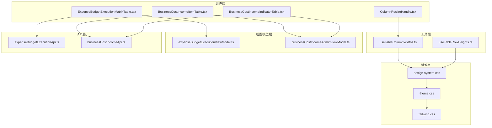
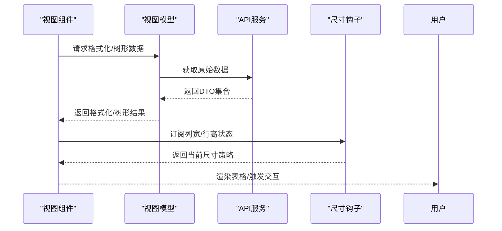
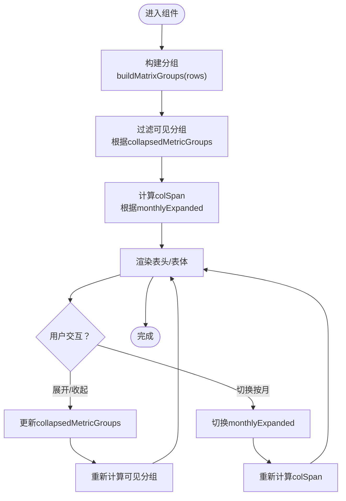
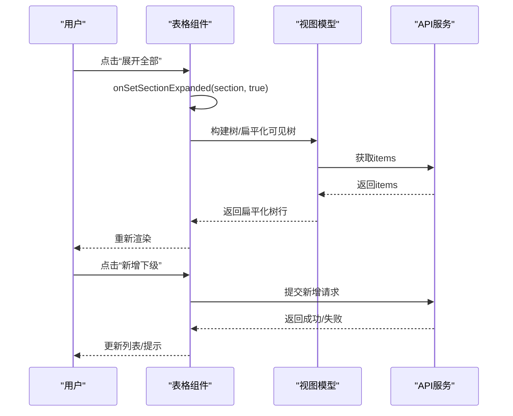
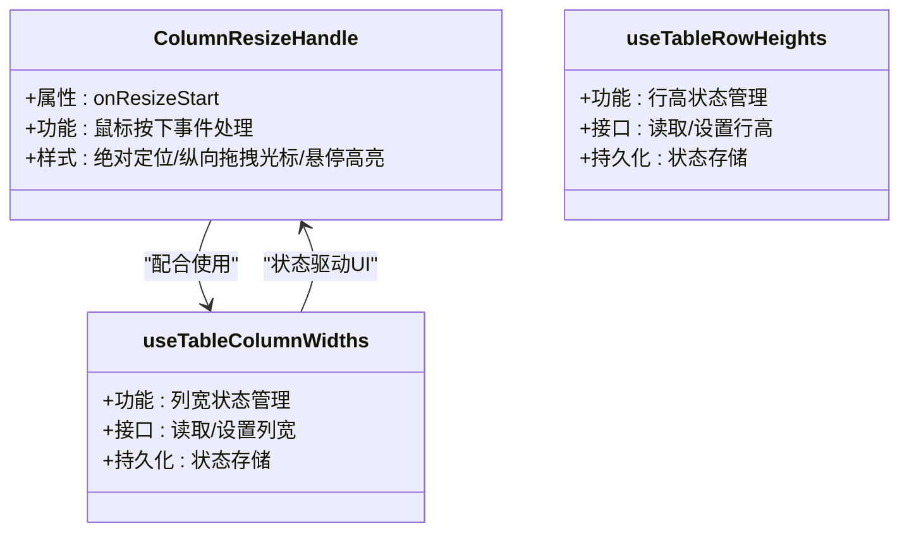
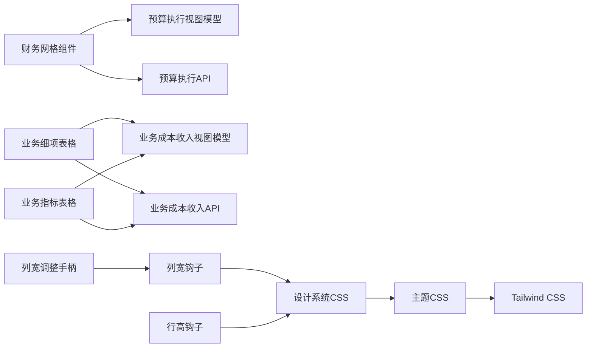

# 核心UI组件

<cite>
**本文引用的文件**
- [ExpenseBudgetExecutionMatrixTable.tsx](file://apps/web/src/app/components/ExpenseBudgetExecutionMatrixTable.tsx)
- [BusinessCostIncomeItemTable.tsx](file://apps/web/src/app/components/BusinessCostIncomeItemTable.tsx)
- [BusinessCostIncomeIndicatorTable.tsx](file://apps/web/src/app/components/BusinessCostIncomeIndicatorTable.tsx)
- [ColumnResizeHandle.tsx](file://apps/web/src/app/components/ColumnResizeHandle.tsx)
- [useTableColumnWidths.ts](file://apps/web/src/lib/useTableColumnWidths.ts)
- [useTableRowHeights.ts](file://apps/web/src/lib/useTableRowHeights.ts)
- [expenseBudgetExecutionViewModel.ts](file://apps/web/src/lib/expenseBudgetExecutionViewModel.ts)
- [businessCostIncomeAdminViewModel.ts](file://apps/web/src/lib/businessCostIncomeAdminViewModel.ts)
- [businessCostIncomeApi.ts](file://apps/web/src/lib/businessCostIncomeApi.ts)
- [expenseBudgetExecutionApi.ts](file://apps/web/src/lib/expenseBudgetExecutionApi.ts)
- [design-system.css](file://apps/web/src/styles/design-system.css)
- [theme.css](file://apps/web/src/styles/theme.css)
- [tailwind.css](file://apps/web/src/styles/tailwind.css)
</cite>

## 目录
1. [简介](#简介)
2. [项目结构](#项目结构)
3. [核心组件](#核心组件)
4. [架构总览](#架构总览)
5. [详细组件分析](#详细组件分析)
6. [依赖关系分析](#依赖关系分析)
7. [性能考虑](#性能考虑)
8. [故障排查指南](#故障排查指南)
9. [结论](#结论)
10. [附录](#附录)

## 简介
本文件聚焦预算系统的前端核心UI组件，围绕以下目标展开：  
- 财务网格组件：部门预算执行矩阵表，支持多维度展开/折叠、按月明细切换、数值格式化与分组聚合。  
- 工具函数：表格列宽与行高管理钩子，用于提升交互体验与布局稳定性。  
- 可调整大小的列/行处理器：通过可访问性友好的拖拽手柄实现列宽调整，结合状态管理与样式系统提供一致的主题风格。  

文档将从架构、数据流、处理逻辑、事件机制、样式定制、响应式与用户体验优化、状态管理与数据绑定等方面进行深入解析，并提供在预算系统中的实际使用示例与最佳实践。

## 项目结构
前端位于 apps/web/src，核心UI组件集中在 app/components，通用工具与视图模型位于 lib，样式体系位于 styles。  
- 组件层：财务网格与业务指标/细项表格组件  
- 工具层：useTableColumnWidths、useTableRowHeights  
- 视图模型层：预算执行与业务成本收入相关的格式化与树形构建  
- 样式层：设计系统、主题与Tailwind集成

**图表来源**
- [ExpenseBudgetExecutionMatrixTable.tsx:1-311](file://apps/web/src/app/components/ExpenseBudgetExecutionMatrixTable.tsx#L1-L311)
- [BusinessCostIncomeItemTable.tsx:1-256](file://apps/web/src/app/components/BusinessCostIncomeItemTable.tsx#L1-L256)
- [BusinessCostIncomeIndicatorTable.tsx:1-157](file://apps/web/src/app/components/BusinessCostIncomeIndicatorTable.tsx#L1-L157)
- [ColumnResizeHandle.tsx:1-19](file://apps/web/src/app/components/ColumnResizeHandle.tsx#L1-L19)
- [useTableColumnWidths.ts](file://apps/web/src/lib/useTableColumnWidths.ts)
- [useTableRowHeights.ts](file://apps/web/src/lib/useTableRowHeights.ts)
- [expenseBudgetExecutionViewModel.ts](file://apps/web/src/lib/expenseBudgetExecutionViewModel.ts)
- [businessCostIncomeAdminViewModel.ts](file://apps/web/src/lib/businessCostIncomeAdminViewModel.ts)
- [businessCostIncomeApi.ts](file://apps/web/src/lib/businessCostIncomeApi.ts)
- [expenseBudgetExecutionApi.ts](file://apps/web/src/lib/expenseBudgetExecutionApi.ts)
- [design-system.css](file://apps/web/src/styles/design-system.css)
- [theme.css](file://apps/web/src/styles/theme.css)
- [tailwind.css](file://apps/web/src/styles/tailwind.css)

**章节来源**
- [ExpenseBudgetExecutionMatrixTable.tsx:1-311](file://apps/web/src/app/components/ExpenseBudgetExecutionMatrixTable.tsx#L1-L311)
- [BusinessCostIncomeItemTable.tsx:1-256](file://apps/web/src/app/components/BusinessCostIncomeItemTable.tsx#L1-L256)
- [BusinessCostIncomeIndicatorTable.tsx:1-157](file://apps/web/src/app/components/BusinessCostIncomeIndicatorTable.tsx#L1-L157)
- [ColumnResizeHandle.tsx:1-19](file://apps/web/src/app/components/ColumnResizeHandle.tsx#L1-L19)
- [useTableColumnWidths.ts](file://apps/web/src/lib/useTableColumnWidths.ts)
- [useTableRowHeights.ts](file://apps/web/src/lib/useTableRowHeights.ts)
- [design-system.css](file://apps/web/src/styles/design-system.css)
- [theme.css](file://apps/web/src/styles/theme.css)
- [tailwind.css](file://apps/web/src/styles/tailwind.css)

## 核心组件
- 财务网格组件：部门预算执行矩阵表，支持按月/累计切换、层级展开/折叠、数值格式化、分组聚合与摘要行高亮。  
- 业务成本收入表格：细项与指标的树形表格，支持批量展开/收起、增删改查、排序移动、启用/停用等操作。  
- 列宽调整手柄：可访问性友好的垂直拖拽手柄，配合列宽管理钩子实现动态列宽调整。  
- 表格尺寸管理：列宽与行高钩子，提供跨组件复用的尺寸策略与状态持久化能力。

**章节来源**
- [ExpenseBudgetExecutionMatrixTable.tsx:25-35](file://apps/web/src/app/components/ExpenseBudgetExecutionMatrixTable.tsx#L25-L35)
- [BusinessCostIncomeItemTable.tsx:22-36](file://apps/web/src/app/components/BusinessCostIncomeItemTable.tsx#L22-L36)
- [BusinessCostIncomeIndicatorTable.tsx:12-20](file://apps/web/src/app/components/BusinessCostIncomeIndicatorTable.tsx#L12-L20)
- [ColumnResizeHandle.tsx:4-18](file://apps/web/src/app/components/ColumnResizeHandle.tsx#L4-L18)
- [useTableColumnWidths.ts](file://apps/web/src/lib/useTableColumnWidths.ts)
- [useTableRowHeights.ts](file://apps/web/src/lib/useTableRowHeights.ts)

## 架构总览
组件间通过props注入状态与回调，视图模型负责数据格式化与树形结构构建，API层提供数据源，样式层统一风格与主题。

**图表来源**
- [ExpenseBudgetExecutionMatrixTable.tsx:10-14](file://apps/web/src/app/components/ExpenseBudgetExecutionMatrixTable.tsx#L10-L14)
- [BusinessCostIncomeItemTable.tsx:12-20](file://apps/web/src/app/components/BusinessCostIncomeItemTable.tsx#L12-L20)
- [useTableColumnWidths.ts](file://apps/web/src/lib/useTableColumnWidths.ts)
- [useTableRowHeights.ts](file://apps/web/src/lib/useTableRowHeights.ts)

## 详细组件分析

### 财务网格组件：ExpenseBudgetExecutionMatrixTable
- 功能概要：渲染部门预算执行矩阵，支持“本年实际/预算/预算进度”三列区间的分组与展开/折叠；按月/累计切换；数值格式化；摘要行高亮。
- 关键属性
  - title：标题文本
  - columns：列标识数组（如“本年实际”、“本年预算”等）
  - rows：行数据DTO数组
  - amountDivisor：金额除数（用于格式化显示）
  - visibleMonthlyLabels：可见月份标签数组
  - monthlyExpanded：是否展开按月明细
  - setMonthlyExpanded：切换按月展开状态
  - collapsedMetricGroups：分组折叠状态映射
  - setCollapsedMetricGroups：更新分组折叠状态
- 关键方法与事件
  - buildMatrixGroups：基于层级信息构建分组链路与父子关系
  - setGroupsCollapsed：批量设置分组折叠/展开
  - 行内按钮事件：展开/收起本级、展开/收起全部、切换按月/累计
  - 数值格式化：金额与百分比格式化
- 数据绑定与状态管理
  - 使用React状态管理折叠状态与按月展开状态
  - 基于memo化避免重复计算分组
- 复杂度分析
  - 分组构建：O(n)，n为行数
  - 可见分组过滤：O(n)
  - 渲染：每行一次映射，整体O(n)
- 性能优化点
  - 使用memo化缓存分组结果
  - 条件渲染空态与大表格滚动容器
  - 合理的colSpan计算减少DOM节点数量

**图表来源**
- [ExpenseBudgetExecutionMatrixTable.tsx:37-79](file://apps/web/src/app/components/ExpenseBudgetExecutionMatrixTable.tsx#L37-L79)
- [ExpenseBudgetExecutionMatrixTable.tsx:216-310](file://apps/web/src/app/components/ExpenseBudgetExecutionMatrixTable.tsx#L216-L310)

**章节来源**
- [ExpenseBudgetExecutionMatrixTable.tsx:25-35](file://apps/web/src/app/components/ExpenseBudgetExecutionMatrixTable.tsx#L25-L35)
- [ExpenseBudgetExecutionMatrixTable.tsx:37-79](file://apps/web/src/app/components/ExpenseBudgetExecutionMatrixTable.tsx#L37-L79)
- [ExpenseBudgetExecutionMatrixTable.tsx:216-310](file://apps/web/src/app/components/ExpenseBudgetExecutionMatrixTable.tsx#L216-L310)
- [expenseBudgetExecutionViewModel.ts](file://apps/web/src/lib/expenseBudgetExecutionViewModel.ts)

### 业务成本收入表格：BusinessCostIncomeItemTable
- 功能概要：树形展示业务成本收入细项，支持批量展开/收起、增删改查、排序移动、启用/停用。
- 关键属性
  - section：细项所属分区
  - items：细项DTO数组
  - expanded：展开状态映射
  - submitting：提交中状态（禁用交互）
  - 回调：onSetSectionExpanded、onToggleExpanded、onAddTop、onAddChild、onAddParent、onEdit、onMove、onToggle、onDelete
- 关键方法
  - buildBusinessCostIncomeItemTree：构建树形结构
  - flattenVisibleBusinessCostIncomeTree：扁平化可见树
  - sortedSiblings：同级排序辅助
- 事件处理
  - 展开/收起按钮：onToggleExpanded
  - 批量展开/收起：onSetSectionExpanded
  - 新增顶级/下级/上级：onAddTop/onAddChild/onAddParent
  - 编辑/删除：onEdit/onDelete
  - 排序上下移动：onMove
  - 启用/停用：onToggle

**图表来源**
- [BusinessCostIncomeItemTable.tsx:48-64](file://apps/web/src/app/components/BusinessCostIncomeItemTable.tsx#L48-L64)
- [BusinessCostIncomeItemTable.tsx:118-251](file://apps/web/src/app/components/BusinessCostIncomeItemTable.tsx#L118-L251)
- [businessCostIncomeAdminViewModel.ts](file://apps/web/src/lib/businessCostIncomeAdminViewModel.ts)
- [businessCostIncomeApi.ts](file://apps/web/src/lib/businessCostIncomeApi.ts)

**章节来源**
- [BusinessCostIncomeItemTable.tsx:22-36](file://apps/web/src/app/components/BusinessCostIncomeItemTable.tsx#L22-L36)
- [BusinessCostIncomeItemTable.tsx:48-64](file://apps/web/src/app/components/BusinessCostIncomeItemTable.tsx#L48-L64)
- [BusinessCostIncomeItemTable.tsx:118-251](file://apps/web/src/app/components/BusinessCostIncomeItemTable.tsx#L118-L251)
- [businessCostIncomeAdminViewModel.ts](file://apps/web/src/lib/businessCostIncomeAdminViewModel.ts)
- [businessCostIncomeApi.ts](file://apps/web/src/lib/businessCostIncomeApi.ts)

### 业务成本收入指标表格：BusinessCostIncomeIndicatorTable
- 功能概要：展示与维护业务成本收入评估指标，支持增删改查、排序移动、启用/停用。
- 关键属性
  - indicators：指标DTO数组
  - items：细项DTO数组（用于关联分子/分母）
  - submitting：提交中状态
  - 回调：onAdd、onMove、onToggle、onDelete
- 关键方法
  - 通过indicators与items的匹配展示分子/分母细项名称
- 事件处理
  - 新增：onAdd
  - 排序上下移动：onMove
  - 启用/停用：onToggle
  - 删除：onDelete

**章节来源**
- [BusinessCostIncomeIndicatorTable.tsx:12-20](file://apps/web/src/app/components/BusinessCostIncomeIndicatorTable.tsx#L12-L20)
- [BusinessCostIncomeIndicatorTable.tsx:30-156](file://apps/web/src/app/components/BusinessCostIncomeIndicatorTable.tsx#L30-L156)
- [businessCostIncomeAdminViewModel.ts](file://apps/web/src/lib/businessCostIncomeAdminViewModel.ts)
- [businessCostIncomeApi.ts](file://apps/web/src/lib/businessCostIncomeApi.ts)

### 可调整大小的列/行处理器：ColumnResizeHandle 与尺寸钩子
- ColumnResizeHandle
  - 作用：作为表头右侧的拖拽手柄，提供可访问性标签与视觉反馈
  - 关键属性：onResizeStart（鼠标按下时的回调）
  - 样式：绝对定位、纵向拖拽光标、悬停高亮边框
- useTableColumnWidths
  - 作用：管理表格列宽状态，提供宽度读写接口与持久化策略
  - 适用场景：与ColumnResizeHandle配合，实现列宽调整后的状态同步
- useTableRowHeights
  - 作用：管理表格行高状态，提供行高读写接口与持久化策略
  - 适用场景：复杂表格的行高自定义与响应式适配

**图表来源**
- [ColumnResizeHandle.tsx:4-18](file://apps/web/src/app/components/ColumnResizeHandle.tsx#L4-L18)
- [useTableColumnWidths.ts](file://apps/web/src/lib/useTableColumnWidths.ts)
- [useTableRowHeights.ts](file://apps/web/src/lib/useTableRowHeights.ts)

**章节来源**
- [ColumnResizeHandle.tsx:1-19](file://apps/web/src/app/components/ColumnResizeHandle.tsx#L1-L19)
- [useTableColumnWidths.ts](file://apps/web/src/lib/useTableColumnWidths.ts)
- [useTableRowHeights.ts](file://apps/web/src/lib/useTableRowHeights.ts)

## 依赖关系分析
- 组件到视图模型：财务网格组件依赖预算执行视图模型进行数值格式化；业务表格组件依赖业务成本收入视图模型进行树形构建与标签映射。
- 组件到API：业务表格组件依赖业务成本收入API获取/提交数据；财务网格组件依赖预算执行API获取数据。
- 组件到样式：所有表格组件均使用统一的设计系统与主题样式，确保视觉一致性。
- 工具到组件：尺寸钩子为表格组件提供可扩展的列宽/行高管理能力。

**图表来源**
- [ExpenseBudgetExecutionMatrixTable.tsx:10-14](file://apps/web/src/app/components/ExpenseBudgetExecutionMatrixTable.tsx#L10-L14)
- [BusinessCostIncomeItemTable.tsx:12-20](file://apps/web/src/app/components/BusinessCostIncomeItemTable.tsx#L12-L20)
- [BusinessCostIncomeIndicatorTable.tsx:3-10](file://apps/web/src/app/components/BusinessCostIncomeIndicatorTable.tsx#L3-L10)
- [ColumnResizeHandle.tsx:4-18](file://apps/web/src/app/components/ColumnResizeHandle.tsx#L4-L18)
- [useTableColumnWidths.ts](file://apps/web/src/lib/useTableColumnWidths.ts)
- [useTableRowHeights.ts](file://apps/web/src/lib/useTableRowHeights.ts)
- [design-system.css](file://apps/web/src/styles/design-system.css)
- [theme.css](file://apps/web/src/styles/theme.css)
- [tailwind.css](file://apps/web/src/styles/tailwind.css)

**章节来源**
- [expenseBudgetExecutionViewModel.ts](file://apps/web/src/lib/expenseBudgetExecutionViewModel.ts)
- [businessCostIncomeAdminViewModel.ts](file://apps/web/src/lib/businessCostIncomeAdminViewModel.ts)
- [businessCostIncomeApi.ts](file://apps/web/src/lib/businessCostIncomeApi.ts)
- [expenseBudgetExecutionApi.ts](file://apps/web/src/lib/expenseBudgetExecutionApi.ts)
- [design-system.css](file://apps/web/src/styles/design-system.css)
- [theme.css](file://apps/web/src/styles/theme.css)
- [tailwind.css](file://apps/web/src/styles/tailwind.css)

## 性能考虑
- 渲染优化
  - 使用memo化缓存分组与扁平化结果，避免重复计算
  - 大表格采用滚动容器，减少一次性渲染节点数量
- 交互优化
  - 列宽/行高状态持久化，避免刷新丢失
  - 按需渲染（空态、折叠状态）降低DOM复杂度
- 样式优化
  - Tailwind原子类与主题变量统一管理，减少样式冲突
  - 可访问性属性完善，提升键盘与屏幕阅读器友好度

[本节为通用指导，无需具体文件分析]

## 故障排查指南
- 表格空白
  - 检查数据源是否为空或加载失败
  - 确认筛选条件导致无可见分组
- 列宽不生效
  - 确认ColumnResizeHandle已正确传入onResizeStart
  - 检查useTableColumnWidths状态是否持久化成功
- 折叠状态异常
  - 检查collapsedMetricGroups键值是否与分组key一致
  - 确认setCollapsedMetricGroups调用路径正确
- 树形表格操作不可用
  - 检查submitting状态是否被错误置位
  - 确认API返回成功后再更新本地状态

**章节来源**
- [ExpenseBudgetExecutionMatrixTable.tsx:70-89](file://apps/web/src/app/components/ExpenseBudgetExecutionMatrixTable.tsx#L70-L89)
- [BusinessCostIncomeItemTable.tsx:82-104](file://apps/web/src/app/components/BusinessCostIncomeItemTable.tsx#L82-L104)
- [useTableColumnWidths.ts](file://apps/web/src/lib/useTableColumnWidths.ts)

## 结论
本文档系统梳理了预算系统的三大核心UI组件：财务网格、业务成本收入表格与列宽/行高处理器。通过清晰的属性/方法/事件定义、数据绑定与状态管理模式、样式与主题集成以及响应式与可访问性优化，这些组件能够稳定支撑复杂的预算数据展示与管理需求。建议在实际项目中遵循统一的视图模型与API契约，结合尺寸钩子实现一致的交互体验。

[本节为总结性内容，无需具体文件分析]

## 附录
- 实际使用示例（路径指引）
  - 在预算执行页面中引入财务网格组件，传入columns、rows、amountDivisor与折叠状态回调
    - 示例路径：[ExpenseBudgetExecutionMatrixTable.tsx:59-69](file://apps/web/src/app/components/ExpenseBudgetExecutionMatrixTable.tsx#L59-L69)
  - 在业务成本收入管理页中引入细项与指标表格，传入items、indicators与各类回调
    - 示例路径：[BusinessCostIncomeItemTable.tsx:48-62](file://apps/web/src/app/components/BusinessCostIncomeItemTable.tsx#L48-L62)
    - 示例路径：[BusinessCostIncomeIndicatorTable.tsx:22-30](file://apps/web/src/app/components/BusinessCostIncomeIndicatorTable.tsx#L22-L30)
  - 在需要列宽调整的表格中引入列宽调整手柄，并订阅useTableColumnWidths状态
    - 示例路径：[ColumnResizeHandle.tsx:4-18](file://apps/web/src/app/components/ColumnResizeHandle.tsx#L4-L18)
    - 示例路径：[useTableColumnWidths.ts](file://apps/web/src/lib/useTableColumnWidths.ts)
- 样式定制与主题支持
  - 设计系统与主题CSS：统一颜色、字体、间距与组件样式
    - 示例路径：[design-system.css](file://apps/web/src/styles/design-system.css)
    - 示例路径：[theme.css](file://apps/web/src/styles/theme.css)
  - Tailwind集成：通过原子类快速覆盖局部样式
    - 示例路径：[tailwind.css](file://apps/web/src/styles/tailwind.css)

**章节来源**
- [ExpenseBudgetExecutionMatrixTable.tsx:59-69](file://apps/web/src/app/components/ExpenseBudgetExecutionMatrixTable.tsx#L59-L69)
- [BusinessCostIncomeItemTable.tsx:48-62](file://apps/web/src/app/components/BusinessCostIncomeItemTable.tsx#L48-L62)
- [BusinessCostIncomeIndicatorTable.tsx:22-30](file://apps/web/src/app/components/BusinessCostIncomeIndicatorTable.tsx#L22-L30)
- [ColumnResizeHandle.tsx:4-18](file://apps/web/src/app/components/ColumnResizeHandle.tsx#L4-L18)
- [useTableColumnWidths.ts](file://apps/web/src/lib/useTableColumnWidths.ts)
- [design-system.css](file://apps/web/src/styles/design-system.css)
- [theme.css](file://apps/web/src/styles/theme.css)
- [tailwind.css](file://apps/web/src/styles/tailwind.css)