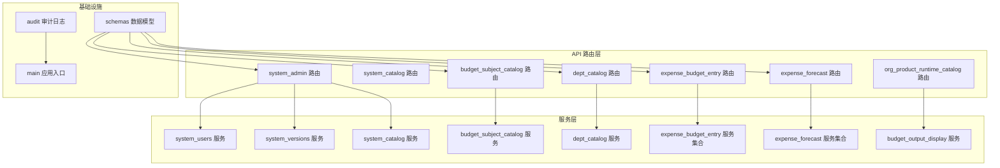
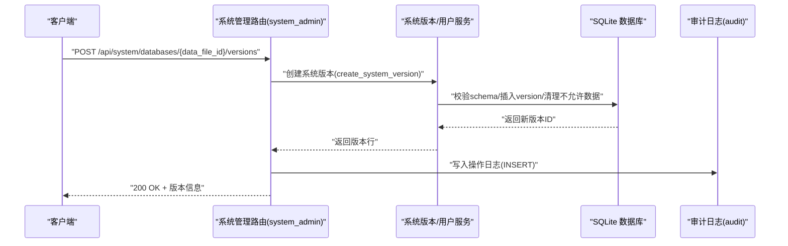
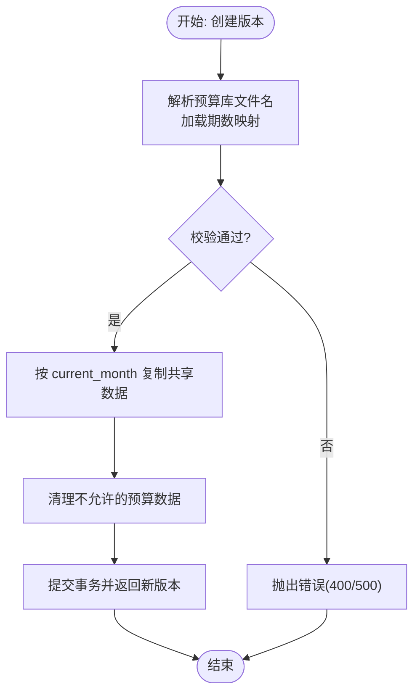
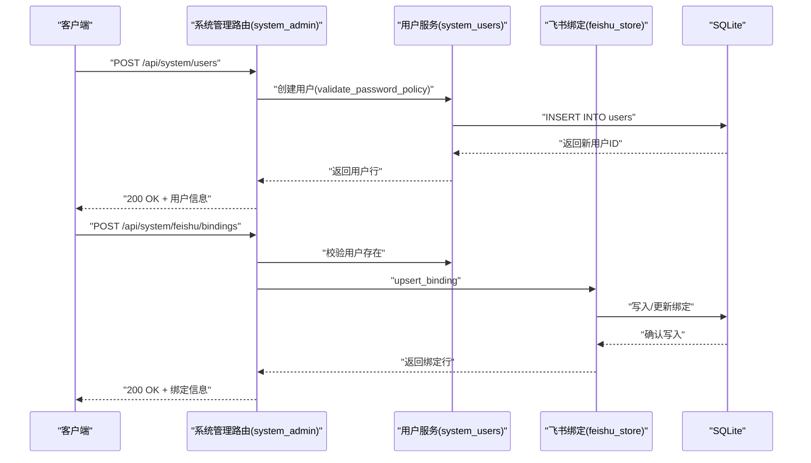
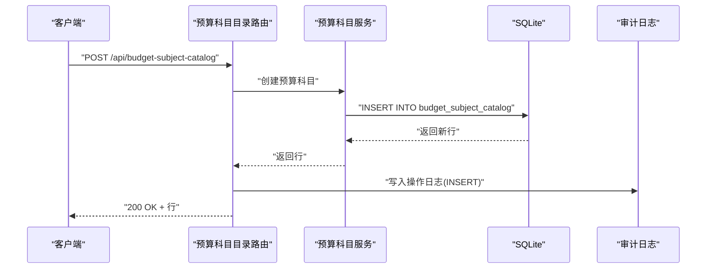
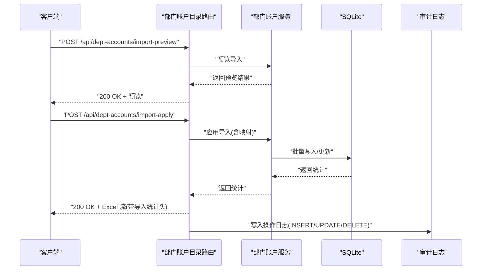
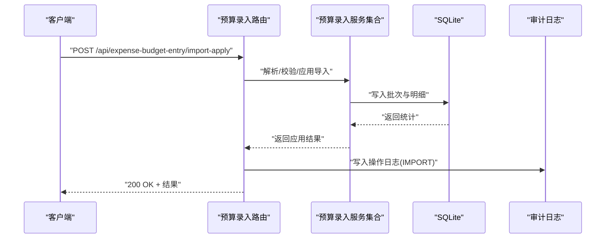
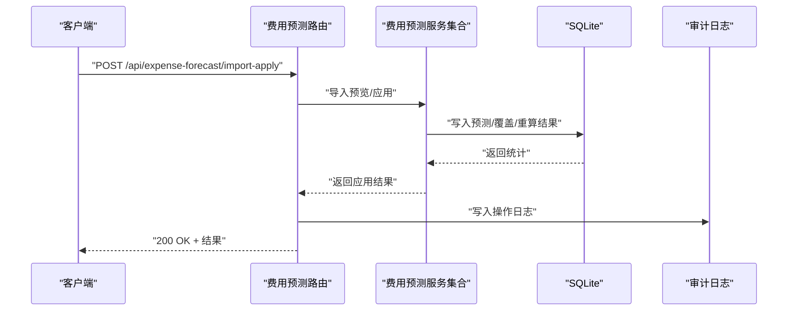
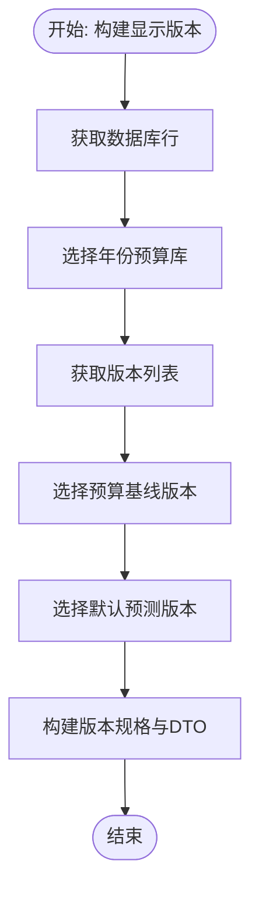
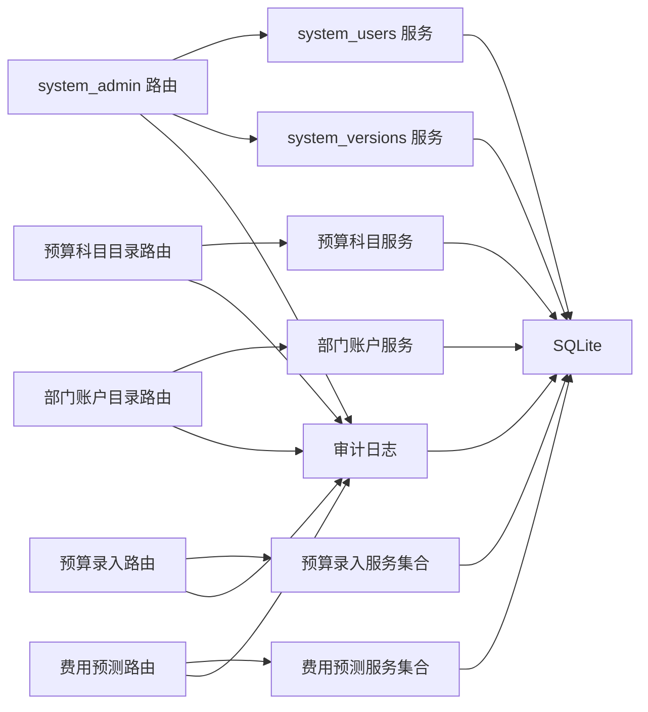

# 系统管理组件

<cite>
**本文档引用的文件**
- [apps/api/app/routers/system_admin.py](file://apps/api/app/routers/system_admin.py)
- [apps/api/app/services/system_users.py](file://apps/api/app/services/system_users.py)
- [apps/api/app/services/system_versions.py](file://apps/api/app/services/system_versions.py)
- [apps/api/app/services/system_catalog.py](file://apps/api/app/services/system_catalog.py)
- [apps/api/app/routers/budget_subject_catalog.py](file://apps/api/app/routers/budget_subject_catalog.py)
- [apps/api/app/routers/dept_catalog.py](file://apps/api/app/routers/dept_catalog.py)
- [apps/api/app/routers/expense_budget_entry.py](file://apps/api/app/routers/expense_budget_entry.py)
- [apps/api/app/routers/expense_forecast.py](file://apps/api/app/routers/expense_forecast.py)
- [apps/api/app/services/budget_output_display.py](file://apps/api/app/services/budget_output_display.py)
- [apps/api/app/audit.py](file://apps/api/app/audit.py)
- [apps/api/app/main.py](file://apps/api/app/main.py)
- [apps/api/app/schemas.py](file://apps/api/app/schemas.py)
</cite>

## 目录
1. [简介](#简介)
2. [项目结构](#项目结构)
3. [核心组件](#核心组件)
4. [架构总览](#架构总览)
5. [详细组件分析](#详细组件分析)
6. [依赖分析](#依赖分析)
7. [性能考虑](#性能考虑)
8. [故障排查指南](#故障排查指南)
9. [结论](#结论)
10. [附录](#附录)

## 简介
本文件聚焦系统管理相关组件，涵盖系统配置、用户配置、预算科目目录、组织产品内容、数据录入与预测输出等模块的实现与使用方法。文档详细说明权限管理、配置项设置与系统参数调整功能，提供完整的操作示例与代码片段路径，并阐述安全控制、审计日志与配置备份机制，以及组件与系统管理 API 的交互模式与权限验证策略。

## 项目结构
系统管理相关组件主要分布在后端 API 层（routers）、服务层（services）与通用工具（audit、schemas、main）中，围绕以下主题域组织：
- 系统管理与用户：系统版本、用户管理、飞书绑定
- 预算与组织：预算科目目录、部门账户目录、组织产品运行目录
- 数据录入与预测：预算录入、费用预测
- 输出展示：预算输出显示配置与候选集
- 安全与审计：统一操作日志写入

**图表来源**
- [apps/api/app/routers/system_admin.py:59-196](file://apps/api/app/routers/system_admin.py#L59-L196)
- [apps/api/app/services/system_users.py:58-196](file://apps/api/app/services/system_users.py#L58-L196)
- [apps/api/app/services/system_versions.py:81-375](file://apps/api/app/services/system_versions.py#L81-L375)
- [apps/api/app/services/system_catalog.py:51-224](file://apps/api/app/services/system_catalog.py#L51-L224)
- [apps/api/app/routers/budget_subject_catalog.py:23-80](file://apps/api/app/routers/budget_subject_catalog.py#L23-L80)
- [apps/api/app/routers/dept_catalog.py:27-128](file://apps/api/app/routers/dept_catalog.py#L27-L128)
- [apps/api/app/routers/expense_budget_entry.py:47-291](file://apps/api/app/routers/expense_budget_entry.py#L47-L291)
- [apps/api/app/routers/expense_forecast.py:317-800](file://apps/api/app/routers/expense_forecast.py#L317-L800)
- [apps/api/app/routers/org_product_runtime_catalog.py:12-25](file://apps/api/app/routers/org_product_runtime_catalog.py#L12-L25)
- [apps/api/app/audit.py:17-49](file://apps/api/app/audit.py#L17-L49)
- [apps/api/app/schemas.py:149-190](file://apps/api/app/schemas.py#L149-L190)

**章节来源**
- [apps/api/app/main.py:109-191](file://apps/api/app/main.py#L109-L191)

## 核心组件
- 系统版本管理：支持列出、创建、更新版本名称、删除版本，并与预算数据库文件关联，清理不允许的预算数据。
- 用户管理：支持列出、创建、更新、删除系统用户，重置首登密码、设置首登标志，具备重复名与字段缺失保护。
- 飞书绑定：支持查询、新增/更新、删除飞书绑定，基于系统用户存在性校验。
- 预算科目目录：支持增删改查、导出、写入操作日志。
- 部门账户目录：支持导入预览/应用、导出部门树模板、增删改查、写入操作日志。
- 预算录入：支持模板下载、批次与行查询、单行更新、批次删除、导入预览/导出、导入应用，写入操作日志。
- 费用预测：统一的预测表视图、规则配置、导入预览/应用、导出、重算、覆盖、追踪等能力。
- 预算输出显示：显示配置项与候选集、版本选择、产品树与报告树构建、预算/预测版本组合。
- 审计日志：统一写入 operation_log，记录操作类型、描述、目标表、影响行数与前后数据。

**章节来源**
- [apps/api/app/routers/system_admin.py:71-196](file://apps/api/app/routers/system_admin.py#L71-L196)
- [apps/api/app/services/system_users.py:58-196](file://apps/api/app/services/system_users.py#L58-L196)
- [apps/api/app/services/system_versions.py:81-375](file://apps/api/app/services/system_versions.py#L81-L375)
- [apps/api/app/routers/budget_subject_catalog.py:32-78](file://apps/api/app/routers/budget_subject_catalog.py#L32-L78)
- [apps/api/app/routers/dept_catalog.py:36-126](file://apps/api/app/routers/dept_catalog.py#L36-L126)
- [apps/api/app/routers/expense_budget_entry.py:59-291](file://apps/api/app/routers/expense_budget_entry.py#L59-L291)
- [apps/api/app/routers/expense_forecast.py:317-800](file://apps/api/app/routers/expense_forecast.py#L317-L800)
- [apps/api/app/services/budget_output_display.py:178-800](file://apps/api/app/services/budget_output_display.py#L178-L800)
- [apps/api/app/audit.py:17-49](file://apps/api/app/audit.py#L17-L49)

## 架构总览
系统管理组件遵循“路由层-服务层-数据层”的分层设计，统一通过 FastAPI 路由暴露接口，服务层封装业务逻辑与数据访问，审计日志贯穿关键写操作，形成闭环的安全与可追溯体系。

**图表来源**
- [apps/api/app/routers/system_admin.py:82-96](file://apps/api/app/routers/system_admin.py#L82-L96)
- [apps/api/app/services/system_versions.py:204-305](file://apps/api/app/services/system_versions.py#L204-L305)
- [apps/api/app/audit.py:17-49](file://apps/api/app/audit.py#L17-L49)

## 详细组件分析

### 系统版本管理
- 功能要点
  - 列出版本：按预算数据库文件 ID 查询版本列表。
  - 创建版本：校验年份与期数映射，复制父版本共享数据，清理不允许的预算数据。
  - 更新版本：仅允许更新版本名称，禁止修改 ID、创建时间、current_month。
  - 删除版本：删除预算数据、汇总数据与版本记录，并清理编辑展示配置。
- 关键流程
  - 解析预算数据库文件名与年份，加载期数映射。
  - 根据 current_month 分支复制实际/预算期数据。
  - 清理不允许的预算数据，保证数据窗口一致性。
- 错误处理
  - 文件不存在、父版本不存在、schema 不一致、操作失败等均转换为 HTTP 错误码。

**图表来源**
- [apps/api/app/services/system_versions.py:204-305](file://apps/api/app/services/system_versions.py#L204-L305)

**章节来源**
- [apps/api/app/routers/system_admin.py:71-126](file://apps/api/app/routers/system_admin.py#L71-L126)
- [apps/api/app/services/system_versions.py:81-375](file://apps/api/app/services/system_versions.py#L81-L375)

### 用户管理与飞书绑定
- 用户管理
  - 列表、创建、更新、删除用户，密码策略校验，重复名与无更新字段保护。
  - 支持重置首登密码与设置首登标志。
- 飞书绑定
  - 查询绑定、新增/更新绑定、删除绑定，绑定前校验用户存在性。
- 审计日志
  - 用户 CRUD 与密码重置、首登标志变更均写入 operation_log。

**图表来源**
- [apps/api/app/routers/system_admin.py:127-196](file://apps/api/app/routers/system_admin.py#L127-L196)
- [apps/api/app/services/system_users.py:72-196](file://apps/api/app/services/system_users.py#L72-L196)

**章节来源**
- [apps/api/app/routers/system_admin.py:127-196](file://apps/api/app/routers/system_admin.py#L127-L196)
- [apps/api/app/services/system_users.py:58-196](file://apps/api/app/services/system_users.py#L58-L196)

### 预算科目目录
- 功能要点
  - 列表、新增、更新、删除预算科目，导出为 Excel。
  - 写入操作日志，记录 INSERT/UPDATE/DELETE 的前后数据与影响行数。
- 数据模型
  - 预算科目行模型包含层级、公式文本、管理部等字段。

**图表来源**
- [apps/api/app/routers/budget_subject_catalog.py:36-46](file://apps/api/app/routers/budget_subject_catalog.py#L36-L46)
- [apps/api/app/audit.py:17-49](file://apps/api/app/audit.py#L17-L49)

**章节来源**
- [apps/api/app/routers/budget_subject_catalog.py:23-78](file://apps/api/app/routers/budget_subject_catalog.py#L23-L78)
- [apps/api/app/schemas.py:149-190](file://apps/api/app/schemas.py#L149-L190)

### 部门账户目录
- 功能要点
  - 导入预览与应用（支持映射 JSON），导出部门树模板，增删改查。
  - 写入操作日志，记录 UPDATE/DELETE 的 before/after 数据。
- 审计扩展
  - 导入应用返回额外头信息（总数、成功、覆盖、失败），便于前端统计。

**图表来源**
- [apps/api/app/routers/dept_catalog.py:36-75](file://apps/api/app/routers/dept_catalog.py#L36-L75)
- [apps/api/app/routers/dept_catalog.py:101-125](file://apps/api/app/routers/dept_catalog.py#L101-L125)
- [apps/api/app/audit.py:17-49](file://apps/api/app/audit.py#L17-L49)

**章节来源**
- [apps/api/app/routers/dept_catalog.py:27-128](file://apps/api/app/routers/dept_catalog.py#L27-L128)

### 预算录入
- 功能要点
  - 下载模板、查询批次与行、更新单行、删除批次、导入预览/导出、导入应用。
  - 写入操作日志，记录 IMPORT/UPDATE/DELETE 的影响行数与前后数据。
- 单元与模式
  - 支持金额单位解析与导入模式（追加/覆盖）。

**图表来源**
- [apps/api/app/routers/expense_budget_entry.py:219-288](file://apps/api/app/routers/expense_budget_entry.py#L219-L288)
- [apps/api/app/audit.py:17-49](file://apps/api/app/audit.py#L17-L49)

**章节来源**
- [apps/api/app/routers/expense_budget_entry.py:47-291](file://apps/api/app/routers/expense_budget_entry.py#L47-L291)

### 费用预测
- 功能要点
  - 预测表视图（scope/group/subject 三种模式）、规则配置与导入、重算、覆盖、追踪、导出。
  - 统一 schema 准备、规则读模型、测算结果写库、导入预览/应用、单元格写入命令。
- 数据上下文
  - 实际截止月、实际数/预算/输入映射、规则启用与覆盖映射等集中管理。

**图表来源**
- [apps/api/app/routers/expense_forecast.py:317-800](file://apps/api/app/routers/expense_forecast.py#L317-L800)
- [apps/api/app/audit.py:17-49](file://apps/api/app/audit.py#L17-L49)

**章节来源**
- [apps/api/app/routers/expense_forecast.py:317-800](file://apps/api/app/routers/expense_forecast.py#L317-L800)

### 预算输出显示
- 功能要点
  - 显示配置项与候选集、版本选择（预算/预测/实际）、产品树与报告树构建、月度值聚合。
  - 选择预算基线版本与默认预测版本，支持多版本组合展示。
- 数据模型
  - 配置项 DTO、候选 DTO、版本 DTO、产品节点 DTO、报告节点 DTO 等。

**图表来源**
- [apps/api/app/services/budget_output_display.py:698-773](file://apps/api/app/services/budget_output_display.py#L698-L773)

**章节来源**
- [apps/api/app/services/budget_output_display.py:178-800](file://apps/api/app/services/budget_output_display.py#L178-L800)
- [apps/api/app/schemas.py:82-148](file://apps/api/app/schemas.py#L82-L148)

### 审计日志与安全控制
- 审计日志
  - 统一写入 operation_log，包含用户 ID、动作类型、描述、目标表、影响行数、前后数据、IP 与时间。
- 安全控制
  - 路由层通过认证中间件与权限策略进行访问控制，部分路由对用户存在性进行前置校验。
- 配置备份
  - 系统版本删除会清理预算数据与汇总数据，避免残留；预算科目/部门账户/预算录入等写操作均有审计日志可追溯。

**章节来源**
- [apps/api/app/audit.py:17-49](file://apps/api/app/audit.py#L17-L49)
- [apps/api/app/routers/system_admin.py:165-171](file://apps/api/app/routers/system_admin.py#L165-L171)
- [apps/api/app/routers/budget_subject_catalog.py:39-70](file://apps/api/app/routers/budget_subject_catalog.py#L39-L70)
- [apps/api/app/routers/dept_catalog.py:104-124](file://apps/api/app/routers/dept_catalog.py#L104-L124)
- [apps/api/app/routers/expense_budget_entry.py:105-133](file://apps/api/app/routers/expense_budget_entry.py#L105-L133)

## 依赖分析
- 路由到服务
  - system_admin 路由依赖 system_users 与 system_versions 服务；预算与组织目录路由依赖各自服务；预算录入与费用预测路由依赖对应服务集合。
- 服务到数据库
  - 所有服务均通过 aiosqlite 连接 common.db 或预算库，执行 PRAGMA foreign_keys = ON 后进行写操作。
- 审计日志耦合
  - 审计日志服务被各路由调用，形成横切关注点，确保所有写操作均可审计。

**图表来源**
- [apps/api/app/routers/system_admin.py:59-196](file://apps/api/app/routers/system_admin.py#L59-L196)
- [apps/api/app/routers/budget_subject_catalog.py:23-80](file://apps/api/app/routers/budget_subject_catalog.py#L23-L80)
- [apps/api/app/routers/dept_catalog.py:27-128](file://apps/api/app/routers/dept_catalog.py#L27-L128)
- [apps/api/app/routers/expense_budget_entry.py:47-291](file://apps/api/app/routers/expense_budget_entry.py#L47-L291)
- [apps/api/app/routers/expense_forecast.py:317-800](file://apps/api/app/routers/expense_forecast.py#L317-L800)
- [apps/api/app/audit.py:17-49](file://apps/api/app/audit.py#L17-L49)

**章节来源**
- [apps/api/app/main.py:109-191](file://apps/api/app/main.py#L109-L191)

## 性能考虑
- 数据库连接与事务
  - 所有写操作在单事务内完成，减少锁竞争与回滚成本。
- 批量导入
  - 部门账户与预算录入支持批量写入，减少往返次数；导入应用返回统计头，便于前端快速反馈。
- 版本清理
  - 创建/删除版本时清理不允许的预算数据，避免历史冗余增长。
- 缓存与索引
  - 预算输出显示构建树与候选集时采用 CTE 与有序查询，建议在相关表建立必要索引以优化大表查询。

## 故障排查指南
- 版本操作异常
  - 文件名不符合规范、期数映射缺失、父版本不存在、schema 不一致、操作失败等，均会抛出相应异常并映射为 HTTP 错误码。
- 用户操作异常
  - 重复用户名、无更新字段、用户不存在等，路由层转换为 400/404。
- 飞书绑定异常
  - 用户不存在、写入后读取失败等，路由层转换为 404/500。
- 导入异常
  - 预览/应用阶段的解析错误、映射格式不合法、金额单位解析错误等，路由层转换为 400。
- 审计日志
  - 审计写入失败不影响主流程，但需检查 common.db 可写性与 operation_log 表结构。

**章节来源**
- [apps/api/app/routers/system_admin.py:49-56](file://apps/api/app/routers/system_admin.py#L49-L56)
- [apps/api/app/services/system_versions.py:24-42](file://apps/api/app/services/system_versions.py#L24-L42)
- [apps/api/app/services/system_users.py:16-30](file://apps/api/app/services/system_users.py#L16-L30)
- [apps/api/app/routers/dept_catalog.py:46-51](file://apps/api/app/routers/dept_catalog.py#L46-L51)
- [apps/api/app/routers/expense_budget_entry.py:144-150](file://apps/api/app/routers/expense_budget_entry.py#L144-L150)
- [apps/api/app/audit.py:26-48](file://apps/api/app/audit.py#L26-L48)

## 结论
系统管理组件通过清晰的分层设计与统一的审计日志，实现了预算版本、用户与飞书绑定、预算科目与部门账户、预算录入与费用预测、预算输出显示等核心能力的可配置、可审计与可追溯。配合严格的错误处理与权限策略，保障了系统在复杂业务场景下的稳定性与安全性。

## 附录
- 使用示例（步骤）
  - 创建系统版本
    - 步骤：准备预算数据库文件 → 调用创建版本接口 → 校验 current_month 与期数映射 → 查看返回的新版本。
    - 参考路径：[apps/api/app/routers/system_admin.py:82-96](file://apps/api/app/routers/system_admin.py#L82-L96)、[apps/api/app/services/system_versions.py:204-305](file://apps/api/app/services/system_versions.py#L204-L305)
  - 新增预算科目
    - 步骤：准备科目数据 → 调用新增接口 → 查看返回行 → 在前端确认导出。
    - 参考路径：[apps/api/app/routers/budget_subject_catalog.py:36-46](file://apps/api/app/routers/budget_subject_catalog.py#L36-L46)
  - 导入部门账户
    - 步骤：准备模板与映射 → 预览导入 → 应用导入 → 查看导入统计与导出结果。
    - 参考路径：[apps/api/app/routers/dept_catalog.py:36-75](file://apps/api/app/routers/dept_catalog.py#L36-L75)
  - 预算录入导入
    - 步骤：下载模板 → 上传文件 → 选择金额单位与导入模式 → 预览/应用 → 查看批次与行。
    - 参考路径：[apps/api/app/routers/expense_budget_entry.py:135-288](file://apps/api/app/routers/expense_budget_entry.py#L135-L288)
  - 费用预测导入与重算
    - 步骤：准备预测数据 → 预览导入 → 应用导入 → 触发规则重算 → 查看预测表与导出。
    - 参考路径：[apps/api/app/routers/expense_forecast.py:317-800](file://apps/api/app/routers/expense_forecast.py#L317-L800)
  - 预算输出显示配置
    - 步骤：选择年份与版本 → 加载配置项与候选集 → 构建显示树 → 导出报告。
    - 参考路径：[apps/api/app/services/budget_output_display.py:698-773](file://apps/api/app/services/budget_output_display.py#L698-L773)