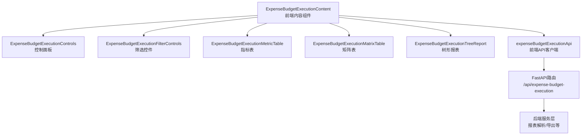
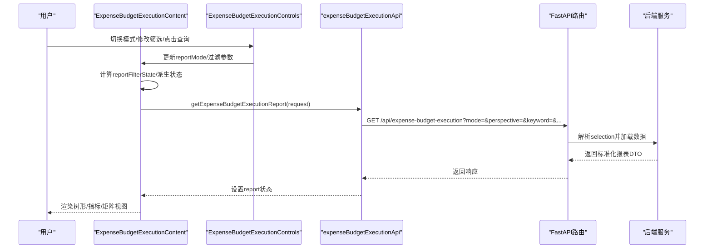
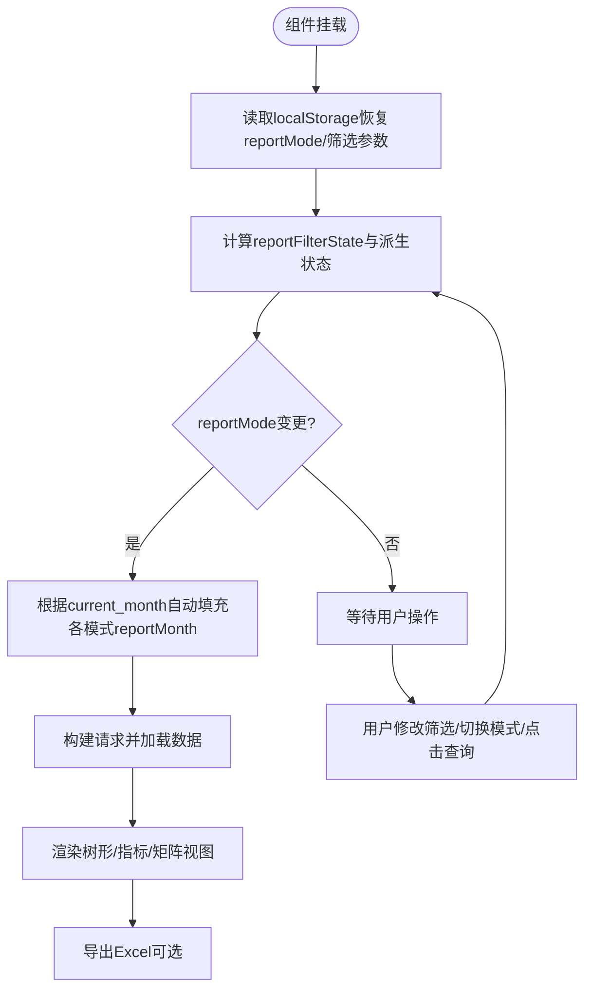
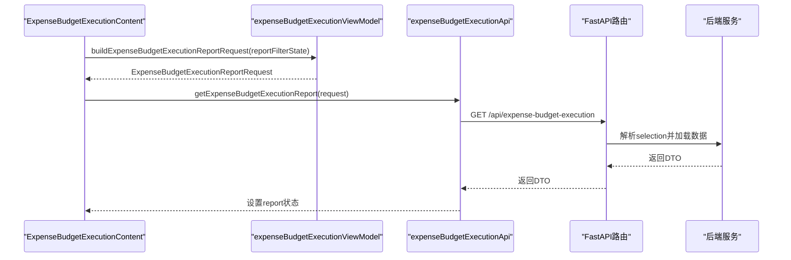
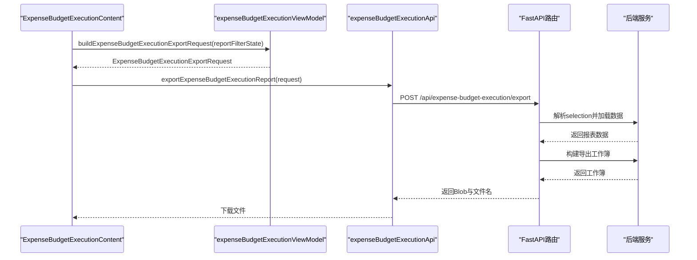
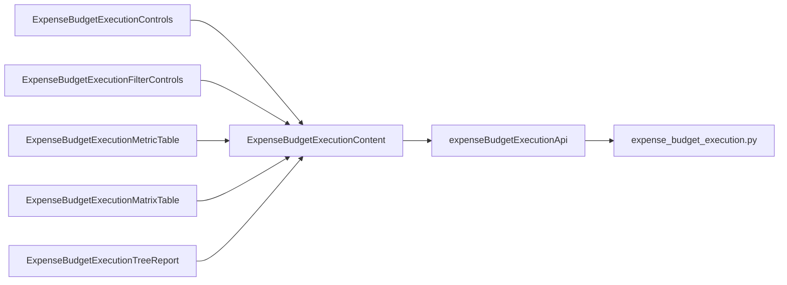

# 预算执行内容组件

<cite>
**本文档引用的文件**
- [ExpenseBudgetExecutionContent.tsx](file://apps/web/src/app/components/ExpenseBudgetExecutionContent.tsx)
- [expenseBudgetExecutionApi.ts](file://apps/web/src/lib/expenseBudgetExecutionApi.ts)
- [expenseBudgetExecutionViewModel.ts](file://apps/web/src/lib/expenseBudgetExecutionViewModel.ts)
- [ExpenseBudgetExecutionControls.tsx](file://apps/web/src/app/components/ExpenseBudgetExecutionControls.tsx)
- [ExpenseBudgetExecutionFilterControls.tsx](file://apps/web/src/app/components/ExpenseBudgetExecutionFilterControls.tsx)
- [ExpenseBudgetExecutionMetricTable.tsx](file://apps/web/src/app/components/ExpenseBudgetExecutionMetricTable.tsx)
- [ExpenseBudgetExecutionMatrixTable.tsx](file://apps/web/src/app/components/ExpenseBudgetExecutionMatrixTable.tsx)
- [ExpenseBudgetExecutionTreeReport.tsx](file://apps/web/src/app/components/ExpenseBudgetExecutionTreeReport.tsx)
- [expense_budget_execution.py](file://apps/api/app/routers/expense_budget_execution.py)
- [expense-budget-execution-view-model.spec.ts](file://apps/web/e2e/expense-budget-execution-view-model.spec.ts)
</cite>

## 目录
1. [简介](#简介)
2. [项目结构](#项目结构)
3. [核心组件](#核心组件)
4. [架构总览](#架构总览)
5. [详细组件分析](#详细组件分析)
6. [依赖关系分析](#依赖关系分析)
7. [性能考虑](#性能考虑)
8. [故障排除指南](#故障排除指南)
9. [结论](#结论)
10. [附录](#附录)

## 简介
本文件系统性解析预算执行内容组件（ExpenseBudgetExecutionContent），深入阐述其实现原理、状态管理与数据流，覆盖三种报表模式（query、template、subject）的切换与数据加载机制，以及与API层的集成方式、数据缓存与本地存储策略，并提供完整的使用示例与最佳实践。

## 项目结构
ExpenseBudgetExecutionContent位于前端应用层，负责聚合控制面板、表格视图与树形报表，通过ExpenseBudgetExecutionControls与ExpenseBudgetExecutionFilterControls提供交互式筛选，借助ExpenseBudgetExecutionMetricTable、ExpenseBudgetExecutionMatrixTable与ExpenseBudgetExecutionTreeReport渲染具体数据。数据请求通过expenseBudgetExecutionApi封装，视图模型在expenseBudgetExecutionViewModel中统一处理请求构建、导出参数、本地存储键值与格式化逻辑。后端由FastAPI路由expense_budget_execution.py暴露/get与/post接口，分别用于报表数据加载与Excel导出。

图表来源
- [ExpenseBudgetExecutionContent.tsx:1-631](file://apps/web/src/app/components/ExpenseBudgetExecutionContent.tsx#L1-L631)
- [expenseBudgetExecutionApi.ts:1-204](file://apps/web/src/lib/expenseBudgetExecutionApi.ts#L1-L204)
- [expense_budget_execution.py:107-200](file://apps/api/app/routers/expense_budget_execution.py#L107-L200)

章节来源
- [ExpenseBudgetExecutionContent.tsx:1-631](file://apps/web/src/app/components/ExpenseBudgetExecutionContent.tsx#L1-L631)
- [expenseBudgetExecutionApi.ts:1-204](file://apps/web/src/lib/expenseBudgetExecutionApi.ts#L1-L204)
- [expenseBudgetExecutionViewModel.ts:1-319](file://apps/web/src/lib/expenseBudgetExecutionViewModel.ts#L1-L319)
- [ExpenseBudgetExecutionControls.tsx:1-182](file://apps/web/src/app/components/ExpenseBudgetExecutionControls.tsx#L1-L182)
- [ExpenseBudgetExecutionFilterControls.tsx:1-204](file://apps/web/src/app/components/ExpenseBudgetExecutionFilterControls.tsx#L1-L204)
- [ExpenseBudgetExecutionMetricTable.tsx:117-154](file://apps/web/src/app/components/ExpenseBudgetExecutionMetricTable.tsx#L117-L154)
- [ExpenseBudgetExecutionMatrixTable.tsx:59-89](file://apps/web/src/app/components/ExpenseBudgetExecutionMatrixTable.tsx#L59-L89)
- [ExpenseBudgetExecutionTreeReport.tsx:1-200](file://apps/web/src/app/components/ExpenseBudgetExecutionTreeReport.tsx#L1-L200)
- [expense_budget_execution.py:107-200](file://apps/api/app/routers/expense_budget_execution.py#L107-L200)

## 核心组件
- ExpenseBudgetExecutionContent：主容器组件，集中管理报表模式、查询参数、过滤条件、显示选项、加载状态、导出状态、响应数据与展开/折叠状态，并负责触发数据加载与导出。
- ExpenseBudgetExecutionControls：顶层控制栏，切换报表模式、设置金额单位、关键字搜索、零行显示开关与查询按钮。
- ExpenseBudgetExecutionFilterControls：筛选控件集合，包含主体/事业群/费用归属部门三级联动、预算科目选择器、费用月份选择器等。
- ExpenseBudgetExecutionMetricTable：指标类报表（业务费用、IT费用、日常费用块）的通用表格组件，支持按月/去年对比展开、分组折叠与列头动态计算。
- ExpenseBudgetExecutionMatrixTable：矩阵类报表（日常费用-分解至使用部门）的通用表格组件，支持动态预算科目列、按月展开与分组折叠。
- ExpenseBudgetExecutionTreeReport：树形报表组件，用于template与subject模式下的树状展示，支持当前实际/去年同期展开、行选择与上下文菜单。

章节来源
- [ExpenseBudgetExecutionContent.tsx:40-631](file://apps/web/src/app/components/ExpenseBudgetExecutionContent.tsx#L40-L631)
- [ExpenseBudgetExecutionControls.tsx:18-182](file://apps/web/src/app/components/ExpenseBudgetExecutionControls.tsx#L18-L182)
- [ExpenseBudgetExecutionFilterControls.tsx:4-204](file://apps/web/src/app/components/ExpenseBudgetExecutionFilterControls.tsx#L4-L204)
- [ExpenseBudgetExecutionMetricTable.tsx:117-154](file://apps/web/src/app/components/ExpenseBudgetExecutionMetricTable.tsx#L117-L154)
- [ExpenseBudgetExecutionMatrixTable.tsx:59-89](file://apps/web/src/app/components/ExpenseBudgetExecutionMatrixTable.tsx#L59-L89)
- [ExpenseBudgetExecutionTreeReport.tsx:1-200](file://apps/web/src/app/components/ExpenseBudgetExecutionTreeReport.tsx#L1-L200)

## 架构总览
ExpenseBudgetExecutionContent采用“状态集中管理 + 视图模型解耦 + 组件职责分离”的设计。前端通过API客户端发起HTTP请求，后端路由根据mode、perspective、keyword、includeZeroRows、scope过滤与reportMonth等参数解析并返回标准化报表数据；导出时将金额单位与展开标志作为独立导出参数传递给后端服务。

图表来源
- [ExpenseBudgetExecutionContent.tsx:193-203](file://apps/web/src/app/components/ExpenseBudgetExecutionContent.tsx#L193-L203)
- [expenseBudgetExecutionApi.ts:191-197](file://apps/web/src/lib/expenseBudgetExecutionApi.ts#L191-L197)
- [expense_budget_execution.py:128-157](file://apps/api/app/routers/expense_budget_execution.py#L128-L157)

## 详细组件分析

### ExpenseBudgetExecutionContent 状态与数据流
- 核心状态
  - 报表模式：reportMode（query/template/subject）
  - 视角：perspective（group）
  - 查询参数：queryEntityName、queryGroupName、queryOwnerDept、queryReportMonth
  - 模板参数：templateEntityName、templateGroupName、templateOwnerDept、templateReportMonth
  - 科目参数：subjectEntityName、subjectSelectedId、subjectReportMonth
  - 显示选项：amountUnit（yuan/thousand/ten_thousand/million/hundred_million）、includeZeroRows
  - 加载与导出：loading、exporting
  - 报表数据：report
  - 展开状态：templateMonthlyExpanded、templateLastYearMonthlyExpanded、templateExpanded、collapsedMetricGroups、metricMonthlyExpanded、metricLastYearExpanded、matrixMonthlyExpanded
  - 本地存储键：localStorage持久化reportMode、各模式下的reportMonth、subjectSelectedId、amountUnit等
- 数据流
  - 初始化：从localStorage恢复reportMode与部分筛选参数
  - 变更：reportMode变化时，根据当前report.current_month自动填充各模式的默认reportMonth
  - 请求：reportFilterState变化时，构建请求参数并调用getExpenseBudgetExecutionReport
  - 导出：构建导出请求（包含includeMonthlyActuals、includeLastYearMonthlyActuals），调用exportExpenseBudgetExecutionReport并下载
  - 渲染：根据reportMode决定渲染树形报表或query模式下的多表组合

图表来源
- [ExpenseBudgetExecutionContent.tsx:110-152](file://apps/web/src/app/components/ExpenseBudgetExecutionContent.tsx#L110-L152)
- [ExpenseBudgetExecutionContent.tsx:193-203](file://apps/web/src/app/components/ExpenseBudgetExecutionContent.tsx#L193-L203)
- [ExpenseBudgetExecutionContent.tsx:392-408](file://apps/web/src/app/components/ExpenseBudgetExecutionContent.tsx#L392-L408)

章节来源
- [ExpenseBudgetExecutionContent.tsx:40-631](file://apps/web/src/app/components/ExpenseBudgetExecutionContent.tsx#L40-L631)

### 报表模式切换与数据加载
- 模式切换
  - reportMode通过ExpenseBudgetExecutionControls进行切换，切换后根据当前report.current_month自动填充模板/科目/查询模式的默认reportMonth
  - 模式切换时重置treeSection相关展开状态与选中节点
- 数据加载
  - 使用reportFilterState构建请求参数，调用getExpenseBudgetExecutionReport
  - 后端路由expense_budget_execution.py解析查询参数，构建ExpenseBudgetExecutionReportSelection并调用服务层解析显示报表
  - 返回标准化DTO，前端设置到report状态并触发重新渲染

图表来源
- [ExpenseBudgetExecutionContent.tsx:193-203](file://apps/web/src/app/components/ExpenseBudgetExecutionContent.tsx#L193-L203)
- [expenseBudgetExecutionViewModel.ts:221-237](file://apps/web/src/lib/expenseBudgetExecutionViewModel.ts#L221-L237)
- [expenseBudgetExecutionApi.ts:191-197](file://apps/web/src/lib/expenseBudgetExecutionApi.ts#L191-L197)
- [expense_budget_execution.py:128-157](file://apps/api/app/routers/expense_budget_execution.py#L128-L157)

章节来源
- [ExpenseBudgetExecutionContent.tsx:205-236](file://apps/web/src/app/components/ExpenseBudgetExecutionContent.tsx#L205-L236)
- [ExpenseBudgetExecutionContent.tsx:356-358](file://apps/web/src/app/components/ExpenseBudgetExecutionContent.tsx#L356-L358)
- [expenseBudgetExecutionViewModel.ts:221-237](file://apps/web/src/lib/expenseBudgetExecutionViewModel.ts#L221-L237)
- [expense_budget_execution.py:128-157](file://apps/api/app/routers/expense_budget_execution.py#L128-L157)

### 过滤条件与筛选控件
- 控制面板
  - ExpenseBudgetExecutionControls提供模式切换、金额单位、关键字搜索、零行显示开关与查询按钮
  - 关键字placeholder随模式变化（query/template/subject）
- 筛选控件
  - ExpenseBudgetExecutionFilterControls提供主体/事业群/费用归属部门三级联动、预算科目选择器、费用月份选择器
  - 三级联动遵循hasSelectedEntity/hasSelectedGroup的依赖关系，确保选项集正确
- 本地存储
  - 各模式的reportMonth、subjectSelectedId、amountUnit等通过localStorage持久化，组件挂载时自动恢复

章节来源
- [ExpenseBudgetExecutionControls.tsx:18-182](file://apps/web/src/app/components/ExpenseBudgetExecutionControls.tsx#L18-L182)
- [ExpenseBudgetExecutionFilterControls.tsx:84-141](file://apps/web/src/app/components/ExpenseBudgetExecutionFilterControls.tsx#L84-L141)
- [ExpenseBudgetExecutionContent.tsx:110-147](file://apps/web/src/app/components/ExpenseBudgetExecutionContent.tsx#L110-L147)

### 表格组件与数据展示
- 指标表（ExpenseBudgetExecutionMetricTable）
  - 支持按月/去年对比展开，动态计算列宽，分组折叠与顶层展开/收起
  - 通过amountDivisor与visibleMonthlyLabels/visibleLastYearMonthlyLabels进行格式化与列头生成
- 矩阵表（ExpenseBudgetExecutionMatrixTable）
  - 动态预算科目列、按月展开、预算/进度列组，支持分组折叠
  - 通过amountDivisor与visibleMonthlyLabels进行格式化
- 树形报表（ExpenseBudgetExecutionTreeReport）
  - 模板/科目模式下的树形展示，支持当前实际/去年同期展开、行选择与上下文菜单

章节来源
- [ExpenseBudgetExecutionMetricTable.tsx:117-154](file://apps/web/src/app/components/ExpenseBudgetExecutionMetricTable.tsx#L117-L154)
- [ExpenseBudgetExecutionMatrixTable.tsx:59-89](file://apps/web/src/app/components/ExpenseBudgetExecutionMatrixTable.tsx#L59-L89)
- [ExpenseBudgetExecutionTreeReport.tsx:1-200](file://apps/web/src/app/components/ExpenseBudgetExecutionTreeReport.tsx#L1-L200)

### API集成与导出流程
- 数据加载
  - GET /api/expense-budget-execution，查询参数包括mode、perspective、keyword、includeZeroRows、entityName、groupName、ownerDept、subjectId、reportMonth
  - 后端解析为selection并返回标准化DTO
- 导出
  - POST /api/expense-budget-execution/export，请求体包含mode、perspective、amountUnit、keyword、includeZeroRows、entityName、groupName、ownerDept、subjectId、reportMonth、includeMonthlyActuals、includeLastYearMonthlyActuals
  - 后端根据导出计划生成对应工作簿并返回流式响应

图表来源
- [ExpenseBudgetExecutionContent.tsx:392-408](file://apps/web/src/app/components/ExpenseBudgetExecutionContent.tsx#L392-L408)
- [expenseBudgetExecutionViewModel.ts:239-255](file://apps/web/src/lib/expenseBudgetExecutionViewModel.ts#L239-L255)
- [expenseBudgetExecutionApi.ts:199-203](file://apps/web/src/lib/expenseBudgetExecutionApi.ts#L199-L203)
- [expense_budget_execution.py:181-198](file://apps/api/app/routers/expense_budget_execution.py#L181-L198)

章节来源
- [expenseBudgetExecutionApi.ts:141-160](file://apps/web/src/lib/expenseBudgetExecutionApi.ts#L141-L160)
- [expenseBudgetExecutionApi.ts:162-177](file://apps/web/src/lib/expenseBudgetExecutionApi.ts#L162-L177)
- [expenseBudgetExecutionApi.ts:191-197](file://apps/web/src/lib/expenseBudgetExecutionApi.ts#L191-L197)
- [expenseBudgetExecutionApi.ts:199-203](file://apps/web/src/lib/expenseBudgetExecutionApi.ts#L199-L203)
- [expense_budget_execution.py:181-198](file://apps/api/app/routers/expense_budget_execution.py#L181-L198)

### 本地存储策略
- 存储键
  - reportMode、queryReportMonth、templateReportMonth、subjectReportMonth、subjectSelectedId、amountUnit、templateEntity、templateGroup、templateOwner
- 生命周期
  - 组件挂载时从localStorage读取并恢复状态
  - 状态更新时写回localStorage，保证刷新/重载后状态延续
- 注意事项
  - subjectSelectedId为空时主动移除对应localStorage键，避免脏数据残留

章节来源
- [expenseBudgetExecutionViewModel.ts:25-35](file://apps/web/src/lib/expenseBudgetExecutionViewModel.ts#L25-L35)
- [ExpenseBudgetExecutionContent.tsx:110-152](file://apps/web/src/app/components/ExpenseBudgetExecutionContent.tsx#L110-L152)
- [ExpenseBudgetExecutionContent.tsx:256-263](file://apps/web/src/app/components/ExpenseBudgetExecutionContent.tsx#L256-L263)

### 视图模型与请求构建
- 视图模型职责
  - amountUnit选项与除数映射、月份/模式/金额单位/科目ID的规范化
  - 分组/归属部门选项提取、模式视图（tree-section、activeKeyword、keywordMode）
  - 报表请求与导出请求构建、月度标签生成、树元信息描述
- 关键函数
  - getExpenseBudgetExecutionModeView：根据reportMode与关键字确定activeKeyword与keywordMode
  - buildExpenseBudgetExecutionReportRequest/buildExpenseBudgetExecutionExportRequest：统一构建请求参数
  - getExpenseBudgetExecutionAmountDivisor：根据单位返回除数
  - describeExpenseBudgetExecutionSummary/getExpenseBudgetExecutionTreeMeta：生成摘要与树元信息

章节来源
- [expenseBudgetExecutionViewModel.ts:17-23](file://apps/web/src/lib/expenseBudgetExecutionViewModel.ts#L17-L23)
- [expenseBudgetExecutionViewModel.ts:54-85](file://apps/web/src/lib/expenseBudgetExecutionViewModel.ts#L54-L85)
- [expenseBudgetExecutionViewModel.ts:101-127](file://apps/web/src/lib/expenseBudgetExecutionViewModel.ts#L101-L127)
- [expenseBudgetExecutionViewModel.ts:156-187](file://apps/web/src/lib/expenseBudgetExecutionViewModel.ts#L156-L187)
- [expenseBudgetExecutionViewModel.ts:221-255](file://apps/web/src/lib/expenseBudgetExecutionViewModel.ts#L221-L255)
- [expenseBudgetExecutionViewModel.ts:257-307](file://apps/web/src/lib/expenseBudgetExecutionViewModel.ts#L257-L307)
- [expenseBudgetExecutionViewModel.ts:309-318](file://apps/web/src/lib/expenseBudgetExecutionViewModel.ts#L309-L318)

## 依赖关系分析
- 组件耦合
  - ExpenseBudgetExecutionContent高度聚合，但通过ExpenseBudgetExecutionControls与ExpenseBudgetExecutionFilterControls拆分交互逻辑
  - 表格组件与树形报表组件通过props解耦，复用视图模型中的格式化与标签生成
- 外部依赖
  - 前端API客户端expenseBudgetExecutionApi封装HTTP请求与导出
  - 后端FastAPI路由expense_budget_execution.py提供统一入口，服务层负责数据解析与导出
- 可能的循环依赖
  - 组件间通过props传递状态，无直接循环导入；视图模型为纯函数模块，避免循环依赖

图表来源
- [ExpenseBudgetExecutionContent.tsx:496-553](file://apps/web/src/app/components/ExpenseBudgetExecutionContent.tsx#L496-L553)
- [ExpenseBudgetExecutionControls.tsx:51-181](file://apps/web/src/app/components/ExpenseBudgetExecutionControls.tsx#L51-L181)
- [ExpenseBudgetExecutionFilterControls.tsx:84-141](file://apps/web/src/app/components/ExpenseBudgetExecutionFilterControls.tsx#L84-L141)
- [ExpenseBudgetExecutionMetricTable.tsx:117-154](file://apps/web/src/app/components/ExpenseBudgetExecutionMetricTable.tsx#L117-L154)
- [ExpenseBudgetExecutionMatrixTable.tsx:59-89](file://apps/web/src/app/components/ExpenseBudgetExecutionMatrixTable.tsx#L59-L89)
- [ExpenseBudgetExecutionTreeReport.tsx:1-200](file://apps/web/src/app/components/ExpenseBudgetExecutionTreeReport.tsx#L1-L200)
- [expenseBudgetExecutionApi.ts:1-204](file://apps/web/src/lib/expenseBudgetExecutionApi.ts#L1-L204)
- [expense_budget_execution.py:107-200](file://apps/api/app/routers/expense_budget_execution.py#L107-L200)

章节来源
- [ExpenseBudgetExecutionContent.tsx:496-553](file://apps/web/src/app/components/ExpenseBudgetExecutionContent.tsx#L496-L553)
- [expenseBudgetExecutionApi.ts:1-204](file://apps/web/src/lib/expenseBudgetExecutionApi.ts#L1-L204)
- [expense_budget_execution.py:107-200](file://apps/api/app/routers/expense_budget_execution.py#L107-L200)

## 性能考虑
- 渲染优化
  - 使用useMemo缓存派生状态（如分组、可见列、摘要文本），减少重复计算
  - 表格组件内部按需展开/折叠，避免一次性渲染大量节点
- 网络优化
  - 请求参数最小化，仅传递必要字段；导出时将金额单位与展开标志单独传入，避免污染显示请求
  - 导出采用流式响应，降低内存占用
- 本地存储
  - 仅持久化必要状态，避免localStorage膨胀；subjectSelectedId为空时及时清理键值

## 故障排除指南
- 常见错误与处理
  - 报表加载失败：组件捕获异常并弹窗提示，检查网络与后端日志
  - 导出失败：捕获异常并提示，确认已选择正确的展开选项与金额单位
  - 无效月份/科目ID：视图模型对输入进行规范化，非法值会被清空或忽略
- 调试建议
  - 在ExpenseBudgetExecutionContent中打印reportFilterState与report，定位参数问题
  - 使用e2e测试用例验证请求构建与导出payload的正确性

章节来源
- [ExpenseBudgetExecutionContent.tsx:198-200](file://apps/web/src/app/components/ExpenseBudgetExecutionContent.tsx#L198-L200)
- [ExpenseBudgetExecutionContent.tsx:403-405](file://apps/web/src/app/components/ExpenseBudgetExecutionContent.tsx#L403-L405)
- [expenseBudgetExecutionViewModel.ts:54-85](file://apps/web/src/lib/expenseBudgetExecutionViewModel.ts#L54-L85)
- [expense-budget-execution-view-model.spec.ts:145-224](file://apps/web/e2e/expense-budget-execution-view-model.spec.ts#L145-L224)

## 结论
ExpenseBudgetExecutionContent通过清晰的状态划分、视图模型解耦与组件职责分离，实现了灵活的三模式报表展示与高效的数据加载/导出流程。配合本地存储与严格的参数规范化，提升了用户体验与系统的稳定性。建议在后续迭代中进一步抽象共享逻辑、增强错误边界与性能监控。

## 附录

### 使用示例与最佳实践
- 快速上手
  - 在ExpenseBudgetExecutionControls中切换reportMode，选择金额单位与关键字
  - 使用三级筛选控件设置主体/事业群/费用归属部门，或选择预算科目
  - 点击“查询”加载数据，必要时展开“按月/去年同期”列查看更多细节
- 最佳实践
  - 优先使用视图模型提供的请求构建函数，避免手动拼接参数
  - 导出时明确includeMonthlyActuals与includeLastYearMonthlyActuals，确保报表完整性
  - 合理使用“显示所有金额都为0的项”，便于审计与核对
  - 避免在组件内直接硬编码API路径，统一通过expenseBudgetExecutionApi调用

章节来源
- [ExpenseBudgetExecutionControls.tsx:51-181](file://apps/web/src/app/components/ExpenseBudgetExecutionControls.tsx#L51-L181)
- [ExpenseBudgetExecutionFilterControls.tsx:84-141](file://apps/web/src/app/components/ExpenseBudgetExecutionFilterControls.tsx#L84-L141)
- [ExpenseBudgetExecutionContent.tsx:392-408](file://apps/web/src/app/components/ExpenseBudgetExecutionContent.tsx#L392-L408)
- [expenseBudgetExecutionViewModel.ts:221-255](file://apps/web/src/lib/expenseBudgetExecutionViewModel.ts#L221-L255)