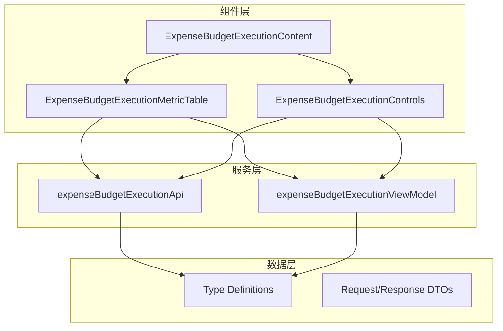
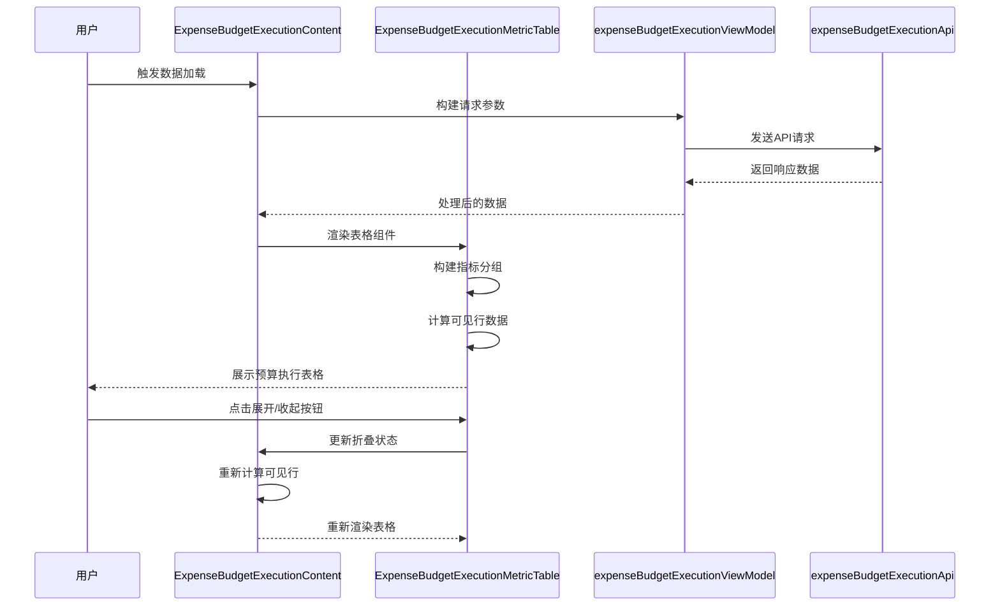
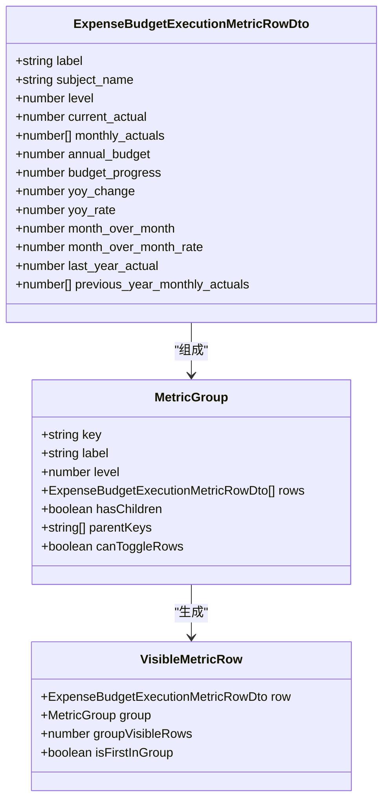
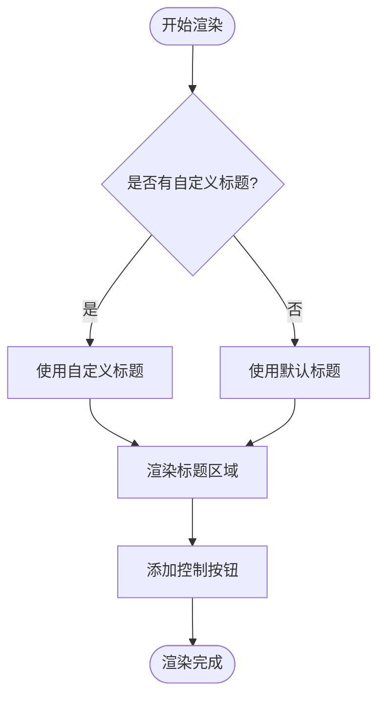
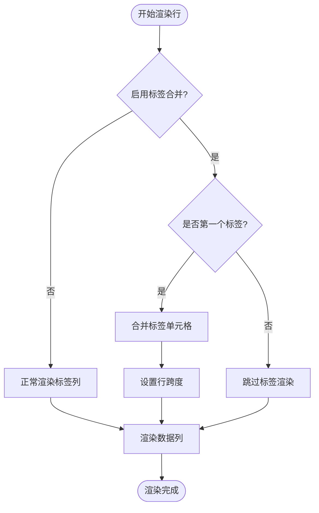
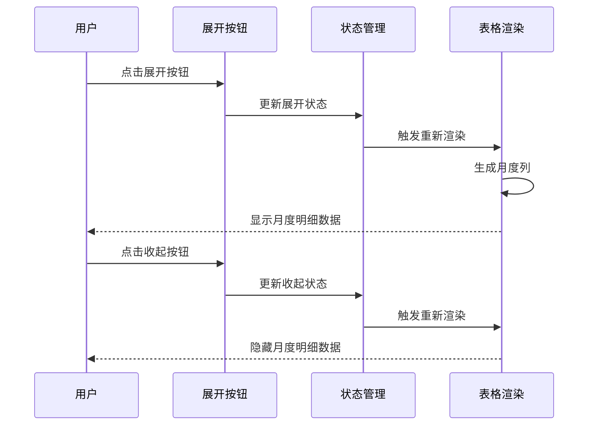
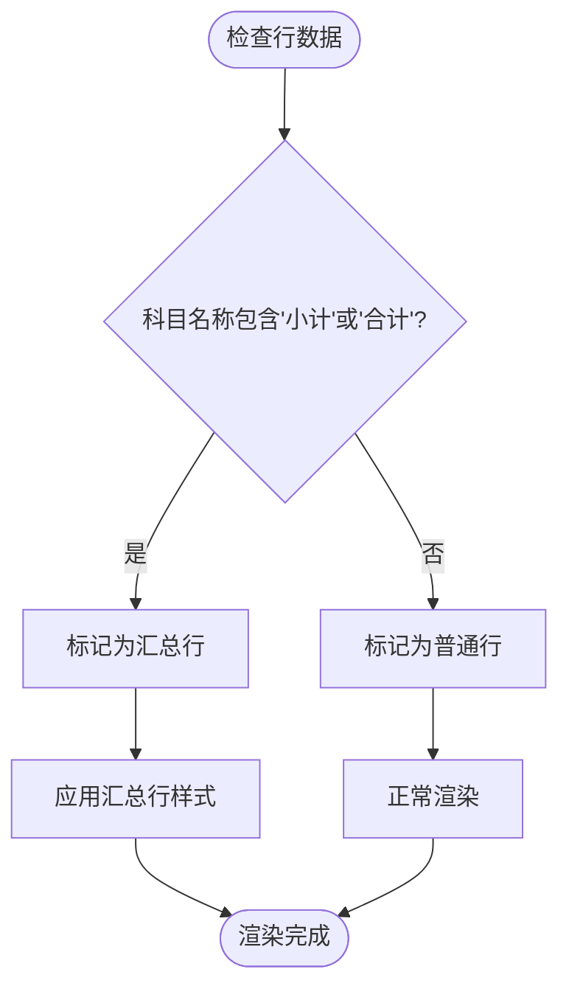
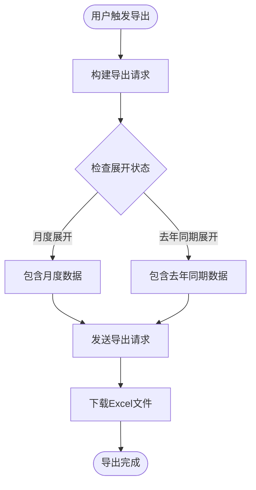
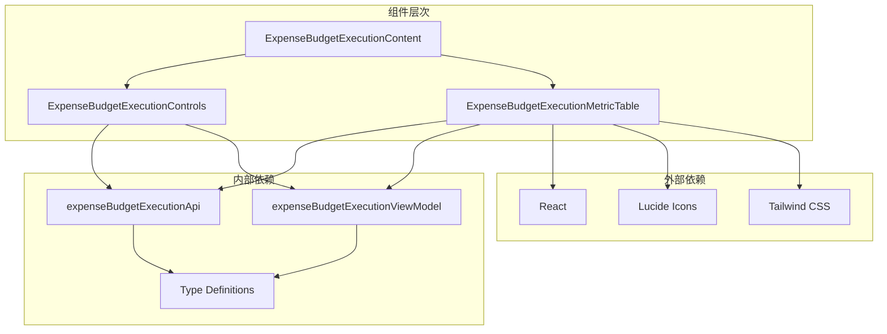

# 预算执行指标表格

<cite>
**本文档引用的文件**
- [ExpenseBudgetExecutionMetricTable.tsx](file://apps/web/src/app/components/ExpenseBudgetExecutionMetricTable.tsx)
- [expenseBudgetExecutionApi.ts](file://apps/web/src/lib/expenseBudgetExecutionApi.ts)
- [expenseBudgetExecutionViewModel.ts](file://apps/web/src/lib/expenseBudgetExecutionViewModel.ts)
- [ExpenseBudgetExecutionContent.tsx](file://apps/web/src/app/components/ExpenseBudgetExecutionContent.tsx)
- [ExpenseBudgetExecutionControls.tsx](file://apps/web/src/app/components/ExpenseBudgetExecutionControls.tsx)
- [expense-budget-execution-view-model.spec.ts](file://apps/web/e2e/expense-budget-execution-view-model.spec.ts)
</cite>

## 目录
1. [简介](#简介)
2. [项目结构](#项目结构)
3. [核心组件](#核心组件)
4. [架构概览](#架构概览)
5. [详细组件分析](#详细组件分析)
6. [依赖关系分析](#依赖关系分析)
7. [性能考虑](#性能考虑)
8. [故障排除指南](#故障排除指南)
9. [结论](#结论)

## 简介

ExpenseBudgetExecutionMetricTable 是一个专门用于展示预算执行指标的表格组件，主要用于显示部门费用预算执行情况。该组件支持多种展示模式，包括月报格式、部门模式和科目模式，能够灵活地展示预算执行的各项关键指标，包括当月实际支出、年度预算、预算进度、同比变化等重要财务指标。

该组件的核心功能包括：
- 多层次指标数据展示
- 标签合并功能优化视觉效果
- 月度数据的动态展开/收起
- 同比数据对比分析
- 汇总统计和分组折叠
- 单元格点击交互和数据导出

## 项目结构

预算执行指标表格组件位于前端应用的组件目录中，与相关的API服务和视图模型共同构成完整的预算执行报表系统。

**图表来源**
- [ExpenseBudgetExecutionMetricTable.tsx:1-344](file://apps/web/src/app/components/ExpenseBudgetExecutionMetricTable.tsx#L1-L344)
- [ExpenseBudgetExecutionContent.tsx:1-631](file://apps/web/src/app/components/ExpenseBudgetExecutionContent.tsx#L1-L631)

**章节来源**
- [ExpenseBudgetExecutionMetricTable.tsx:1-50](file://apps/web/src/app/components/ExpenseBudgetExecutionMetricTable.tsx#L1-L50)
- [ExpenseBudgetExecutionContent.tsx:1-100](file://apps/web/src/app/components/ExpenseBudgetExecutionContent.tsx#L1-L100)

## 核心组件

### ExpenseBudgetExecutionMetricTable 组件

ExpenseBudgetExecutionMetricTable 是预算执行指标表格的核心组件，负责渲染和展示预算执行数据。该组件采用函数式组件设计，使用React Hooks进行状态管理，并通过props接收配置参数。

#### 主要特性

1. **多级数据展示**：支持树形结构的预算科目层级展示
2. **标签合并**：可选的标签单元格合并功能，减少重复信息
3. **动态展开**：支持月度数据和去年同期数据的动态展开/收起
4. **分组折叠**：支持预算科目的分组折叠和展开
5. **格式化显示**：自动格式化数字和百分比显示

#### 关键属性

| 属性名 | 类型 | 必需 | 描述 |
|--------|------|------|------|
| title | string | 是 | 表格标题 |
| rows | ExpenseBudgetExecutionMetricRowDto[] | 是 | 行数据数组 |
| labelHeader | string | 是 | 标签列头部文本 |
| mergeLabelCells | boolean | 否 | 是否合并标签单元格，默认false |
| amountDivisor | number | 是 | 金额除数，用于单位转换 |
| visibleMonthlyLabels | string[] | 是 | 可见的月度标签 |
| visibleLastYearMonthlyLabels | string[] | 是 | 可见的去年同期标签 |
| collapsedMetricGroups | MetricCollapseState | 是 | 折叠状态映射 |
| setCollapsedMetricGroups | Dispatch<SetStateAction<MetricCollapseState>> | 是 | 更新折叠状态的函数 |
| metricMonthlyExpanded | MetricCollapseState | 是 | 月度数据展开状态 |
| setMetricMonthlyExpanded | Dispatch<SetStateAction<MetricCollapseState>> | 是 | 更新月度展开状态的函数 |
| metricLastYearExpanded | MetricCollapseState | 是 | 去年同期数据展开状态 |
| setMetricLastYearExpanded | Dispatch<SetStateAction<MetricCollapseState>> | 是 | 更新去年同期展开状态的函数 |

**章节来源**
- [ExpenseBudgetExecutionMetricTable.tsx:35-49](file://apps/web/src/app/components/ExpenseBudgetExecutionMetricTable.tsx#L35-L49)

## 架构概览

该组件采用分层架构设计，清晰分离了数据获取、数据处理和UI展示三个层面。

**图表来源**
- [ExpenseBudgetExecutionContent.tsx:193-203](file://apps/web/src/app/components/ExpenseBudgetExecutionContent.tsx#L193-L203)
- [ExpenseBudgetExecutionMetricTable.tsx:117-138](file://apps/web/src/app/components/ExpenseBudgetExecutionMetricTable.tsx#L117-L138)

## 详细组件分析

### 数据结构定义

组件使用了完整的类型定义体系来确保数据的正确性和一致性。

#### 指标行数据结构

**图表来源**
- [expenseBudgetExecutionApi.ts:56-70](file://apps/web/src/lib/expenseBudgetExecutionApi.ts#L56-L70)
- [ExpenseBudgetExecutionMetricTable.tsx:18-33](file://apps/web/src/app/components/ExpenseBudgetExecutionMetricTable.tsx#L18-L33)

#### 表头字段说明

组件支持以下关键指标字段：

| 字段名 | 显示名称 | 数据类型 | 用途 |
|--------|----------|----------|------|
| label | 标签 | string | 预算科目层级标签 |
| subject_name | 预算科目 | string | 科目名称 |
| current_actual | 本年实际 | number | 当月实际支出 |
| monthly_actuals | 月度实际 | number[] | 各月实际数据 |
| annual_budget | 年度预算 | number | 年度预算总额 |
| budget_progress | 预算进度% | number | 预算完成进度百分比 |
| yoy_change | 同比+- | number | 同比变化金额 |
| yoy_rate | 同比% | number | 同比变化百分比 |
| month_over_month | 本月环比增减额 | number | 本月与上月对比 |
| month_over_month_rate | 本月环比% | number | 本月环比变化百分比 |
| last_year_actual | 去年同期 | number | 去年同月实际 |
| previous_year_monthly_actuals | 去年同期月度 | number[] | 去年各月实际数据 |

**章节来源**
- [expenseBudgetExecutionApi.ts:56-70](file://apps/web/src/lib/expenseBudgetExecutionApi.ts#L56-L70)

### 标题配置系统

组件支持灵活的标题配置，允许用户自定义表格标题内容。

#### 标题渲染逻辑

**图表来源**
- [ExpenseBudgetExecutionMetricTable.tsx:157-198](file://apps/web/src/app/components/ExpenseBudgetExecutionMetricTable.tsx#L157-L198)

### 行数据格式化

组件提供了完整的数据格式化功能，支持多种数值格式的显示。

#### 数值格式化规则

| 格式类型 | 除数 | 小数位数 | 示例 |
|----------|------|----------|------|
| 元 | 1 | 0 | 123,456 |
| 千元 | 1,000 | 0 | 123 |
| 万元 | 10,000 | 0 | 12 |
| 百万元 | 1,000,000 | 0 | 1 |
| 亿元 | 100,000,000 | 1 | 1.2 |

#### 百分比格式化

百分比数据采用固定100倍转换，显示为整数百分比形式。

**章节来源**
- [expenseBudgetExecutionViewModel.ts:37-52](file://apps/web/src/lib/expenseBudgetExecutionViewModel.ts#L37-L52)

### 标签合并功能

标签合并是该组件的重要特性之一，能够有效减少表格中的重复信息，提升可读性。

#### 合并逻辑实现

**图表来源**
- [ExpenseBudgetExecutionMetricTable.tsx:268-303](file://apps/web/src/app/components/ExpenseBudgetExecutionMetricTable.tsx#L268-L303)

### 月度数据展示

组件支持动态的月度数据展示，用户可以根据需要展开或收起月度明细。

#### 月度数据控制

**图表来源**
- [ExpenseBudgetExecutionMetricTable.tsx:206-223](file://apps/web/src/app/components/ExpenseBudgetExecutionMetricTable.tsx#L206-L223)
- [ExpenseBudgetExecutionMetricTable.tsx:231-248](file://apps/web/src/app/components/ExpenseBudgetExecutionMetricTable.tsx#L231-L248)

### 同比数据对比

组件提供了完整的同比数据分析功能，帮助用户了解预算执行的变化趋势。

#### 同比分析字段

| 字段 | 描述 | 计算方式 |
|------|------|----------|
| yoy_change | 同比变化金额 | 本年实际 - 去年同期 |
| yoy_rate | 同比变化百分比 | (yoy_change / 去年同期) × 100% |

**章节来源**
- [ExpenseBudgetExecutionMetricTable.tsx:319-322](file://apps/web/src/app/components/ExpenseBudgetExecutionMetricTable.tsx#L319-L322)

### 汇总统计功能

组件支持自动识别和展示汇总行数据，通常用于显示小计和合计信息。

#### 汇总行识别规则

**图表来源**
- [ExpenseBudgetExecutionMetricTable.tsx:51-53](file://apps/web/src/app/components/ExpenseBudgetExecutionMetricTable.tsx#L51-L53)
- [ExpenseBudgetExecutionMetricTable.tsx:260-263](file://apps/web/src/app/components/ExpenseBudgetExecutionMetricTable.tsx#L260-L263)

### 样式定制选项

组件提供了丰富的样式定制选项，支持不同的视觉效果和用户体验。

#### 样式类定义

| 样式类 | 用途 | 应用场景 |
|--------|------|----------|
| `bg-amber-50` | 汇总行背景色 | 小计、合计行 |
| `font-semibold` | 加粗字体 | 汇总行文本 |
| `border-t-2` | 上边框样式 | 汇总行分隔线 |
| `text-slate-900` | 文本颜色 | 汇总行强调文本 |
| `odd:bg-white` | 奇数行背景 | 标准表格行 |
| `even:bg-gray-50` | 偶数行背景 | 标准表格行 |

**章节来源**
- [ExpenseBudgetExecutionMetricTable.tsx:261-263](file://apps/web/src/app/components/ExpenseBudgetExecutionMetricTable.tsx#L261-L263)

### 单元格点击交互

组件支持多种交互功能，包括展开/收起、排序等操作。

#### 交互功能列表

| 功能 | 触发方式 | 实现机制 |
|------|----------|----------|
| 分组展开/收起 | 点击箭头按钮 | 更新折叠状态 |
| 月度数据展开/收起 | 点击"本年实际"/"去年同期"按钮 | 切换展开标志 |
| 全部展开/收起 | 点击批量控制按钮 | 批量更新状态 |
| 行内数据查看 | 点击行内数据 | 触发数据详情 |

**章节来源**
- [ExpenseBudgetExecutionMetricTable.tsx:280-298](file://apps/web/src/app/components/ExpenseBudgetExecutionMetricTable.tsx#L280-L298)

### 数据导出功能

组件集成了完整的数据导出功能，支持将当前显示的表格数据导出为Excel文件。

#### 导出流程

**图表来源**
- [ExpenseBudgetExecutionContent.tsx:392-408](file://apps/web/src/app/components/ExpenseBudgetExecutionContent.tsx#L392-L408)

**章节来源**
- [ExpenseBudgetExecutionContent.tsx:392-408](file://apps/web/src/app/components/ExpenseBudgetExecutionContent.tsx#L392-L408)

## 依赖关系分析

组件之间的依赖关系体现了清晰的分层架构设计。

**图表来源**
- [ExpenseBudgetExecutionMetricTable.tsx:1-15](file://apps/web/src/app/components/ExpenseBudgetExecutionMetricTable.tsx#L1-L15)
- [ExpenseBudgetExecutionContent.tsx:1-36](file://apps/web/src/app/components/ExpenseBudgetExecutionContent.tsx#L1-L36)

### API接口依赖

组件依赖于完整的API接口体系，包括数据获取和导出功能。

#### API接口分类

| 接口类型 | 函数名 | 用途 |
|----------|--------|------|
| 数据获取 | getExpenseBudgetExecutionReport | 获取预算执行报表数据 |
| 数据导出 | exportExpenseBudgetExecutionReport | 导出预算执行报表 |
| 参数构建 | buildExpenseBudgetExecutionReportRequest | 构建查询请求参数 |
| 参数构建 | buildExpenseBudgetExecutionExportRequest | 构建导出请求参数 |

**章节来源**
- [expenseBudgetExecutionApi.ts:191-203](file://apps/web/src/lib/expenseBudgetExecutionApi.ts#L191-L203)

### 视图模型依赖

组件通过视图模型层处理数据格式化和状态管理。

#### 视图模型功能

| 功能类别 | 函数名 | 用途 |
|----------|--------|------|
| 格式化 | formatExpenseBudgetExecutionNumber | 数字格式化 |
| 格式化 | formatExpenseBudgetExecutionPercent | 百分比格式化 |
| 标准化 | normalizeExpenseBudgetExecutionReportMonth | 月份标准化 |
| 标准化 | normalizeExpenseBudgetExecutionAmountUnit | 单位标准化 |
| 标准化 | normalizeExpenseBudgetExecutionSubjectId | 科目ID标准化 |

**章节来源**
- [expenseBudgetExecutionViewModel.ts:37-85](file://apps/web/src/lib/expenseBudgetExecutionViewModel.ts#L37-L85)

## 性能考虑

组件在设计时充分考虑了性能优化，采用了多种策略来提升用户体验。

### 渲染优化

1. **Memo化优化**：使用`useMemo`缓存计算结果，避免不必要的重渲染
2. **分组预计算**：预先计算指标分组和可见行，减少渲染时的计算开销
3. **条件渲染**：根据展开状态动态渲染月度数据，避免渲染大量无用内容

### 内存管理

1. **状态隔离**：每个表格实例维护独立的状态，避免全局状态污染
2. **事件处理优化**：使用防抖和节流技术处理频繁的用户交互
3. **资源清理**：及时清理不再使用的状态和事件监听器

### 数据处理优化

1. **批量更新**：支持批量状态更新，减少多次重渲染
2. **懒加载**：月度数据采用懒加载策略，只在需要时才渲染
3. **虚拟滚动**：对于大量数据的情况，可以考虑实现虚拟滚动

## 故障排除指南

### 常见问题及解决方案

#### 表格数据显示异常

**问题症状**：表格显示空白或数据错乱
**可能原因**：
1. 数据格式不符合预期
2. 折叠状态配置错误
3. 单位转换参数异常

**解决步骤**：
1. 检查传入的`rows`数据格式
2. 验证`amountDivisor`参数设置
3. 确认折叠状态映射的键值正确

#### 月度数据不显示

**问题症状**：点击展开按钮后月度数据仍不显示
**可能原因**：
1. `visibleMonthlyLabels`为空
2. `metricMonthlyExpanded`状态未正确设置
3. 月度数据数组长度为0

**解决步骤**：
1. 检查`visibleMonthlyLabels`的生成逻辑
2. 验证`metricMonthlyExpanded`状态更新函数
3. 确认`monthly_actuals`数据存在且非空

#### 标签合并功能失效

**问题症状**：标签列出现重复信息
**可能原因**：
1. `mergeLabelCells`参数设置为false
2. 分组计算逻辑错误
3. 行跨度计算错误

**解决步骤**：
1. 确保`mergeLabelCells`参数设置为true
2. 检查分组计算函数的逻辑
3. 验证行跨度计算的准确性

**章节来源**
- [ExpenseBudgetExecutionMetricTable.tsx:134-138](file://apps/web/src/app/components/ExpenseBudgetExecutionMetricTable.tsx#L134-L138)

### 调试技巧

1. **开发者工具**：使用浏览器开发者工具检查DOM结构和CSS样式
2. **日志输出**：在关键函数中添加console.log输出调试信息
3. **状态检查**：通过React DevTools检查组件状态变化
4. **网络监控**：使用Network面板监控API请求和响应

## 结论

ExpenseBudgetExecutionMetricTable 组件是一个功能完整、设计精良的预算执行指标表格组件。它不仅提供了丰富的数据展示功能，还具备良好的扩展性和维护性。

### 主要优势

1. **功能完整性**：涵盖了预算执行分析所需的所有关键指标
2. **用户体验优秀**：支持多种交互方式和灵活的展示配置
3. **性能优化到位**：采用了多种优化策略确保流畅的用户体验
4. **代码质量高**：类型安全、结构清晰、易于维护

### 应用场景

该组件适用于以下场景：
- 预算执行情况监控
- 财务数据分析
- 部门费用管理
- 预算预测和规划

### 改进建议

1. **虚拟滚动**：对于大量数据的情况，可以考虑实现虚拟滚动
2. **搜索过滤**：增加行内搜索和过滤功能
3. **自定义列**：允许用户自定义显示的列和顺序
4. **主题定制**：提供更多样式的定制选项

该组件为预算执行分析提供了强大的工具支持，能够帮助用户更好地理解和分析预算执行情况。