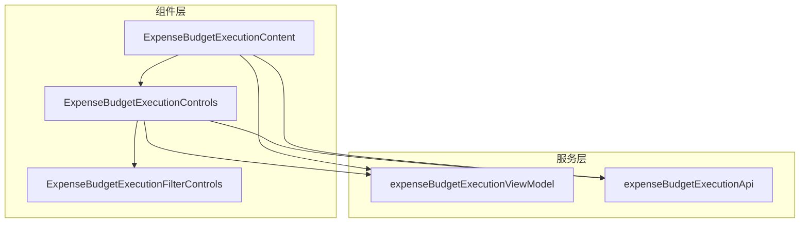
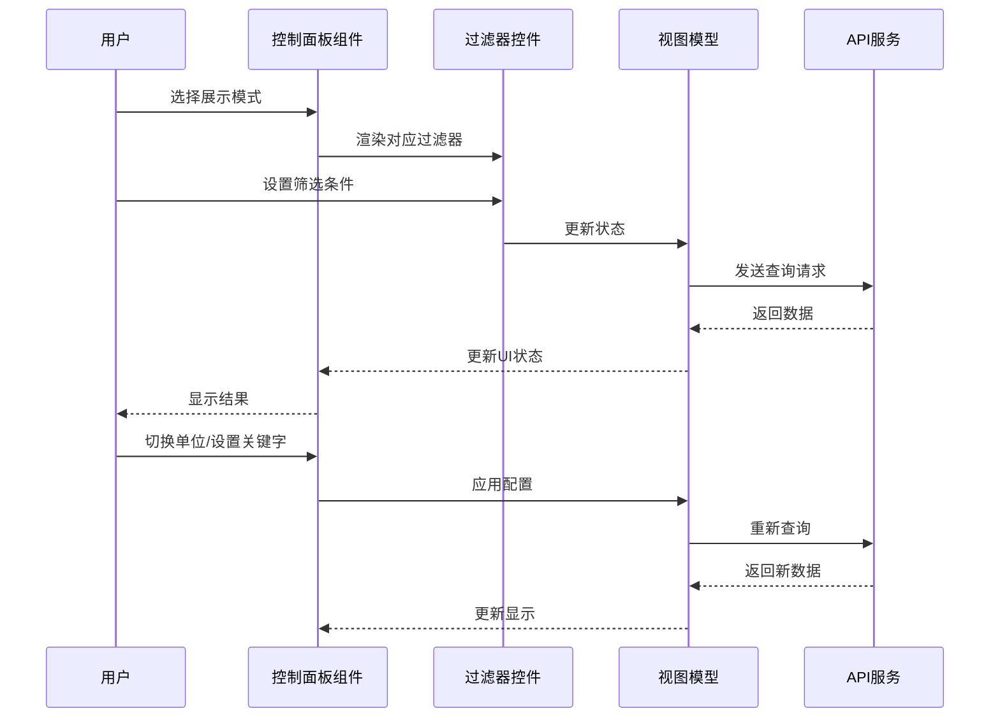
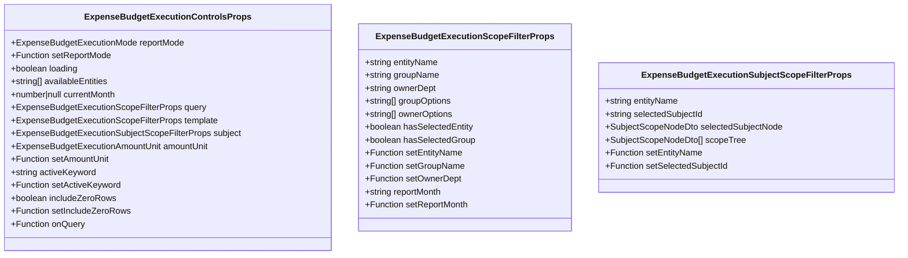
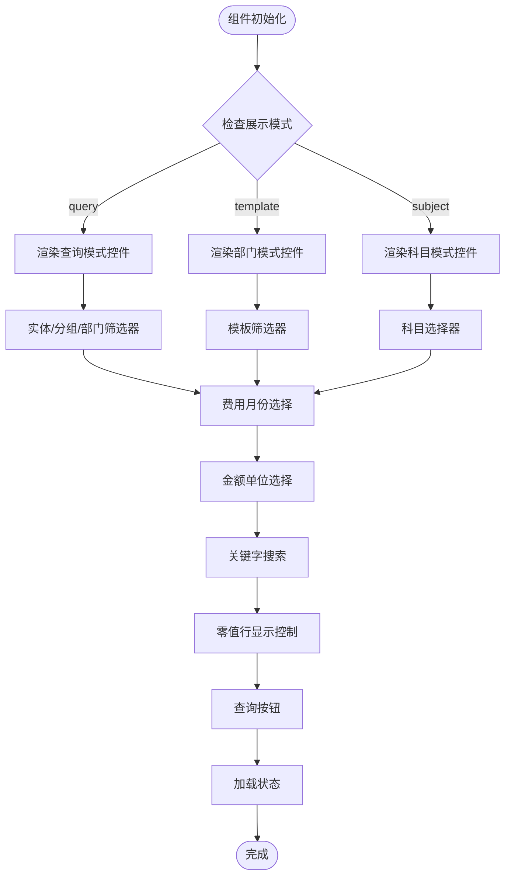
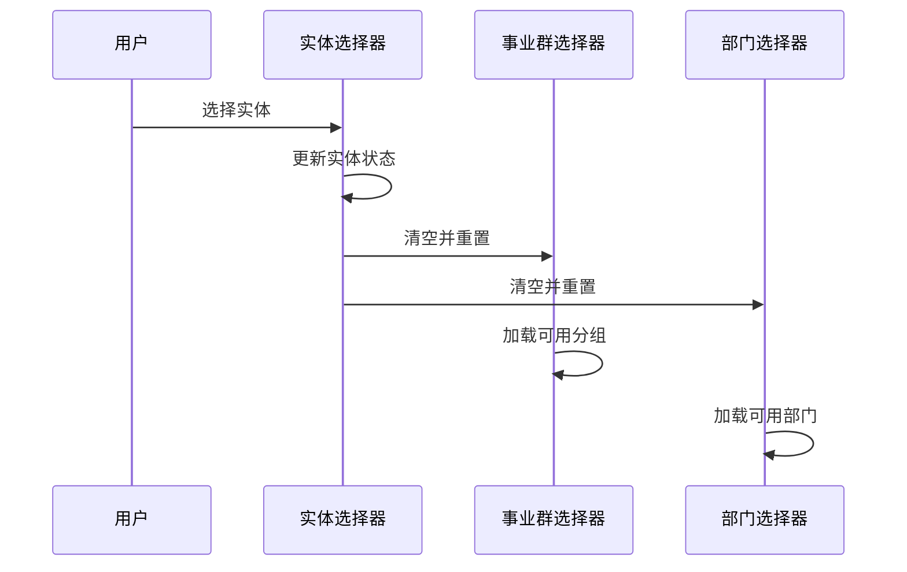
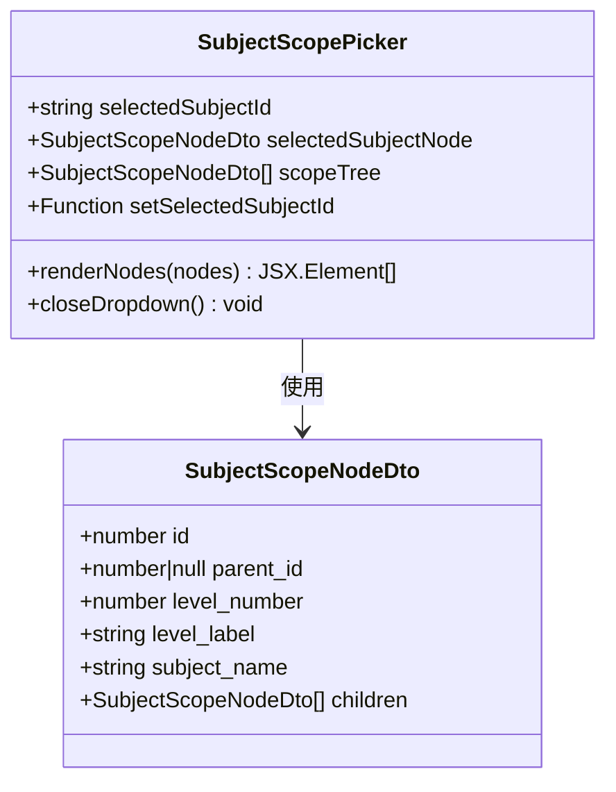
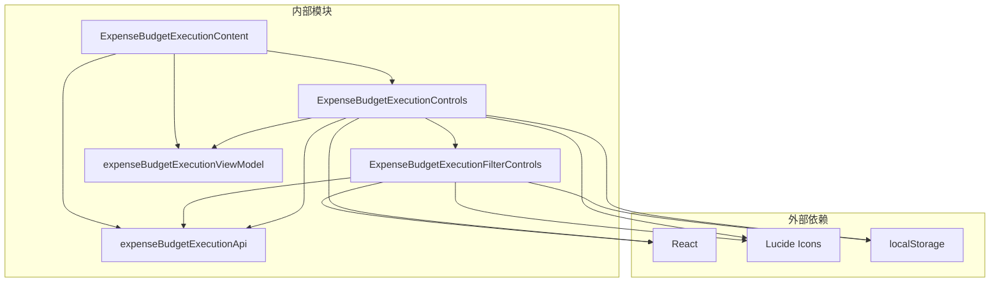

# 预算执行控制面板

<cite>
**本文档引用的文件**
- [ExpenseBudgetExecutionControls.tsx](file://apps/web/src/app/components/ExpenseBudgetExecutionControls.tsx)
- [ExpenseBudgetExecutionFilterControls.tsx](file://apps/web/src/app/components/ExpenseBudgetExecutionFilterControls.tsx)
- [ExpenseBudgetExecutionContent.tsx](file://apps/web/src/app/components/ExpenseBudgetExecutionContent.tsx)
- [expenseBudgetExecutionViewModel.ts](file://apps/web/src/lib/expenseBudgetExecutionViewModel.ts)
- [expenseBudgetExecutionApi.ts](file://apps/web/src/lib/expenseBudgetExecutionApi.ts)
</cite>

## 目录
1. [简介](#简介)
2. [项目结构](#项目结构)
3. [核心组件](#核心组件)
4. [架构概览](#架构概览)
5. [详细组件分析](#详细组件分析)
6. [依赖关系分析](#依赖关系分析)
7. [性能考虑](#性能考虑)
8. [故障排除指南](#故障排除指南)
9. [结论](#结论)
10. [附录](#附录)

## 简介
ExpenseBudgetExecutionControls 是预算执行控制面板的核心组件，负责提供用户与预算执行报表交互的界面控件。该组件支持三种展示模式（月报格式、部门模式、科目模式），提供灵活的查询过滤功能，包括实体选择、分组筛选、所有者部门选择、预算科目范围选择等，并支持金额单位切换和零值行显示控制等显示选项配置。

## 项目结构
ExpenseBudgetExecutionControls 组件位于前端应用的组件目录中，与相关的过滤器控件、视图模型和API服务共同构成完整的预算执行报表系统。



**图表来源**
- [ExpenseBudgetExecutionControls.tsx:1-182](file://apps/web/src/app/components/ExpenseBudgetExecutionControls.tsx#L1-L182)
- [ExpenseBudgetExecutionFilterControls.tsx:1-204](file://apps/web/src/app/components/ExpenseBudgetExecutionFilterControls.tsx#L1-L204)
- [ExpenseBudgetExecutionContent.tsx:1-631](file://apps/web/src/app/components/ExpenseBudgetExecutionContent.tsx#L1-L631)

**章节来源**
- [ExpenseBudgetExecutionControls.tsx:1-182](file://apps/web/src/app/components/ExpenseBudgetExecutionControls.tsx#L1-L182)
- [ExpenseBudgetExecutionFilterControls.tsx:1-204](file://apps/web/src/app/components/ExpenseBudgetExecutionFilterControls.tsx#L1-L204)
- [ExpenseBudgetExecutionContent.tsx:1-631](file://apps/web/src/app/components/ExpenseBudgetExecutionContent.tsx#L1-L631)

## 核心组件
ExpenseBudgetExecutionControls 组件提供了以下核心功能：

### 展示模式切换
- 支持三种展示模式：月报格式、部门模式、科目模式
- 动态渲染不同的过滤器组合
- 根据模式自动调整可用的过滤选项

### 实体选择与分组筛选
- 主体（企业）选择下拉框
- 事业群分组筛选
- 费用归属部门选择
- 自动级联更新机制

### 预算科目范围选择
- 科目树形选择器
- 支持多层级科目浏览
- 详细的科目信息展示

### 金额单位与显示选项
- 多种金额单位切换（元、千元、万元、百万元、亿元）
- 关键字搜索功能
- 零值行显示控制

**章节来源**
- [ExpenseBudgetExecutionControls.tsx:18-43](file://apps/web/src/app/components/ExpenseBudgetExecutionControls.tsx#L18-L43)
- [ExpenseBudgetExecutionFilterControls.tsx:4-24](file://apps/web/src/app/components/ExpenseBudgetExecutionFilterControls.tsx#L4-L24)

## 架构概览
组件采用分层架构设计，将UI逻辑与业务逻辑分离，通过清晰的接口定义实现组件间的解耦。



**图表来源**
- [ExpenseBudgetExecutionControls.tsx:51-182](file://apps/web/src/app/components/ExpenseBudgetExecutionControls.tsx#L51-L182)
- [ExpenseBudgetExecutionContent.tsx:496-553](file://apps/web/src/app/components/ExpenseBudgetExecutionContent.tsx#L496-L553)
- [expenseBudgetExecutionViewModel.ts:221-237](file://apps/web/src/lib/expenseBudgetExecutionViewModel.ts#L221-L237)

## 详细组件分析

### ExpenseBudgetExecutionControls 组件
ExpenseBudgetExecutionControls 是主控制面板组件，负责协调各个子组件的工作。

#### Props 接口定义
组件通过严格的TypeScript接口定义了所有必需的属性：



**图表来源**
- [ExpenseBudgetExecutionControls.tsx:18-43](file://apps/web/src/app/components/ExpenseBudgetExecutionControls.tsx#L18-L43)
- [ExpenseBudgetExecutionFilterControls.tsx:4-24](file://apps/web/src/app/components/ExpenseBudgetExecutionFilterControls.tsx#L4-L24)

#### 交互逻辑
组件实现了复杂的条件渲染和状态管理逻辑：



**图表来源**
- [ExpenseBudgetExecutionControls.tsx:70-182](file://apps/web/src/app/components/ExpenseBudgetExecutionControls.tsx#L70-L182)

**章节来源**
- [ExpenseBudgetExecutionControls.tsx:51-182](file://apps/web/src/app/components/ExpenseBudgetExecutionControls.tsx#L51-L182)

### ExpenseBudgetExecutionFilterControls 子组件
过滤器控件集合提供了具体的筛选功能实现。

#### 实体选择器
实体选择器支持动态加载可用实体列表，并提供级联更新功能：



**图表来源**
- [ExpenseBudgetExecutionFilterControls.tsx:56-82](file://apps/web/src/app/components/ExpenseBudgetExecutionFilterControls.tsx#L56-L82)
- [ExpenseBudgetExecutionFilterControls.tsx:84-141](file://apps/web/src/app/components/ExpenseBudgetExecutionFilterControls.tsx#L84-L141)

#### 科目范围选择器
科目范围选择器提供树形结构的科目浏览功能：



**图表来源**
- [ExpenseBudgetExecutionFilterControls.tsx:143-203](file://apps/web/src/app/components/ExpenseBudgetExecutionFilterControls.tsx#L143-L203)

**章节来源**
- [ExpenseBudgetExecutionFilterControls.tsx:1-204](file://apps/web/src/app/components/ExpenseBudgetExecutionFilterControls.tsx#L1-L204)

### 视图模型与API集成
ExpenseBudgetExecutionViewModel 提供了数据处理和状态管理功能：

#### 数据格式化
- 金额单位转换和格式化
- 百分比格式化
- 报告月份标准化

#### 请求构建
- 报告请求参数构建
- 导出请求参数构建
- 状态到请求的映射

**章节来源**
- [expenseBudgetExecutionViewModel.ts:17-78](file://apps/web/src/lib/expenseBudgetExecutionViewModel.ts#L17-L78)
- [expenseBudgetExecutionViewModel.ts:221-255](file://apps/web/src/lib/expenseBudgetExecutionViewModel.ts#L221-L255)

## 依赖关系分析



**图表来源**
- [ExpenseBudgetExecutionControls.tsx:1-12](file://apps/web/src/app/components/ExpenseBudgetExecutionControls.tsx#L1-L12)
- [ExpenseBudgetExecutionFilterControls.tsx:1-1](file://apps/web/src/app/components/ExpenseBudgetExecutionFilterControls.tsx#L1-L1)
- [ExpenseBudgetExecutionContent.tsx:1-36](file://apps/web/src/app/components/ExpenseBudgetExecutionContent.tsx#L1-L36)

**章节来源**
- [ExpenseBudgetExecutionControls.tsx:1-12](file://apps/web/src/app/components/ExpenseBudgetExecutionControls.tsx#L1-L12)
- [ExpenseBudgetExecutionFilterControls.tsx:1-1](file://apps/web/src/app/components/ExpenseBudgetExecutionFilterControls.tsx#L1-L1)
- [ExpenseBudgetExecutionContent.tsx:1-36](file://apps/web/src/app/components/ExpenseBudgetExecutionContent.tsx#L1-L36)

## 性能考虑
组件在设计时充分考虑了性能优化：

### 状态管理优化
- 使用 useMemo 缓存计算结果
- 合理的 useEffect 依赖数组配置
- 避免不必要的重渲染

### 数据处理优化
- 单位转换使用预计算的除数
- 选项列表使用 Set 去重
- 条件渲染减少DOM节点数量

### 用户体验优化
- 加载状态指示
- 错误处理和提示
- 本地存储持久化

## 故障排除指南

### 常见问题及解决方案

#### 组件无法渲染
- 检查 props 是否正确传递
- 确认依赖的API服务正常工作
- 验证数据格式是否符合预期

#### 过滤器无响应
- 检查 hasSelectedEntity 和 hasSelectedGroup 状态
- 确认级联更新逻辑是否正确执行
- 验证选项列表是否正确加载

#### 金额显示异常
- 检查 amountUnit 的值是否有效
- 确认除数计算是否正确
- 验证格式化函数的调用

**章节来源**
- [ExpenseBudgetExecutionControls.tsx:172-179](file://apps/web/src/app/components/ExpenseBudgetExecutionControls.tsx#L172-L179)
- [expenseBudgetExecutionViewModel.ts:37-52](file://apps/web/src/lib/expenseBudgetExecutionViewModel.ts#L37-L52)

## 结论
ExpenseBudgetExecutionControls 组件是一个功能完整、设计合理的预算执行控制面板。它通过清晰的组件分层、严格的类型定义和完善的错误处理机制，为用户提供了一个强大而易用的预算执行报表查询界面。组件的设计体现了良好的软件工程实践，具有良好的可维护性和扩展性。

## 附录

### 组件使用示例
组件可以在 ExpenseBudgetExecutionContent 中作为子组件使用：

```typescript
// 在 ExpenseBudgetExecutionContent 中的使用方式
<ExpenseBudgetExecutionControls
  reportMode={reportMode}
  setReportMode={setReportMode}
  loading={loading}
  availableEntities={availableEntities}
  currentMonth={report?.current_month ?? null}
  query={{
    entityName: queryEntityName,
    groupName: queryGroupName,
    ownerDept: queryOwnerDept,
    reportMonth: queryReportMonth,
    groupOptions: queryGroupOptions,
    ownerOptions: queryOwnerOptions,
    hasSelectedEntity: hasSelectedQueryEntity,
    hasSelectedGroup: hasSelectedQueryGroup,
    setEntityName: setQueryEntityName,
    setGroupName: setQueryGroupName,
    setOwnerDept: setQueryOwnerDept,
    setReportMonth: setQueryReportMonth,
  }}
  template={{
    entityName: templateEntityName,
    groupName: templateGroupName,
    ownerDept: templateOwnerDept,
    reportMonth: templateReportMonth,
    groupOptions: templateGroupOptions,
    ownerOptions: templateOwnerOptions,
    hasSelectedEntity: hasSelectedTemplateEntity,
    hasSelectedGroup: hasSelectedTemplateGroup,
    setEntityName: setTemplateEntityName,
    setGroupName: setTemplateGroupName,
    setOwnerDept: setTemplateOwnerDept,
    setReportMonth: setTemplateReportMonth,
  }}
  subject={{
    entityName: subjectEntityName,
    selectedSubjectId: subjectSelectedId,
    selectedSubjectNode,
    scopeTree: subjectScopeTree,
    reportMonth: subjectReportMonth,
    setEntityName: setSubjectEntityName,
    setSelectedSubjectId: setSubjectSelectedId,
    setReportMonth: setSubjectReportMonth,
  }}
  amountUnit={amountUnit}
  setAmountUnit={setAmountUnit}
  activeKeyword={activeKeyword}
  setActiveKeyword={(value) => {
    if (keywordMode === "template") {
      setTemplateKeyword(value);
    } else if (keywordMode === "subject") {
      setSubjectKeyword(value);
    }
  }}
  includeZeroRows={includeZeroRows}
  setIncludeZeroRows={setIncludeZeroRows}
  onQuery={() => void loadReport()}
/>
```

### 自定义配置方法
组件支持多种自定义配置：

1. **展示模式定制**：通过 reportMode prop 定义不同的展示模式
2. **过滤器配置**：通过 query、template、subject props 配置不同的过滤器组合
3. **显示选项**：通过 amountUnit、includeZeroRows、activeKeyword 等 prop 定制显示行为
4. **事件处理**：通过 onQuery、setAmountUnit、setIncludeZeroRows 等回调函数处理用户交互

**章节来源**
- [ExpenseBudgetExecutionContent.tsx:496-553](file://apps/web/src/app/components/ExpenseBudgetExecutionContent.tsx#L496-L553)