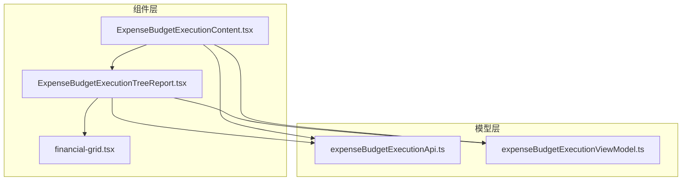
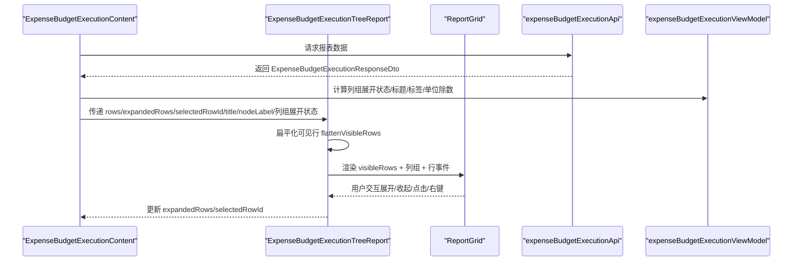
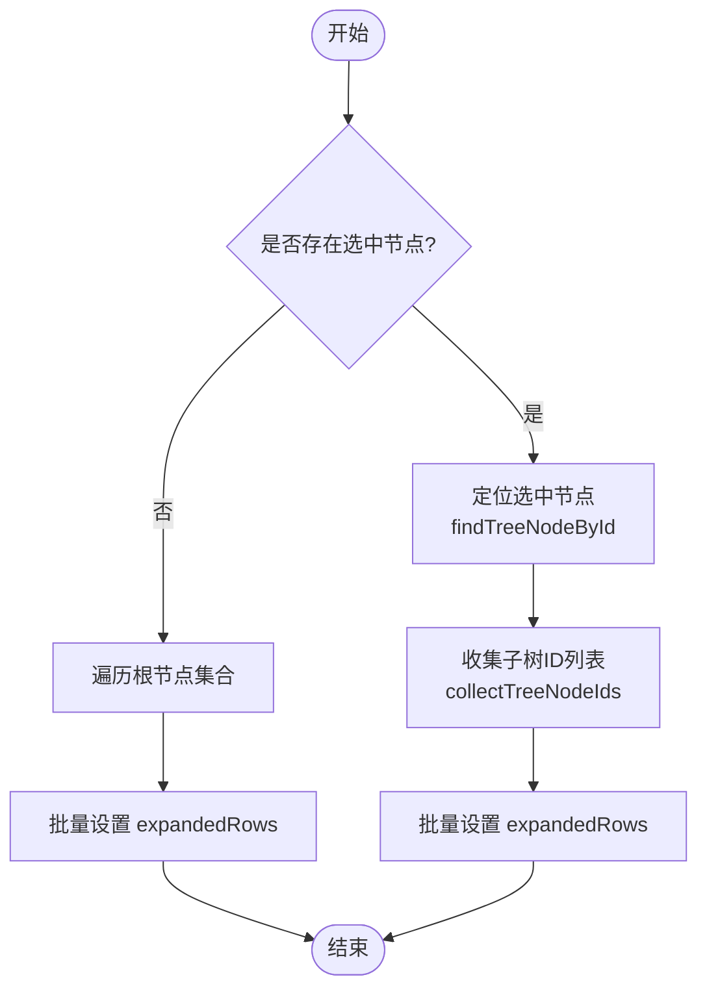
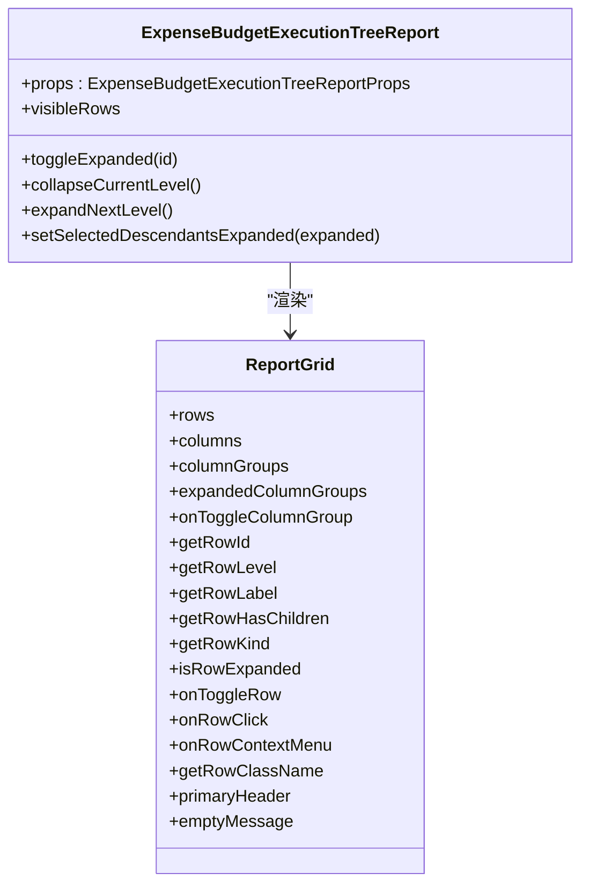
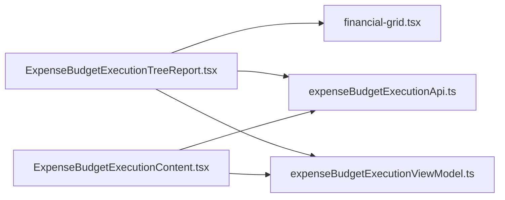

# 预算执行树形报告

<cite>
**本文引用的文件列表**
- [ExpenseBudgetExecutionTreeReport.tsx](file://apps/web/src/app/components/ExpenseBudgetExecutionTreeReport.tsx)
- [ExpenseBudgetExecutionContent.tsx](file://apps/web/src/app/components/ExpenseBudgetExecutionContent.tsx)
- [financial-grid.tsx](file://apps/web/src/app/components/ui/financial-grid.tsx)
- [expenseBudgetExecutionApi.ts](file://apps/web/src/lib/expenseBudgetExecutionApi.ts)
- [expenseBudgetExecutionViewModel.ts](file://apps/web/src/lib/expenseBudgetExecutionViewModel.ts)
</cite>

## 目录
1. [简介](#简介)
2. [项目结构](#项目结构)
3. [核心组件](#核心组件)
4. [架构总览](#架构总览)
5. [详细组件分析](#详细组件分析)
6. [依赖关系分析](#依赖关系分析)
7. [性能考量](#性能考量)
8. [故障排查指南](#故障排查指南)
9. [结论](#结论)
10. [附录](#附录)

## 简介
本文件系统性地解析预算执行树形报告组件 ExpenseBudgetExecutionTreeReport 的设计与实现，重点覆盖：
- 树形结构展示与层级导航
- 树节点展开/收起逻辑与选中状态管理
- 层级关系渲染与列组折叠控制
- 报告标题配置、节点标签与加载状态处理
- 性能优化策略（扁平化可见行、列组折叠）
- 大数据集处理建议与交互示例
- 自定义渲染方法与扩展点

该组件基于通用财务网格 ReportGrid 构建，支持“本年实际/预算口径/同比/环比/去年同期”等多维度列组，并通过列组折叠控制隐藏/显示月度明细列，提升大表格的可读性与性能。

## 项目结构
ExpenseBudgetExecutionTreeReport 所在目录与周边模块如下：
- 组件层：apps/web/src/app/components/ExpenseBudgetExecutionTreeReport.tsx
- 视图容器：apps/web/src/app/components/ExpenseBudgetExecutionContent.tsx
- 通用网格：apps/web/src/app/components/ui/financial-grid.tsx
- 类型与API：apps/web/src/lib/expenseBudgetExecutionApi.ts
- 视图模型与格式化：apps/web/src/lib/expenseBudgetExecutionViewModel.ts

图表来源
- [ExpenseBudgetExecutionTreeReport.tsx:76-449](file://apps/web/src/app/components/ExpenseBudgetExecutionTreeReport.tsx#L76-L449)
- [ExpenseBudgetExecutionContent.tsx:443-463](file://apps/web/src/app/components/ExpenseBudgetExecutionContent.tsx#L443-L463)
- [financial-grid.tsx:70-234](file://apps/web/src/app/components/ui/financial-grid.tsx#L70-L234)
- [expenseBudgetExecutionApi.ts:25-45](file://apps/web/src/lib/expenseBudgetExecutionApi.ts#L25-L45)
- [expenseBudgetExecutionViewModel.ts:284-319](file://apps/web/src/lib/expenseBudgetExecutionViewModel.ts#L284-L319)

章节来源
- [ExpenseBudgetExecutionTreeReport.tsx:76-449](file://apps/web/src/app/components/ExpenseBudgetExecutionTreeReport.tsx#L76-L449)
- [ExpenseBudgetExecutionContent.tsx:443-463](file://apps/web/src/app/components/ExpenseBudgetExecutionContent.tsx#L443-L463)
- [financial-grid.tsx:70-234](file://apps/web/src/app/components/ui/financial-grid.tsx#L70-L234)
- [expenseBudgetExecutionApi.ts:25-45](file://apps/web/src/lib/expenseBudgetExecutionApi.ts#L25-L45)
- [expenseBudgetExecutionViewModel.ts:284-319](file://apps/web/src/lib/expenseBudgetExecutionViewModel.ts#L284-L319)

## 核心组件
ExpenseBudgetExecutionTreeReport 是一个树形财务报表组件，负责：
- 接收树节点数据 rows 与展开状态 expandedRows
- 计算可见行 visibleRows（按展开状态扁平化）
- 提供列组折叠（本年实际/去年同期）与列组切换回调
- 提供树级操作按钮：收起本级、展开下级、展开全部下级、收起全部下级
- 提供右键菜单，支持对单节点进行展开/收起、展开全部下级、收起全部下级与取消选中
- 提供节点选中态样式与空态文案

章节来源
- [ExpenseBudgetExecutionTreeReport.tsx:76-449](file://apps/web/src/app/components/ExpenseBudgetExecutionTreeReport.tsx#L76-L449)

## 架构总览
ExpenseBudgetExecutionTreeReport 作为视图组件，通过 ReportGrid 渲染树形表格。其数据流与职责划分如下：
- ExpenseBudgetExecutionContent 负责加载数据、维护过滤状态、计算列组展开状态与选中节点 ID，并将这些状态传递给 ExpenseBudgetExecutionTreeReport
- ExpenseBudgetExecutionTreeReport 将传入的 rows 与 expandedRows 扁平化为 visibleRows，交由 ReportGrid 渲染
- ReportGrid 负责列组可见性、行展开/折叠、点击/右键事件以及单元格渲染

图表来源
- [ExpenseBudgetExecutionContent.tsx:193-237](file://apps/web/src/app/components/ExpenseBudgetExecutionContent.tsx#L193-L237)
- [ExpenseBudgetExecutionTreeReport.tsx:66-97](file://apps/web/src/app/components/ExpenseBudgetExecutionTreeReport.tsx#L66-L97)
- [financial-grid.tsx:70-234](file://apps/web/src/app/components/ui/financial-grid.tsx#L70-L234)
- [expenseBudgetExecutionApi.ts:191-197](file://apps/web/src/lib/expenseBudgetExecutionApi.ts#L191-L197)
- [expenseBudgetExecutionViewModel.ts:284-319](file://apps/web/src/lib/expenseBudgetExecutionViewModel.ts#L284-L319)

## 详细组件分析

### 树节点展开/收起逻辑
- 单节点展开/收起：toggleExpanded(id) 切换 expandedRows[id]
- 收起当前级别：collapseCurrentLevel
  - 若存在选中节点，则仅收起该节点
  - 否则收起所有一级节点
- 展开下一级：expandNextLevel
  - 若存在选中节点，则仅展开该节点
  - 否则展开所有一级节点
- 展开全部下级：setSelectedDescendantsExpanded(true)
  - 若无选中节点，则对整棵树递归设置 expanded=true
  - 若有选中节点，则先定位该节点，收集其子树 ID 列表，再批量设置 expanded=true
- 收起全部下级：setSelectedDescendantsExpanded(false)
  - 逻辑同上，但设置为 false

图表来源
- [ExpenseBudgetExecutionTreeReport.tsx:113-172](file://apps/web/src/app/components/ExpenseBudgetExecutionTreeReport.tsx#L113-L172)
- [ExpenseBudgetExecutionTreeReport.tsx:48-64](file://apps/web/src/app/components/ExpenseBudgetExecutionTreeReport.tsx#L48-L64)

章节来源
- [ExpenseBudgetExecutionTreeReport.tsx:113-172](file://apps/web/src/app/components/ExpenseBudgetExecutionTreeReport.tsx#L113-L172)

### 选中状态管理与层级关系渲染
- 选中状态：selectedRowId 与 setSelectedRowId 控制当前选中节点
- 选中态样式：getRowClassName 返回选中节点的背景色类名
- 层级关系：getRowLevel 使用 node.level_number，用于 ReportGrid 渲染层级缩进
- 节点标签：getRowLabel 渲染节点名称，若 reportMode 不为 "subject"，还会显示层级标签
- 子节点判断：getRowHasChildren 使用 node.children.length > 0
- 行种类：getRowKind 对汇总行使用 summary 样式

章节来源
- [ExpenseBudgetExecutionTreeReport.tsx:335-349](file://apps/web/src/app/components/ExpenseBudgetExecutionTreeReport.tsx#L335-L349)

### 树形报告的标题配置、节点标签与加载状态
- 标题与节点标签：通过 expenseBudgetExecutionViewModel.getExpenseBudgetExecutionTreeMeta 获取
  - nodeLabel：节点标签（如“费用类型”、“部门”）
  - title：报告标题
  - loadingText：加载提示文本
- 加载状态：loading 为真时，visibleRows 为空，ReportGrid 显示 loadingText
- 空态文案：根据 reportMode 决定不同空态提示

章节来源
- [ExpenseBudgetExecutionTreeReport.tsx:280-368](file://apps/web/src/app/components/ExpenseBudgetExecutionTreeReport.tsx#L280-L368)
- [expenseBudgetExecutionViewModel.ts:284-307](file://apps/web/src/lib/expenseBudgetExecutionViewModel.ts#L284-L307)

### 列组与列定义
- 列组：本年实际、预算口径、同比、环比、去年同期
- 列组折叠：通过 expandedColumnGroups 控制，支持 onToggleColumnGroup 回调
- 月度列：动态生成当月及去年同期的月度列，隐藏时随组折叠
- 数值格式化：formatExpenseBudgetExecutionNumber 与 formatExpenseBudgetExecutionPercent

图表来源
- [ExpenseBudgetExecutionTreeReport.tsx:174-276](file://apps/web/src/app/components/ExpenseBudgetExecutionTreeReport.tsx#L174-L276)
- [financial-grid.tsx:28-49](file://apps/web/src/app/components/ui/financial-grid.tsx#L28-L49)

章节来源
- [ExpenseBudgetExecutionTreeReport.tsx:174-276](file://apps/web/src/app/components/ExpenseBudgetExecutionTreeReport.tsx#L174-L276)
- [financial-grid.tsx:28-49](file://apps/web/src/app/components/ui/financial-grid.tsx#L28-L49)

### 右键菜单与交互
- 右键触发：onRowContextMenu 设置 contextMenu，包含节点坐标与状态
- 右键菜单项：
  - 展开/收起本级（仅子节点时）
  - 展开全部下级
  - 收起全部下级
  - 取消选中
- 菜单外点击关闭：useEffect 监听外部点击并关闭菜单

章节来源
- [ExpenseBudgetExecutionTreeReport.tsx:95-111](file://apps/web/src/app/components/ExpenseBudgetExecutionTreeReport.tsx#L95-L111)
- [ExpenseBudgetExecutionTreeReport.tsx:352-446](file://apps/web/src/app/components/ExpenseBudgetExecutionTreeReport.tsx#L352-L446)

### 数据结构与类型
- ExpenseBudgetExecutionTemplateSubjectNodeDto：树节点数据结构，包含 id、parent_id、level_number、level_label、subject_name、children、财务指标等
- ExpenseBudgetExecutionMode：查询模式（query/template/subject）

章节来源
- [expenseBudgetExecutionApi.ts:25-45](file://apps/web/src/lib/expenseBudgetExecutionApi.ts#L25-L45)
- [expenseBudgetExecutionApi.ts:5-8](file://apps/web/src/lib/expenseBudgetExecutionApi.ts#L5-L8)

### 与容器组件的集成
- ExpenseBudgetExecutionContent 负责：
  - 维护 reportMode、过滤条件、金额单位、列组展开状态
  - 计算 amountDivisor、visibleMonthlyLabels、visibleLastYearMonthlyLabels
  - 传递 expandedRows、selectedRowId、列组展开状态给 ExpenseBudgetExecutionTreeReport
- 通过 getExpenseBudgetExecutionTreeMeta 动态设置标题、节点标签与加载提示

章节来源
- [ExpenseBudgetExecutionContent.tsx:443-463](file://apps/web/src/app/components/ExpenseBudgetExecutionContent.tsx#L443-L463)
- [expenseBudgetExecutionViewModel.ts:284-319](file://apps/web/src/lib/expenseBudgetExecutionViewModel.ts#L284-L319)

## 依赖关系分析
- ExpenseBudgetExecutionTreeReport 依赖：
  - ReportGrid（通用财务网格）
  - expenseBudgetExecutionApi（类型定义）
  - expenseBudgetExecutionViewModel（格式化、列组计算、标题元数据）
- ExpenseBudgetExecutionContent 依赖：
  - expenseBudgetExecutionApi（请求与导出）
  - expenseBudgetExecutionViewModel（构建请求、列组、标题元数据、存储键）

图表来源
- [ExpenseBudgetExecutionTreeReport.tsx:1-16](file://apps/web/src/app/components/ExpenseBudgetExecutionTreeReport.tsx#L1-L16)
- [ExpenseBudgetExecutionContent.tsx:1-36](file://apps/web/src/app/components/ExpenseBudgetExecutionContent.tsx#L1-L36)
- [financial-grid.tsx:1-16](file://apps/web/src/app/components/ui/financial-grid.tsx#L1-L16)
- [expenseBudgetExecutionApi.ts:1-9](file://apps/web/src/lib/expenseBudgetExecutionApi.ts#L1-L9)
- [expenseBudgetExecutionViewModel.ts:1-9](file://apps/web/src/lib/expenseBudgetExecutionViewModel.ts#L1-L9)

章节来源
- [ExpenseBudgetExecutionTreeReport.tsx:1-16](file://apps/web/src/app/components/ExpenseBudgetExecutionTreeReport.tsx#L1-L16)
- [ExpenseBudgetExecutionContent.tsx:1-36](file://apps/web/src/app/components/ExpenseBudgetExecutionContent.tsx#L1-L36)

## 性能考量
- 可见行扁平化：flattenVisibleRows 在每次渲染前按 expandedRows 将树扁平化为可见行，避免渲染整棵子树，显著降低 DOM 节点数量
- 列组折叠：通过 expandedColumnGroups 控制月度列的显示/隐藏，减少列数与重排成本
- 选中态样式：仅对选中节点应用背景类名，避免全局样式计算
- 数值格式化：formatExpenseBudgetExecutionNumber/formatExpenseBudgetExecutionPercent 使用本地化格式，避免额外计算开销
- 大数据集建议：
  - 优先使用列组折叠隐藏月度列
  - 控制初始展开层级，避免一次性展开过多节点
  - 对超大节点树考虑分页或虚拟滚动（当前 ReportGrid 未内置虚拟滚动，可在上层容器引入虚拟滚动方案）

章节来源
- [ExpenseBudgetExecutionTreeReport.tsx:66-97](file://apps/web/src/app/components/ExpenseBudgetExecutionTreeReport.tsx#L66-L97)
- [financial-grid.tsx:65-96](file://apps/web/src/app/components/ui/financial-grid.tsx#L65-L96)

## 故障排查指南
- 无法展开/收起节点
  - 检查 expandedRows 是否正确传入与更新
  - 确认 getRowHasChildren 与 isRowExpanded 的实现是否一致
- 选中态不生效
  - 检查 selectedRowId 与 getRowId 的匹配（当前使用字符串 ID）
  - 确认 getRowClassName 的返回值
- 右键菜单不出现
  - 检查 onRowContextMenu 是否被调用
  - 确认 contextMenuRef 与外部点击监听
- 列组折叠无效
  - 检查 expandedColumnGroups 与 onToggleColumnGroup 的联动
  - 确认 hiddenWhenGroupCollapsed 与 groupId 的一致性

章节来源
- [ExpenseBudgetExecutionTreeReport.tsx:95-111](file://apps/web/src/app/components/ExpenseBudgetExecutionTreeReport.tsx#L95-L111)
- [ExpenseBudgetExecutionTreeReport.tsx:320-370](file://apps/web/src/app/components/ExpenseBudgetExecutionTreeReport.tsx#L320-L370)
- [financial-grid.tsx:65-96](file://apps/web/src/app/components/ui/financial-grid.tsx#L65-L96)

## 结论
ExpenseBudgetExecutionTreeReport 通过 ReportGrid 实现了预算执行树形报表的核心能力：树形层级导航、节点展开/收起、选中态管理、列组折叠与动态月度列渲染。配合 ExpenseBudgetExecutionContent 的状态管理与 ViewModel 的元数据计算，实现了灵活的标题配置、节点标签与加载状态处理。对于大数据集，建议结合列组折叠与合理的初始展开策略，必要时引入虚拟滚动以进一步提升性能。

## 附录

### 交互示例
- 展开/收起本级：点击工具栏“展开下级/收起本级”，或在右键菜单选择对应项
- 展开/收起全部下级：点击工具栏“展开全部下级/收起全部下级”
- 取消选中：在右键菜单选择“取消选中”

章节来源
- [ExpenseBudgetExecutionTreeReport.tsx:283-318](file://apps/web/src/app/components/ExpenseBudgetExecutionTreeReport.tsx#L283-L318)
- [ExpenseBudgetExecutionTreeReport.tsx:352-446](file://apps/web/src/app/components/ExpenseBudgetExecutionTreeReport.tsx#L352-L446)

### 自定义渲染方法
- 自定义列渲染：通过 columns 中的 render 函数替换默认数值渲染
- 自定义行标签：通过 getRowLabel 自定义节点标签内容与层级标签显示
- 自定义行样式：通过 getRowClassName 自定义选中态或其他行样式
- 自定义空态：通过 emptyMessage 自定义加载/空态文案

章节来源
- [ExpenseBudgetExecutionTreeReport.tsx:191-276](file://apps/web/src/app/components/ExpenseBudgetExecutionTreeReport.tsx#L191-L276)
- [ExpenseBudgetExecutionTreeReport.tsx:335-368](file://apps/web/src/app/components/ExpenseBudgetExecutionTreeReport.tsx#L335-L368)
- [financial-grid.tsx:28-49](file://apps/web/src/app/components/ui/financial-grid.tsx#L28-L49)