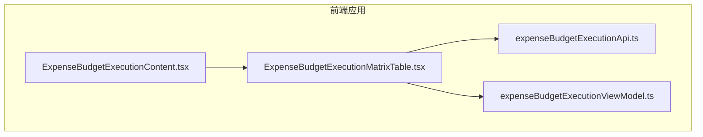
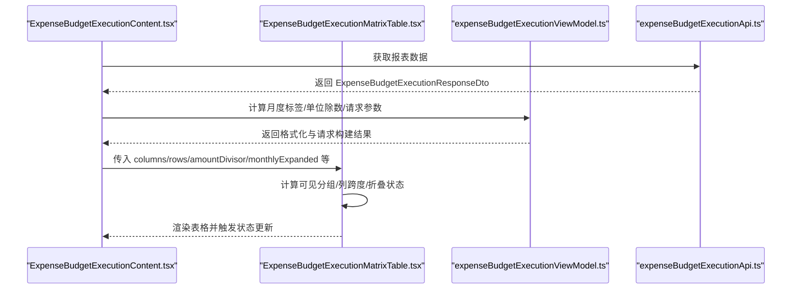
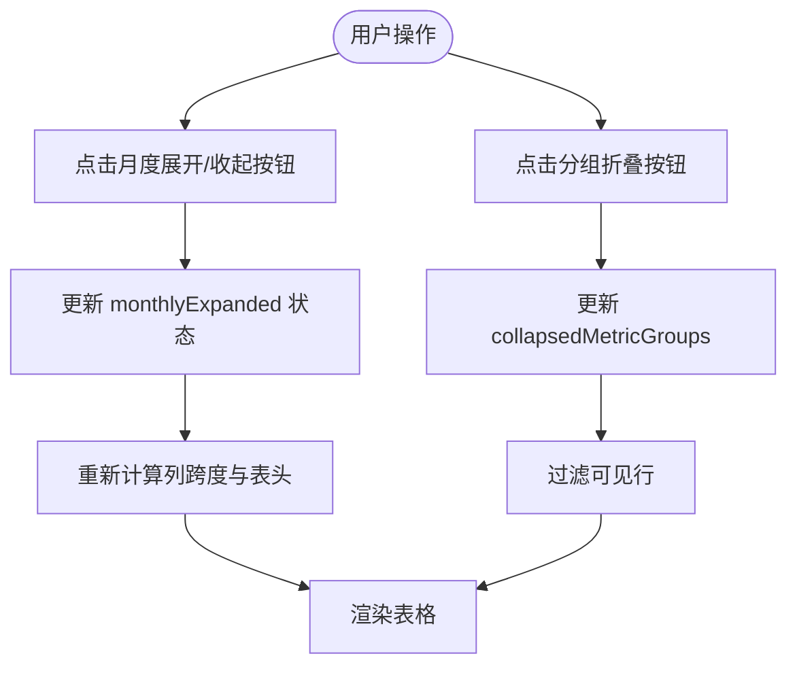
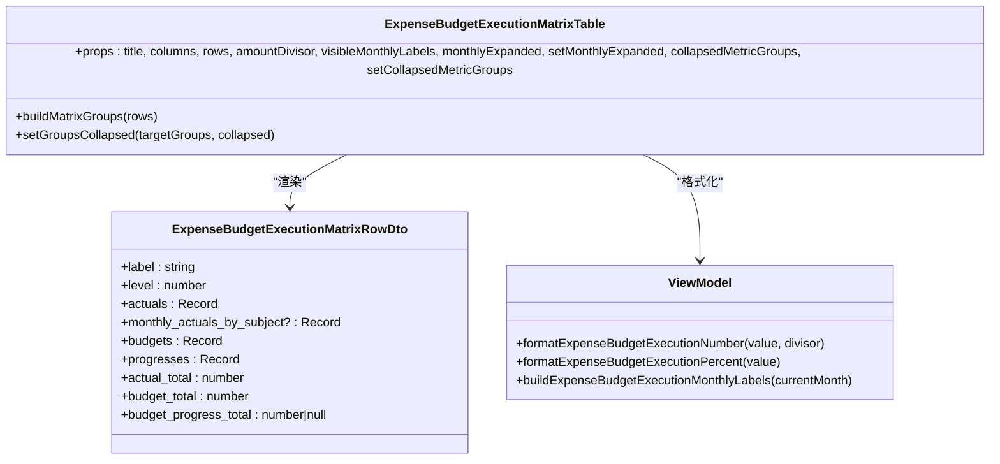

# 预算执行矩阵表格

<cite>
**本文引用的文件**
- [ExpenseBudgetExecutionMatrixTable.tsx](file://apps/web/src/app/components/ExpenseBudgetExecutionMatrixTable.tsx)
- [expenseBudgetExecutionApi.ts](file://apps/web/src/lib/expenseBudgetExecutionApi.ts)
- [expenseBudgetExecutionViewModel.ts](file://apps/web/src/lib/expenseBudgetExecutionViewModel.ts)
- [ExpenseBudgetExecutionContent.tsx](file://apps/web/src/app/components/ExpenseBudgetExecutionContent.tsx)
</cite>

## 目录
1. [简介](#简介)
2. [项目结构](#项目结构)
3. [核心组件](#核心组件)
4. [架构总览](#架构总览)
5. [组件详解](#组件详解)
6. [依赖关系分析](#依赖关系分析)
7. [性能考量](#性能考量)
8. [故障排查指南](#故障排查指南)
9. [结论](#结论)
10. [附录](#附录)

## 简介
本文件系统化阐述“预算执行矩阵表格”组件 ExpenseBudgetExecutionMatrixTable 的设计与实现，覆盖数据结构、列定义、行渲染、单元格格式化、月度展开/收起、指标分组折叠与聚合、滚动与响应式布局、可访问性支持，以及定制化与性能优化实践。该组件负责以矩阵形式展示“日常费用-分解至使用部门”的预算执行数据，支持按预算科目维度拆分的实际/预算/进度列组，并提供层级折叠、月度明细展开等交互能力。

## 项目结构
- 组件位于前端应用目录，作为 ExpenseBudgetExecution 报表体系中的子视图之一，与其他子表（如指标表、树形报表）协同工作。
- 数据契约与格式化逻辑分别由 API 类型定义与视图模型模块提供，确保组件职责清晰、边界明确。

图表来源
- [ExpenseBudgetExecutionContent.tsx:32-38](file://apps/web/src/app/components/ExpenseBudgetExecutionContent.tsx#L32-L38)
- [ExpenseBudgetExecutionMatrixTable.tsx:1-311](file://apps/web/src/app/components/ExpenseBudgetExecutionMatrixTable.tsx#L1-L311)
- [expenseBudgetExecutionApi.ts:77-88](file://apps/web/src/lib/expenseBudgetExecutionApi.ts#L77-L88)
- [expenseBudgetExecutionViewModel.ts:37-52](file://apps/web/src/lib/expenseBudgetExecutionViewModel.ts#L37-L52)

章节来源
- [ExpenseBudgetExecutionContent.tsx:32-38](file://apps/web/src/app/components/ExpenseBudgetExecutionContent.tsx#L32-L38)

## 核心组件
- ExpenseBudgetExecutionMatrixTable：矩阵表格组件，负责渲染“部门-预算科目”双维度的预算执行数据，支持月度列组展开、指标分组折叠、汇总行高亮与格式化显示。
- 数据契约 ExpenseBudgetExecutionMatrixRowDto：定义每行的标签、层级、实际/预算/进度等字段及可选的按预算科目拆分的月度明细。
- 视图模型函数 formatExpenseBudgetExecutionNumber/formatExpenseBudgetExecutionPercent：统一数字与百分比格式化策略，支持单位除数与小数位控制。

章节来源
- [ExpenseBudgetExecutionMatrixTable.tsx:25-35](file://apps/web/src/app/components/ExpenseBudgetExecutionMatrixTable.tsx#L25-L35)
- [expenseBudgetExecutionApi.ts:77-88](file://apps/web/src/lib/expenseBudgetExecutionApi.ts#L77-L88)
- [expenseBudgetExecutionViewModel.ts:37-52](file://apps/web/src/lib/expenseBudgetExecutionViewModel.ts#L37-L52)

## 架构总览
组件通过 props 接收标题、动态列集合、行数据、金额单位除数、可见月度标签、月度展开状态与折叠状态等输入，内部计算可见分组、列跨度与汇总样式，最终渲染为一个可横向滚动的表格。

图表来源
- [ExpenseBudgetExecutionContent.tsx:32-38](file://apps/web/src/app/components/ExpenseBudgetExecutionContent.tsx#L32-L38)
- [ExpenseBudgetExecutionMatrixTable.tsx:59-69](file://apps/web/src/app/components/ExpenseBudgetExecutionMatrixTable.tsx#L59-L69)
- [expenseBudgetExecutionViewModel.ts:309-311](file://apps/web/src/lib/expenseBudgetExecutionViewModel.ts#L309-L311)
- [expenseBudgetExecutionApi.ts:191-203](file://apps/web/src/lib/expenseBudgetExecutionApi.ts#L191-L203)

## 组件详解

### 数据结构与列定义
- 行数据结构（ExpenseBudgetExecutionMatrixRowDto）
  - label：行标签（如部门或指标名称）
  - level：层级（用于缩进与折叠）
  - actuals：按预算科目维度的实际值映射
  - monthly_actuals_by_subject：按预算科目维度的月度明细数组
  - budgets：按预算科目维度的预算值映射
  - progresses：按预算科目维度的预算进度映射
  - actual_total/budget_total/budget_progress_total：合计行值
- 列定义
  - 动态列：columns 为预算科目列表，每个科目形成一组三列：实际、预算、进度%
  - 月度展开时，每个科目列进一步拆分为“累计+各月明细”，并追加该科目小计
  - 无月度展开时，每个科目列直接显示当月实际、预算、进度%，并追加合计
  - 表头采用跨行/跨列组合，第一行为“本年实际/本年预算/预算进度%”三大组，第二/三层根据月度展开状态生成具体列

章节来源
- [expenseBudgetExecutionApi.ts:77-88](file://apps/web/src/lib/expenseBudgetExecutionApi.ts#L77-L88)
- [ExpenseBudgetExecutionMatrixTable.tsx:76-79](file://apps/web/src/app/components/ExpenseBudgetExecutionMatrixTable.tsx#L76-L79)
- [ExpenseBudgetExecutionMatrixTable.tsx:156-214](file://apps/web/src/app/components/ExpenseBudgetExecutionMatrixTable.tsx#L156-L214)

### 行渲染与单元格格式化
- 行渲染
  - 可见行集：基于父级折叠状态过滤，仅展示未被祖先折叠的行
  - 层级缩进：通过 level 控制左内边距，形成树形缩进
  - 折叠按钮：存在子节点的行显示展开/收起图标，点击切换当前行的折叠状态
  - 汇总行样式：level<=1 的行使用强调背景与加粗文本，突出关键汇总
- 单元格格式化
  - 数字：按 amountDivisor 进行单位换算并本地化格式化
  - 百分比：按 0-100 显示整数百分比
  - 合计列：在每组科目列末尾追加合计列，使用与行样式一致的强调类名

章节来源
- [ExpenseBudgetExecutionMatrixTable.tsx:70-75](file://apps/web/src/app/components/ExpenseBudgetExecutionMatrixTable.tsx#L70-L75)
- [ExpenseBudgetExecutionMatrixTable.tsx:224-303](file://apps/web/src/app/components/ExpenseBudgetExecutionMatrixTable.tsx#L224-L303)
- [ExpenseBudgetExecutionMatrixTable.tsx:266-298](file://apps/web/src/app/components/ExpenseBudgetExecutionMatrixTable.tsx#L266-L298)
- [expenseBudgetExecutionViewModel.ts:37-52](file://apps/web/src/lib/expenseBudgetExecutionViewModel.ts#L37-L52)

### 月度展开/收起功能
- 顶层控制
  - 月度展开开关：表头“本年实际”区域提供展开/收起按钮，切换整表的月度列组展开状态
  - 分组控制：提供“收起本级/展开下级/展开全部下级/收起全部下级”四个快捷按钮，作用于指标分组树
- 交互逻辑
  - 月度展开状态由 monthlyExpanded 控制，影响列跨度与表头层级
  - 指标分组折叠状态由 collapsedMetricGroups 控制，通过 setCollapsedMetricGroups 更新
  - 行内折叠：每行的折叠按钮仅影响其子节点可见性，不改变兄弟节点

图表来源
- [ExpenseBudgetExecutionMatrixTable.tsx:96-131](file://apps/web/src/app/components/ExpenseBudgetExecutionMatrixTable.tsx#L96-L131)
- [ExpenseBudgetExecutionMatrixTable.tsx:76-79](file://apps/web/src/app/components/ExpenseBudgetExecutionMatrixTable.tsx#L76-L79)
- [ExpenseBudgetExecutionMatrixTable.tsx:236-252](file://apps/web/src/app/components/ExpenseBudgetExecutionMatrixTable.tsx#L236-L252)

章节来源
- [ExpenseBudgetExecutionMatrixTable.tsx:96-131](file://apps/web/src/app/components/ExpenseBudgetExecutionMatrixTable.tsx#L96-L131)
- [ExpenseBudgetExecutionMatrixTable.tsx:81-89](file://apps/web/src/app/components/ExpenseBudgetExecutionMatrixTable.tsx#L81-L89)

### 指标分组折叠与数据聚合
- 分组构建
  - 使用 buildMatrixGroups 将线性行序列转换为带父子键链的分组结构，识别是否有子节点
- 可见性过滤
  - visibleGroups 过滤掉任一祖先处于折叠状态的行，保证只显示完整可见树
- 聚合机制
  - 合计行：每组科目列末尾追加合计列；行级合计字段 actual_total/budget_total/budget_progress_total 提供行级汇总
  - 月度合计：当月度展开时，每个科目列组包含“累计+各月明细”，并在组末追加小计

章节来源
- [ExpenseBudgetExecutionMatrixTable.tsx:37-57](file://apps/web/src/app/components/ExpenseBudgetExecutionMatrixTable.tsx#L37-L57)
- [ExpenseBudgetExecutionMatrixTable.tsx:70-75](file://apps/web/src/app/components/ExpenseBudgetExecutionMatrixTable.tsx#L70-L75)
- [ExpenseBudgetExecutionMatrixTable.tsx:289-300](file://apps/web/src/app/components/ExpenseBudgetExecutionMatrixTable.tsx#L289-L300)

### 表格渲染与布局
- 滚动优化
  - 外层容器使用 overflow-auto，避免表格超出视口导致页面布局异常
  - 表格设置最小宽度与固定列宽策略，保证横向滚动时列对齐稳定
- 响应式布局
  - 表头采用跨行/跨列组合，减少重复信息；月度展开时增加表头层级，提升可读性
  - 合计列与科目列组保持对齐，便于用户快速定位
- 可访问性支持
  - 使用语义化表格结构（thead/tbody/tr/td），配合合适的标题与提示文案
  - 按钮具备 title 提示，图标具备可读性替代文本
  - 交互元素具备键盘可达性（按钮类型与事件绑定）

章节来源
- [ExpenseBudgetExecutionMatrixTable.tsx:134-136](file://apps/web/src/app/components/ExpenseBudgetExecutionMatrixTable.tsx#L134-L136)
- [ExpenseBudgetExecutionMatrixTable.tsx:138-155](file://apps/web/src/app/components/ExpenseBudgetExecutionMatrixTable.tsx#L138-L155)
- [ExpenseBudgetExecutionMatrixTable.tsx:233-258](file://apps/web/src/app/components/ExpenseBudgetExecutionMatrixTable.tsx#L233-L258)

### 定制化示例
- 自定义列组
  - 通过 columns 参数传入预算科目列表，即可动态生成“实际/预算/进度%”三列组
- 单位换算
  - 通过 amountDivisor 设置单位除数，统一数字格式化策略
- 月度标签
  - 通过 visibleMonthlyLabels 控制月度展开时的可见月份标签集合
- 折叠策略
  - 通过 collapsedMetricGroups 与 setCollapsedMetricGroups 实现按需折叠/展开
- 样式与主题
  - 通过 CSS 类名控制汇总行样式、边框与背景色，满足不同主题一致性

章节来源
- [ExpenseBudgetExecutionMatrixTable.tsx:25-35](file://apps/web/src/app/components/ExpenseBudgetExecutionMatrixTable.tsx#L25-L35)
- [expenseBudgetExecutionViewModel.ts:17-23](file://apps/web/src/lib/expenseBudgetExecutionViewModel.ts#L17-L23)
- [expenseBudgetExecutionViewModel.ts:309-311](file://apps/web/src/lib/expenseBudgetExecutionViewModel.ts#L309-L311)

## 依赖关系分析

图表来源
- [ExpenseBudgetExecutionMatrixTable.tsx:25-35](file://apps/web/src/app/components/ExpenseBudgetExecutionMatrixTable.tsx#L25-L35)
- [ExpenseBudgetExecutionMatrixTable.tsx:37-57](file://apps/web/src/app/components/ExpenseBudgetExecutionMatrixTable.tsx#L37-L57)
- [expenseBudgetExecutionApi.ts:77-88](file://apps/web/src/lib/expenseBudgetExecutionApi.ts#L77-L88)
- [expenseBudgetExecutionViewModel.ts:37-52](file://apps/web/src/lib/expenseBudgetExecutionViewModel.ts#L37-L52)

章节来源
- [ExpenseBudgetExecutionMatrixTable.tsx:59-69](file://apps/web/src/app/components/ExpenseBudgetExecutionMatrixTable.tsx#L59-L69)
- [expenseBudgetExecutionApi.ts:77-88](file://apps/web/src/lib/expenseBudgetExecutionApi.ts#L77-L88)
- [expenseBudgetExecutionViewModel.ts:37-52](file://apps/web/src/lib/expenseBudgetExecutionViewModel.ts#L37-L52)

## 性能考量
- 渲染优化
  - 使用 useMemo 缓存分组计算结果，避免每次渲染都重建分组结构
  - 可见行过滤在渲染前完成，减少 DOM 节点数量
- 列跨度计算
  - 根据月度展开状态与动态列数量计算列跨度，避免重复计算
- 单元格格式化
  - 数字与百分比格式化集中到视图模型，减少重复逻辑与计算开销
- 滚动与布局
  - 外层容器滚动避免大表格撑破布局，提高首屏渲染效率

章节来源
- [ExpenseBudgetExecutionMatrixTable.tsx:70-71](file://apps/web/src/app/components/ExpenseBudgetExecutionMatrixTable.tsx#L70-L71)
- [ExpenseBudgetExecutionMatrixTable.tsx:76-79](file://apps/web/src/app/components/ExpenseBudgetExecutionMatrixTable.tsx#L76-L79)
- [expenseBudgetExecutionViewModel.ts:37-52](file://apps/web/src/lib/expenseBudgetExecutionViewModel.ts#L37-L52)

## 故障排查指南
- 无数据时的空状态
  - 当 rows 为空时，表格显示“当前条件下没有可展示的数据”，避免空白表格带来的困惑
- 月度展开异常
  - 若 visibleMonthlyLabels 为空或不正确，可能导致列组数量与表头不匹配；请检查上游数据与标签生成逻辑
- 折叠状态不生效
  - 确认 collapsedMetricGroups 的 key 与 buildMatrixGroups 生成的 key 一致；检查 setCollapsedMetricGroups 的调用路径
- 单位换算错误
  - amountDivisor 必须与单位选项一致；若显示异常，请核对单位除数与格式化函数

章节来源
- [ExpenseBudgetExecutionMatrixTable.tsx:217-222](file://apps/web/src/app/components/ExpenseBudgetExecutionMatrixTable.tsx#L217-L222)
- [ExpenseBudgetExecutionMatrixTable.tsx:39-42](file://apps/web/src/app/components/ExpenseBudgetExecutionMatrixTable.tsx#L39-L42)
- [expenseBudgetExecutionViewModel.ts:75-78](file://apps/web/src/lib/expenseBudgetExecutionViewModel.ts#L75-L78)

## 结论
ExpenseBudgetExecutionMatrixTable 通过清晰的数据契约、灵活的列组与月度展开、可靠的分组折叠与聚合、稳定的滚动与响应式布局，以及统一的格式化策略，实现了预算执行矩阵的高效可视化。结合视图模型的格式化与单位换算能力，组件在可维护性与可扩展性方面表现良好，适合在复杂预算场景中复用与定制。

## 附录
- 相关接口与类型
  - ExpenseBudgetExecutionMatrixRowDto：定义矩阵行的核心字段
  - formatExpenseBudgetExecutionNumber/formatExpenseBudgetExecutionPercent：统一格式化函数
  - buildExpenseBudgetExecutionMonthlyLabels：生成月度标签集合

章节来源
- [expenseBudgetExecutionApi.ts:77-88](file://apps/web/src/lib/expenseBudgetExecutionApi.ts#L77-L88)
- [expenseBudgetExecutionViewModel.ts:37-52](file://apps/web/src/lib/expenseBudgetExecutionViewModel.ts#L37-L52)
- [expenseBudgetExecutionViewModel.ts:309-311](file://apps/web/src/lib/expenseBudgetExecutionViewModel.ts#L309-L311)