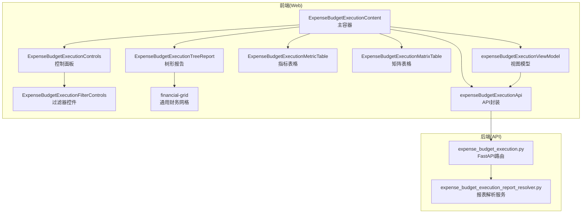
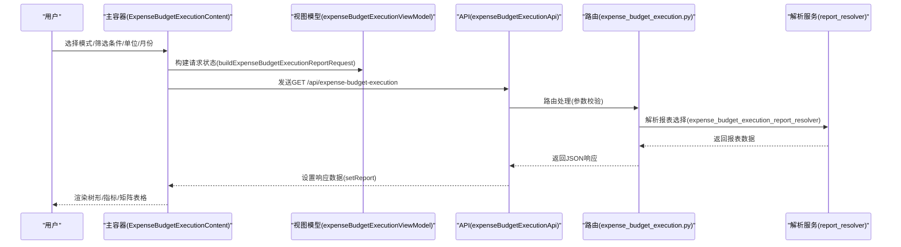
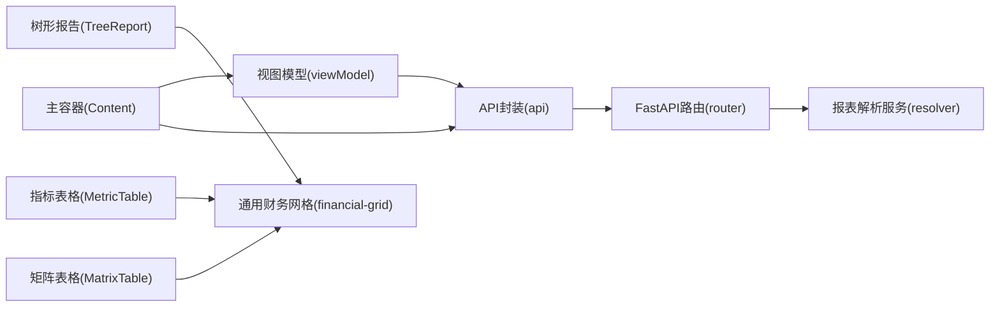
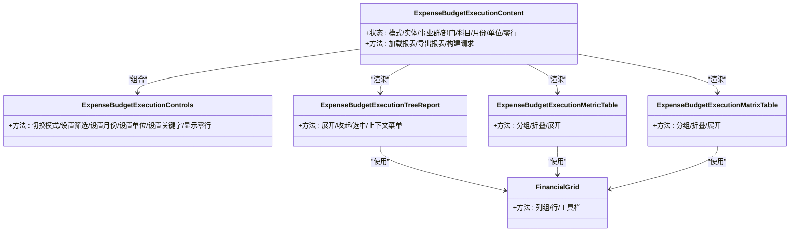

# 预算执行组件

<cite>
**本文档引用的文件**
- [ExpenseBudgetExecutionContent.tsx](file://apps/web/src/app/components/ExpenseBudgetExecutionContent.tsx)
- [ExpenseBudgetExecutionControls.tsx](file://apps/web/src/app/components/ExpenseBudgetExecutionControls.tsx)
- [ExpenseBudgetExecutionFilterControls.tsx](file://apps/web/src/app/components/ExpenseBudgetExecutionFilterControls.tsx)
- [ExpenseBudgetExecutionTreeReport.tsx](file://apps/web/src/app/components/ExpenseBudgetExecutionTreeReport.tsx)
- [ExpenseBudgetExecutionMetricTable.tsx](file://apps/web/src/app/components/ExpenseBudgetExecutionMetricTable.tsx)
- [ExpenseBudgetExecutionMatrixTable.tsx](file://apps/web/src/app/components/ExpenseBudgetExecutionMatrixTable.tsx)
- [financial-grid.tsx](file://apps/web/src/app/components/ui/financial-grid.tsx)
- [expenseBudgetExecutionApi.ts](file://apps/web/src/lib/expenseBudgetExecutionApi.ts)
- [expenseBudgetExecutionViewModel.ts](file://apps/web/src/lib/expenseBudgetExecutionViewModel.ts)
- [expense_budget_execution.py](file://apps/api/app/routers/expense_budget_execution.py)
- [expense_budget_execution_report_resolver.py](file://apps/api/app/services/expense_budget_execution_report_resolver.py)
- [expense-budget-execution-view-model.spec.ts](file://apps/web/e2e/expense-budget-execution-view-model.spec.ts)
</cite>

## 目录
1. [简介](#简介)
2. [项目结构](#项目结构)
3. [核心组件](#核心组件)
4. [架构总览](#架构总览)
5. [详细组件分析](#详细组件分析)
6. [依赖关系分析](#依赖关系分析)
7. [性能考量](#性能考量)
8. [故障排查指南](#故障排查指南)
9. [结论](#结论)
10. [附录](#附录)

## 简介
本文件系统性地梳理预算执行相关前端组件与后端API的协作机制，覆盖以下方面：
- 预算执行内容组件：作为主容器，协调过滤器、树形报告、指标表格与矩阵表格，并负责状态持久化与数据刷新。
- 控制面板：提供模式切换、实体/事业群/部门筛选、预算科目选择、月份选择、单位切换、关键字搜索与显示选项等。
- 过滤器：封装实体选择、范围筛选、预算科目树选择与月份选择等控件。
- 树形报告组件：基于通用财务网格组件，支持列组折叠/展开、行展开/收起、上下文菜单与选中态高亮。
- 指标表格：支持按标签分组、行内月度/同比/环比等多维度展示，具备分组折叠/展开能力。
- 矩阵表格：用于“日常费用-分解至使用部门”的宽表展示，支持本年实际按月拆分与预算进度对比。
- 数据流与状态管理：本地存储键值、请求构建、响应解析、导出策略与错误处理。
- 后端集成：FastAPI路由、请求参数校验、报表解析与导出。

## 项目结构
预算执行功能由Web前端与API后端协同完成，前端通过统一API接口获取数据并渲染多种视图，后端根据请求参数解析框架与实际数据生成报表。

**图表来源**
- [ExpenseBudgetExecutionContent.tsx:1-631](file://apps/web/src/app/components/ExpenseBudgetExecutionContent.tsx#L1-L631)
- [ExpenseBudgetExecutionControls.tsx:1-182](file://apps/web/src/app/components/ExpenseBudgetExecutionControls.tsx#L1-L182)
- [ExpenseBudgetExecutionFilterControls.tsx:1-204](file://apps/web/src/app/components/ExpenseBudgetExecutionFilterControls.tsx#L1-L204)
- [ExpenseBudgetExecutionTreeReport.tsx:1-450](file://apps/web/src/app/components/ExpenseBudgetExecutionTreeReport.tsx#L1-L450)
- [ExpenseBudgetExecutionMetricTable.tsx:1-344](file://apps/web/src/app/components/ExpenseBudgetExecutionMetricTable.tsx#L1-L344)
- [ExpenseBudgetExecutionMatrixTable.tsx:1-311](file://apps/web/src/app/components/ExpenseBudgetExecutionMatrixTable.tsx#L1-L311)
- [financial-grid.tsx:1-250](file://apps/web/src/app/components/ui/financial-grid.tsx#L1-L250)
- [expenseBudgetExecutionApi.ts:1-204](file://apps/web/src/lib/expenseBudgetExecutionApi.ts#L1-L204)
- [expenseBudgetExecutionViewModel.ts:1-319](file://apps/web/src/lib/expenseBudgetExecutionViewModel.ts#L1-L319)
- [expense_budget_execution.py:1-201](file://apps/api/app/routers/expense_budget_execution.py#L1-L201)
- [expense_budget_execution_report_resolver.py:1-200](file://apps/api/app/services/expense_budget_execution_report_resolver.py#L1-L200)

**章节来源**
- [ExpenseBudgetExecutionContent.tsx:1-631](file://apps/web/src/app/components/ExpenseBudgetExecutionContent.tsx#L1-L631)
- [expenseBudgetExecutionApi.ts:1-204](file://apps/web/src/lib/expenseBudgetExecutionApi.ts#L1-L204)
- [expenseBudgetExecutionViewModel.ts:1-319](file://apps/web/src/lib/expenseBudgetExecutionViewModel.ts#L1-L319)
- [expense_budget_execution.py:1-201](file://apps/api/app/routers/expense_budget_execution.py#L1-L201)
- [expense_budget_execution_report_resolver.py:1-200](file://apps/api/app/services/expense_budget_execution_report_resolver.py#L1-L200)

## 核心组件
- 主容器组件：负责状态管理、请求构建、数据加载与导出、本地存储读写、树形/指标/矩阵表格的组合渲染。
- 控制面板：提供模式切换、实体/事业群/部门筛选、预算科目选择、月份选择、单位切换、关键字搜索与显示选项。
- 过滤器控件：封装实体选择、范围筛选、预算科目树选择与月份选择。
- 树形报告：基于通用财务网格，支持列组折叠/展开、行展开/收起、上下文菜单与选中态高亮。
- 指标表格：支持按标签分组、行内月度/同比/环比等多维度展示，具备分组折叠/展开能力。
- 矩阵表格：用于“日常费用-分解至使用部门”的宽表展示，支持本年实际按月拆分与预算进度对比。
- 通用财务网格：定义列、列组、行、工具栏等通用结构，供树形报告复用。

**章节来源**
- [ExpenseBudgetExecutionContent.tsx:40-631](file://apps/web/src/app/components/ExpenseBudgetExecutionContent.tsx#L40-L631)
- [ExpenseBudgetExecutionControls.tsx:18-182](file://apps/web/src/app/components/ExpenseBudgetExecutionControls.tsx#L18-L182)
- [ExpenseBudgetExecutionFilterControls.tsx:4-204](file://apps/web/src/app/components/ExpenseBudgetExecutionFilterControls.tsx#L4-L204)
- [ExpenseBudgetExecutionTreeReport.tsx:28-450](file://apps/web/src/app/components/ExpenseBudgetExecutionTreeReport.tsx#L28-L450)
- [ExpenseBudgetExecutionMetricTable.tsx:35-344](file://apps/web/src/app/components/ExpenseBudgetExecutionMetricTable.tsx#L35-L344)
- [ExpenseBudgetExecutionMatrixTable.tsx:25-311](file://apps/web/src/app/components/ExpenseBudgetExecutionMatrixTable.tsx#L25-L311)
- [financial-grid.tsx:28-250](file://apps/web/src/app/components/ui/financial-grid.tsx#L28-L250)

## 架构总览
预算执行的前后端交互遵循“请求参数校验 → 报表解析 → 响应返回”的标准流程。前端通过统一API封装调用后端路由，后端根据模式与视角解析框架与实际数据，最终返回报表数据结构。

**图表来源**
- [ExpenseBudgetExecutionContent.tsx:193-203](file://apps/web/src/app/components/ExpenseBudgetExecutionContent.tsx#L193-L203)
- [expenseBudgetExecutionViewModel.ts:221-237](file://apps/web/src/lib/expenseBudgetExecutionViewModel.ts#L221-L237)
- [expenseBudgetExecutionApi.ts:191-197](file://apps/web/src/lib/expenseBudgetExecutionApi.ts#L191-L197)
- [expense_budget_execution.py:128-158](file://apps/api/app/routers/expense_budget_execution.py#L128-L158)
- [expense_budget_execution_report_resolver.py:94-105](file://apps/api/app/services/expense_budget_execution_report_resolver.py#L94-L105)

## 详细组件分析

### 主容器组件 ExpenseBudgetExecutionContent
职责与特性：
- 状态管理：维护报表模式、实体/事业群/部门、预算科目、月份、单位、是否显示零行、加载/导出状态、树形展开/收起状态、指标表格展开状态等。
- 请求构建：根据当前状态构建查询请求与导出请求，包含模式、视角、关键字、是否包含零行、实体/事业群/部门、预算科目ID、报表月份等。
- 数据加载：调用API获取报表数据，设置响应并触发渲染。
- 导出功能：构建导出请求并下载Excel文件。
- 本地存储：从localStorage恢复上次选择的模式、月份、单位、科目ID等，并在变更时写回。
- 自动填充：根据当前报表的当月信息自动填充查询/模板/科目模式下的报表月份。
- 树形初始化：在树形模式下自动展开到指定层级，并清空选中状态。

交互与数据流：
- 用户操作 → 更新状态 → 触发请求 → 获取数据 → 渲染多个子组件（树形/指标/矩阵）。

**章节来源**
- [ExpenseBudgetExecutionContent.tsx:40-631](file://apps/web/src/app/components/ExpenseBudgetExecutionContent.tsx#L40-L631)
- [expenseBudgetExecutionViewModel.ts:221-255](file://apps/web/src/lib/expenseBudgetExecutionViewModel.ts#L221-L255)
- [expenseBudgetExecutionApi.ts:191-203](file://apps/web/src/lib/expenseBudgetExecutionApi.ts#L191-L203)

### 控制面板 ExpenseBudgetExecutionControls
职责与特性：
- 模式切换：支持“月报格式/部门模式/科目模式”三种模式。
- 查询模式：提供实体/事业群/部门筛选与报表月份选择。
- 模板模式：提供实体/事业群/部门筛选与报表月份选择。
- 科目模式：提供主体选择、预算科目树选择与报表月份选择。
- 单位切换：支持元/千元/万元/百万元/亿元等单位切换。
- 关键字搜索：在树形模式下支持关键字输入与回车查询。
- 显示选项：在树形模式下支持显示零行。
- 查询按钮：触发数据刷新。

**章节来源**
- [ExpenseBudgetExecutionControls.tsx:18-182](file://apps/web/src/app/components/ExpenseBudgetExecutionControls.tsx#L18-L182)

### 过滤器控件 ExpenseBudgetExecutionFilterControls
职责与特性：
- 实体选择：从可用主体列表中选择。
- 范围筛选：根据所选实体动态提供事业群与费用归属部门选项。
- 预算科目选择：使用细节元素弹出树形选择，支持层级缩进与选中态高亮。
- 月份选择：提供1-12月选择框，优先使用报表当前月份。

**章节来源**
- [ExpenseBudgetExecutionFilterControls.tsx:4-204](file://apps/web/src/app/components/ExpenseBudgetExecutionFilterControls.tsx#L4-L204)

### 树形报告 ExpenseBudgetExecutionTreeReport
职责与特性：
- 基于通用财务网格组件渲染树形结构。
- 列组：本年实际（可按月展开）、预算口径、同比、环比、去年同期（可按月展开）。
- 行操作：支持展开/收起、选中高亮、右键上下文菜单（展开全部/收起全部/取消选中）。
- 工具栏：一键收起本级、展开下级、展开全部下级、收起全部下级。
- 数据格式化：数字与百分比格式化，支持按单位除数显示。

**章节来源**
- [ExpenseBudgetExecutionTreeReport.tsx:28-450](file://apps/web/src/app/components/ExpenseBudgetExecutionTreeReport.tsx#L28-L450)
- [financial-grid.tsx:28-250](file://apps/web/src/app/components/ui/financial-grid.tsx#L28-L250)

### 指标表格 ExpenseBudgetExecutionMetricTable
职责与特性：
- 分组构建：按标签聚合行，支持同组内汇总行折叠/展开。
- 列展示：预算科目、本年实际（可按月展开）、本年预算、预算进度%、同比+-、同比%、本月环比增减额、本月环比%、去年同期（可按月展开）。
- 折叠控制：支持收起本级、展开下级、展开全部下级、收起全部下级。
- 数字格式化：按单位除数与千分位显示。

**章节来源**
- [ExpenseBudgetExecutionMetricTable.tsx:35-344](file://apps/web/src/app/components/ExpenseBudgetExecutionMetricTable.tsx#L35-L344)

### 矩阵表格 ExpenseBudgetExecutionMatrixTable
职责与特性：
- 适用场景：日常费用-分解至使用部门的宽表展示。
- 列展示：部门、本年实际（可按月展开）、本年预算、预算进度%。
- 折叠控制：支持收起本级、展开下级、展开全部下级、收起全部下级。
- 数字格式化：按单位除数与千分位显示。

**章节来源**
- [ExpenseBudgetExecutionMatrixTable.tsx:25-311](file://apps/web/src/app/components/ExpenseBudgetExecutionMatrixTable.tsx#L25-L311)

### 通用财务网格 financial-grid
职责与特性：
- 定义列、列组、行、工具栏等通用结构。
- 支持列组折叠/展开、行展开/收起、对齐方式、类名定制、空数据提示等。
- 提供只读与可编辑两种网格变体。

**章节来源**
- [financial-grid.tsx:28-250](file://apps/web/src/app/components/ui/financial-grid.tsx#L28-L250)

## 依赖关系分析
- 组件耦合：
  - 主容器依赖视图模型进行请求构建与格式化，依赖API封装进行网络请求，依赖各子组件进行渲染。
  - 树形报告依赖通用财务网格组件，具备独立的列组与行操作逻辑。
  - 指标/矩阵表格各自维护分组与展开状态，避免跨组件状态耦合。
- 外部依赖：
  - FastAPI路由负责参数校验与错误处理。
  - 报表解析服务负责框架与实际数据的整合与输出。

**图表来源**
- [expenseBudgetExecutionViewModel.ts:221-255](file://apps/web/src/lib/expenseBudgetExecutionViewModel.ts#L221-L255)
- [expenseBudgetExecutionApi.ts:191-203](file://apps/web/src/lib/expenseBudgetExecutionApi.ts#L191-L203)
- [expense_budget_execution.py:128-158](file://apps/api/app/routers/expense_budget_execution.py#L128-L158)
- [expense_budget_execution_report_resolver.py:94-105](file://apps/api/app/services/expense_budget_execution_report_resolver.py#L94-L105)
- [ExpenseBudgetExecutionTreeReport.tsx:320-371](file://apps/web/src/app/components/ExpenseBudgetExecutionTreeReport.tsx#L320-L371)
- [ExpenseBudgetExecutionMetricTable.tsx:117-131](file://apps/web/src/app/components/ExpenseBudgetExecutionMetricTable.tsx#L117-L131)
- [ExpenseBudgetExecutionMatrixTable.tsx:59-69](file://apps/web/src/app/components/ExpenseBudgetExecutionMatrixTable.tsx#L59-L69)

**章节来源**
- [ExpenseBudgetExecutionContent.tsx:40-631](file://apps/web/src/app/components/ExpenseBudgetExecutionContent.tsx#L40-L631)
- [ExpenseBudgetExecutionTreeReport.tsx:28-450](file://apps/web/src/app/components/ExpenseBudgetExecutionTreeReport.tsx#L28-L450)
- [ExpenseBudgetExecutionMetricTable.tsx:35-344](file://apps/web/src/app/components/ExpenseBudgetExecutionMetricTable.tsx#L35-L344)
- [ExpenseBudgetExecutionMatrixTable.tsx:25-311](file://apps/web/src/app/components/ExpenseBudgetExecutionMatrixTable.tsx#L25-L311)
- [financial-grid.tsx:28-250](file://apps/web/src/app/components/ui/financial-grid.tsx#L28-L250)

## 性能考量
- 渲染优化：
  - 使用memo化计算可见列与可见行，减少重复渲染。
  - 树形报告与指标表格均采用分组与折叠机制，避免一次性渲染大量节点。
- 数据加载：
  - 本地存储恢复状态，减少重复请求。
  - 在树形模式下按需展开，避免一次性展开整棵树。
- 格式化：
  - 数字格式化与百分比格式化在视图层集中处理，避免重复计算。

[本节为通用指导，无需具体文件分析]

## 故障排查指南
常见问题与定位建议：
- 报表无数据：
  - 检查筛选条件是否过于严格（主体/事业群/部门/预算科目/月份）。
  - 查看一致性预警区域是否有跨表不一致提示。
- 导出失败：
  - 确认导出请求参数（模式、单位、是否包含月度/去年同期）正确。
  - 检查后端导出解析服务是否抛出异常。
- 错误处理：
  - 前端在请求失败时弹出错误提示。
  - 后端路由捕获解析异常并返回HTTP 400。

**章节来源**
- [ExpenseBudgetExecutionContent.tsx:392-408](file://apps/web/src/app/components/ExpenseBudgetExecutionContent.tsx#L392-L408)
- [expense_budget_execution.py:103-105](file://apps/api/app/routers/expense_budget_execution.py#L103-L105)

## 结论
预算执行组件通过清晰的职责划分与统一的API契约，实现了灵活的多模式报表展示与高效的数据交互。前端以主容器为核心，结合控制面板、过滤器与多种表格组件，满足不同视角下的预算执行分析需求；后端通过路由与解析服务保证了数据的一致性与可扩展性。配合本地存储与格式化工具，整体具备良好的用户体验与可维护性。

[本节为总结，无需具体文件分析]

## 附录

### 使用示例与流程
- 月报格式模式：
  - 步骤：选择主体/事业群/部门 → 选择报表月份 → 点击查询 → 查看树形/指标/矩阵表格。
  - 关键点：支持显示零行、单位切换、关键字搜索。
- 部门模式：
  - 步骤：选择主体 → 选择预算科目树节点 → 选择报表月份 → 点击查询 → 查看树形报告。
  - 关键点：支持列组展开/收起、行展开/收起、上下文菜单。
- 科目模式：
  - 步骤：选择主体 → 选择预算科目 → 选择报表月份 → 点击查询 → 查看树形报告。
  - 关键点：支持选中态高亮与上下文菜单。

**章节来源**
- [ExpenseBudgetExecutionControls.tsx:51-182](file://apps/web/src/app/components/ExpenseBudgetExecutionControls.tsx#L51-L182)
- [ExpenseBudgetExecutionFilterControls.tsx:143-204](file://apps/web/src/app/components/ExpenseBudgetExecutionFilterControls.tsx#L143-L204)
- [ExpenseBudgetExecutionTreeReport.tsx:76-173](file://apps/web/src/app/components/ExpenseBudgetExecutionTreeReport.tsx#L76-L173)

### 状态管理与数据刷新
- 状态来源：
  - 本地存储键值：报表模式、查询/模板/科目报表月份、模板实体/事业群/部门、科目ID、单位。
  - 组件内部状态：加载/导出状态、树形展开/收起、指标表格展开/收起、关键字、是否显示零行。
- 刷新机制：
  - 用户点击“刷新”或首次进入页面时触发请求。
  - 根据当前报表的当月信息自动填充月份字段。
  - 树形模式下自动展开到指定层级并清空选中。

**章节来源**
- [expenseBudgetExecutionViewModel.ts:25-35](file://apps/web/src/lib/expenseBudgetExecutionViewModel.ts#L25-L35)
- [ExpenseBudgetExecutionContent.tsx:110-148](file://apps/web/src/app/components/ExpenseBudgetExecutionContent.tsx#L110-L148)
- [ExpenseBudgetExecutionContent.tsx:205-237](file://apps/web/src/app/components/ExpenseBudgetExecutionContent.tsx#L205-L237)
- [ExpenseBudgetExecutionContent.tsx:342-377](file://apps/web/src/app/components/ExpenseBudgetExecutionContent.tsx#L342-L377)

### 与预算执行API的集成
- 请求构建：
  - 查询请求：包含模式、视角、关键字、是否包含零行、实体/事业群/部门、预算科目ID、报表月份。
  - 导出请求：在查询请求基础上增加单位、是否包含月度/去年同期等导出专用字段。
- 参数校验：
  - 后端对模式、视角、subject_id、report_month等进行严格校验，非法值返回HTTP 400。
- 响应结构：
  - 包含模板标题/科目标题、可用主体/事业群/部门、主体树、各类指标行、矩阵行、一致性预警、当前月/预算年等。

**章节来源**
- [expenseBudgetExecutionViewModel.ts:221-255](file://apps/web/src/lib/expenseBudgetExecutionViewModel.ts#L221-L255)
- [expenseBudgetExecutionApi.ts:141-160](file://apps/web/src/lib/expenseBudgetExecutionApi.ts#L141-L160)
- [expenseBudgetExecutionApi.ts:191-203](file://apps/web/src/lib/expenseBudgetExecutionApi.ts#L191-L203)
- [expense_budget_execution.py:128-158](file://apps/api/app/routers/expense_budget_execution.py#L128-L158)
- [expense_budget_execution.py:181-199](file://apps/api/app/routers/expense_budget_execution.py#L181-L199)
- [expense_budget_execution_report_resolver.py:94-105](file://apps/api/app/services/expense_budget_execution_report_resolver.py#L94-L105)

### 数据同步策略
- 模式与视角：
  - 支持按主体(entity)/事业群(group)/费用归属部门(owner_dept)三种视角。
  - 模式包括query/template/subject三种，分别对应不同的报表结构与交互。
- 单位换算：
  - 通过单位除数实现元/千元/万元/百万元/亿元的统一展示。
- 月度与同比/环比：
  - 指标表格与树形报告均支持按月度拆分与同比/环比计算字段。
- 一致性检查：
  - 报表返回一致性预警，提示跨表同类指标的差异。

**章节来源**
- [expenseBudgetExecutionViewModel.ts:17-23](file://apps/web/src/lib/expenseBudgetExecutionViewModel.ts#L17-L23)
- [ExpenseBudgetExecutionTreeReport.tsx:174-276](file://apps/web/src/app/components/ExpenseBudgetExecutionTreeReport.tsx#L174-L276)
- [ExpenseBudgetExecutionMetricTable.tsx:200-249](file://apps/web/src/app/components/ExpenseBudgetExecutionMetricTable.tsx#L200-L249)
- [ExpenseBudgetExecutionContent.tsx:422-422](file://apps/web/src/app/components/ExpenseBudgetExecutionContent.tsx#L422-L422)

### 代码级类图（主容器与子组件）

**图表来源**
- [ExpenseBudgetExecutionContent.tsx:40-631](file://apps/web/src/app/components/ExpenseBudgetExecutionContent.tsx#L40-L631)
- [ExpenseBudgetExecutionControls.tsx:18-182](file://apps/web/src/app/components/ExpenseBudgetExecutionControls.tsx#L18-L182)
- [ExpenseBudgetExecutionTreeReport.tsx:28-450](file://apps/web/src/app/components/ExpenseBudgetExecutionTreeReport.tsx#L28-L450)
- [ExpenseBudgetExecutionMetricTable.tsx:35-344](file://apps/web/src/app/components/ExpenseBudgetExecutionMetricTable.tsx#L35-L344)
- [ExpenseBudgetExecutionMatrixTable.tsx:25-311](file://apps/web/src/app/components/ExpenseBudgetExecutionMatrixTable.tsx#L25-L311)
- [financial-grid.tsx:28-250](file://apps/web/src/app/components/ui/financial-grid.tsx#L28-L250)