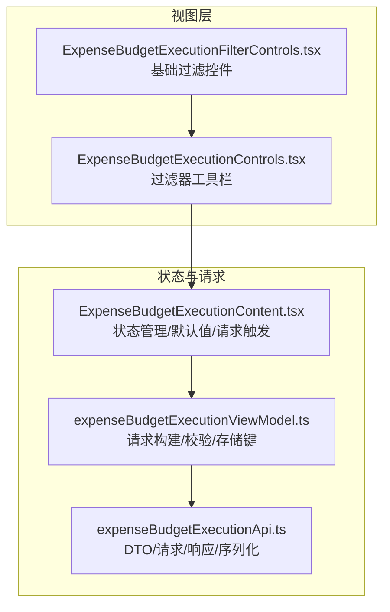
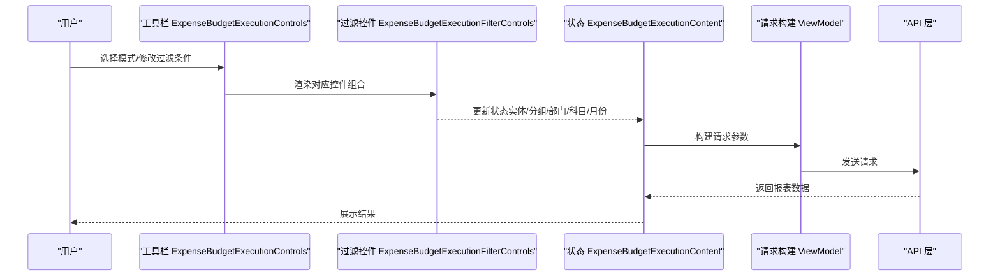
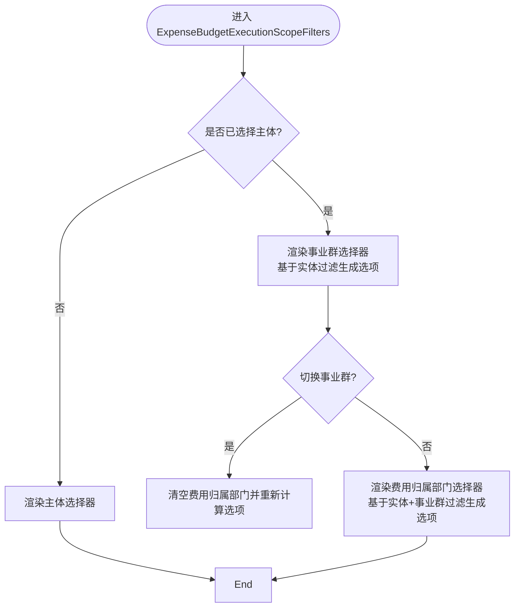
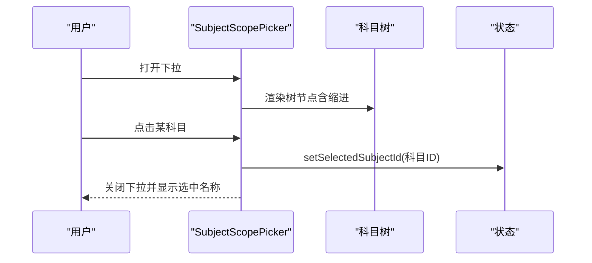
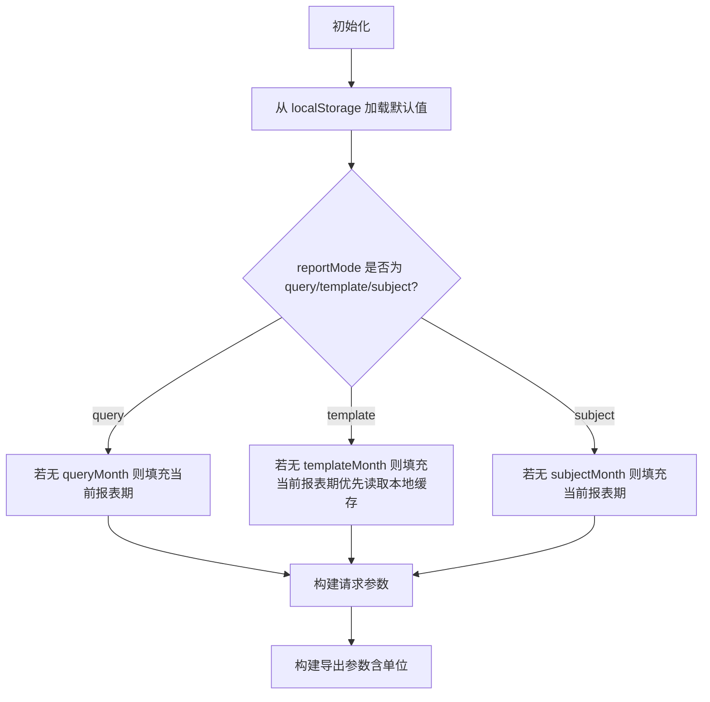
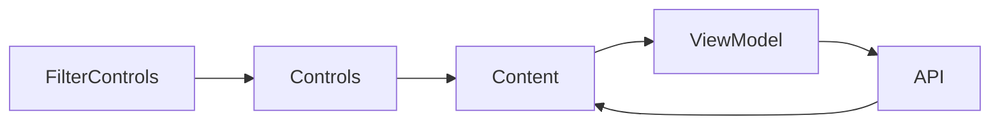

# 预算执行过滤器

<cite>
**本文引用的文件**
- [ExpenseBudgetExecutionFilterControls.tsx](file://apps/web/src/app/components/ExpenseBudgetExecutionFilterControls.tsx)
- [ExpenseBudgetExecutionControls.tsx](file://apps/web/src/app/components/ExpenseBudgetExecutionControls.tsx)
- [ExpenseBudgetExecutionContent.tsx](file://apps/web/src/app/components/ExpenseBudgetExecutionContent.tsx)
- [expenseBudgetExecutionApi.ts](file://apps/web/src/lib/expenseBudgetExecutionApi.ts)
- [expenseBudgetExecutionViewModel.ts](file://apps/web/src/lib/expenseBudgetExecutionViewModel.ts)
- [expense-budget-execution-view-model.spec.ts](file://apps/web/e2e/expense-budget-execution-view-model.spec.ts)
</cite>

## 目录
1. [简介](#简介)
2. [项目结构](#项目结构)
3. [核心组件](#核心组件)
4. [架构总览](#架构总览)
5. [详细组件分析](#详细组件分析)
6. [依赖关系分析](#依赖关系分析)
7. [性能考量](#性能考量)
8. [故障排查指南](#故障排查指南)
9. [结论](#结论)
10. [附录](#附录)

## 简介
本文件聚焦“预算执行过滤器”子系统，围绕 ExpenseBudgetExecutionFilterControls 组件的过滤逻辑与筛选机制进行深入解析。内容涵盖：
- 实体名称、分组名称、所有者部门、报表月份等过滤条件的实现方式
- 动态选项加载、级联选择与验证机制
- 过滤器状态管理、默认值设置与重置策略
- 过滤器组合使用的示例与最佳实践
- 性能优化建议与常见问题排查

## 项目结构
该过滤器体系由三部分组成：
- 视图层控件：ExpenseBudgetExecutionFilterControls 提供基础过滤控件（主体、事业群、费用归属部门、预算科目、报表月份）
- 控制器层：ExpenseBudgetExecutionControls 将各模式下的过滤器整合为统一的工具栏
- 状态与请求构建：ExpenseBudgetExecutionContent 管理状态、默认值与请求参数；expenseBudgetExecutionViewModel 提供请求构造与校验函数；expenseBudgetExecutionApi 定义请求/响应模型与序列化方法

图表来源
- [ExpenseBudgetExecutionFilterControls.tsx:1-204](file://apps/web/src/app/components/ExpenseBudgetExecutionFilterControls.tsx#L1-L204)
- [ExpenseBudgetExecutionControls.tsx:1-182](file://apps/web/src/app/components/ExpenseBudgetExecutionControls.tsx#L1-L182)
- [ExpenseBudgetExecutionContent.tsx:1-631](file://apps/web/src/app/components/ExpenseBudgetExecutionContent.tsx#L1-L631)
- [expenseBudgetExecutionViewModel.ts:1-319](file://apps/web/src/lib/expenseBudgetExecutionViewModel.ts#L1-L319)
- [expenseBudgetExecutionApi.ts:1-204](file://apps/web/src/lib/expenseBudgetExecutionApi.ts#L1-L204)

章节来源
- [ExpenseBudgetExecutionFilterControls.tsx:1-204](file://apps/web/src/app/components/ExpenseBudgetExecutionFilterControls.tsx#L1-L204)
- [ExpenseBudgetExecutionControls.tsx:1-182](file://apps/web/src/app/components/ExpenseBudgetExecutionControls.tsx#L1-L182)
- [ExpenseBudgetExecutionContent.tsx:1-631](file://apps/web/src/app/components/ExpenseBudgetExecutionContent.tsx#L1-L631)
- [expenseBudgetExecutionViewModel.ts:1-319](file://apps/web/src/lib/expenseBudgetExecutionViewModel.ts#L1-L319)
- [expenseBudgetExecutionApi.ts:1-204](file://apps/web/src/lib/expenseBudgetExecutionApi.ts#L1-L204)

## 核心组件
- ExpenseBudgetExecutionEntitySelect：主体下拉选择
- ExpenseBudgetExecutionScopeFilters：主体/事业群/费用归属部门三级联动过滤
- ExpenseBudgetExecutionSubjectScopePicker：预算科目树形选择器
- ExpenseBudgetExecutionMonthSelect：报表月份选择器
- ExpenseBudgetExecutionControls：统一过滤器工具栏，按模式渲染不同组合
- ExpenseBudgetExecutionContent：状态聚合、默认值注入、请求构建与持久化

章节来源
- [ExpenseBudgetExecutionFilterControls.tsx:56-204](file://apps/web/src/app/components/ExpenseBudgetExecutionFilterControls.tsx#L56-L204)
- [ExpenseBudgetExecutionControls.tsx:51-182](file://apps/web/src/app/components/ExpenseBudgetExecutionControls.tsx#L51-L182)
- [ExpenseBudgetExecutionContent.tsx:40-631](file://apps/web/src/app/components/ExpenseBudgetExecutionContent.tsx#L40-L631)

## 架构总览
过滤器在不同报表模式下的呈现与行为如下：
- 月报格式（query）：主体 → 事业群 → 费用归属部门；附加“报表月份”
- 部门模式（template）：主体 → 事业群 → 费用归属部门；附加“报表月份”
- 科目模式（subject）：主体（仅选择）、预算科目树、报表月份

图表来源
- [ExpenseBudgetExecutionControls.tsx:51-182](file://apps/web/src/app/components/ExpenseBudgetExecutionControls.tsx#L51-L182)
- [ExpenseBudgetExecutionFilterControls.tsx:84-204](file://apps/web/src/app/components/ExpenseBudgetExecutionFilterControls.tsx#L84-L204)
- [ExpenseBudgetExecutionContent.tsx:193-203](file://apps/web/src/app/components/ExpenseBudgetExecutionContent.tsx#L193-L203)
- [expenseBudgetExecutionViewModel.ts:221-255](file://apps/web/src/lib/expenseBudgetExecutionViewModel.ts#L221-L255)
- [expenseBudgetExecutionApi.ts:191-204](file://apps/web/src/lib/expenseBudgetExecutionApi.ts#L191-L204)

## 详细组件分析

### ExpenseBudgetExecutionScopeFilters（主体/事业群/费用归属部门）
- 动态选项加载
  - 主体列表来自可用实体集合（availableEntities），来源于服务端返回的可用主体数组
  - 事业群选项通过 getExpenseBudgetExecutionGroupOptions 基于已选实体过滤生成
  - 费用归属部门选项通过 getExpenseBudgetExecutionOwnerOptions 基于实体与事业群双重过滤生成
- 级联选择
  - 切换主体时，清空事业群与费用归属部门，并重新计算可选项
  - 切换事业群时，清空费用归属部门并重新计算可选项
- 验证与默认值
  - 未选择实体时，不渲染“事业群”与“费用归属部门”控件
  - 未选择实体且未选择事业群时，不渲染“费用归属部门”控件
- 状态管理
  - 通过 setEntityName/setGroupName/setOwnerDept 更新对应状态字段
  - hasSelectedEntity/hasSelectedGroup 用于控制渲染分支

图表来源
- [ExpenseBudgetExecutionFilterControls.tsx:84-141](file://apps/web/src/app/components/ExpenseBudgetExecutionFilterControls.tsx#L84-L141)
- [expenseBudgetExecutionViewModel.ts:101-127](file://apps/web/src/lib/expenseBudgetExecutionViewModel.ts#L101-L127)

章节来源
- [ExpenseBudgetExecutionFilterControls.tsx:84-141](file://apps/web/src/app/components/ExpenseBudgetExecutionFilterControls.tsx#L84-L141)
- [expenseBudgetExecutionViewModel.ts:101-127](file://apps/web/src/lib/expenseBudgetExecutionViewModel.ts#L101-L127)

### ExpenseBudgetExecutionSubjectScopePicker（预算科目树）
- 功能要点
  - 使用 details/summary 实现下拉展开
  - 递归渲染科目树，支持缩进显示层级
  - 选中后关闭下拉并更新选中科目 ID
- 状态与回显
  - selectedSubjectId 作为受控值
  - selectedSubjectNode 用于显示当前选中节点名称
  - scopeTree 来自服务端 subject_scope_tree

图表来源
- [ExpenseBudgetExecutionFilterControls.tsx:143-204](file://apps/web/src/app/components/ExpenseBudgetExecutionFilterControls.tsx#L143-L204)

章节来源
- [ExpenseBudgetExecutionFilterControls.tsx:143-204](file://apps/web/src/app/components/ExpenseBudgetExecutionFilterControls.tsx#L143-L204)

### ExpenseBudgetExecutionMonthSelect（报表月份）
- 选项范围：1-12 月
- 默认值：根据当前报表期自动填充（当未指定月份时）
- 校验：仅接受 1..12 的整数，其他值被规范化为空字符串

章节来源
- [ExpenseBudgetExecutionFilterControls.tsx:26-54](file://apps/web/src/app/components/ExpenseBudgetExecutionFilterControls.tsx#L26-L54)
- [expenseBudgetExecutionViewModel.ts:54-59](file://apps/web/src/lib/expenseBudgetExecutionViewModel.ts#L54-L59)
- [ExpenseBudgetExecutionContent.tsx:205-236](file://apps/web/src/app/components/ExpenseBudgetExecutionContent.tsx#L205-L236)

### ExpenseBudgetExecutionControls（过滤器工具栏）
- 模式切换：query/template/subject
- 按模式渲染不同组合
  - query：主体/事业群/费用归属部门 + 报表月份
  - template：主体/事业群/费用归属部门 + 报表月份
  - subject：主体（仅选择）+ 预算科目 + 报表月份
- 单位切换、关键字搜索、显示零行开关、查询按钮

章节来源
- [ExpenseBudgetExecutionControls.tsx:51-182](file://apps/web/src/app/components/ExpenseBudgetExecutionControls.tsx#L51-L182)

### ExpenseBudgetExecutionContent（状态管理与默认值）
- 状态聚合
  - query、template、subject 三套独立的过滤状态
  - amountUnit、includeZeroRows、activeKeyword 等全局状态
- 默认值与重置
  - 从 localStorage 恢复 reportMode/amountUnit/subjectId/subjectMonth/queryMonth/templateMonth
  - 当处于不同模式且当前报表期存在时，自动填充对应月份
  - 切换模式或清空上级选择时，重置下级选择
- 请求构建
  - 通过 buildExpenseBudgetExecutionReportRequest 构造请求参数
  - 通过 buildExpenseBudgetExecutionExportRequest 构造导出参数（含单位）

图表来源
- [ExpenseBudgetExecutionContent.tsx:110-236](file://apps/web/src/app/components/ExpenseBudgetExecutionContent.tsx#L110-L236)
- [expenseBudgetExecutionViewModel.ts:221-255](file://apps/web/src/lib/expenseBudgetExecutionViewModel.ts#L221-L255)

章节来源
- [ExpenseBudgetExecutionContent.tsx:110-236](file://apps/web/src/app/components/ExpenseBudgetExecutionContent.tsx#L110-L236)
- [expenseBudgetExecutionViewModel.ts:221-255](file://apps/web/src/lib/expenseBudgetExecutionViewModel.ts#L221-L255)

## 依赖关系分析
- 组件耦合
  - ExpenseBudgetExecutionFilterControls 仅负责渲染与事件回调，不直接访问服务端数据
  - ExpenseBudgetExecutionControls 聚合多模式过滤器，协调渲染
  - ExpenseBudgetExecutionContent 负责状态、默认值与请求构建
- 外部依赖
  - API 层提供 DTO、请求/响应模型与序列化方法
  - ViewModel 提供请求参数构建、校验与本地存储键名

图表来源
- [ExpenseBudgetExecutionFilterControls.tsx:1-204](file://apps/web/src/app/components/ExpenseBudgetExecutionFilterControls.tsx#L1-L204)
- [ExpenseBudgetExecutionControls.tsx:1-182](file://apps/web/src/app/components/ExpenseBudgetExecutionControls.tsx#L1-L182)
- [ExpenseBudgetExecutionContent.tsx:1-631](file://apps/web/src/app/components/ExpenseBudgetExecutionContent.tsx#L1-L631)
- [expenseBudgetExecutionViewModel.ts:1-319](file://apps/web/src/lib/expenseBudgetExecutionViewModel.ts#L1-L319)
- [expenseBudgetExecutionApi.ts:1-204](file://apps/web/src/lib/expenseBudgetExecutionApi.ts#L1-L204)

章节来源
- [ExpenseBudgetExecutionFilterControls.tsx:1-204](file://apps/web/src/app/components/ExpenseBudgetExecutionFilterControls.tsx#L1-L204)
- [ExpenseBudgetExecutionControls.tsx:1-182](file://apps/web/src/app/components/ExpenseBudgetExecutionControls.tsx#L1-L182)
- [ExpenseBudgetExecutionContent.tsx:1-631](file://apps/web/src/app/components/ExpenseBudgetExecutionContent.tsx#L1-L631)
- [expenseBudgetExecutionViewModel.ts:1-319](file://apps/web/src/lib/expenseBudgetExecutionViewModel.ts#L1-L319)
- [expenseBudgetExecutionApi.ts:1-204](file://apps/web/src/lib/expenseBudgetExecutionApi.ts#L1-L204)

## 性能考量
- 选项生成去重与缓存
  - 通过 new Set 对选项进行去重，避免重复渲染
  - 使用 useMemo 缓存 groupOptions/ownerOptions 计算结果，减少不必要的重算
- 渲染优化
  - 科目树采用递归扁平化渲染，结合缩进样式控制层级显示
  - 下拉菜单使用固定宽度与最大高度，避免布局抖动
- 请求与导出分离
  - 报表请求与导出请求参数分离，避免导出专用字段污染显示请求
- 本地存储与懒加载
  - 模式、单位、月份、科目 ID 等通过 localStorage 恢复，减少首次请求等待
  - 模板模式的实体/分组/部门选择在首次进入时从本地恢复，避免无效请求

章节来源
- [expenseBudgetExecutionViewModel.ts:101-127](file://apps/web/src/lib/expenseBudgetExecutionViewModel.ts#L101-L127)
- [ExpenseBudgetExecutionContent.tsx:93-108](file://apps/web/src/app/components/ExpenseBudgetExecutionContent.tsx#L93-L108)
- [ExpenseBudgetExecutionFilterControls.tsx:156-176](file://apps/web/src/app/components/ExpenseBudgetExecutionFilterControls.tsx#L156-L176)
- [expenseBudgetExecutionViewModel.ts:221-255](file://apps/web/src/lib/expenseBudgetExecutionViewModel.ts#L221-L255)

## 故障排查指南
- 月份输入异常
  - 现象：输入非 1..12 的值或小数
  - 处理：normalizeExpenseBudgetExecutionReportMonth 将其规范化为空字符串，确保请求合法
- 科目 ID 异常
  - 现象：传入非正整数或非数字字符串
  - 处理：normalizeExpenseBudgetExecutionSubjectId 将其规范化为空字符串，避免错误请求
- 模式/单位恢复失败
  - 现象：localStorage 中保存了非法值
  - 处理：normalizeExpenseBudgetExecutionReportMode/normalizeExpenseBudgetExecutionAmountUnit 对非法值返回 null，组件不会应用非法值
- 导出与显示参数混淆
  - 现象：amountUnit 出现在显示请求中
  - 处理：buildExpenseBudgetExecutionReportRequest 不包含 amountUnit，仅在导出请求中出现

章节来源
- [expenseBudgetExecutionViewModel.ts:54-85](file://apps/web/src/lib/expenseBudgetExecutionViewModel.ts#L54-L85)
- [expenseBudgetExecutionViewModel.ts:221-255](file://apps/web/src/lib/expenseBudgetExecutionViewModel.ts#L221-L255)
- [expenseBudgetExecutionApi.ts:162-177](file://apps/web/src/lib/expenseBudgetExecutionApi.ts#L162-L177)
- [expense-budget-execution-view-model.spec.ts:34-102](file://apps/web/e2e/expense-budget-execution-view-model.spec.ts#L34-L102)

## 结论
ExpenseBudgetExecutionFilterControls 以清晰的控件职责划分与严格的参数校验，实现了主体/事业群/费用归属部门/预算科目/报表月份的多维过滤。通过 ViewModel 的请求构建与本地存储恢复机制，系统在用户体验与性能之间取得平衡。建议在后续迭代中进一步抽象通用过滤器基类，提升可复用性与可维护性。

## 附录

### 过滤器组合使用示例
- 月报格式（query）
  - 步骤：选择主体 → 自动加载事业群 → 选择事业群 → 自动加载费用归属部门 → 选择费用归属部门 → 选择报表月份 → 查询
  - 关键点：切换主体/事业群会清空下级并重新计算选项
- 部门模式（template）
  - 步骤：选择主体 → 自动加载事业群 → 选择事业群 → 自动加载费用归属部门 → 选择费用归属部门 → 选择报表月份 → 查询
  - 关键点：与 query 模式相同，但展示维度不同
- 科目模式（subject）
  - 步骤：选择主体 → 选择预算科目 → 选择报表月份 → 查询
  - 关键点：科目树支持层级缩进与快速定位

章节来源
- [ExpenseBudgetExecutionControls.tsx:85-126](file://apps/web/src/app/components/ExpenseBudgetExecutionControls.tsx#L85-L126)
- [ExpenseBudgetExecutionFilterControls.tsx:84-141](file://apps/web/src/app/components/ExpenseBudgetExecutionFilterControls.tsx#L84-L141)
- [ExpenseBudgetExecutionFilterControls.tsx:143-204](file://apps/web/src/app/components/ExpenseBudgetExecutionFilterControls.tsx#L143-L204)