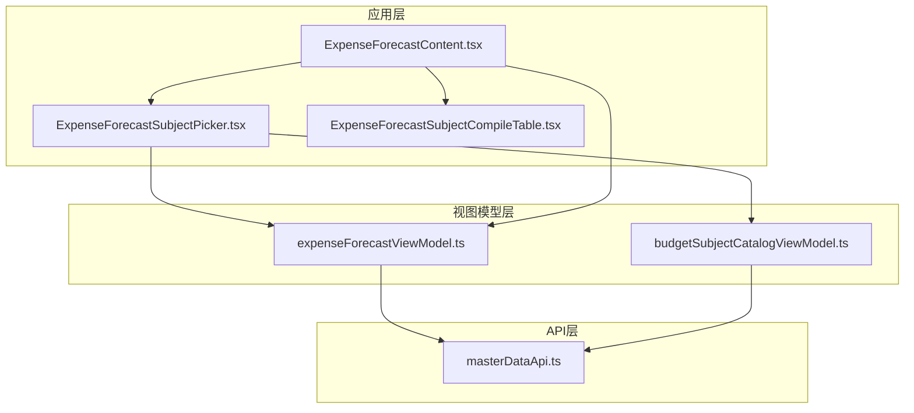
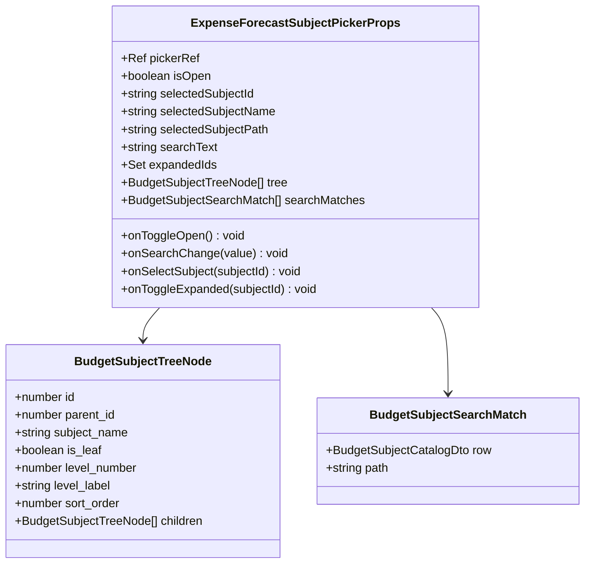
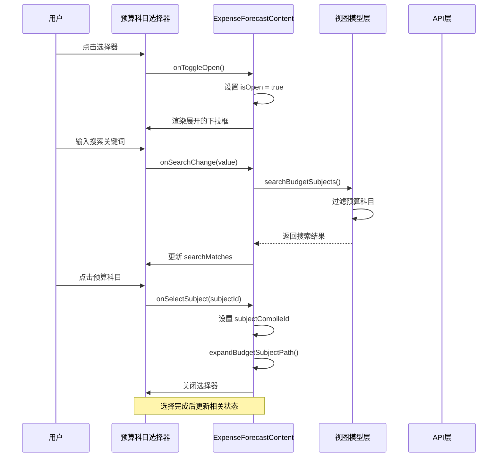
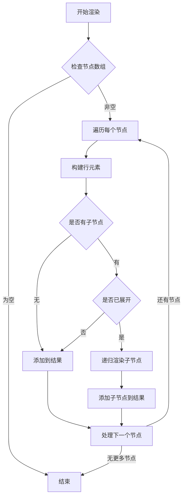
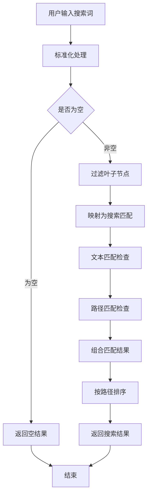
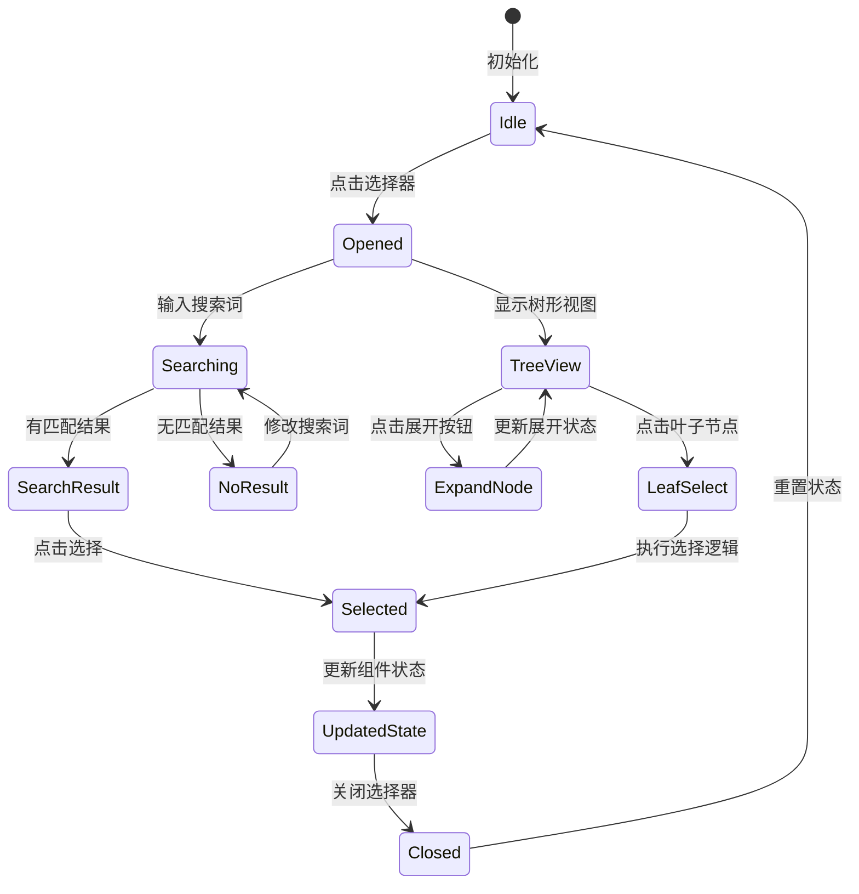
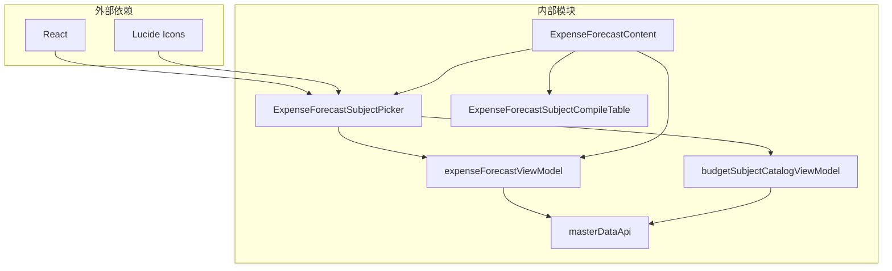

# 预算科目选择器组件

<cite>
**本文档引用的文件**
- [ExpenseForecastSubjectPicker.tsx](file://apps/web/src/app/components/ExpenseForecastSubjectPicker.tsx)
- [ExpenseForecastContent.tsx](file://apps/web/src/app/components/ExpenseForecastContent.tsx)
- [ExpenseForecastSubjectCompileTable.tsx](file://apps/web/src/app/components/ExpenseForecastSubjectCompileTable.tsx)
- [expenseForecastViewModel.ts](file://apps/web/src/lib/expenseForecastViewModel.ts)
- [budgetSubjectCatalogViewModel.ts](file://apps/web/src/lib/budgetSubjectCatalogViewModel.ts)
- [masterDataApi.ts](file://apps/web/src/lib/masterDataApi.ts)
</cite>

## 目录
1. [简介](#简介)
2. [项目结构](#项目结构)
3. [核心组件](#核心组件)
4. [架构概览](#架构概览)
5. [详细组件分析](#详细组件分析)
6. [依赖关系分析](#依赖关系分析)
7. [性能考虑](#性能考虑)
8. [故障排除指南](#故障排除指南)
9. [结论](#结论)

## 简介

ExpenseForecastSubjectPicker 是一个专门用于预算预测系统的预算科目选择器组件。该组件提供了完整的树形选择界面和搜索功能，支持多级预算科目的浏览、筛选和选择。组件设计遵循现代 React 架构模式，采用函数式组件和 Hooks，提供流畅的用户体验。

该组件主要服务于费用预测系统中的预算科目选择场景，支持以下核心功能：
- 树形结构的预算科目浏览
- 实时搜索和过滤
- 多级展开折叠控制
- 叶子节点选择限制
- 高亮显示搜索关键词
- 响应式布局设计

## 项目结构

ExpenseForecastSubjectPicker 组件位于前端应用的组件层中，与相关的视图模型和 API 层紧密协作：



**图表来源**
- [ExpenseForecastContent.tsx:770-798](file://apps/web/src/app/components/ExpenseForecastContent.tsx#L770-L798)
- [ExpenseForecastSubjectPicker.tsx:43-57](file://apps/web/src/app/components/ExpenseForecastSubjectPicker.tsx#L43-L57)

**章节来源**
- [ExpenseForecastSubjectPicker.tsx:1-160](file://apps/web/src/app/components/ExpenseForecastSubjectPicker.tsx#L1-L160)
- [ExpenseForecastContent.tsx:716-798](file://apps/web/src/app/components/ExpenseForecastContent.tsx#L716-L798)

## 核心组件

### ExpenseForecastSubjectPicker 主要特性

ExpenseForecastSubjectPicker 组件是一个高度模块化的 React 组件，具有以下关键特性：

#### 数据结构定义
组件使用类型安全的设计模式，通过 TypeScript 接口确保数据完整性：



**图表来源**
- [ExpenseForecastSubjectPicker.tsx:8-22](file://apps/web/src/app/components/ExpenseForecastSubjectPicker.tsx#L8-L22)
- [budgetSubjectCatalogViewModel.ts:3](file://apps/web/src/lib/budgetSubjectCatalogViewModel.ts#L3)

#### 渲染策略
组件采用条件渲染和动态样式绑定的策略：

| 渲染场景 | 条件判断 | 样式应用 | 功能行为 |
|---------|---------|---------|---------|
| 树形视图 | searchText 为空 | 标准树形渲染 | 显示完整预算科目树 |
| 搜索结果 | searchText 非空且有匹配 | 高亮显示匹配项 | 显示搜索结果列表 |
| 选中状态 | selectedSubjectId 匹配 | 蓝色背景高亮 | 标识当前选中科目 |
| 展开状态 | expandedIds 包含 | 向下箭头图标 | 显示子节点 |

**章节来源**
- [ExpenseForecastSubjectPicker.tsx:58-97](file://apps/web/src/app/components/ExpenseForecastSubjectPicker.tsx#L58-L97)
- [ExpenseForecastSubjectPicker.tsx:129-153](file://apps/web/src/app/components/ExpenseForecastSubjectPicker.tsx#L129-L153)

## 架构概览

### 组件交互流程

ExpenseForecastSubjectPicker 在费用预测系统中的工作流程如下：



**图表来源**
- [ExpenseForecastContent.tsx:770-798](file://apps/web/src/app/components/ExpenseForecastContent.tsx#L770-L798)
- [ExpenseForecastSubjectPicker.tsx:18-22](file://apps/web/src/app/components/ExpenseForecastSubjectPicker.tsx#L18-L22)

### 数据流架构

组件采用单向数据流设计，确保状态管理的清晰性和可预测性：

```mermaid
flowchart TD
API[listBudgetSubjectCatalog] --> Rows[BudgetSubjectCatalogDto[]]
Rows --> Tree[构建预算科目树]
Tree --> PathMap[构建路径映射]
PathMap --> Search[搜索预算科目]
Search --> Matches[BudgetSubjectSearchMatch[]]
UserInput[用户输入] --> Filter[过滤逻辑]
Filter --> Tree
Filter --> PathMap
Tree --> Picker[ExpenseForecastSubjectPicker]
Matches --> Picker
PathMap --> Picker
Picker --> Selection[科目选择]
Selection --> Content[ExpenseForecastContent]
Content --> View[更新视图状态]
```

**图表来源**
- [ExpenseForecastContent.tsx:212-224](file://apps/web/src/app/components/ExpenseForecastContent.tsx#L212-L224)
- [expenseForecastViewModel.ts:140-159](file://apps/web/src/lib/expenseForecastViewModel.ts#L140-L159)

**章节来源**
- [ExpenseForecastContent.tsx:191-194](file://apps/web/src/app/components/ExpenseForecastContent.tsx#L191-L194)
- [expenseForecastViewModel.ts:121-138](file://apps/web/src/lib/expenseForecastViewModel.ts#L121-L138)

## 详细组件分析

### 树形渲染算法

ExpenseForecastSubjectPicker 的核心是其高效的树形渲染算法，该算法支持递归渲染和深度控制：

#### 渲染流程详解



**图表来源**
- [ExpenseForecastSubjectPicker.tsx:58-97](file://apps/web/src/app/components/ExpenseForecastSubjectPicker.tsx#L58-L97)

#### 展开折叠逻辑

组件实现了智能的展开折叠机制，支持多级树形结构的动态控制：

| 展开状态 | 控制方式 | 视觉反馈 | 行为特征 |
|---------|---------|---------|---------|
| 已展开 | expandedIds 包含 id | 向下箭头图标 | 显示子节点 |
| 未展开 | expandedIds 不包含 id | 向右箭头图标 | 隐藏子节点 |
| 叶子节点 | is_leaf = true | 无箭头图标 | 不可展开 |
| 默认状态 | 从根节点开始 | 仅显示根节点 | 逐步展开 |

**章节来源**
- [ExpenseForecastSubjectPicker.tsx:79-96](file://apps/web/src/app/components/ExpenseForecastSubjectPicker.tsx#L79-L96)

### 搜索功能实现

组件的搜索功能基于精确的文本匹配和路径解析：

#### 搜索算法流程



**图表来源**
- [expenseForecastViewModel.ts:140-159](file://apps/web/src/lib/expenseForecastViewModel.ts#L140-L159)

#### 高亮显示机制

组件实现了智能的关键词高亮功能，提升用户体验：

| 匹配类型 | 高亮位置 | 样式应用 | 用户体验 |
|---------|---------|---------|---------|
| 科目名称 | subject_name | 黄色背景标记 | 突出显示匹配文本 |
| 路径信息 | path | 淡黄色背景 | 辅助识别上下文 |
| 完全匹配 | 整个字符串 | 强调样式 | 明确标识结果 |
| 部分匹配 | 匹配片段 | 轻微强调 | 清晰区分内容 |

**章节来源**
- [ExpenseForecastSubjectPicker.tsx:24-41](file://apps/web/src/app/components/ExpenseForecastSubjectPicker.tsx#L24-L41)
- [expenseForecastViewModel.ts:140-159](file://apps/web/src/lib/expenseForecastViewModel.ts#L140-L159)

### 选择逻辑处理

组件的科目选择逻辑严格遵循预算科目的层次结构约束：

#### 选择流程控制



**图表来源**
- [ExpenseForecastContent.tsx:704-709](file://apps/web/src/app/components/ExpenseForecastContent.tsx#L704-L709)

#### 路径展开策略

当用户选择某个预算科目时，组件会自动展开到该科目的完整路径：

| 步骤 | 操作 | 状态变化 | 影响范围 |
|------|------|---------|---------|
| 1 | 获取选中科目 | subjectCompileId = 选中ID | 选中状态更新 |
| 2 | 查找父级节点 | 从选中科目向上遍历 | 路径构建 |
| 3 | 添加到展开集合 | expandedIds 添加父ID | 展开状态更新 |
| 4 | 递归展开 | 直到根节点 | 完整路径显示 |

**章节来源**
- [ExpenseForecastContent.tsx:694-702](file://apps/web/src/app/components/ExpenseForecastContent.tsx#L694-L702)

## 依赖关系分析

### 组件间依赖关系

ExpenseForecastSubjectPicker 组件与相关模块存在以下依赖关系：



**图表来源**
- [ExpenseForecastSubjectPicker.tsx:1-6](file://apps/web/src/app/components/ExpenseForecastSubjectPicker.tsx#L1-L6)
- [ExpenseForecastContent.tsx:44-73](file://apps/web/src/app/components/ExpenseForecastContent.tsx#L44-L73)

### 数据依赖链

组件的数据流遵循严格的依赖链：

| 依赖层级 | 提供者 | 数据类型 | 用途 |
|---------|--------|---------|------|
| 第一层 | API层 | BudgetSubjectCatalogDto[] | 基础数据源 |
| 第二层 | 视图模型 | BudgetSubjectTreeNode[] | 树形结构 |
| 第三层 | 视图模型 | Map<number, string> | 路径映射 |
| 第四层 | 视图模型 | BudgetSubjectSearchMatch[] | 搜索结果 |
| 第五层 | 组件 | ExpenseForecastSubjectPicker | UI渲染 |

**章节来源**
- [expenseForecastViewModel.ts:121-138](file://apps/web/src/lib/expenseForecastViewModel.ts#L121-L138)
- [budgetSubjectCatalogViewModel.ts:7-24](file://apps/web/src/lib/budgetSubjectCatalogViewModel.ts#L7-L24)

## 性能考虑

### 渲染优化策略

ExpenseForecastSubjectPicker 采用了多种性能优化技术：

#### 记忆化缓存
组件利用 React.memo 和 useMemo 优化渲染性能：

| 缓存类型 | 缓存内容 | 更新触发条件 | 性能收益 |
|---------|---------|-------------|---------|
| useMemo | 树形结构 | 预算科目数据变化 | 避免重复构建树 |
| useMemo | 路径映射 | 树结构变化 | 减少路径计算 |
| useMemo | 搜索结果 | 搜索词变化 | 避免重复搜索 |
| useCallback | 回调函数 | 依赖不变 | 防止不必要的重渲染 |

#### 虚拟滚动支持
对于大量预算科目的场景，建议实现虚拟滚动：

```typescript
// 虚拟滚动实现思路
const VirtualizedList = ({ items, itemHeight, containerHeight }) => {
  const startIndex = Math.floor(scrollTop / itemHeight);
  const endIndex = Math.min(startIndex + Math.ceil(containerHeight / itemHeight), items.length);
  
  return (
    <div style={{ height: items.length * itemHeight }}>
      {items.slice(startIndex, endIndex).map((item, index) => (
        <div 
          key={item.id}
          style={{ 
            position: 'absolute', 
            top: (startIndex + index) * itemHeight,
            height: itemHeight 
          }}
        >
          {renderItem(item)}
        </div>
      ))}
    </div>
  );
};
```

#### 异步加载策略
对于大型组织的预算科目数据，建议实现分页加载：

```typescript
// 分页加载实现思路
const usePaginatedSubjects = (page = 1, pageSize = 100) => {
  const [subjects, setSubjects] = useState([]);
  const [loading, setLoading] = useState(false);
  
  useEffect(() => {
    const loadPage = async () => {
      setLoading(true);
      const response = await api.getBudgetSubjects(page, pageSize);
      setSubjects(prev => [...prev, ...response.data]);
      setLoading(false);
    };
    
    loadPage();
  }, [page]);
  
  return { subjects, loading };
};
```

### 内存管理优化

组件在内存使用方面也进行了优化：

| 优化措施 | 实现方式 | 效果 |
|---------|---------|------|
| 及时清理 | 组件卸载时清理事件监听 | 防止内存泄漏 |
| 懒加载 | 搜索结果按需计算 | 减少初始计算量 |
| 对象池 | 复用搜索匹配对象 | 降低垃圾回收压力 |

## 故障排除指南

### 常见问题诊断

#### 树形渲染异常

**症状**: 预算科目树显示不正确或出现循环引用

**诊断步骤**:
1. 检查预算科目数据的 parent_id 关系
2. 验证树形结构的完整性
3. 确认排序字段的正确性

**解决方案**:
```typescript
// 树形结构验证函数
const validateTreeStructure = (nodes: BudgetSubjectTreeNode[]) => {
  const visited = new Set<number>();
  
  const traverse = (node: BudgetSubjectTreeNode) => {
    if (visited.has(node.id)) {
      throw new Error(`发现循环引用: 科目 ${node.subject_name} (ID: ${node.id})`);
    }
    
    visited.add(node.id);
    
    node.children.forEach(traverse);
  };
  
  nodes.forEach(traverse);
};
```

#### 搜索功能失效

**症状**: 搜索框无法匹配任何结果

**诊断步骤**:
1. 检查搜索关键词的标准化处理
2. 验证预算科目名称的编码格式
3. 确认路径映射的完整性

**解决方案**:
```typescript
// 搜索功能调试
const debugSearch = (keyword: string, rows: BudgetSubjectCatalogDto[]) => {
  console.log('原始关键词:', keyword);
  console.log('标准化后:', keyword.trim().toLowerCase());
  console.log('叶子节点数量:', rows.filter(r => r.is_leaf).length);
  
  const matches = searchBudgetSubjects(rows, buildBudgetSubjectPathMap(buildBudgetSubjectTree(rows)), keyword);
  console.log('匹配结果数量:', matches.length);
  
  return matches;
};
```

#### 性能问题排查

**症状**: 页面响应缓慢或卡顿

**诊断工具**:
```typescript
// 性能监控
const measureRenderTime = (componentName: string, callback: Function) => {
  const start = performance.now();
  const result = callback();
  const end = performance.now();
  
  console.log(`${componentName} 渲染耗时: ${end - start}ms`);
  return result;
};

// 使用示例
const optimizedRender = () => {
  return measureRenderTime('TreeRender', () => renderTree(nodes, depth));
};
```

### 最佳实践建议

#### 错误边界处理
```typescript
// 错误边界组件
class SubjectPickerErrorBoundary extends React.Component {
  constructor(props) {
    super(props);
    this.state = { hasError: false };
  }
  
  static getDerivedStateFromError(error) {
    return { hasError: true };
  }
  
  componentDidCatch(error, errorInfo) {
    console.error('预算科目选择器错误:', error, errorInfo);
  }
  
  render() {
    if (this.state.hasError) {
      return <div>抱歉，预算科目选择器出现错误</div>;
    }
    
    return this.props.children;
  }
}
```

#### 加载状态管理
```typescript
// 加载状态指示器
const LoadingSpinner = () => (
  <div className="flex items-center justify-center p-4">
    <div className="animate-spin rounded-full h-8 w-8 border-b-2 border-blue-500"></div>
    <span className="ml-2">加载预算科目...</span>
  </div>
);

// 使用示例
{loading && <LoadingSpinner />}
```

**章节来源**
- [ExpenseForecastSubjectPicker.tsx:364-372](file://apps/web/src/app/components/ExpenseForecastSubjectPicker.tsx#L364-L372)
- [ExpenseForecastContent.tsx:212-224](file://apps/web/src/app/components/ExpenseForecastContent.tsx#L212-L224)

## 结论

ExpenseForecastSubjectPicker 组件是一个设计精良、功能完善的预算科目选择器，具有以下突出特点：

### 技术优势
- **类型安全**: 完整的 TypeScript 类型定义确保代码质量
- **性能优化**: 采用记忆化缓存和条件渲染减少不必要的计算
- **用户体验**: 智能的搜索高亮和路径展开提升操作效率
- **可维护性**: 清晰的组件分离和依赖管理便于后期维护

### 架构特色
- **模块化设计**: 组件职责明确，易于测试和复用
- **数据流清晰**: 单向数据流确保状态管理的可预测性
- **扩展性强**: 支持自定义搜索逻辑和渲染样式
- **错误处理完善**: 全面的错误边界和降级策略

### 应用价值
该组件为费用预测系统提供了可靠的预算科目选择能力，支持复杂的多级预算结构管理和高效的搜索定位，是现代企业预算管理系统的重要基础设施组件。

通过持续的性能优化和功能增强，ExpenseForecastSubjectPicker 将继续为企业预算管理提供强有力的技术支撑。