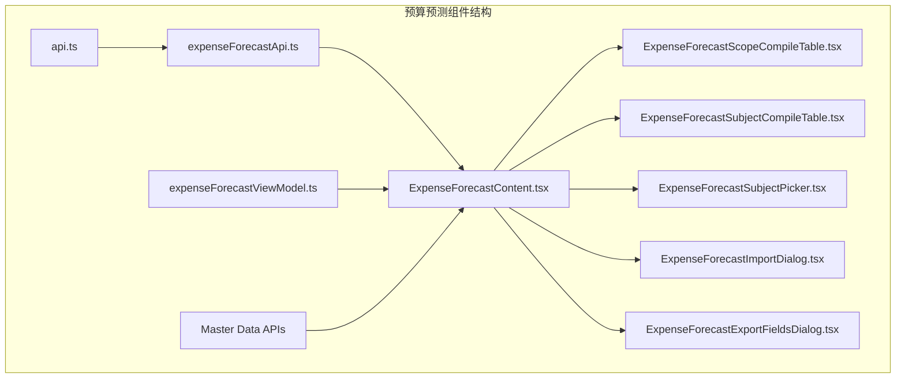
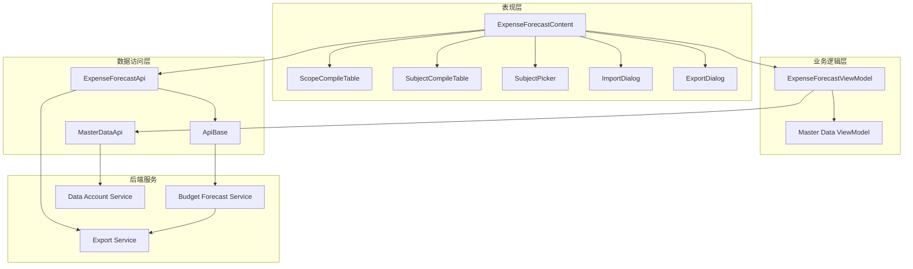
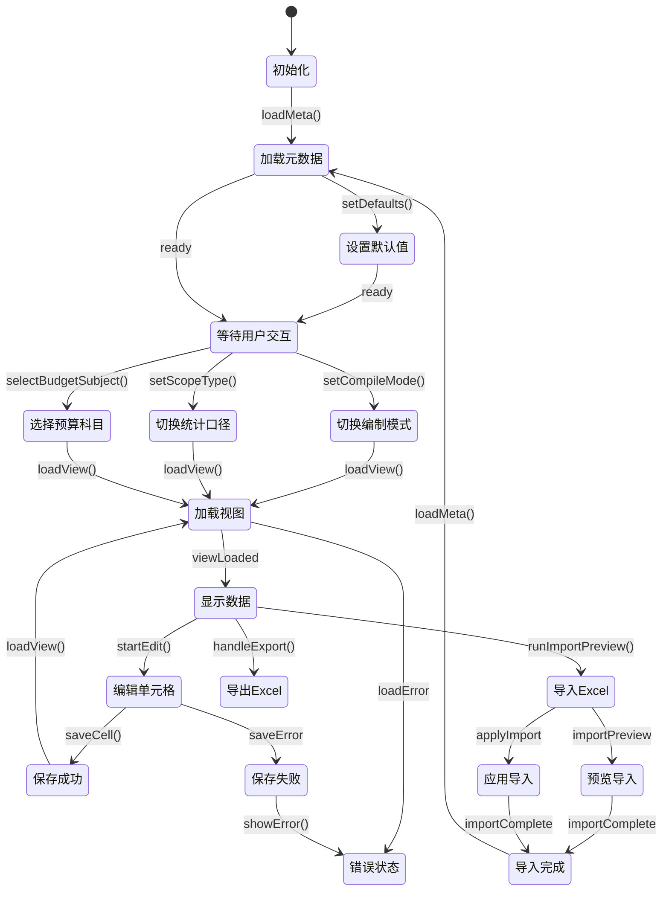
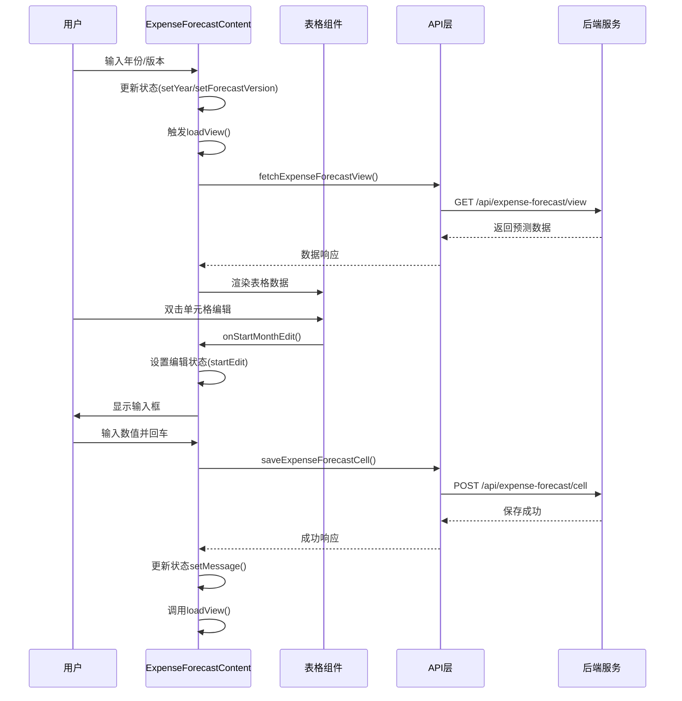
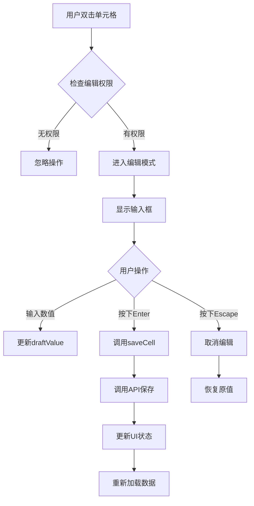
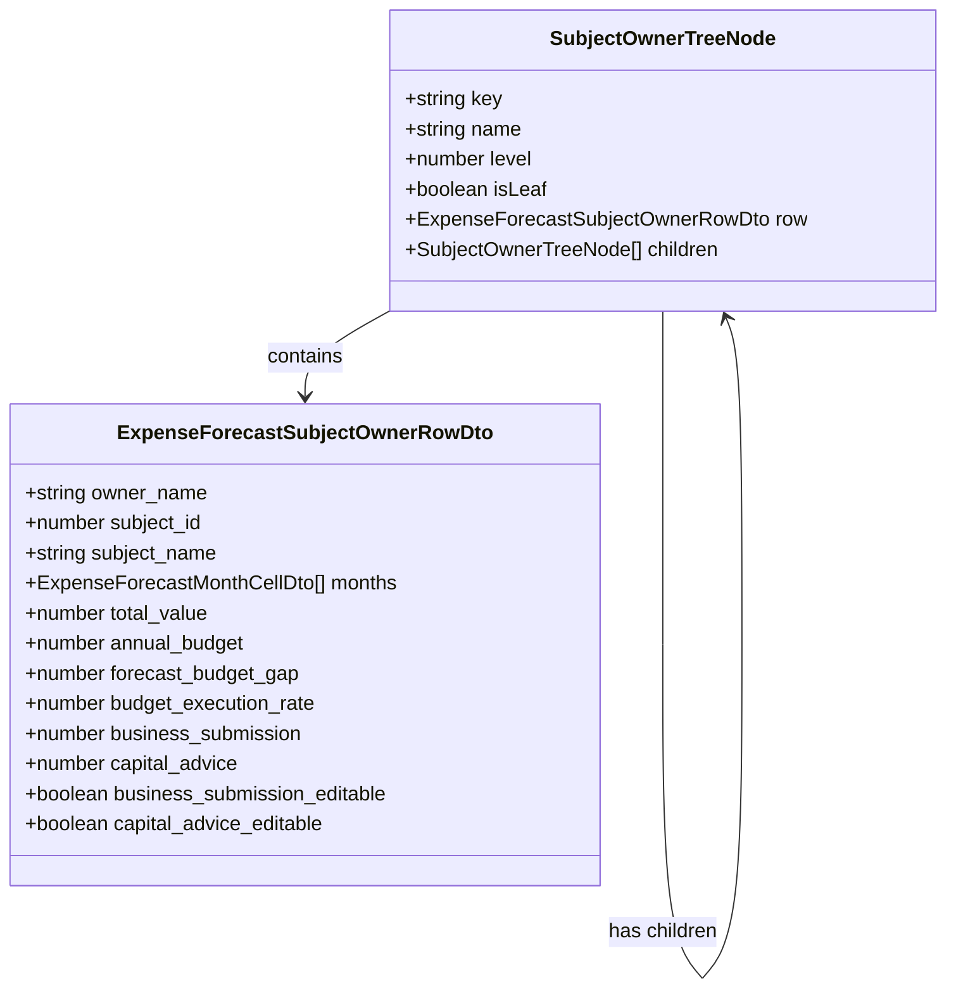
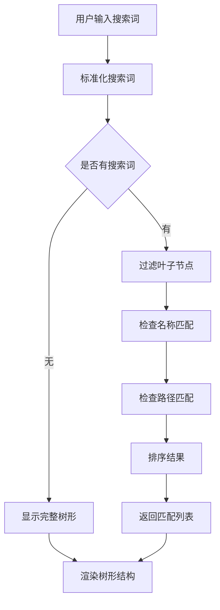
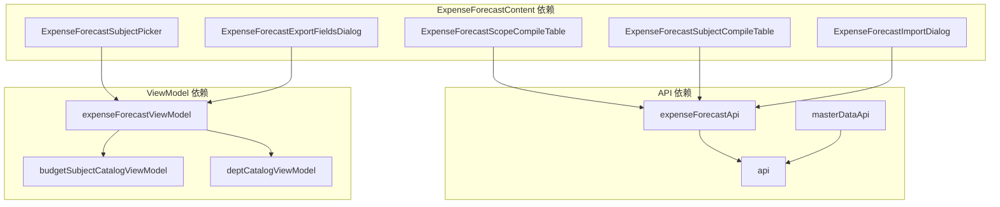

# 预算预测主界面组件

<cite>
**本文档引用的文件**
- [ExpenseForecastContent.tsx](file://apps/web/src/app/components/ExpenseForecastContent.tsx)
- [expenseForecastApi.ts](file://apps/web/src/lib/expenseForecastApi.ts)
- [expenseForecastViewModel.ts](file://apps/web/src/lib/expenseForecastViewModel.ts)
- [ExpenseForecastScopeCompileTable.tsx](file://apps/web/src/app/components/ExpenseForecastScopeCompileTable.tsx)
- [ExpenseForecastSubjectCompileTable.tsx](file://apps/web/src/app/components/ExpenseForecastSubjectCompileTable.tsx)
- [ExpenseForecastSubjectPicker.tsx](file://apps/web/src/app/components/ExpenseForecastSubjectPicker.tsx)
- [ExpenseForecastImportDialog.tsx](file://apps/web/src/app/components/ExpenseForecastImportDialog.tsx)
- [ExpenseForecastExportFieldsDialog.tsx](file://apps/web/src/app/components/ExpenseForecastExportFieldsDialog.tsx)
- [api.ts](file://apps/web/src/lib/api.ts)
</cite>

## 目录
1. [简介](#简介)
2. [项目结构](#项目结构)
3. [核心组件](#核心组件)
4. [架构概览](#架构概览)
5. [详细组件分析](#详细组件分析)
6. [依赖关系分析](#依赖关系分析)
7. [性能考虑](#性能考虑)
8. [故障排除指南](#故障排除指南)
9. [结论](#结论)
10. [附录](#附录)

## 简介

ExpenseForecastContent 是预算预测系统的主界面组件，负责提供完整的预算预测数据管理功能。该组件实现了现代化的预算预测工作流，包括数据加载、显示、编辑、导入导出等功能，支持多种编制维度和统计口径。

该组件采用React Hooks模式，结合自定义的API层和视图模型层，提供了完整的预算预测解决方案。组件支持按预算部门和按预算科目两种编制模式，以及主体、事业群、费用归属部门三种统计口径。

## 项目结构

预算预测组件位于前端Web应用的组件目录中，采用模块化设计：



**图表来源**
- [ExpenseForecastContent.tsx:1-1144](file://apps/web/src/app/components/ExpenseForecastContent.tsx#L1-L1144)
- [expenseForecastApi.ts:1-547](file://apps/web/src/lib/expenseForecastApi.ts#L1-L547)

**章节来源**
- [ExpenseForecastContent.tsx:1-1144](file://apps/web/src/app/components/ExpenseForecastContent.tsx#L1-L1144)
- [expenseForecastApi.ts:1-547](file://apps/web/src/lib/expenseForecastApi.ts#L1-L547)

## 核心组件

### ExpenseForecastContent 主组件

ExpenseForecastContent 是整个预算预测界面的核心组件，负责协调所有子组件和数据流。该组件包含了完整的状态管理逻辑，包括：

#### 状态管理
- **基础配置状态**：年份、版本、单位、编制模式
- **维度状态**：统计口径、作用域值、预算科目选择
- **视图状态**：数据加载状态、编辑状态、搜索状态
- **导入导出状态**：文件上传、预览结果、导入结果
- **UI状态**：展开状态、上下文菜单、消息提示

#### 数据绑定机制
组件通过React的useState和useMemo hooks实现高效的数据绑定：
- 使用useMemo优化复杂计算结果的缓存
- 使用useEffect处理副作用和生命周期管理
- 通过回调函数实现父子组件间的数据传递

#### 事件处理机制
- **键盘事件**：Enter键保存、Escape键取消编辑
- **鼠标事件**：点击展开/收起、右键上下文菜单
- **表单事件**：输入验证、文件上传、按钮点击

**章节来源**
- [ExpenseForecastContent.tsx:81-123](file://apps/web/src/app/components/ExpenseForecastContent.tsx#L81-L123)
- [ExpenseForecastContent.tsx:428-572](file://apps/web/src/app/components/ExpenseForecastContent.tsx#L428-L572)

## 架构概览

预算预测组件采用分层架构设计，确保关注点分离和代码可维护性：



**图表来源**
- [ExpenseForecastContent.tsx:1-1144](file://apps/web/src/app/components/ExpenseForecastContent.tsx#L1-L1144)
- [expenseForecastApi.ts:1-547](file://apps/web/src/lib/expenseForecastApi.ts#L1-L547)
- [expenseForecastViewModel.ts:1-351](file://apps/web/src/lib/expenseForecastViewModel.ts#L1-L351)

## 详细组件分析

### ExpenseForecastContent 组件详解

#### 核心属性配置

组件支持以下核心配置参数：

| 参数名称 | 类型 | 默认值 | 描述 |
|---------|------|--------|------|
| year | number | 当前年份 | 预算预测年份 |
| forecastVersion | string | 默认版本 | 预算预测版本号 |
| amountUnit | AmountUnit | "yuan" | 金额单位（元/万元/亿元等） |
| compileMode | CompileMode | "scope" | 编制模式（按预算部门/按预算科目） |
| scopeType | ScopeType | "group" | 统计口径（主体/事业群/费用归属部门） |

#### 状态管理策略

组件采用分层状态管理模式：



**图表来源**
- [ExpenseForecastContent.tsx:285-356](file://apps/web/src/app/components/ExpenseForecastContent.tsx#L285-L356)
- [ExpenseForecastContent.tsx:448-508](file://apps/web/src/app/components/ExpenseForecastContent.tsx#L448-L508)

#### 数据绑定机制

组件实现了多层次的数据绑定：

1. **本地状态绑定**：使用useState管理组件内部状态
2. **计算属性绑定**：使用useMemo优化复杂计算
3. **外部状态绑定**：通过props接收父组件传入的数据

#### 事件处理流程



**图表来源**
- [ExpenseForecastContent.tsx:428-508](file://apps/web/src/app/components/ExpenseForecastContent.tsx#L428-L508)
- [expenseForecastApi.ts:410-414](file://apps/web/src/lib/expenseForecastApi.ts#L410-L414)

**章节来源**
- [ExpenseForecastContent.tsx:81-123](file://apps/web/src/app/components/ExpenseForecastContent.tsx#L81-L123)
- [ExpenseForecastContent.tsx:285-356](file://apps/web/src/app/components/ExpenseForecastContent.tsx#L285-L356)

### ExpenseForecastScopeCompileTable 组件

该组件负责按预算部门编制模式下的数据展示和编辑：

#### 核心功能
- **树形结构展示**：支持展开/收起的树形表格
- **单元格编辑**：双击进入编辑模式，支持键盘快捷键
- **批量操作**：支持整行选择和批量编辑
- **状态指示**：根据数据来源显示不同的样式

#### 编辑机制
组件实现了完整的单元格编辑流程：



**图表来源**
- [ExpenseForecastScopeCompileTable.tsx:73-90](file://apps/web/src/app/components/ExpenseForecastScopeCompileTable.tsx#L73-L90)
- [ExpenseForecastScopeCompileTable.tsx:125-160](file://apps/web/src/app/components/ExpenseForecastScopeCompileTable.tsx#L125-L160)

**章节来源**
- [ExpenseForecastScopeCompileTable.tsx:15-50](file://apps/web/src/app/components/ExpenseForecastScopeCompileTable.tsx#L15-L50)
- [ExpenseForecastScopeCompileTable.tsx:195-200](file://apps/web/src/app/components/ExpenseForecastScopeCompileTable.tsx#L195-L200)

### ExpenseForecastSubjectCompileTable 组件

该组件负责按预算科目编制模式下的数据展示：

#### 特殊功能
- **部门树形展示**：支持按部门层级的树形结构
- **科目维度切换**：可以在不同预算科目间切换
- **高级搜索**：支持按部门名称和路径搜索

#### 数据结构
组件使用特殊的SubjectOwnerTreeNode结构来组织数据：



**图表来源**
- [ExpenseForecastSubjectCompileTable.tsx:13-18](file://apps/web/src/app/components/ExpenseForecastSubjectCompileTable.tsx#L13-L18)
- [expenseForecastViewModel.ts:22-29](file://apps/web/src/lib/expenseForecastViewModel.ts#L22-L29)

**章节来源**
- [ExpenseForecastSubjectCompileTable.tsx:20-36](file://apps/web/src/app/components/ExpenseForecastSubjectCompileTable.tsx#L20-L36)
- [ExpenseForecastSubjectCompileTable.tsx:55-135](file://apps/web/src/app/components/ExpenseForecastSubjectCompileTable.tsx#L55-L135)

### ExpenseForecastSubjectPicker 组件

预算科目选择器组件，提供完整的预算科目搜索和选择功能：

#### 核心特性
- **树形结构**：完整的预算科目树形展示
- **智能搜索**：支持按名称和路径搜索
- **高亮显示**：搜索关键词高亮显示
- **路径导航**：显示科目完整路径

#### 搜索算法
组件实现了高效的搜索算法：



**图表来源**
- [ExpenseForecastSubjectPicker.tsx:140-151](file://apps/web/src/app/components/ExpenseForecastSubjectPicker.tsx#L140-L151)
- [expenseForecastViewModel.ts:140-159](file://apps/web/src/lib/expenseForecastViewModel.ts#L140-L159)

**章节来源**
- [ExpenseForecastSubjectPicker.tsx:8-22](file://apps/web/src/app/components/ExpenseForecastSubjectPicker.tsx#L8-L22)
- [ExpenseForecastSubjectPicker.tsx:58-97](file://apps/web/src/app/components/ExpenseForecastSubjectPicker.tsx#L58-L97)

### ExpenseForecastImportDialog 组件

导入对话框组件，提供完整的Excel导入功能：

#### 导入流程
1. **文件选择**：用户选择Excel文件
2. **预览导入**：分析文件内容和潜在问题
3. **确认导入**：用户确认后执行导入
4. **结果反馈**：显示导入统计信息

#### 预览功能
导入预览包含以下统计信息：
- 可新增单元格数量
- 可覆盖单元格数量  
- 跳过单元格数量
- 错误单元格数量

**章节来源**
- [ExpenseForecastImportDialog.tsx:8-26](file://apps/web/src/app/components/ExpenseForecastImportDialog.tsx#L8-L26)
- [ExpenseForecastImportDialog.tsx:115-169](file://apps/web/src/app/components/ExpenseForecastImportDialog.tsx#L115-L169)

### ExpenseForecastExportFieldsDialog 组件

导出字段选择对话框，允许用户自定义导出字段：

#### 字段分类
组件支持三类导出字段：
- **月度字段**：1-12月的预测数据
- **汇总字段**：全年预测、年度预算等汇总数据
- **报送字段**：业务报送、资划建议等报送数据

#### 选择机制
用户可以通过全选/取消全选快速选择字段，也可以单独勾选特定字段。

**章节来源**
- [ExpenseForecastExportFieldsDialog.tsx:6-15](file://apps/web/src/app/components/ExpenseForecastExportFieldsDialog.tsx#L6-L15)
- [ExpenseForecastExportFieldsDialog.tsx:67-88](file://apps/web/src/app/components/ExpenseForecastExportFieldsDialog.tsx#L67-L88)

## 依赖关系分析

### 组件依赖关系



**图表来源**
- [ExpenseForecastContent.tsx:11-44](file://apps/web/src/app/components/ExpenseForecastContent.tsx#L11-L44)
- [expenseForecastApi.ts:1-547](file://apps/web/src/lib/expenseForecastApi.ts#L1-L547)

### 外部依赖

组件依赖以下外部库和服务：

| 依赖类型 | 名称 | 用途 |
|---------|------|------|
| UI库 | lucide-react | 图标组件 |
| 数据库 | PostgreSQL | 预算数据存储 |
| 文件处理 | ExcelJS | Excel文件处理 |
| 状态管理 | React Hooks | 组件状态管理 |

**章节来源**
- [ExpenseForecastContent.tsx:1-11](file://apps/web/src/app/components/ExpenseForecastContent.tsx#L1-L11)
- [api.ts:1-132](file://apps/web/src/lib/api.ts#L1-L132)

## 性能考虑

### 优化策略

1. **状态缓存**：使用useMemo缓存计算结果，避免重复计算
2. **条件渲染**：根据状态动态渲染组件，减少DOM操作
3. **虚拟滚动**：对于大量数据采用虚拟滚动技术
4. **懒加载**：按需加载子组件和数据

### 内存管理

组件实现了完善的内存管理机制：
- 自动清理事件监听器
- 及时释放下载链接
- 合理的组件卸载处理

## 故障排除指南

### 常见问题及解决方案

#### 数据加载失败
**症状**：组件显示加载错误
**原因**：网络请求失败或API服务不可用
**解决方法**：
1. 检查网络连接
2. 验证API服务状态
3. 查看浏览器开发者工具中的错误信息

#### 编辑保存失败
**症状**：编辑后无法保存数据
**原因**：权限不足或数据冲突
**解决方法**：
1. 确认当前用户的权限
2. 检查数据是否被其他用户修改
3. 重新加载页面后重试

#### 导入文件格式错误
**症状**：导入预览失败或报错
**原因**：Excel文件格式不符合要求
**解决方法**：
1. 下载最新的导入模板
2. 检查列名是否正确
3. 确认数据格式符合要求

**章节来源**
- [ExpenseForecastContent.tsx:344-348](file://apps/web/src/app/components/ExpenseForecastContent.tsx#L344-L348)
- [ExpenseForecastContent.tsx:502-508](file://apps/web/src/app/components/ExpenseForecastContent.tsx#L502-L508)

## 结论

ExpenseForecastContent 组件是一个功能完整、架构清晰的预算预测主界面组件。它成功地将复杂的预算预测业务需求转化为直观易用的用户界面，具有以下特点：

1. **功能完整性**：涵盖了预算预测的所有核心功能
2. **用户体验优秀**：提供流畅的交互体验和及时的反馈
3. **架构清晰**：采用分层架构，职责分离明确
4. **扩展性强**：模块化设计便于功能扩展和维护

该组件为预算预测系统的稳定运行提供了坚实的基础，是企业级预算管理的重要组成部分。

## 附录

### API 接口规范

组件使用的API接口主要包括：

| 接口名称 | 方法 | 路径 | 功能 |
|---------|------|------|------|
| 获取预测元数据 | GET | /api/expense-forecast/meta | 获取预算预测配置信息 |
| 获取预测视图 | GET | /api/expense-forecast/view | 获取预算预测数据 |
| 保存单元格 | POST | /api/expense-forecast/cell | 保存预算预测数据 |
| 导出Excel | POST | /api/expense-forecast/export | 导出预算预测数据 |
| 预览导入 | POST | /api/expense-forecast/import-preview | 预览Excel导入 |
| 应用导入 | POST | /api/expense-forecast/import-apply | 执行Excel导入 |

### 使用示例

#### 基本使用
```typescript
// 在App组件中使用
function App() {
  return (
    <div className="app-container">
      <ExpenseForecastContent />
    </div>
  );
}
```

#### 自定义配置
```typescript
// 通过props传递自定义配置
<ExpenseForecastContent 
  initialYear={2026}
  initialVersion="Q1"
  initialUnit="ten_thousand"
/>
```