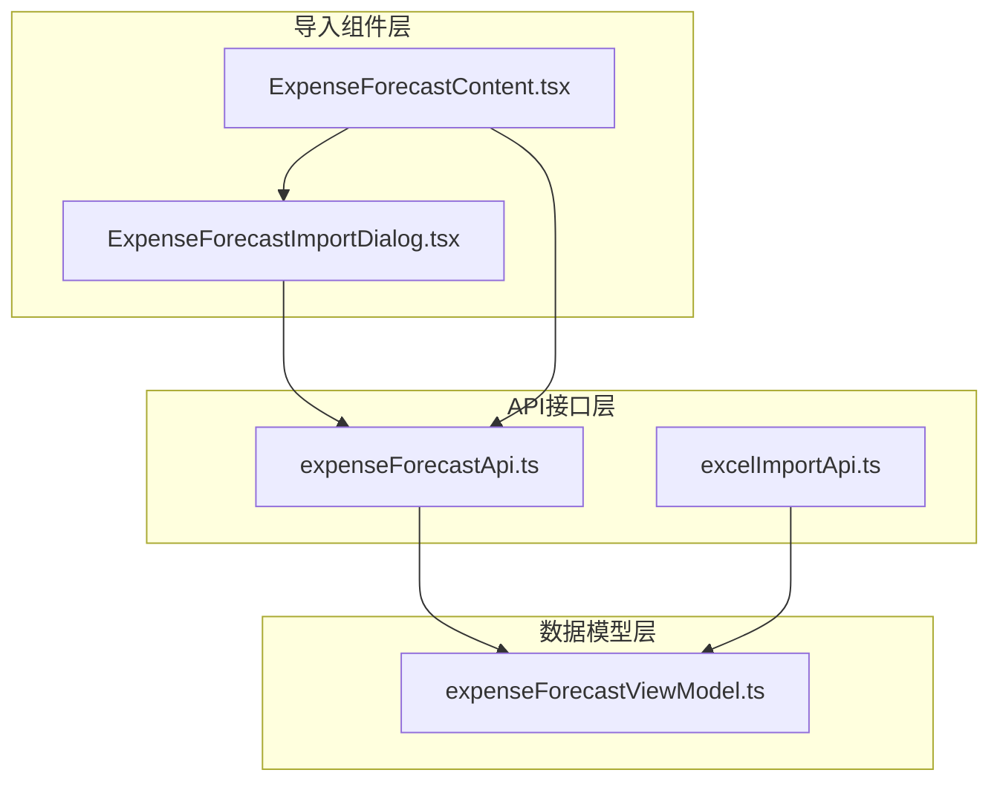
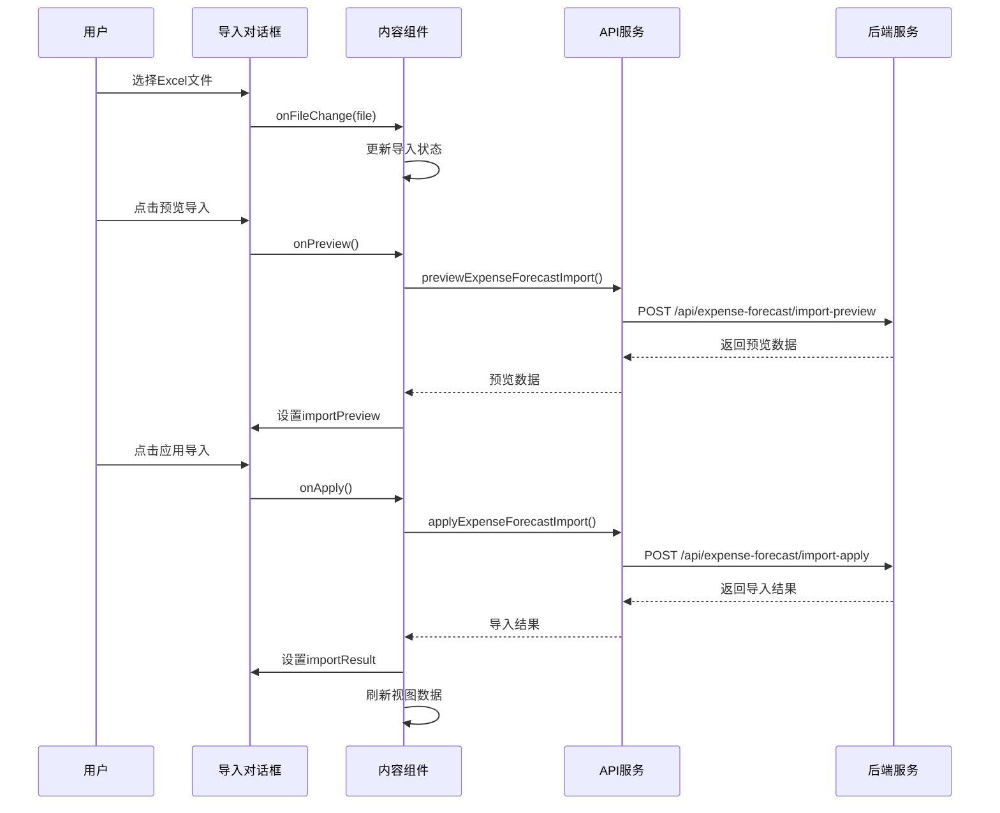
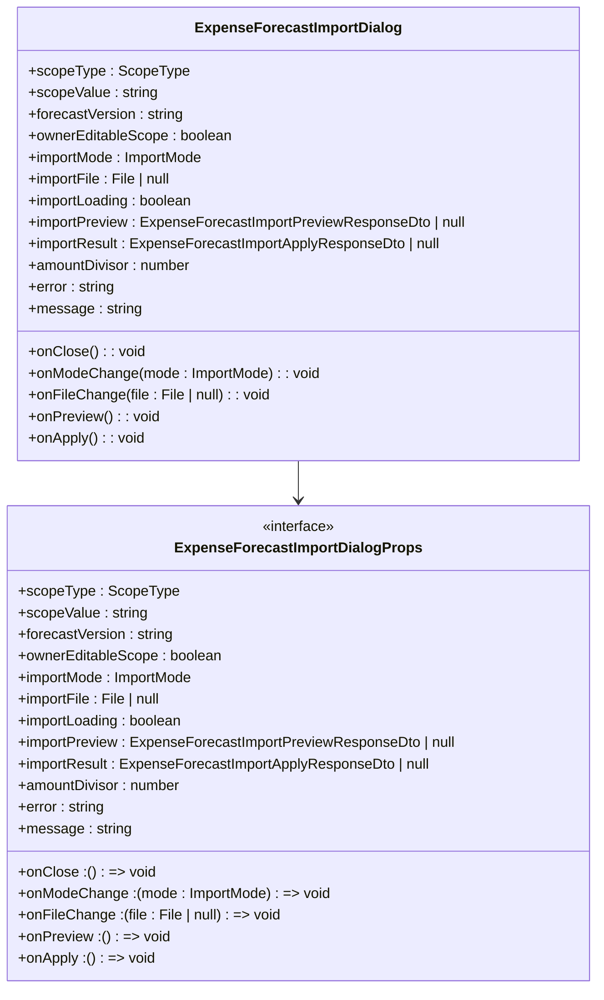
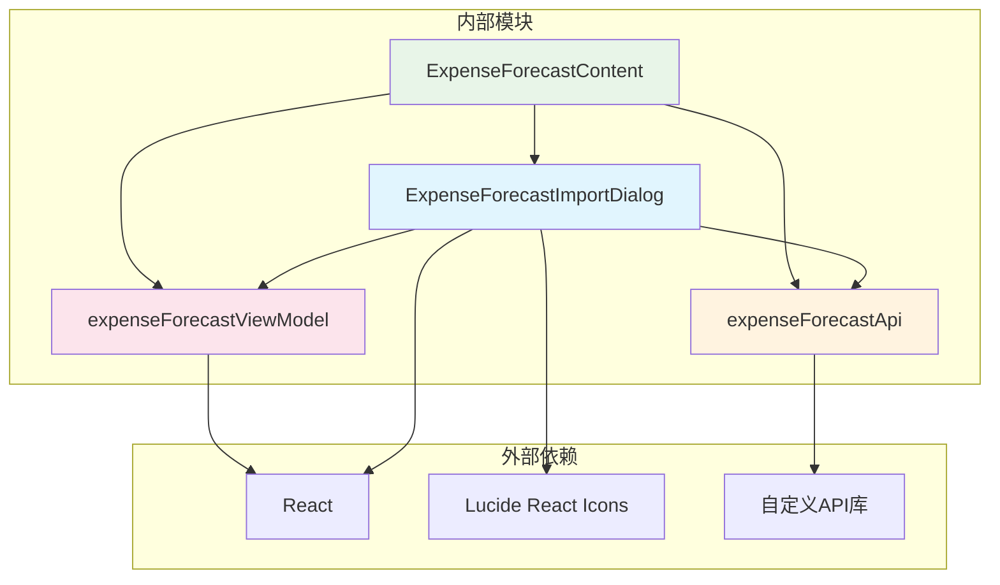

# 预算预测导入对话框组件

<cite>
**本文档引用的文件**
- [ExpenseForecastImportDialog.tsx](file://apps/web/src/app/components/ExpenseForecastImportDialog.tsx)
- [ExpenseForecastContent.tsx](file://apps/web/src/app/components/ExpenseForecastContent.tsx)
- [expenseForecastApi.ts](file://apps/web/src/lib/expenseForecastApi.ts)
- [expenseForecastViewModel.ts](file://apps/web/src/lib/expenseForecastViewModel.ts)
- [excelImportApi.ts](file://apps/web/src/lib/excelImportApi.ts)
</cite>

## 目录
1. [简介](#简介)
2. [项目结构](#项目结构)
3. [核心组件](#核心组件)
4. [架构概览](#架构概览)
5. [详细组件分析](#详细组件分析)
6. [依赖关系分析](#依赖关系分析)
7. [性能考虑](#性能考虑)
8. [故障排除指南](#故障排除指南)
9. [结论](#结论)

## 简介

预算预测导入对话框组件是一个用于预算预测数据批量导入的React组件，支持Excel文件的上传、数据预览和导入确认功能。该组件提供了完整的导入工作流程，包括文件选择、数据验证、导入模式选择（追加/覆盖）、导入进度显示和错误处理。

## 项目结构

ExpenseForecast导入功能由多个相关文件组成，形成了一个完整的导入系统：

**图表来源**
- [ExpenseForecastImportDialog.tsx:1-182](file://apps/web/src/app/components/ExpenseForecastImportDialog.tsx#L1-L182)
- [ExpenseForecastContent.tsx:81-117](file://apps/web/src/app/components/ExpenseForecastContent.tsx#L81-L117)
- [expenseForecastApi.ts:1-547](file://apps/web/src/lib/expenseForecastApi.ts#L1-L547)

**章节来源**
- [ExpenseForecastImportDialog.tsx:1-182](file://apps/web/src/app/components/ExpenseForecastImportDialog.tsx#L1-L182)
- [ExpenseForecastContent.tsx:81-117](file://apps/web/src/app/components/ExpenseForecastContent.tsx#L81-L117)

## 核心组件

### ExpenseForecastImportDialog 组件

ExpenseForecastImportDialog 是一个独立的对话框组件，负责提供用户界面和交互逻辑：

**主要功能特性：**
- 导入模式选择（追加/覆盖）
- Excel文件上传（.xlsx格式）
- 导入预览功能
- 数据验证和错误提示
- 导入进度显示
- 结果反馈和统计信息

**组件属性定义：**
- `scopeType`: 统计口径类型（entity/group/owner）
- `scopeValue`: 当前选择的统计口径值
- `forecastVersion`: 预测版本
- `ownerEditableScope`: 是否允许费用归属部门编辑
- `importMode`: 导入模式（append/overwrite）
- `importFile`: 选中的文件对象
- `importLoading`: 导入状态指示
- `importPreview`: 预览数据
- `importResult`: 导入结果
- `amountDivisor`: 金额除数（用于格式化显示）

**章节来源**
- [ExpenseForecastImportDialog.tsx:8-26](file://apps/web/src/app/components/ExpenseForecastImportDialog.tsx#L8-L26)
- [ExpenseForecastImportDialog.tsx:28-46](file://apps/web/src/app/components/ExpenseForecastImportDialog.tsx#L28-L46)

## 架构概览

导入系统采用分层架构设计，确保了良好的代码组织和职责分离：

**图表来源**
- [ExpenseForecastContent.tsx:617-690](file://apps/web/src/app/components/ExpenseForecastContent.tsx#L617-L690)
- [expenseForecastApi.ts:465-481](file://apps/web/src/lib/expenseForecastApi.ts#L465-L481)

## 详细组件分析

### 导入对话框UI组件

ExpenseForecastImportDialog 提供了直观的用户界面，包含以下关键元素：

**图表来源**
- [ExpenseForecastImportDialog.tsx:8-26](file://apps/web/src/app/components/ExpenseForecastImportDialog.tsx#L8-L26)
- [ExpenseForecastImportDialog.tsx:28-46](file://apps/web/src/app/components/ExpenseForecastImportDialog.tsx#L28-L46)

### 导入流程控制

ExpenseForecastContent 组件负责管理导入流程的状态和业务逻辑：

**导入预览流程：**
1. 验证文件选择状态
2. 检查统计口径有效性
3. 调用API进行数据预览
4. 处理预览结果和错误

**导入应用流程：**
1. 验证文件和参数
2. 执行导入操作
3. 显示导入结果
4. 刷新相关数据

**章节来源**
- [ExpenseForecastContent.tsx:617-690](file://apps/web/src/app/components/ExpenseForecastContent.tsx#L617-L690)

### API接口设计

expenseForecastApi.ts 提供了完整的导入相关API接口：

**预览导入API：**
- 路径：`/api/expense-forecast/import-preview`
- 方法：POST
- 参数：年份、版本、统计口径、编译模式、导入模式、科目ID、部门组名
- 返回：预览统计信息和详细列表

**应用导入API：**
- 路径：`/api/expense-forecast/import-apply`
- 方法：POST
- 参数：与预览API相同
- 返回：导入统计结果

**章节来源**
- [expenseForecastApi.ts:465-481](file://apps/web/src/lib/expenseForecastApi.ts#L465-L481)

### 数据模型定义

组件使用了丰富的TypeScript类型定义来确保类型安全：

**导入预览响应模型：**
- `insertable_cells`: 可新增单元格数量
- `updatable_cells`: 可覆盖单元格数量  
- `skipped_cells`: 跳过单元格数量
- `error_cells`: 错误单元格数量
- `items`: 详细的导入项列表

**导入结果模型：**
- `inserted_cells`: 新增单元格数量
- `updated_cells`: 覆盖单元格数量
- `skipped_cells`: 跳过单元格数量
- `error_cells`: 错误单元格数量

**章节来源**
- [expenseForecastApi.ts:151-171](file://apps/web/src/lib/expenseForecastApi.ts#L151-L171)

## 依赖关系分析

导入系统各组件之间的依赖关系如下：

**图表来源**
- [ExpenseForecastImportDialog.tsx:1-6](file://apps/web/src/app/components/ExpenseForecastImportDialog.tsx#L1-L6)
- [ExpenseForecastContent.tsx:10-44](file://apps/web/src/app/components/ExpenseForecastContent.tsx#L10-L44)

**章节来源**
- [ExpenseForecastImportDialog.tsx:1-6](file://apps/web/src/app/components/ExpenseForecastImportDialog.tsx#L1-L6)
- [ExpenseForecastContent.tsx:10-44](file://apps/web/src/app/components/ExpenseForecastContent.tsx#L10-L44)

## 性能考虑

导入系统在设计时考虑了以下性能优化：

1. **异步处理**：所有导入操作都是异步执行，避免阻塞UI线程
2. **状态管理**：使用React状态管理导入流程的各个阶段
3. **条件渲染**：根据导入状态动态显示不同的UI元素
4. **数据格式化**：使用适当的数值格式化减少计算开销
5. **错误缓存**：及时清理导入预览和结果状态

## 故障排除指南

### 常见问题及解决方案

**文件格式错误：**
- 症状：无法选择Excel文件
- 解决方案：确保文件扩展名为.xlsx

**权限不足：**
- 症状：导入预览或应用失败
- 解决方案：检查用户权限和数据访问权限

**网络连接问题：**
- 症状：API调用超时
- 解决方案：检查网络连接和服务器状态

**数据验证失败：**
- 症状：导入预览显示错误单元格
- 解决方案：检查Excel模板格式和数据完整性

**章节来源**
- [ExpenseForecastContent.tsx:617-690](file://apps/web/src/app/components/ExpenseForecastContent.tsx#L617-L690)

## 结论

预算预测导入对话框组件提供了一个完整、用户友好的Excel导入解决方案。通过清晰的组件分离、完善的错误处理和直观的用户界面，该组件能够有效支持预算预测数据的批量导入需求。组件的设计遵循了React最佳实践，具有良好的可维护性和扩展性。