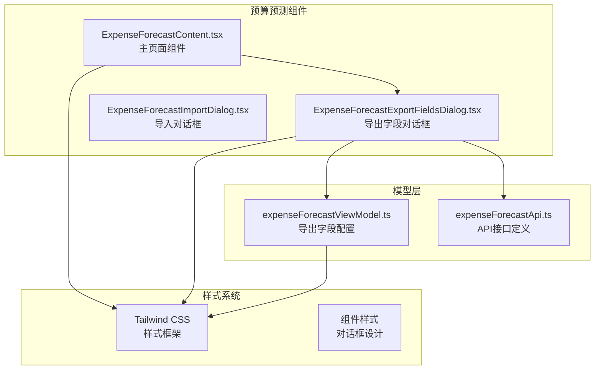
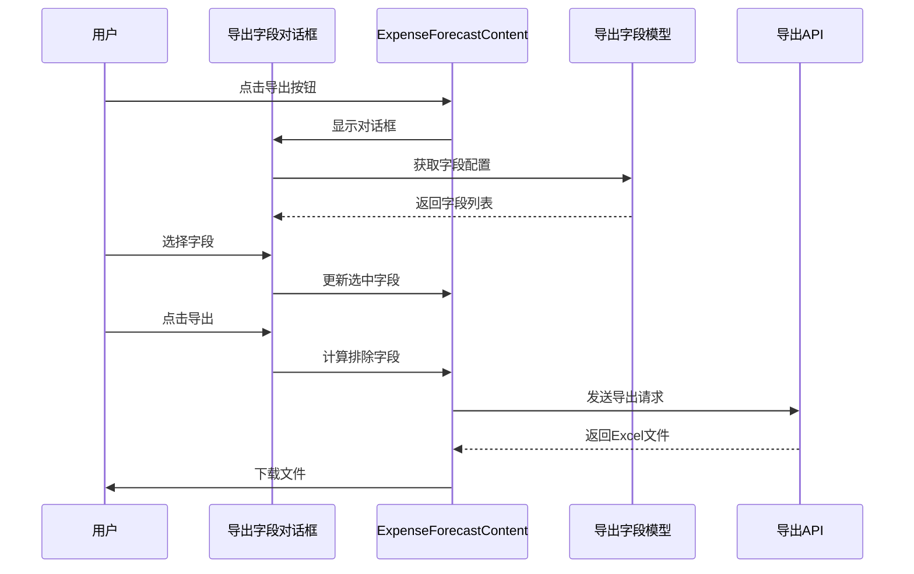
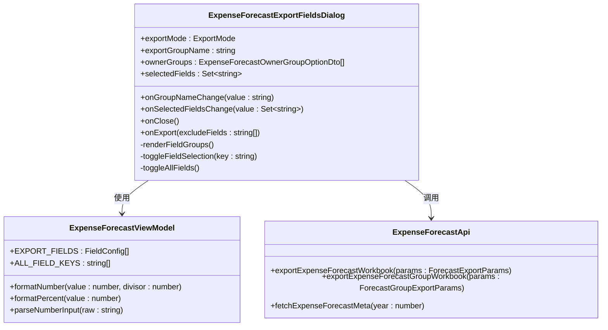
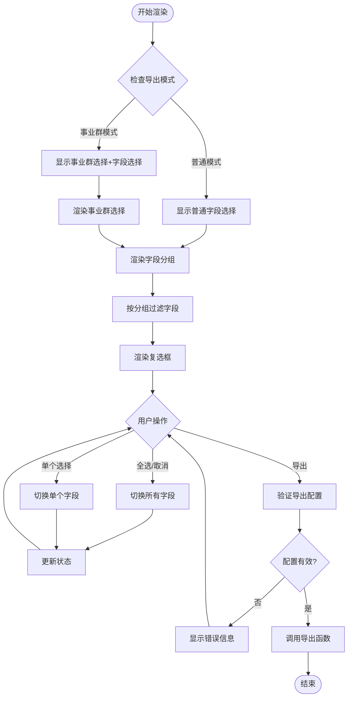
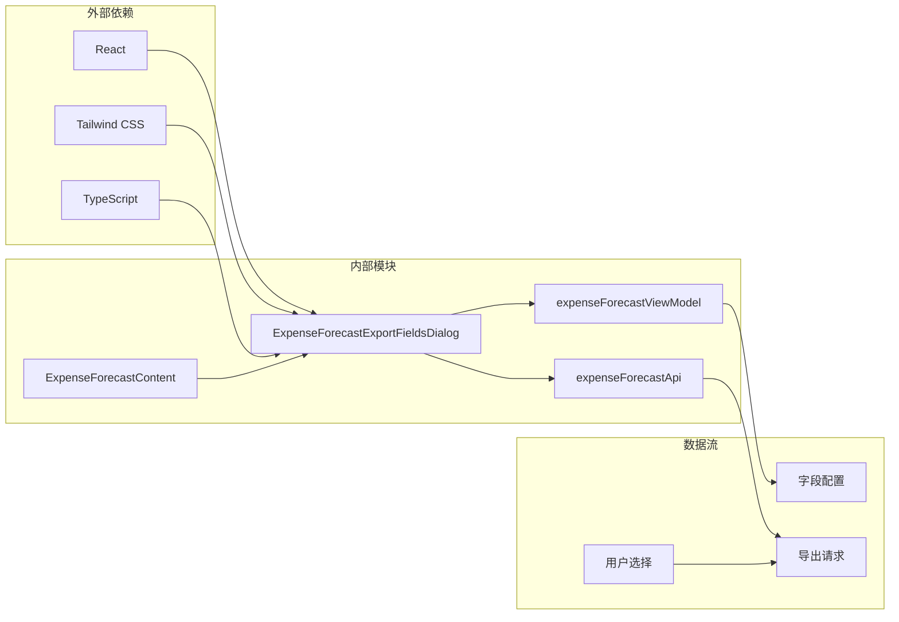

# 预算预测导出字段选择对话框组件

<cite>
**本文档引用的文件**
- [ExpenseForecastExportFieldsDialog.tsx](file://apps/web/src/app/components/ExpenseForecastExportFieldsDialog.tsx)
- [ExpenseForecastContent.tsx](file://apps/web/src/app/components/ExpenseForecastContent.tsx)
- [expenseForecastViewModel.ts](file://apps/web/src/lib/expenseForecastViewModel.ts)
- [expenseForecastApi.ts](file://apps/web/src/lib/expenseForecastApi.ts)
</cite>

## 目录
1. [简介](#简介)
2. [项目结构](#项目结构)
3. [核心组件](#核心组件)
4. [架构概览](#架构概览)
5. [详细组件分析](#详细组件分析)
6. [依赖关系分析](#依赖关系分析)
7. [性能考虑](#性能考虑)
8. [故障排除指南](#故障排除指南)
9. [结论](#结论)

## 简介

ExpenseForecastExportFieldsDialog 是预算预测模块中的一个关键对话框组件，负责提供用户友好的导出字段选择界面。该组件允许用户自定义导出的Excel字段，支持字段分组显示、批量选择和按需过滤功能。

该组件实现了完整的字段管理功能，包括：
- 字段分组显示（月度、汇总、报送）
- 全选/取消全选功能
- 单个字段的勾选控制
- 事业群导出模式支持
- 导出配置验证和错误处理

## 项目结构

ExpenseForecastExportFieldsDialog 组件位于前端Web应用的组件目录中，与预算预测相关的核心文件组织如下：

**图表来源**
- [ExpenseForecastExportFieldsDialog.tsx:1-111](file://apps/web/src/app/components/ExpenseForecastExportFieldsDialog.tsx#L1-L111)
- [ExpenseForecastContent.tsx:1122-1140](file://apps/web/src/app/components/ExpenseForecastContent.tsx#L1122-L1140)

**章节来源**
- [ExpenseForecastExportFieldsDialog.tsx:1-111](file://apps/web/src/app/components/ExpenseForecastExportFieldsDialog.tsx#L1-L111)
- [ExpenseForecastContent.tsx:1122-1140](file://apps/web/src/app/components/ExpenseForecastContent.tsx#L1122-L1140)

## 核心组件

### ExpenseForecastExportFieldsDialog 组件

ExpenseForecastExportFieldsDialog 是一个独立的React函数组件，负责渲染导出字段选择对话框。组件接收多个props来控制其行为和外观。

**主要特性：**
- 支持两种导出模式：普通模式和按事业群模式
- 动态字段分组显示（月度、汇总、报送）
- 实时字段选择状态管理
- 导出配置验证和错误处理

**组件属性类型：**
- `exportMode`: 导出模式（"normal" | "group"）
- `exportGroupName`: 选定的事业群名称
- `ownerGroups`: 可用的事业群选项列表
- `selectedFields`: 当前选中的字段集合
- `onGroupNameChange`: 事业群变更回调函数
- `onSelectedFieldsChange`: 字段选择变更回调函数
- `onClose`: 对话框关闭回调函数
- `onExport`: 执行导出回调函数

**章节来源**
- [ExpenseForecastExportFieldsDialog.tsx:6-15](file://apps/web/src/app/components/ExpenseForecastExportFieldsDialog.tsx#L6-L15)
- [ExpenseForecastExportFieldsDialog.tsx:17-26](file://apps/web/src/app/components/ExpenseForecastExportFieldsDialog.tsx#L17-L26)

## 架构概览

该组件采用清晰的分层架构，实现了视图层、逻辑层和数据层的有效分离：

**图表来源**
- [ExpenseForecastExportFieldsDialog.tsx:27-109](file://apps/web/src/app/components/ExpenseForecastExportFieldsDialog.tsx#L27-L109)
- [ExpenseForecastContent.tsx:574-615](file://apps/web/src/app/components/ExpenseForecastContent.tsx#L574-L615)

## 详细组件分析

### 字段管理系统

组件的核心功能是管理导出字段的选择和过滤。字段配置通过 expenseForecastViewModel.ts 文件集中管理：

**图表来源**
- [ExpenseForecastExportFieldsDialog.tsx:17-26](file://apps/web/src/app/components/ExpenseForecastExportFieldsDialog.tsx#L17-L26)
- [expenseForecastViewModel.ts:36-58](file://apps/web/src/lib/expenseForecastViewModel.ts#L36-L58)
- [expenseForecastApi.ts:416-449](file://apps/web/src/lib/expenseForecastApi.ts#L416-L449)

### 字段分组和过滤逻辑

组件实现了智能的字段分组和过滤功能：

**图表来源**
- [ExpenseForecastExportFieldsDialog.tsx:67-88](file://apps/web/src/app/components/ExpenseForecastExportFieldsDialog.tsx#L67-L88)
- [ExpenseForecastExportFieldsDialog.tsx:76-82](file://apps/web/src/app/components/ExpenseForecastExportFieldsDialog.tsx#L76-L82)

### 默认配置和用户偏好

组件支持默认配置和用户偏好的存储机制：

**默认配置：**
- 所有字段默认被选中（初始化时使用 ALL_FIELD_KEYS）
- 字段分组按照月度、汇总、报送进行分类
- 金额单位配置存储在本地存储中

**用户偏好存储：**
- 使用 localStorage 存储用户的金额单位偏好
- 键名为 "expense-forecast-amount-unit"
- 支持跨会话持久化

**章节来源**
- [ExpenseForecastExportFieldsDialog.tsx:114](file://apps/web/src/app/components/ExpenseForecastContent.tsx#L114)
- [expenseForecastViewModel.ts:58](file://apps/web/src/lib/expenseForecastViewModel.ts#L58)
- [ExpenseForecastContent.tsx:226-237](file://apps/web/src/app/components/ExpenseForecastContent.tsx#L226-L237)

### 导出字段配置

导出字段配置通过常量数组定义，包含以下分组：

**月度字段：**
- 1月到12月的预测值
- 每个月份对应一个字段键值

**汇总字段：**
- 全年预测总和
- 年度预算
- 预算差额（全年预测-年度预算）
- 预算执行率

**报送字段：**
- 业务报送值
- 资划建议值
- 资划建议与业务报送的差额

**章节来源**
- [expenseForecastViewModel.ts:36-56](file://apps/web/src/lib/expenseForecastViewModel.ts#L36-L56)

## 依赖关系分析

组件之间的依赖关系体现了清晰的职责分离：

**图表来源**
- [ExpenseForecastExportFieldsDialog.tsx:1-2](file://apps/web/src/app/components/ExpenseForecastExportFieldsDialog.tsx#L1-L2)
- [ExpenseForecastContent.tsx:8](file://apps/web/src/app/components/ExpenseForecastContent.tsx#L8)

### 组件耦合性分析

ExpenseForecastExportFieldsDialog 组件具有良好的内聚性和较低的耦合性：

**内聚性特点：**
- 专注于字段选择功能
- 清晰的单一职责
- 独立的状态管理

**耦合性控制：**
- 通过props传递数据和回调
- 依赖明确的接口定义
- 不直接操作DOM

**章节来源**
- [ExpenseForecastExportFieldsDialog.tsx:17-26](file://apps/web/src/app/components/ExpenseForecastExportFieldsDialog.tsx#L17-L26)
- [ExpenseForecastContent.tsx:1122-1140](file://apps/web/src/app/components/ExpenseForecastContent.tsx#L1122-L1140)

## 性能考虑

组件在设计时考虑了多种性能优化策略：

**渲染优化：**
- 使用React.memo避免不必要的重新渲染
- 按需渲染字段分组
- 事件委托减少事件监听器数量

**内存管理：**
- Set数据结构用于高效字段选择
- 避免创建不必要的中间数组
- 及时清理事件监听器

**用户体验：**
- 即时反馈字段选择状态
- 防抖处理频繁操作
- 加载状态指示

## 故障排除指南

### 常见问题及解决方案

**问题1：导出按钮不可用**
- 检查是否选择了至少一个字段
- 验证事业群选择（当使用按事业群模式时）

**问题2：字段选择状态异常**
- 确认selectedFields状态正确更新
- 检查Set数据结构的使用

**问题3：导出配置无效**
- 验证excludeFields计算逻辑
- 检查API参数格式

**章节来源**
- [ExpenseForecastExportFieldsDialog.tsx:98-102](file://apps/web/src/app/components/ExpenseForecastExportFieldsDialog.tsx#L98-L102)
- [ExpenseForecastContent.tsx:574-599](file://apps/web/src/app/components/ExpenseForecastContent.tsx#L574-L599)

## 结论

ExpenseForecastExportFieldsDialog 组件是一个设计精良的导出字段选择对话框，具有以下突出特点：

**技术优势：**
- 清晰的架构设计和职责分离
- 高效的字段管理和状态控制
- 完善的错误处理和验证机制
- 良好的用户体验和性能表现

**功能完整性：**
- 支持多种导出模式和字段分组
- 提供灵活的字段选择和过滤功能
- 集成用户偏好存储机制
- 与整体预算预测系统的无缝集成

该组件为预算预测功能提供了强大而易用的导出能力，是整个系统中不可或缺的重要组成部分。