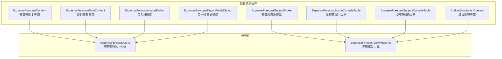
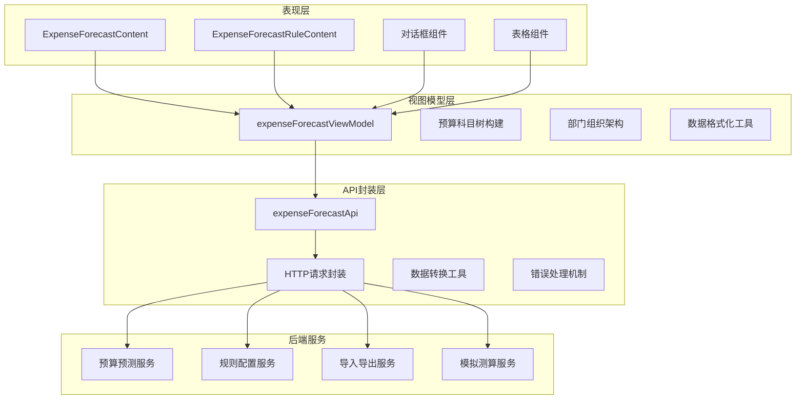
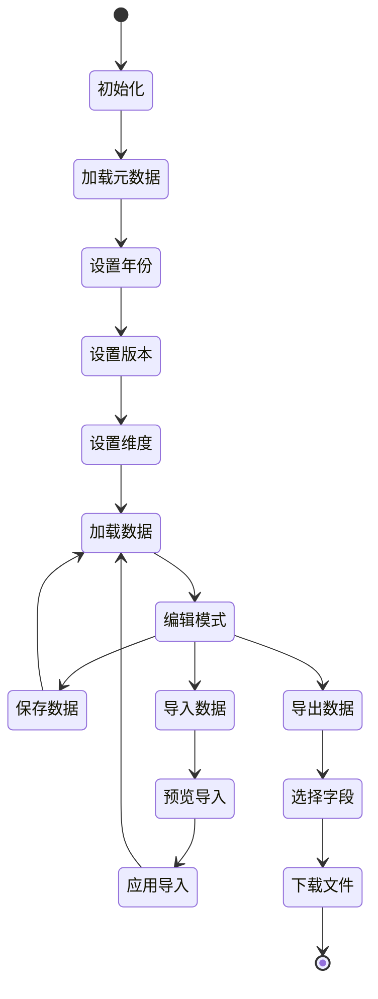
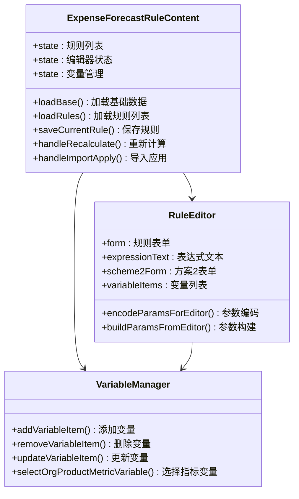
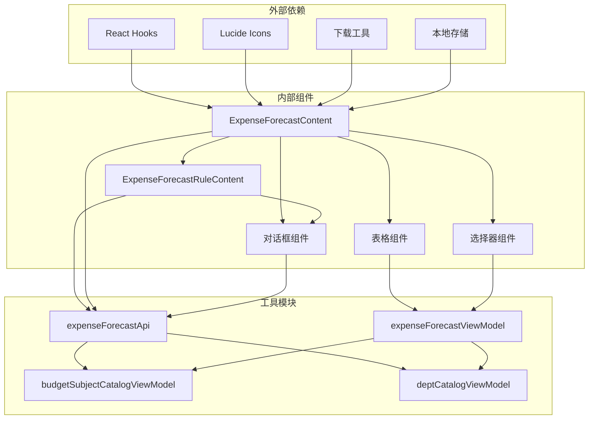

# 预算预测组件

<cite>
**本文档引用的文件**
- [ExpenseForecastContent.tsx](file://apps/web/src/app/components/ExpenseForecastContent.tsx)
- [ExpenseForecastRuleContent.tsx](file://apps/web/src/app/components/ExpenseForecastRuleContent.tsx)
- [ExpenseForecastImportDialog.tsx](file://apps/web/src/app/components/ExpenseForecastImportDialog.tsx)
- [ExpenseForecastExportFieldsDialog.tsx](file://apps/web/src/app/components/ExpenseForecastExportFieldsDialog.tsx)
- [ExpenseForecastSubjectPicker.tsx](file://apps/web/src/app/components/ExpenseForecastSubjectPicker.tsx)
- [ExpenseForecastScopeCompileTable.tsx](file://apps/web/src/app/components/ExpenseForecastScopeCompileTable.tsx)
- [ExpenseForecastSubjectCompileTable.tsx](file://apps/web/src/app/components/ExpenseForecastSubjectCompileTable.tsx)
- [BudgetSimulationContent.tsx](file://apps/web/src/app/components/BudgetSimulationContent.tsx)
- [expenseForecastApi.ts](file://apps/web/src/lib/expenseForecastApi.ts)
- [expenseForecastViewModel.ts](file://apps/web/src/lib/expenseForecastViewModel.ts)
</cite>

## 目录
1. [简介](#简介)
2. [项目结构](#项目结构)
3. [核心组件](#核心组件)
4. [架构概览](#架构概览)
5. [详细组件分析](#详细组件分析)
6. [依赖关系分析](#依赖关系分析)
7. [性能考虑](#性能考虑)
8. [故障排除指南](#故障排除指南)
9. [结论](#结论)
10. [附录](#附录)

## 简介

预算预测组件是智能预算系统的核心功能模块，提供了完整的预算预测、规则配置、导入导出和模拟测算能力。该系统采用React + TypeScript构建，通过RESTful API与后端服务进行数据交互，支持多种预算编制维度和复杂的业务场景。

系统主要包含四个核心功能模块：
- **预算预测内容组件**：提供预算预测数据的展示、编辑和管理功能
- **规则配置组件**：支持预算预测规则的创建、编辑和版本管理
- **导入导出对话框**：提供Excel文件的批量导入和导出功能
- **主题选择器**：支持预算科目的选择和筛选

## 项目结构

预算预测相关组件位于Web应用的组件目录中，采用模块化设计：

**图表来源**
- [ExpenseForecastContent.tsx:1-1144](file://apps/web/src/app/components/ExpenseForecastContent.tsx#L1-L1144)
- [ExpenseForecastRuleContent.tsx:1-1475](file://apps/web/src/app/components/ExpenseForecastRuleContent.tsx#L1-L1475)
- [expenseForecastApi.ts:1-547](file://apps/web/src/lib/expenseForecastApi.ts#L1-L547)

**章节来源**
- [ExpenseForecastContent.tsx:1-800](file://apps/web/src/app/components/ExpenseForecastContent.tsx#L1-L800)
- [ExpenseForecastRuleContent.tsx:1-800](file://apps/web/src/app/components/ExpenseForecastRuleContent.tsx#L1-L800)

## 核心组件

### 预算预测内容组件 (ExpenseForecastContent)

ExpenseForecastContent是预算预测系统的主要界面组件，负责整合所有预算预测功能。该组件实现了完整的状态管理和数据流控制。

**核心状态管理**：
- 元数据管理：`meta` - 预算预测基础配置信息
- 编制维度：`compileMode` - 支持按预算部门或预算科目编制
- 作用域类型：`scopeType` - 支持实体、事业群、费用归属部门三种维度
- 数据视图：`view`、`groupView`、`subjectView` - 不同维度的数据视图
- 用户交互：`editingCell`、`subjectEditingCell` - 实时编辑状态
- 导入导出：`importPreview`、`importResult`、`exportMode` - 批量操作状态

**数据绑定机制**：
组件通过自定义Hook实现复杂的数据绑定，包括：
- 预算科目树形结构的动态构建
- 部门组织架构的层次化展示
- 预算预测数据的实时刷新和缓存

**事件处理机制**：
- 单元格编辑事件：支持双击编辑和键盘快捷键
- 行选择事件：右键菜单和上下文操作
- 导入导出事件：异步文件处理和进度反馈
- 搜索过滤事件：实时数据筛选和高亮显示

**章节来源**
- [ExpenseForecastContent.tsx:81-356](file://apps/web/src/app/components/ExpenseForecastContent.tsx#L81-L356)
- [ExpenseForecastContent.tsx:428-572](file://apps/web/src/app/components/ExpenseForecastContent.tsx#L428-L572)

### 规则配置组件 (ExpenseForecastRuleContent)

ExpenseForecastRuleContent专门用于预算预测规则的配置和管理，支持多种规则类型和复杂的业务逻辑。

**规则类型支持**：
- **手工/导入**：适用于手工录入或Excel导入分月预测的科目
- **余额分摊**：适用于"资划建议 - 累计实际"后按未来月份自动分摊的科目
- **指标表达式**：适用于按经营指标、业务规模等变量自动测算的科目

**编辑器功能**：
- 参数配置：支持JSON格式的复杂参数设置
- 变量管理：支持多源数据变量的配置和映射
- 预览功能：实时预览规则计算结果
- 版本管理：支持规则版本的复制和迁移

**章节来源**
- [ExpenseForecastRuleContent.tsx:348-756](file://apps/web/src/app/components/ExpenseForecastRuleContent.tsx#L348-L756)

### 导入导出对话框

系统提供两个专用的对话框组件，分别处理导入和导出操作：

**导入对话框 (ExpenseForecastImportDialog)**：
- 支持Excel文件的批量导入
- 提供导入预览和错误检查
- 支持追加和覆盖两种模式
- 实时显示导入进度和结果

**导出设置对话框 (ExpenseForecastExportFieldsDialog)**：
- 灵活的字段选择功能
- 支持按事业群批量导出
- 自定义导出范围和格式
- 实时预览导出结果

**章节来源**
- [ExpenseForecastImportDialog.tsx:28-182](file://apps/web/src/app/components/ExpenseForecastImportDialog.tsx#L28-L182)
- [ExpenseForecastExportFieldsDialog.tsx:17-111](file://apps/web/src/app/components/ExpenseForecastExportFieldsDialog.tsx#L17-L111)

### 主题选择器 (ExpenseForecastSubjectPicker)

ExpenseForecastSubjectPicker是一个高度定制化的预算科目选择组件，支持复杂的搜索和筛选功能。

**核心特性**：
- 树形结构展示：支持多级预算科目的层次化显示
- 实时搜索：支持按名称和路径的模糊搜索
- 高亮显示：搜索关键词的智能高亮
- 动态展开：支持节点的动态展开和折叠

**交互设计**：
- 点击展开：支持树节点的点击展开/折叠
- 双击选择：支持预算科目的快速选择
- 键盘导航：支持Tab键和方向键的键盘操作
- 模糊匹配：支持拼音首字母的快速检索

**章节来源**
- [ExpenseForecastSubjectPicker.tsx:43-160](file://apps/web/src/app/components/ExpenseForecastSubjectPicker.tsx#L43-L160)

## 架构概览

预算预测系统的整体架构采用分层设计，确保了良好的可维护性和扩展性：

**图表来源**
- [expenseForecastApi.ts:370-547](file://apps/web/src/lib/expenseForecastApi.ts#L370-L547)
- [expenseForecastViewModel.ts:121-351](file://apps/web/src/lib/expenseForecastViewModel.ts#L121-L351)

**章节来源**
- [ExpenseForecastContent.tsx:126-356](file://apps/web/src/app/components/ExpenseForecastContent.tsx#L126-L356)
- [ExpenseForecastRuleContent.tsx:521-756](file://apps/web/src/app/components/ExpenseForecastRuleContent.tsx#L521-L756)

## 详细组件分析

### 预算预测内容组件深度分析

#### 状态管理系统

ExpenseForecastContent实现了复杂的状态管理机制，通过多个useState Hook管理不同的状态维度：

**图表来源**
- [ExpenseForecastContent.tsx:285-349](file://apps/web/src/app/components/ExpenseForecastContent.tsx#L285-L349)

#### 数据流处理

组件内部实现了复杂的数据流处理逻辑，包括：

**数据获取流程**：
1. 加载预算预测元数据
2. 获取预算科目和部门数据
3. 根据选择的维度加载对应的数据视图
4. 实时更新和缓存数据

**数据处理流程**：
1. 数据结构转换和优化
2. 层次化数据的扁平化处理
3. 搜索和过滤功能的实现
4. 实时计算和状态更新

**章节来源**
- [ExpenseForecastContent.tsx:212-356](file://apps/web/src/app/components/ExpenseForecastContent.tsx#L212-L356)

### 规则配置组件深度分析

#### 规则编辑器架构

ExpenseForecastRuleContent采用了模块化的编辑器架构，支持不同规则类型的灵活配置：

**图表来源**
- [ExpenseForecastRuleContent.tsx:348-800](file://apps/web/src/app/components/ExpenseForecastRuleContent.tsx#L348-L800)

#### 规则类型处理

组件支持三种主要的规则类型，每种类型都有特定的参数配置和处理逻辑：

**手工/导入规则**：
- 最简单的规则类型，支持手工录入和Excel导入
- 参数配置相对简单，适合基础预算场景

**余额分摊规则**：
- 复杂的财务分摊算法
- 支持进度分摊和自定义权重
- 包含多种曲线类型和计算模式

**指标表达式规则**：
- 基于业务指标的自动化计算
- 支持多源数据变量的组合
- 提供强大的表达式引擎

**章节来源**
- [ExpenseForecastRuleContent.tsx:123-182](file://apps/web/src/app/components/ExpenseForecastRuleContent.tsx#L123-L182)

### 表格组件分析

#### 预算部门表格 (ExpenseForecastScopeCompileTable)

ExpenseForecastScopeCompileTable是预算预测数据展示的核心表格组件：

**功能特性**：
- 支持树形结构的预算科目展示
- 实时单元格编辑功能
- 多维度数据的聚合显示
- 丰富的状态指示和帮助信息

**交互机制**：
- 双击编辑：支持单元格的双击编辑
- 键盘导航：支持Tab键和方向键的操作
- 上下文菜单：右键显示相关操作
- 实时保存：编辑完成后自动保存

**章节来源**
- [ExpenseForecastScopeCompileTable.tsx:52-283](file://apps/web/src/app/components/ExpenseForecastScopeCompileTable.tsx#L52-L283)

#### 预算科目表格 (ExpenseForecastSubjectCompileTable)

ExpenseForecastSubjectCompileTable专门用于按预算科目维度的数据展示：

**核心功能**：
- 支持按费用归属部门的层次化展示
- 集成预算科目选择器的功能
- 实时的搜索和过滤功能
- 动态的展开/折叠操作

**设计特点**：
- 左侧固定列：预算科目和部门信息
- 滚动区域：支持大量数据的滚动查看
- 状态标识：不同数据来源的视觉区分
- 快捷操作：一键编辑和批量操作

**章节来源**
- [ExpenseForecastSubjectCompileTable.tsx:38-249](file://apps/web/src/app/components/ExpenseForecastSubjectCompileTable.tsx#L38-L249)

## 依赖关系分析

预算预测组件之间的依赖关系体现了清晰的分层架构：

**图表来源**
- [ExpenseForecastContent.tsx:1-73](file://apps/web/src/app/components/ExpenseForecastContent.tsx#L1-L73)
- [ExpenseForecastRuleContent.tsx:1-25](file://apps/web/src/app/components/ExpenseForecastRuleContent.tsx#L1-L25)

**章节来源**
- [expenseForecastApi.ts:1-547](file://apps/web/src/lib/expenseForecastApi.ts#L1-L547)
- [expenseForecastViewModel.ts:1-351](file://apps/web/src/lib/expenseForecastViewModel.ts#L1-L351)

## 性能考虑

预算预测系统在设计时充分考虑了性能优化：

### 数据缓存策略
- **元数据缓存**：预算预测的基础配置信息缓存在localStorage中
- **视图缓存**：不同维度的数据视图进行内存缓存
- **搜索缓存**：预算科目的搜索结果进行缓存优化

### 渲染优化
- **虚拟滚动**：大数据量表格采用虚拟滚动技术
- **懒加载**：树形结构支持动态加载子节点
- **防抖处理**：搜索和过滤操作采用防抖优化

### 网络请求优化
- **批量请求**：多个API调用进行并发处理
- **请求去重**：相同请求避免重复发送
- **错误重试**：网络异常时的自动重试机制

## 故障排除指南

### 常见问题及解决方案

**数据加载失败**
- 检查网络连接和API服务状态
- 验证用户权限和认证信息
- 查看浏览器控制台的错误日志

**编辑功能异常**
- 确认数据的可编辑状态
- 检查规则配置是否正确
- 验证数据格式和数值范围

**导入导出问题**
- 确认Excel文件格式符合要求
- 检查文件大小和格式限制
- 验证目标维度和版本设置

**章节来源**
- [ExpenseForecastContent.tsx:220-223](file://apps/web/src/app/components/ExpenseForecastContent.tsx#L220-L223)
- [ExpenseForecastRuleContent.tsx:650-656](file://apps/web/src/app/components/ExpenseForecastRuleContent.tsx#L650-L656)

## 结论

预算预测组件系统通过精心的设计和实现，为用户提供了一个功能完整、性能优异的预算管理平台。系统的主要优势包括：

**功能完整性**：涵盖了预算预测的所有核心功能，从数据展示到规则配置，从导入导出到模拟测算

**用户体验优秀**：直观的界面设计、流畅的交互体验和完善的错误处理机制

**技术架构先进**：采用现代化的React技术栈，具有良好的可维护性和扩展性

**性能表现优异**：通过多种优化策略确保了系统的高效运行

该系统为企业的预算管理工作提供了强有力的技术支撑，能够满足各种复杂的预算预测需求。

## 附录

### 使用示例

以下是一个典型的预算预测工作流程示例：

1. **初始化系统**：加载预算预测元数据和基础配置
2. **选择维度**：根据需要选择预算编制维度（预算部门/预算科目）
3. **配置参数**：设置年份、版本和金额单位等参数
4. **查看数据**：浏览预算预测数据和相关指标
5. **编辑数据**：对需要调整的数据进行编辑和保存
6. **导入导出**：批量导入Excel数据或导出预测结果
7. **规则配置**：配置预算预测规则以实现自动化计算

### API交互模式

系统采用标准的RESTful API交互模式，支持以下主要操作：

- **GET**：获取元数据、视图数据和规则列表
- **POST**：保存单元格数据、导入Excel文件、触发重新计算
- **PUT**：更新规则配置信息
- **DELETE**：删除不需要的规则

### 数据同步策略

系统实现了多层次的数据同步机制：

- **实时同步**：编辑后的数据立即同步到服务器
- **批量同步**：导入导出操作采用批量同步策略
- **增量同步**：只同步发生变化的数据部分
- **冲突解决**：通过版本控制和时间戳解决数据冲突