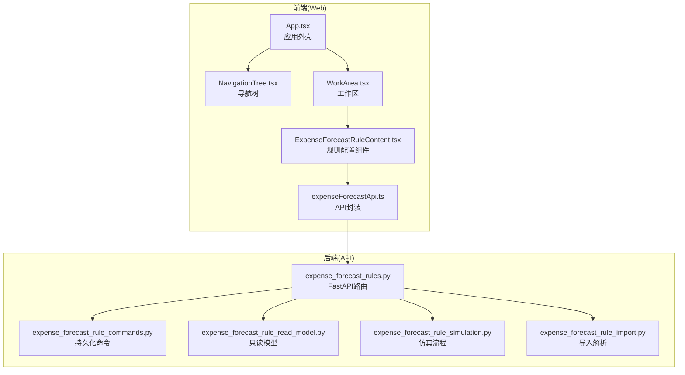
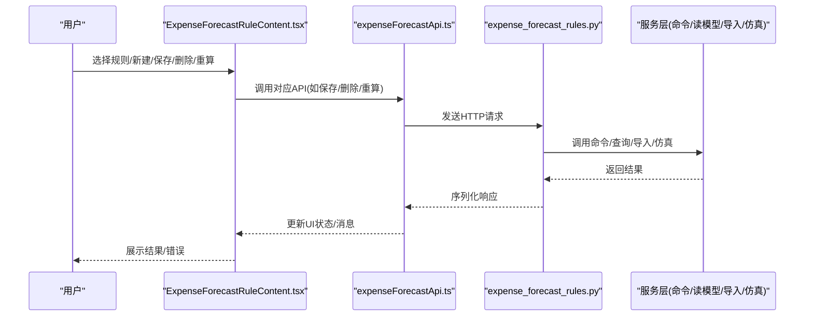
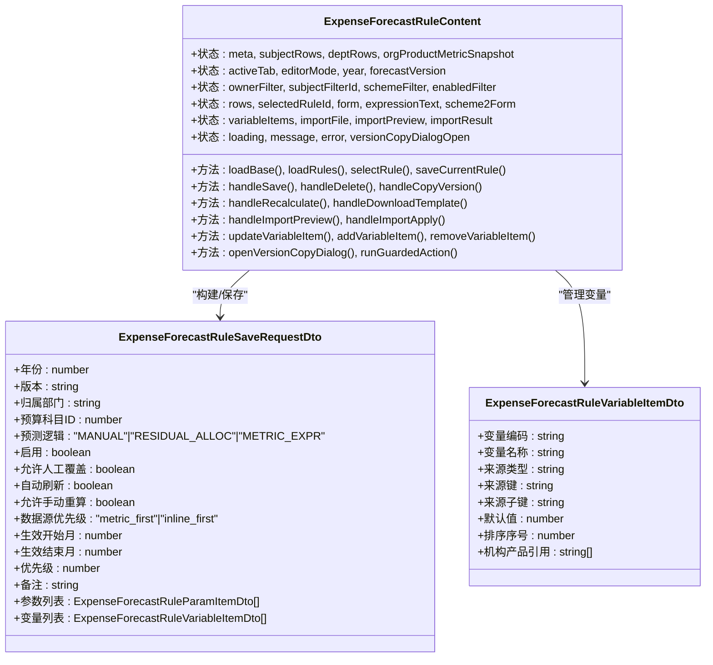
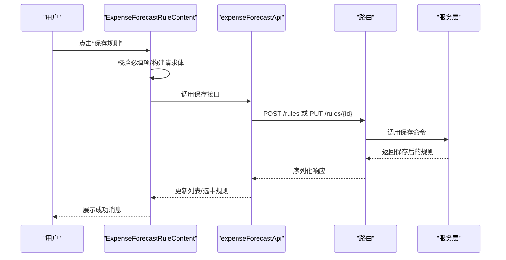
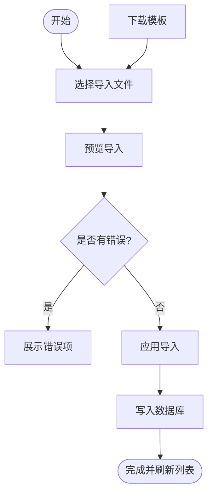
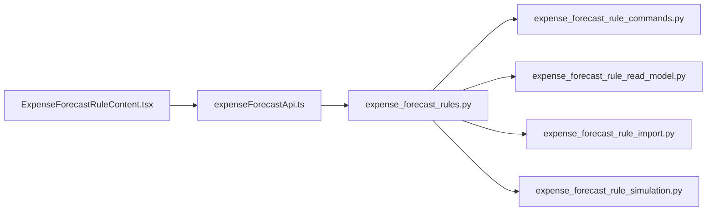

# 预算预测规则配置组件

<cite>
**本文档引用的文件**
- [ExpenseForecastRuleContent.tsx](file://apps/web/src/app/components/ExpenseForecastRuleContent.tsx)
- [expenseForecastApi.ts](file://apps/web/src/lib/expenseForecastApi.ts)
- [expense_forecast_rules.py](file://apps/api/app/routers/expense_forecast_rules.py)
- [expense_forecast_rule_commands.py](file://apps/api/app/services/expense_forecast_rule_commands.py)
- [expense_forecast_rule_read_model.py](file://apps/api/app/services/expense_forecast_rule_read_model.py)
- [expense_forecast_rule_simulation.py](file://apps/api/app/services/expense_forecast_rule_simulation.py)
- [expense_forecast_rule_import.py](file://apps/api/app/services/expense_forecast_rule_import.py)
- [App.tsx](file://apps/web/src/app/App.tsx)
- [WorkArea.tsx](file://apps/web/src/app/components/WorkArea.tsx)
- [NavigationTree.tsx](file://apps/web/src/app/components/NavigationTree.tsx)
</cite>

## 目录
1. [简介](#简介)
2. [项目结构](#项目结构)
3. [核心组件](#核心组件)
4. [架构总览](#架构总览)
5. [详细组件分析](#详细组件分析)
6. [依赖关系分析](#依赖关系分析)
7. [性能考虑](#性能考虑)
8. [故障排除指南](#故障排除指南)
9. [结论](#结论)
10. [附录](#附录)

## 简介
本文件全面阐述预算预测规则配置组件（ExpenseForecastRuleContent）的实现细节，涵盖规则配置界面设计、交互逻辑、增删改查操作、规则类型与条件设置、优先级管理、与后端规则引擎的交互方式以及数据同步策略。同时提供最佳实践与常见使用场景的指导。

## 项目结构
ExpenseForecastRuleContent 是前端工作区中的一个模块，通过导航树打开，工作区负责在标签页中渲染该模块。组件采用 React Hooks 管理状态，调用 expenseForecastApi 进行前后端交互，后端通过 FastAPI 路由暴露规则 CRUD、导入导出、重算等能力。

**图表来源**
- [App.tsx:388-518](file://apps/web/src/app/App.tsx#L388-L518)
- [NavigationTree.tsx:53-70](file://apps/web/src/app/components/NavigationTree.tsx#L53-L70)
- [WorkArea.tsx:18-151](file://apps/web/src/app/components/WorkArea.tsx#L18-L151)
- [ExpenseForecastRuleContent.tsx:348-1475](file://apps/web/src/app/components/ExpenseForecastRuleContent.tsx#L348-L1475)
- [expenseForecastApi.ts:370-547](file://apps/web/src/lib/expenseForecastApi.ts#L370-L547)
- [expense_forecast_rules.py:164-280](file://apps/api/app/routers/expense_forecast_rules.py#L164-L280)

**章节来源**
- [App.tsx:388-518](file://apps/web/src/app/App.tsx#L388-L518)
- [NavigationTree.tsx:53-70](file://apps/web/src/app/components/NavigationTree.tsx#L53-L70)
- [WorkArea.tsx:18-151](file://apps/web/src/app/components/WorkArea.tsx#L18-L151)

## 核心组件
ExpenseForecastRuleContent 是规则配置的核心 UI 组件，提供“规则管理”和“参数配置”两个标签页，支持规则的增删改查、版本复制、导入导出、重算等功能。组件内部通过多种状态管理规则表单、变量映射、编辑器快照与未保存提示等。

关键特性：
- 规则管理：筛选、列表展示、新建、删除、导入预览与应用、版本复制
- 参数配置：适用范围、生效与控制、预测逻辑参数（手工/导入、余额分摊、指标表达式）、变量映射
- 数据同步：基于 API 的增删改查与重算触发
- 用户体验：未保存变更保护、导航提示、消息与错误提示

**章节来源**
- [ExpenseForecastRuleContent.tsx:348-1475](file://apps/web/src/app/components/ExpenseForecastRuleContent.tsx#L348-L1475)

## 架构总览
前端通过 expenseForecastApi 调用后端接口，后端路由将请求分发至对应的命令与服务层。规则数据存储在 SQLite 数据库中，读模型负责组装规则详情与变量映射，导入服务负责 Excel 解析与校验，仿真服务用于规则模拟计算。

**图表来源**
- [ExpenseForecastRuleContent.tsx:622-756](file://apps/web/src/app/components/ExpenseForecastRuleContent.tsx#L622-L756)
- [expenseForecastApi.ts:483-547](file://apps/web/src/lib/expenseForecastApi.ts#L483-L547)
- [expense_forecast_rules.py:164-280](file://apps/api/app/routers/expense_forecast_rules.py#L164-L280)

## 详细组件分析

### 组件类图

**图表来源**
- [ExpenseForecastRuleContent.tsx:348-800](file://apps/web/src/app/components/ExpenseForecastRuleContent.tsx#L348-L800)
- [expenseForecastApi.ts:222-239](file://apps/web/src/lib/expenseForecastApi.ts#L222-L239)
- [expenseForecastApi.ts:180-193](file://apps/web/src/lib/expenseForecastApi.ts#L180-L193)

**章节来源**
- [ExpenseForecastRuleContent.tsx:348-800](file://apps/web/src/app/components/ExpenseForecastRuleContent.tsx#L348-L800)
- [expenseForecastApi.ts:173-239](file://apps/web/src/lib/expenseForecastApi.ts#L173-L239)

### 规则类型与参数配置
组件支持三种规则类型：
- 手工/导入（MANUAL）：通过费用预测表直接录入或导入
- 余额分摊（RESIDUAL_ALLOC）：基于“资划建议 - 累计实际”的剩余金额进行分摊，支持逐月递增或自定义系数
- 指标表达式（METRIC_EXPR）：通过表达式与变量映射自动计算

参数配置要点：
- 适用范围：归属部门、预算科目、预测逻辑
- 生效与控制：生效起止月、优先级、数据源优先级、启用/允许覆盖/自动刷新/允许手动重算
- 余额分摊参数：分摊模式（逐月递增/自定义系数）、自动反推方式（等差/等比）、是否允许负数、自定义系数 JSON
- 指标表达式参数：表达式文本、变量映射（变量编码、来源类型、来源键、默认值等）

**章节来源**
- [ExpenseForecastRuleContent.tsx:1120-1368](file://apps/web/src/app/components/ExpenseForecastRuleContent.tsx#L1120-L1368)
- [expense_forecast_rules.py:14-86](file://apps/api/app/routers/expense_forecast_rules.py#L14-L86)

### 增删改查流程
- 列表加载：根据年份、版本、归属部门、预算科目过滤，返回规则列表
- 新建规则：清空编辑器状态，填充默认值，保存后刷新列表并选中新规则
- 编辑规则：将后端规则转换为编辑器状态，保存后刷新列表并重新选中
- 删除规则：二次确认后删除，刷新列表并重置编辑器
- 重算：按年份、版本、可选归属部门/预算科目触发重算，返回影响的规则数与单元格数

**图表来源**
- [ExpenseForecastRuleContent.tsx:622-656](file://apps/web/src/app/components/ExpenseForecastRuleContent.tsx#L622-L656)
- [expenseForecastApi.ts:493-508](file://apps/web/src/lib/expenseForecastApi.ts#L493-L508)
- [expense_forecast_rules.py:211-218](file://apps/api/app/routers/expense_forecast_rules.py#L211-L218)
- [expense_forecast_rule_commands.py:36-141](file://apps/api/app/services/expense_forecast_rule_commands.py#L36-L141)

**章节来源**
- [ExpenseForecastRuleContent.tsx:537-656](file://apps/web/src/app/components/ExpenseForecastRuleContent.tsx#L537-L656)
- [expenseForecastApi.ts:483-508](file://apps/web/src/lib/expenseForecastApi.ts#L483-L508)
- [expense_forecast_rules.py:186-218](file://apps/api/app/routers/expense_forecast_rules.py#L186-L218)

### 导入导出与版本复制
- 下载模板：生成 Excel 模板，包含预测逻辑、布尔字段、数据源优先级、分摊模式、自动反推方式、变量映射 JSON 等字段
- 预览导入：解析 Excel，统计新增/更新/跳过/错误条目
- 应用导入：将解析结果写入数据库，返回插入/更新/错误数量
- 版本复制：将来源版本的规则复制到目标版本

**图表来源**
- [ExpenseForecastRuleContent.tsx:713-756](file://apps/web/src/app/components/ExpenseForecastRuleContent.tsx#L713-L756)
- [expenseForecastApi.ts:522-546](file://apps/web/src/lib/expenseForecastApi.ts#L522-L546)
- [expense_forecast_rules.py:235-261](file://apps/api/app/routers/expense_forecast_rules.py#L235-L261)
- [expense_forecast_rule_import.py:307-436](file://apps/api/app/services/expense_forecast_rule_import.py#L307-L436)

**章节来源**
- [ExpenseForecastRuleContent.tsx:982-1067](file://apps/web/src/app/components/ExpenseForecastRuleContent.tsx#L982-L1067)
- [expenseForecastApi.ts:522-546](file://apps/web/src/lib/expenseForecastApi.ts#L522-L546)
- [expense_forecast_rule_import.py:163-305](file://apps/api/app/services/expense_forecast_rule_import.py#L163-L305)

### 与后端规则引擎的交互
- 列表与详情：GET /rules、GET /rules/by-id/{rule_id}
- 创建与更新：POST /rules、PUT /rules/{rule_id}
- 删除：DELETE /rules/{rule_id}
- 版本复制：POST /rules/copy-from-version
- 模板下载：GET /rules/template
- 导入预览与应用：POST /rules/import-preview、POST /rules/import-apply
- 重算：POST /recalculate
- 规则仿真：POST /rules/simulate

后端服务层职责：
- 命令层：保存/删除规则及其参数与变量
- 读模型：组合规则、参数、变量与机构产品引用映射
- 导入服务：Excel 解析、字段标准化、JSON 校验
- 仿真服务：按规则类型计算各月值，返回仿真结果

**章节来源**
- [expense_forecast_rules.py:164-280](file://apps/api/app/routers/expense_forecast_rules.py#L164-L280)
- [expense_forecast_rule_commands.py:36-141](file://apps/api/app/services/expense_forecast_rule_commands.py#L36-L141)
- [expense_forecast_rule_read_model.py:59-184](file://apps/api/app/services/expense_forecast_rule_read_model.py#L59-L184)
- [expense_forecast_rule_import.py:307-436](file://apps/api/app/services/expense_forecast_rule_import.py#L307-L436)
- [expense_forecast_rule_simulation.py:64-116](file://apps/api/app/services/expense_forecast_rule_simulation.py#L64-L116)

## 依赖关系分析
组件与 API、路由、服务层之间的依赖关系如下：

**图表来源**
- [ExpenseForecastRuleContent.tsx:1-25](file://apps/web/src/app/components/ExpenseForecastRuleContent.tsx#L1-L25)
- [expenseForecastApi.ts:370-547](file://apps/web/src/lib/expenseForecastApi.ts#L370-L547)
- [expense_forecast_rules.py:164-280](file://apps/api/app/routers/expense_forecast_rules.py#L164-L280)

**章节来源**
- [ExpenseForecastRuleContent.tsx:1-25](file://apps/web/src/app/components/ExpenseForecastRuleContent.tsx#L1-L25)
- [expenseForecastApi.ts:370-547](file://apps/web/src/lib/expenseForecastApi.ts#L370-L547)
- [expense_forecast_rules.py:164-280](file://apps/api/app/routers/expense_forecast_rules.py#L164-L280)

## 性能考虑
- 列表加载：按年份、版本、过滤条件查询，避免一次性加载全量数据
- 变更检测：通过编辑器快照对比判断是否未保存，减少不必要的网络请求
- 导入批处理：预览阶段仅统计，应用阶段批量写入数据库
- 仿真计算：按需触发，避免频繁重复计算
- UI 渲染：使用 useMemo 优化树形选项与候选变量列表的计算

[本节为通用指导，无需特定文件引用]

## 故障排除指南
常见问题与处理：
- 加载失败：检查网络连接与后端服务状态，查看错误提示
- 保存失败：确认必填项（归属部门、预算科目），检查表达式与变量映射 JSON 合法性
- 删除失败：确认规则是否存在，权限是否足够
- 导入失败：检查 Excel 字段是否符合模板要求，JSON 是否合法
- 重算失败：确认年份、版本、归属部门/预算科目参数正确

**章节来源**
- [ExpenseForecastRuleContent.tsx:547-576](file://apps/web/src/app/components/ExpenseForecastRuleContent.tsx#L547-L576)
- [ExpenseForecastRuleContent.tsx:658-711](file://apps/web/src/app/components/ExpenseForecastRuleContent.tsx#L658-L711)
- [ExpenseForecastRuleContent.tsx:722-756](file://apps/web/src/app/components/ExpenseForecastRuleContent.tsx#L722-L756)

## 结论
ExpenseForecastRuleContent 提供了完整的规则配置与管理能力，界面清晰、交互完善，前后端协作明确。通过合理的状态管理、未保存保护与批量操作，显著提升了规则配置效率与准确性。建议在生产环境中结合导入模板与仿真功能，确保规则质量与一致性。

[本节为总结性内容，无需特定文件引用]

## 附录

### 最佳实践
- 规则优先级：同一部门+科目仅允许一条规则，数字越小优先级越高
- 数据源优先级：机构及产品指标优先或表内维护优先，按业务需求选择
- 余额分摊：逐月递增模式自动反推，自定义系数模式需提供合法 JSON
- 指标表达式：表达式与变量映射 JSON 必须合法，变量来源应与机构产品指标一致
- 版本复制：跨版本复制规则前先预览，确保目标版本可用

### 常见使用场景
- 新建规则：选择年份与版本，填写适用范围与控制参数，保存后立即生效
- 修改规则：从规则管理选择目标规则，进入参数配置修改，保存后刷新列表
- 删除规则：谨慎操作，删除前确认影响范围
- 重算规则：针对特定部门或科目触发重算，验证预测值变化
- 导入规则：使用模板填写 Excel，预览无误后应用导入，批量生成规则

**章节来源**
- [ExpenseForecastRuleContent.tsx:1119-1396](file://apps/web/src/app/components/ExpenseForecastRuleContent.tsx#L1119-L1396)
- [expense_forecast_rule_import.py:163-305](file://apps/api/app/services/expense_forecast_rule_import.py#L163-L305)