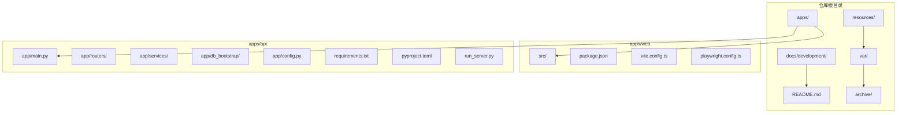
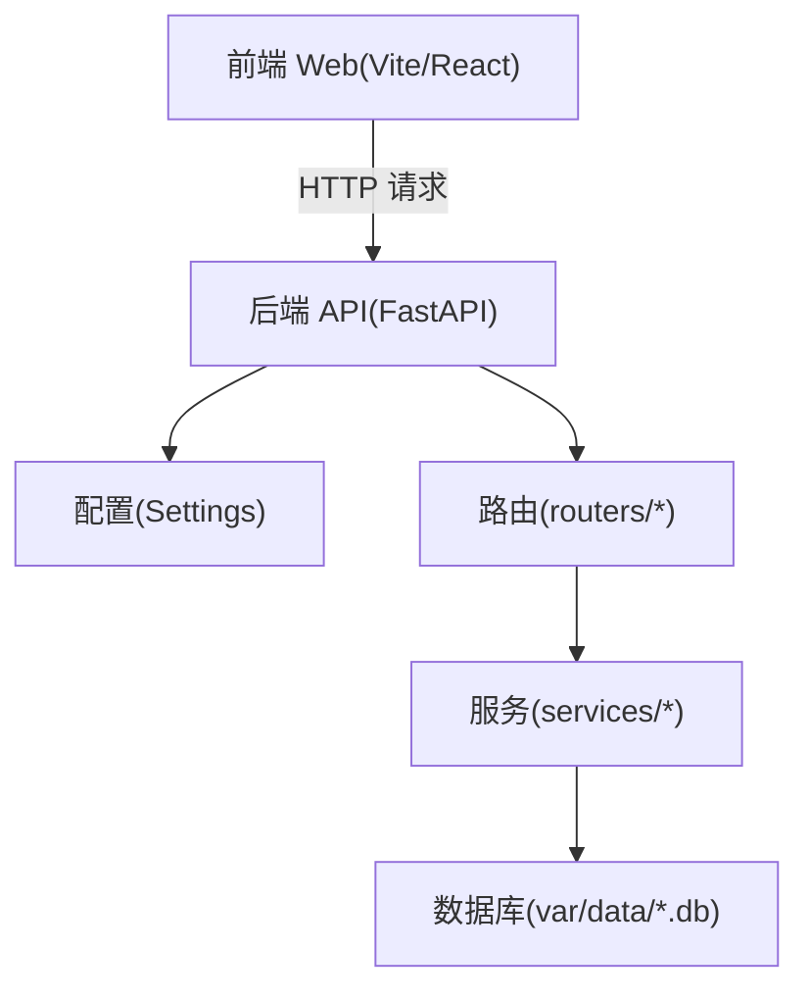
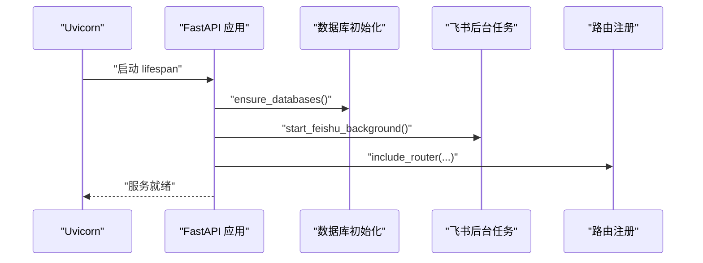
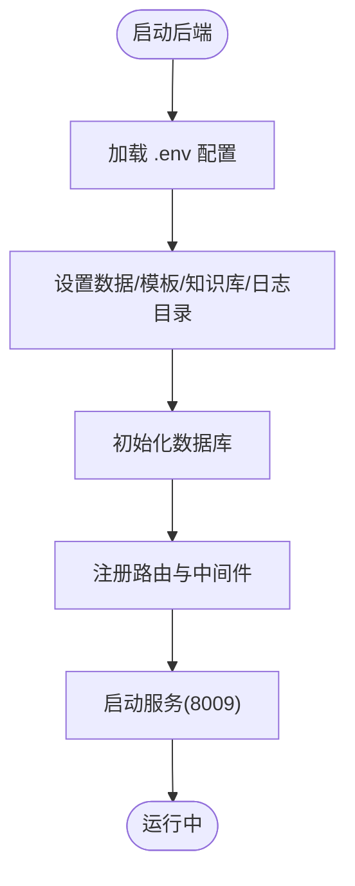
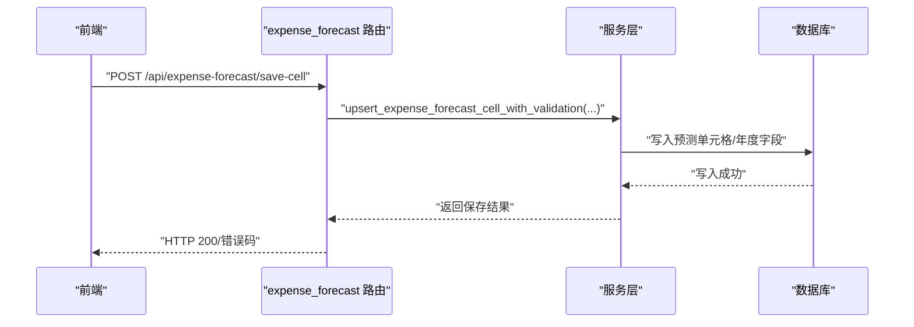
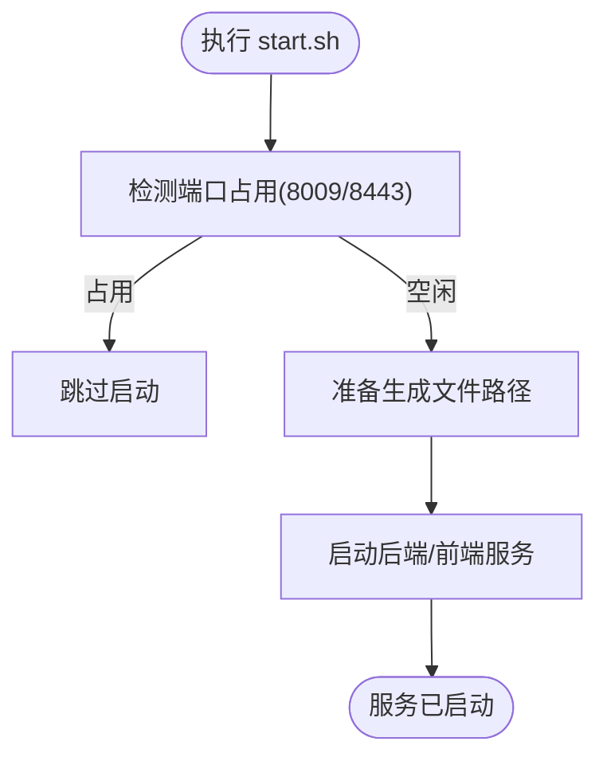

# 开发指南

<cite>
**本文引用的文件**   
- [README.md](file://README.md)
- [docs/development/README.md](file://docs/development/README.md)
- [docs/development/repo-layout.md](file://docs/development/repo-layout.md)
- [docs/development/release-packaging.md](file://docs/development/release-packaging.md)
- [docs/development/current-system-map.md](file://docs/development/current-system-map.md)
- [apps/api/pyproject.toml](file://apps/api/pyproject.toml)
- [apps/api/requirements.txt](file://apps/api/requirements.txt)
- [apps/api/run_server.py](file://apps/api/run_server.py)
- [apps/api/app/main.py](file://apps/api/app/main.py)
- [apps/api/app/config.py](file://apps/api/app/config.py)
- [apps/api/app/routers/expense_forecast.py](file://apps/api/app/routers/expense_forecast.py)
- [start.sh](file://start.sh)
</cite>

## 目录
1. [简介](#简介)
2. [项目结构](#项目结构)
3. [核心组件](#核心组件)
4. [架构总览](#架构总览)
5. [详细组件分析](#详细组件分析)
6. [依赖分析](#依赖分析)
7. [性能考虑](#性能考虑)
8. [故障排查指南](#故障排查指南)
9. [结论](#结论)
10. [附录](#附录)

## 简介
本指南面向智能预算预测系统的开发团队，提供从环境搭建、代码规范、Git 工作流、分支策略、代码审查、模块划分原则、依赖与版本控制、发布流程、质量保障、调试与性能优化，到团队协作与沟通流程的完整开发手册。文档以仓库内的开发文档与配置为依据，确保新成员快速上手、老成员高效协作。

## 项目结构
- 采用 monorepo 结构，按职责划分为前端、后端、受控资源、本地运行状态与历史归档。
- 核心入口与约定：
  - 前端：apps/web（Vite + React）
  - 后端：apps/api（FastAPI 应用、路由、服务、数据库初始化与脚本）
  - 受控资源：resources（知识库、模板、业务输入）
  - 本地运行：var（数据库、日志、输出、pid）
  - 历史归档：archive（交付包、release、runtime 快照、团队提交）

**章节来源**
- [README.md:1-62](file://README.md#L1-L62)
- [docs/development/README.md:1-25](file://docs/development/README.md#L1-L25)

## 核心组件
- 后端应用入口与生命周期：FastAPI 应用在应用生命周期中完成数据库初始化、飞书机器人后台任务启动、路由注册与中间件装配。
- 配置体系：通过 Pydantic Settings 加载 .env，集中管理数据目录、模板目录、知识库目录、CORS、DeepSeek 接口等。
- 路由与服务：路由层负责 HTTP 接口与参数适配，服务层承载业务逻辑、数据读写、导出与报表生成。
- 预测模块：费用预测路由与服务模块清晰分离，包含视图读模型、规则定义与导入、重算与追踪等。

**章节来源**
- [apps/api/app/main.py:1-412](file://apps/api/app/main.py#L1-L412)
- [apps/api/app/config.py:1-41](file://apps/api/app/config.py#L1-L41)
- [apps/api/app/routers/expense_forecast.py:1-200](file://apps/api/app/routers/expense_forecast.py#L1-L200)

## 架构总览
系统采用前后端分离的微单体架构：
- 前端通过统一 API 客户端调用后端路由，路由将请求转交给服务层，服务层与数据库交互并返回响应。
- 后端通过配置模块加载运行时目录与环境变量，路由层按模块注册，服务层按领域拆分（预算、预测、报表、系统等）。

**图表来源**
- [apps/api/app/main.py:109-412](file://apps/api/app/main.py#L109-L412)
- [apps/api/app/config.py:9-41](file://apps/api/app/config.py#L9-L41)

**章节来源**
- [docs/development/current-system-map.md:141-171](file://docs/development/current-system-map.md#L141-L171)

## 详细组件分析

### 后端应用入口与生命周期
- 应用生命周期：启动时执行数据库初始化与飞书机器人后台任务注册，结束时释放资源。
- 中间件：CORS 中间件按配置允许来源，认证中间件在 HTTP 流程中进行会话加载与权限校验。
- 路由注册：按模块注册认证、版本快照、预算、预测、报表、图表、系统管理等路由。

**图表来源**
- [apps/api/app/main.py:102-119](file://apps/api/app/main.py#L102-L119)
- [apps/api/app/main.py:109-412](file://apps/api/app/main.py#L109-L412)

**章节来源**
- [apps/api/app/main.py:102-119](file://apps/api/app/main.py#L102-L119)
- [apps/api/app/main.py:109-412](file://apps/api/app/main.py#L109-L412)

### 配置与运行参数
- 配置来源：.env 文件，集中管理数据目录、模板目录、知识库目录、CORS、DeepSeek 接口、飞书机器人等。
- 运行参数：run_server.py 支持主机、端口与热重载参数，默认后端端口为 8009。

**图表来源**
- [apps/api/app/config.py:9-41](file://apps/api/app/config.py#L9-L41)
- [apps/api/run_server.py:8-35](file://apps/api/run_server.py#L8-L35)

**章节来源**
- [apps/api/app/config.py:9-41](file://apps/api/app/config.py#L9-L41)
- [apps/api/run_server.py:8-35](file://apps/api/run_server.py#L8-L35)

### 费用预测模块（路由与服务）
- 路由职责：提供预测视图、单元格保存、导入导出、规则 CRUD、复制与重算等接口。
- 服务职责：视图读模型、元数据、导入解析与预览、应用写入、规则保存与导入、重算与追踪等。
- 数据契约：当前预测模块以 expense_forecast_* 表为核心，拒绝旧 driver 合同，统一使用 METRIC_EXPR 等当前契约。

**图表来源**
- [apps/api/app/routers/expense_forecast.py:1-200](file://apps/api/app/routers/expense_forecast.py#L1-L200)

**章节来源**
- [apps/api/app/routers/expense_forecast.py:1-200](file://apps/api/app/routers/expense_forecast.py#L1-L200)
- [docs/development/current-system-map.md:90-91](file://docs/development/current-system-map.md#L90-L91)

### 启动与停止脚本
- start.sh：自动准备生成文件路径、检测端口占用、优先使用 screen 会话托管服务，否则使用 nohup 后台运行；默认后端 8009、前端 8443。
- stop.sh：停止 screen 会话并清理孤儿进程。

**图表来源**
- [start.sh:111-156](file://start.sh#L111-L156)
- [start.sh:158-179](file://start.sh#L158-L179)

**章节来源**
- [start.sh:111-156](file://start.sh#L111-L156)
- [start.sh:158-179](file://start.sh#L158-L179)

## 依赖分析
- 后端依赖管理：
  - 依赖声明：pyproject.toml 与 requirements.txt 保持一致，使用 FastAPI、Uvicorn、Pydantic、SQLite、LangGraph、HTTPX、PPT/Word/PDF/图像处理等。
  - 开发依赖：pytest（dev 依赖）。
- 运行时端口与代理：
  - 后端开发端口：8009
  - 前端开发端口：8443
  - 前端 /api 代理固定指向后端 127.0.0.1:8009

**章节来源**
- [apps/api/pyproject.toml:1-33](file://apps/api/pyproject.toml#L1-L33)
- [apps/api/requirements.txt:1-18](file://apps/api/requirements.txt#L1-L18)
- [README.md:40-48](file://README.md#L40-L48)

## 性能考虑
- 启动阶段：
  - 数据库初始化与合同校验在 lifespan 中完成，避免每次请求重复校验。
  - 仅在启动时注册飞书机器人后台任务，减少运行期开销。
- 服务层：
  - 将导出与报表构建下沉到服务层，路由仅做参数适配与响应封装，降低耦合与提升可测试性。
- 前端：
  - 本地代理默认指向 8009；如需临时替换后端，可通过环境变量覆盖代理目标。

**章节来源**
- [apps/api/app/main.py:102-119](file://apps/api/app/main.py#L102-L119)
- [apps/api/app/main.py:274-282](file://apps/api/app/main.py#L274-L282)
- [README.md:139-140](file://README.md#L139-L140)

## 故障排查指南
- 端口占用与服务状态
  - 后端 8009、前端 8443 被占用时，start.sh 会跳过启动；可用 stop.sh 停止或清理占用进程。
- 端到端测试
  - Playwright 默认复用已启动的 8009/8443；如需自启服务，请设置相应环境变量。
- 交付包验证
  - 内部完整运行包与源码审核包分别使用不同验证命令，确保交付物符合门禁规则。

**章节来源**
- [start.sh:43-46](file://start.sh#L43-L46)
- [start.sh:111-117](file://start.sh#L111-L117)
- [README.md:42-48](file://README.md#L42-L48)
- [docs/development/release-packaging.md:31-35](file://docs/development/release-packaging.md#L31-L35)
- [docs/development/release-packaging.md:48-52](file://docs/development/release-packaging.md#L48-L52)

## 结论
本指南基于仓库内的开发文档与配置，明确了项目结构、模块职责、运行与发布流程、质量保障与故障排查要点。建议在开发过程中始终遵循工作树清单、目录布局与交付包规则，确保代码与运行库的一致性与可交付性。

## 附录

### A. 开发环境搭建与常用命令
- 安装依赖与启动
  - 前端：npm install → npm run dev（端口 8443）
  - 后端：python3 run_server.py（端口 8009）
  - 一键启动：bash start.sh
- 验证与测试
  - 验证交付包：npm run verify:delivery / npm run verify:delivery:source
  - 端到端测试：npx playwright test full-user-journey.spec.ts

**章节来源**
- [README.md:23-48](file://README.md#L23-L48)
- [start.sh:164-179](file://start.sh#L164-L179)

### B. 代码规范与最佳实践
- 目录与职责
  - 新功能代码放入 apps/web 或 apps/api；受控资源放入 resources；文档放入 docs；运行状态放入 var；历史归档放入 archive。
- 工作树与归档
  - 新增文件需同步更新相关清单文件；归档或删除文档需从清单移除。
- 前后端契约
  - 前端通过统一 API 客户端调用后端路由，页面组件不直接拼接后端路径。

**章节来源**
- [docs/development/repo-layout.md:77-85](file://docs/development/repo-layout.md#L77-L85)
- [docs/development/README.md:19-25](file://docs/development/README.md#L19-L25)
- [docs/development/current-system-map.md:135-136](file://docs/development/current-system-map.md#L135-L136)

### C. Git 工作流程、分支策略与代码审查
- 工作树与清单
  - 以 active-worktree-manifest.md、repo-layout.md、current-system-map.md 为依据，确保当前开发入口与历史隔离。
- 分支与提交
  - 以 docs/development/README.md 中的文档清单为准，新增或归档文档需同步更新清单。
- 代码审查
  - 交付前执行交付门禁验证，确保内部运行包与源码审核包符合规则。

**章节来源**
- [docs/development/README.md:7-18](file://docs/development/README.md#L7-L18)
- [docs/development/repo-layout.md:34-35](file://docs/development/repo-layout.md#L34-L35)
- [docs/development/release-packaging.md:3-11](file://docs/development/release-packaging.md#L3-L11)

### D. 依赖管理、版本控制与发布流程
- 依赖声明
  - 后端依赖在 pyproject.toml 与 requirements.txt 中声明，开发依赖为 pytest。
- 版本与运行库
  - live 数据目录仅允许 var/data/；apps/var/data/ 属于重复数据目录，需清理。
- 发布包
  - 内部完整运行包包含后端配置、live 数据、前端构建产物与受控资源；源码审核包排除运行资产。

**章节来源**
- [apps/api/pyproject.toml:6-29](file://apps/api/pyproject.toml#L6-L29)
- [apps/api/requirements.txt:1-18](file://apps/api/requirements.txt#L1-18)
- [docs/development/release-packaging.md:14-30](file://docs/development/release-packaging.md#L14-L30)
- [docs/development/release-packaging.md:39-47](file://docs/development/release-packaging.md#L39-L47)
- [docs/development/release-packaging.md:54-57](file://docs/development/release-packaging.md#L54-L57)

### E. 代码质量保证与静态分析
- 静态门禁
  - 交付包验证脚本确保包内容符合内部运行包与源码审核包规则。
- 建议
  - 在 CI 中集成交付门禁与前端构建/类型检查；对后端使用 pytest 进行单元测试与集成测试。

**章节来源**
- [docs/development/release-packaging.md:31-35](file://docs/development/release-packaging.md#L31-L35)
- [docs/development/release-packaging.md:48-52](file://docs/development/release-packaging.md#L48-L52)

### F. 新功能开发与现有功能修改指导
- 新功能开发
  - 前端：在 apps/web/src/lib/*Api.ts 中新增 API 客户端，在 pages 中调用；组件不直接拼接后端路径。
  - 后端：在 app/routers/* 中新增路由，在 app/services/* 中实现业务逻辑，必要时在 app/db_bootstrap/* 中新增建库脚本。
- 现有功能修改
  - 修改前先查阅 current-system-map.md 与相关服务/路由文件，确保不破坏当前契约与运行库一致性。

**章节来源**
- [docs/development/current-system-map.md:135-136](file://docs/development/current-system-map.md#L135-L136)
- [docs/development/current-system-map.md:141-171](file://docs/development/current-system-map.md#L141-L171)

### G. 调试技巧、性能优化与问题排查
- 调试
  - 后端支持热重载（run_server.py --reload），便于快速迭代。
  - 前端本地代理默认指向 8009；如需临时替换后端，可通过环境变量覆盖代理目标。
- 性能
  - 将导出与报表构建下沉到服务层，减少路由层负担；启动阶段完成初始化与校验。
- 排查
  - 使用 start.sh/stop.sh 管理服务；Playwright 复用已启动服务；交付包验证确保合规。

**章节来源**
- [apps/api/run_server.py:12-13](file://apps/api/run_server.py#L12-L13)
- [README.md:139-140](file://README.md#L139-L140)
- [start.sh:111-156](file://start.sh#L111-L156)
- [README.md:42-48](file://README.md#L42-L48)

### H. 团队协作规范与沟通流程
- 协作规则
  - 仅在 apps/web 与 apps/api 开发；受控资源放入 resources；本地运行状态放入 var；历史归档放入 archive。
  - 新增目录或职责变化时，同步更新 repo-layout.md；业务口径变化时同步更新 CONTEXT.md 与 current-system-map.md。
- 文档维护
  - 开发文档清单以 active-worktree-manifest.md 为准；新增或归档文档需同步更新清单。

**章节来源**
- [README.md:52-62](file://README.md#L52-L62)
- [docs/development/README.md:19-25](file://docs/development/README.md#L19-L25)
- [docs/development/repo-layout.md:30-35](file://docs/development/repo-layout.md#L30-L35)