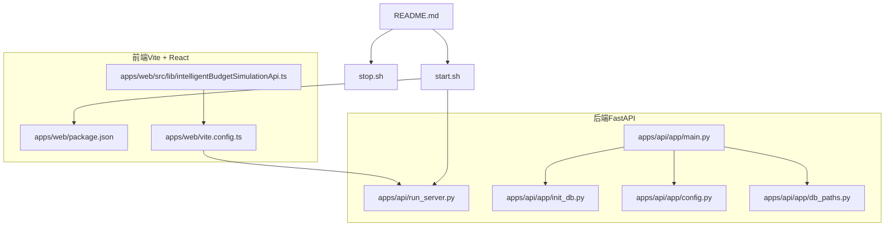
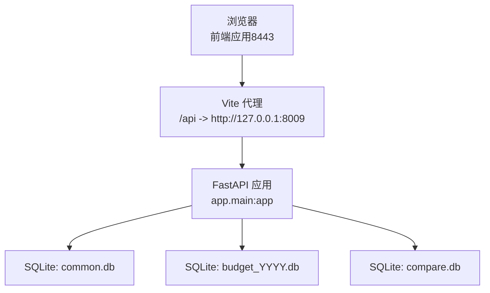
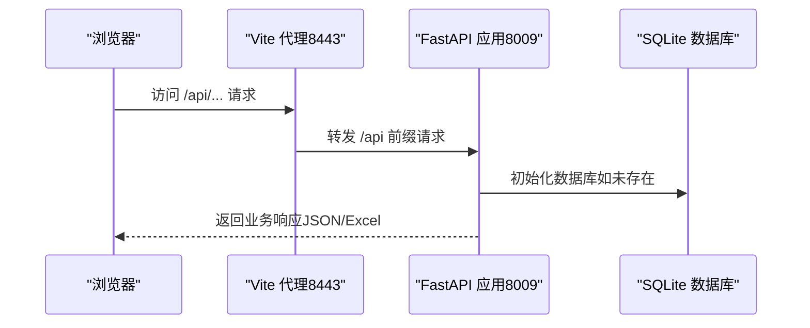
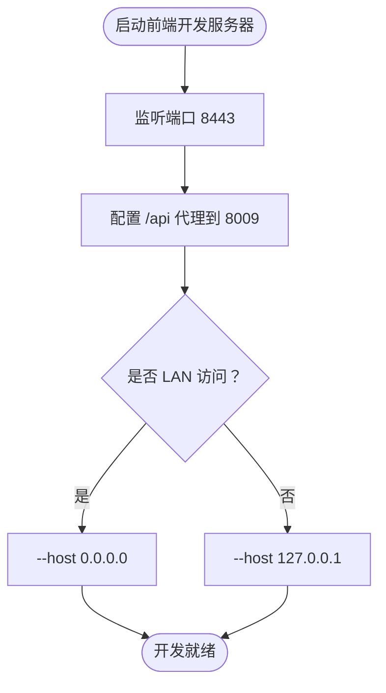
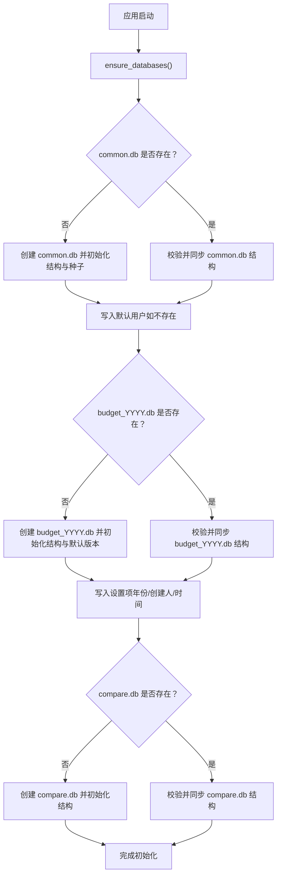
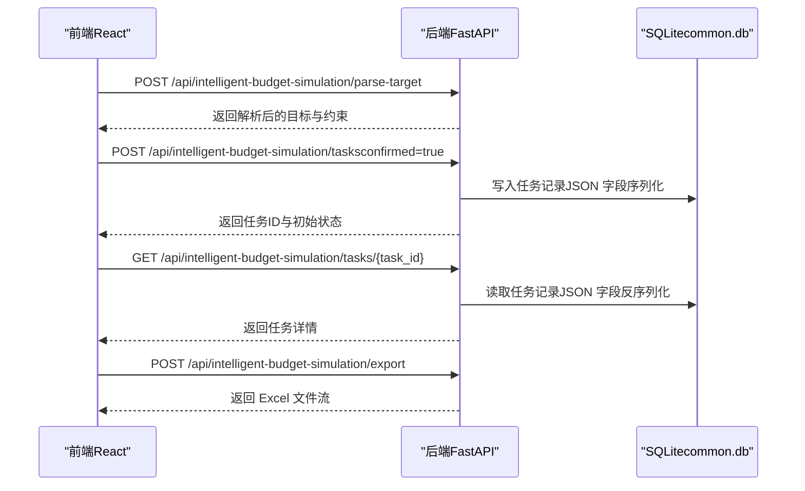
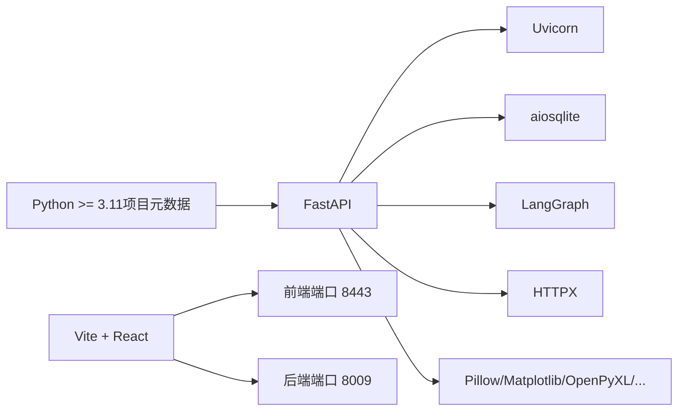

# 快速开始

<cite>
**本文引用的文件**
- [README.md](file://README.md)
- [start.sh](file://start.sh)
- [stop.sh](file://stop.sh)
- [apps/api/pyproject.toml](file://apps/api/pyproject.toml)
- [apps/api/requirements.txt](file://apps/api/requirements.txt)
- [apps/api/run_server.py](file://apps/api/run_server.py)
- [apps/api/app/main.py](file://apps/api/app/main.py)
- [apps/api/app/init_db.py](file://apps/api/app/init_db.py)
- [apps/api/app/config.py](file://apps/api/app/config.py)
- [apps/api/app/db_paths.py](file://apps/api/app/db_paths.py)
- [apps/api/app/routers/intelligent_budget_simulation.py](file://apps/api/app/routers/intelligent_budget_simulation.py)
- [apps/web/package.json](file://apps/web/package.json)
- [apps/web/vite.config.ts](file://apps/web/vite.config.ts)
- [apps/web/src/lib/intelligentBudgetSimulationApi.ts](file://apps/web/src/lib/intelligentBudgetSimulationApi.ts)
</cite>

## 目录
1. [简介](#简介)
2. [项目结构](#项目结构)
3. [核心组件](#核心组件)
4. [架构总览](#架构总览)
5. [详细组件分析](#详细组件分析)
6. [依赖关系分析](#依赖关系分析)
7. [性能注意事项](#性能注意事项)
8. [故障排除指南](#故障排除指南)
9. [结论](#结论)
10. [附录](#附录)

## 简介
本指南面向首次接触“智能预算预测系统”的用户，帮助你在最短时间内完成环境准备、依赖安装、数据库初始化与前后端服务启动，并掌握预算预测与智能模拟等核心功能的基本使用路径。系统采用前后端分离架构：后端基于 FastAPI 提供 REST API，前端基于 Vite + React 提供交互界面；默认端口为前端 8443、后端 8009；前端通过代理将 /api 请求转发至后端。

## 项目结构
- 后端（FastAPI）位于 apps/api，包含应用入口、路由、服务层、数据库初始化与配置。
- 前端（Vite + React）位于 apps/web，包含页面组件、API 客户端与构建配置。
- 根目录提供一键启动/停止脚本，统一管理前后端服务与日志输出。

图表来源
- [apps/api/app/main.py:109-412](file://apps/api/app/main.py#L109-L412)
- [apps/api/run_server.py:16-35](file://apps/api/run_server.py#L16-L35)
- [apps/api/app/init_db.py:142-290](file://apps/api/app/init_db.py#L142-L290)
- [apps/api/app/config.py:9-41](file://apps/api/app/config.py#L9-L41)
- [apps/api/app/db_paths.py:6-29](file://apps/api/app/db_paths.py#L6-L29)
- [apps/web/package.json:6-14](file://apps/web/package.json#L6-L14)
- [apps/web/vite.config.ts:5-22](file://apps/web/vite.config.ts#L5-L22)
- [apps/web/src/lib/intelligentBudgetSimulationApi.ts:55-80](file://apps/web/src/lib/intelligentBudgetSimulationApi.ts#L55-L80)
- [README.md:35-48](file://README.md#L35-L48)
- [start.sh:120-179](file://start.sh#L120-L179)
- [stop.sh:113-122](file://stop.sh#L113-L122)

章节来源
- [README.md:7-40](file://README.md#L7-L40)
- [start.sh:1-188](file://start.sh#L1-L188)
- [stop.sh:1-122](file://stop.sh#L1-L122)

## 核心组件
- 后端服务（FastAPI）
  - 应用入口与生命周期：在应用启动时执行数据库初始化与后台任务注册。
  - 路由组织：包含预算模拟、预算执行、费用预测、报表导出等路由模块。
  - 配置中心：集中管理数据目录、CORS、DeepSeek 接入参数等。
- 前端应用（Vite + React）
  - 开发服务器：默认监听 8443，支持局域网访问。
  - 代理配置：将 /api 前缀请求转发至后端 8009。
  - 功能接口：提供智能预算模拟的解析、任务创建、查询与导出等 API 封装。
- 数据库
  - 初始化策略：按需创建 common.db、budget_YYYY.db、compare.db，并填充基础表结构与种子数据。
  - 存储位置：默认位于 var/data 目录下，可通过配置调整。

章节来源
- [apps/api/app/main.py:102-118](file://apps/api/app/main.py#L102-L118)
- [apps/api/app/main.py:285-327](file://apps/api/app/main.py#L285-L327)
- [apps/api/app/config.py:14-26](file://apps/api/app/config.py#L14-L26)
- [apps/api/app/init_db.py:142-290](file://apps/api/app/init_db.py#L142-L290)
- [apps/web/vite.config.ts:5-22](file://apps/web/vite.config.ts#L5-L22)
- [apps/web/src/lib/intelligentBudgetSimulationApi.ts:55-80](file://apps/web/src/lib/intelligentBudgetSimulationApi.ts#L55-L80)

## 架构总览
系统采用前后端分离架构，前端通过代理将 API 请求转发到后端；后端负责业务逻辑与数据库操作；数据库采用 SQLite，按年份分库存储预算事实与版本信息。

图表来源
- [apps/web/vite.config.ts:17-19](file://apps/web/vite.config.ts#L17-L19)
- [apps/api/app/main.py:109-118](file://apps/api/app/main.py#L109-L118)
- [apps/api/app/db_paths.py:6-16](file://apps/api/app/db_paths.py#L6-L16)

## 详细组件分析

### 后端服务（FastAPI）
- 启动方式
  - 使用 run_server.py 启动 Uvicorn，默认监听 8009，支持 --host/--port/--reload 参数。
  - 支持通过 Python 解释器或 uv 工具运行，优先使用虚拟环境中的解释器。
- 生命周期与数据库初始化
  - 应用启动时调用 ensure_databases，确保 common.db、budget_YYYY.db、compare.db 存在并具备必要表结构。
  - 初始化内容包括：表结构、种子数据、版本信息、BI 映射、预算读模型等。
- 路由与功能
  - 包含健康检查、模板、预算模拟、预算执行、费用预测、报表导出、系统管理等路由。
  - 智能预算模拟路由提供目标解析、任务创建、任务查询与结果导出。

图表来源
- [apps/api/run_server.py:29](file://apps/api/run_server.py#L29)
- [apps/api/app/main.py:102-106](file://apps/api/app/main.py#L102-L106)
- [apps/api/app/init_db.py:142-290](file://apps/api/app/init_db.py#L142-L290)

章节来源
- [apps/api/run_server.py:8-35](file://apps/api/run_server.py#L8-L35)
- [apps/api/app/main.py:102-118](file://apps/api/app/main.py#L102-L118)
- [apps/api/app/init_db.py:142-290](file://apps/api/app/init_db.py#L142-L290)

### 前端应用（Vite + React）
- 开发与构建
  - 开发模式：npm run dev，监听 8443，支持 --host 与局域网访问。
  - 构建与预览：npm run build 与 npm run preview。
- 代理配置
  - 将 /api 前缀代理到后端 8009，默认目标地址可由环境变量覆盖。
- 智能预算模拟 API
  - 提供目标解析、任务创建、任务查询、结果导出等接口封装，便于前端直接调用。

图表来源
- [apps/web/package.json:6-14](file://apps/web/package.json#L6-L14)
- [apps/web/vite.config.ts:5-22](file://apps/web/vite.config.ts#L5-L22)

章节来源
- [apps/web/package.json:6-14](file://apps/web/package.json#L6-L14)
- [apps/web/vite.config.ts:5-22](file://apps/web/vite.config.ts#L5-L22)
- [apps/web/src/lib/intelligentBudgetSimulationApi.ts:55-80](file://apps/web/src/lib/intelligentBudgetSimulationApi.ts#L55-L80)

### 数据库初始化流程
- 触发时机：应用启动时自动执行 ensure_databases。
- 初始化内容：
  - common.db：通用表结构、BI 映射、预算输出显示项、组织产品度量、运行时指标身份、智能报告等。
  - budget_YYYY.db：预算版本、预算数据事实表、预算读模型、设置项（年份、创建人、创建时间）。
  - compare.db：对比读模型。
- 种子数据：周期种子、默认智能 PPT 模板等。
- 同步与校验：对现有数据库进行结构同步、触发器与读模型重建、预算事实表校验等。

图表来源
- [apps/api/app/init_db.py:142-290](file://apps/api/app/init_db.py#L142-L290)
- [apps/api/app/db_paths.py:6-16](file://apps/api/app/db_paths.py#L6-L16)

章节来源
- [apps/api/app/init_db.py:142-290](file://apps/api/app/init_db.py#L142-L290)
- [apps/api/app/db_paths.py:6-16](file://apps/api/app/db_paths.py#L6-L16)

### 智能预算模拟（核心功能）
- 功能概述
  - 目标解析：将领导输入的目标文本解析为结构化目标与约束。
  - 任务创建：基于解析结果进行求解，生成多套方案与建议。
  - 任务查询：根据任务 ID 获取任务状态与结果。
  - 导出结果：将任务结果导出为 Excel 报告。
- 前端调用链
  - 目标解析 → 创建任务 → 查询任务 → 导出任务。

图表来源
- [apps/api/app/routers/intelligent_budget_simulation.py:129-177](file://apps/api/app/routers/intelligent_budget_simulation.py#L129-L177)
- [apps/web/src/lib/intelligentBudgetSimulationApi.ts:55-80](file://apps/web/src/lib/intelligentBudgetSimulationApi.ts#L55-L80)

章节来源
- [apps/api/app/routers/intelligent_budget_simulation.py:116-178](file://apps/api/app/routers/intelligent_budget_simulation.py#L116-L178)
- [apps/web/src/lib/intelligentBudgetSimulationApi.ts:55-80](file://apps/web/src/lib/intelligentBudgetSimulationApi.ts#L55-L80)

## 依赖关系分析
- 后端依赖
  - Python 版本要求：>=3.11（项目元数据声明）。
  - 关键依赖：FastAPI、Uvicorn、aiosqlite、Pydantic、LangGraph、HTTPX、Pillow、Matplotlib、OpenPyXL、python-docx、PyPDF、python-pptx、飞书 SDK 等。
- 前端依赖
  - React 生态、Vite、TailwindCSS、TypeScript、Playwright（测试）等。
- 端口与代理
  - 前端：8443；后端：8009；前端代理将 /api 转发至后端。

图表来源
- [apps/api/pyproject.toml:5-24](file://apps/api/pyproject.toml#L5-L24)
- [apps/api/requirements.txt:1-18](file://apps/api/requirements.txt#L1-L18)
- [apps/web/package.json:15-32](file://apps/web/package.json#L15-L32)
- [apps/web/vite.config.ts:5-22](file://apps/web/vite.config.ts#L5-L22)

章节来源
- [apps/api/pyproject.toml:5-24](file://apps/api/pyproject.toml#L5-L24)
- [apps/api/requirements.txt:1-18](file://apps/api/requirements.txt#L1-18)
- [apps/web/package.json:15-32](file://apps/web/package.json#L15-L32)
- [apps/web/vite.config.ts:5-22](file://apps/web/vite.config.ts#L5-L22)

## 性能注意事项
- 数据库规模：预算与对比数据库按年份分库，避免单库过大；定期清理与归档历史数据。
- 代理与网络：前端代理仅用于开发场景，生产环境建议通过反向代理统一处理跨域与静态资源。
- 日志与监控：后端日志输出至 var/logs，建议结合系统日志工具进行聚合与告警。
- 缓存与并发：后端服务默认单实例，若需高可用，请结合反向代理与容器编排方案。

## 故障排除指南
- 端口占用
  - 若 8443 或 8009 被占用，启动脚本会提示“已在使用”，请释放端口或修改脚本中的端口配置。
- 依赖缺失
  - 后端：确保 Python 版本满足 >=3.11；推荐使用虚拟环境或 uv 工具运行。
  - 前端：首次启动可能需要安装依赖，脚本会自动检测并安装。
- CORS 与代理
  - 前端代理默认指向 127.0.0.1:8009；若后端不在本机，请设置环境变量覆盖代理目标。
  - 后端 CORS 默认允许前端 8443 访问，若跨域异常，请检查配置中的 CORS 来源列表。
- 数据库初始化失败
  - 确认 var/data 目录可写；若权限不足，修改目录权限或调整配置中的 data_dir。
  - 如需重置数据库，可删除相关 .db 文件后重启服务，系统会重新初始化。
- 服务启动/停止
  - 使用 start.sh 启动，stop.sh 停止；脚本会尝试通过 screen 会话托管服务，若无 screen 则使用前台进程并记录 PID。

章节来源
- [start.sh:43-46](file://start.sh#L43-L46)
- [start.sh:115-117](file://start.sh#L115-L117)
- [apps/web/vite.config.ts:5-22](file://apps/web/vite.config.ts#L5-L22)
- [apps/api/app/config.py:21-23](file://apps/api/app/config.py#L21-L23)
- [apps/api/app/init_db.py:142-147](file://apps/api/app/init_db.py#L142-L147)
- [stop.sh:80-111](file://stop.sh#L80-L111)

## 结论
通过本指南，你可以在本地快速完成环境准备、依赖安装、数据库初始化与前后端服务启动，并掌握预算预测与智能模拟的核心使用流程。遇到问题时，可依据“故障排除指南”逐步定位与解决。建议在正式环境中进一步完善反向代理、安全与监控配置，以满足生产需求。

## 附录

### 环境要求与安装步骤
- 环境要求
  - Python：>=3.11（项目元数据声明）
  - Node.js：用于前端开发与构建
  - SQLite：随系统或通过依赖安装（aiosqlite）
- 依赖安装
  - 后端：使用 Python 虚拟环境或 uv 工具运行项目；后端依赖在 pyproject.toml 与 requirements.txt 中定义。
  - 前端：根目录执行 npm install 安装依赖。
- 数据库初始化
  - 启动后端服务后，系统会在 var/data 目录下自动生成 common.db、budget_YYYY.db、compare.db，并填充基础结构与种子数据。

章节来源
- [apps/api/pyproject.toml:5](file://apps/api/pyproject.toml#L5)
- [apps/api/requirements.txt:1-18](file://apps/api/requirements.txt#L1-L18)
- [apps/api/app/init_db.py:142-290](file://apps/api/app/init_db.py#L142-L290)

### 启动与停止
- 启动
  - 使用 start.sh 一键启动前后端服务；脚本会自动处理依赖安装、端口占用检测与日志输出。
  - 或分别启动：后端 run_server.py（默认 8009），前端 npm run dev（默认 8443）。
- 停止
  - 使用 stop.sh 停止服务并清理端口监听。

章节来源
- [start.sh:120-179](file://start.sh#L120-L179)
- [stop.sh:113-122](file://stop.sh#L113-L122)

### 端口与代理配置
- 固定端口
  - 前端：8443
  - 后端：8009
- 代理设置
  - 前端将 /api 代理到后端 8009；可通过环境变量覆盖代理目标地址。

章节来源
- [README.md:40](file://README.md#L40)
- [apps/web/vite.config.ts:5-22](file://apps/web/vite.config.ts#L5-L22)

### 基本使用示例（预算预测与智能模拟）
- 打开前端：访问 http://127.0.0.1:8443
- 目标解析：调用智能预算模拟 API 的目标解析接口，输入领导目标文本。
- 创建任务：确认解析结果后创建任务，系统将生成多套方案。
- 查询任务：根据返回的任务 ID 查询任务详情。
- 导出结果：将任务结果导出为 Excel 报告。

章节来源
- [apps/web/src/lib/intelligentBudgetSimulationApi.ts:55-80](file://apps/web/src/lib/intelligentBudgetSimulationApi.ts#L55-L80)
- [apps/api/app/routers/intelligent_budget_simulation.py:129-177](file://apps/api/app/routers/intelligent_budget_simulation.py#L129-L177)