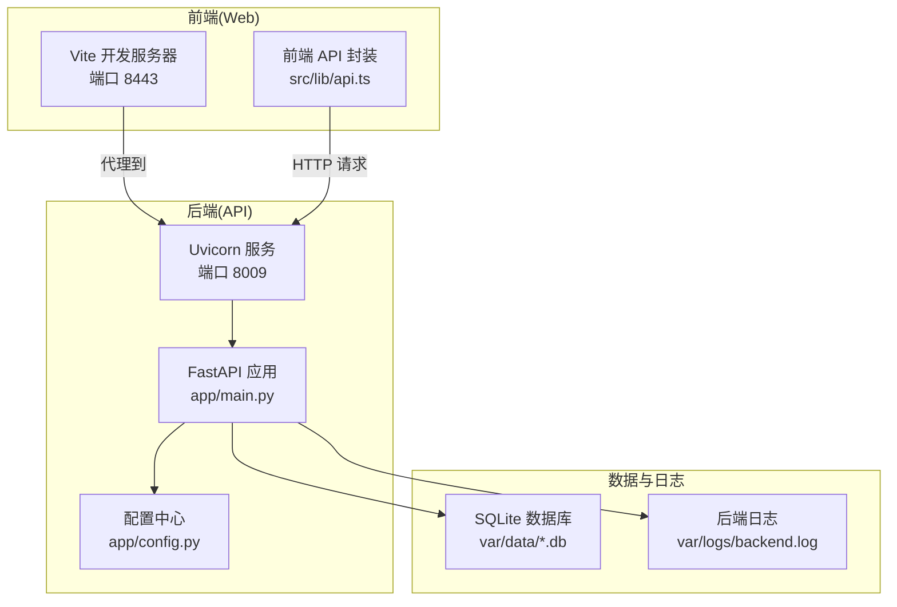
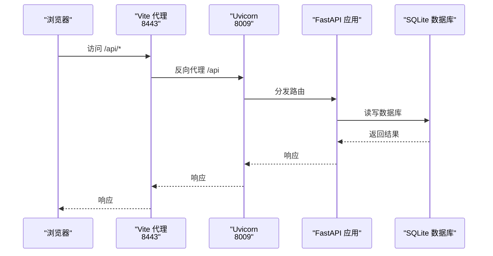
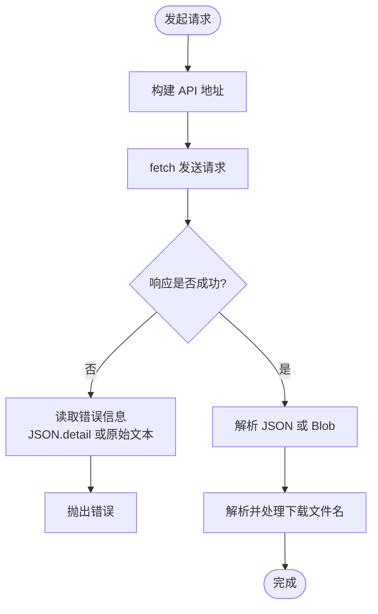
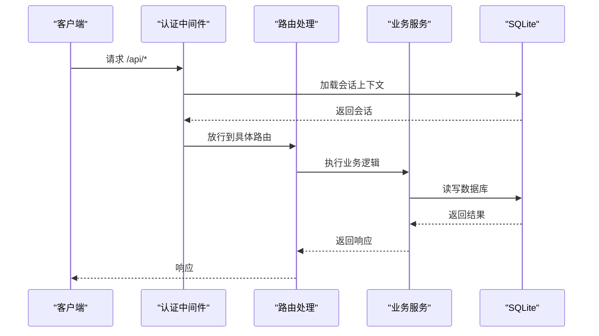
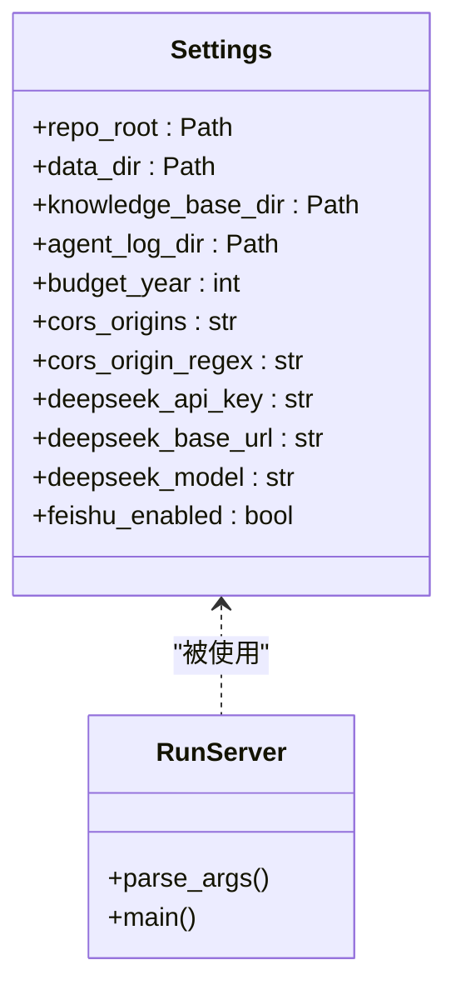
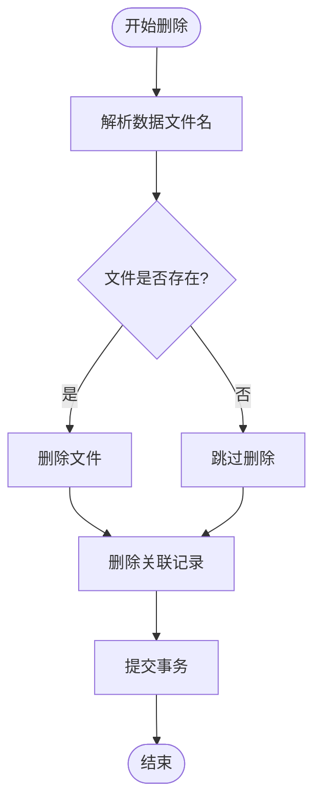
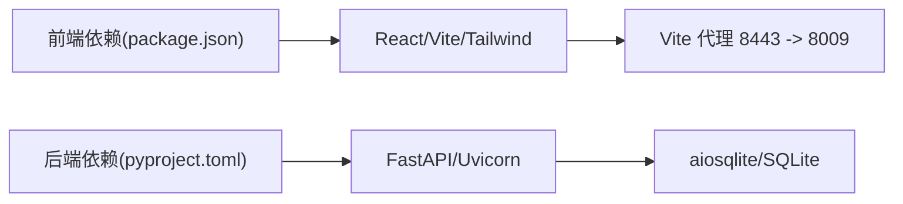

# 故障排除与常见问题

<cite>
**本文引用的文件**
- [apps/api/app/main.py](file://apps/api/app/main.py)
- [apps/api/app/config.py](file://apps/api/app/config.py)
- [apps/api/run_server.py](file://apps/api/run_server.py)
- [apps/api/pyproject.toml](file://apps/api/pyproject.toml)
- [apps/web/vite.config.ts](file://apps/web/vite.config.ts)
- [apps/web/package.json](file://apps/web/package.json)
- [apps/web/src/lib/api.ts](file://apps/web/src/lib/api.ts)
- [var/logs/backend.log](file://var/logs/backend.log)
- [apps/api/app/audit.py](file://apps/api/app/audit.py)
- [apps/api/app/services/system_catalog.py](file://apps/api/app/services/system_catalog.py)
- [apps/web/src/app/components/ConfigSystemContent.tsx](file://apps/web/src/app/components/ConfigSystemContent.tsx)
</cite>

## 目录
1. [简介](#简介)
2. [项目结构](#项目结构)
3. [核心组件](#核心组件)
4. [架构总览](#架构总览)
5. [详细组件分析](#详细组件分析)
6. [依赖关系分析](#依赖关系分析)
7. [性能考虑](#性能考虑)
8. [故障排除指南](#故障排除指南)
9. [结论](#结论)
10. [附录](#附录)

## 简介
本文件为“智能预算预测系统”的故障排除与常见问题解答文档，覆盖安装与配置、运行时错误、性能问题、功能异常、日志分析、网络与数据库连接、前端渲染与浏览器兼容性、以及技术支持与反馈流程。内容基于仓库中的实际代码与日志进行归纳总结，帮助用户快速定位与解决问题。

## 项目结构
系统采用前后端分离架构：
- 前端：React + Vite，通过代理访问后端 API，默认端口 8443，代理目标默认指向 127.0.0.1:8009。
- 后端：FastAPI + Uvicorn，提供预算相关接口，内置健康检查、会话认证、审计日志等能力。
- 数据与日志：SQLite 数据库存储于 var/data，日志位于 var/logs。

图表来源
- [apps/web/vite.config.ts:1-22](file://apps/web/vite.config.ts#L1-L22)
- [apps/api/app/main.py:109-119](file://apps/api/app/main.py#L109-L119)
- [apps/api/app/config.py:1-41](file://apps/api/app/config.py#L1-L41)
- [var/logs/backend.log:1-120](file://var/logs/backend.log#L1-L120)

章节来源
- [apps/web/vite.config.ts:1-22](file://apps/web/vite.config.ts#L1-L22)
- [apps/api/app/main.py:109-119](file://apps/api/app/main.py#L109-L119)
- [apps/api/app/config.py:1-41](file://apps/api/app/config.py#L1-L41)
- [apps/web/package.json:1-34](file://apps/web/package.json#L1-L34)
- [apps/api/run_server.py:1-35](file://apps/api/run_server.py#L1-L35)

## 核心组件
- 前端 API 封装：统一构建请求地址、读取错误消息、处理下载文件名与二进制响应。
- 后端应用：注册路由、中间件、CORS、会话认证、审计日志写入。
- 配置中心：管理数据目录、知识库路径、跨域策略、DeepSeek 接口参数等。
- 日志系统：后端日志记录请求、认证状态、错误堆栈与数据库锁异常。

章节来源
- [apps/web/src/lib/api.ts:1-132](file://apps/web/src/lib/api.ts#L1-L132)
- [apps/api/app/main.py:109-119](file://apps/api/app/main.py#L109-L119)
- [apps/api/app/config.py:1-41](file://apps/api/app/config.py#L1-L41)
- [apps/api/app/audit.py:1-49](file://apps/api/app/audit.py#L1-L49)
- [var/logs/backend.log:1-120](file://var/logs/backend.log#L1-L120)

## 架构总览
后端启动时执行数据库初始化与后台任务，注册各业务路由，并启用 CORS 与认证中间件。前端通过 Vite 代理将 /api 请求转发至后端，实现本地联调。

图表来源
- [apps/web/vite.config.ts:17-20](file://apps/web/vite.config.ts#L17-L20)
- [apps/api/app/main.py:109-119](file://apps/api/app/main.py#L109-L119)

## 详细组件分析

### 组件一：前端 API 封装与错误处理
- 统一构建 API 地址，支持开发态通过 Vite 代理或生产态自定义基地址。
- 统一读取错误信息，优先解析 JSON 的 detail 字段，否则返回原始文本。
- 支持二进制下载与文件名解析，便于导出报表与模板。

图表来源
- [apps/web/src/lib/api.ts:5-21](file://apps/web/src/lib/api.ts#L5-L21)
- [apps/web/src/lib/api.ts:44-63](file://apps/web/src/lib/api.ts#L44-L63)

章节来源
- [apps/web/src/lib/api.ts:1-132](file://apps/web/src/lib/api.ts#L1-L132)

### 组件二：后端应用与中间件
- 生命周期：启动时确保数据库存在、启动飞书后台任务。
- CORS：根据配置允许来源与正则匹配，支持凭据传递。
- 中间件：认证中间件在请求进入路由前加载会话上下文。
- 审计日志：统一写入 operation_log 表，记录操作类型、影响行数、前后数据等。

图表来源
- [apps/api/app/main.py:109-119](file://apps/api/app/main.py#L109-L119)
- [apps/api/app/main.py:225-230](file://apps/api/app/main.py#L225-L230)
- [apps/api/app/audit.py:17-49](file://apps/api/app/audit.py#L17-L49)

章节来源
- [apps/api/app/main.py:109-119](file://apps/api/app/main.py#L109-L119)
- [apps/api/app/main.py:225-230](file://apps/api/app/main.py#L225-L230)
- [apps/api/app/audit.py:1-49](file://apps/api/app/audit.py#L1-L49)

### 组件三：配置中心与运行参数
- 配置项：数据目录、知识库目录、跨域来源、DeepSeek 接口参数、飞书机器人开关等。
- 运行参数：主机、端口、热重载，Python 版本检查（要求 3.10+）。

图表来源
- [apps/api/app/config.py:9-41](file://apps/api/app/config.py#L9-L41)
- [apps/api/run_server.py:8-30](file://apps/api/run_server.py#L8-L30)

章节来源
- [apps/api/app/config.py:1-41](file://apps/api/app/config.py#L1-L41)
- [apps/api/run_server.py:1-35](file://apps/api/run_server.py#L1-L35)

### 组件四：系统数据库管理与删除流程
- 删除数据库记录时，先解析文件名，再删除对应文件与关联记录，最后提交事务。
- 该流程体现了对 SQLite 外键约束的显式开启与事务一致性保障。

图表来源
- [apps/api/app/services/system_catalog.py:212-223](file://apps/api/app/services/system_catalog.py#L212-L223)

章节来源
- [apps/api/app/services/system_catalog.py:212-223](file://apps/api/app/services/system_catalog.py#L212-L223)

## 依赖关系分析
- 前端依赖：React、Recharts、TailwindCSS、Playwright（测试）、Vite（开发/构建）。
- 后端依赖：FastAPI、Uvicorn、aiosqlite、pydantic、httpx、langgraph 等。
- 代理与端口：前端 8443 代理到后端 8009；后端可通过命令行参数调整主机与端口。

图表来源
- [apps/web/package.json:15-32](file://apps/web/package.json#L15-L32)
- [apps/api/pyproject.toml:6-24](file://apps/api/pyproject.toml#L6-L24)
- [apps/web/vite.config.ts:17-20](file://apps/web/vite.config.ts#L17-L20)

章节来源
- [apps/web/package.json:1-34](file://apps/web/package.json#L1-L34)
- [apps/api/pyproject.toml:1-33](file://apps/api/pyproject.toml#L1-L33)
- [apps/web/vite.config.ts:1-22](file://apps/web/vite.config.ts#L1-L22)

## 性能考虑
- 数据库并发：日志显示 SQLite “database is locked” 异常，通常由并发写入导致。建议：
  - 控制并发写入节奏，避免多线程/多进程同时写库。
  - 使用连接池与事务批处理，减少频繁提交。
  - 对热点表增加索引，降低锁竞争。
- 前端渲染：大表格与图表渲染可能造成卡顿，建议：
  - 虚拟滚动与分页加载。
  - 图表按需渲染，延迟初始化。
- 代理与网络：开发态通过 Vite 代理可避免跨域，生产需正确设置 VITE_API_BASE 与 CORS。

[本节为通用指导，不直接分析具体文件]

## 故障排除指南

### 一、安装与环境问题
- Python 版本不满足要求
  - 现象：启动后提示不支持的 Python 版本。
  - 处理：升级至 3.10+。
  - 参考：[apps/api/run_server.py:17-23](file://apps/api/run_server.py#L17-L23)
- 依赖安装
  - 前端：确保 Node.js 环境可用，执行安装脚本。
  - 后端：使用 uv 或 pip 安装 pyproject.toml 中的依赖。
  - 参考：[apps/web/package.json:6-14](file://apps/web/package.json#L6-L14)、[apps/api/pyproject.toml:1-33](file://apps/api/pyproject.toml#L1-L33)

章节来源
- [apps/api/run_server.py:17-23](file://apps/api/run_server.py#L17-L23)
- [apps/web/package.json:6-14](file://apps/web/package.json#L6-L14)
- [apps/api/pyproject.toml:1-33](file://apps/api/pyproject.toml#L1-L33)

### 二、启动与端口占用
- 端口被占用
  - 现象：日志出现地址绑定错误。
  - 处理：停止占用 8009 的进程，或修改 run_server.py 的端口参数。
  - 参考：[var/logs/backend.log:6-6](file://var/logs/backend.log#L6-L6)
- 前端无法访问后端
  - 现象：浏览器 404 或跨域错误。
  - 处理：确认 Vite 代理已启用，BACKEND_PROXY_TARGET 正确；生产环境设置 VITE_API_BASE。
  - 参考：[apps/web/vite.config.ts:17-20](file://apps/web/vite.config.ts#L17-L20)、[apps/web/package.json:9-9](file://apps/web/package.json#L9-L9)

章节来源
- [var/logs/backend.log:6-6](file://var/logs/backend.log#L6-L6)
- [apps/web/vite.config.ts:17-20](file://apps/web/vite.config.ts#L17-L20)
- [apps/web/package.json:9-9](file://apps/web/package.json#L9-L9)

### 三、运行时错误与数据库锁
- 数据库锁定（database is locked）
  - 现象：500 错误，异常堆栈中包含 sqlite3.OperationalError: database is locked。
  - 原因：并发写入、长时间持有事务、未正确释放游标。
  - 处理：
    - 减少并发写入，合并多次写入为单次事务。
    - 确保每个异步数据库操作及时 commit/rollback。
    - 检查是否存在长时间未关闭的数据库连接。
  - 参考：[var/logs/backend.log:229-229](file://var/logs/backend.log#L229-L229)、[var/logs/backend.log:366-366](file://var/logs/backend.log#L366-L366)、[var/logs/backend.log:505-505](file://var/logs/backend.log#L505-L505)

章节来源
- [var/logs/backend.log:229-229](file://var/logs/backend.log#L229-L229)
- [var/logs/backend.log:366-366](file://var/logs/backend.log#L366-L366)
- [var/logs/backend.log:505-505](file://var/logs/backend.log#L505-L505)

### 四、认证与会话问题
- 401 未授权
  - 现象：/api/session 返回 401。
  - 处理：确认前端携带 Cookie（credentials: include），后端会话中间件正常工作。
  - 参考：[apps/api/app/main.py:225-230](file://apps/api/app/main.py#L225-L230)、[var/logs/backend.log:16-35](file://var/logs/backend.log#L16-L35)

章节来源
- [apps/api/app/main.py:225-230](file://apps/api/app/main.py#L225-L230)
- [var/logs/backend.log:16-35](file://var/logs/backend.log#L16-L35)

### 五、跨域与代理问题
- 跨域失败
  - 现象：浏览器报跨域错误。
  - 处理：核对 settings.cors_origins 与 cors_origin_regex；生产环境确保与前端域名一致。
  - 参考：[apps/api/app/config.py:21-23](file://apps/api/app/config.py#L21-L23)、[apps/api/app/main.py:110-118](file://apps/api/app/main.py#L110-L118)
- 代理不通
  - 现象：/api/* 404 或超时。
  - 处理：确认 Vite 代理 target 与 host 设置；后端监听地址与端口正确。
  - 参考：[apps/web/vite.config.ts:17-20](file://apps/web/vite.config.ts#L17-L20)、[apps/api/run_server.py:10-12](file://apps/api/run_server.py#L10-L12)

章节来源
- [apps/api/app/config.py:21-23](file://apps/api/app/config.py#L21-L23)
- [apps/api/app/main.py:110-118](file://apps/api/app/main.py#L110-L118)
- [apps/web/vite.config.ts:17-20](file://apps/web/vite.config.ts#L17-L20)
- [apps/api/run_server.py:10-12](file://apps/api/run_server.py#L10-L12)

### 六、前端渲染与浏览器兼容性
- 表格渲染卡顿
  - 建议：对大表格启用虚拟滚动、分页与懒加载。
- 图表渲染慢
  - 建议：延迟初始化、按需渲染、限制数据量。
- 浏览器兼容
  - 建议：使用现代浏览器；如需兼容旧版浏览器，请在构建工具中添加 polyfill。

[本小节为通用指导，不直接分析具体文件]

### 七、日志分析与关键信息定位
- 关键日志位置
  - 后端主日志：var/logs/backend.log
  - 健康检查与会话：关注 /api/health 与 /api/session 的请求/响应状态码。
  - 错误堆栈：定位异常发生的具体路由与服务层。
- 审计日志
  - 后端写入 operation_log，可用于追踪变更与回溯。
  - 参考：[apps/api/app/audit.py:17-49](file://apps/api/app/audit.py#L17-L49)

章节来源
- [var/logs/backend.log:1-120](file://var/logs/backend.log#L1-L120)
- [apps/api/app/audit.py:17-49](file://apps/api/app/audit.py#L17-L49)

### 八、数据库管理与清理
- 删除系统数据库
  - 流程：解析文件名 → 删除文件 → 清理关联记录 → 提交事务。
  - 注意：确保外键约束开启，避免脏数据。
  - 参考：[apps/api/app/services/system_catalog.py:212-223](file://apps/api/app/services/system_catalog.py#L212-L223)

章节来源
- [apps/api/app/services/system_catalog.py:212-223](file://apps/api/app/services/system_catalog.py#L212-L223)

### 九、技术支持与问题反馈
- 联系方式
  - 本项目未提供专门的技术支持邮箱或工单系统。建议：
    - 在仓库中提交 Issue 描述问题与复现步骤。
    - 提供后端日志片段、前端错误信息与操作截图。
- 问题反馈流程
  - 步骤：复现问题 → 截图/录屏 → 导出日志 → 编写 Issue（含环境、版本、操作步骤、期望与实际结果）。

[本小节为通用指导，不直接分析具体文件]

## 结论
本故障排除文档基于仓库中的实际代码与日志，总结了安装、启动、认证、数据库锁、跨域与代理、前端渲染、日志分析与数据库管理等常见问题及处理建议。建议在生产环境中严格控制数据库并发写入、完善跨域与代理配置，并建立标准化的日志采集与告警机制，以提升系统稳定性与可观测性。

## 附录
- 快速检查清单
  - 后端：Python 版本 ≥ 3.10，端口 8009 可用，CORS 配置正确，会话中间件生效。
  - 前端：Vite 代理启用，8443 可访问，生产环境设置 VITE_API_BASE。
  - 数据库：避免并发写入，确保事务及时提交，排查锁异常。
  - 日志：定期查看 backend.log，关注 401/500 与 database is locked。

[本节为通用指导，不直接分析具体文件]