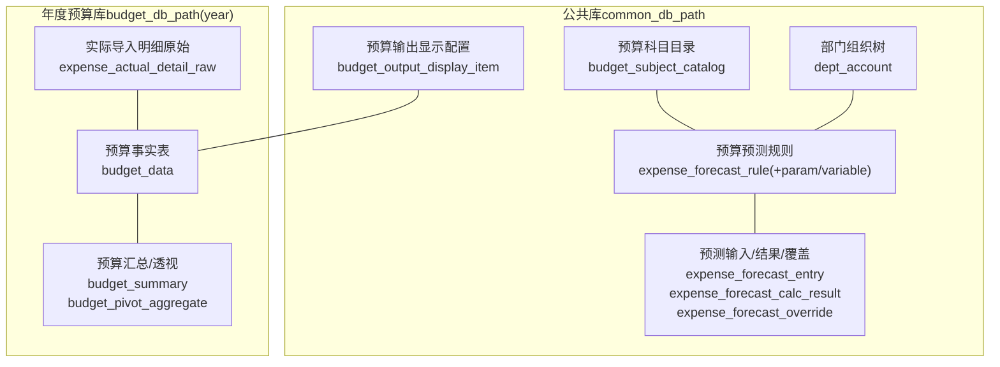
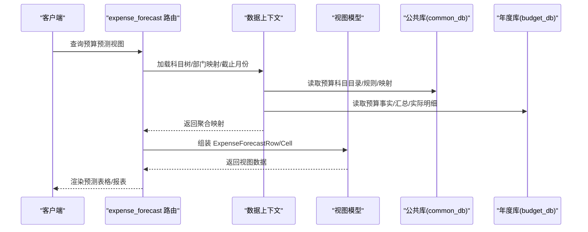
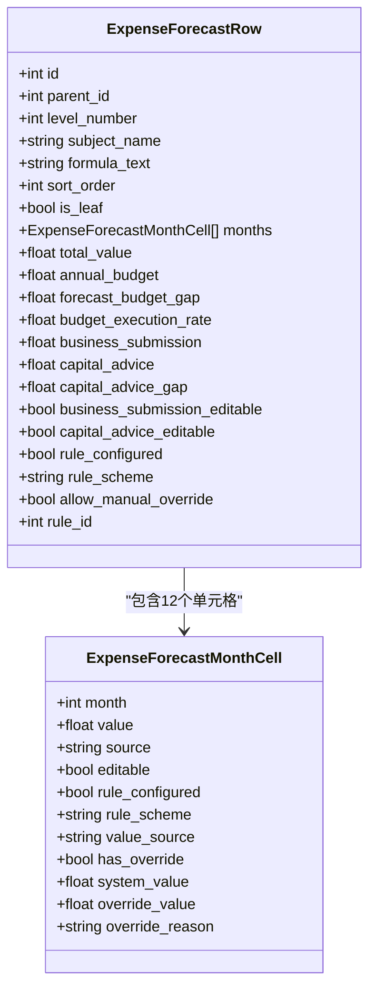
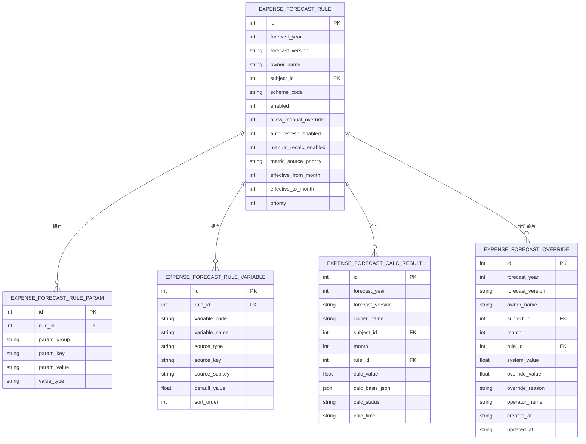
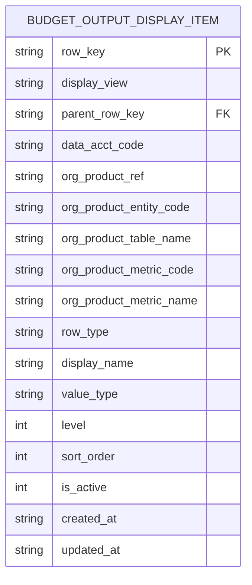
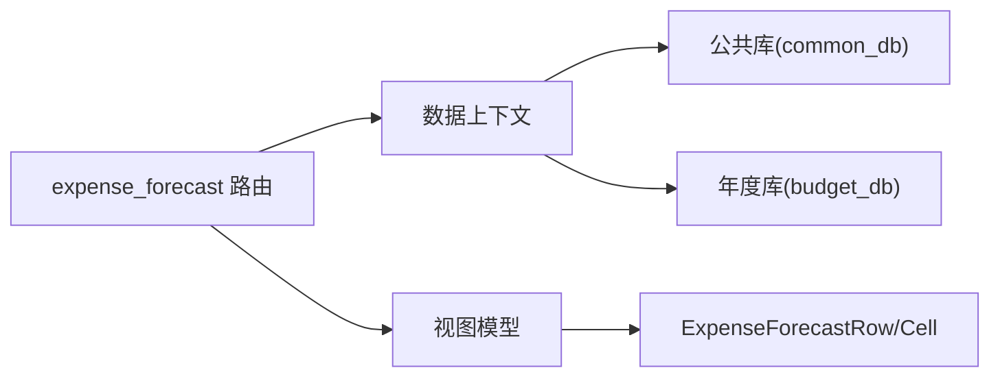

# 数据库设计

<cite>
**本文引用的文件**
- [schemas.py](file://apps/api/app/db_bootstrap/schemas.py)
- [budget_data.py](file://apps/api/app/db_bootstrap/budget_data.py)
- [expense.py](file://apps/api/app/db_bootstrap/expense.py)
- [expense_forecast.py](file://apps/api/app/routers/expense_forecast.py)
- [expense_forecast_view_model.py](file://apps/api/app/services/expense_forecast_view_model.py)
- [expense_forecast_view_read_model.py](file://apps/api/app/services/expense_forecast_view_read_model.py)
- [expense_forecast_data_context.py](file://apps/api/app/services/expense_forecast_data_context.py)
- [schemas.py](file://apps/api/app/schemas.py)
- [budget_output_display_config.py](file://apps/api/app/services/budget_output_display_config.py)
- [test_budget_output_display_config.py](file://apps/api/test_budget_output_display_config.py)
- [test_budget_display_structure.py](file://apps/api/test_budget_display_structure.py)
</cite>

## 目录
1. [简介](#简介)
2. [项目结构](#项目结构)
3. [核心组件](#核心组件)
4. [架构总览](#架构总览)
5. [详细组件分析](#详细组件分析)
6. [依赖分析](#依赖分析)
7. [性能考量](#性能考量)
8. [故障排查指南](#故障排查指南)
9. [结论](#结论)
10. [附录](#附录)

## 简介
本文件面向“智能预算预测系统”的数据库设计，聚焦于预算预测相关的核心数据模型与架构。重点覆盖以下主题：
- 数据库架构与核心表结构
- 关系设计、主键/外键、索引与约束
- 数据模型：ExpenseForecastRow、ExpenseForecastMonthCell、BudgetOutputDisplayConfig 等
- 数据访问模式、缓存策略与性能优化
- 数据生命周期、保留策略与归档规则
- 数据迁移路径与版本管理
- 数据安全、隐私与访问控制

## 项目结构
该系统采用“公共库表 + 年度预算事实表”的双层架构：
- 公共库表（common_db_path）：存放预算预测规则、科目树、部门映射、显示配置等跨版本共享数据
- 年度预算事实表（budget_db_path(year)）：存放按年份隔离的预算/实际数值与汇总结果



**图表来源**
- [schemas.py:533-642](file://apps/api/app/db_bootstrap/schemas.py#L533-L642)
- [expense.py:12-136](file://apps/api/app/db_bootstrap/expense.py#L12-L136)

**章节来源**
- [schemas.py:533-642](file://apps/api/app/db_bootstrap/schemas.py#L533-L642)
- [expense.py:12-136](file://apps/api/app/db_bootstrap/expense.py#L12-L136)

## 核心组件
- 预算预测读模型与视图
  - ExpenseForecastRow：预算预测树形展示的一行数据，包含12个月单元格、年度预算、执行率等
  - ExpenseForecastMonthCell：单月单元格，包含值、来源、可编辑性、规则配置、覆盖状态等
- 显示配置模型
  - BudgetOutputDisplayConfigItemDto：输出报表的显示配置项，支持层级、父子关系、指标绑定等
- 预算事实与汇总
  - budget_data：按指标-产品-期间-版本-预算/实际维度的事实表
  - budget_summary / budget_pivot_aggregate：按粒度聚合的汇总与透视表

**章节来源**
- [expense_forecast.py:135-180](file://apps/api/app/routers/expense_forecast.py#L135-L180)
- [schemas.py:82-114](file://apps/api/app/schemas.py#L82-L114)
- [schemas.py:396-419](file://apps/api/app/schemas.py#L396-L419)

## 架构总览
系统通过服务层将公共库与年度库的数据整合，形成预测视图与报表输出。



**图表来源**
- [expense_forecast.py:317-800](file://apps/api/app/routers/expense_forecast.py#L317-L800)
- [expense_forecast_view_read_model.py:103-152](file://apps/api/app/services/expense_forecast_view_read_model.py#L103-L152)
- [expense_forecast_data_context.py:159-319](file://apps/api/app/services/expense_forecast_data_context.py#L159-L319)

## 详细组件分析

### ExpenseForecastRow 与 ExpenseForecastMonthCell
- ExpenseForecastRow 字段要点
  - 结构：id、parent_id、level_number、subject_name、formula_text、sort_order、is_leaf
  - 行级指标：months（12个单元格）、total_value、annual_budget、forecast_budget_gap、budget_execution_rate
  - 编制与权限：business_submission/capital_advice 及其可编辑性；rule_configured、rule_scheme、allow_manual_override、rule_id
- ExpenseForecastMonthCell 字段要点
  - 基础：month、value、source（actual/forecast）
  - 来源与可编辑：value_source（actual/override/manual/aggregate），editable（受截止月份与规则影响）
  - 规则与覆盖：rule_configured、rule_scheme、has_override、system_value、override_value、override_reason



**图表来源**
- [expense_forecast.py:135-180](file://apps/api/app/routers/expense_forecast.py#L135-L180)

**章节来源**
- [expense_forecast.py:135-180](file://apps/api/app/routers/expense_forecast.py#L135-L180)

### 预算预测规则与计算链路
- 规则表：expense_forecast_rule（按年、版本、所有者、科目维度）
- 规则参数：expense_forecast_rule_param（按规则+分组+键）
- 规则变量：expense_forecast_rule_variable（变量来源类型、排序）
- 计算结果：expense_forecast_calc_result（按年、版本、所有者、科目、月份）
- 手工覆盖：expense_forecast_override（系统值、覆盖值、原因）



**图表来源**
- [expense.py:47-136](file://apps/api/app/db_bootstrap/expense.py#L47-L136)

**章节来源**
- [expense.py:47-136](file://apps/api/app/db_bootstrap/expense.py#L47-L136)

### 预算事实表与汇总
- 预算事实表 budget_data：按 data_acct_code、product_code、period_id、budget_actual、version_id 唯一
- 预算汇总 budget_summary：按指标/部门/期间/版本聚合
- 预算透视 budget_pivot_aggregate：按粒度（year/quarter/month）聚合

```mermaid
erDiagram
BUDGET_DATA {
int id PK
string data_acct_code
string product_code
int period_id
int budget_actual
int version_id FK
float value
float formula_value
float manual_value
string value_source
int need_calc
string create_time
string update_time
unique (data_acct_code, product_code, period_id, version_id, budget_actual)
}
BUDGET_SUMMARY {
int id PK
string metric_level1
string metric_level2
string metric_level3
string metric_level4
string metric_level5
string dept_level1
string dept_level2
string dept_level3
string data_code_name
string product_code_name
string year
string month
string quarter
int budget_actual
int version_id
string version_name
float value
string value_type
string value_source
string update_time
}
BUDGET_PIVOT_AGGREGATE {
int id PK
string grain
string metric_level1
string metric_level2
string metric_level3
string metric_level4
string metric_level5
string dept_level1
string dept_level2
string dept_level3
string data_code_name
string product_code_name
string year
string month
string quarter
int budget_actual
int version_id
string version_name
float value
string value_type
string value_source
string update_time
}
```

**图表来源**
- [schemas.py:549-588](file://apps/api/app/db_bootstrap/schemas.py#L549-L588)
- [schemas.py:589-613](file://apps/api/app/db_bootstrap/schemas.py#L589-L613)

**章节来源**
- [schemas.py:549-588](file://apps/api/app/db_bootstrap/schemas.py#L549-L588)
- [schemas.py:589-613](file://apps/api/app/db_bootstrap/schemas.py#L589-L613)

### 预算输出显示配置
- 配置表 budget_output_display_item：支持层级、父子关系、显示名、值类型、激活状态等
- 支持通过 org_product_* 字段绑定机构/产品指标体系
- 提供创建、更新、删除与排序维护流程



**图表来源**
- [schemas.py:9-27](file://apps/api/app/db_bootstrap/schemas.py#L9-L27)

**章节来源**
- [schemas.py:9-27](file://apps/api/app/db_bootstrap/schemas.py#L9-L27)
- [budget_output_display_config.py:515-696](file://apps/api/app/services/budget_output_display_config.py#L515-L696)
- [test_budget_output_display_config.py:178-266](file://apps/api/test_budget_output_display_config.py#L178-L266)
- [test_budget_display_structure.py:41-68](file://apps/api/test_budget_display_structure.py#L41-L68)

## 依赖分析
- 路由层依赖服务层构建视图
- 服务层依赖上下文加载器从公共库与年度库读取数据
- 视图模型负责将原始映射组装为 ExpenseForecastRow/Cell



**图表来源**
- [expense_forecast.py:317-800](file://apps/api/app/routers/expense_forecast.py#L317-L800)
- [expense_forecast_view_read_model.py:103-152](file://apps/api/app/services/expense_forecast_view_read_model.py#L103-L152)
- [expense_forecast_view_model.py:46-267](file://apps/api/app/services/expense_forecast_view_model.py#L46-L267)

**章节来源**
- [expense_forecast.py:317-800](file://apps/api/app/routers/expense_forecast.py#L317-L800)
- [expense_forecast_view_read_model.py:103-152](file://apps/api/app/services/expense_forecast_view_read_model.py#L103-L152)
- [expense_forecast_view_model.py:46-267](file://apps/api/app/services/expense_forecast_view_model.py#L46-L267)

## 性能考量
- 索引与查询
  - 预测入口表 expense_forecast_entry：按年、版本、编制范围建立复合索引，加速按范围/版本检索
  - 预测规则表 expense_forecast_rule：按年、版本、所有者、科目建立索引，提升规则匹配效率
  - 预测计算结果/覆盖表：按年、版本、所有者、科目建立索引，支撑月度写入与读取
  - 预算事实表 budget_data：按事实粒度唯一约束，避免重复写入；触发器自动维护 update_time
- 写入与一致性
  - 使用唯一约束与触发器保证 update_time 自动刷新，减少应用层负担
  - 预算汇总/透视表按粒度聚合，降低明细查询压力
- 缓存策略建议
  - 将常用映射（科目树、部门映射、截止月份）缓存在服务层内存中，减少数据库往返
  - 对热点报表视图进行短期缓存（如按版本+产品维度），结合变更事件失效
- 分区与归档
  - 年度库按年份隔离，便于归档历史年份数据；保留最近N年明细与汇总
  - 历史明细表可按年归档至离线存储，仅保留关键汇总表在线

[本节为通用指导，无需具体文件引用]

## 故障排查指南
- 预算事实表契约校验
  - 年度预算事实表必须满足当前“事实列+取值来源列”契约，否则拒绝自动迁移并报错
  - 校验 value_source 约束与生效值一致性，异常时需人工核对并修复
- 预测规则契约校验
  - 若检测到旧版 driver 合同/参数组/变量来源，拒绝自动迁移并提示升级
- 预算输出显示配置
  - 创建/更新/删除显示行时，检查 row_key 分配与排序调整是否正确
  - 父子关系与层级冲突会导致插入失败，需重新分配

**章节来源**
- [budget_data.py:33-130](file://apps/api/app/db_bootstrap/budget_data.py#L33-L130)
- [expense.py:345-410](file://apps/api/app/db_bootstrap/expense.py#L345-L410)
- [test_budget_output_display_config.py:178-266](file://apps/api/test_budget_output_display_config.py#L178-L266)
- [test_budget_display_structure.py:41-68](file://apps/api/test_budget_display_structure.py#L41-L68)

## 结论
本设计以“公共库+年度库”分层组织预算预测数据，通过严格的契约校验与索引策略保障稳定性与性能。ExpenseForecastRow/Cell 与 BudgetOutputDisplayConfig 等模型清晰表达业务语义，配合服务层上下文与视图模型实现高效渲染与导出。建议在生产环境中强化缓存与归档策略，并持续完善规则与指标体系的版本化管理。

[本节为总结性内容，无需具体文件引用]

## 附录

### 主键、外键、索引与约束清单
- 主键
  - budget_output_display_item：row_key
  - expense_forecast_entry：自增 id（同时按年、版本、范围、科目、月份唯一）
  - expense_forecast_rule：自增 id（按年、版本、所有者、科目唯一）
  - expense_forecast_calc_result：自增 id（按年、版本、所有者、科目、月份唯一）
  - expense_forecast_override：自增 id（按年、版本、所有者、科目、月份唯一）
  - budget_data：自增 id（按事实粒度唯一）
- 外键
  - expense_forecast_rule.subject_id → budget_subject_catalog(id)
  - expense_forecast_calc_result.rule_id → expense_forecast_rule(id)
  - expense_forecast_override.rule_id → expense_forecast_rule(id)
  - budget_data.version_id → version(version_id)
- 索引
  - 预测入口：按年、版本、范围建立复合索引
  - 预测规则：按年、版本、所有者、科目建立复合索引
  - 预测计算/覆盖：按年、版本、所有者、科目建立复合索引
  - 预算汇总/透视：按粒度与版本建立索引
- 约束
  - 枚举字段（如 value_source、scheme_code、status 等）使用 CHECK 约束
  - 唯一约束确保事实表与预测表的原子性

**章节来源**
- [schemas.py:533-642](file://apps/api/app/db_bootstrap/schemas.py#L533-L642)
- [expense.py:12-136](file://apps/api/app/db_bootstrap/expense.py#L12-L136)

### 数据生命周期、保留策略与归档规则
- 生命周期
  - 年度库按年份隔离，最新 N 年明细与汇总在线；更早年份归档离线
  - 预测规则按版本管理，新版本生成后逐步替换旧版本
- 保留策略
  - 明细保留期：按监管与审计要求设定（例如 5-10 年）
  - 汇总与报表：长期保留，定期压缩与去敏感化
- 归档规则
  - 年度库归档：冻结写入，只读访问
  - 日志与操作记录：按日/周清理，保留必要审计信息

[本节为通用指导，无需具体文件引用]

### 数据迁移路径与版本管理
- 预算事实表
  - 迁移前先校验当前契约，若发现旧字段/约束不匹配，拒绝自动迁移并提示修复
- 预测规则表
  - 若检测到旧 driver 合同/参数组/变量来源，拒绝自动迁移并提示升级
- 显示配置
  - row_key 分配遵循层级与排序规则，更新时自动调整后续排序

**章节来源**
- [budget_data.py:33-130](file://apps/api/app/db_bootstrap/budget_data.py#L33-L130)
- [expense.py:345-410](file://apps/api/app/db_bootstrap/expense.py#L345-L410)
- [test_budget_display_structure.py:41-68](file://apps/api/test_budget_display_structure.py#L41-L68)

### 数据安全、隐私与访问控制
- 访问控制
  - 路由层根据 scope_type（entity/group/owner）解析可用所有者集合，限制可见范围
  - 编制口径与部门映射用于确定有效管理归属，避免越权访问
- 隐私保护
  - 实际明细表中的个人与敏感信息应脱敏处理（如部门/人员字段）
  - 导出与报表应支持按权限过滤与降噪
- 审计与日志
  - 操作日志表记录关键变更，便于追踪与合规审查

**章节来源**
- [expense_forecast_data_context.py:52-69](file://apps/api/app/services/expense_forecast_data_context.py#L52-L69)
- [expense_forecast.py:740-750](file://apps/api/app/routers/expense_forecast.py#L740-L750)