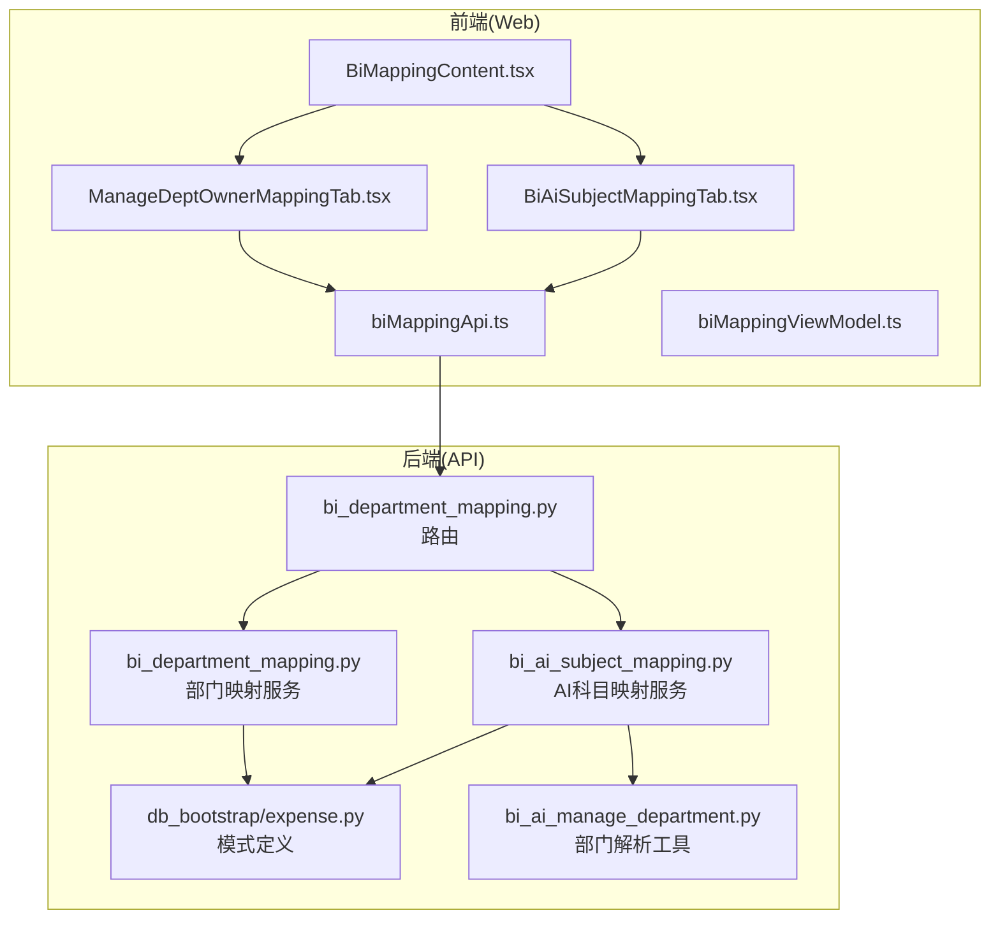
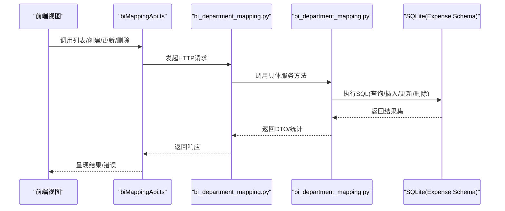
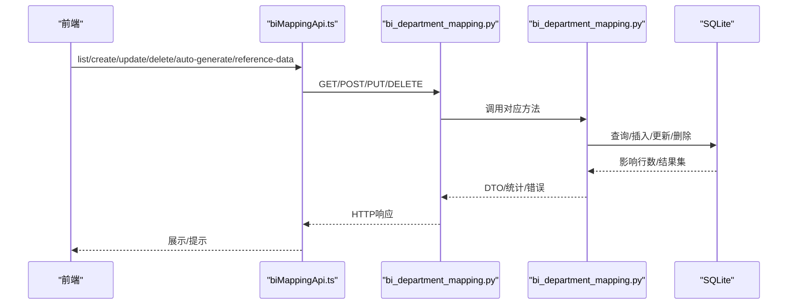
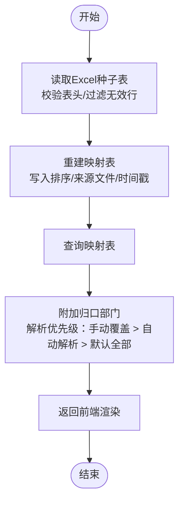
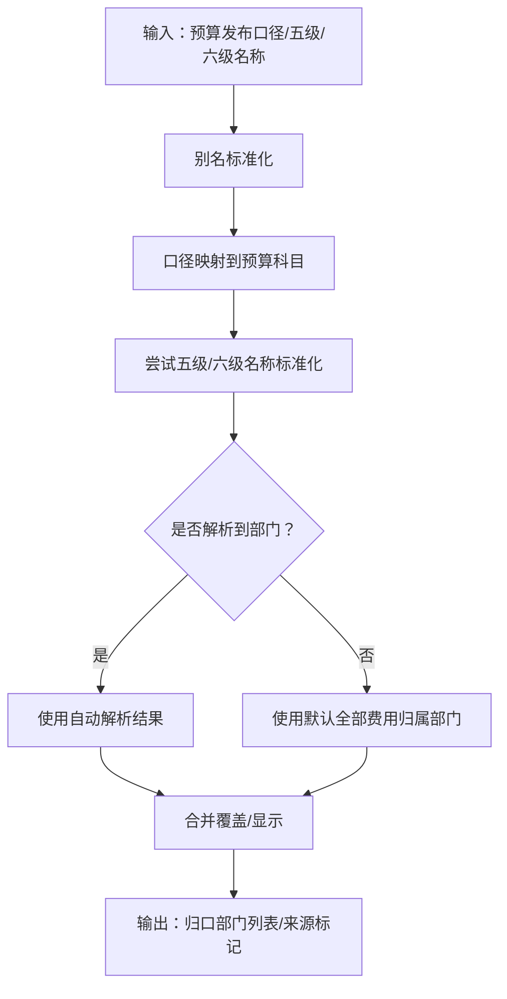
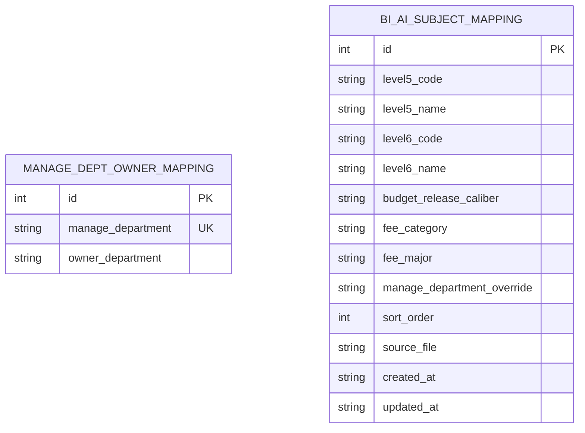
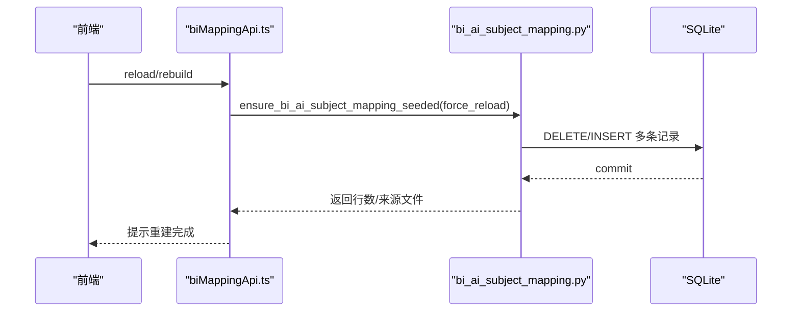
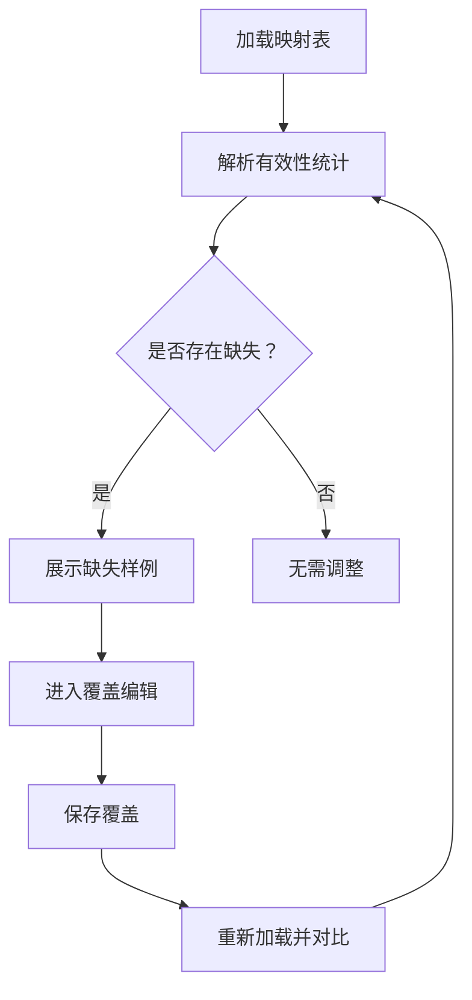
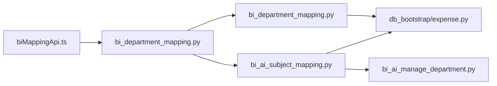

# BI部门映射模块

<cite>
**本文档引用的文件**
- [apps/api/app/routers/bi_department_mapping.py](file://apps/api/app/routers/bi_department_mapping.py)
- [apps/api/app/services/bi_department_mapping.py](file://apps/api/app/services/bi_department_mapping.py)
- [apps/api/app/services/bi_ai_subject_mapping.py](file://apps/api/app/services/bi_ai_subject_mapping.py)
- [apps/api/app/services/bi_ai_manage_department.py](file://apps/api/app/services/bi_ai_manage_department.py)
- [apps/api/app/db_bootstrap/expense.py](file://apps/api/app/db_bootstrap/expense.py)
- [apps/web/src/lib/biMappingApi.ts](file://apps/web/src/lib/biMappingApi.ts)
- [apps/web/src/lib/biMappingViewModel.ts](file://apps/web/src/lib/biMappingViewModel.ts)
- [apps/web/src/app/components/BiMappingContent.tsx](file://apps/web/src/app/components/BiMappingContent.tsx)
- [apps/web/src/app/components/ManageDeptOwnerMappingTab.tsx](file://apps/web/src/app/components/ManageDeptOwnerMappingTab.tsx)
- [apps/web/src/app/components/BiAiSubjectMappingTab.tsx](file://apps/web/src/app/components/BiAiSubjectMappingTab.tsx)
- [apps/api/test_bi_department_mapping_service.py](file://apps/api/test_bi_department_mapping_service.py)
</cite>

## 目录
1. [简介](#简介)
2. [项目结构](#项目结构)
3. [核心组件](#核心组件)
4. [架构总览](#架构总览)
5. [详细组件分析](#详细组件分析)
6. [依赖关系分析](#依赖关系分析)
7. [性能考虑](#性能考虑)
8. [故障排查指南](#故障排查指南)
9. [结论](#结论)
10. [附录](#附录)

## 简介
本模块面向BI部门映射与AI辅助的科目映射管理，提供两大能力：
- 部门-指标映射：维护“归口管理部门”到“费用归属部门”的映射，支撑费用执行明细导入时的自动归属解析。
- AI辅助科目映射：基于Excel种子表构建BI-AI科目映射，结合预算科目目录与口径别名，实现预算发布口径到部门预算科目的自动解析，并支持人工覆盖。

模块通过API路由、服务层、数据库模式与前端视图协同工作，确保映射的准确性、一致性与可追溯性。

## 项目结构
模块由后端API路由与服务、数据库模式定义、前端API封装与视图组件构成，形成前后端一体化的映射维护界面。

**图表来源**
- [apps/web/src/app/components/BiMappingContent.tsx:1-37](file://apps/web/src/app/components/BiMappingContent.tsx#L1-L37)
- [apps/web/src/app/components/ManageDeptOwnerMappingTab.tsx:1-357](file://apps/web/src/app/components/ManageDeptOwnerMappingTab.tsx#L1-L357)
- [apps/web/src/app/components/BiAiSubjectMappingTab.tsx:1-449](file://apps/web/src/app/components/BiAiSubjectMappingTab.tsx#L1-L449)
- [apps/web/src/lib/biMappingApi.ts:1-111](file://apps/web/src/lib/biMappingApi.ts#L1-L111)
- [apps/web/src/lib/biMappingViewModel.ts:1-129](file://apps/web/src/lib/biMappingViewModel.ts#L1-L129)
- [apps/api/app/routers/bi_department_mapping.py:1-50](file://apps/api/app/routers/bi_department_mapping.py#L1-L50)
- [apps/api/app/services/bi_department_mapping.py:1-215](file://apps/api/app/services/bi_department_mapping.py#L1-L215)
- [apps/api/app/services/bi_ai_subject_mapping.py:1-381](file://apps/api/app/services/bi_ai_subject_mapping.py#L1-L381)
- [apps/api/app/services/bi_ai_manage_department.py:1-308](file://apps/api/app/services/bi_ai_manage_department.py#L1-L308)
- [apps/api/app/db_bootstrap/expense.py:139-166](file://apps/api/app/db_bootstrap/expense.py#L139-L166)

**章节来源**
- [apps/web/src/app/components/BiMappingContent.tsx:1-37](file://apps/web/src/app/components/BiMappingContent.tsx#L1-L37)
- [apps/web/src/lib/biMappingApi.ts:1-111](file://apps/web/src/lib/biMappingApi.ts#L1-L111)
- [apps/api/app/routers/bi_department_mapping.py:1-50](file://apps/api/app/routers/bi_department_mapping.py#L1-L50)
- [apps/api/app/services/bi_department_mapping.py:1-215](file://apps/api/app/services/bi_department_mapping.py#L1-L215)
- [apps/api/app/services/bi_ai_subject_mapping.py:1-381](file://apps/api/app/services/bi_ai_subject_mapping.py#L1-L381)
- [apps/api/app/services/bi_ai_manage_department.py:1-308](file://apps/api/app/services/bi_ai_manage_department.py#L1-L308)
- [apps/api/app/db_bootstrap/expense.py:139-166](file://apps/api/app/db_bootstrap/expense.py#L139-L166)

## 核心组件
- 部门映射服务：提供列表、创建、更新、删除、自动生成功能，以及参考数据加载。
- AI科目映射服务：提供Excel种子表读取、映射表重建、查询、参考数据、手动覆盖写入。
- 部门解析工具：负责预算科目别名标准化、口径到科目映射、自动解析归口部门、覆盖与默认策略。
- 路由与API：暴露REST接口，统一错误处理。
- 前端视图与API封装：提供表格、筛选、弹窗、批量操作与状态提示。

**章节来源**
- [apps/api/app/services/bi_department_mapping.py:84-215](file://apps/api/app/services/bi_department_mapping.py#L84-L215)
- [apps/api/app/services/bi_ai_subject_mapping.py:158-381](file://apps/api/app/services/bi_ai_subject_mapping.py#L158-L381)
- [apps/api/app/services/bi_ai_manage_department.py:109-288](file://apps/api/app/services/bi_ai_manage_department.py#L109-L288)
- [apps/api/app/routers/bi_department_mapping.py:13-49](file://apps/api/app/routers/bi_department_mapping.py#L13-L49)
- [apps/web/src/lib/biMappingApi.ts:1-111](file://apps/web/src/lib/biMappingApi.ts#L1-L111)

## 架构总览
模块采用“前端视图 + API封装 + 路由 + 服务 + 数据库模式”的分层架构。前端通过API封装调用后端路由，路由转发至对应服务，服务访问SQLite数据库并进行业务逻辑处理，同时依赖预算科目目录与部门主数据进行语义解析与一致性校验。

**图表来源**
- [apps/web/src/lib/biMappingApi.ts:58-85](file://apps/web/src/lib/biMappingApi.ts#L58-L85)
- [apps/api/app/routers/bi_department_mapping.py:16-43](file://apps/api/app/routers/bi_department_mapping.py#L16-L43)
- [apps/api/app/services/bi_department_mapping.py:84-215](file://apps/api/app/services/bi_department_mapping.py#L84-L215)
- [apps/api/app/db_bootstrap/expense.py:139-146](file://apps/api/app/db_bootstrap/expense.py#L139-L146)

## 详细组件分析

### 组件A：部门-指标映射（Manage Dept Owner Mapping）
职责与流程：
- 列表：返回所有“归口管理部门-费用归属部门”映射。
- 创建：校验必填项，避免重复键冲突。
- 更新：仅允许更新“费用归属部门”，保持“归口管理部门”不可变。
- 删除：按ID删除。
- 自动生成：从费用执行明细原始表中提取已匹配的“归口部门-费用部门”对，去重并批量写入。
- 参考数据：提供“归口部门”候选、“费用归属部门”树形分组与“费用归属部门”列表。

**图表来源**
- [apps/web/src/lib/biMappingApi.ts:58-85](file://apps/web/src/lib/biMappingApi.ts#L58-L85)
- [apps/api/app/routers/bi_department_mapping.py:16-43](file://apps/api/app/routers/bi_department_mapping.py#L16-L43)
- [apps/api/app/services/bi_department_mapping.py:84-215](file://apps/api/app/services/bi_department_mapping.py#L84-L215)

**章节来源**
- [apps/api/app/services/bi_department_mapping.py:84-215](file://apps/api/app/services/bi_department_mapping.py#L84-L215)
- [apps/api/app/routers/bi_department_mapping.py:13-49](file://apps/api/app/routers/bi_department_mapping.py#L13-L49)
- [apps/web/src/app/components/ManageDeptOwnerMappingTab.tsx:1-357](file://apps/web/src/app/components/ManageDeptOwnerMappingTab.tsx#L1-L357)
- [apps/api/test_bi_department_mapping_service.py:71-124](file://apps/api/test_bi_department_mapping_service.py#L71-L124)

### 组件B：AI辅助科目映射（BI-AI Subject Mapping）
职责与流程：
- Excel种子表读取：支持“BI科目匹配表.xlsx”或“BI科目mapping.xlsx”，校验表头并过滤无效行。
- 映射表重建：按排序写入映射表，支持强制重载。
- 查询与渲染：读取映射表，结合预算科目目录与口径别名，解析每个条目的“归口部门”，支持手动覆盖与默认全部。
- 参考数据：提供“费用归属部门”列表。
- 手动覆盖：支持为单条记录设置或多选部门，序列化存储并在渲染时优先使用。

**图表来源**
- [apps/api/app/services/bi_ai_subject_mapping.py:93-206](file://apps/api/app/services/bi_ai_subject_mapping.py#L93-L206)
- [apps/api/app/services/bi_ai_subject_mapping.py:209-259](file://apps/api/app/services/bi_ai_subject_mapping.py#L209-L259)
- [apps/api/app/services/bi_ai_manage_department.py:199-218](file://apps/api/app/services/bi_ai_manage_department.py#L199-L218)

**章节来源**
- [apps/api/app/services/bi_ai_subject_mapping.py:93-206](file://apps/api/app/services/bi_ai_subject_mapping.py#L93-L206)
- [apps/api/app/services/bi_ai_subject_mapping.py:209-381](file://apps/api/app/services/bi_ai_subject_mapping.py#L209-L381)
- [apps/api/app/services/bi_ai_manage_department.py:109-288](file://apps/api/app/services/bi_ai_manage_department.py#L109-L288)
- [apps/web/src/app/components/BiAiSubjectMappingTab.tsx:1-449](file://apps/web/src/app/components/BiAiSubjectMappingTab.tsx#L1-L449)

### 组件C：AI服务集成与语义理解
- 别名与标准化：预算科目别名、口径别名统一标准化，提升匹配召回。
- 解析策略：优先使用“预算发布口径”映射到预算科目，再回退到“五级/六级名称”标准化匹配，最后默认全部费用归属部门。
- 覆盖优先：当存在手动覆盖时，直接使用覆盖值。
- 校验与提示：提供解析有效性统计与样例，便于人工校验。

**图表来源**
- [apps/api/app/services/bi_ai_manage_department.py:132-197](file://apps/api/app/services/bi_ai_manage_department.py#L132-L197)
- [apps/api/app/services/bi_ai_manage_department.py:199-218](file://apps/api/app/services/bi_ai_manage_department.py#L199-L218)

**章节来源**
- [apps/api/app/services/bi_ai_manage_department.py:109-288](file://apps/api/app/services/bi_ai_manage_department.py#L109-L288)

### 组件D：数据模型与规则引擎
- 表结构契约：
  - manage_dept_owner_mapping：唯一约束“归口管理部门”，保证一对一映射。
  - bi_ai_subject_mapping：唯一约束“六级编码+名称+排序”，保证条目唯一且有序。
- 字段设计：
  - manage_department_override：JSON序列化的部门列表，支持空值表示未覆盖。
  - sort_order/source_file/created_at/updated_at：用于重建溯源与版本控制。
- 规则与冲突解决：
  - 自动生成时忽略不存在的“费用归属部门”，避免破坏一致性。
  - 手动覆盖优先于自动解析，避免误覆盖。
  - 默认全部作为兜底策略，确保不遗漏。

**图表来源**
- [apps/api/app/db_bootstrap/expense.py:139-166](file://apps/api/app/db_bootstrap/expense.py#L139-L166)

**章节来源**
- [apps/api/app/db_bootstrap/expense.py:139-166](file://apps/api/app/db_bootstrap/expense.py#L139-L166)
- [apps/api/app/services/bi_ai_subject_mapping.py:158-206](file://apps/api/app/services/bi_ai_subject_mapping.py#L158-L206)
- [apps/api/app/services/bi_department_mapping.py:101-155](file://apps/api/app/services/bi_department_mapping.py#L101-L155)

### 组件E：版本管理与批量更新机制
- 版本管理：
  - 通过sort_order与source_file实现条目顺序与来源追踪，重建时可记录Excel文件名。
- 批量更新：
  - 自动生成：扫描已匹配明细，批量写入映射。
  - Excel重建：按种子表全量重建，支持强制重载。
  - 手动覆盖：逐条更新“归口部门”列表。

**图表来源**
- [apps/web/src/lib/biMappingApi.ts:108-110](file://apps/web/src/lib/biMappingApi.ts#L108-L110)
- [apps/api/app/services/bi_ai_subject_mapping.py:158-206](file://apps/api/app/services/bi_ai_subject_mapping.py#L158-L206)

**章节来源**
- [apps/api/app/services/bi_ai_subject_mapping.py:158-206](file://apps/api/app/services/bi_ai_subject_mapping.py#L158-L206)
- [apps/web/src/app/components/BiAiSubjectMappingTab.tsx:334-345](file://apps/web/src/app/components/BiAiSubjectMappingTab.tsx#L334-L345)

### 组件F：人工校验流程
- 前端校验提示：解析有效性统计、缺失样例列表。
- 手动覆盖：在表格中打开部门选择面板，多选/清空/恢复默认。
- 分组展示：按“事业群-费用归属部门”分组，便于快速定位与核对。

**图表来源**
- [apps/api/app/services/bi_ai_manage_department.py:250-287](file://apps/api/app/services/bi_ai_manage_department.py#L250-L287)
- [apps/web/src/app/components/BiAiSubjectMappingTab.tsx:20-168](file://apps/web/src/app/components/BiAiSubjectMappingTab.tsx#L20-L168)

**章节来源**
- [apps/api/app/services/bi_ai_manage_department.py:250-287](file://apps/api/app/services/bi_ai_manage_department.py#L250-L287)
- [apps/web/src/app/components/BiAiSubjectMappingTab.tsx:20-168](file://apps/web/src/app/components/BiAiSubjectMappingTab.tsx#L20-L168)

### 组件G：与指标树、数据字典的关系
- 指标树/预算科目目录：通过“预算发布口径”与“五级/六级名称”标准化后，映射到预算科目，再继承其“管理归属部门”。
- 数据字典：部门主数据提供“费用归属部门”集合，覆盖校验与下拉选择的基础。
- 冲突解决：当口径无法解析时，默认全部费用归属部门，确保不丢失数据。

**章节来源**
- [apps/api/app/services/bi_ai_manage_department.py:290-308](file://apps/api/app/services/bi_ai_manage_department.py#L290-L308)
- [apps/api/app/services/bi_ai_subject_mapping.py:262-267](file://apps/api/app/services/bi_ai_subject_mapping.py#L262-L267)

## 依赖关系分析
- 组件耦合：
  - 路由依赖服务；服务依赖数据库模式与预算/部门主数据。
  - AI科目映射服务依赖部门解析工具与预算科目目录。
- 外部依赖：
  - SQLite：本地轻量数据库，支持异步连接。
  - OpenPyXL：Excel读取。
- 潜在循环依赖：未见循环，模块边界清晰。

**图表来源**
- [apps/api/app/routers/bi_department_mapping.py:13-49](file://apps/api/app/routers/bi_department_mapping.py#L13-L49)
- [apps/api/app/services/bi_department_mapping.py:1-215](file://apps/api/app/services/bi_department_mapping.py#L1-L215)
- [apps/api/app/services/bi_ai_subject_mapping.py:1-381](file://apps/api/app/services/bi_ai_subject_mapping.py#L1-L381)
- [apps/api/app/services/bi_ai_manage_department.py:1-308](file://apps/api/app/services/bi_ai_manage_department.py#L1-L308)
- [apps/api/app/db_bootstrap/expense.py:139-166](file://apps/api/app/db_bootstrap/expense.py#L139-L166)
- [apps/web/src/lib/biMappingApi.ts:1-111](file://apps/web/src/lib/biMappingApi.ts#L1-L111)

**章节来源**
- [apps/api/app/routers/bi_department_mapping.py:13-49](file://apps/api/app/routers/bi_department_mapping.py#L13-L49)
- [apps/api/app/services/bi_department_mapping.py:1-215](file://apps/api/app/services/bi_department_mapping.py#L1-L215)
- [apps/api/app/services/bi_ai_subject_mapping.py:1-381](file://apps/api/app/services/bi_ai_subject_mapping.py#L1-L381)
- [apps/api/app/services/bi_ai_manage_department.py:1-308](file://apps/api/app/services/bi_ai_manage_department.py#L1-L308)
- [apps/api/app/db_bootstrap/expense.py:139-166](file://apps/api/app/db_bootstrap/expense.py#L139-L166)
- [apps/web/src/lib/biMappingApi.ts:1-111](file://apps/web/src/lib/biMappingApi.ts#L1-L111)

## 性能考虑
- 查询优化：映射查询按排序与ID排序，索引命中良好。
- 写入优化：重建时批量插入，减少事务次数。
- 前端渲染：表格分页与筛选，避免一次性渲染大量行。
- 异步IO：服务层使用异步SQLite，提升并发处理能力。

## 故障排查指南
- 常见错误与处理：
  - 唯一约束冲突：创建映射时若“归口管理部门”已存在，返回409。
  - 记录不存在：更新/删除映射时若ID不存在，返回404。
  - Excel表头不符：读取Excel种子表时校验表头，不符合则报错。
  - 覆盖值非法：手动覆盖的部门需在“费用归属部门”范围内，否则报错。
- 排查步骤：
  - 检查数据库表结构与唯一约束是否满足契约。
  - 核对Excel种子表路径与表头。
  - 使用“解析有效性统计”定位缺失样例。
  - 对照“自动/默认”来源标记确认解析链路。

**章节来源**
- [apps/api/app/services/bi_department_mapping.py:101-155](file://apps/api/app/services/bi_department_mapping.py#L101-L155)
- [apps/api/app/services/bi_ai_subject_mapping.py:93-98](file://apps/api/app/services/bi_ai_subject_mapping.py#L93-L98)
- [apps/api/app/services/bi_ai_subject_mapping.py:269-303](file://apps/api/app/services/bi_ai_subject_mapping.py#L269-L303)
- [apps/api/test_bi_department_mapping_service.py:71-124](file://apps/api/test_bi_department_mapping_service.py#L71-L124)

## 结论
本模块通过清晰的分层设计与严格的契约约束，实现了“部门-指标映射”与“AI辅助科目映射”的高可用与可维护性。前端提供直观的交互与校验提示，后端以服务为核心承载业务逻辑，数据库模式保障数据一致性。模块支持自动解析、人工覆盖与批量重建，满足新部门接入、指标变更与跨部门协作等典型场景。

## 附录

### API定义（节选）
- 部门映射
  - GET /api/manage-dept-owner-mapping/list → 列表
  - POST /api/manage-dept-owner-mapping/create → 创建
  - PUT /api/manage-dept-owner-mapping/update/{id} → 更新
  - DELETE /api/manage-dept-owner-mapping/delete/{id} → 删除
  - POST /api/manage-dept-owner-mapping/auto-generate → 自动生成
  - GET /api/manage-dept-owner-mapping/reference-data → 参考数据
- AI科目映射
  - GET /api/bi-ai-subject-mapping/list
  - GET /api/bi-ai-subject-mapping/reference-data
  - POST /api/bi-ai-subject-mapping/create
  - PUT /api/bi-ai-subject-mapping/update/{id}/manage-departments
  - POST /api/bi-ai-subject-mapping/reload

**章节来源**
- [apps/api/app/routers/bi_department_mapping.py:16-49](file://apps/api/app/routers/bi_department_mapping.py#L16-L49)
- [apps/web/src/lib/biMappingApi.ts:58-110](file://apps/web/src/lib/biMappingApi.ts#L58-L110)