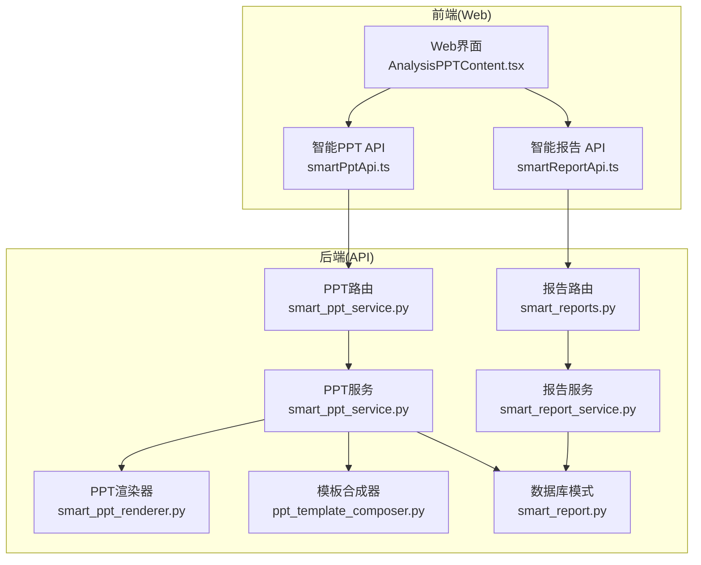
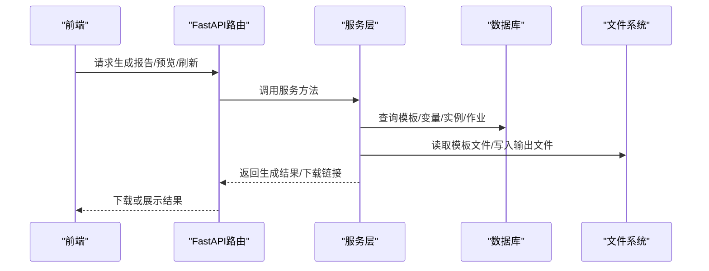
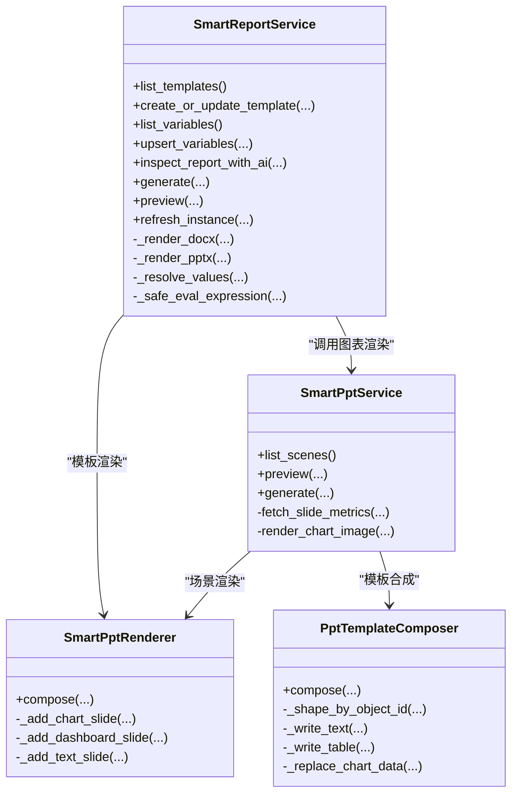
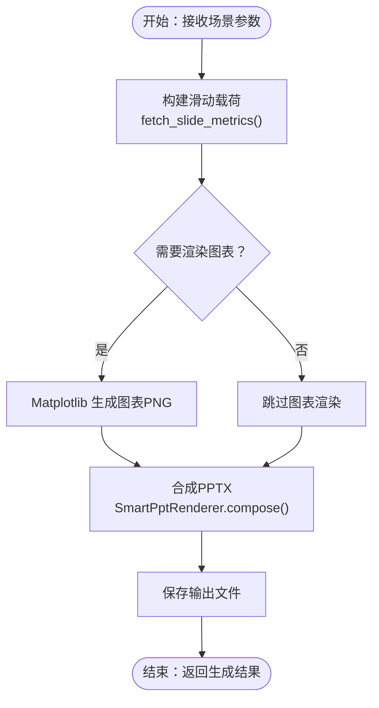
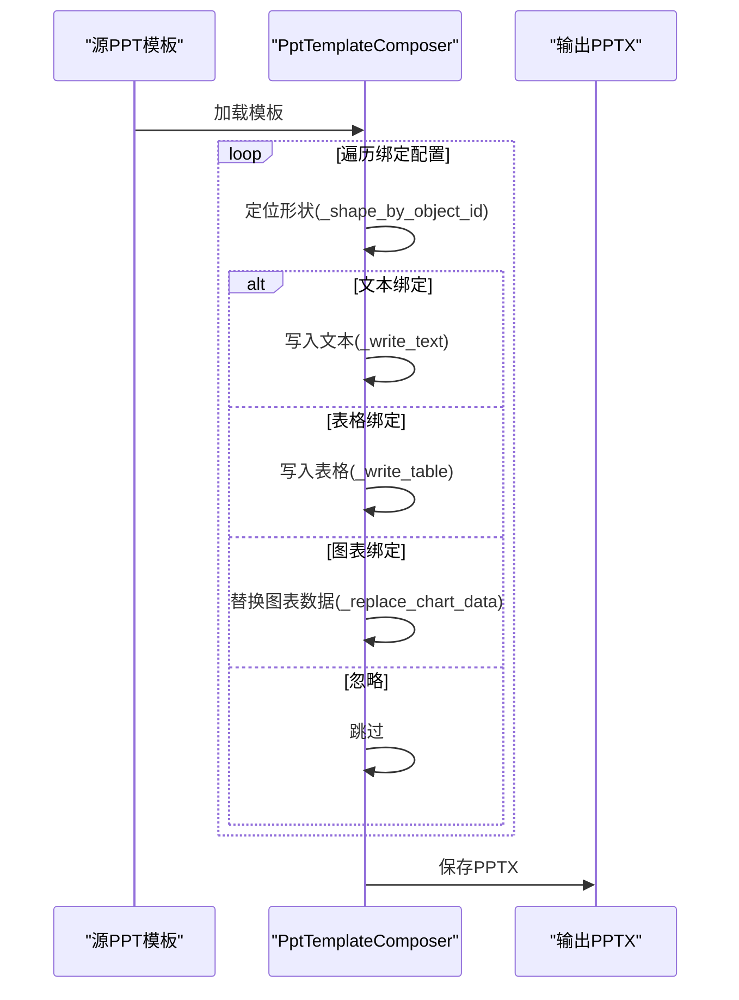
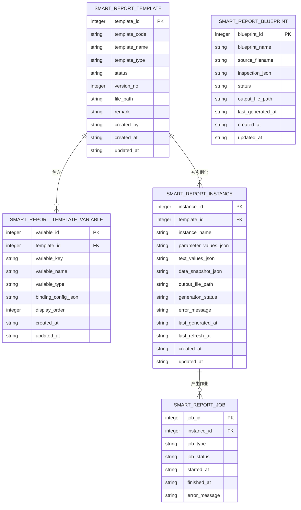
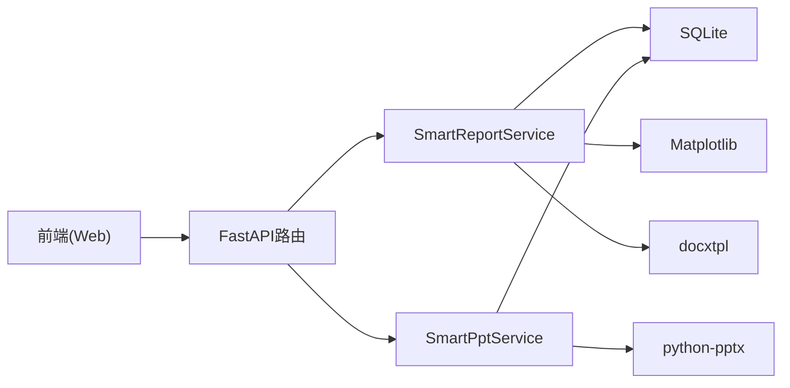

# 智能报告模块

<cite>
**本文档引用的文件**
- [smart_report_service.py](file://apps/api/app/services/smart_report_service.py)
- [smart_reports.py](file://apps/api/app/routers/smart_reports.py)
- [smart_ppt_service.py](file://apps/api/app/services/smart_ppt_service.py)
- [smart_ppt_renderer.py](file://apps/api/app/services/smart_ppt_renderer.py)
- [ppt_template_composer.py](file://apps/api/app/services/ppt_template_composer.py)
- [smart_report.py](file://apps/api/app/db_bootstrap/smart_report.py)
- [smartPptApi.ts](file://apps/web/src/lib/smartPptApi.ts)
- [smartReportApi.ts](file://apps/web/src/lib/smartReportApi.ts)
- [AnalysisPPTContent.tsx](file://apps/web/src/app/components/AnalysisPPTContent.tsx)
</cite>

## 目录
1. [简介](#简介)
2. [项目结构](#项目结构)
3. [核心组件](#核心组件)
4. [架构总览](#架构总览)
5. [详细组件分析](#详细组件分析)
6. [依赖关系分析](#依赖关系分析)
7. [性能考虑](#性能考虑)
8. [故障排除指南](#故障排除指南)
9. [结论](#结论)
10. [附录](#附录)

## 简介
智能报告模块是一个端到端的自动化报告生成与发布平台，覆盖以下能力：
- 智能报告生成：支持 DOCX/PPTX 模板驱动的内容抽取、结构化处理、样式渲染与多格式导出
- AI 内容生成：基于大模型的报告结构解析、分析任务识别与自然语言规则生成
- PPT 自动排版引擎：场景驱动的幻灯片编排、图表渲染与模板绑定
- 模板管理系统：变量定义、计算指标、蓝图预览与确认流程
- 批量处理与质量控制：作业队列、状态跟踪、错误回滚与警告提示
- 业务数据集成：预算汇总数据模型、版本与维度过滤、跨年对比与预算完成率计算

该模块同时服务于预算分析报告、执行情况汇报、预测结果解读等典型场景，并提供前端可视化工具链以实现模板解析、场景预览与一键生成。

## 项目结构
后端采用 FastAPI 架构，核心服务位于 apps/api/app/services，路由位于 apps/api/app/routers，数据库模式位于 apps/api/app/db_bootstrap。前端位于 apps/web，通过 API 层对接后端服务。

**图表来源**
- [smart_reports.py:32-221](file://apps/api/app/routers/smart_reports.py#L32-L221)
- [smart_ppt_service.py:130-140](file://apps/api/app/services/smart_ppt_service.py#L130-L140)
- [smart_report_service.py:121-129](file://apps/api/app/services/smart_report_service.py#L121-L129)
- [smart_ppt_renderer.py:21-26](file://apps/api/app/services/smart_ppt_renderer.py#L21-L26)
- [ppt_template_composer.py:24-36](file://apps/api/app/services/ppt_template_composer.py#L24-L36)
- [smart_report.py:7-47](file://apps/api/app/db_bootstrap/smart_report.py#L7-L47)

**章节来源**
- [smart_reports.py:32-221](file://apps/api/app/routers/smart_reports.py#L32-L221)
- [smart_ppt_service.py:130-140](file://apps/api/app/services/smart_ppt_service.py#L130-L140)
- [smart_report_service.py:121-129](file://apps/api/app/services/smart_report_service.py#L121-L129)
- [smart_ppt_renderer.py:21-26](file://apps/api/app/services/smart_ppt_renderer.py#L21-L26)
- [ppt_template_composer.py:24-36](file://apps/api/app/services/ppt_template_composer.py#L24-L36)
- [smart_report.py:7-47](file://apps/api/app/db_bootstrap/smart_report.py#L7-L47)

## 核心组件
- 报告服务（SmartReportService）
  - 模板管理：上传/创建 DOCX/PPTX 模板、变量同步、蓝图解析与生成
  - 数据解析：占位符提取、参数解析、图表占位符渲染为图片
  - 渲染与导出：DOCX 文本替换、PPTX 文本替换、预览文本拼装
  - 作业调度：生成与刷新实例、状态持久化、日志记录
- PPT 服务（SmartPptService）
  - 场景管理：场景定义、默认参数、滑动模板
  - 数据取数：按年/月/季度/部门/产品等维度聚合预算汇总数据
  - 图表渲染：Matplotlib 生成图表 PNG，支持线/柱/双柱/环形图
  - 幻灯片合成：场景编排、图表注入、表格写入、文本替换
- PPT 渲染器（SmartPptRenderer）
  - 原生 PPTX 渲染：封面、仪表盘、图表页、文本页统一布局与配色
  - 表格与图表格式化：标题栏、边框、字体、颜色、网格线、数据标签
- 模板合成器（PptTemplateComposer）
  - 模板绑定：文本、表格、图表对象的轻量级替换
  - 绑定路径定位：基于对象 ID 的层级路径解析
  - 截断与保存：限制最大页数、输出 PPTX
- 数据库模式（smart_report.py）
  - 报告模板、变量、实例、作业、蓝图等表结构校验
  - 字段与约束检查，拒绝旧表结构自动迁移

**章节来源**
- [smart_report_service.py:121-811](file://apps/api/app/services/smart_report_service.py#L121-L811)
- [smart_ppt_service.py:130-800](file://apps/api/app/services/smart_ppt_service.py#L130-L800)
- [smart_ppt_renderer.py:21-394](file://apps/api/app/services/smart_ppt_renderer.py#L21-L394)
- [ppt_template_composer.py:24-204](file://apps/api/app/services/ppt_template_composer.py#L24-L204)
- [smart_report.py:73-122](file://apps/api/app/db_bootstrap/smart_report.py#L73-L122)

## 架构总览
智能报告模块采用“路由层-服务层-渲染层-存储层”的分层设计。前端通过 API 接口调用后端服务，服务层负责业务逻辑与数据聚合，渲染层负责最终文档/PPT 的生成，存储层负责模板、变量、实例与作业的状态持久化。

**图表来源**
- [smart_reports.py:174-204](file://apps/api/app/routers/smart_reports.py#L174-L204)
- [smart_report_service.py:610-811](file://apps/api/app/services/smart_report_service.py#L610-L811)

**章节来源**
- [smart_reports.py:174-204](file://apps/api/app/routers/smart_reports.py#L174-L204)
- [smart_report_service.py:610-811](file://apps/api/app/services/smart_report_service.py#L610-L811)

## 详细组件分析

### 报告服务（SmartReportService）
- 模板与变量管理
  - 支持上传 DOCX/PPTX 模板并自动提取占位符，同步到变量表
  - 变量类型包括指标、公式、计算、参数、文本、表格、图表、分析
  - 计算指标表达式安全求值，支持 + - * / 和括号运算
- AI 报告解析
  - 上传 DOCX 提取纯文本，调用大模型进行结构化解析
  - 规则兜底：识别同比/环比/归因/TopN 等自然语言片段
  - 输出块、问题与假设，支持蓝图生成与确认
- 渲染与导出
  - DOCX：遍历段落与表格，替换占位符；图表占位符渲染为图片嵌入
  - PPTX：遍历幻灯片与形状，替换文本；图表占位符渲染为图片
  - 预览：生成预览文本，包含图表占位符标签
- 作业与状态
  - 实例表记录生成状态、错误信息、输出路径
  - 作业表记录生成/刷新任务状态与时间戳
  - 刷新实例：复用历史参数与文本值重新生成

**图表来源**
- [smart_report_service.py:121-811](file://apps/api/app/services/smart_report_service.py#L121-L811)
- [smart_ppt_service.py:130-290](file://apps/api/app/services/smart_ppt_service.py#L130-L290)
- [smart_ppt_renderer.py:21-394](file://apps/api/app/services/smart_ppt_renderer.py#L21-L394)
- [ppt_template_composer.py:24-204](file://apps/api/app/services/ppt_template_composer.py#L24-L204)

**章节来源**
- [smart_report_service.py:121-811](file://apps/api/app/services/smart_report_service.py#L121-L811)
- [smart_ppt_service.py:130-290](file://apps/api/app/services/smart_ppt_service.py#L130-L290)
- [smart_ppt_renderer.py:21-394](file://apps/api/app/services/smart_ppt_renderer.py#L21-L394)
- [ppt_template_composer.py:24-204](file://apps/api/app/services/ppt_template_composer.py#L24-L204)

### PPT 服务（SmartPptService）
- 场景编排
  - 场景定义包含滑动模板、默认参数、排序与状态
  - 预览：构建滑动载荷，生成预览卡片
  - 生成：构建滑动载荷，渲染图表，合成 PPTX
- 数据取数
  - 支持按年/月/季度/部门/产品等维度聚合预算汇总数据
  - 支持同比/环比/预算完成率/预算偏差等指标计算
  - 支持仪表盘卡片、趋势图、对比图、预警提醒等场景
- 图表渲染
  - 使用 Matplotlib 生成 PNG，支持线/柱/双柱/环形图
  - 配置主题色板、字体、网格线、数据标签
- 模板合成
  - 将图表数据替换到模板中的图表对象
  - 将表格数据写入模板中的表格对象
  - 将文本替换到模板中的文本对象

**图表来源**
- [smart_ppt_service.py:215-290](file://apps/api/app/services/smart_ppt_service.py#L215-L290)
- [smart_ppt_renderer.py:28-59](file://apps/api/app/services/smart_ppt_renderer.py#L28-L59)

**章节来源**
- [smart_ppt_service.py:215-290](file://apps/api/app/services/smart_ppt_service.py#L215-L290)
- [smart_ppt_renderer.py:28-59](file://apps/api/app/services/smart_ppt_renderer.py#L28-L59)

### 模板合成器（PptTemplateComposer）
- 绑定类型
  - 文本绑定：将参数值写入文本框
  - 表格绑定：将二维数组写入表格
  - 图表绑定：将系列数据替换到图表
- 绑定路径
  - 通过对象 ID 定位到具体幻灯片与形状
  - 支持组形状的递归遍历
- 输出控制
  - 当无可应用绑定时输出原模板副本
  - 可选截断最大页数

**图表来源**
- [ppt_template_composer.py:27-92](file://apps/api/app/services/ppt_template_composer.py#L27-L92)

**章节来源**
- [ppt_template_composer.py:27-92](file://apps/api/app/services/ppt_template_composer.py#L27-L92)

### 数据库模式与状态管理
- 表结构
  - 智能报告模板、变量、实例、作业、蓝图等表
  - 字段与约束校验，拒绝旧字段与缺失字段
- 状态流转
  - 实例状态：pending/running/success/failed
  - 作业状态：generate/refresh，记录开始/结束时间与错误信息
- 日志与审计
  - 生成/刷新/蓝图保存/模板上传等操作均写入操作日志

**图表来源**
- [smart_report.py:7-47](file://apps/api/app/db_bootstrap/smart_report.py#L7-L47)

**章节来源**
- [smart_report.py:73-122](file://apps/api/app/db_bootstrap/smart_report.py#L73-L122)

## 依赖关系分析
- 组件耦合
  - SmartReportService 依赖 SmartPptService 进行图表渲染（用于 Word 中嵌入图表）
  - SmartPptService 依赖 SmartPptRenderer 进行 PPTX 渲染
  - SmartPptService 依赖 PptTemplateComposer 进行模板绑定合成
- 外部依赖
  - Python 库：fastapi、aiosqlite、docxtpl、python-pptx、matplotlib
  - 数据库：SQLite（预算汇总数据模型）
- 前端依赖
  - Web 界面通过 smartPptApi.ts 与 smartReportApi.ts 调用后端接口
  - AnalysisPPTContent.tsx 提供模板解析、场景预览与生成入口

**图表来源**
- [smart_reports.py:32-221](file://apps/api/app/routers/smart_reports.py#L32-L221)
- [smart_report_service.py:121-129](file://apps/api/app/services/smart_report_service.py#L121-L129)
- [smart_ppt_service.py:130-139](file://apps/api/app/services/smart_ppt_service.py#L130-L139)

**章节来源**
- [smart_reports.py:32-221](file://apps/api/app/routers/smart_reports.py#L32-L221)
- [smart_report_service.py:121-129](file://apps/api/app/services/smart_report_service.py#L121-L129)
- [smart_ppt_service.py:130-139](file://apps/api/app/services/smart_ppt_service.py#L130-L139)

## 性能考虑
- I/O 优化
  - 模板与输出文件统一存放于本地目录，避免频繁网络传输
  - 图表缓存目录用于重用 PNG，减少重复渲染
- 数据查询
  - 预算汇总数据按年分库，使用索引条件过滤（年、预算/实际、月/季度、版本、维度）
  - 聚合查询使用 SUM/COUNT，避免全表扫描
- 渲染策略
  - PPTX 渲染采用原生图表数据结构，减少样式重建成本
  - 模板合成器仅替换必要对象，保留模板整体风格
- 并发与批处理
  - 作业表记录生成/刷新任务，支持并发与重试
  - 预览阶段可关闭图表渲染以提升响应速度

[本节为通用指导，无需特定文件引用]

## 故障排除指南
- 常见错误与处理
  - 模板文件不存在：检查模板路径与权限
  - 变量未配置：确认变量类型与绑定配置是否正确
  - 图表渲染失败：检查图表配置代码与数据完整性
  - 生成失败：查看实例表与作业表的错误信息字段
- 日志与审计
  - 生成/刷新/蓝图保存/模板上传等操作均有操作日志记录
  - 建议结合日志与警告信息定位问题
- 前端调试
  - 使用 AnalysisPPTContent.tsx 的模板解析与场景预览功能快速验证
  - 通过 API 返回的 warnings 获取潜在问题提示

**章节来源**
- [smart_report_service.py:788-811](file://apps/api/app/services/smart_report_service.py#L788-L811)
- [smart_ppt_service.py:270-281](file://apps/api/app/services/smart_ppt_service.py#L270-L281)

## 结论
智能报告模块通过“模板驱动 + 场景编排 + AI 解析 + 图表渲染”的技术路线，实现了从原始数据到结构化报告与演示文稿的自动化生产。其分层清晰、扩展性强，既满足预算分析、执行汇报、预测解读等常见场景，也为未来引入更多业务域与分析维度提供了坚实基础。

[本节为总结性内容，无需特定文件引用]

## 附录

### 报告场景示例
- 预算分析报告
  - 指标：营业收入、净利润、业务及管理费、手续费净收入
  - 维度：部门/产品/机构
  - 比较口径：同比/环比/预算完成率
  - 输出：Word 报告（含图表占位符）、PPT 演示文稿
- 执行情况汇报
  - 指标：当期实际 vs 预算 vs 去年同期
  - 归因：驱动因素 TOP N
  - 输出：仪表盘 + 趋势图 + 对比表
- 预测结果解读
  - 指标：预测值、置信区间
  - 维度：产品线/区域
  - 输出：趋势图 + 风险预警 + 说明文本

[本节为概念性内容，无需特定文件引用]

### 与业务模块的数据集成
- 预算汇总数据模型
  - 按年分库，包含年、预算/实际、月/季度、版本、部门/产品/机构等维度
  - 通过 WHERE 条件动态组合，支持灵活筛选
- 版本与维度过滤
  - 支持按预算版本与实际版本分别取数
  - 支持按部门/产品/指标层级过滤
- 跨年对比与完成率
  - 提供同比/环比计算函数
  - 预算完成率 = 实际 / 预算 × 100%

**章节来源**
- [smart_ppt_service.py:642-763](file://apps/api/app/services/smart_ppt_service.py#L642-L763)

### 个性化定制与自动化发布
- 个性化定制
  - 模板变量与绑定配置：支持指标、公式、计算、参数、文本、表格、图表、分析
  - 蓝图确认：AI 解析后的结构与规则需人工确认
  - 场景参数：默认参数可覆盖，支持动态传参
- 自动化发布
  - 作业队列：生成/刷新任务异步执行
  - 状态跟踪：实例与作业状态实时可见
  - 导出与下载：支持 DOCX/PPTX 下载

**章节来源**
- [smart_report_service.py:892-923](file://apps/api/app/services/smart_report_service.py#L892-L923)
- [smart_reports.py:174-204](file://apps/api/app/routers/smart_reports.py#L174-L204)