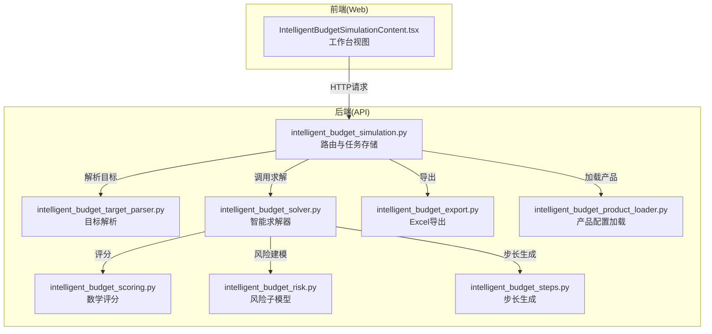
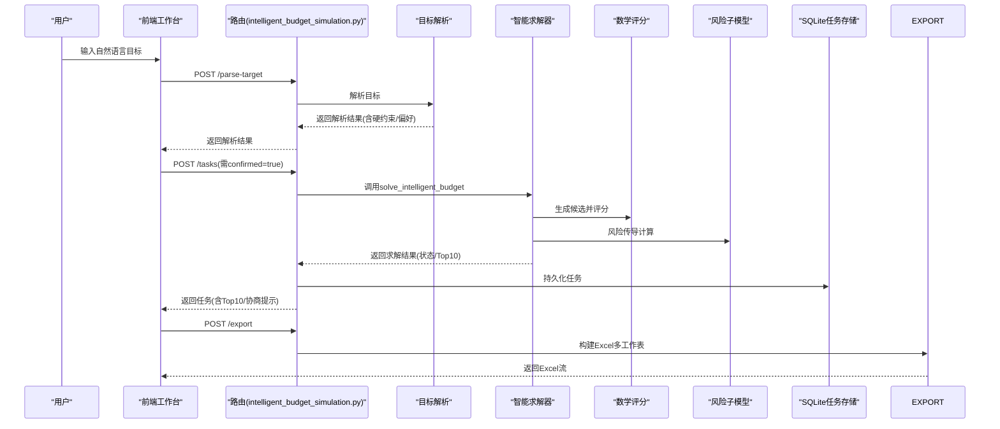
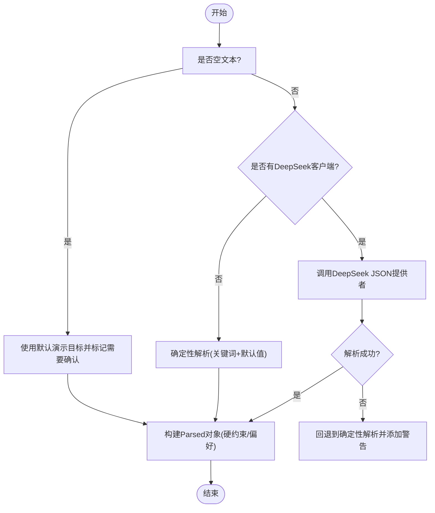
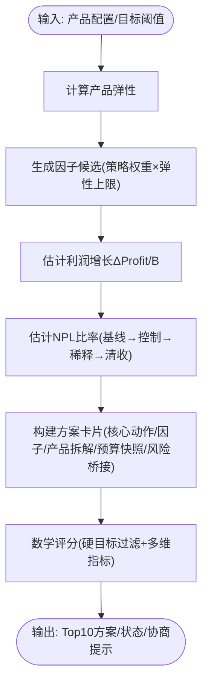
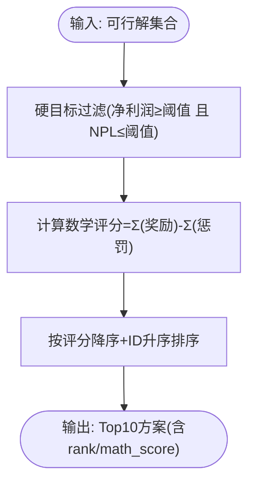
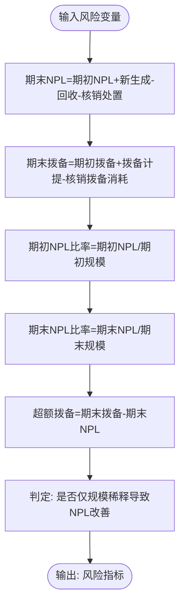
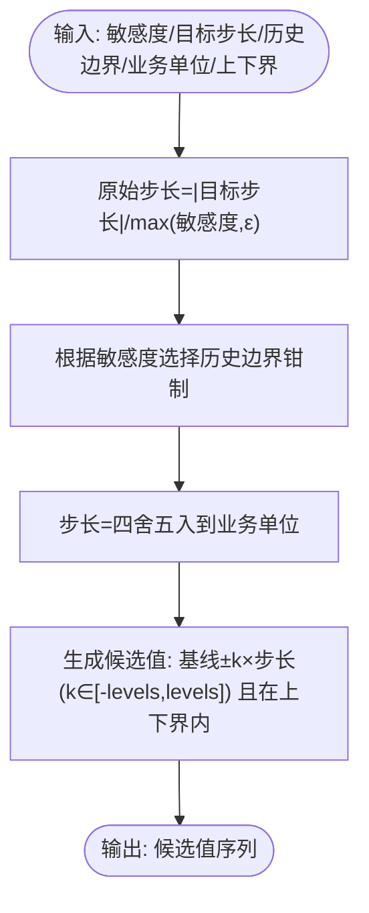
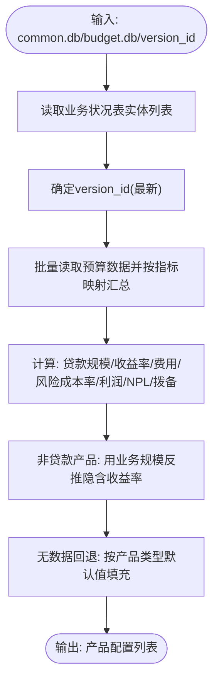
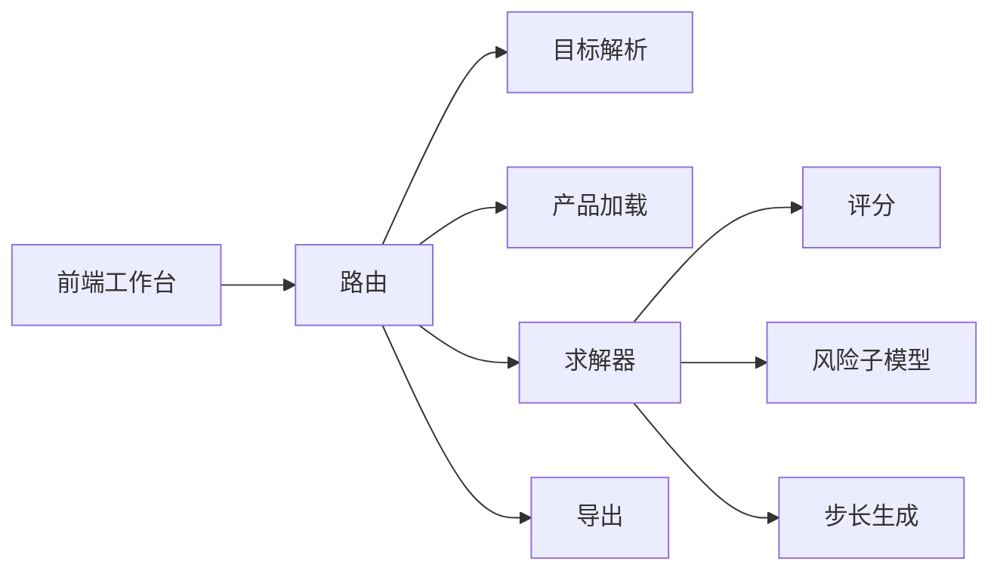

# 智能预算模拟模块

<cite>
**本文档引用的文件**
- [apps/api/app/services/intelligent_budget_target_parser.py](file://apps/api/app/services/intelligent_budget_target_parser.py)
- [apps/api/app/services/intelligent_budget_solver.py](file://apps/api/app/services/intelligent_budget_solver.py)
- [apps/api/app/services/intelligent_budget_scoring.py](file://apps/api/app/services/intelligent_budget_scoring.py)
- [apps/api/app/services/intelligent_budget_risk.py](file://apps/api/app/services/intelligent_budget_risk.py)
- [apps/api/app/services/intelligent_budget_steps.py](file://apps/api/app/services/intelligent_budget_steps.py)
- [apps/api/app/services/intelligent_budget_export.py](file://apps/api/app/services/intelligent_budget_export.py)
- [apps/api/app/services/intelligent_budget_product_loader.py](file://apps/api/app/services/intelligent_budget_product_loader.py)
- [apps/api/app/routers/intelligent_budget_simulation.py](file://apps/api/app/routers/intelligent_budget_simulation.py)
- [apps/web/src/app/components/IntelligentBudgetSimulationContent.tsx](file://apps/web/src/app/components/IntelligentBudgetSimulationContent.tsx)
- [apps/api/test_intelligent_budget_simulation_core.py](file://apps/api/test_intelligent_budget_simulation_core.py)
- [apps/api/test_intelligent_budget_simulation_solver.py](file://apps/api/test_intelligent_budget_simulation_solver.py)
- [docs/superpowers/plans/2026-06-12-intelligent-budget-simulation.md](file://docs/superpowers/plans/2026-06-12-intelligent-budget-simulation.md)
</cite>

## 目录
1. [简介](#简介)
2. [项目结构](#项目结构)
3. [核心组件](#核心组件)
4. [架构总览](#架构总览)
5. [详细组件分析](#详细组件分析)
6. [依赖关系分析](#依赖关系分析)
7. [性能考虑](#性能考虑)
8. [故障排除指南](#故障排除指南)
9. [结论](#结论)
10. [附录](#附录)

## 简介
智能预算模拟模块是一个AI驱动的预算推演系统，面向银行管理层提供“目标解析—因子生成—风险评估—评分排序—结果导出”的闭环能力。系统通过自然语言理解将领导目标转化为硬约束与偏好，结合产品弹性分析与风险子模型，自动生成差异化因子组合，进行数学评分与排序，最终输出Top 10方案卡片与Excel导出，支撑预算决策与风险控制。

## 项目结构
模块采用前后端分离架构，后端以FastAPI提供REST接口，前端React组件负责可视化与交互。核心服务包括目标解析、求解器、评分与导出，配合数据库产品配置加载与风险子模型。

图表来源
- [apps/api/app/routers/intelligent_budget_simulation.py:116-178](file://apps/api/app/routers/intelligent_budget_simulation.py#L116-L178)
- [apps/api/app/services/intelligent_budget_target_parser.py:117-150](file://apps/api/app/services/intelligent_budget_target_parser.py#L117-L150)
- [apps/api/app/services/intelligent_budget_solver.py:642-731](file://apps/api/app/services/intelligent_budget_solver.py#L642-L731)
- [apps/api/app/services/intelligent_budget_scoring.py:63-88](file://apps/api/app/services/intelligent_budget_scoring.py#L63-L88)
- [apps/api/app/services/intelligent_budget_risk.py:37-67](file://apps/api/app/services/intelligent_budget_risk.py#L37-L67)
- [apps/api/app/services/intelligent_budget_steps.py:45-81](file://apps/api/app/services/intelligent_budget_steps.py#L45-L81)
- [apps/api/app/services/intelligent_budget_export.py:26-157](file://apps/api/app/services/intelligent_budget_export.py#L26-L157)
- [apps/api/app/services/intelligent_budget_product_loader.py:16-151](file://apps/api/app/services/intelligent_budget_product_loader.py#L16-L151)

章节来源
- [apps/api/app/routers/intelligent_budget_simulation.py:1-178](file://apps/api/app/routers/intelligent_budget_simulation.py#L1-L178)
- [apps/web/src/app/components/IntelligentBudgetSimulationContent.tsx:326-532](file://apps/web/src/app/components/IntelligentBudgetSimulationContent.tsx#L326-L532)

## 核心组件
- 目标解析器：将自然语言目标解析为硬约束与偏好，支持AI解析与确定性回退。
- 智能求解器：基于产品弹性自动生成差异化因子组合，估计利润增长与NPL比率，构建方案卡片。
- 数学评分：硬目标过滤+多维度指标评分，输出Top 10方案。
- 风险子模型：基于期初/期末规模、新生成不良、回收清收、拨备变动推导风险指标。
- 步长生成：公式感知的自适应步长生成，结合历史合理边界与业务单位取整。
- 产品配置加载：从数据库动态加载产品配置，替代硬编码。
- Excel导出：将目标、步骤摘要、预算快照、Top 10、因子组合、产品拆解、风险传导、协商记录导出为多工作表。

章节来源
- [apps/api/app/services/intelligent_budget_target_parser.py:32-150](file://apps/api/app/services/intelligent_budget_target_parser.py#L32-L150)
- [apps/api/app/services/intelligent_budget_solver.py:23-731](file://apps/api/app/services/intelligent_budget_solver.py#L23-L731)
- [apps/api/app/services/intelligent_budget_scoring.py:13-88](file://apps/api/app/services/intelligent_budget_scoring.py#L13-L88)
- [apps/api/app/services/intelligent_budget_risk.py:7-67](file://apps/api/app/services/intelligent_budget_risk.py#L7-L67)
- [apps/api/app/services/intelligent_budget_steps.py:7-81](file://apps/api/app/services/intelligent_budget_steps.py#L7-L81)
- [apps/api/app/services/intelligent_budget_product_loader.py:16-151](file://apps/api/app/services/intelligent_budget_product_loader.py#L16-L151)
- [apps/api/app/services/intelligent_budget_export.py:26-157](file://apps/api/app/services/intelligent_budget_export.py#L26-L157)

## 架构总览
系统采用“边界-服务-数据”分层：
- 边界层：FastAPI路由负责请求解析、任务持久化、导出响应。
- 服务层：目标解析、求解、评分、风险、步长、导出等纯函数服务。
- 数据层：SQLite任务存储、数据库产品配置加载。

图表来源
- [apps/api/app/routers/intelligent_budget_simulation.py:129-178](file://apps/api/app/routers/intelligent_budget_simulation.py#L129-L178)
- [apps/api/app/services/intelligent_budget_target_parser.py:117-150](file://apps/api/app/services/intelligent_budget_target_parser.py#L117-L150)
- [apps/api/app/services/intelligent_budget_solver.py:642-731](file://apps/api/app/services/intelligent_budget_solver.py#L642-L731)
- [apps/api/app/services/intelligent_budget_scoring.py:63-88](file://apps/api/app/services/intelligent_budget_scoring.py#L63-L88)
- [apps/api/app/services/intelligent_budget_risk.py:37-67](file://apps/api/app/services/intelligent_budget_risk.py#L37-L67)
- [apps/api/app/services/intelligent_budget_export.py:26-157](file://apps/api/app/services/intelligent_budget_export.py#L26-L157)

## 详细组件分析

### 目标解析器（自然语言理解与边界）
- AI解析边界：DeepSeek JSON提供者，严格JSON Schema，失败回退至确定性解析。
- 确定性解析：关键词匹配百分比、稳健/规模/风险偏好提取，默认值填充。
- 输出：ParsedIntelligentBudgetTarget包含min_net_profit_growth、max_npl_ratio、硬约束字典、软偏好、可调因子列表、是否需要确认、警告信息。

图表来源
- [apps/api/app/services/intelligent_budget_target_parser.py:117-150](file://apps/api/app/services/intelligent_budget_target_parser.py#L117-L150)

章节来源
- [apps/api/app/services/intelligent_budget_target_parser.py:13-150](file://apps/api/app/services/intelligent_budget_target_parser.py#L13-L150)
- [apps/api/test_intelligent_budget_simulation_solver.py:51-85](file://apps/api/test_intelligent_budget_simulation_solver.py#L51-L85)

### 智能求解器（因子生成、估计与方案构建）
- 产品弹性分析：基于贷款规模、收益率、费用、风险成本率计算每产品对规模、收益率、风险、费用的边际利润贡献。
- 因子候选生成：基于组合层面弹性上限与策略权重，自动生成差异化因子向量，覆盖利润增长区间。
- 利润增长估计：线性叠加各产品弹性贡献，加入清收改善与拨备变动影响。
- NPL比率估计：基线NPL经风险控制、规模稀释、清收改善调整，设置上下限。
- 风险传导：期初规模/不良/拨备→新生成不良→回收清收→期末不良/拨备→推导NPL比率。
- 方案卡片：包含核心动作、因子变动、Top5产品贡献、预算快照、风险桥接、推荐理由、显示角色。

图表来源
- [apps/api/app/services/intelligent_budget_solver.py:126-175](file://apps/api/app/services/intelligent_budget_solver.py#L126-L175)
- [apps/api/app/services/intelligent_budget_solver.py:182-272](file://apps/api/app/services/intelligent_budget_solver.py#L182-L272)
- [apps/api/app/services/intelligent_budget_solver.py:283-332](file://apps/api/app/services/intelligent_budget_solver.py#L283-L332)
- [apps/api/app/services/intelligent_budget_solver.py:339-371](file://apps/api/app/services/intelligent_budget_solver.py#L339-L371)
- [apps/api/app/services/intelligent_budget_solver.py:404-427](file://apps/api/app/services/intelligent_budget_solver.py#L404-L427)
- [apps/api/app/services/intelligent_budget_solver.py:595-635](file://apps/api/app/services/intelligent_budget_solver.py#L595-L635)
- [apps/api/app/services/intelligent_budget_scoring.py:63-88](file://apps/api/app/services/intelligent_budget_scoring.py#L63-L88)

章节来源
- [apps/api/app/services/intelligent_budget_solver.py:126-731](file://apps/api/app/services/intelligent_budget_solver.py#L126-L731)
- [apps/api/test_intelligent_budget_simulation_solver.py:87-163](file://apps/api/test_intelligent_budget_simulation_solver.py#L87-L163)

### 数学评分与排序（硬目标过滤与综合打分）
- 硬目标过滤：仅保留净利润增长率≥阈值且NPL比率≤阈值的可行解。
- 综合打分：目标距离惩罚、NPL边际奖励、超额拨备缓冲、差异性得分、运营扰动、历史偏离、产品拆解惩罚、风险行动难度。
- 排序：按数学评分降序，评分相同时按方案ID升序。

图表来源
- [apps/api/app/services/intelligent_budget_scoring.py:35-88](file://apps/api/app/services/intelligent_budget_scoring.py#L35-L88)
- [apps/api/test_intelligent_budget_simulation_core.py:100-146](file://apps/api/test_intelligent_budget_simulation_core.py#L100-L146)

章节来源
- [apps/api/app/services/intelligent_budget_scoring.py:13-88](file://apps/api/app/services/intelligent_budget_scoring.py#L13-L88)
- [apps/api/test_intelligent_budget_simulation_core.py:100-146](file://apps/api/test_intelligent_budget_simulation_core.py#L100-L146)

### 风险子模型（拨备/减值与NPL推导）
- 输入：期初贷款规模、期末规模、期初NPL、新生成不良、回收清收、核销处置、期初拨备、拨备计提、核销拨备消耗。
- 输出：期末NPL、期末NPL比率、期末拨备、超额拨备、是否仅由规模稀释导致NPL改善。

图表来源
- [apps/api/app/services/intelligent_budget_risk.py:37-67](file://apps/api/app/services/intelligent_budget_risk.py#L37-L67)

章节来源
- [apps/api/app/services/intelligent_budget_risk.py:7-67](file://apps/api/app/services/intelligent_budget_risk.py#L7-L67)
- [apps/api/test_intelligent_budget_simulation_core.py:14-54](file://apps/api/test_intelligent_budget_simulation_core.py#L14-L54)

### 步长生成（公式感知与业务单位取整）
- 输入：变量基线值、敏感度、目标步长、历史合理边界、业务单位、上下界、两侧层级数。
- 方法：根据敏感度与目标步长计算原始步长，结合历史边界与业务单位取整，生成候选值序列。

图表来源
- [apps/api/app/services/intelligent_budget_steps.py:45-81](file://apps/api/app/services/intelligent_budget_steps.py#L45-L81)

章节来源
- [apps/api/app/services/intelligent_budget_steps.py:7-81](file://apps/api/app/services/intelligent_budget_steps.py#L7-L81)
- [apps/api/test_intelligent_budget_simulation_core.py:56-98](file://apps/api/test_intelligent_budget_simulation_core.py#L56-L98)

### 产品配置加载（数据库驱动）
- 从运行指标树与预算数据表读取产品年度合计，计算贷款规模、收益率、费用、风险成本率、利润、期初NPL与拨备等。
- 支持非贷款产品（存款、财富管理、司库）以业务规模反推隐含收益率。
- 当数据库无数据时，按产品类型提供合理默认值。

图表来源
- [apps/api/app/services/intelligent_budget_product_loader.py:16-151](file://apps/api/app/services/intelligent_budget_product_loader.py#L16-L151)
- [apps/api/app/services/intelligent_budget_product_loader.py:207-271](file://apps/api/app/services/intelligent_budget_product_loader.py#L207-L271)
- [apps/api/app/services/intelligent_budget_product_loader.py:273-425](file://apps/api/app/services/intelligent_budget_product_loader.py#L273-L425)

章节来源
- [apps/api/app/services/intelligent_budget_product_loader.py:16-425](file://apps/api/app/services/intelligent_budget_product_loader.py#L16-L425)
- [apps/api/test_intelligent_budget_simulation_solver.py:165-200](file://apps/api/test_intelligent_budget_simulation_solver.py#L165-L200)

### Excel导出（多工作表）
- 目标与约束、步长摘要、预算结果快照、Top10方案、二层因子、产品拆解、风险传导、协商记录。
- 统一样式与列宽，亿元单位格式化。

章节来源
- [apps/api/app/services/intelligent_budget_export.py:26-157](file://apps/api/app/services/intelligent_budget_export.py#L26-L157)

### 前端工作台（交互与展示）
- 目标解析、确认、求解、导出全流程。
- 展示Top4重点方案卡片、资产负债/利润/风险关键指标对比、风险传导详情、产品拆解Top5。
- 支持协商状态提示与建议。

章节来源
- [apps/web/src/app/components/IntelligentBudgetSimulationContent.tsx:326-532](file://apps/web/src/app/components/IntelligentBudgetSimulationContent.tsx#L326-L532)

## 依赖关系分析
- 路由依赖：解析器、求解器、产品加载器、导出器。
- 求解器依赖：评分器、目标阈值、产品弹性、风险子模型、步长生成。
- 评分器依赖：阈值、运营扰动、历史偏离、产品拆解惩罚、风险行动难度、超额拨备缓冲、差异性得分。
- 风险子模型独立，被求解器与导出器复用。
- 前端依赖：API封装、Excel下载工具。

图表来源
- [apps/api/app/routers/intelligent_budget_simulation.py:116-178](file://apps/api/app/routers/intelligent_budget_simulation.py#L116-L178)
- [apps/api/app/services/intelligent_budget_solver.py:11-16](file://apps/api/app/services/intelligent_budget_solver.py#L11-L16)
- [apps/api/app/services/intelligent_budget_scoring.py:11-15](file://apps/api/app/services/intelligent_budget_scoring.py#L11-L15)

章节来源
- [apps/api/app/routers/intelligent_budget_simulation.py:1-178](file://apps/api/app/routers/intelligent_budget_simulation.py#L1-L178)
- [apps/api/app/services/intelligent_budget_solver.py:1-731](file://apps/api/app/services/intelligent_budget_solver.py#L1-L731)

## 性能考虑
- 产品弹性与候选生成：O(P)与策略数量，策略模板固定，整体线性。
- 评分与排序：O(S log S)，S为可行解数量，Top10截断可减少排序开销。
- 风险建模：常数时间，单次调用开销极低。
- 数据库加载：批量读取+汇总，注意SQLite连接与游标使用。
- 前端渲染：卡片与表格按需渲染，避免全量重绘。

## 故障排除指南
- 目标解析失败：检查DeepSeek客户端是否启用与返回格式，必要时回退到确定性解析。
- 无可行方案：检查目标阈值是否过高或产品池弹性不足，关注协商提示与建议。
- 数据库缺失：确认common.db与budget_db路径与版本ID存在。
- 导出异常：检查任务是否存在、工作表数据完整性。

章节来源
- [apps/api/app/services/intelligent_budget_target_parser.py:97-150](file://apps/api/app/services/intelligent_budget_target_parser.py#L97-L150)
- [apps/api/app/routers/intelligent_budget_simulation.py:162-178](file://apps/api/app/routers/intelligent_budget_simulation.py#L162-L178)
- [apps/api/test_intelligent_budget_simulation_solver.py:149-200](file://apps/api/test_intelligent_budget_simulation_solver.py#L149-L200)

## 结论
智能预算模拟模块通过“自然语言目标解析—产品弹性驱动的因子生成—数学评分与排序—风险传导建模—多工作表导出”的完整链路，实现了从目标到方案的自动化与可解释化。系统具备强鲁棒性（AI解析失败回退）、强扩展性（策略模板可插拔、产品池可替换）与强可视化（前端工作台与Excel导出），能够有效支撑成本优化、收入增长、资源配置等预算场景，并与预算预测模块形成协同。

## 附录

### 模拟场景示例
- 成本优化：侧重费用压缩策略，降低运营扰动与历史偏离，提升数学评分。
- 收入增长：侧重规模拉动与收益率改善策略，关注NPL比率与拨备压力。
- 资源配置：侧重结构优化与重点产品拉动，提升产品边际贡献与差异性得分。

### 与预算预测模块的集成
- 目标解析：预算预测模块可提供驱动因素与预测口径，智能预算模拟据此生成因子组合。
- 产品配置：预算预测模块的指标树与预算数据为产品加载器提供数据基础。
- 结果协同：预算预测模块关注“预测-预算”达成与同比，智能预算模拟关注“目标达成-风险控制-扰动最小”。

### 复杂业务约束与优先级冲突处理
- 硬约束优先：净利润与NPL硬阈值必须满足，不参与自动松弛。
- 软偏好：稳健经营、规模不冒进、风险不激进等偏好纳入评分权重。
- 协商机制：当可行方案不足时，给出放宽目标或分阶段达成建议。

章节来源
- [apps/api/app/services/intelligent_budget_target_parser.py:13-29](file://apps/api/app/services/intelligent_budget_target_parser.py#L13-L29)
- [apps/api/app/services/intelligent_budget_solver.py:710-731](file://apps/api/app/services/intelligent_budget_solver.py#L710-L731)
- [apps/api/test_intelligent_budget_simulation_solver.py:149-163](file://apps/api/test_intelligent_budget_simulation_solver.py#L149-L163)