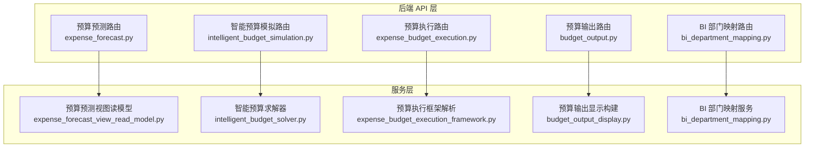
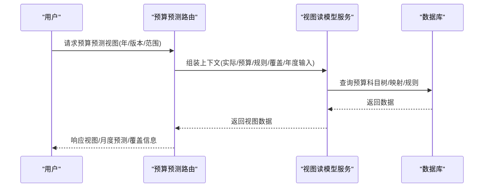
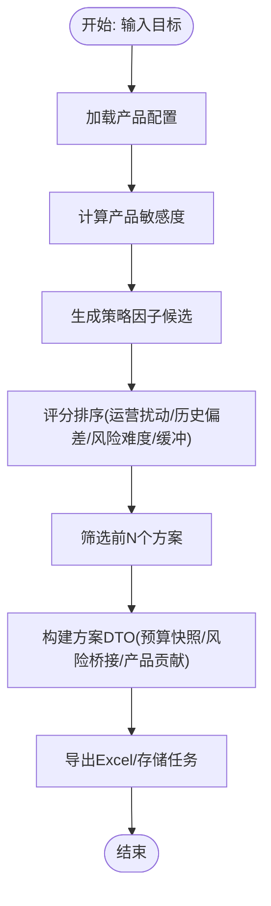
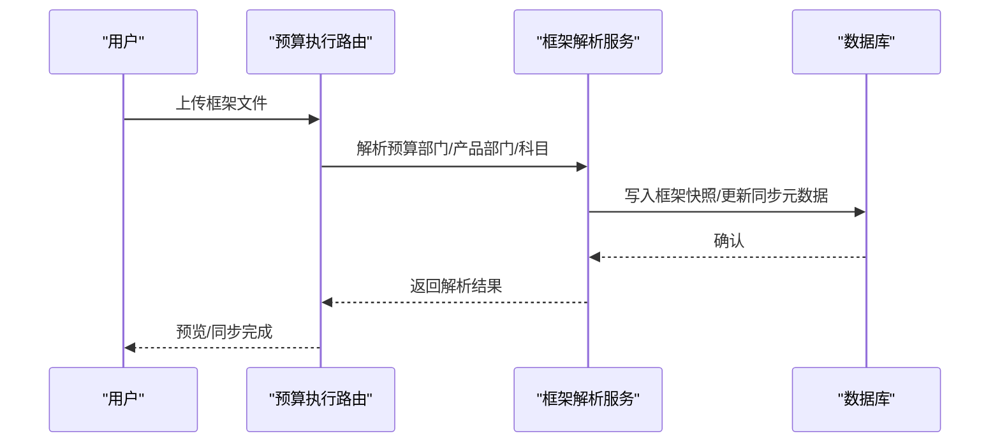
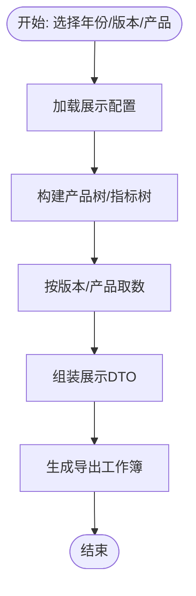
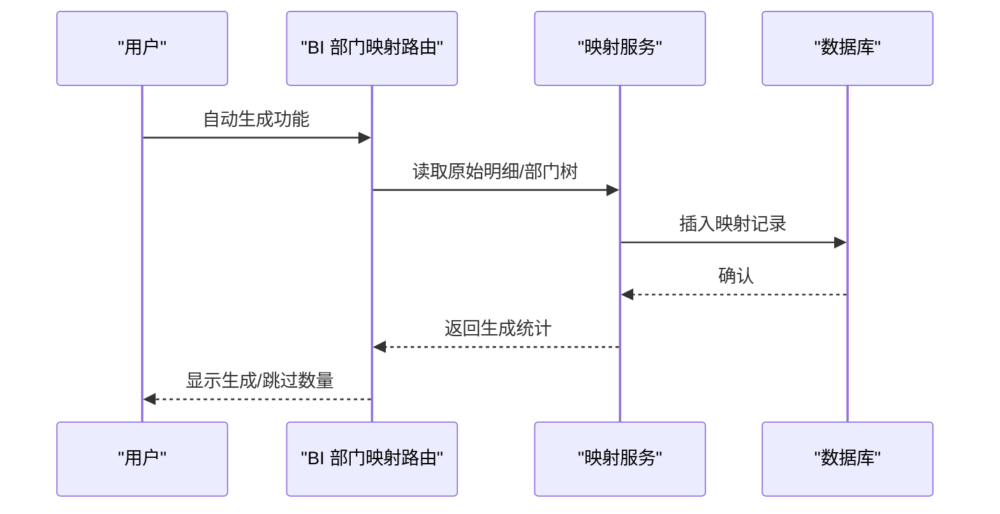
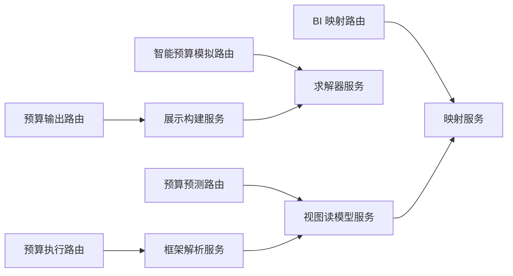

# 核心功能模块

<cite>
**本文档引用的文件**
- [apps/api/app/routers/expense_forecast.py](file://apps/api/app/routers/expense_forecast.py)
- [apps/api/app/services/expense_forecast_view_read_model.py](file://apps/api/app/services/expense_forecast_view_read_model.py)
- [apps/api/app/routers/intelligent_budget_simulation.py](file://apps/api/app/routers/intelligent_budget_simulation.py)
- [apps/api/app/services/intelligent_budget_solver.py](file://apps/api/app/services/intelligent_budget_solver.py)
- [apps/api/app/routers/expense_budget_execution.py](file://apps/api/app/routers/expense_budget_execution.py)
- [apps/api/app/services/expense_budget_execution_framework.py](file://apps/api/app/services/expense_budget_execution_framework.py)
- [apps/api/app/routers/budget_output.py](file://apps/api/app/routers/budget_output.py)
- [apps/api/app/services/budget_output_display.py](file://apps/api/app/services/budget_output_display.py)
- [apps/api/app/routers/bi_department_mapping.py](file://apps/api/app/routers/bi_department_mapping.py)
- [apps/api/app/services/bi_department_mapping.py](file://apps/api/app/services/bi_department_mapping.py)
</cite>

## 目录
1. [简介](#简介)
2. [项目结构](#项目结构)
3. [核心组件](#核心组件)
4. [架构概览](#架构概览)
5. [详细组件分析](#详细组件分析)
6. [依赖分析](#依赖分析)
7. [性能考虑](#性能考虑)
8. [故障排除指南](#故障排除指南)
9. [结论](#结论)
10. [附录](#附录)

## 简介
本文件面向智能预算预测系统的四大核心功能模块，系统性阐述预算预测模块（Expense Forecast）、智能预算模拟模块（Intelligent Budget Simulation）、预算执行模块（Expense Budget Execution）、预算输出模块（Budget Output），以及 BI 映射模块（BI Department Mapping）的功能定位、实现原理、技术架构与交互关系。文档同时提供使用场景与操作示例，帮助用户理解各模块在实际工作流中的作用与价值。

## 项目结构
系统采用前后端分离架构，后端以 FastAPI 提供 REST 接口，服务层封装业务规则与数据读写，路由层负责请求参数解析与响应组装。前端通过独立 Web 工程提供可视化界面，四个核心模块分别对应不同的路由命名空间与服务实现。

图表来源
- [apps/api/app/routers/expense_forecast.py:317-800](file://apps/api/app/routers/expense_forecast.py#L317-L800)
- [apps/api/app/services/expense_forecast_view_read_model.py:1-348](file://apps/api/app/services/expense_forecast_view_read_model.py#L1-L348)
- [apps/api/app/routers/intelligent_budget_simulation.py:1-178](file://apps/api/app/routers/intelligent_budget_simulation.py#L1-L178)
- [apps/api/app/services/intelligent_budget_solver.py:1-731](file://apps/api/app/services/intelligent_budget_solver.py#L1-L731)
- [apps/api/app/routers/expense_budget_execution.py:1-201](file://apps/api/app/routers/expense_budget_execution.py#L1-L201)
- [apps/api/app/services/expense_budget_execution_framework.py:1-749](file://apps/api/app/services/expense_budget_execution_framework.py#L1-L749)
- [apps/api/app/routers/budget_output.py:1-163](file://apps/api/app/routers/budget_output.py#L1-L163)
- [apps/api/app/services/budget_output_display.py:1-800](file://apps/api/app/services/budget_output_display.py#L1-L800)
- [apps/api/app/routers/bi_department_mapping.py:1-50](file://apps/api/app/routers/bi_department_mapping.py#L1-L50)
- [apps/api/app/services/bi_department_mapping.py:1-215](file://apps/api/app/services/bi_department_mapping.py#L1-L215)

章节来源
- [apps/api/app/routers/expense_forecast.py:317-800](file://apps/api/app/routers/expense_forecast.py#L317-L800)
- [apps/api/app/routers/intelligent_budget_simulation.py:1-178](file://apps/api/app/routers/intelligent_budget_simulation.py#L1-L178)
- [apps/api/app/routers/expense_budget_execution.py:1-201](file://apps/api/app/routers/expense_budget_execution.py#L1-L201)
- [apps/api/app/routers/budget_output.py:1-163](file://apps/api/app/routers/budget_output.py#L1-L163)
- [apps/api/app/routers/bi_department_mapping.py:1-50](file://apps/api/app/routers/bi_department_mapping.py#L1-L50)

## 核心组件
- 预算预测模块（Expense Forecast）
  - 功能：提供预算预测数据的查看、导入预览、应用导入、单元格写入、规则配置与模拟、追踪溯源等功能。
  - 关键接口：视图读取、规则保存/复制/导入、计算重算、覆盖写入、导出等。
  - 数据模型：包含预算科目树、规则定义、计算结果、覆盖项、年度输入/预算/实际等映射。
- 智能预算模拟模块（Intelligent Budget Simulation）
  - 功能：基于产品弹性与多策略因子，自动生成差异化预算方案，支持目标解析、求解、任务持久化与导出。
  - 关键接口：目标解析、任务创建、查询任务、导出任务。
  - 算法：产品敏感度分析、动态因子生成、利润增长估计、NPL 风险估计、评分排序与展示角色标注。
- 预算执行模块（Expense Budget Execution）
  - 功能：提供预算执行报表的查询、状态、框架解析与同步、导出等能力。
  - 关键接口：报表查询、状态查询、框架预览/同步、导出。
  - 数据模型：预算部门/产品部门/科目框架、上下文映射、范围匹配。
- 预算输出模块（Budget Output）
  - 功能：预算输出展示配置的导入/导出、重建、增删改查，以及多版本预算/预测的汇总展示与导出。
  - 关键接口：配置 CRUD、展示报表、全量导出。
  - 数据模型：展示配置项、产品树、版本信息、指标节点与绑定关系。
- BI 映射模块（BI Department Mapping）
  - 功能：维护“归口管理部门”到“费用归属部门”的映射，支持自动生成功能与参考数据。
  - 关键接口：列表、创建、更新、删除、自动生成功能、参考数据。
  - 数据模型：映射记录、部门树、原始明细匹配。

章节来源
- [apps/api/app/routers/expense_forecast.py:1-800](file://apps/api/app/routers/expense_forecast.py#L1-L800)
- [apps/api/app/services/expense_forecast_view_read_model.py:1-348](file://apps/api/app/services/expense_forecast_view_read_model.py#L1-L348)
- [apps/api/app/routers/intelligent_budget_simulation.py:1-178](file://apps/api/app/routers/intelligent_budget_simulation.py#L1-L178)
- [apps/api/app/services/intelligent_budget_solver.py:1-731](file://apps/api/app/services/intelligent_budget_solver.py#L1-L731)
- [apps/api/app/routers/expense_budget_execution.py:1-201](file://apps/api/app/routers/expense_budget_execution.py#L1-L201)
- [apps/api/app/services/expense_budget_execution_framework.py:1-749](file://apps/api/app/services/expense_budget_execution_framework.py#L1-L749)
- [apps/api/app/routers/budget_output.py:1-163](file://apps/api/app/routers/budget_output.py#L1-L163)
- [apps/api/app/services/budget_output_display.py:1-800](file://apps/api/app/services/budget_output_display.py#L1-L800)
- [apps/api/app/routers/bi_department_mapping.py:1-50](file://apps/api/app/routers/bi_department_mapping.py#L1-L50)
- [apps/api/app/services/bi_department_mapping.py:1-215](file://apps/api/app/services/bi_department_mapping.py#L1-L215)

## 架构概览
四个核心模块围绕统一的数据与服务层协作，形成“路由 → 服务 → 数据库/外部系统”的清晰分层。预算预测与执行模块侧重“预测/执行数据”的读写与计算；智能预算模拟模块侧重“策略因子生成与求解”；预算输出模块负责“多版本/多维度的展示与导出”；BI 映射模块提供“部门维度的归口与归属映射”。

```mermaid
graph TB
subgraph "预算预测模块"
EF_R["路由: 预算预测<br/>expense_forecast.py"]
EF_SRM["服务: 视图读模型<br/>expense_forecast_view_read_model.py"]
EF_R --> EF_SRM
end
subgraph "智能预算模拟模块"
IS_R["路由: 智能预算模拟<br/>intelligent_budget_simulation.py"]
IS_S["服务: 求解器<br/>intelligent_budget_solver.py"]
IS_R --> IS_S
end
subgraph "预算执行模块"
BE_R["路由: 预算执行<br/>expense_budget_execution.py"]
BE_SF["服务: 框架解析<br/>expense_budget_execution_framework.py"]
BE_R --> BE_SF
end
subgraph "预算输出模块"
BO_R["路由: 预算输出<br/>budget_output.py"]
BO_S["服务: 展示构建<br/>budget_output_display.py"]
BO_R --> BO_S
end
subgraph "BI 映射模块"
BM_R["路由: BI 部门映射<br/>bi_department_mapping.py"]
BM_S["服务: 映射维护<br/>bi_department_mapping.py"]
BM_R --> BM_S
end
```

图表来源
- [apps/api/app/routers/expense_forecast.py:317-800](file://apps/api/app/routers/expense_forecast.py#L317-L800)
- [apps/api/app/services/expense_forecast_view_read_model.py:1-348](file://apps/api/app/services/expense_forecast_view_read_model.py#L1-L348)
- [apps/api/app/routers/intelligent_budget_simulation.py:1-178](file://apps/api/app/routers/intelligent_budget_simulation.py#L1-L178)
- [apps/api/app/services/intelligent_budget_solver.py:1-731](file://apps/api/app/services/intelligent_budget_solver.py#L1-L731)
- [apps/api/app/routers/expense_budget_execution.py:1-201](file://apps/api/app/routers/expense_budget_execution.py#L1-L201)
- [apps/api/app/services/expense_budget_execution_framework.py:1-749](file://apps/api/app/services/expense_budget_execution_framework.py#L1-L749)
- [apps/api/app/routers/budget_output.py:1-163](file://apps/api/app/routers/budget_output.py#L1-L163)
- [apps/api/app/services/budget_output_display.py:1-800](file://apps/api/app/services/budget_output_display.py#L1-L800)
- [apps/api/app/routers/bi_department_mapping.py:1-50](file://apps/api/app/routers/bi_department_mapping.py#L1-L50)
- [apps/api/app/services/bi_department_mapping.py:1-215](file://apps/api/app/services/bi_department_mapping.py#L1-L215)

## 详细组件分析

### 预算预测模块（Expense Forecast）
- 业务价值
  - 提供预算预测数据的可视化与编辑入口，支持规则驱动的自动计算、覆盖写入与回溯追踪，支撑预测准确性与可解释性。
- 技术实现
  - 路由层聚合数据上下文（实际/预算/规则/覆盖/年度输入），构建视图读模型，返回层级化预算科目树与月度预测值。
  - 支持规则导入/复制/保存、计算重算、覆盖写入、导入预览与应用、导出等。
- 与其他模块交互
  - 与 BI 映射模块协同，依据“归口管理部门”确定有效预算科目与计算范围。
  - 与预算输出模块共享预算版本与指标绑定，保证展示一致性。
- 使用场景与示例
  - 场景一：按“实体/集团/负责人”维度查看预测视图，编辑“月度预测/业务提交/资本建议”等字段。
  - 场景二：批量导入预测数据，先进行预览检查，再应用导入并触发重算。
  - 场景三：针对特定月份设置覆盖值并填写原因，便于审计与追溯。

图表来源
- [apps/api/app/routers/expense_forecast.py:317-800](file://apps/api/app/routers/expense_forecast.py#L317-L800)
- [apps/api/app/services/expense_forecast_view_read_model.py:1-348](file://apps/api/app/services/expense_forecast_view_read_model.py#L1-L348)

章节来源
- [apps/api/app/routers/expense_forecast.py:1-800](file://apps/api/app/routers/expense_forecast.py#L1-L800)
- [apps/api/app/services/expense_forecast_view_read_model.py:1-348](file://apps/api/app/services/expense_forecast_view_read_model.py#L1-L348)

### 智能预算模拟模块（Intelligent Budget Simulation）
- 业务价值
  - 将产品弹性转化为差异化策略因子，自动生成满足目标约束的预算方案集合，辅助管理层进行目标达成与风险平衡的决策。
- 技术实现
  - 产品敏感度分析：基于贷款规模、收益率、风险成本率、费用等指标计算边际利润贡献。
  - 动态因子生成：根据组合加权收益率与风险成本率推导因子上限，生成多种策略模板。
  - 利润增长估计与 NPL 风险估计：结合产品弹性与策略因子，估算利润增长率与新生成不良率。
  - 评分排序与展示角色：综合运营扰动、历史偏差、风险难度与缓冲等因素进行排序，标注推荐/风险优先/利润优先等角色。
- 与其他模块交互
  - 依赖产品配置数据（来自数据库加载），与预算输出模块共享展示配置与导出能力。
- 使用场景与示例
  - 场景一：输入领导目标（如净利润增长目标、NPL 上限），解析目标后自动求解生成多个方案。
  - 场景二：导出任务结果为 Excel，包含方案摘要、预算快照与风险桥接。

图表来源
- [apps/api/app/routers/intelligent_budget_simulation.py:1-178](file://apps/api/app/routers/intelligent_budget_simulation.py#L1-L178)
- [apps/api/app/services/intelligent_budget_solver.py:1-731](file://apps/api/app/services/intelligent_budget_solver.py#L1-L731)

章节来源
- [apps/api/app/routers/intelligent_budget_simulation.py:1-178](file://apps/api/app/routers/intelligent_budget_simulation.py#L1-L178)
- [apps/api/app/services/intelligent_budget_solver.py:1-731](file://apps/api/app/services/intelligent_budget_solver.py#L1-L731)

### 预算执行模块（Expense Budget Execution）
- 业务价值
  - 提供预算执行报表的查询与导出能力，支持框架解析与同步，保障执行数据与预算框架一致。
- 技术实现
  - 路由层提供报表查询、状态查询、框架预览/同步、导出等接口。
  - 服务层解析上传的框架文件（预算部门/产品部门/科目），建立上下文映射，支持范围匹配与可见性过滤。
- 与其他模块交互
  - 依赖部门科目维护与部门预算科目维护的主数据，与预算输出模块共享展示维度。
- 使用场景与示例
  - 场景一：上传框架文件进行预览，确认无误后同步至系统，生成同步元数据。
  - 场景二：按实体/集团/负责人维度查询预算执行报表，导出为 Excel。

图表来源
- [apps/api/app/routers/expense_budget_execution.py:1-201](file://apps/api/app/routers/expense_budget_execution.py#L1-L201)
- [apps/api/app/services/expense_budget_execution_framework.py:1-749](file://apps/api/app/services/expense_budget_execution_framework.py#L1-L749)

章节来源
- [apps/api/app/routers/expense_budget_execution.py:1-201](file://apps/api/app/routers/expense_budget_execution.py#L1-L201)
- [apps/api/app/services/expense_budget_execution_framework.py:1-749](file://apps/api/app/services/expense_budget_execution_framework.py#L1-L749)

### 预算输出模块（Budget Output）
- 业务价值
  - 将预算/预测多版本数据整合为统一的展示报表，支持配置化展示与全量导出，满足汇报与对比需求。
- 技术实现
  - 路由层提供配置 CRUD、展示报表查询、全量导出等接口。
  - 服务层构建产品树与指标树，解析版本规格，拼装展示 DTO 并生成导出工作簿。
- 与其他模块交互
  - 与预算预测/执行模块共享版本与指标绑定，确保展示一致性。
- 使用场景与示例
  - 场景一：导入展示配置，选择产品与指标，生成多版本对比报表。
  - 场景二：导出全量报表，包含预算/预测/实际等维度。

图表来源
- [apps/api/app/routers/budget_output.py:1-163](file://apps/api/app/routers/budget_output.py#L1-L163)
- [apps/api/app/services/budget_output_display.py:1-800](file://apps/api/app/services/budget_output_display.py#L1-L800)

章节来源
- [apps/api/app/routers/budget_output.py:1-163](file://apps/api/app/routers/budget_output.py#L1-L163)
- [apps/api/app/services/budget_output_display.py:1-800](file://apps/api/app/services/budget_output_display.py#L1-L800)

### BI 映射模块（BI Department Mapping）
- 业务价值
  - 统一“归口管理部门”与“费用归属部门”的映射关系，支撑预算预测与执行的维度一致性。
- 技术实现
  - 路由层提供映射 CRUD、自动生成功能与参考数据查询。
  - 服务层维护映射表，支持从原始明细中自动匹配生成，提供部门树与分组信息。
- 使用场景与示例
  - 场景一：自动从历史明细中生成映射，减少手工维护成本。
  - 场景二：手动创建/更新映射，确保预测与执行维度准确。

图表来源
- [apps/api/app/routers/bi_department_mapping.py:1-50](file://apps/api/app/routers/bi_department_mapping.py#L1-L50)
- [apps/api/app/services/bi_department_mapping.py:1-215](file://apps/api/app/services/bi_department_mapping.py#L1-L215)

章节来源
- [apps/api/app/routers/bi_department_mapping.py:1-50](file://apps/api/app/routers/bi_department_mapping.py#L1-L50)
- [apps/api/app/services/bi_department_mapping.py:1-215](file://apps/api/app/services/bi_department_mapping.py#L1-L215)

## 依赖分析
- 模块内聚与耦合
  - 预算预测模块与 BI 映射模块存在维度关联（归口与归属），通过服务层的映射读取与上下文组装实现松耦合。
  - 智能预算模拟模块与预算输出模块在“产品配置/指标绑定”方面存在间接依赖，通过数据库层的公共表实现共享。
  - 预算执行模块与预算输出模块共享“版本/指标”概念，通过服务层的版本选择与指标解析实现复用。
- 外部依赖
  - 文件解析：预算执行模块依赖 Excel 解析库；预算预测模块支持导入预览与应用。
  - 数据库：各模块均通过 SQLite 访问 common.db 与预算库，确保数据一致性与隔离。
- 循环依赖
  - 当前设计避免循环依赖，路由层仅调用服务层，服务层内部通过协议/函数抽象进行数据装配。

图表来源
- [apps/api/app/routers/expense_forecast.py:317-800](file://apps/api/app/routers/expense_forecast.py#L317-L800)
- [apps/api/app/services/expense_forecast_view_read_model.py:1-348](file://apps/api/app/services/expense_forecast_view_read_model.py#L1-L348)
- [apps/api/app/routers/intelligent_budget_simulation.py:1-178](file://apps/api/app/routers/intelligent_budget_simulation.py#L1-L178)
- [apps/api/app/services/intelligent_budget_solver.py:1-731](file://apps/api/app/services/intelligent_budget_solver.py#L1-L731)
- [apps/api/app/routers/expense_budget_execution.py:1-201](file://apps/api/app/routers/expense_budget_execution.py#L1-L201)
- [apps/api/app/services/expense_budget_execution_framework.py:1-749](file://apps/api/app/services/expense_budget_execution_framework.py#L1-L749)
- [apps/api/app/routers/budget_output.py:1-163](file://apps/api/app/routers/budget_output.py#L1-L163)
- [apps/api/app/services/budget_output_display.py:1-800](file://apps/api/app/services/budget_output_display.py#L1-L800)
- [apps/api/app/routers/bi_department_mapping.py:1-50](file://apps/api/app/routers/bi_department_mapping.py#L1-L50)
- [apps/api/app/services/bi_department_mapping.py:1-215](file://apps/api/app/services/bi_department_mapping.py#L1-L215)

## 性能考虑
- 数据访问
  - 批量插入/更新：预算执行框架解析与预算输出配置导入采用批量 SQL，减少往返次数。
  - 缓存与上下文：预算预测视图读模型在单次请求内复用上下文映射，避免重复查询。
- 计算复杂度
  - 智能预算模拟模块的因子生成与评分排序为 O(N) 级别（N 为策略模板数），在合理范围内可控。
  - 预算输出模块的树构建与指标拼装为线性复杂度，受产品/指标规模影响。
- I/O 优化
  - 导出采用流式响应，避免一次性加载大文件到内存。
- 建议
  - 对高频查询建立必要的索引（如预算版本、指标节点、部门映射）。
  - 控制单次导入/导出的数据量，必要时分批处理。

## 故障排除指南
- 预算预测
  - 现象：视图读取失败或无预算科目树
  - 排查：确认预算科目维护与规则表初始化完成；检查 scope/owner 解析是否正确
- 智能预算模拟
  - 现象：求解结果不足或需要谈判
  - 排查：检查目标约束是否过于严格；放宽净利润增长或 NPL 上限后重新求解
- 预算执行
  - 现象：框架解析报错或同步失败
  - 排查：确认上传文件包含“预算部门/部门预算科目”工作表；检查主数据完整性
- 预算输出
  - 现象：导出为空或指标缺失
  - 排查：确认展示配置已激活；检查版本选择与产品范围
- BI 映射
  - 现象：自动生成功能无记录
  - 排查：确认历史明细中存在匹配的“归口/归属”记录；检查部门树是否完整

章节来源
- [apps/api/app/routers/expense_forecast.py:1-800](file://apps/api/app/routers/expense_forecast.py#L1-L800)
- [apps/api/app/routers/intelligent_budget_simulation.py:1-178](file://apps/api/app/routers/intelligent_budget_simulation.py#L1-L178)
- [apps/api/app/routers/expense_budget_execution.py:1-201](file://apps/api/app/routers/expense_budget_execution.py#L1-L201)
- [apps/api/app/routers/budget_output.py:1-163](file://apps/api/app/routers/budget_output.py#L1-L163)
- [apps/api/app/routers/bi_department_mapping.py:1-50](file://apps/api/app/routers/bi_department_mapping.py#L1-L50)

## 结论
四大核心模块围绕“预测—模拟—执行—输出”的闭环，形成完整的预算管理流程。预算预测模块提供数据基础与规则引擎，智能预算模拟模块提供策略生成与方案评估，预算执行模块保障数据一致性与可追溯性，预算输出模块实现多维展示与导出。BI 映射模块贯穿其中，确保部门维度的准确与一致。通过清晰的分层设计与服务抽象，系统具备良好的扩展性与可维护性。

## 附录
- 使用场景速览
  - 预算预测：按范围查看/编辑预测，导入预览与应用，设置覆盖并导出
  - 智能预算模拟：输入目标，生成方案，导出任务结果
  - 预算执行：上传/预览/同步框架，查询报表并导出
  - 预算输出：导入展示配置，生成多版本报表并导出
  - BI 映射：自动/手动维护归口与归属映射，提供参考数据