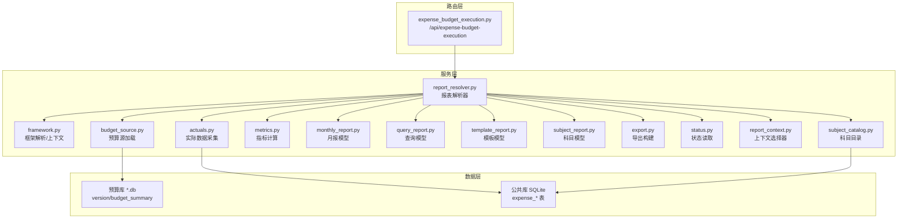
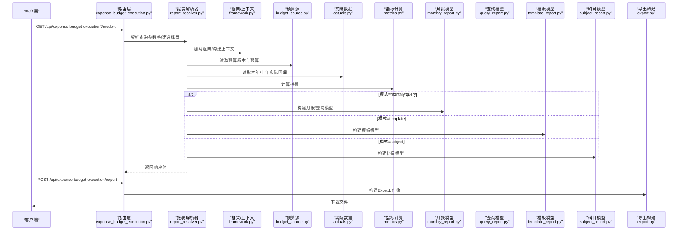
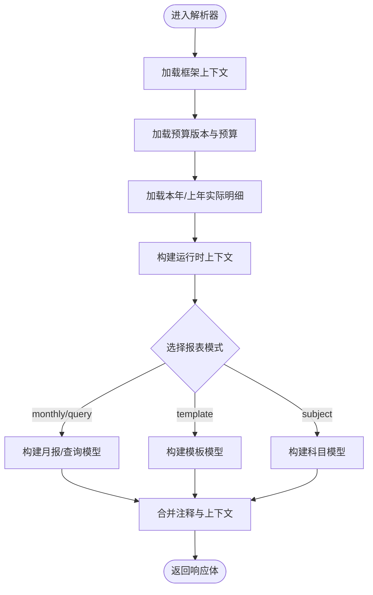
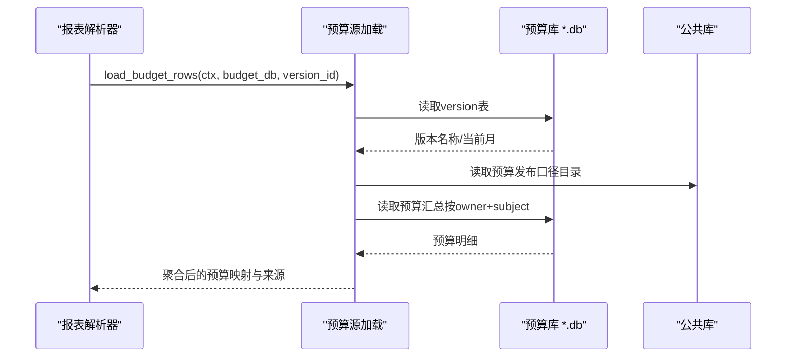
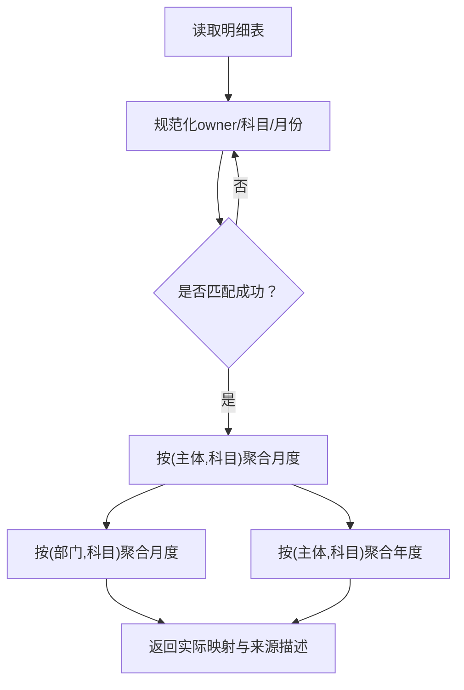
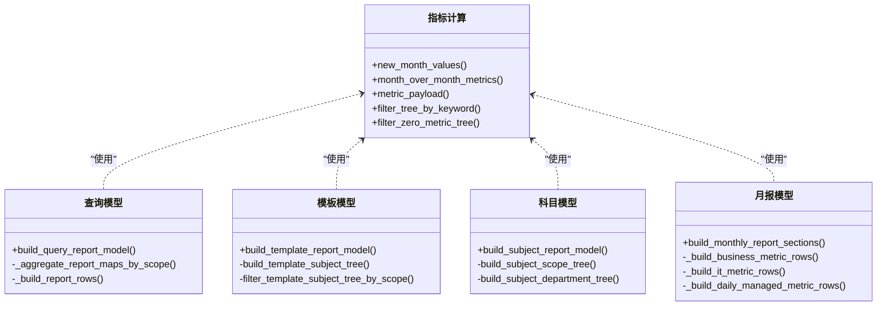
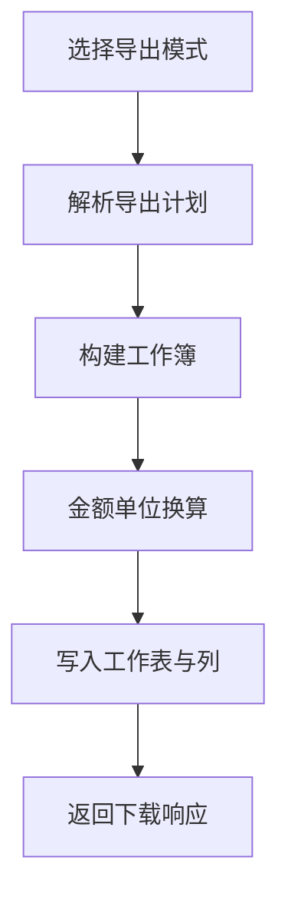
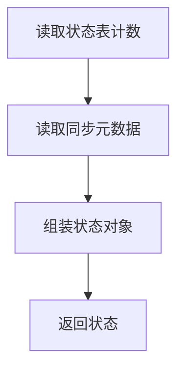
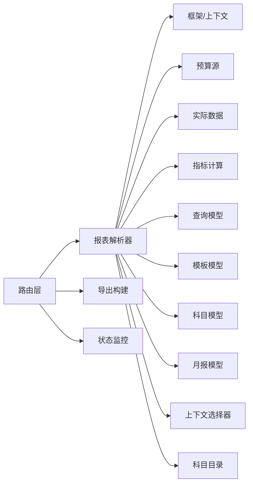

# 费用预算执行模块

<cite>
**本文档引用的文件**
- [apps/api/app/routers/expense_budget_execution.py](file://apps/api/app/routers/expense_budget_execution.py)
- [apps/api/app/services/expense_budget_execution_actuals.py](file://apps/api/app/services/expense_budget_execution_actuals.py)
- [apps/api/app/services/expense_budget_execution_metrics.py](file://apps/api/app/services/expense_budget_execution_metrics.py)
- [apps/api/app/services/expense_budget_execution_status.py](file://apps/api/app/services/expense_budget_execution_status.py)
- [apps/api/app/services/expense_budget_execution_framework.py](file://apps/api/app/services/expense_budget_execution_framework.py)
- [apps/api/app/services/expense_budget_execution_report_resolver.py](file://apps/api/app/services/expense_budget_execution_report_resolver.py)
- [apps/api/app/services/expense_budget_execution_export.py](file://apps/api/app/services/expense_budget_execution_export.py)
- [apps/api/app/services/expense_budget_execution_monthly_report.py](file://apps/api/app/services/expense_budget_execution_monthly_report.py)
- [apps/api/app/services/expense_budget_execution_query_report.py](file://apps/api/app/services/expense_budget_execution_query_report.py)
- [apps/api/app/services/expense_budget_execution_budget_source.py](file://apps/api/app/services/expense_budget_execution_budget_source.py)
- [apps/api/app/services/expense_budget_execution_report_context.py](file://apps/api/app/services/expense_budget_execution_report_context.py)
- [apps/api/app/services/expense_budget_execution_subject_catalog.py](file://apps/api/app/services/expense_budget_execution_subject_catalog.py)
- [apps/api/app/services/expense_budget_execution_template_report.py](file://apps/api/app/services/expense_budget_execution_template_report.py)
- [apps/api/app/services/expense_budget_execution_subject_report.py](file://apps/api/app/services/expense_budget_execution_subject_report.py)
</cite>

## 目录
1. [简介](#简介)
2. [项目结构](#项目结构)
3. [核心组件](#核心组件)
4. [架构总览](#架构总览)
5. [详细组件分析](#详细组件分析)
6. [依赖关系分析](#依赖关系分析)
7. [性能考虑](#性能考虑)
8. [故障排查指南](#故障排查指南)
9. [结论](#结论)
10. [附录](#附录)

## 简介
费用预算执行模块负责实现预算执行的全流程闭环：从预算框架与科目目录的加载，到实际数据采集与匹配，再到多维度执行指标计算、月报与模板报表生成、导出与可视化，以及状态监控与权限控制。模块支持多种报表模式（查询模式、模板模式、科目模式、平面模式），并提供金额单位换算、关键字过滤、零值行控制等功能，满足月度执行跟踪、部门预算监控、项目成本控制等典型场景。

## 项目结构
模块由三层组成：
- 路由层：暴露REST接口，接收查询参数与文件上传，协调服务层完成报表构建与导出。
- 服务层：包含框架解析、预算源加载、实际数据采集、指标计算、报表模型构建、导出构建等。
- 数据层：通过SQLite连接访问预算库与公共库，读取预算版本、预算科目目录、预算执行明细等。

图表来源
- [apps/api/app/routers/expense_budget_execution.py:107-201](file://apps/api/app/routers/expense_budget_execution.py#L107-L201)
- [apps/api/app/services/expense_budget_execution_report_resolver.py:206-309](file://apps/api/app/services/expense_budget_execution_report_resolver.py#L206-L309)
- [apps/api/app/services/expense_budget_execution_budget_source.py:341-378](file://apps/api/app/services/expense_budget_execution_budget_source.py#L341-L378)
- [apps/api/app/services/expense_budget_execution_actuals.py:92-149](file://apps/api/app/services/expense_budget_execution_actuals.py#L92-L149)

章节来源
- [apps/api/app/routers/expense_budget_execution.py:107-201](file://apps/api/app/routers/expense_budget_execution.py#L107-L201)
- [apps/api/app/services/expense_budget_execution_report_resolver.py:206-309](file://apps/api/app/services/expense_budget_execution_report_resolver.py#L206-L309)

## 核心组件
- 报表解析器：统一入口，负责校验参数、加载框架与预算、聚合实际数据、构建运行时上下文、选择报表模型并返回响应体。
- 框架解析与上下文：解析Excel框架文件，建立主体/事业群/部门映射、科目别名、有效归口部门等上下文。
- 预算源加载：从预算库读取版本与预算，聚合主体/事业群/部门维度，支持预算导入来源标注。
- 实际数据采集：从公共库expense_actual_detail_raw读取本年/上年实际明细，进行月份解析、口径路由与聚合。
- 指标计算：提供月度环比、同比、预算进度等指标的标准化计算。
- 报表模型：
  - 查询模式：按实体/事业群/费用归属部门三视角聚合与检索。
  - 模板模式：按预算科目树展示，支持关键字过滤与零值控制。
  - 科目模式：聚焦单个预算科目，按主体/事业群/部门展开。
  - 月报模式：按业务费用、IT费用、日常费用等区块组织。
- 导出构建：根据模式生成多工作表的Excel，支持金额单位换算与列扩展。
- 状态监控：读取关键表行数与同步元数据，用于前端状态展示。
- 上下文选择器：提供可用主体/事业群/部门选项与筛选提示。
- 科目目录：读取预算科目树结构，支持公式与排序。

章节来源
- [apps/api/app/services/expense_budget_execution_report_resolver.py:206-309](file://apps/api/app/services/expense_budget_execution_report_resolver.py#L206-L309)
- [apps/api/app/services/expense_budget_execution_framework.py:596-601](file://apps/api/app/services/expense_budget_execution_framework.py#L596-L601)
- [apps/api/app/services/expense_budget_execution_budget_source.py:341-378](file://apps/api/app/services/expense_budget_execution_budget_source.py#L341-L378)
- [apps/api/app/services/expense_budget_execution_actuals.py:92-149](file://apps/api/app/services/expense_budget_execution_actuals.py#L92-L149)
- [apps/api/app/services/expense_budget_execution_metrics.py:13-52](file://apps/api/app/services/expense_budget_execution_metrics.py#L13-L52)
- [apps/api/app/services/expense_budget_execution_query_report.py:175-228](file://apps/api/app/services/expense_budget_execution_query_report.py#L175-L228)
- [apps/api/app/services/expense_budget_execution_template_report.py:177-251](file://apps/api/app/services/expense_budget_execution_template_report.py#L177-L251)
- [apps/api/app/services/expense_budget_execution_subject_report.py:246-308](file://apps/api/app/services/expense_budget_execution_subject_report.py#L246-L308)
- [apps/api/app/services/expense_budget_execution_monthly_report.py:55-62](file://apps/api/app/services/expense_budget_execution_monthly_report.py#L55-L62)
- [apps/api/app/services/expense_budget_execution_export.py:507-599](file://apps/api/app/services/expense_budget_execution_export.py#L507-L599)
- [apps/api/app/services/expense_budget_execution_status.py:48-56](file://apps/api/app/services/expense_budget_execution_status.py#L48-L56)
- [apps/api/app/services/expense_budget_execution_report_context.py:63-113](file://apps/api/app/services/expense_budget_execution_report_context.py#L63-L113)
- [apps/api/app/services/expense_budget_execution_subject_catalog.py:17-46](file://apps/api/app/services/expense_budget_execution_subject_catalog.py#L17-L46)

## 架构总览
模块采用“路由-服务-数据”的分层架构，围绕“报表解析器”为中心，串联框架、预算、实际、指标、报表模型与导出等服务，形成闭环的数据流。

图表来源
- [apps/api/app/routers/expense_budget_execution.py:128-199](file://apps/api/app/routers/expense_budget_execution.py#L128-L199)
- [apps/api/app/services/expense_budget_execution_report_resolver.py:267-309](file://apps/api/app/services/expense_budget_execution_report_resolver.py#L267-L309)
- [apps/api/app/services/expense_budget_execution_monthly_report.py:410-436](file://apps/api/app/services/expense_budget_execution_monthly_report.py#L410-L436)
- [apps/api/app/services/expense_budget_execution_query_report.py:175-228](file://apps/api/app/services/expense_budget_execution_query_report.py#L175-L228)
- [apps/api/app/services/expense_budget_execution_template_report.py:177-251](file://apps/api/app/services/expense_budget_execution_template_report.py#L177-L251)
- [apps/api/app/services/expense_budget_execution_subject_report.py:246-308](file://apps/api/app/services/expense_budget_execution_subject_report.py#L246-L308)
- [apps/api/app/services/expense_budget_execution_export.py:580-599](file://apps/api/app/services/expense_budget_execution_export.py#L580-L599)

## 详细组件分析

### 组件A：报表解析器与运行时上下文
- 职责：统一解析请求参数，加载框架与预算，聚合实际数据，构建运行时上下文，选择并调用具体报表模型，拼装响应体与注释。
- 关键流程：
  - 加载框架上下文（含主体/事业群/部门映射、科目别名、有效归口部门）。
  - 读取预算版本与预算，按主体/事业群/部门维度聚合。
  - 读取本年/上年实际明细，按费用归属部门+预算科目聚合。
  - 计算指标并构建各模式报表。
  - 生成响应体与注释（含预算来源、实际来源、筛选范围提示等）。

图表来源
- [apps/api/app/services/expense_budget_execution_report_resolver.py:267-309](file://apps/api/app/services/expense_budget_execution_report_resolver.py#L267-L309)
- [apps/api/app/services/expense_budget_execution_report_resolver.py:479-542](file://apps/api/app/services/expense_budget_execution_report_resolver.py#L479-L542)

章节来源
- [apps/api/app/services/expense_budget_execution_report_resolver.py:206-309](file://apps/api/app/services/expense_budget_execution_report_resolver.py#L206-L309)
- [apps/api/app/services/expense_budget_execution_report_resolver.py:479-542](file://apps/api/app/services/expense_budget_execution_report_resolver.py#L479-L542)

### 组件B：预算源加载与预算口径
- 职责：从预算库读取版本与预算，聚合主体/事业群/部门维度；支持预算导入来源标注；支持按预算发布口径映射与路由。
- 关键点：
  - 版本解析：读取version表获取版本名称与当前月。
  - 预算聚合：按主体/事业群/部门维度汇总预算。
  - 上年实际优先策略：若预算库与公共库路径一致，优先使用导入的上年实际明细。
  - 口径映射：通过预算发布口径目录将明细口径映射到预算科目。

图表来源
- [apps/api/app/services/expense_budget_execution_budget_source.py:341-378](file://apps/api/app/services/expense_budget_execution_budget_source.py#L341-L378)
- [apps/api/app/services/expense_budget_execution_budget_source.py:381-464](file://apps/api/app/services/expense_budget_execution_budget_source.py#L381-L464)
- [apps/api/app/services/expense_budget_execution_budget_source.py:467-516](file://apps/api/app/services/expense_budget_execution_budget_source.py#L467-L516)

章节来源
- [apps/api/app/services/expense_budget_execution_budget_source.py:341-378](file://apps/api/app/services/expense_budget_execution_budget_source.py#L341-L378)
- [apps/api/app/services/expense_budget_execution_budget_source.py:381-464](file://apps/api/app/services/expense_budget_execution_budget_source.py#L381-L464)
- [apps/api/app/services/expense_budget_execution_budget_source.py:467-516](file://apps/api/app/services/expense_budget_execution_budget_source.py#L467-L516)

### 组件C：实际数据采集与匹配
- 职责：从公共库读取费用执行明细，解析月份，进行主体/科目别名规范化与口径路由，按主体+科目聚合。
- 关键点：
  - 本年实际：按owner_name_mapped+预算科目+月份聚合。
  - 上年实际：支持导入或预算库回退。
  - 匹配规则：仅纳入owner与科目均匹配的数据。
  - 异常处理：当无导入数据时抛出明确错误提示。

图表来源
- [apps/api/app/services/expense_budget_execution_actuals.py:92-149](file://apps/api/app/services/expense_budget_execution_actuals.py#L92-L149)

章节来源
- [apps/api/app/services/expense_budget_execution_actuals.py:92-149](file://apps/api/app/services/expense_budget_execution_actuals.py#L92-L149)

### 组件D：指标计算与报表模型
- 指标计算：提供月度环比、同比、预算进度等标准化指标，支持关键字过滤与零值控制。
- 报表模型：
  - 查询模式：按实体/事业群/部门三视角聚合，支持关键字搜索与零值控制。
  - 模板模式：按预算科目树展示，支持关键字过滤与零值控制。
  - 科目模式：聚焦单个预算科目，按主体/事业群/部门展开。
  - 月报模式：按业务费用、IT费用、日常费用等区块组织，支持矩阵与行指标。

图表来源
- [apps/api/app/services/expense_budget_execution_metrics.py:9-118](file://apps/api/app/services/expense_budget_execution_metrics.py#L9-L118)
- [apps/api/app/services/expense_budget_execution_query_report.py:175-228](file://apps/api/app/services/expense_budget_execution_query_report.py#L175-L228)
- [apps/api/app/services/expense_budget_execution_template_report.py:177-251](file://apps/api/app/services/expense_budget_execution_template_report.py#L177-L251)
- [apps/api/app/services/expense_budget_execution_subject_report.py:246-308](file://apps/api/app/services/expense_budget_execution_subject_report.py#L246-L308)
- [apps/api/app/services/expense_budget_execution_monthly_report.py:410-436](file://apps/api/app/services/expense_budget_execution_monthly_report.py#L410-L436)

章节来源
- [apps/api/app/services/expense_budget_execution_metrics.py:13-118](file://apps/api/app/services/expense_budget_execution_metrics.py#L13-L118)
- [apps/api/app/services/expense_budget_execution_query_report.py:175-228](file://apps/api/app/services/expense_budget_execution_query_report.py#L175-L228)
- [apps/api/app/services/expense_budget_execution_template_report.py:177-251](file://apps/api/app/services/expense_budget_execution_template_report.py#L177-L251)
- [apps/api/app/services/expense_budget_execution_subject_report.py:246-308](file://apps/api/app/services/expense_budget_execution_subject_report.py#L246-L308)
- [apps/api/app/services/expense_budget_execution_monthly_report.py:410-436](file://apps/api/app/services/expense_budget_execution_monthly_report.py#L410-L436)

### 组件E：导出构建与多模式工作簿
- 职责：根据模式生成多工作簿，支持金额单位换算、列扩展与公式写入。
- 支持模式：
  - monthly：月报模式，包含科目树与多个区块（业务费用、IT费用、日常费用等）。
  - template：模板模式，科目树。
  - subject：科目模式，按主体/事业群/部门展开。
  - flat：平面模式，按视角与维度值展平。
- 输出：OpenPyXL工作簿并通过流式响应返回。

图表来源
- [apps/api/app/services/expense_budget_execution_export.py:507-599](file://apps/api/app/services/expense_budget_execution_export.py#L507-L599)

章节来源
- [apps/api/app/services/expense_budget_execution_export.py:507-599](file://apps/api/app/services/expense_budget_execution_export.py#L507-L599)

### 组件F：状态监控与权限控制
- 状态监控：读取关键表行数与同步元数据，用于前端状态展示。
- 权限控制：通过“有效归口部门”与“模板作用域”限制可见科目与部门范围，结合筛选条件生成权限提示。

图表来源
- [apps/api/app/services/expense_budget_execution_status.py:48-56](file://apps/api/app/services/expense_budget_execution_status.py#L48-L56)

章节来源
- [apps/api/app/services/expense_budget_execution_status.py:11-56](file://apps/api/app/services/expense_budget_execution_status.py#L11-L56)
- [apps/api/app/services/expense_budget_execution_report_context.py:50-61](file://apps/api/app/services/expense_budget_execution_report_context.py#L50-L61)

## 依赖关系分析
- 路由层依赖报表解析器与导出服务。
- 报表解析器依赖框架、预算源、实际数据、指标、报表模型与上下文。
- 报表模型依赖指标与框架上下文。
- 导出服务依赖报表模型与通用导出工具。
- 状态监控与上下文选择器独立于核心流程，但被路由层调用以提供状态与筛选建议。

图表来源
- [apps/api/app/routers/expense_budget_execution.py:107-201](file://apps/api/app/routers/expense_budget_execution.py#L107-L201)
- [apps/api/app/services/expense_budget_execution_report_resolver.py:206-309](file://apps/api/app/services/expense_budget_execution_report_resolver.py#L206-L309)
- [apps/api/app/services/expense_budget_execution_export.py:580-599](file://apps/api/app/services/expense_budget_execution_export.py#L580-L599)
- [apps/api/app/services/expense_budget_execution_status.py:48-56](file://apps/api/app/services/expense_budget_execution_status.py#L48-L56)

章节来源
- [apps/api/app/routers/expense_budget_execution.py:107-201](file://apps/api/app/routers/expense_budget_execution.py#L107-L201)
- [apps/api/app/services/expense_budget_execution_report_resolver.py:206-309](file://apps/api/app/services/expense_budget_execution_report_resolver.py#L206-L309)

## 性能考虑
- 数据库访问：尽量复用连接与事务，避免重复打开/关闭连接；对大结果集进行分页或限制列。
- 聚合优化：在内存中使用defaultdict与列表切片，减少重复计算；仅在必要时进行字符串规范化与别名映射。
- 导出性能：按需写入工作表，避免一次性构造超大工作簿；使用流式响应减少内存占用。
- 缓存策略：对框架与科目目录等静态数据可引入进程内缓存，降低重复解析成本。
- 并发与异步：利用异步IO（aiosqlite）提升并发读取能力，避免阻塞。

## 故障排查指南
- 框架文件缺失：上传文件缺少“预算部门/部门预算科目”工作表，或Excel格式不支持。
- 主数据缺失：系统主数据未维护或为空，导致无法构建框架上下文。
- 实际数据缺失：未导入本年实际明细，或导入字段不完整。
- 预算版本缺失：指定版本不存在或预算库schema不匹配。
- 科目目录缺失：预算科目目录未初始化，无法构建科目树。
- 导出失败：未知导出模式或金额单位不支持。

常见错误与定位要点：
- ExpenseFrameworkError：检查框架文件与主数据。
- ExpenseActualError：检查导入批次与字段映射。
- BudgetSourceError：检查预算库版本与schema。
- BudgetSubjectCatalogError：检查科目目录初始化。
- 导出异常：检查导出模式与金额单位。

章节来源
- [apps/api/app/services/expense_budget_execution_framework.py:23-25](file://apps/api/app/services/expense_budget_execution_framework.py#L23-L25)
- [apps/api/app/services/expense_budget_execution_actuals.py:23-25](file://apps/api/app/services/expense_budget_execution_actuals.py#L23-L25)
- [apps/api/app/services/expense_budget_execution_budget_source.py:29-31](file://apps/api/app/services/expense_budget_execution_budget_source.py#L29-L31)
- [apps/api/app/services/expense_budget_execution_subject_catalog.py:13-15](file://apps/api/app/services/expense_budget_execution_subject_catalog.py#L13-L15)
- [apps/api/app/services/expense_budget_execution_export.py:25-27](file://apps/api/app/services/expense_budget_execution_export.py#L25-L27)

## 结论
费用预算执行模块通过清晰的分层设计与完善的报表模型，实现了从预算框架、预算源、实际数据到指标计算与多模式导出的全链路闭环。模块具备良好的扩展性与可维护性，能够支撑月度执行跟踪、部门预算监控、项目成本控制等多样化场景，并提供状态监控与权限控制，确保数据质量与合规性。

## 附录

### 执行场景示例
- 月度执行跟踪：使用monthly模式，按业务费用、IT费用、日常费用等区块查看执行情况，支持按主体/事业群/部门筛选。
- 部门预算监控：使用template模式，查看预算科目树与预算进度，支持关键字过滤与零值控制。
- 项目成本控制：使用subject模式，聚焦特定预算科目，按主体/事业群/部门展开，对比预算与实际。

章节来源
- [apps/api/app/services/expense_budget_execution_monthly_report.py:55-62](file://apps/api/app/services/expense_budget_execution_monthly_report.py#L55-L62)
- [apps/api/app/services/expense_budget_execution_template_report.py:177-251](file://apps/api/app/services/expense_budget_execution_template_report.py#L177-L251)
- [apps/api/app/services/expense_budget_execution_subject_report.py:246-308](file://apps/api/app/services/expense_budget_execution_subject_report.py#L246-L308)

### 与预算预测、预算输出模块的数据流转
- 预算预测：预算预测模块提供驱动因素与预测值，预算输出模块基于预测结果生成输出。费用预算执行模块通过预算库读取预算版本与预算，与预测/输出模块形成“输入-执行-反馈”的闭环。
- 预算输出：预算输出模块依赖预算库中的版本与预算汇总，费用预算执行模块同样依赖预算库，二者共享预算数据源。

章节来源
- [apps/api/app/services/expense_budget_execution_budget_source.py:341-378](file://apps/api/app/services/expense_budget_execution_budget_source.py#L341-L378)

### 实时监控与历史追溯
- 实时监控：通过状态接口读取关键表行数与同步元数据，前端可定期轮询以获取最新状态。
- 历史追溯：预算库按年份存储（如budget_YYYY.db），可回溯上年度预算与实际；导入明细保留批次信息，便于溯源。

章节来源
- [apps/api/app/services/expense_budget_execution_status.py:48-56](file://apps/api/app/services/expense_budget_execution_status.py#L48-L56)
- [apps/api/app/services/expense_budget_execution_budget_source.py:368-378](file://apps/api/app/services/expense_budget_execution_budget_source.py#L368-L378)
- [apps/api/app/services/expense_budget_execution_budget_source.py:415-417](file://apps/api/app/services/expense_budget_execution_budget_source.py#L415-L417)