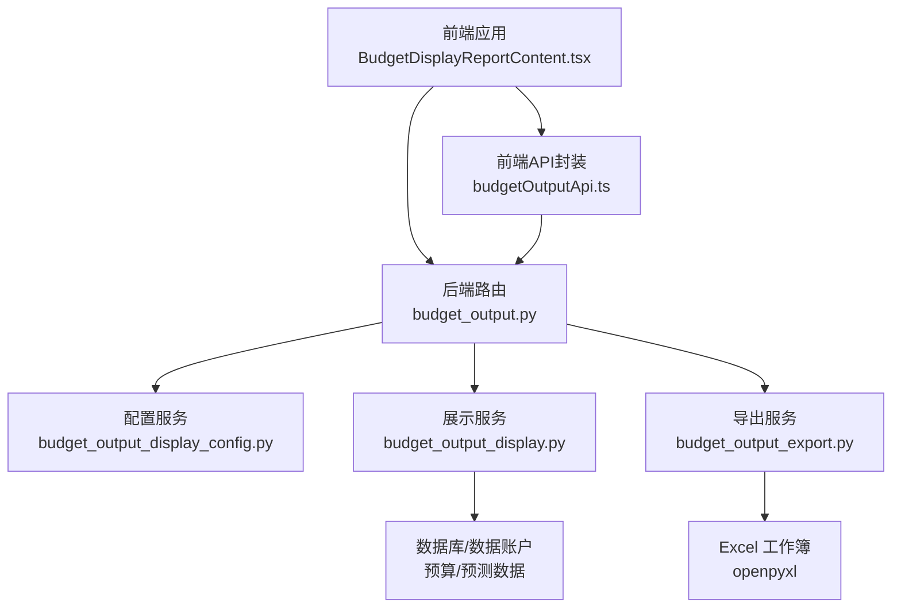
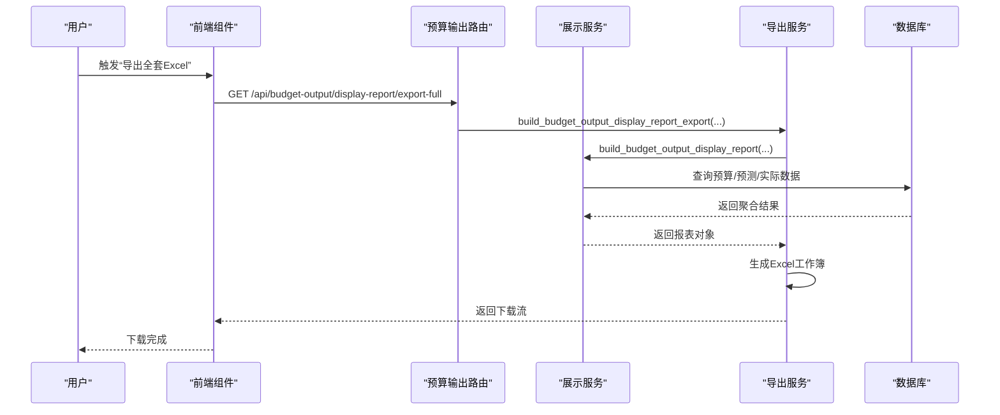
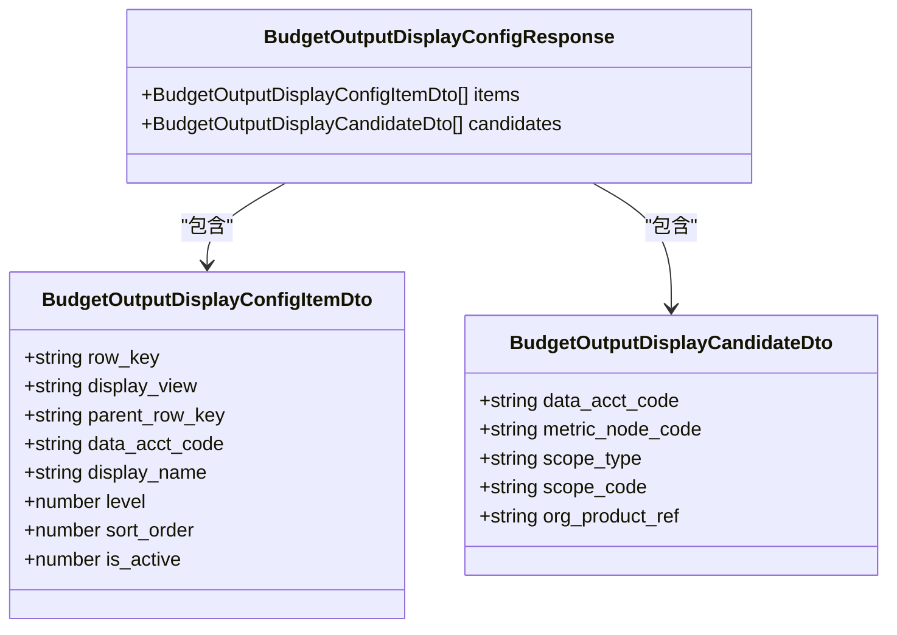
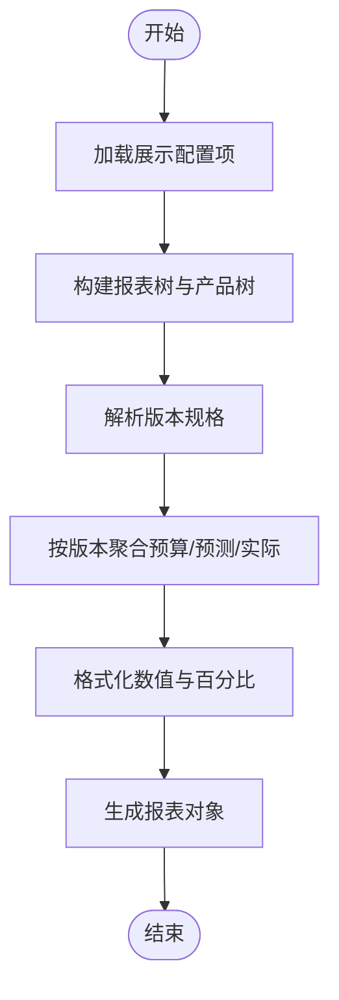
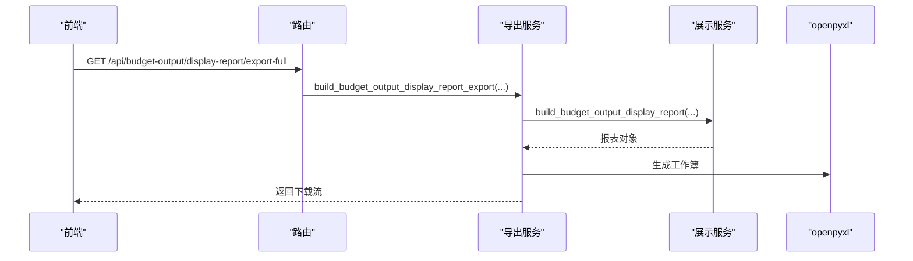
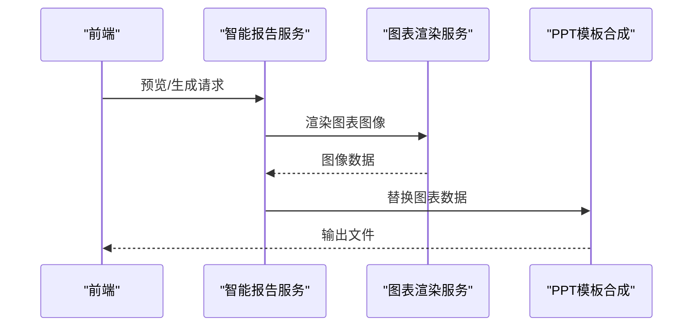
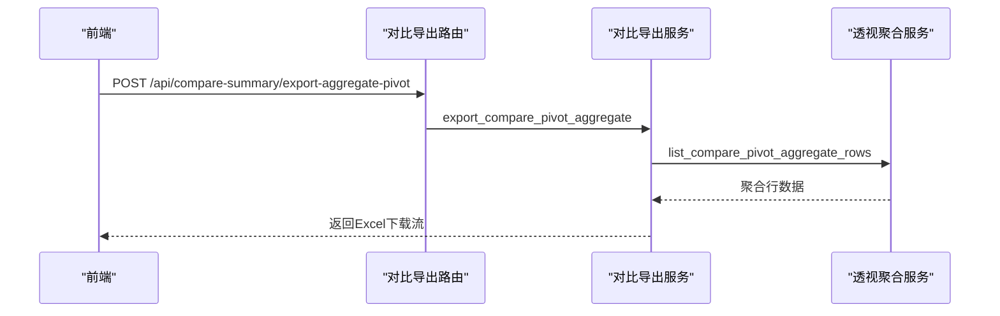
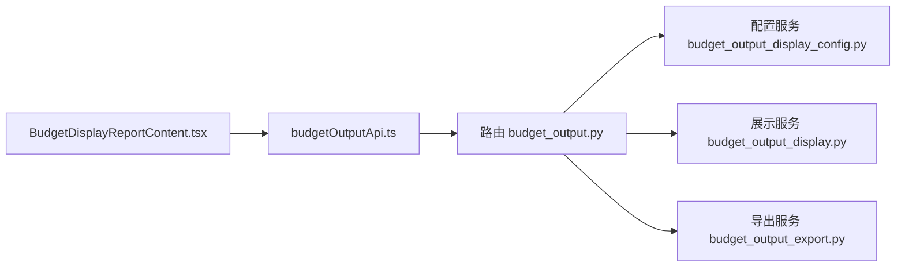

# 预算输出模块

<cite>
**本文档引用的文件**
- [apps/api/app/routers/budget_output.py](file://apps/api/app/routers/budget_output.py)
- [apps/api/app/services/budget_output_display.py](file://apps/api/app/services/budget_output_display.py)
- [apps/api/app/services/budget_output_export.py](file://apps/api/app/services/budget_output_export.py)
- [apps/api/app/services/budget_output_display_config.py](file://apps/api/app/services/budget_output_display_config.py)
- [apps/api/app/schemas.py](file://apps/api/app/schemas.py)
- [apps/web/src/lib/budgetOutputApi.ts](file://apps/web/src/lib/budgetOutputApi.ts)
- [apps/web/src/app/components/BudgetDisplayReportContent.tsx](file://apps/web/src/app/components/BudgetDisplayReportContent.tsx)
- [apps/api/app/services/compare_export_service.py](file://apps/api/app/services/compare_export_service.py)
- [apps/api/app/routers/compare_summary_export.py](file://apps/api/app/routers/compare_summary_export.py)
- [apps/web/src/lib/pivotSummaryApi.ts](file://apps/web/src/lib/pivotSummaryApi.ts)
- [apps/api/app/services/smart_ppt_service.py](file://apps/api/app/services/smart_ppt_service.py)
- [apps/api/app/services/smart_ppt_renderer.py](file://apps/api/app/services/smart_ppt_renderer.py)
- [apps/api/app/services/ppt_template_composer.py](file://apps/api/app/services/ppt_template_composer.py)
- [apps/api/app/services/auth_access_policy.py](file://apps/api/app/services/auth_access_policy.py)
</cite>

## 目录
1. [简介](#简介)
2. [项目结构](#项目结构)
3. [核心组件](#核心组件)
4. [架构总览](#架构总览)
5. [详细组件分析](#详细组件分析)
6. [依赖分析](#依赖分析)
7. [性能考虑](#性能考虑)
8. [故障排除指南](#故障排除指南)
9. [结论](#结论)
10. [附录](#附录)

## 简介
本模块聚焦于“预算输出”能力，覆盖预算展示配置管理、多维度报表生成、数据导出与自定义模板系统。系统通过统一的展示配置驱动，将组织产品指标与预算/预测数据进行映射，形成可灵活组合的报表视图，并支持批量导出为Excel工作簿。同时，模块具备与对比分析、智能PPT等周边能力的集成点，满足管理层报告、部门预算表、对比分析报表等多种输出场景。

## 项目结构
预算输出模块由前后端协同组成：
- 前端负责交互与展示，包括报表筛选、配置导入导出、批量导出触发等。
- 后端提供路由、服务层与数据访问，负责报表构建、导出工作簿生成、配置导入/重建等。

**图表来源**
- [apps/web/src/app/components/BudgetDisplayReportContent.tsx:185-1158](file://apps/web/src/app/components/BudgetDisplayReportContent.tsx#L185-L1158)
- [apps/api/app/routers/budget_output.py:37-163](file://apps/api/app/routers/budget_output.py#L37-L163)
- [apps/api/app/services/budget_output_display.py:1-200](file://apps/api/app/services/budget_output_display.py#L1-L200)
- [apps/api/app/services/budget_output_export.py:1-200](file://apps/api/app/services/budget_output_export.py#L1-L200)
- [apps/api/app/services/budget_output_display_config.py:1-200](file://apps/api/app/services/budget_output_display_config.py#L1-L200)
- [apps/web/src/lib/budgetOutputApi.ts:1-240](file://apps/web/src/lib/budgetOutputApi.ts#L1-L240)

**章节来源**
- [apps/web/src/app/components/BudgetDisplayReportContent.tsx:185-1158](file://apps/web/src/app/components/BudgetDisplayReportContent.tsx#L185-L1158)
- [apps/api/app/routers/budget_output.py:37-163](file://apps/api/app/routers/budget_output.py#L37-L163)

## 核心组件
- 展示配置管理：提供配置项的增删改查、候选指标加载、配置导出模板、从组织产品指标或Excel重建配置的能力。
- 报表渲染引擎：根据配置与版本信息，聚合预算/预测/实际数据，构建树形报表节点与行集合。
- 导出工作簿：将报表转换为Excel，包含标题、版本区、表头与数据区，支持公式引用与单元格格式化。
- 自定义模板系统：与智能PPT/报告模板能力联动，支持图表嵌入与动态渲染。
- 权限控制：基于路径与角色的访问策略，保障预算输出接口的安全性。

**章节来源**
- [apps/api/app/services/budget_output_display_config.py:75-120](file://apps/api/app/services/budget_output_display_config.py#L75-L120)
- [apps/api/app/services/budget_output_display.py:126-176](file://apps/api/app/services/budget_output_display.py#L126-L176)
- [apps/api/app/services/budget_output_export.py:38-136](file://apps/api/app/services/budget_output_export.py#L38-L136)
- [apps/api/app/services/smart_ppt_service.py:767-838](file://apps/api/app/services/smart_ppt_service.py#L767-L838)
- [apps/api/app/services/auth_access_policy.py:67-97](file://apps/api/app/services/auth_access_policy.py#L67-L97)

## 架构总览
预算输出模块采用“路由-服务-数据”的分层设计：
- 路由层：暴露REST接口，处理请求参数与响应包装。
- 服务层：实现业务逻辑，包括配置管理、报表构建、导出工作簿生成。
- 数据层：读写SQLite数据库，结合预算/预测数据与组织产品指标映射。

**图表来源**
- [apps/api/app/routers/budget_output.py:143-160](file://apps/api/app/routers/budget_output.py#L143-L160)
- [apps/api/app/services/budget_output_export.py:875-903](file://apps/api/app/services/budget_output_export.py#L875-L903)
- [apps/api/app/services/budget_output_display.py:1349-1365](file://apps/api/app/services/budget_output_display.py#L1349-L1365)
- [apps/web/src/lib/budgetOutputApi.ts:224-228](file://apps/web/src/lib/budgetOutputApi.ts#L224-L228)

**章节来源**
- [apps/api/app/routers/budget_output.py:127-160](file://apps/api/app/routers/budget_output.py#L127-L160)
- [apps/api/app/services/budget_output_export.py:875-903](file://apps/api/app/services/budget_output_export.py#L875-L903)

## 详细组件分析

### 展示配置管理
- 配置项模型与DTO：定义展示配置项、候选指标、导入响应等数据结构。
- 配置操作：查询、创建、更新、删除；支持导出模板与Excel导入重建。
- 候选指标：基于数据账户与指标节点，提供可选绑定项。
- 重建策略：优先从预算数据库中的有效编码重建，否则回退至指标树。

**图表来源**
- [apps/api/app/schemas.py:82-118](file://apps/api/app/schemas.py#L82-L118)
- [apps/api/app/schemas.py:51-80](file://apps/api/app/schemas.py#L51-L80)

**章节来源**
- [apps/api/app/services/budget_output_display_config.py:75-120](file://apps/api/app/services/budget_output_display_config.py#L75-L120)
- [apps/api/app/services/budget_output_display_config.py:142-200](file://apps/api/app/services/budget_output_display_config.py#L142-L200)
- [apps/api/app/routers/budget_output.py:47-83](file://apps/api/app/routers/budget_output.py#L47-L83)

### 报表渲染引擎
- 报表树构建：将配置项转为树形节点，支持层级排序与父子关系。
- 产品树构建：按产品维度组织节点，便于分组与展开。
- 版本规格：区分“show/预算/预测/可编辑”，并按默认选择生成列。
- 聚合与格式化：按月/年聚合值，计算差异与格式化百分比。

**图表来源**
- [apps/api/app/services/budget_output_display.py:98-176](file://apps/api/app/services/budget_output_display.py#L98-L176)
- [apps/api/app/services/budget_output_display.py:178-200](file://apps/api/app/services/budget_output_display.py#L178-L200)

**章节来源**
- [apps/api/app/services/budget_output_display.py:98-176](file://apps/api/app/services/budget_output_display.py#L98-L176)
- [apps/api/app/services/budget_output_display.py:178-200](file://apps/api/app/services/budget_output_display.py#L178-L200)

### 导出工作簿与批量导出
- 列规范：定义列类型（年/月/比率/同比等），支持版本列与产品列。
- 公式转换：将公式中的引用转换为Excel单元格引用，缺失引用以注释形式提示。
- 单元格样式：标题、分组、版本、表头与交替行色填充。
- 批量导出：一次性导出整套报表，包含多个工作表与版本信息。

**图表来源**
- [apps/api/app/routers/budget_output.py:143-160](file://apps/api/app/routers/budget_output.py#L143-L160)
- [apps/api/app/services/budget_output_export.py:875-903](file://apps/api/app/services/budget_output_export.py#L875-L903)

**章节来源**
- [apps/api/app/services/budget_output_export.py:38-136](file://apps/api/app/services/budget_output_export.py#L38-L136)
- [apps/api/app/services/budget_output_export.py:875-903](file://apps/api/app/services/budget_output_export.py#L875-L903)

### 自定义模板系统与图表集成
- 模板变量解析：根据模板与参数解析变量，支持预览与生成。
- 图表渲染：支持折线、柱状、环形等图表类型，按系列与标签生成图像。
- PPT模板合成：将图表数据替换到PPT模板中，生成可下载的演示文稿。

**图表来源**
- [apps/api/app/services/smart_ppt_service.py:767-838](file://apps/api/app/services/smart_ppt_service.py#L767-L838)
- [apps/api/app/services/smart_ppt_renderer.py:224-245](file://apps/api/app/services/smart_ppt_renderer.py#L224-L245)
- [apps/api/app/services/ppt_template_composer.py:175-203](file://apps/api/app/services/ppt_template_composer.py#L175-L203)

**章节来源**
- [apps/api/app/services/smart_ppt_service.py:767-838](file://apps/api/app/services/smart_ppt_service.py#L767-L838)
- [apps/api/app/services/smart_ppt_renderer.py:224-245](file://apps/api/app/services/smart_ppt_renderer.py#L224-L245)
- [apps/api/app/services/ppt_template_composer.py:175-203](file://apps/api/app/services/ppt_template_composer.py#L175-L203)

### 对比分析导出（扩展能力）
- 对比聚合：支持按行/列/页字段聚合，生成对比透视结果。
- 导出适配：提供对比聚合导出接口，返回Excel下载流。

**图表来源**
- [apps/api/app/routers/compare_summary_export.py:10-20](file://apps/api/app/routers/compare_summary_export.py#L10-L20)
- [apps/api/app/services/compare_export_service.py:14-33](file://apps/api/app/services/compare_export_service.py#L14-L33)
- [apps/web/src/lib/pivotSummaryApi.ts:90-100](file://apps/web/src/lib/pivotSummaryApi.ts#L90-L100)

**章节来源**
- [apps/api/app/routers/compare_summary_export.py:10-20](file://apps/api/app/routers/compare_summary_export.py#L10-L20)
- [apps/api/app/services/compare_export_service.py:14-33](file://apps/api/app/services/compare_export_service.py#L14-L33)
- [apps/web/src/lib/pivotSummaryApi.ts:90-100](file://apps/web/src/lib/pivotSummaryApi.ts#L90-L100)

## 依赖分析
- 路由依赖：预算输出路由依赖配置服务、展示服务与导出服务。
- 展示服务依赖：使用预算版本、产品树、指标节点与运行时引用。
- 导出服务依赖：依赖展示服务输出的报表对象与运行时引用映射。
- 前端依赖：BudgetDisplayReportContent通过budgetOutputApi调用后端接口。

**图表来源**
- [apps/api/app/routers/budget_output.py:37-163](file://apps/api/app/routers/budget_output.py#L37-L163)
- [apps/api/app/services/budget_output_display.py:1-200](file://apps/api/app/services/budget_output_display.py#L1-L200)
- [apps/api/app/services/budget_output_export.py:1-200](file://apps/api/app/services/budget_output_export.py#L1-L200)
- [apps/web/src/app/components/BudgetDisplayReportContent.tsx:185-1158](file://apps/web/src/app/components/BudgetDisplayReportContent.tsx#L185-L1158)
- [apps/web/src/lib/budgetOutputApi.ts:192-239](file://apps/web/src/lib/budgetOutputApi.ts#L192-L239)

**章节来源**
- [apps/api/app/routers/budget_output.py:37-163](file://apps/api/app/routers/budget_output.py#L37-L163)
- [apps/web/src/lib/budgetOutputApi.ts:192-239](file://apps/web/src/lib/budgetOutputApi.ts#L192-L239)

## 性能考虑
- 数据库连接与事务：在服务层按需打开连接，避免长事务；对批量导入/导出使用异步上下文。
- 报表构建：树构建与排序在内存中完成，注意节点数量与层级深度；必要时分页或延迟展开。
- 导出工作簿：使用流式响应减少内存占用；公式转换与样式设置按需应用。
- 缓存与复用：对运行时引用映射与候选指标进行缓存，避免重复查询。
- 并发与限流：对外接口可结合会话与权限策略进行并发控制。

## 故障排除指南
- 导出失败：检查后端日志与异常状态码；确认版本选择、产品过滤与数据可用性。
- 配置导入错误：校验Excel格式与字段；查看导入响应中的保存条数与错误提示。
- 权限不足：核对路径所需权限与当前会话角色；确保非首次登录用户已完成密码修改流程。
- 图表渲染异常：检查图表类型是否受支持，系列数据是否为空或数值异常。

**章节来源**
- [apps/api/app/routers/budget_output.py:44-46](file://apps/api/app/routers/budget_output.py#L44-L46)
- [apps/api/app/services/budget_output_display_config.py:104-120](file://apps/api/app/services/budget_output_display_config.py#L104-L120)
- [apps/api/app/services/auth_access_policy.py:67-97](file://apps/api/app/services/auth_access_policy.py#L67-L97)

## 结论
预算输出模块通过“配置驱动+版本聚合+工作簿导出”的架构，实现了灵活的多维度预算报表与批量导出能力。配合对比分析与智能PPT模板系统，能够满足管理层报告、部门预算表、对比分析报表等多样化场景。建议在生产环境中强化权限控制、监控导出耗时与资源占用，并持续优化树构建与公式转换性能。

## 附录

### 输出场景示例
- 管理层报告：选择“show”版本与目标年份，导出整套报表，自动包含历史实际与预算/预测对比。
- 部门预算表：按产品维度筛选，仅展示该部门相关的行与列，导出Excel便于审阅与归档。
- 对比分析报表：使用对比聚合导出，快速生成跨年度/跨版本的对比透视表。

### 与业务模块的数据集成
- 组织产品指标：通过运行时引用与指标节点绑定，实现预算/预测数据的自动映射。
- 预算/预测数据：按版本与月份聚合，支持“show/预算/预测/可编辑”多种模式。
- 对比分析：与对比导出服务协作，提供跨期对比视图。

### 展示定制与权限控制
- 展示定制：通过配置项的层级、排序与显示视图，灵活调整报表结构。
- 权限控制：基于路径与角色的访问策略，限制对预算输出接口的访问与操作。